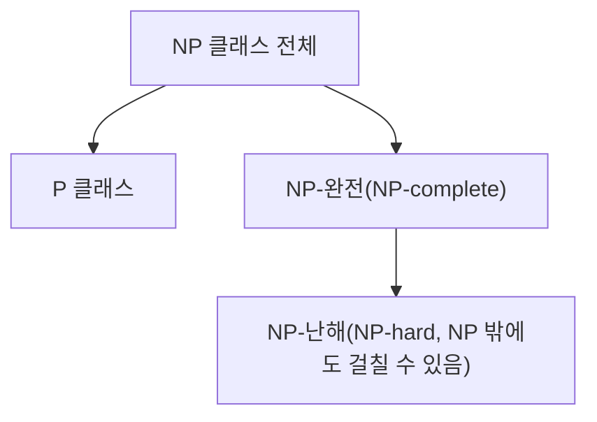

<Callout type="info">
  **이번 문서의 목표:** 이 문서를 다 읽으면 P·NP·NP-완전·NP-난해의 정의를 정확히 구분해 설명할 수 있고, 대표적인 NP-완전 문제 이름과 환원의 기본 개념을 시험 수준에서 판별할 수 있다.
</Callout>

## 왜 필요한가 — "풀 수 있다"와 "빨리 풀 수 있다"는 다르다

지금까지 배운 정렬·탐색·그래프 알고리즘은 모두 입력 크기 `n`에 대해 다항식 형태(`O(n)`, `O(n log n)`, `O(n^2)` 등)의 시간이 걸리는, **효율적으로 풀리는** 문제였다. 그런데 세상의 모든 문제가 이렇게 효율적으로 풀리는 것은 아니다. 예를 들어 "여러 도시를 한 번씩만 방문하고 출발지로 돌아오는 최단 경로를 찾아라"(외판원 문제, TSP)는 도시 수가 늘어날수록 답을 구하는 데 걸리는 시간이 폭발적으로 늘어나며, 지금까지 이 문제를 다항 시간에 정확히 푸는 방법은 발견되지 않았다.

**계산 복잡도 이론**(computational complexity theory)은 "어떤 문제가 원리적으로 효율적으로 풀릴 수 있는가"를 다루는 분야다. 독학사 4단계 시험에서는 이 분야의 증명 테크닉까지 요구하지는 않지만, **P·NP·NP-완전·NP-난해라는 용어의 정의와 서로의 관계를 정확히 구분하는 개념 문제**가 꾸준히 출제된다.

> **쉽게 말하면:** 지금까지는 "이 문제를 어떻게 빨리 풀까"를 배웠다면, 이 편은 "이 문제가 애초에 빨리 풀리는 부류에 속하는가"를 판별하는 틀을 배우는 것이다.

## 결정 문제와 다항시간 알고리즘

계산 복잡도 이론은 편의상 문제를 **결정 문제**(decision problem, 답이 "예" 또는 "아니오"로만 나오는 문제) 형태로 다룬다. 예를 들어 "이 그래프에 크기 `k` 이상의 정점 커버가 존재하는가?"처럼 원래 최적화 문제(정점 커버의 최소 크기를 구하라)를 "예/아니오로 답할 수 있는 질문"으로 바꿔서 다룬다. 이렇게 바꾸는 이유는 최적화 문제와 결정 문제의 어려움이 본질적으로 같은 경우가 많아서, 결정 문제 형태로 이론을 통일해 다루는 것이 수학적으로 더 다루기 쉽기 때문이다.

**다항시간 알고리즘**(polynomial-time algorithm)은 입력 크기 `n`에 대해 실행 시간이 `O(n^k)`(`k`는 어떤 고정된 상수) 형태로 표현되는 알고리즘이다. 이 과목에서 배운 정렬(`O(n log n)`), 그래프 순회(`O(V+E)`), 최단경로(`O(V^2)`나 `O(E log V)`) 알고리즘은 모두 다항시간 알고리즘이다. 계산 복잡도 이론에서는 관례적으로 다항시간 알고리즘이 존재하는 문제를 "효율적으로 풀 수 있는 문제"로 취급한다.

> **자주 틀리는 점:** `O(n^100)`도 형식적으로는 다항시간이지만 실제로는 매우 느리고, `O(1.0001^n)`도 지수 함수이지만 `n`이 작을 때는 다항시간 알고리즘보다 빠를 수 있다. 계산 복잡도 이론의 "효율적"이라는 말은 실제 체감 속도가 아니라 **입력이 커질 때의 이론적 증가 추세**를 기준으로 한 정의라는 점을 구분해야 한다.

## P 클래스 — 다항시간에 풀리는 문제들의 모임

**P 클래스**(class P, Polynomial의 앞 글자를 딴 이름)는 **결정론적 알고리즘으로 다항시간 안에 풀 수 있는 결정 문제들의 집합**이다. 여기서 "결정론적"(deterministic)이란 같은 입력에 대해 항상 같은 절차를 밟아 같은 결과를 내는, 우리가 지금까지 다룬 보통의 알고리즘을 말한다.

- 예: "정렬된 배열에서 특정 값이 존재하는가?"(이진 탐색, `O(log n)`), "그래프에 특정 두 정점을 잇는 경로가 존재하는가?"(BFS/DFS, `O(V+E)`), "그래프가 이분 그래프인가?"(BFS로 색칠, `O(V+E)`) 등은 모두 P에 속한다.

## NP 클래스 — "검증은 빠르게 되는" 문제들의 모임

**NP 클래스**(class NP, Nondeterministic Polynomial time의 줄임말)는 **어떤 후보 답(증거, certificate)이 주어졌을 때, 그 답이 맞는지를 다항시간 안에 검증할 수 있는 결정 문제들의 집합**이다. 여기서 핵심은 "답을 찾는 것"이 아니라 "주어진 답이 맞는지 확인하는 것"이 빠르다는 정의라는 점이다.

예를 들어 **해밀턴 사이클 문제**("이 그래프에 모든 정점을 정확히 한 번씩 방문하고 시작점으로 돌아오는 사이클이 존재하는가?")를 생각해 보자. 이 문제의 답(사이클)을 처음부터 찾으려면 가능한 모든 정점 순서를 다 시도해야 할 수도 있어 매우 오래 걸릴 수 있다. 하지만 누군가 "이 순서가 해밀턴 사이클입니다"라고 후보를 하나 제시하면, 그 순서가 정말로 모든 정점을 한 번씩 방문하고 인접한 정점끼리만 연결되어 있는지는 정점 개수만큼만 확인하면 되므로 `O(V)`(다항시간)에 검증할 수 있다. 이렇게 "검증이 빠른" 성질을 가진 문제가 NP에 속한다.

> **자주 틀리는 점(가장 흔한 오개념):** NP를 "Not Polynomial"(다항시간이 아니다)의 줄임말로 잘못 아는 경우가 많다. 실제로는 **Nondeterministic Polynomial**(비결정론적 다항시간)의 줄임말이며, "답을 검증하는 데 다항시간이 걸린다"는 뜻이다. 또한 **P에 속하는 모든 문제는 NP에도 속한다**(`P ⊆ NP`). 다항시간에 스스로 풀 수 있는 문제라면, 답을 검증하는 것도 당연히 다항시간 안에 가능하기 때문이다(그냥 처음부터 다시 풀어서 확인하면 된다).

이 그림은 관계의 방향을 보여주기 위한 것으로, 실제로는 P와 NP-완전이 서로 겹치는지(`P = NP`인지)는 아직 증명되지 않은 **미해결 문제**다. 대부분의 학자들은 `P ≠ NP`(P가 NP의 진부분집합)일 것이라고 추측하지만, 2026년 현재까지 수학적으로 증명되지 않았다.

## NP-완전과 NP-난해 — 가장 어려운 문제들

**NP-완전**(NP-complete)은 NP 클래스에 속한 문제들 중에서도 **가장 어려운 문제들의 부류**다. 정확한 정의는 두 조건을 모두 만족하는 문제다.

1. 그 문제가 NP에 속한다(답을 다항시간에 검증할 수 있다).
2. NP에 속한 **다른 모든 문제**를 이 문제로 다항시간 안에 **환원**(reduction)할 수 있다.

**NP-난해**(NP-hard)는 조건 2만 만족하는 문제들의 부류다. 즉 NP의 다른 모든 문제를 이 문제로 환원할 수 있을 만큼 어렵지만, 정작 자기 자신은 NP에 속하는지(답을 다항시간에 검증할 수 있는지)는 따지지 않는다. 그래서 NP-난해 문제 중에는 결정 문제가 아니거나, NP보다 더 어려운 문제도 포함될 수 있다.

> **쉽게 말하면:** NP-완전은 "NP 세계 안에서 가장 어려운 문제"이고, NP-난해는 "적어도 NP 세계에서 가장 어려운 문제만큼 어려운 문제"다. NP-완전은 항상 NP-난해에 속하지만, NP-난해라고 해서 항상 NP-완전인 것은 아니다.

## 다항시간 환원 — 문제 사이의 난이도를 비교하는 도구

**환원**(reduction)은 "문제 A를 문제 B로 바꿔서 풀 수 있다"는 것을 보이는 절차다. **다항시간 환원**(polynomial-time reduction)은 문제 A의 어떤 입력이든 다항시간 안에 문제 B의 입력으로 변환할 수 있고, 그렇게 변환된 문제 B를 풀면 원래 문제 A의 답도 알 수 있다는 뜻이다. 이를 기호로 `A ≤p B`(A가 B로 다항시간 환원된다)라고 쓴다.

환원이 중요한 이유는 다음 두 가지 추론을 가능하게 하기 때문이다.

- 만약 `A ≤p B`이고 **B가 다항시간에 풀린다면, A도 다항시간에 풀린다**(B를 푸는 다항시간 알고리즘에 A를 B로 바꾸는 변환만 추가하면 되므로).
- 반대로 `A ≤p B`이고 **A가 어렵다고(NP-완전이라고) 이미 알려져 있다면, B도 최소한 A만큼 어렵다**는 것을 보일 수 있다.

이 두 번째 추론이 바로 새로운 문제가 NP-완전임을 증명하는 표준적인 방법이다. **이미 NP-완전으로 알려진 문제를 새 문제로 환원할 수 있음을 보이면, 새 문제도 NP-완전이라는 결론을 얻는다.**

역사적으로 이 사슬의 첫 출발점이 된 문제가 **SAT**(불 만족성 문제, Boolean satisfiability problem)로, "주어진 불 논리식을 참으로 만드는 변수 할당이 존재하는가?"를 묻는 문제다. **쿡-레빈 정리**(Cook-Levin theorem)는 SAT가 NP-완전임을 최초로 증명한 정리로, 이후 수많은 문제들이 "SAT를 이 문제로 환원할 수 있다"는 방식으로 줄줄이 NP-완전임이 밝혀졌다.

## 대표적인 NP-완전 문제

독학사 시험에서는 각 문제의 증명 과정보다 **문제 이름과 정의를 알아보는 수준**이 요구된다. 자주 등장하는 대표 NP-완전 문제는 다음과 같다.

| 문제 | 정의 | 참고 |
|------|------|------|
| SAT(불 만족성 문제) | 불 논리식을 참으로 만드는 변수 할당이 존재하는가 | 최초로 NP-완전이 증명된 문제(쿡-레빈 정리) |
| 정점 커버(vertex cover) | 그래프의 모든 간선을 덮는 크기 `k` 이하의 정점 집합이 존재하는가 | 크기가 정해진 결정 문제 형태 |
| 해밀턴 사이클(Hamiltonian cycle) | 모든 정점을 한 번씩 방문하고 돌아오는 사이클이 존재하는가 | 외판원 문제(TSP)의 결정 문제 버전과 밀접 |
| 외판원 문제(TSP, 결정 문제 버전) | 모든 도시를 방문하고 돌아오는 총 거리 `k` 이하의 경로가 존재하는가 | 최적화 버전(최소 거리를 구하라)과 구분 |
| 배낭 문제(결정 문제 버전) | 무게 한도 안에서 가치 `k` 이상을 담는 조합이 존재하는가 | 17편의 최적화 버전(최대 가치를 구하라)과 구분 |
| 그래프 색칠(graph coloring) | `k`개의 색으로 인접한 정점끼리 다른 색이 되게 칠할 수 있는가 | `k=2`(이분 그래프 판별)는 P에 속함에 유의 |

> **자주 틀리는 점:** 그래프 색칠 문제에서 "2색으로 칠할 수 있는가"(이분 그래프 판별)는 **P에 속하는 문제**(BFS/DFS로 다항시간에 판별 가능)이지만, "3색 이상으로 칠할 수 있는가"는 **NP-완전**이다. 이처럼 문제의 조건을 살짝 바꾸는 것만으로 난이도 클래스가 완전히 달라질 수 있으므로, "그래프 색칠은 무조건 NP-완전"이라고 단순 암기하면 함정 문제에서 틀리기 쉽다.

## 자주 나오는 개념 판별·오개념 정리

- **NP는 "다항시간에 풀 수 없는 문제"가 아니다.** NP는 "답을 검증하는 데 다항시간이 걸리는 문제"의 집합이며, P에 속한 문제도 당연히 NP에 속한다.
- **NP-완전 문제가 다항시간에 풀 수 없다고 증명된 것은 아니다.** `P = NP`인지는 미해결 문제이며, 만약 언젠가 어떤 NP-완전 문제 하나라도 다항시간 알고리즘이 발견되면 환원 관계에 의해 **모든 NP 문제가 다항시간에 풀린다**는 것이 증명된다. 이것이 P vs NP 문제가 중요한 이유다.
- **NP-난해는 결정 문제가 아닐 수도 있다.** 예를 들어 "이 그래프의 최적 정점 커버는 몇 개인가"처럼 숫자를 직접 구하는 최적화 문제도 NP-난해라고 부를 수 있지만, 결정 문제가 아니므로 NP에 속하는지는 별도로 따지지 않는다.
- **환원의 방향에 주의한다.** `A ≤p B`는 "A를 B로 바꿔 풀 수 있다"는 뜻이며, 이는 "B가 A보다 어렵거나 같다"는 의미다. 방향을 거꾸로 읽으면 추론이 뒤집힌다.

## 핵심 정리

- 결정 문제는 답이 "예/아니오"로만 나오는 문제 형태이며, 다항시간 알고리즘은 `O(n^k)` 형태로 시간이 걸리는 알고리즘이다.
- P는 다항시간에 직접 풀 수 있는 문제, NP는 답을 다항시간에 검증할 수 있는 문제의 집합이며 `P ⊆ NP`가 성립한다.
- NP-완전은 NP에 속하면서 NP의 다른 모든 문제를 다항시간 환원으로 받아낼 수 있는, NP 안에서 가장 어려운 문제다. NP-난해는 그 환원 조건만 만족하고 NP 소속 여부는 따지지 않는 더 넓은 개념이다.
- 다항시간 환원(`A ≤p B`)은 새로운 문제가 NP-완전임을 증명하는 표준 도구이며, SAT가 쿡-레빈 정리로 최초의 NP-완전 문제임이 증명된 이후 여러 문제가 연쇄적으로 NP-완전임이 밝혀졌다.
- `P = NP`인지는 아직 증명되지 않은 미해결 문제이며, NP는 "Not Polynomial"이 아니라 "Nondeterministic Polynomial"의 줄임말이라는 점이 시험에서 자주 나오는 함정이다.

## 마무리 복습

<Quiz
  questionNumber={1}
  question="NP 클래스에 대한 설명으로 옳은 것은?"
  options={['다항시간에 절대 풀 수 없다고 증명된 문제들의 집합이다', '어떤 후보 답이 주어졌을 때 그것이 맞는지 다항시간에 검증할 수 있는 문제들의 집합이다', 'P 클래스와 서로 겹치는 원소가 전혀 없는 집합이다', 'NP는 Not Polynomial의 줄임말이다']}
  correctAnswer={2}
  explanation="NP는 Nondeterministic Polynomial time의 줄임말로, 주어진 후보 답이 맞는지를 다항시간 안에 검증할 수 있는 결정 문제들의 집합을 뜻한다."
  optionExplanations={['NP-완전이 다항시간에 풀 수 없다고 증명된 것은 아니며, P=NP 여부는 여전히 미해결 문제다.', '정답. NP의 정의는 검증의 다항시간성이다.', 'P에 속하는 모든 문제는 NP에도 속하므로(P ⊆ NP) 서로 겹친다.', 'NP는 Not Polynomial이 아니라 Nondeterministic Polynomial의 줄임말이다.']}
/>

<Quiz
  questionNumber={2}
  question="P 클래스와 NP 클래스의 관계로 옳은 것은?"
  options={['P와 NP는 서로 아무 관련이 없는 별개의 집합이다', 'P에 속하는 모든 문제는 NP에도 속한다', 'NP에 속하는 모든 문제는 반드시 P에도 속한다', 'P는 NP보다 항상 더 큰 집합이다']}
  correctAnswer={2}
  explanation="다항시간에 스스로 풀 수 있는 문제는, 그 알고리즘으로 다시 풀어 확인하는 것 자체가 다항시간 검증이 되므로 P에 속하는 모든 문제는 NP에도 속한다(P ⊆ NP). 다만 그 역(NP ⊆ P)이 성립하는지는 아직 증명되지 않았다."
  optionExplanations={['P는 NP의 부분집합 관계로 알려져 있어 서로 무관하지 않다.', '정답. 다항시간에 풀 수 있는 문제는 그 자체로 검증도 다항시간에 가능하므로 P는 NP에 포함된다.', '이것이 성립하는지(P=NP인지)는 아직 증명되지 않은 미해결 문제다.', 'NP가 P를 포함하는 더 큰(또는 같은) 집합으로 알려져 있어 반대로 서술되었다.']}
/>

<Quiz
  questionNumber={3}
  question="문제 A가 문제 B로 다항시간 환원 가능하다(A ≤p B)는 것이 의미하는 바로 옳은 것은?"
  options={['A와 B는 완전히 같은 문제다', 'A의 입력을 다항시간에 B의 입력으로 바꿀 수 있고, B를 풀면 A의 답도 알 수 있다', 'B가 A보다 항상 쉬운 문제라는 뜻이다', 'A는 NP에 속하지 않는다는 뜻이다']}
  correctAnswer={2}
  explanation="다항시간 환원은 A의 임의의 입력을 다항시간 안에 B의 입력 형태로 변환할 수 있고, 변환된 B의 답으로부터 원래 A의 답을 알아낼 수 있음을 뜻한다. 이는 B가 A와 같거나 A보다 어렵다는 것을 시사한다."
  optionExplanations={['환원은 두 문제가 같음을 뜻하지 않고, 한 문제를 다른 문제로 바꿔 풀 수 있음을 뜻한다.', '정답. 환원의 정의는 입력 변환과 답의 대응 관계다.', '환원 관계는 오히려 B가 A만큼 어렵거나 더 어렵다는 것을 보이는 데 쓰인다.', '환원 가능 여부와 NP 소속 여부는 별개의 개념이다.']}
/>

<Quiz
  questionNumber={4}
  question="새로운 문제 X가 NP-완전임을 증명하는 표준적인 방법으로 가장 적절한 것은?"
  options={['X를 최대한 빠른 알고리즘으로 직접 풀어 실행 시간을 측정한다', '이미 NP-완전으로 알려진 문제를 X로 다항시간 환원할 수 있음을 보이고, X가 NP에 속함을 함께 보인다', 'X의 입력 크기를 최대한 줄여서 문제를 단순화한다', 'X를 P 클래스의 어떤 문제와 비교해 실행 시간이 비슷한지 확인한다']}
  correctAnswer={2}
  explanation="NP-완전 증명의 표준 절차는 (1) X가 NP에 속함을 보이고(후보 답을 다항시간에 검증 가능함을 확인), (2) 이미 NP-완전으로 알려진 문제를 X로 다항시간 환원할 수 있음을 보이는 것이다."
  optionExplanations={['실행 시간을 실측하는 것은 이론적 증명이 아니며 NP-완전성의 정의와 무관하다.', '정답. NP 소속 증명과 기존 NP-완전 문제로부터의 환원이 표준 증명 절차다.', '입력 크기를 줄이는 것은 증명 방법이 아니다.', '실행 시간 비교는 이론적 난이도 클래스를 증명하는 방법이 아니다.']}
/>

<Quiz
  questionNumber={5}
  question="NP-완전과 NP-난해의 차이에 대한 설명으로 옳은 것은?"
  options={['NP-완전은 NP-난해보다 항상 쉬운 문제 부류다', 'NP-완전은 NP에 속하면서 환원 조건도 만족해야 하지만, NP-난해는 NP 소속 여부와 무관하게 환원 조건만 만족하면 된다', '두 용어는 완전히 같은 의미로 혼용해도 무방하다', 'NP-난해 문제는 모두 결정 문제여야 한다']}
  correctAnswer={2}
  explanation="NP-완전은 NP에 속함과 동시에 NP의 다른 모든 문제를 환원받을 수 있어야 하는 반면, NP-난해는 그 환원 조건만 만족하면 되고 NP에 속하는지는 따지지 않는 더 넓은 개념이다."
  optionExplanations={['NP-완전은 NP-난해의 부분집합이므로 오히려 NP-완전이 더 좁고 강한 조건이다.', '정답. NP 소속 여부가 두 개념을 가르는 핵심 차이다.', '두 용어는 조건이 다르므로 혼용할 수 없다.', 'NP-난해는 결정 문제가 아닌 최적화 문제에도 적용될 수 있다.']}
/>

<Quiz
  questionNumber={6}
  question="그래프 색칠 문제에 대한 설명으로 옳은 것은?"
  options={['몇 색으로 칠하든 항상 NP-완전이다', '2색으로 칠할 수 있는지 판별하는 것은 P에 속하지만, 3색 이상은 일반적으로 NP-완전으로 알려져 있다', '그래프 색칠 문제는 결정 문제로 만들 수 없다', '2색 판별 문제는 NP에 속하지 않는다']}
  correctAnswer={2}
  explanation="2색 판별(이분 그래프 판별)은 BFS나 DFS로 다항시간에 판별할 수 있어 P에 속하지만, 3색 이상으로 칠할 수 있는지 판별하는 문제는 일반적으로 NP-완전으로 알려져 있다. 조건을 조금만 바꿔도 난이도 클래스가 달라지는 대표 사례다."
  optionExplanations={['2색 판별은 예외적으로 P에 속하므로 항상 NP-완전이라는 서술은 틀렸다.', '정답. 색의 개수에 따라 난이도 클래스가 달라지는 것이 이 문제의 함정 포인트다.', '색의 개수를 정해 놓고 예/아니오로 물으면 얼마든지 결정 문제 형태로 만들 수 있다.', 'P에 속하는 문제는 모두 NP에도 속하므로 2색 판별 역시 NP에 속한다.']}
/>

## 참고 자료

- [국가평생교육진흥원 독학학위제 학습정보](https://bdes.nile.or.kr) — 계산 복잡도 개요 항목의 출제 수준(정의·판별 중심) 확인.
- [NIST, Dictionary of Algorithms and Data Structures — NP-complete](https://csrc.nist.gov) — NP-완전·NP-난해 등 계산 복잡도 용어의 표준 정의 참고.
