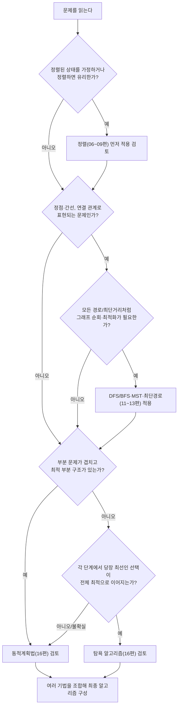

<Callout type="info">
  **이번 문서의 목표:** 이 문서를 다 읽으면 한 문제 안에 여러 알고리즘 기법이 섞여 있을 때 어떤 기법을 먼저 적용하고 어떤 순서로 결합해야 하는지 스스로 판단할 수 있고, 그 과정을 의사코드 수준에서 추적해 복잡도까지 계산할 수 있다.
</Callout>

## 왜 필요한가 — 시험 문제는 한 단원으로 끝나지 않는다

지금까지는 정렬(06~09편), 탐색(10편), 그래프(11~13편), 설계 기법(15~17편)을 각각 독립된 단원으로 배웠다. 하지만 실제 독학사 4단계 시험에서는 "정렬해 둔 다음 이진 탐색으로 찾아라", "그래프의 최단경로를 구한 뒤 그 값을 동적계획법의 입력으로 써라"처럼 **두세 개의 기법이 한 문제 안에서 이어지는 종합 문제**가 자주 출제된다. 각 기법을 따로 알고 있어도, 어떤 순서로 어떻게 이어 붙여야 하는지 판단하지 못하면 풀 수 없다.

이 편은 새로운 알고리즘을 배우는 편이 아니라, **이미 배운 알고리즘들을 조합하는 감각**을 기르는 편이다.

> **쉽게 말하면:** 지금까지 배운 게 각 과목 시험이었다면, 이 편은 그 과목들을 섞어서 내는 "종합 모의고사"에 대비하는 편이다.

## 알고리즘 선택 흐름도 — 문제를 보고 무엇을 먼저 떠올릴까

문제를 처음 읽었을 때 어떤 기법을 검토해야 하는지 판단하는 대략적인 흐름은 다음과 같다. 이 흐름도는 절대적인 규칙이 아니라, 문제 유형을 빠르게 좁혀 가는 사고 순서다.



이 흐름도에서 중요한 것은 "**탐욕이 맞는지 확신이 없으면 동적계획법을 먼저 검토한다**"는 원칙이다(16편에서 다룬 탐욕 선택 속성·최적 부분 구조 판별과 이어진다). 탐욕은 증명 없이 적용하면 반례에 걸리기 쉽지만, 동적계획법은 항상 안전한 대신 시간·공간이 더 든다.

## 결합 예제 1 — 정렬 + 이진 탐색: "회의실 배정에서 겹치는 회의 찾기"

**문제**: 회의 10개의 `(시작시간, 종료시간)`이 주어진다. 각 회의에 대해 "이 회의가 끝난 직후 가장 빨리 시작하는 다른 회의"를 빠르게 찾고 싶다.

**풀이 전략**: 회의를 시작시간 기준으로 **정렬**(07편의 퀵·병합 정렬, `O(n log n)`)해 두면, 특정 종료시간 이후 가장 빠른 시작시간을 찾는 문제가 "정렬된 배열에서 특정 값 이상인 첫 원소를 찾는" 문제로 바뀐다. 이는 **이진 탐색의 변형**(10편, `O(log n)`)으로 풀 수 있다.

| 단계 | 수행 작업 | 사용 기법 | 복잡도 |
|------|-----------|-----------|--------|
| 1 | 회의를 시작시간 기준 오름차순 정렬 | 병합 정렬(안정적, `O(n log n)`) | `O(n log n)` |
| 2 | 각 회의(`n`개)에 대해 자신의 종료시간 이후 가장 빠른 시작시간을 이진 탐색으로 조회 | 이진 탐색 | 회의 1개당 `O(log n)`, 전체 `O(n log n)` |
| 전체 | 정렬 + 반복 이진 탐색 | 정렬 후 탐색 결합 | `O(n log n) + O(n log n) = O(n log n)` |

만약 정렬을 생략하고 매번 순차 탐색으로 조건에 맞는 회의를 찾는다면 회의 1개당 `O(n)`이 걸려 전체 `O(n^2)`이 된다. **먼저 정렬해서 탐색을 이진 탐색으로 바꾸는 것**이 이 문제의 핵심 아이디어이며, "정렬 한 번의 비용(`O(n log n)`)을 지불하고 이후 모든 탐색을 `O(log n)`으로 바꾸는" 교환은 탐색을 여러 번 반복하는 문제에서 특히 유리하다.

> **자주 틀리는 점:** "정렬에 `O(n log n)`이 걸리니 전체도 `O(n log n)`이다"라고 성급히 결론짓지 말고, **정렬 이후 단계의 복잡도까지 더한 전체 식**을 세워야 한다. 이 예제에서는 우연히 두 단계 모두 `O(n log n)`이라 합쳐도 `O(n log n)`이지만, 만약 두 번째 단계가 `O(n^2)`이었다면 전체 복잡도는 더 큰 쪽인 `O(n^2)`을 따른다(복잡도를 더할 때는 낮은 차수가 아니라 **가장 큰 차수가 전체를 지배한다**는 03편의 원칙이 그대로 적용된다).

## 결합 예제 2 — 그래프 최단경로 + 동적계획법: "환승 횟수 제한 최단경로"

**문제**: 가중치 그래프에서 정점 `A`에서 `F`까지 가는데, **간선을 최대 `k`번만 사용**해서 갈 수 있는 최단 거리를 구하라.

**풀이 전략**: 일반적인 다익스트라 알고리즘(13편)은 "간선 사용 횟수 제한"이라는 조건을 표현하지 못한다. 이럴 때는 **동적계획법의 틀로 다시 세운다**. 상태를 `dp[i][v]` = "간선을 정확히 `i`번 사용해서 정점 `v`에 도달하는 최단 거리"로 정의하면, 그래프 문제를 DP 테이블 문제로 바꿀 수 있다.

$$
dp[i][v] = \min_{(u, v) \in E} \left( dp[i-1][u] + weight(u, v) \right)
$$

- $i$: 지금까지 사용한 간선 수
- $v$: 현재 도달한 정점
- $weight(u, v)$: 정점 `u`에서 `v`로 가는 간선의 가중치
- $\min$: 정점 `v`로 들어오는 모든 간선 `(u, v)` 중 가장 작은 값을 선택

작은 그래프로 직접 값을 채워 보자. 정점이 `A, B, C, F`이고 간선이 `A→B(2)`, `A→C(5)`, `B→C(1)`, `B→F(6)`, `C→F(2)`이며 `A`에서 `F`까지 간선을 **최대 2번**만 써서 가는 최단 거리를 구한다고 하자.

| `i`(사용 간선 수) | `dp[i][A]` | `dp[i][B]` | `dp[i][C]` | `dp[i][F]` |
|---|---|---|---|---|
| 0 | 0 | ∞ | ∞ | ∞ |
| 1 | ∞(더 늘릴 수 없음) | `dp[0][A]+2=2` | `dp[0][A]+5=5` | ∞(F로 오는 간선이 A에서 바로 없음) |
| 2 | - | - | `min(dp[1][A]+5, dp[1][B]+1) = min(∞, 3) = 3` | `min(dp[1][B]+6, dp[1][C]+2) = min(8, 7) = 7` |

`dp[2][F] = 7`이 나왔으므로, 간선을 최대 2번 써서 `A`에서 `F`까지 가는 최단 거리는 `7`이다. 경로를 직접 되짚어 보면 `A→B(2)→F(6)`로 가는 값은 `8`이고, `A→C(5)→F(2)`로 가는 값은 `7`이므로 후자가 더 짧다. `dp[2][F]`를 구하는 식 `min(dp[1][B]+6, dp[1][C]+2)`에서 `dp[1][B]=2`이므로 `2+6=8`, `dp[1][C]=5`이므로 `5+2=7`이 되어 `min(8, 7)=7`이 선택된 것이다.

이 예제의 핵심은 "그래프 문제인데 다익스트라를 바로 못 쓰는 조건(횟수 제한)이 붙으면, **상태에 그 제한 변수를 추가한 DP 테이블**로 바꿔 푼다"는 결합 패턴이다. 이는 16편에서 배운 "DP 테이블 설계"를 그래프 위에서 응용한 것이다.

> **쉽게 말하면:** 다익스트라는 "최단 거리"만 상태로 들고 다니지만, 이 문제는 "최단 거리이면서 몇 번 만에 왔는지"까지 같이 들고 다녀야 하므로 DP 테이블의 행 하나(`i`)를 더 만들어 그 조건을 표현한 것이다.

## 결합 예제 3 — 그래프 + 탐욕: "MST를 활용한 근사 배치 문제"

**문제**: 여러 사무실을 광케이블로 모두 연결하되 총 케이블 길이를 최소화하고 싶다. 단, 이미 일부 구간은 공사가 끝나 반드시 사용해야 한다.

**풀이 전략**: 이 문제는 기본적으로 **최소 신장 트리(MST, 12편)** 문제다. 다만 "일부 간선은 반드시 포함해야 한다"는 조건이 추가되었다. 크루스칼 알고리즘(정렬 후 유니온-파인드로 사이클을 피하며 간선을 하나씩 추가하는 **탐욕** 알고리즘, 12편)의 절차를 다음과 같이 바꿔 적용한다.

<Steps>

1. **필수 간선을 먼저 모두 추가한다.** 이때 유니온-파인드로 두 정점을 미리 합쳐 둔다(사이클이 생기면 애초에 문제 조건이 모순이므로 예외 처리).
2. **나머지 간선을 가중치 오름차순으로 정렬한다**(정렬, 07편).
3. **정렬된 순서대로 간선을 하나씩 검토**하며, 사이클을 만들지 않는 간선만 탐욕적으로 추가한다(크루스칼의 핵심 규칙, 12편).
4. 모든 정점이 하나로 연결될 때까지 3번을 반복한다.

</Steps>

이 절차가 여전히 최적(총 길이 최소)임을 보장하는 이유는, **필수 간선을 먼저 확정해도 MST의 탐욕 선택 속성(매 순간 사이클을 만들지 않는 가장 싼 간선을 고르면 전체 최적이 된다는 성질)이 깨지지 않기 때문**이다. 필수 간선을 유니온-파인드에 미리 반영해 두면, 이후 단계는 원래 크루스칼 알고리즘과 정확히 같은 논리로 진행된다.

## 결합 예제 4 — 의사코드 통합 추적 연습

다음 의사코드는 정렬과 그래프 탐색을 한 함수 안에서 결합한 예다. 입력은 정점 `n`개짜리 그래프의 간선 목록 `edges`(각 원소는 `(u, v, weight)`)이며, 가중치가 작은 간선부터 순서대로 하나씩 그래프에 추가했을 때 **처음으로 정점 0과 정점 `n-1`이 연결되는 순간의 가중치**를 구하는 코드다.

```text
procedure minConnectingWeight(n, edges):
    edges를 weight 기준 오름차순 정렬          // 1단계: 정렬, O(E log E)
    parent[0..n-1] = 각자 자신을 부모로 초기화   // 유니온-파인드 초기화
    for (u, v, w) in edges:                    // 2단계: 정렬된 순서로 순회, O(E)
        union(u, v)                             // u, v를 같은 그룹으로 합침
        if find(0) == find(n-1):                // 0과 n-1이 같은 그룹인지 확인
            return w                             // 이 순간의 가중치가 답
    return "연결 불가능"
```

이 코드는 크루스칼 알고리즘의 골격(정렬 + 유니온-파인드)을 그대로 쓰면서도, MST 전체를 만드는 대신 "두 특정 정점이 언제 처음 연결되는가"만 확인하도록 목적을 바꾼 응용이다. 전체 복잡도는 정렬 `O(E log E)`와 순회 `O(E)`(유니온-파인드 연산은 사실상 상수 시간에 가깝다고 근사)를 더해 **`O(E log E)`**로, 여전히 정렬 단계가 전체 복잡도를 지배한다.

| 간선(정렬 후) | union 수행 | find(0) | find(n-1) | 같은 그룹? | 반환 여부 |
|---|---|---|---|---|---|
| (1,2,3) | 1,2 그룹 합침 | 0 | n-1 | 아니오 | 계속 |
| (0,1,4) | 0,1 그룹 합침(1은 이미 2와 합쳐짐) | \{0,1,2\} | n-1 | 아니오(n-1 미포함) | 계속 |
| (2,n-1,6) | \{0,1,2\}와 \{n-1\} 합침 | \{0,1,2,n-1\} | \{0,1,2,n-1\} | 예 | `6` 반환 |

## 자주 틀리는 점

- **한 문제에 하나의 기법만 있다고 단정하는 실수**: "그래프 문제니까 다익스트라만 쓰면 된다"처럼 성급히 단정하지 말고, 조건(횟수 제한, 필수 포함 등)이 추가되면 다른 기법(DP, 탐욕 변형)과의 결합이 필요한지 항상 재검토해야 한다.
- **결합 시 복잡도를 이전 단계에서 멈추는 실수**: 정렬 후 탐색, 그래프 후 DP처럼 단계가 이어지는 문제는 **각 단계의 복잡도를 모두 구한 뒤 가장 큰 차수를 전체 복잡도로 삼아야** 한다.
- **탐욕이 통하는 조건을 확인하지 않고 적용하는 실수**: 탐욕 알고리즘을 결합할 때는 반드시 16편의 탐욕 선택 속성이 그 변형된 조건에서도 여전히 성립하는지 근거를 대야 한다(예제 3에서 필수 간선을 먼저 확정해도 성립하는 이유를 설명한 것처럼).
- **DP 상태에 필요한 변수를 빠뜨리는 실수**: 예제 2처럼 제한 조건(횟수)이 있으면 그 조건을 DP 상태의 차원에 반드시 포함해야 한다. 상태를 `dp[v]`로만 두면 "몇 번 만에 왔는지"를 구분할 수 없어 문제를 풀 수 없다.

## 핵심 정리

- 종합 문제를 만나면 먼저 알고리즘 선택 흐름도로 어떤 기법이 필요한지 후보를 좁히고, 여러 기법이 조합되어야 하는지 판단한다.
- 정렬 + 이진 탐색 결합은 "반복되는 탐색을 정렬 한 번으로 빠르게 만드는" 패턴이며 전체 복잡도는 두 단계 중 더 큰 차수를 따른다.
- 그래프 문제에 조건(간선 사용 횟수 제한 등)이 추가되면, 그 조건을 상태 변수로 추가한 DP 테이블로 바꿔 풀 수 있다.
- MST에 "필수 포함 간선" 조건이 붙어도, 그 간선들을 유니온-파인드에 먼저 반영하면 크루스칼의 탐욕 선택 속성이 그대로 유지되어 최적성이 보장된다.
- 여러 기법을 결합한 문제는 전체 복잡도를 각 단계별로 따로 구한 뒤 가장 큰 차수를 최종 답으로 삼아야 한다.

## 마무리 복습

<Quiz
  questionNumber={1}
  question="크기 n인 배열에서 같은 값에 대한 탐색을 여러 번(m번) 반복해야 할 때, 매번 순차 탐색을 하는 대신 배열을 한 번 정렬한 뒤 이진 탐색을 반복하는 것이 유리한 이유로 가장 적절한 것은?"
  options={['정렬은 항상 이진 탐색보다 느리므로 유리하지 않다', '정렬 비용 O(n log n)을 한 번만 지불하면 이후 각 탐색이 O(log n)으로 줄어 반복 횟수가 많을수록 이득이 커진다', '순차 탐색은 항상 이진 탐색보다 빠르다', '정렬을 하면 탐색 결과가 달라진다']}
  correctAnswer={2}
  explanation="정렬에는 O(n log n)이 한 번 들지만, 이후 각 탐색이 O(n)에서 O(log n)으로 줄어들기 때문에 탐색을 여러 번(m번) 반복할수록 전체 비용이 순차 탐색 반복(O(nm))보다 훨씬 작아진다."
  optionExplanations={['정렬 자체는 한 번의 비용이며, 이후 반복되는 탐색 비용을 크게 줄여 전체적으로 유리해진다.', '정답. 정렬은 초기 투자 비용이고, 이후 탐색을 여러 번 반복할수록 그 투자가 회수된다.', '탐색 대상이 많을 때는 이진 탐색이 순차 탐색보다 훨씬 빠르다.', '정렬은 원소의 위치만 바꿀 뿐 어떤 값이 존재하는지 여부는 바꾸지 않으므로 탐색 결과(존재 여부)는 달라지지 않는다.']}
/>

<Quiz
  questionNumber={2}
  question="그래프의 최단경로 문제에 '간선을 최대 k번만 사용한다'는 조건이 추가되었을 때 가장 적절한 접근은?"
  options={['다익스트라 알고리즘을 조건 없이 그대로 적용한다', '사용한 간선 수를 상태에 포함한 dp[i][v] 형태의 동적계획법 테이블로 바꿔 푼다', '이 조건이 있으면 어떤 알고리즘으로도 풀 수 없다', '그래프의 모든 간선을 제거하고 다시 시작한다']}
  correctAnswer={2}
  explanation="다익스트라는 간선 사용 횟수 제한을 표현하지 못하므로, 사용한 간선 수 i를 상태의 한 차원으로 추가한 dp[i][v](i번 만에 정점 v에 도달하는 최단 거리) 형태의 동적계획법으로 바꿔 풀어야 한다."
  optionExplanations={['다익스트라는 횟수 제한이라는 조건을 표현할 수 없어 그대로 적용하면 조건을 무시한 답이 나온다.', '정답. 제한 조건을 상태 변수로 추가하는 것이 이런 유형의 표준적인 결합 패턴이다.', '조건을 상태에 반영한 DP로 풀 수 있는 문제다.', '간선을 제거하면 문제 자체가 바뀌어 원래 조건을 만족하는 답을 구할 수 없다.']}
/>

<Quiz
  questionNumber={3}
  question="MST 문제에 '일부 간선은 반드시 포함해야 한다'는 조건이 추가되었을 때, 크루스칼 알고리즘을 응용하는 방법으로 가장 적절한 것은?"
  options={['필수 간선을 무시하고 원래 크루스칼 알고리즘을 그대로 실행한다', '필수 간선을 먼저 유니온-파인드에 반영해 미리 합친 뒤, 나머지 간선을 가중치 순으로 탐욕적으로 추가한다', '필수 간선만으로 신장 트리를 만들고 나머지 간선은 모두 버린다', '모든 간선을 무작위 순서로 추가한다']}
  correctAnswer={2}
  explanation="필수 간선을 먼저 유니온-파인드에 반영해 해당 정점들을 미리 합쳐 두면, 이후 나머지 간선에 대해 원래 크루스칼의 탐욕 선택 절차(가중치 오름차순으로 사이클 없이 추가)를 그대로 적용해도 최적성이 유지된다."
  optionExplanations={['필수 간선을 무시하면 문제의 제약 조건을 만족하지 못하는 답이 나올 수 있다.', '정답. 필수 간선을 먼저 확정해도 크루스칼의 탐욕 선택 속성은 그대로 유지된다.', '필수 간선만으로는 모든 정점이 연결된 신장 트리가 되지 않을 수 있다.', '무작위 순서로 추가하면 총 가중치가 최소라는 보장이 사라진다.']}
/>

<Quiz
  questionNumber={4}
  question="정렬 O(n log n) 단계와 그 뒤에 이어지는 그래프 탐색 O(V+E) 단계로 이루어진 알고리즘의 전체 시간복잡도로 가장 적절한 표현은?"
  options={['두 복잡도를 곱한 O((n log n)(V+E))이다', '더 작은 차수인 O(V+E)만 남긴다', '두 단계 중 더 큰 차수가 전체를 지배하므로 두 식을 더한 형태로 표현한다', '항상 O(1)로 단순화할 수 있다']}
  correctAnswer={3}
  explanation="서로 다른 단계가 순차적으로 실행될 때 전체 복잡도는 각 단계 복잡도의 합이며, 그중 더 큰 차수가 전체 증가 추세를 지배한다. 두 단계를 곱하는 것은 각 단계가 서로 안에서 반복 실행될 때(중첩)의 계산법이지 순차 실행에는 해당하지 않는다."
  optionExplanations={['곱셈은 한 단계가 다른 단계 안에서 반복 실행되는 중첩 구조일 때의 계산법이며, 순차적으로 이어지는 단계에는 적용하지 않는다.', '작은 차수를 무시하면 실제 지배 항을 놓칠 수 있으므로, 두 값 중 어느 쪽이 더 큰지 구체적으로 비교해야 한다.', '정답. 순차적으로 실행되는 단계들의 복잡도는 더하고, 그중 최고차항이 전체 복잡도를 결정한다.', '입력 크기에 따라 실행 시간이 늘어나는 알고리즘을 O(1)로 단순화할 수 없다.']}
/>

<Quiz
  questionNumber={5}
  question="문제에 여러 알고리즘 기법이 결합될 가능성이 있을 때, 탐욕 알고리즘 적용 여부를 판단하는 가장 안전한 원칙은?"
  options={['일단 탐욕으로 풀어보고 틀리면 그때 동적계획법으로 바꾼다', '탐욕 선택 속성이 변형된 조건에서도 성립하는지 근거를 확인한 뒤 적용하고, 확신이 없으면 동적계획법을 우선 검토한다', '탐욕 알고리즘은 항상 정답을 보장하므로 별도 검증이 필요 없다', '그래프 문제에는 절대 탐욕 알고리즘을 쓸 수 없다']}
  correctAnswer={2}
  explanation="탐욕 알고리즘은 탐욕 선택 속성과 최적 부분 구조가 성립할 때만 전역 최적을 보장하므로, 조건이 변형된 문제에서는 그 속성이 여전히 성립하는지 근거를 먼저 확인해야 하며, 확신이 서지 않으면 항상 안전한 동적계획법을 우선 검토하는 것이 시험에서도 안전한 접근이다."
  optionExplanations={['시험 상황에서는 틀린 뒤 다시 풀 기회가 없으므로 사전에 검증하는 접근이 필요하다.', '정답. 근거 확인 후 적용, 불확실하면 DP를 우선하는 것이 16·17편에서 강조한 원칙과 일치한다.', '탐욕 알고리즘은 조건이 맞을 때만 최적을 보장하며, 조건이 깨지면 반례가 존재할 수 있다.', 'MST를 구하는 크루스칼·프림 알고리즘처럼 그래프 문제에도 탐욕 선택 속성이 성립하는 경우가 많다.']}
/>

<Quiz
  questionNumber={6}
  question="본문의 A, B, C, F 그래프 예제에서 dp[2][F]를 구하는 식 min(dp[1][B]+6, dp[1][C]+2)의 계산 결과로 옳은 것은?"
  options={['min(2+6, 5+2) = 7', 'min(6+6, 2+2) = 4', 'min(2+6, 5+2) = 8', 'dp[1][B]와 dp[1][C]를 더한 값인 7']}
  correctAnswer={1}
  explanation="dp[1][B]=2, dp[1][C]=5이므로 min(dp[1][B]+6, dp[1][C]+2) = min(2+6, 5+2) = min(8, 7) = 7이다."
  optionExplanations={['정답. dp[1][B]=2, dp[1][C]=5를 각각 대입해 min(8, 7)=7을 얻는다.', 'dp[1][B]와 dp[1][C]의 값을 서로 바꿔 대입한 계산이다.', 'min(8, 7)에서 더 작은 값을 골라야 하는데 더 큰 8을 답으로 삼은 계산이다.', 'dp[1][B]와 dp[1][C]는 서로 다른 경로의 누적 거리이므로 그냥 더하면 안 되고, 각각 남은 간선 가중치를 더한 뒤 더 작은 값을 골라야 한다.']}
/>

<Quiz
  questionNumber={7}
  question="본문의 minConnectingWeight 의사코드에서 union(u, v)을 수행한 직후 find(0)과 find(n-1)이 같은 그룹인지 확인하는 이유로 가장 적절한 것은?"
  options={['간선을 무작위 순서로 추가했는지 검증하기 위해서다', '가중치 오름차순으로 간선을 추가하는 도중 0과 n-1이 처음 같은 그룹이 되는 순간의 가중치가 곧 최소 연결 가중치이기 때문이다', 'union 연산이 제대로 동작했는지 디버깅하기 위해서다', 'MST 전체를 완성했는지 확인하기 위해서다']}
  correctAnswer={2}
  explanation="edges를 weight 기준 오름차순으로 정렬한 뒤 순서대로 union하므로, 0과 n-1이 처음 같은 그룹이 되는 시점에 사용된 간선의 가중치가 두 정점을 연결하는 데 필요한 최소 가중치가 된다."
  optionExplanations={['edges는 이미 가중치 오름차순으로 정렬되어 순서대로 처리되므로 무작위 순서 여부를 검증하는 목적이 아니다.', '정답. 정렬된 순서로 간선을 추가하다가 두 정점이 처음 연결되는 순간의 가중치가 최솟값이라는 것이 이 코드의 핵심 아이디어다.', '이 확인은 알고리즘의 정상 종료 조건이지 디버깅 목적의 검증이 아니다.', '이 코드는 MST 전체를 만들지 않고 0과 n-1이 연결되는 즉시 반환하므로 MST 완성 여부를 확인하는 것이 아니다.']}
/>

## 참고 자료

- [국가평생교육진흥원 독학학위제 학습정보](https://bdes.nile.or.kr) — 4단계 알고리즘 과목의 종합·응용 문제 출제 경향 확인.
- [대학 알고리즘 강의노트 — Design Techniques](https://algs4.cs.princeton.edu) — 분할정복·동적계획법·탐욕 결합 응용 문제의 표준적인 접근 방식 정리.
