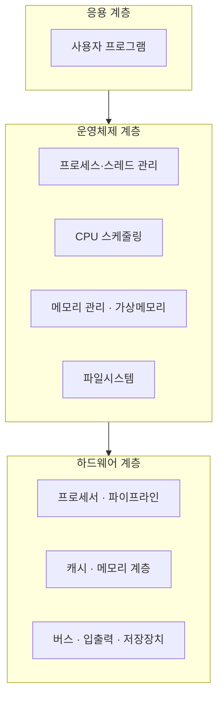
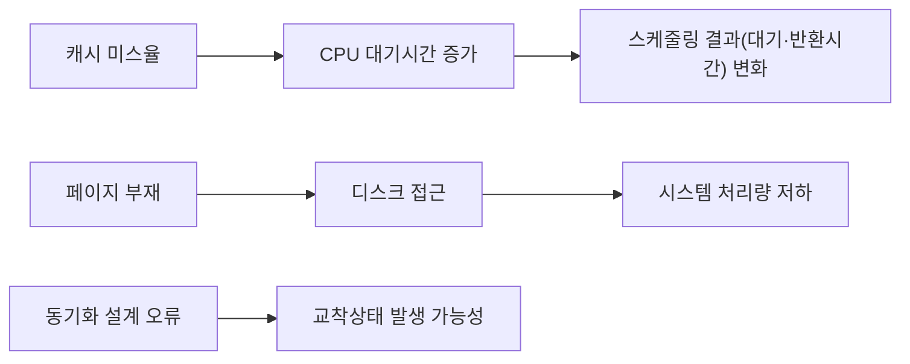

## 왜 용어 지도가 먼저 필요한가

통합컴퓨터시스템은 하드웨어 용어와 운영체제 용어가 한 문제 안에 섞여 나온다. 예를 들어 "캐시(cache) 미스율이 높아지면 라운드 로빈(Round Robin) 스케줄링의 평균 대기시간에 어떤 영향을 주는가" 같은 문항은 캐시(하드웨어 개념)와 스케줄링(운영체제 개념)을 동시에 알아야 풀 수 있다.

각 용어를 처음 언급할 때 소속 계층과 자세히 다루는 편 번호를 함께 표시했다. 자세한 정의와 계산은 해당 편에서 다룬다.

## 컴퓨터 시스템의 세 계층

컴퓨터 시스템은 흔히 세 개의 층으로 나눠 생각한다.

1. **하드웨어 계층(hardware layer)** — 실제 전자 회로로 만들어진 프로세서(processor), 메모리(memory), 입출력 장치(I/O device). 물리적으로 존재하는 부품이다.
2. **운영체제 계층(operating system layer)** — 하드웨어를 직접 다루기 어려운 응용 프로그램 대신, 하드웨어 자원을 관리하고 응용 프로그램에게 편리한 인터페이스를 제공하는 소프트웨어. "자원 관리자"이자 "번역가" 역할을 동시에 한다.
3. **응용 계층(application layer)** — 사용자가 실제로 쓰는 프로그램(문서 편집기, 웹 브라우저 등). 운영체제가 제공하는 서비스(시스템 호출, system call)를 통해 하드웨어 자원을 간접적으로 사용한다.

응용 계층은 운영체제 계층에게 일을 맡기고, 운영체제 계층은 다시 하드웨어 계층의 부품들을 관리해 그 일을 실제로 처리한다. 이 그림의 화살표 방향이 "누가 누구에게 요청하는가"의 흐름이다.

## 하드웨어 계층 용어

| 용어 | 한 줄 정의 | 자세히 다루는 편 |
|---|---|---|
| 프로세서(processor) | 명령어를 실제로 실행하는 핵심 부품. 레지스터·ALU(연산장치)·제어장치로 구성 | 06 |
| 파이프라인(pipeline) | 명령어 실행을 여러 단계로 나눠 겹쳐 처리함으로써 처리량을 높이는 기법 | 07–08 |
| 캐시(cache) | 프로세서와 주기억장치 사이에 두는 작고 빠른 기억장치. 자주 쓰는 데이터를 미리 담아 평균 접근시간을 줄인다 | 09–10 |
| 버스(bus) | 프로세서·메모리·입출력 장치 사이에서 데이터·주소·제어 신호를 실어 나르는 공용 통로 | 11 |
| RAID(Redundant Array of Independent Disks, 복수 디스크의 중복 배열) | 여러 개의 디스크를 묶어 성능이나 신뢰성을 높이는 저장장치 구성 방식 | 12 |

## 운영체제 계층 용어

| 용어 | 한 줄 정의 | 자세히 다루는 편 |
|---|---|---|
| 프로세스(process) | 실행 중인 프로그램의 인스턴스. 자신만의 메모리 공간과 실행 상태를 가진다 | 13 |
| 스레드(thread) | 프로세스 안에서 실행되는 흐름의 단위. 같은 프로세스 안의 스레드끼리는 메모리를 공유한다 | 13 |
| 스케줄링(scheduling) | 여러 프로세스·스레드 중 어느 것에게 CPU를 줄지 결정하는 운영체제의 정책 | 14 |
| 동기화(synchronization) | 여러 프로세스·스레드가 공유 자원에 접근할 때 순서를 맞춰 충돌을 막는 기법 | 15 |
| 교착상태(deadlock) | 두 개 이상의 프로세스가 서로 상대가 가진 자원을 기다리며 영원히 멈춰버리는 상태 | 15 |
| 가상메모리(virtual memory) | 실제 물리 메모리보다 더 큰 주소 공간을 프로세스에게 제공하는 기법. 페이징(paging)으로 구현 | 17 |
| 파일(file) | 보조기억장치에 저장되는 논리적인 데이터 단위. 운영체제가 파일시스템(file system)으로 관리한다 | 18 |

## 용어 사이의 관계 — 통합형 문항이 노리는 지점

이 과목의 통합형 문항은 위 두 표의 용어를 서로 엮는다. 대표적인 연결고리 몇 가지를 미리 봐두면 이후 편들이 왜 이런 순서로 배치되었는지 이해하기 쉽다.

- **캐시 ↔ CPU 이용률**: 캐시 미스가 잦으면 프로세서가 주기억장치를 기다리는 시간이 늘어나 전체 시스템의 처리량이 떨어진다.
- **스케줄링 ↔ 응답시간**: 어떤 스케줄링 정책을 쓰느냐에 따라 프로세스의 대기시간(waiting time)과 응답시간(response time)이 달라진다.
- **가상메모리 ↔ 디스크**: 페이지 부재(page fault)가 나면 디스크에서 데이터를 읽어와야 하므로, 디스크 접근시간이 시스템 성능에 직접 영향을 준다.
- **동기화 ↔ 교착상태**: 동기화 기법을 잘못 설계하면 교착상태가 발생할 조건(Coffman 조건)을 충족시킬 수 있다.
- **RAID ↔ 파일시스템**: RAID는 물리적 디스크 여러 개를 묶어 신뢰성을 높이고, 그 위에서 파일시스템이 논리적인 파일 구조를 관리한다.

> **자주 틀리는 점:** 용어를 각각 따로 외우고 시험장에서 연결하지 못하는 경우가 많다. 이 시리즈의 20–21편(통합형 문항)과 21–23편(기출·모의)에서 이 연결고리를 직접 문제로 풀어보게 되니, 지금은 "이런 연결이 있다"는 감각만 잡아두면 충분하다.

## 핵심 정리

- 컴퓨터 시스템은 하드웨어 → 운영체제 → 응용의 3계층으로 이해할 수 있다.
- 프로세서·파이프라인·캐시·버스·RAID는 하드웨어 계층, 프로세스·스레드·스케줄링·동기화·교착상태·가상메모리·파일은 운영체제 계층 용어다.
- 통합컴퓨터시스템 출제기준의 통합형 문항은 이 두 계층의 용어를 엮어 "하드웨어 상태 변화가 운영체제 지표에 미치는 영향"을 묻는다.
- 각 용어의 자세한 정의·계산은 표에 표시된 해당 편에서 깊게 다룬다.

## 마무리 복습

<Quiz
  questionNumber={1}
  question={"컴퓨터 시스템의 3계층 구조에서 운영체제 계층의 역할로 가장 적절한 것은?"}
  options={["실제 전자 회로로 명령어를 물리적으로 실행한다","하드웨어 자원을 관리하고 응용 프로그램에 편리한 인터페이스를 제공한다","사용자가 직접 조작하는 문서 편집기 같은 프로그램이다","데이터를 실어 나르는 공용 통로 역할만 한다"]}
  correctAnswer={2}
  explanation={"운영체제는 하드웨어 자원(CPU, 메모리, 입출력 장치)을 관리하고, 응용 프로그램이 시스템 호출을 통해 이를 편리하게 쓸 수 있도록 중개하는 역할을 한다."}
/>

<Quiz
  questionNumber={2}
  question={"다음 중 하드웨어 계층 용어로만 묶인 것은?"}
  options={["프로세스, 스레드, 스케줄링","캐시, 버스, RAID","동기화, 교착상태, 파일","가상메모리, 프로세스, 파일시스템"]}
  correctAnswer={2}
  explanation={"캐시, 버스, RAID는 모두 물리적인 하드웨어 구성 요소이거나 하드웨어 구성 방식이다."}
/>

<Quiz
  questionNumber={3}
  question={"캐시 미스율과 CPU 스케줄링 결과 사이의 관계를 설명한 것으로 옳은 것은?"}
  options={["캐시 미스율은 스케줄링 결과와 전혀 무관하다","캐시 미스율이 높아지면 CPU가 메모리를 기다리는 시간이 늘어나 스케줄링 지표(대기·반환시간)에 영향을 줄 수 있다","캐시 미스율이 높아지면 오히려 대기시간이 항상 짧아진다","캐시는 운영체제가 아닌 응용 프로그램이 직접 관리하는 자원이다"]}
  correctAnswer={2}
  explanation={"캐시 미스가 잦아지면 프로세서가 주기억장치 접근을 기다리는 시간이 늘어나고, 이는 전체 시스템의 처리 흐름과 스케줄링 지표에 간접적으로 영향을 준다."}
/>

## 참고 자료

- [국가평생교육진흥원 독학학위제](https://bdes.nile.or.kr)
