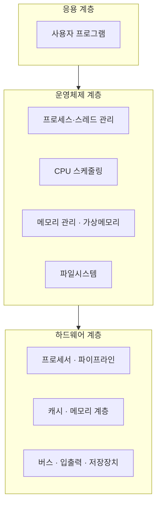
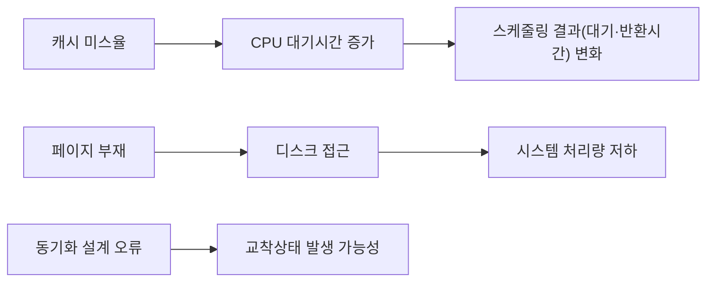

<Callout type="info">
  **이번 문서의 목표:** 이 시리즈 전체에서 반복해 등장할 핵심 용어(프로세서·파이프라인·캐시·버스·프로세스·스레드·스케줄링·동기화·교착상태·가상메모리·파일·RAID)가 컴퓨터 시스템의 어느 계층에 속하고 서로 어떻게 연결되는지 한눈에 파악한다.
</Callout>

## 왜 용어 지도가 먼저 필요한가

통합컴퓨터시스템은 하드웨어 용어와 운영체제 용어가 한 문제 안에 섞여 나온다. 예를 들어 "캐시(cache) 미스율이 높아지면 라운드 로빈(Round Robin) 스케줄링의 평균 대기시간에 어떤 영향을 주는가" 같은 문항은 캐시(하드웨어 개념)와 스케줄링(운영체제 개념)을 동시에 알아야 풀 수 있다.

> **쉽게 말하면:** 이 편은 앞으로 나올 24개 편의 등장인물을 미리 소개하는 지도다. 각 용어를 깊게 설명하지는 않는다 — "이 용어가 어느 층에 살고, 누구와 친한지"만 잡아 둔다.

각 용어를 처음 언급할 때 소속 계층과 자세히 다루는 편 번호를 함께 표시했다. 자세한 정의와 계산은 해당 편에서 다룬다.

## 컴퓨터 시스템의 세 계층

컴퓨터 시스템은 흔히 세 개의 층으로 나눠 생각한다.

1. **하드웨어 계층(hardware layer)** — 실제 전자 회로로 만들어진 프로세서(processor), 메모리(memory), 입출력 장치(I/O device). 물리적으로 존재하는 부품이다.
2. **운영체제 계층(operating system layer)** — 하드웨어를 직접 다루기 어려운 응용 프로그램 대신, 하드웨어 자원을 관리하고 응용 프로그램에게 편리한 인터페이스를 제공하는 소프트웨어. "자원 관리자"이자 "번역가" 역할을 동시에 한다.
3. **응용 계층(application layer)** — 사용자가 실제로 쓰는 프로그램(문서 편집기, 웹 브라우저 등). 운영체제가 제공하는 서비스(시스템 호출, system call)를 통해 하드웨어 자원을 간접적으로 사용한다.

응용 계층은 운영체제 계층에게 일을 맡기고, 운영체제 계층은 다시 하드웨어 계층의 부품들을 관리해 그 일을 실제로 처리한다. 이 그림의 화살표 방향이 "누가 누구에게 요청하는가"의 흐름이다.

## 하드웨어 계층 용어

| 용어 | 한 줄 정의 | 자세히 다루는 편 |
|---|---|---|
| 프로세서(processor) | 명령어를 실제로 실행하는 핵심 부품. 레지스터·ALU(연산장치)·제어장치로 구성 | 06 |
| 파이프라인(pipeline) | 명령어 실행을 여러 단계로 나눠 겹쳐 처리함으로써 처리량을 높이는 기법 | 07–08 |
| 캐시(cache) | 프로세서와 주기억장치 사이에 두는 작고 빠른 기억장치. 자주 쓰는 데이터를 미리 담아 평균 접근시간을 줄인다 | 09–10 |
| 버스(bus) | 프로세서·메모리·입출력 장치 사이에서 데이터·주소·제어 신호를 실어 나르는 공용 통로 | 11 |
| RAID(Redundant Array of Independent Disks, 복수 디스크의 중복 배열) | 여러 개의 디스크를 묶어 성능이나 신뢰성을 높이는 저장장치 구성 방식 | 12 |

## 운영체제 계층 용어

| 용어 | 한 줄 정의 | 자세히 다루는 편 |
|---|---|---|
| 프로세스(process) | 실행 중인 프로그램의 인스턴스. 자신만의 메모리 공간과 실행 상태를 가진다 | 13 |
| 스레드(thread) | 프로세스 안에서 실행되는 흐름의 단위. 같은 프로세스 안의 스레드끼리는 메모리를 공유한다 | 13 |
| 스케줄링(scheduling) | 여러 프로세스·스레드 중 어느 것에게 CPU를 줄지 결정하는 운영체제의 정책 | 14 |
| 동기화(synchronization) | 여러 프로세스·스레드가 공유 자원에 접근할 때 순서를 맞춰 충돌을 막는 기법 | 15 |
| 교착상태(deadlock) | 두 개 이상의 프로세스가 서로 상대가 가진 자원을 기다리며 영원히 멈춰버리는 상태 | 15 |
| 가상메모리(virtual memory) | 실제 물리 메모리보다 더 큰 주소 공간을 프로세스에게 제공하는 기법. 페이징(paging)으로 구현 | 17 |
| 파일(file) | 보조기억장치에 저장되는 논리적인 데이터 단위. 운영체제가 파일시스템(file system)으로 관리한다 | 18 |

## 용어 사이의 관계 — 통합형 문항이 노리는 지점

이 과목의 통합형 문항은 위 두 표의 용어를 서로 엮는다. 대표적인 연결고리 몇 가지를 미리 봐두면 이후 편들이 왜 이런 순서로 배치되었는지 이해하기 쉽다.

- **캐시 ↔ CPU 이용률**: 캐시 미스가 잦으면 프로세서가 주기억장치를 기다리는 시간이 늘어나 전체 시스템의 처리량이 떨어진다.
- **스케줄링 ↔ 응답시간**: 어떤 스케줄링 정책을 쓰느냐에 따라 프로세스의 대기시간(waiting time)과 응답시간(response time)이 달라진다.
- **가상메모리 ↔ 디스크**: 페이지 부재(page fault)가 나면 디스크에서 데이터를 읽어와야 하므로, 디스크 접근시간이 시스템 성능에 직접 영향을 준다.
- **동기화 ↔ 교착상태**: 동기화 기법을 잘못 설계하면 교착상태가 발생할 조건(Coffman 조건)을 충족시킬 수 있다.
- **RAID ↔ 파일시스템**: RAID는 물리적 디스크 여러 개를 묶어 신뢰성을 높이고, 그 위에서 파일시스템이 논리적인 파일 구조를 관리한다.

> **자주 틀리는 점:** 용어를 각각 따로 외우고 시험장에서 연결하지 못하는 경우가 많다. 이 시리즈의 20–21편(통합형 문항)과 22–24편(기출·모의)에서 이 연결고리를 직접 문제로 풀어보게 되니, 지금은 "이런 연결이 있다"는 감각만 잡아두면 충분하다.

## 핵심 정리

- 컴퓨터 시스템은 하드웨어 → 운영체제 → 응용의 3계층으로 이해할 수 있다.
- 프로세서·파이프라인·캐시·버스·RAID는 하드웨어 계층, 프로세스·스레드·스케줄링·동기화·교착상태·가상메모리·파일은 운영체제 계층 용어다.
- 통합컴퓨터시스템 출제기준의 통합형 문항은 이 두 계층의 용어를 엮어 "하드웨어 상태 변화가 운영체제 지표에 미치는 영향"을 묻는다.
- 각 용어의 자세한 정의·계산은 표에 표시된 해당 편에서 깊게 다룬다.

## 마무리 복습

<Quiz
  questionNumber={1}
  question="컴퓨터 시스템의 3계층 구조에서 운영체제 계층의 역할로 가장 적절한 것은?"
  options={['실제 전자 회로로 명령어를 물리적으로 실행한다', '하드웨어 자원을 관리하고 응용 프로그램에 편리한 인터페이스를 제공한다', '사용자가 직접 조작하는 문서 편집기 같은 프로그램이다', '데이터를 실어 나르는 공용 통로 역할만 한다']}
  correctAnswer={2}
  explanation="운영체제는 하드웨어 자원(CPU, 메모리, 입출력 장치)을 관리하고, 응용 프로그램이 시스템 호출을 통해 이를 편리하게 쓸 수 있도록 중개하는 역할을 한다."
  optionExplanations={['이는 하드웨어 계층인 프로세서의 역할이다', '정답. 자원 관리자이자 응용과 하드웨어 사이의 중개자 역할이다', '이는 응용 계층에 대한 설명이다', '이는 하드웨어 계층인 버스에 대한 설명이다']}
/>

<Quiz
  questionNumber={2}
  question="다음 중 하드웨어 계층 용어로만 묶인 것은?"
  options={['프로세스, 스레드, 스케줄링', '캐시, 버스, RAID', '동기화, 교착상태, 파일', '가상메모리, 프로세스, 파일시스템']}
  correctAnswer={2}
  explanation="캐시, 버스, RAID는 모두 물리적인 하드웨어 구성 요소이거나 하드웨어 구성 방식이다."
  optionExplanations={['프로세스·스레드·스케줄링은 운영체제 계층 용어다', '정답. 셋 모두 하드웨어 계층 용어다', '동기화·교착상태·파일은 운영체제 계층 용어다', '가상메모리·프로세스·파일시스템은 운영체제 계층 용어다']}
/>

<Quiz
  questionNumber={3}
  question="캐시 미스율과 CPU 스케줄링 결과 사이의 관계를 설명한 것으로 옳은 것은?"
  options={['캐시 미스율은 스케줄링 결과와 전혀 무관하다', '캐시 미스율이 높아지면 CPU가 메모리를 기다리는 시간이 늘어나 스케줄링 지표(대기·반환시간)에 영향을 줄 수 있다', '캐시 미스율이 높아지면 오히려 대기시간이 항상 짧아진다', '캐시는 운영체제가 아닌 응용 프로그램이 직접 관리하는 자원이다']}
  correctAnswer={2}
  explanation="캐시 미스가 잦아지면 프로세서가 주기억장치 접근을 기다리는 시간이 늘어나고, 이는 전체 시스템의 처리 흐름과 스케줄링 지표에 간접적으로 영향을 준다."
  optionExplanations={['하드웨어 상태 변화는 운영체제 지표와 연결되어 있어 무관하다는 설명은 옳지 않다', '정답. 이것이 통합형 문항이 자주 노리는 연결고리다', '대기시간이 늘어나는 방향이 일반적이며 항상 짧아진다는 설명은 옳지 않다', '캐시는 하드웨어이며 운영체제와 응용이 간접적으로 그 효과를 받는 자원이다']}
/>

<Quiz
  questionNumber={4}
  question="가상메모리에서 페이지 부재가 발생했을 때 이어지는 흐름으로 옳은 것은?"
  options={['페이지 부재는 항상 프로세서 내부에서만 처리되고 디스크 접근은 발생하지 않는다', '페이지 부재가 나면 디스크에서 필요한 데이터를 읽어와야 하므로 디스크 접근시간이 시스템 성능에 영향을 준다', '페이지 부재는 캐시 미스와 동일한 개념이다', '페이지 부재는 RAID 구성과만 관련이 있고 파일시스템과는 무관하다']}
  correctAnswer={2}
  explanation="페이지 부재가 발생하면 해당 페이지를 디스크(보조기억장치)에서 읽어와야 하므로, 디스크 접근시간이 전체 성능에 직접 영향을 준다."
  optionExplanations={['페이지 부재 처리는 디스크 접근을 필요로 하는 경우가 일반적이다', '정답. 이것이 가상메모리와 디스크 성능이 연결되는 지점이다', '캐시 미스는 캐시와 주기억장치 사이의 사건이고 페이지 부재는 주기억장치와 디스크 사이의 사건으로 서로 다른 계층의 개념이다', 'RAID는 디스크 구성 방식 중 하나이며 페이지 부재는 파일시스템이 위치한 디스크에도 영향을 받을 수 있다']}
/>

<Quiz
  questionNumber={5}
  question="동기화와 교착상태의 관계에 대한 설명으로 가장 적절한 것은?"
  options={['동기화 기법은 교착상태 발생 가능성과 아무 관련이 없다', '동기화 설계가 잘못되면 교착상태가 발생할 조건을 충족시킬 수 있다', '교착상태는 동기화 기법을 전혀 쓰지 않을 때만 발생한다', '동기화는 하드웨어 계층에서만 다루는 개념이다']}
  correctAnswer={2}
  explanation="공유 자원에 대한 접근 순서를 맞추는 동기화 기법을 잘못 설계하면, 서로가 서로의 자원을 기다리는 교착상태 조건이 만들어질 수 있다."
  optionExplanations={['동기화 설계는 교착상태 발생 가능성에 직접 영향을 준다', '정답. 15편에서 이 관계를 Coffman 조건과 함께 자세히 다룬다', '교착상태는 동기화 기법을 사용하는 과정에서 설계가 잘못되었을 때도 발생할 수 있다', '동기화는 운영체제 계층에서 다루는 개념이다']}
/>

<Quiz
  questionNumber={6}
  question="이 편에서 소개한 용어 지도를 활용하는 목적으로 가장 알맞은 것은?"
  options={['각 용어의 계산 공식을 전부 암기하기 위해서다', '각 용어가 어느 계층에 속하고 서로 어떻게 연결되는지 먼저 파악해 이후 통합형 문항에 대비하기 위해서다', '이 편만 읽으면 뒤의 본론 편을 읽지 않아도 되기 때문이다', '용어의 영어 철자를 외우는 것이 이 편의 유일한 목적이기 때문이다']}
  correctAnswer={2}
  explanation="용어 지도는 세부 계산이 아니라 개념의 위치와 연결고리를 먼저 잡아, 뒤에 이어지는 본론 편과 통합형 문항을 더 잘 이해하기 위한 준비 단계다."
  optionExplanations={['계산 공식은 03편과 각 본론 편에서 자세히 다룬다', '정답. 지도 역할이 이 편의 목적이다', '이 편은 지도일 뿐이며 자세한 내용은 뒤의 본론 편에서 다룬다', '용어의 뜻과 관계를 이해하는 것이 목적이며 철자 암기가 목적이 아니다']}
/>

## 참고 자료

- [국가평생교육진흥원 독학학위제](https://bdes.nile.or.kr)
