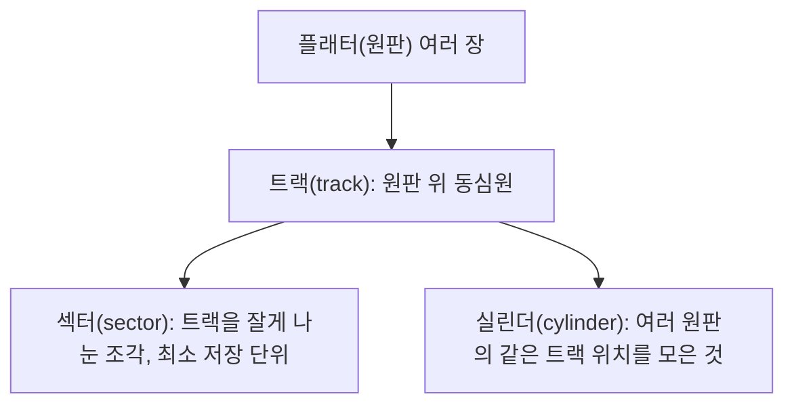

<Callout type="info">
  **이번 문서의 목표:** 이 파일을 다 읽으면 프로그램 제어 IO·인터럽트 기반 IO·DMA의 차이를 다시 정리하고, 디스크의 회전수(RPM)만 주어졌을 때 평균 회전 지연·전송시간·평균 접근시간을 처음부터 끝까지 계산하며, 디스크 스케줄링이 왜 필요한지 접근시간 구성 요소와 연결해 설명할 수 있다.
</Callout>

## 이 편에서 새로 다루는 것

프로그램 제어 IO·인터럽트 기반 IO·DMA의 개념과 장단점은 [독학사 2단계 컴퓨터구조 18편](/독학사/2단계/컴퓨터구조/18_io-interrupt-dma-and-bus)과 [2단계 운영체제 18편](/독학사/2단계/운영체제/18_io-system-and-interrupts)에서 이미 자세히 다뤘다. 이 편은 그 셋을 표 하나로 짧게 재확인만 하고, 4단계에서 새로 요구되는 **"디스크의 물리적 회전수(RPM)만 주어졌을 때, 접근시간의 각 구성 요소를 직접 계산해 내는 절차"**(처음부터 끝까지 손계산)를 다룬다. 디스크 스케줄링 알고리즘별 헤드 이동 거리 계산은 [12편](/독학사/4단계/통합컴퓨터시스템/11_disk-raid-and-performance)에서 이어서 다룬다.

## 1. 입출력 세 방식 — 표로 재확인

> **쉽게 말하면:** 셋의 차이는 "느린 장치를 기다리는 동안 CPU가 무엇을 하는가"에 있다.

| 방식 | CPU의 역할 | 장점 | 단점 |
|---|---|---|---|
| 프로그램 제어 IO | 상태 레지스터를 반복 확인(폴링)하며 계속 대기 | 구현이 단순 | 바쁜 대기(busy waiting)로 CPU 낭비가 큼 |
| 인터럽트 기반 IO | 요청 후 다른 작업 수행, 완료 시 인터럽트로 통보받음 | 바쁜 대기 제거 | 단어 단위로 자주 발생하면 인터럽트 처리 오버헤드 누적 |
| DMA | 전송 시작만 지시, 장치와 메모리가 CPU 없이 직접 전송 | 대량 전송에서 CPU 부담 최소화 | DMA 컨트롤러가 버스를 점유하는 동안 CPU가 버스를 못 씀(사이클 스틸) |

세 방식의 상세한 비교표·DMA 사이클 스틸 계산은 위 두 편에 이미 있으므로 반복하지 않는다. 이 편에서는 이 셋 중 어떤 방식을 쓰든 결국 데이터가 오가는 **물리적 저장장치, 특히 디스크**의 시간 구조로 들어간다.

## 2. 디스크의 물리적 구조

디스크는 여러 장의 원판(플래터, platter)으로 이루어지고, 각 원판 표면에는 동심원 모양의 **트랙**(track)이, 트랙은 다시 일정 크기로 잘린 **섹터**(sector)로 나뉜다. 여러 원판에서 같은 반지름 위치에 있는 트랙들을 모으면 **실린더**(cylinder)가 된다.

> **쉽게 말하면:** LP 레코드판의 동그란 홈 하나가 트랙, 그 홈을 여러 조각으로 나눈 것이 섹터, 여러 장의 레코드판을 겹쳤을 때 같은 위치의 홈들을 모은 것이 실린더다.

## 3. 디스크 접근시간의 세 구성 요소

디스크에서 데이터 한 조각을 읽는 데 걸리는 시간은 세 부분으로 나뉜다.

$$
T_{\text{access}} = T_{\text{seek}} + T_{\text{rotation}} + T_{\text{transfer}}
$$

- $T_{\text{seek}}$(탐색 시간): 헤드가 목표 실린더(트랙)까지 이동하는 시간
- $T_{\text{rotation}}$(회전 지연): 헤드가 목표 트랙에 도착한 뒤, 원판이 돌아 원하는 섹터가 헤드 아래로 올 때까지 기다리는 시간
- $T_{\text{transfer}}$(전송 시간): 실제로 데이터를 읽거나 쓰는 시간

세 요소 중 탐색 시간은 [12편](/독학사/4단계/통합컴퓨터시스템/11_disk-raid-and-performance)의 디스크 스케줄링에서 줄이는 대상이다. 이 편에서는 **회전 지연과 전송 시간을 회전수(RPM)로부터 직접 계산**하는 절차를 다룬다.

## 4. 회전수(RPM)로부터 회전 지연 계산하기

> **쉽게 말하면:** 원판이 1분에 몇 바퀴 도는지 알면, 한 바퀴 도는 데 걸리는 시간을 알 수 있고, 평균적으로 목표 섹터가 헤드 밑에 오기까지는 그 절반 시간만큼 기다린다고 본다.

원판의 회전 속도가 분당 $N$회전(RPM, Revolutions Per Minute)이라면, 초당 회전수는 다음과 같다.

$$
\text{초당 회전수} = \frac{N}{60}
$$

한 바퀴 도는 데 걸리는 시간(1회전 시간)은 초당 회전수의 역수다.

$$
T_{\text{1회전}} = \frac{60}{N}
$$

헤드가 목표 트랙에 도착했을 때 원하는 섹터가 정확히 헤드 아래 있을 확률은 낮다. 최악의 경우 거의 한 바퀴를 다 기다려야 하고, 운이 좋으면 거의 기다리지 않는다. 그래서 **평균 회전 지연은 반 바퀴를 도는 시간**으로 계산한다.

$$
T_{\text{rotation}} = \frac{1}{2} \times T_{\text{1회전}}
$$

### 예제: 7,200RPM 디스크의 평균 회전 지연

$$
T_{\text{1회전}} = \frac{60}{7{,}200} = 0.008333\text{초} = 8.333\text{ms}
$$

$$
T_{\text{rotation}} = \frac{1}{2} \times 8.333\text{ms} = 4.167\text{ms}
$$

**결과 해석**: 7,200RPM 디스크는 평균적으로 약 4.17밀리초를 회전 지연으로 기다린다. 15,000RPM처럼 더 빠른 디스크라면 1회전 시간이 $60/15{,}000 = 4\text{ms}$이므로 평균 회전 지연은 2밀리초로 줄어든다 — **RPM이 두 배가 되면 회전 지연은 절반**이 된다는 반비례 관계를 기억해 둔다.

## 5. 전송 시간 계산하기

전송 시간은 "원하는 데이터가 트랙 전체에서 차지하는 비율"만큼 1회전 시간이 걸린다고 계산한다.

$$
T_{\text{transfer}} = T_{\text{1회전}} \times \frac{\text{전송할 데이터 크기}}{\text{트랙 전체 용량}}
$$

### 예제: 트랙 용량 500KB, 전송할 섹터 크기 4KB, 7,200RPM($T_{\text{1회전}}=8.333\text{ms}$)

$$
T_{\text{transfer}} = 8.333\text{ms} \times \frac{4}{500} = 8.333 \times 0.008 = 0.0667\text{ms}
$$

**결과 해석**: 전송 시간은 회전 지연(4.167ms)보다 훨씬 작다. 이는 곧 디스크 접근시간에서 **회전 지연과 탐색 시간이 전체 시간의 대부분을 차지**하고, 실제 데이터를 옮기는 전송 시간은 상대적으로 미미하다는 뜻이다 — 그래서 디스크 성능 개선 노력이 "얼마나 빨리 읽느냐"보다 "헤드를 얼마나 덜 움직이느냐(탐색 시간 최소화, [12편](/독학사/4단계/통합컴퓨터시스템/11_disk-raid-and-performance)의 디스크 스케줄링)"와 "회전 지연을 줄이는 고속 회전(RPM)"에 집중되는 이유다.

## 6. 전체 평균 접근시간 종합 계산

### 예제: 평균 탐색 시간 9ms, 7,200RPM, 트랙 용량 500KB, 전송 크기 4KB

앞서 구한 값들을 그대로 더한다.

$$
T_{\text{access}} = T_{\text{seek}} + T_{\text{rotation}} + T_{\text{transfer}}
$$

$$
T_{\text{access}} = 9\text{ms} + 4.167\text{ms} + 0.0667\text{ms} = 13.23\text{ms}
$$

**결과 해석**: 탐색 시간(9ms)이 회전 지연(4.167ms)과 전송 시간(0.067ms)을 합친 것보다도 크다. 즉 디스크 성능을 개선하려는 노력이 헤드 이동 거리를 줄이는 **디스크 스케줄링**에 가장 먼저 집중되는 것은 우연이 아니라, 접근시간 구성 요소 중 탐색 시간의 비중이 가장 크기 때문이다.

**자주 틀리는 점**: 회전 지연을 계산할 때 "1회전 시간 전체"를 그대로 쓰는 실수가 흔하다. 반드시 **절반**(평균)을 취해야 한다는 점, 그리고 RPM에서 초당 회전수로 바꾼 뒤 다시 역수를 취하는 두 단계를 건너뛰지 않는 것이 중요하다.

## 핵심 정리

- 프로그램 제어 IO·인터럽트 기반 IO·DMA의 세부 비교와 사이클 스틸 계산은 2단계 컴퓨터구조 18편·운영체제 18편에 있으므로 이 편은 표로만 재확인한다.
- 디스크는 플래터(원판)–트랙–섹터–실린더로 구성되며, 접근시간은 탐색 시간 + 회전 지연 + 전송 시간으로 나뉜다.
- 회전 지연은 $\frac{1}{2} \times \frac{60}{\text{RPM}}$으로 계산하며, RPM이 2배가 되면 회전 지연은 절반으로 줄어든다.
- 전송 시간은 1회전 시간에 (전송할 데이터 크기 ÷ 트랙 전체 용량)을 곱해 구하며, 보통 탐색 시간·회전 지연보다 훨씬 작다.
- 탐색 시간이 접근시간에서 가장 큰 비중을 차지하므로, 디스크 성능 최적화는 [12편](/독학사/4단계/통합컴퓨터시스템/11_disk-raid-and-performance)의 디스크 스케줄링(헤드 이동 최소화)에 집중된다.

## 마무리 복습

<Quiz
  questionNumber={1}
  question="CPU가 상태 레지스터를 반복적으로 확인하며 대기하는 입출력 방식은?"
  options={['DMA', '인터럽트 기반 IO', '프로그램 제어 IO', '버퍼링']}
  correctAnswer={3}
  explanation="프로그램 제어 IO(programmed IO)는 CPU가 상태 레지스터를 폴링(polling)하며 장치가 준비될 때까지 반복 확인하는 방식으로, 그동안 CPU는 다른 작업을 하지 못하는 바쁜 대기 상태에 놓인다."
  optionExplanations={['DMA는 CPU 없이 장치와 메모리가 직접 데이터를 주고받는 방식이다', '인터럽트 기반 IO는 CPU가 다른 작업을 하다가 완료 신호를 받는 방식이다', '정답이다', '버퍼링은 입출력 데이터를 임시로 저장해 두는 기법으로 이 셋과는 다른 층위의 개념이다']}
/>

<Quiz
  questionNumber={2}
  question="디스크에서 여러 원판의 같은 반지름 위치에 있는 트랙들을 모아 부르는 명칭은?"
  options={['섹터', '실린더', '플래터', '헤드']}
  correctAnswer={2}
  explanation="실린더(cylinder)는 여러 원판(플래터)에서 같은 트랙 위치를 모은 개념으로, 헤드가 한 번의 탐색으로 동시에 접근할 수 있는 트랙들의 집합을 가리킨다."
  optionExplanations={['섹터는 트랙을 더 잘게 나눈 최소 저장 단위다', '정답이다', '플래터는 원판 자체를 가리키는 용어다', '헤드는 데이터를 읽고 쓰는 장치로 실린더라는 위치 개념과는 다르다']}
/>

<Quiz
  questionNumber={3}
  question="10,000RPM으로 회전하는 디스크의 1회전 시간은?"
  options={['0.6ms', '3ms', '6ms', '10ms']}
  correctAnswer={3}
  explanation="1회전 시간 = 60 / RPM = 60 / 10,000 = 0.006초 = 6ms."
  optionExplanations={['초당 회전수(10,000/60 ≈ 166.7)를 그대로 밀리초 단위로 잘못 옮긴 값이다', 'RPM을 밀리초로 환산하는 과정에서 자릿수를 잘못 옮긴 값이다', '정답이다. 60/10,000 = 0.006초 = 6ms', 'RPM 값 10,000을 그대로 1,000으로 나눈 값으로 계산식과 무관하다']}
/>

<Quiz
  questionNumber={4}
  question="같은 10,000RPM 디스크의 평균 회전 지연은?"
  options={['1.5ms', '3ms', '6ms', '12ms']}
  correctAnswer={2}
  explanation="평균 회전 지연은 1회전 시간의 절반이다. 1회전 시간이 6ms이므로 평균 회전 지연 = 6ms / 2 = 3ms."
  optionExplanations={['1회전 시간의 4분의 1로 계산한 값으로, 절반이 아니라 4분의 1을 취한 오류다', '정답이다. 6ms의 절반은 3ms', '1회전 시간 전체(6ms)를 그대로 평균 회전 지연으로 착각한 값이다', '1회전 시간의 2배로 계산한 값으로 반비례 관계를 반대로 적용한 오류다']}
/>

<Quiz
  questionNumber={5}
  question="트랙 용량 400KB, 전송할 데이터 크기 8KB, 1회전 시간 6ms일 때 전송 시간은?"
  options={['0.03ms', '0.12ms', '0.48ms', '3ms']}
  correctAnswer={2}
  explanation="전송 시간 = 1회전 시간 × (전송 크기 / 트랙 용량) = 6ms × (8/400) = 6 × 0.02 = 0.12ms."
  optionExplanations={['전송 크기와 트랙 용량의 비율을 잘못 계산했을 때 나올 수 있는 값이다', '정답이다. 6 × 0.02 = 0.12ms', '비율 계산에서 소수점 자리를 잘못 옮긴 값이다', '1회전 시간의 절반으로 잘못 계산한 값으로 회전 지연 공식과 혼동한 경우다']}
/>

<Quiz
  questionNumber={6}
  question="평균 탐색 시간 8ms, 평균 회전 지연 3ms, 전송 시간 0.12ms일 때 평균 접근시간은?"
  options={['8.12ms', '11.00ms', '11.12ms', '14.12ms']}
  correctAnswer={3}
  explanation="평균 접근시간 = 탐색 시간 + 회전 지연 + 전송 시간 = 8 + 3 + 0.12 = 11.12ms."
  optionExplanations={['전송 시간을 빠뜨리고 탐색 시간만 더한 값이다', '전송 시간을 빠뜨린 채 탐색 시간과 회전 지연만 더한 값이다', '정답이다. 8 + 3 + 0.12 = 11.12ms', '회전 지연을 실수로 두 번 더했을 때 나올 수 있는 값이다']}
/>

<Quiz
  questionNumber={7}
  question="디스크 접근시간의 세 구성 요소 중 일반적으로 가장 큰 비중을 차지해 디스크 스케줄링이 최소화하려는 대상은?"
  options={['탐색 시간', '회전 지연', '전송 시간', '버스 점유 시간']}
  correctAnswer={1}
  explanation="본문 예제에서 보듯 탐색 시간(9ms)이 회전 지연(약 4ms)과 전송 시간(1ms 미만)의 합보다도 크다. 그래서 디스크 스케줄링은 헤드 이동 거리, 즉 탐색 시간을 줄이는 데 집중한다."
  optionExplanations={['정답이다', '회전 지연도 상당하지만 탐색 시간보다는 대체로 작고, 디스크 스케줄링이 직접 줄이는 대상도 아니다', '전송 시간은 세 요소 중 가장 작은 편이다', '버스 점유 시간은 DMA와 관련된 별개의 개념으로 디스크 접근시간의 세 구성 요소에 포함되지 않는다']}
/>

## 참고 자료

- [독학사 2단계 컴퓨터구조 18편 — 입출력 구조: 인터럽트·DMA·버스](/독학사/2단계/컴퓨터구조/18_io-interrupt-dma-and-bus)
- [독학사 2단계 운영체제 18편 — 입출력 시스템과 인터럽트 처리](/독학사/2단계/운영체제/18_io-system-and-interrupts)
- 국가평생교육진흥원 독학학위제: https://bdes.nile.or.kr
