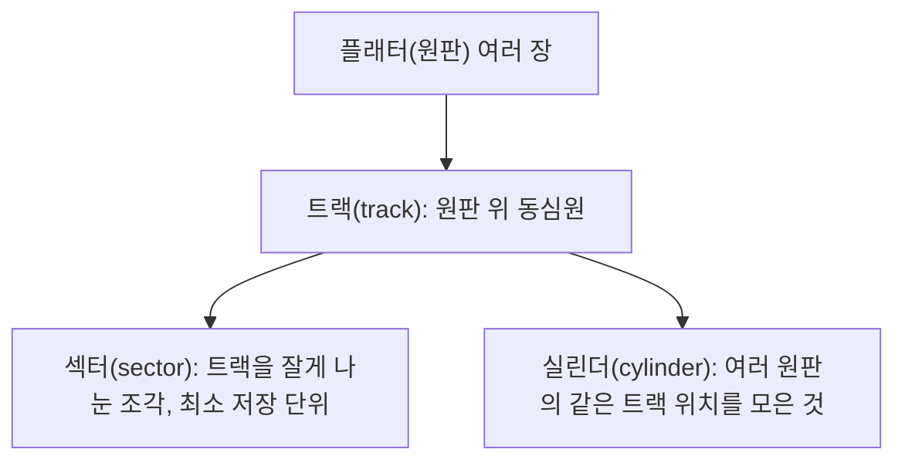

## 이 편에서 새로 다루는 것

프로그램 제어 IO·인터럽트 기반 IO·DMA의 개념과 장단점은 [독학사 2단계 컴퓨터구조 17편](/독학사/2단계/컴퓨터구조/18_io-interrupt-dma-and-bus)과 [2단계 운영체제 17편](/독학사/2단계/운영체제/18_io-system-and-interrupts)에서 이미 자세히 다뤘다. 이 편은 그 셋을 표 하나로 짧게 재확인만 하고, 4단계에서 새로 요구되는 **"디스크의 물리적 회전수(RPM)만 주어졌을 때, 접근시간의 각 구성 요소를 직접 계산해 내는 절차"**(처음부터 끝까지 손계산)를 다룬다.

## 1. 입출력 세 방식 — 표로 재확인

| 방식 | CPU의 역할 | 장점 | 단점 |
|---|---|---|---|
| 프로그램 제어 IO | 상태 레지스터를 반복 확인(폴링)하며 계속 대기 | 구현이 단순 | 바쁜 대기(busy waiting)로 CPU 낭비가 큼 |
| 인터럽트 기반 IO | 요청 후 다른 작업 수행, 완료 시 인터럽트로 통보받음 | 바쁜 대기 제거 | 단어 단위로 자주 발생하면 인터럽트 처리 오버헤드 누적 |
| DMA | 전송 시작만 지시, 장치와 메모리가 CPU 없이 직접 전송 | 대량 전송에서 CPU 부담 최소화 | DMA 컨트롤러가 버스를 점유하는 동안 CPU가 버스를 못 씀(사이클 스틸) |

세 방식의 상세한 비교표·DMA 사이클 스틸 계산은 위 두 편에 이미 있으므로 반복하지 않는다. 이 편에서는 이 셋 중 어떤 방식을 쓰든 결국 데이터가 오가는 **물리적 저장장치, 특히 디스크**의 시간 구조로 들어간다.

## 2. 디스크의 물리적 구조

디스크는 여러 장의 원판(플래터, platter)으로 이루어지고, 각 원판 표면에는 동심원 모양의 **트랙**(track)이, 트랙은 다시 일정 크기로 잘린 **섹터**(sector)로 나뉜다. 여러 원판에서 같은 반지름 위치에 있는 트랙들을 모으면 **실린더**(cylinder)가 된다.

```mermaid
flowchart TD
    P["플래터(원판) 여러 장"] --> T["트랙(track): 원판 위 동심원"]
    T --> S["섹터(sector): 트랙을 잘게 나눈 조각, 최소 저장 단위"]
    T --> C["실린더(cylinder): 여러 원판의 같은 트랙 위치를 모은 것"]
```

## 3. 디스크 접근시간의 세 구성 요소

디스크에서 데이터 한 조각을 읽는 데 걸리는 시간은 세 부분으로 나뉜다.

$$
T_{\text{access}} = T_{\text{seek}} + T_{\text{rotation}} + T_{\text{transfer}}
$$

- $T_{\text{seek}}$(탐색 시간): 헤드가 목표 실린더(트랙)까지 이동하는 시간
- $T_{\text{rotation}}$(회전 지연): 헤드가 목표 트랙에 도착한 뒤, 원판이 돌아 원하는 섹터가 헤드 아래로 올 때까지 기다리는 시간
- $T_{\text{transfer}}$(전송 시간): 실제로 데이터를 읽거나 쓰는 시간

세 요소 중 탐색 시간은 [11편](/독학사/4단계/통합컴퓨터시스템/11_disk-raid-and-performance)의 디스크 스케줄링에서 줄이는 대상이다. 이 편에서는 **회전 지연과 전송 시간을 회전수(RPM)로부터 직접 계산**하는 절차를 다룬다.

## 4. 회전수(RPM)로부터 회전 지연 계산하기

원판의 회전 속도가 분당 $N$회전(RPM, Revolutions Per Minute)이라면, 초당 회전수는 다음과 같다.

$$
\text{초당 회전수} = \frac{N}{60}
$$

한 바퀴 도는 데 걸리는 시간(1회전 시간)은 초당 회전수의 역수다.

$$
T_{\text{1회전}} = \frac{60}{N}
$$

헤드가 목표 트랙에 도착했을 때 원하는 섹터가 정확히 헤드 아래 있을 확률은 낮다. 최악의 경우 거의 한 바퀴를 다 기다려야 하고, 운이 좋으면 거의 기다리지 않는다. 그래서 **평균 회전 지연은 반 바퀴를 도는 시간**으로 계산한다.

$$
T_{\text{rotation}} = \frac{1}{2} \times T_{\text{1회전}}
$$

### 예제: 7,200RPM 디스크의 평균 회전 지연

$$
T_{\text{1회전}} = \frac{60}{7{,}200} = 0.008333\text{초} = 8.333\text{ms}
$$

$$
T_{\text{rotation}} = \frac{1}{2} \times 8.333\text{ms} = 4.167\text{ms}
$$

**결과 해석**: 7,200RPM 디스크는 평균적으로 약 4.17밀리초를 회전 지연으로 기다린다. 15,000RPM처럼 더 빠른 디스크라면 1회전 시간이 $60/15{,}000 = 4\text{ms}$이므로 평균 회전 지연은 2밀리초로 줄어든다 — **RPM이 두 배가 되면 회전 지연은 절반**이 된다는 반비례 관계를 기억해 둔다.

## 5. 전송 시간 계산하기

전송 시간은 "원하는 데이터가 트랙 전체에서 차지하는 비율"만큼 1회전 시간이 걸린다고 계산한다.

$$
T_{\text{transfer}} = T_{\text{1회전}} \times \frac{\text{전송할 데이터 크기}}{\text{트랙 전체 용량}}
$$

### 예제: 트랙 용량 500KB, 전송할 섹터 크기 4KB, 7,200RPM($T_{\text{1회전}}=8.333\text{ms}$)

$$
T_{\text{transfer}} = 8.333\text{ms} \times \frac{4}{500} = 8.333 \times 0.008 = 0.0667\text{ms}
$$

**결과 해석**: 전송 시간은 회전 지연(4.167ms)보다 훨씬 작다. 이는 곧 디스크 접근시간에서 **회전 지연과 탐색 시간이 전체 시간의 대부분을 차지**하고, 실제 데이터를 옮기는 전송 시간은 상대적으로 미미하다는 뜻이다 — 그래서 디스크 성능 개선 노력이 "얼마나 빨리 읽느냐"보다 "헤드를 얼마나 덜 움직이느냐(탐색 시간 최소화, [11편](/독학사/4단계/통합컴퓨터시스템/11_disk-raid-and-performance)의 디스크 스케줄링)"와 "회전 지연을 줄이는 고속 회전(RPM)"에 집중되는 이유다.

## 6. 전체 평균 접근시간 종합 계산

### 예제: 평균 탐색 시간 9ms, 7,200RPM, 트랙 용량 500KB, 전송 크기 4KB

앞서 구한 값들을 그대로 더한다.

$$
T_{\text{access}} = T_{\text{seek}} + T_{\text{rotation}} + T_{\text{transfer}}
$$

$$
T_{\text{access}} = 9\text{ms} + 4.167\text{ms} + 0.0667\text{ms} = 13.23\text{ms}
$$

**결과 해석**: 탐색 시간(9ms)이 회전 지연(4.167ms)과 전송 시간(0.067ms)을 합친 것보다도 크다. 즉 디스크 성능을 개선하려는 노력이 헤드 이동 거리를 줄이는 **디스크 스케줄링**에 가장 먼저 집중되는 것은 우연이 아니라, 접근시간 구성 요소 중 탐색 시간의 비중이 가장 크기 때문이다.

**자주 틀리는 점**: 회전 지연을 계산할 때 "1회전 시간 전체"를 그대로 쓰는 실수가 흔하다. 반드시 **절반**(평균)을 취해야 한다는 점, 그리고 RPM에서 초당 회전수로 바꾼 뒤 다시 역수를 취하는 두 단계를 건너뛰지 않는 것이 중요하다.

## 핵심 정리

- 프로그램 제어 IO·인터럽트 기반 IO·DMA의 세부 비교와 사이클 스틸 계산은 2단계 컴퓨터구조 17편·운영체제 17편에 있으므로 이 편은 표로만 재확인한다.
- 디스크는 플래터(원판)–트랙–섹터–실린더로 구성되며, 접근시간은 탐색 시간 + 회전 지연 + 전송 시간으로 나뉜다.
- 회전 지연은 $\frac{1}{2} \times \frac{60}{\text{RPM}}$으로 계산하며, RPM이 2배가 되면 회전 지연은 절반으로 줄어든다.
- 전송 시간은 1회전 시간에 (전송할 데이터 크기 ÷ 트랙 전체 용량)을 곱해 구하며, 보통 탐색 시간·회전 지연보다 훨씬 작다.
- 탐색 시간이 접근시간에서 가장 큰 비중을 차지하므로, 디스크 성능 최적화는 [11편](/독학사/4단계/통합컴퓨터시스템/11_disk-raid-and-performance)의 디스크 스케줄링(헤드 이동 최소화)에 집중된다.

## 마무리 복습

<Quiz
  questionNumber={1}
  question={"CPU가 상태 레지스터를 반복적으로 확인하며 대기하는 입출력 방식은?"}
  options={["DMA","인터럽트 기반 IO","프로그램 제어 IO","버퍼링"]}
  correctAnswer={3}
  explanation={"프로그램 제어 IO(programmed IO)는 CPU가 상태 레지스터를 폴링(polling)하며 장치가 준비될 때까지 반복 확인하는 방식으로, 그동안 CPU는 다른 작업을 하지 못하는 바쁜 대기 상태에 놓인다."}
/>

<Quiz
  questionNumber={2}
  question={"디스크에서 여러 원판의 같은 반지름 위치에 있는 트랙들을 모아 부르는 명칭은?"}
  options={["섹터","실린더","플래터","헤드"]}
  correctAnswer={2}
  explanation={"실린더(cylinder)는 여러 원판(플래터)에서 같은 트랙 위치를 모은 개념으로, 헤드가 한 번의 탐색으로 동시에 접근할 수 있는 트랙들의 집합을 가리킨다."}
/>

<Quiz
  questionNumber={3}
  question={"10,000RPM으로 회전하는 디스크의 1회전 시간은?"}
  options={["0.6ms","3ms","6ms","10ms"]}
  correctAnswer={3}
  explanation={"1회전 시간 = 60 / RPM = 60 / 10,000 = 0.006초 = 6ms."}
/>

## 참고 자료

- [독학사 2단계 컴퓨터구조 17편 — 입출력 구조: 인터럽트·DMA·버스](/독학사/2단계/컴퓨터구조/18_io-interrupt-dma-and-bus)
- [독학사 2단계 운영체제 17편 — 입출력 시스템과 인터럽트 처리](/독학사/2단계/운영체제/18_io-system-and-interrupts)
- 국가평생교육진흥원 독학학위제: https://bdes.nile.or.kr
