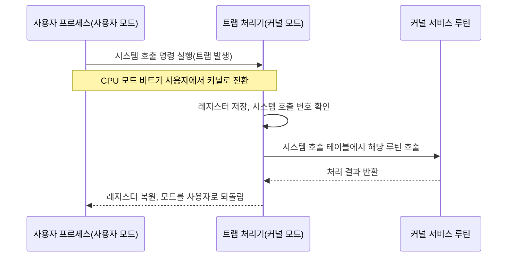

## 이 편에서 다시 보는 이유

독학사 2단계 운영체제 과목에서 이미 프로세스 개념·상태·PCB(Process Control Block, 프로세스 제어 블록)와 스레드의 기본 정의를 배웠다. 자세한 정의와 기본 문제는 [2단계 운영체제 04편](/독학사/2단계/운영체제/05_os-overview-and-types), [05편](/독학사/2단계/운영체제/06_process-management-and-pcb), [03편](/독학사/2단계/운영체제/04_thread-and-aceess-basics)에서 이미 충분히 다뤘으므로 이 편에서 같은 정의를 반복하지 않는다.

4단계 통합컴퓨터시스템은 "정의를 아는가"를 넘어 **구조 선택이 실제 시스템 성능·안정성에 어떤 대가를 치르게 하는가**, 그리고 **프로세스와 스레드 전환 비용이 왜 다른가**를 숫자로 설명하는 능력을 요구한다. 이 두 가지가 이 편의 핵심이다.

## 운영체제 구조 네 가지와 트레이드오프

운영체제의 핵심 기능(프로세스 관리, 메모리 관리, 파일 시스템, 장치 관리 등)을 **어떻게 나누어 배치하느냐**에 따라 구조가 갈린다.

### 모놀리식 커널 (Monolithic Kernel)

모든 운영체제 서비스(프로세스 관리, 메모리 관리, 파일 시스템, 장치 드라이버)를 **하나의 커널 주소 공간** 안에서 커널 모드로 실행한다. 서비스끼리 함수 호출로 직접 통신하므로 빠르다.

- **장점**: 함수 호출 하나로 서비스 간 통신이 끝나므로 오버헤드가 거의 없다. 대표적으로 리눅스(모듈 방식 지원)가 이 구조다.
- **단점**: 장치 드라이버 하나에 버그가 있어도 커널 전체가 죽을 수 있다(격리가 없다). 코드가 방대해질수록 유지보수가 어렵다.

### 계층형 구조 (Layered Structure)

시스템을 여러 계층(layer)으로 나누고, **각 계층은 바로 아래 계층의 서비스만 호출**할 수 있게 강제한다(0계층 하드웨어에 가장 가깝고, 위로 갈수록 사용자 인터페이스에 가깝다).

- **장점**: 계층 간 의존 방향이 한쪽으로만 정해져 있어 설계·디버깅·검증이 쉽다.
- **단점**: 계층을 거칠 때마다 호출 오버헤드가 쌓이고, 기능을 어느 계층에 넣을지 미리 정교하게 설계해야 해서 유연성이 떨어진다.

### 마이크로커널 (Microkernel)

커널에는 **프로세스 간 통신(IPC), 기본 스케줄링, 최소한의 메모리 관리**만 남기고, 파일 시스템·장치 드라이버 같은 나머지 서비스는 **사용자 모드의 별도 프로세스(서버)** 로 뺀다.

- **장점**: 서버 하나가 죽어도 커널과 다른 서버는 영향을 받지 않아 **안정성**이 높다. 새 서비스를 추가·교체하기 쉽다. QNX, 초창기 미니x(MINIX)가 대표 예다.
- **단점**: 서버끼리 대화하려면 커널을 거치는 **메시지 전달(IPC)** 이 필요한데, 이는 시스템 호출보다 비싼 **모드 전환 + 컨텍스트 스위칭**을 유발한다. 서비스 하나를 처리하는 데 여러 번의 IPC가 오가면 모놀리식보다 느려질 수 있다.

### 하이브리드 구조 (Hybrid Kernel)

모놀리식의 속도와 마이크로커널의 모듈성을 절충한다. 핵심은 커널 공간에 두되, 일부 서비스는 모듈이나 사용자 모드 서버로 분리한다. 윈도우 NT 계열, macOS(XNU)가 대표 예다.

### 네 구조 한눈에 비교

| 구조 | 서비스 위치 | 서비스 간 통신 비용 | 장애 격리 | 대표 예 |
|------|------|------|------|------|
| 모놀리식 | 커널 공간 전체 | 낮음(직접 함수 호출) | 낮음(한 서비스 장애가 전체에 영향) | 리눅스 |
| 계층형 | 커널 공간, 계층별 분리 | 중간(계층을 거쳐야 함) | 중간 | 초기 THE 운영체제 |
| 마이크로커널 | 최소 커널 + 사용자 모드 서버 | 높음(IPC와 모드 전환 필요) | 높음(서버 장애가 격리됨) | QNX |
| 하이브리드 | 커널 공간 중심, 일부만 분리 | 중간–낮음 | 중간 | 윈도우 NT, macOS |

> **자주 틀리는 점:** "마이크로커널이 항상 더 빠르다"거나 "모놀리식이 항상 더 불안정하다"고 단정하면 안 된다. 마이크로커널은 **안정성과 모듈성**을 얻는 대신 **서비스 간 통신 비용**을 지불하는 구조이지, 무조건 우월한 구조가 아니다. "다음 중 옳지 않은 것은?" 유형에서 이 방향의 함정이 자주 나온다.

## 시스템 호출: 사용자 모드에서 커널 모드로

프로세스가 파일을 읽거나 메모리를 요청하는 등 하드웨어·커널 자원에 접근하려면 **시스템 호출**(system call)을 거쳐야 한다. 사용자 모드 프로세스는 커널 자원에 직접 접근할 권한이 없기 때문이다.

시스템 호출의 흐름은 다음과 같다.

이 과정에서 CPU는 **모드 비트**(mode bit, 사용자 모드 0 / 커널 모드 1로 흔히 표현)를 전환하고, 레지스터 상태를 저장했다가 복원한다. 이 전환 자체가 순수한 오버헤드다 — 실제로 유용한 일을 하지 않는데도 반드시 거쳐야 하는 비용이다.

## 프로세스 상태와 PCB — 통합 관점 요약

프로세스는 생성(new) → 준비(ready) → 실행(running) → 대기(waiting) → 종료(terminated) 상태를 오간다. 각 프로세스의 문맥(레지스터 값, 프로그램 카운터, 메모리 관리 정보, 열린 파일 목록 등)은 **PCB**에 저장된다.

이 편에서 강조할 점은, **PCB가 크고 정교할수록 컨텍스트 스위칭 때 저장·복원할 정보가 많아져 전환 비용이 커진다**는 사실이다. 다음 절의 계산이 이를 숫자로 보여준다.

## 프로세스 vs 스레드: 컨텍스트 스위칭 비용을 숫자로

프로세스와 스레드 모두 "실행 흐름의 단위"이지만, 전환 비용이 크게 다르다. 그 이유를 정리하면 다음과 같다.

- **프로세스 컨텍스트 스위칭**: 다른 프로세스로 전환할 때는 PCB 전체(레지스터, 프로그램 카운터뿐 아니라 **메모리 관리 정보**, 즉 페이지 테이블 포인터 등)를 교체해야 한다. 이 과정에서 주소 공간이 완전히 바뀌므로 **TLB(Translation Lookaside Buffer, 주소 변환 버퍼)를 플러시(무효화)** 해야 하는 경우가 많다.
- **스레드 컨텍스트 스위칭(같은 프로세스 내부)**: 같은 프로세스에 속한 스레드끼리는 **주소 공간(페이지 테이블)을 공유**하므로 메모리 관리 정보를 바꿀 필요가 없다. 레지스터와 스택 포인터, 프로그램 카운터만 바꾸면 된다.

숫자로 이 차이를 검산해 보자. 다음은 이해를 돕기 위한 가상의 예시 수치다(실제 하드웨어마다 값은 다르며, 시험에서는 이런 상대적 크기 관계를 묻는다).

| 전환 유형 | 레지스터 저장·복원 | 페이지 테이블(주소 공간) 교체 | TLB 플러시 | 총 상대 비용(예시) |
|------|------|------|------|------|
| 같은 프로세스 내 스레드 전환 | 필요 | 불필요(공유) | 불필요 | 1 (기준) |
| 서로 다른 프로세스 간 전환 | 필요 | 필요 | 필요(대개 발생) | 5–10배 |

$$
\text{전환 오버헤드 비율} = \frac{\text{전환에 걸린 시간}}{\text{전환 시간} + \text{실제 실행(할당량) 시간}}
$$

- 전환에 걸린 시간: 컨텍스트 스위칭 한 번에 드는 시간(예: 스레드 전환 0.1ms, 프로세스 전환 0.5ms로 가정)
- 실제 실행 시간: 스케줄러가 한 번에 배정하는 시간 할당량(quantum, 예: 4ms로 가정)

이 값을 스레드와 프로세스 각각에 대입해 비교해 보자.

$$
\text{스레드 전환 오버헤드 비율} = \frac{0.1}{0.1+4} = \frac{0.1}{4.1} \approx 0.024 \;(\text{약}\ 2.4\%)
$$

$$
\text{프로세스 전환 오버헤드 비율} = \frac{0.5}{0.5+4} = \frac{0.5}{4.5} \approx 0.111 \;(\text{약}\ 11.1\%)
$$

**결과 해석**: 같은 시간 할당량 4ms를 기준으로 해도, 프로세스 전환은 전체 시간의 약 11.1퍼센트를 오버헤드로 날리는 반면 스레드 전환은 약 2.4퍼센트에 그친다. 이 오버헤드 비율 계산 방식은 13편에서 라운드 로빈의 시간 할당량 크기를 논할 때 그대로 다시 쓰인다.

> **자주 틀리는 점:** "스레드는 컨텍스트 스위칭이 전혀 없다"고 오해하면 안 된다. 스레드도 레지스터·스택 포인터는 전환해야 하므로 **비용이 0은 아니다.** 다만 페이지 테이블 교체와 TLB 플러시가 없어서 프로세스 전환보다 **상대적으로 훨씬 가볍다**는 것이 정확한 표현이다.

## 프로세스 vs 스레드 통합 비교표

| 비교 항목 | 프로세스 | 스레드(같은 프로세스 내) |
|------|------|------|
| 주소 공간 | 독립적(서로 격리) | 공유 |
| 생성 비용 | 높음(주소 공간·PCB 전체 생성) | 낮음(스택·레지스터 집합만 추가) |
| 통신 방법 | IPC(파이프, 메시지 큐, 공유 메모리 등, 커널 개입 필요) | 전역 변수·힙 공유(직접 접근 가능) |
| 장애 전파 | 한 프로세스 충돌이 다른 프로세스에 영향 없음(격리) | 한 스레드의 오류(예: 잘못된 포인터 접근)가 프로세스 전체를 죽일 수 있음 |
| 컨텍스트 스위칭 비용 | 높음(페이지 테이블 교체, TLB 플러시) | 낮음(레지스터·스택만 교체) |
| 동기화 필요성 | 상대적으로 낮음(주소 공간이 다르므로 공유 자원 접근이 적음) | 높음(공유 자원 동시 접근을 반드시 동기화해야 함, 14편에서 심화) |

이 표는 단순 암기용이 아니라, "왜 웹 서버가 프로세스보다 스레드 기반(또는 이벤트 기반) 모델을 선호하는가", "왜 한 스레드의 버그가 웹 서버 전체를 다운시킬 수 있는가" 같은 4단계 통합형 서술 문제의 근거가 된다.

## 핵심 정리

- 운영체제 구조(모놀리식·계층형·마이크로커널·하이브리드)는 **서비스 간 통신 비용과 장애 격리 수준**을 맞바꾸는 트레이드오프 관계다. 마이크로커널이 무조건 우월한 것이 아니다.
- 시스템 호출은 사용자 모드 → 커널 모드 전환(트랩)을 반드시 거치며, 이 전환 자체가 순수 오버헤드다.
- 프로세스 컨텍스트 스위칭은 페이지 테이블 교체와 TLB 플러시까지 포함해 스레드 전환보다 훨씬 비싸다. 같은 할당량 대비 오버헤드 비율을 계산하면 그 차이가 5~10배 이상으로 나타난다.
- 스레드는 주소 공간을 공유해 통신·생성 비용은 낮지만, 그만큼 동기화 부담과 장애 전파 위험이 커진다.

## 마무리 복습

<Quiz
  questionNumber={1}
  question={"마이크로커널 구조에 대한 설명으로 옳은 것은?"}
  options={["모든 운영체제 서비스를 커널 공간에서 실행해 통신 비용이 가장 낮다","커널에는 IPC와 최소한의 기능만 남기고 나머지 서비스는 사용자 모드 서버로 분리한다","계층 간 호출 방향을 한쪽으로 강제해 설계를 단순화한다","장치 드라이버 하나의 오류가 커널 전체를 곧바로 정지시킨다"]}
  correctAnswer={2}
  explanation={"마이크로커널은 프로세스 간 통신, 기본 스케줄링, 최소한의 메모리 관리만 커널에 남기고 파일 시스템이나 장치 드라이버 같은 서비스는 사용자 모드의 별도 서버 프로세스로 분리하는 구조다. 이 덕분에 서버 하나가 죽어도 커널과 다른 서버는 영향을 받지 않는 장애 격리를 얻는다."}
/>

<Quiz
  questionNumber={2}
  question={"운영체제 구조 비교에 대한 설명으로 옳지 않은 것은?"}
  options={["모놀리식 커널은 서비스 간 통신을 함수 호출로 처리해 오버헤드가 적다","계층형 구조는 상위 계층이 하위 계층의 서비스만 이용하도록 강제해 설계·검증이 쉽다","마이크로커널은 통신 비용이 크지만 장애 격리 수준이 높다","마이크로커널은 항상 모놀리식 커널보다 전체 처리 속도가 빠르다"]}
  correctAnswer={4}
  explanation={"마이크로커널은 서비스 간 통신에 IPC와 모드 전환이 필요해 모놀리식 커널의 직접 함수 호출보다 비용이 크다. 따라서 마이크로커널이 항상 더 빠르다는 설명은 옳지 않으며, 실제로는 안정성과 모듈성을 얻는 대가로 통신 비용을 더 지불하는 구조다."}
/>

<Quiz
  questionNumber={3}
  question={"시스템 호출이 발생했을 때 CPU에서 일어나는 일로 옳은 것은?"}
  options={["커널 모드에서 사용자 모드로 전환된 뒤 레지스터를 저장한다","모드 비트가 사용자 모드에서 커널 모드로 전환되고 레지스터 상태가 저장된다","CPU는 모드 전환 없이 바로 커널 함수를 실행한다","시스템 호출은 프로세스 상태를 대기 상태로 강제로 바꾼다"]}
  correctAnswer={2}
  explanation={"사용자 프로세스가 시스템 호출을 실행하면 트랩이 발생하고, CPU의 모드 비트가 사용자 모드에서 커널 모드로 전환되며 레지스터 상태가 저장된다. 이후 시스템 호출 테이블에서 해당 루틴이 실행되고, 끝나면 다시 사용자 모드로 복귀한다."}
/>

## 참고 자료

- [Silberschatz et al., Operating System Concepts 강의노트 정리](http://contents.kocw.or.kr/document/lec/2011_2/chungbuk/LeeJongyun_01.pdf)
- [운영체제_Study 저장소 README](https://github.com/yonghwankim-dev/OperatingSystem_Study/blob/main/README.md)
