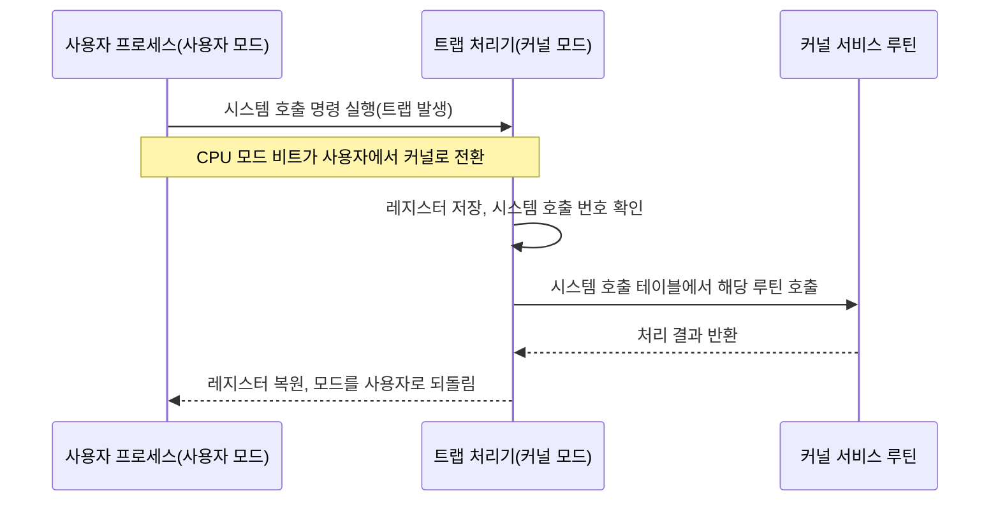

<Callout type="info">
  **이번 문서의 목표:** 이 파일을 다 읽으면 운영체제 구조 네 가지(모놀리식·계층형·마이크로커널·하이브리드)를 성능·안정성 관점에서 비교하고, 시스템 호출이 사용자 모드에서 커널 모드로 전환되는 흐름을 그릴 수 있으며, 프로세스와 스레드의 컨텍스트 스위칭 비용 차이를 실제 숫자로 계산해 어느 쪽이 왜 더 가벼운지 설명할 수 있다.
</Callout>

## 이 편에서 다시 보는 이유

독학사 2단계 운영체제 과목에서 이미 프로세스 개념·상태·PCB(Process Control Block, 프로세스 제어 블록)와 스레드의 기본 정의를 배웠다. 자세한 정의와 기본 문제는 [2단계 운영체제 05편](/독학사/2단계/운영체제/05_os-overview-and-types), [06편](/독학사/2단계/운영체제/06_process-management-and-pcb), [04편](/독학사/2단계/운영체제/04_thread-and-aceess-basics)에서 이미 충분히 다뤘으므로 이 편에서 같은 정의를 반복하지 않는다.

4단계 통합컴퓨터시스템은 "정의를 아는가"를 넘어 **구조 선택이 실제 시스템 성능·안정성에 어떤 대가를 치르게 하는가**, 그리고 **프로세스와 스레드 전환 비용이 왜 다른가**를 숫자로 설명하는 능력을 요구한다. 이 두 가지가 이 편의 핵심이다.

> **쉽게 말하면:** 2단계가 "운영체제가 무엇을 하는가"를 배웠다면, 이 편은 "그 일을 어떤 구조로 짜느냐에 따라 무엇을 잃고 얻는가"를 계산으로 확인하는 자리다.

## 운영체제 구조 네 가지와 트레이드오프

운영체제의 핵심 기능(프로세스 관리, 메모리 관리, 파일 시스템, 장치 관리 등)을 **어떻게 나누어 배치하느냐**에 따라 구조가 갈린다.

### 모놀리식 커널 (Monolithic Kernel)

모든 운영체제 서비스(프로세스 관리, 메모리 관리, 파일 시스템, 장치 드라이버)를 **하나의 커널 주소 공간** 안에서 커널 모드로 실행한다. 서비스끼리 함수 호출로 직접 통신하므로 빠르다.

> **쉽게 말하면:** 회사의 모든 부서가 칸막이 없는 한 사무실에 모여 있어서 옆자리에 바로 말을 걸 수 있는 구조다.

- **장점**: 함수 호출 하나로 서비스 간 통신이 끝나므로 오버헤드가 거의 없다. 대표적으로 리눅스(모듈 방식 지원)가 이 구조다.
- **단점**: 장치 드라이버 하나에 버그가 있어도 커널 전체가 죽을 수 있다(격리가 없다). 코드가 방대해질수록 유지보수가 어렵다.

### 계층형 구조 (Layered Structure)

시스템을 여러 계층(layer)으로 나누고, **각 계층은 바로 아래 계층의 서비스만 호출**할 수 있게 강제한다(0계층 하드웨어에 가장 가깝고, 위로 갈수록 사용자 인터페이스에 가깝다).

> **쉽게 말하면:** 아파트처럼 각 층이 오직 아래층 설비(배관·전기)만 이용할 수 있고 위층을 건너뛸 수 없는 구조다.

- **장점**: 계층 간 의존 방향이 한쪽으로만 정해져 있어 설계·디버깅·검증이 쉽다.
- **단점**: 계층을 거칠 때마다 호출 오버헤드가 쌓이고, 기능을 어느 계층에 넣을지 미리 정교하게 설계해야 해서 유연성이 떨어진다.

### 마이크로커널 (Microkernel)

커널에는 **프로세스 간 통신(IPC), 기본 스케줄링, 최소한의 메모리 관리**만 남기고, 파일 시스템·장치 드라이버 같은 나머지 서비스는 **사용자 모드의 별도 프로세스(서버)** 로 뺀다.

> **쉽게 말하면:** 본사(커널)는 꼭 필요한 조정 업무만 하고, 나머지 실무는 전부 외부 협력업체(사용자 모드 서버)에 맡기는 구조다.

- **장점**: 서버 하나가 죽어도 커널과 다른 서버는 영향을 받지 않아 **안정성**이 높다. 새 서비스를 추가·교체하기 쉽다. QNX, 초창기 미니x(MINIX)가 대표 예다.
- **단점**: 서버끼리 대화하려면 커널을 거치는 **메시지 전달(IPC)** 이 필요한데, 이는 시스템 호출보다 비싼 **모드 전환 + 컨텍스트 스위칭**을 유발한다. 서비스 하나를 처리하는 데 여러 번의 IPC가 오가면 모놀리식보다 느려질 수 있다.

### 하이브리드 구조 (Hybrid Kernel)

모놀리식의 속도와 마이크로커널의 모듈성을 절충한다. 핵심은 커널 공간에 두되, 일부 서비스는 모듈이나 사용자 모드 서버로 분리한다. 윈도우 NT 계열, macOS(XNU)가 대표 예다.

### 네 구조 한눈에 비교

| 구조 | 서비스 위치 | 서비스 간 통신 비용 | 장애 격리 | 대표 예 |
|------|------|------|------|------|
| 모놀리식 | 커널 공간 전체 | 낮음(직접 함수 호출) | 낮음(한 서비스 장애가 전체에 영향) | 리눅스 |
| 계층형 | 커널 공간, 계층별 분리 | 중간(계층을 거쳐야 함) | 중간 | 초기 THE 운영체제 |
| 마이크로커널 | 최소 커널 + 사용자 모드 서버 | 높음(IPC와 모드 전환 필요) | 높음(서버 장애가 격리됨) | QNX |
| 하이브리드 | 커널 공간 중심, 일부만 분리 | 중간–낮음 | 중간 | 윈도우 NT, macOS |

> **자주 틀리는 점:** "마이크로커널이 항상 더 빠르다"거나 "모놀리식이 항상 더 불안정하다"고 단정하면 안 된다. 마이크로커널은 **안정성과 모듈성**을 얻는 대신 **서비스 간 통신 비용**을 지불하는 구조이지, 무조건 우월한 구조가 아니다. "다음 중 옳지 않은 것은?" 유형에서 이 방향의 함정이 자주 나온다.

## 시스템 호출: 사용자 모드에서 커널 모드로

프로세스가 파일을 읽거나 메모리를 요청하는 등 하드웨어·커널 자원에 접근하려면 **시스템 호출**(system call)을 거쳐야 한다. 사용자 모드 프로세스는 커널 자원에 직접 접근할 권한이 없기 때문이다.

시스템 호출의 흐름은 다음과 같다.

이 과정에서 CPU는 **모드 비트**(mode bit, 사용자 모드 0 / 커널 모드 1로 흔히 표현)를 전환하고, 레지스터 상태를 저장했다가 복원한다. 이 전환 자체가 순수한 오버헤드다 — 실제로 유용한 일을 하지 않는데도 반드시 거쳐야 하는 비용이다.

> **쉽게 말하면:** 사용자 모드 프로그램이 커널 기능을 쓰려면 매번 "출입 신고(트랩) → 신분 확인(모드 전환) → 업무 처리 → 퇴장 신고" 절차를 거쳐야 하는데, 이 신고 절차 자체가 시간을 잡아먹는다.

## 프로세스 상태와 PCB — 통합 관점 요약

프로세스는 생성(new) → 준비(ready) → 실행(running) → 대기(waiting) → 종료(terminated) 상태를 오간다. 각 프로세스의 문맥(레지스터 값, 프로그램 카운터, 메모리 관리 정보, 열린 파일 목록 등)은 **PCB**에 저장된다. 이 정의와 상태 전이도의 세부 조건은 [2단계 운영체제 06편](/독학사/2단계/운영체제/06_process-management-and-pcb)에서 이미 다뤘다.

이 편에서 강조할 점은, **PCB가 크고 정교할수록 컨텍스트 스위칭 때 저장·복원할 정보가 많아져 전환 비용이 커진다**는 사실이다. 다음 절의 계산이 이를 숫자로 보여준다.

## 프로세스 vs 스레드: 컨텍스트 스위칭 비용을 숫자로

프로세스와 스레드 모두 "실행 흐름의 단위"이지만, 전환 비용이 크게 다르다. 그 이유를 정리하면 다음과 같다.

- **프로세스 컨텍스트 스위칭**: 다른 프로세스로 전환할 때는 PCB 전체(레지스터, 프로그램 카운터뿐 아니라 **메모리 관리 정보**, 즉 페이지 테이블 포인터 등)를 교체해야 한다. 이 과정에서 주소 공간이 완전히 바뀌므로 **TLB(Translation Lookaside Buffer, 주소 변환 버퍼)를 플러시(무효화)** 해야 하는 경우가 많다.
- **스레드 컨텍스트 스위칭(같은 프로세스 내부)**: 같은 프로세스에 속한 스레드끼리는 **주소 공간(페이지 테이블)을 공유**하므로 메모리 관리 정보를 바꿀 필요가 없다. 레지스터와 스택 포인터, 프로그램 카운터만 바꾸면 된다.

숫자로 이 차이를 검산해 보자. 다음은 이해를 돕기 위한 가상의 예시 수치다(실제 하드웨어마다 값은 다르며, 시험에서는 이런 상대적 크기 관계를 묻는다).

| 전환 유형 | 레지스터 저장·복원 | 페이지 테이블(주소 공간) 교체 | TLB 플러시 | 총 상대 비용(예시) |
|------|------|------|------|------|
| 같은 프로세스 내 스레드 전환 | 필요 | 불필요(공유) | 불필요 | 1 (기준) |
| 서로 다른 프로세스 간 전환 | 필요 | 필요 | 필요(대개 발생) | 5–10배 |

$$
\text{전환 오버헤드 비율} = \frac{\text{전환에 걸린 시간}}{\text{전환 시간} + \text{실제 실행(할당량) 시간}}
$$

- 전환에 걸린 시간: 컨텍스트 스위칭 한 번에 드는 시간(예: 스레드 전환 0.1ms, 프로세스 전환 0.5ms로 가정)
- 실제 실행 시간: 스케줄러가 한 번에 배정하는 시간 할당량(quantum, 예: 4ms로 가정)

이 값을 스레드와 프로세스 각각에 대입해 비교해 보자.

$$
\text{스레드 전환 오버헤드 비율} = \frac{0.1}{0.1+4} = \frac{0.1}{4.1} \approx 0.024 \;(\text{약}\ 2.4\%)
$$

$$
\text{프로세스 전환 오버헤드 비율} = \frac{0.5}{0.5+4} = \frac{0.5}{4.5} \approx 0.111 \;(\text{약}\ 11.1\%)
$$

**결과 해석**: 같은 시간 할당량 4ms를 기준으로 해도, 프로세스 전환은 전체 시간의 약 11.1퍼센트를 오버헤드로 날리는 반면 스레드 전환은 약 2.4퍼센트에 그친다. 이것이 "스레드가 프로세스보다 가볍다(lightweight)"고 말하는 근거를 구체적인 숫자로 보여준 것이다. 이 오버헤드 비율 계산 방식은 14편에서 라운드 로빈의 시간 할당량 크기를 논할 때 그대로 다시 쓰인다.

> **자주 틀리는 점:** "스레드는 컨텍스트 스위칭이 전혀 없다"고 오해하면 안 된다. 스레드도 레지스터·스택 포인터는 전환해야 하므로 **비용이 0은 아니다.** 다만 페이지 테이블 교체와 TLB 플러시가 없어서 프로세스 전환보다 **상대적으로 훨씬 가볍다**는 것이 정확한 표현이다.

## 프로세스 vs 스레드 통합 비교표

| 비교 항목 | 프로세스 | 스레드(같은 프로세스 내) |
|------|------|------|
| 주소 공간 | 독립적(서로 격리) | 공유 |
| 생성 비용 | 높음(주소 공간·PCB 전체 생성) | 낮음(스택·레지스터 집합만 추가) |
| 통신 방법 | IPC(파이프, 메시지 큐, 공유 메모리 등, 커널 개입 필요) | 전역 변수·힙 공유(직접 접근 가능) |
| 장애 전파 | 한 프로세스 충돌이 다른 프로세스에 영향 없음(격리) | 한 스레드의 오류(예: 잘못된 포인터 접근)가 프로세스 전체를 죽일 수 있음 |
| 컨텍스트 스위칭 비용 | 높음(페이지 테이블 교체, TLB 플러시) | 낮음(레지스터·스택만 교체) |
| 동기화 필요성 | 상대적으로 낮음(주소 공간이 다르므로 공유 자원 접근이 적음) | 높음(공유 자원 동시 접근을 반드시 동기화해야 함, 15편에서 심화) |

이 표는 단순 암기용이 아니라, "왜 웹 서버가 프로세스보다 스레드 기반(또는 이벤트 기반) 모델을 선호하는가", "왜 한 스레드의 버그가 웹 서버 전체를 다운시킬 수 있는가" 같은 4단계 통합형 서술 문제의 근거가 된다.

## 핵심 정리

- 운영체제 구조(모놀리식·계층형·마이크로커널·하이브리드)는 **서비스 간 통신 비용과 장애 격리 수준**을 맞바꾸는 트레이드오프 관계다. 마이크로커널이 무조건 우월한 것이 아니다.
- 시스템 호출은 사용자 모드 → 커널 모드 전환(트랩)을 반드시 거치며, 이 전환 자체가 순수 오버헤드다.
- 프로세스 컨텍스트 스위칭은 페이지 테이블 교체와 TLB 플러시까지 포함해 스레드 전환보다 훨씬 비싸다. 같은 할당량 대비 오버헤드 비율을 계산하면 그 차이가 5~10배 이상으로 나타난다.
- 스레드는 주소 공간을 공유해 통신·생성 비용은 낮지만, 그만큼 동기화 부담과 장애 전파 위험이 커진다.

## 마무리 복습

<Quiz
  questionNumber={1}
  question="마이크로커널 구조에 대한 설명으로 옳은 것은?"
  options={['모든 운영체제 서비스를 커널 공간에서 실행해 통신 비용이 가장 낮다', '커널에는 IPC와 최소한의 기능만 남기고 나머지 서비스는 사용자 모드 서버로 분리한다', '계층 간 호출 방향을 한쪽으로 강제해 설계를 단순화한다', '장치 드라이버 하나의 오류가 커널 전체를 곧바로 정지시킨다']}
  correctAnswer={2}
  explanation="마이크로커널은 프로세스 간 통신, 기본 스케줄링, 최소한의 메모리 관리만 커널에 남기고 파일 시스템이나 장치 드라이버 같은 서비스는 사용자 모드의 별도 서버 프로세스로 분리하는 구조다. 이 덕분에 서버 하나가 죽어도 커널과 다른 서버는 영향을 받지 않는 장애 격리를 얻는다."
  optionExplanations={['이것은 모놀리식 커널에 대한 설명이며 마이크로커널과 반대되는 특징이다.', '정답이다. 마이크로커널은 최소 기능만 남기고 나머지를 사용자 모드 서버로 분리하는 구조다.', '이것은 계층형 구조에 대한 설명이다.', '이것은 모놀리식 커널의 단점이며 마이크로커널은 오히려 장애를 격리하는 것이 특징이다.']}
/>

<Quiz
  questionNumber={2}
  question="운영체제 구조 비교에 대한 설명으로 옳지 않은 것은?"
  options={['모놀리식 커널은 서비스 간 통신을 함수 호출로 처리해 오버헤드가 적다', '계층형 구조는 상위 계층이 하위 계층의 서비스만 이용하도록 강제해 설계·검증이 쉽다', '마이크로커널은 통신 비용이 크지만 장애 격리 수준이 높다', '마이크로커널은 항상 모놀리식 커널보다 전체 처리 속도가 빠르다']}
  correctAnswer={4}
  explanation="마이크로커널은 서비스 간 통신에 IPC와 모드 전환이 필요해 모놀리식 커널의 직접 함수 호출보다 비용이 크다. 따라서 마이크로커널이 항상 더 빠르다는 설명은 옳지 않으며, 실제로는 안정성과 모듈성을 얻는 대가로 통신 비용을 더 지불하는 구조다."
  optionExplanations={['모놀리식 커널의 정확한 특징이므로 옳은 설명이다.', '계층형 구조의 정확한 특징이므로 옳은 설명이다.', '마이크로커널의 정확한 트레이드오프이므로 옳은 설명이다.', '정답이다. 마이크로커널은 IPC와 모드 전환 비용 때문에 항상 더 빠르다고 단정할 수 없다.']}
/>

<Quiz
  questionNumber={3}
  question="시스템 호출이 발생했을 때 CPU에서 일어나는 일로 옳은 것은?"
  options={['커널 모드에서 사용자 모드로 전환된 뒤 레지스터를 저장한다', '모드 비트가 사용자 모드에서 커널 모드로 전환되고 레지스터 상태가 저장된다', 'CPU는 모드 전환 없이 바로 커널 함수를 실행한다', '시스템 호출은 프로세스 상태를 대기 상태로 강제로 바꾼다']}
  correctAnswer={2}
  explanation="사용자 프로세스가 시스템 호출을 실행하면 트랩이 발생하고, CPU의 모드 비트가 사용자 모드에서 커널 모드로 전환되며 레지스터 상태가 저장된다. 이후 시스템 호출 테이블에서 해당 루틴이 실행되고, 끝나면 다시 사용자 모드로 복귀한다."
  optionExplanations={['전환 방향이 반대다. 시스템 호출은 사용자 모드에서 커널 모드로 전환된다.', '정답이다. 트랩이 발생하며 모드 비트가 사용자에서 커널로 바뀌고 레지스터가 저장된다.', '사용자 모드 프로세스는 커널 자원에 직접 접근할 권한이 없으므로 반드시 모드 전환을 거쳐야 한다.', '시스템 호출 자체가 프로세스를 대기 상태로 만드는 것은 아니다. 입출력처럼 결과를 기다려야 하는 호출에서만 대기 상태로 전이될 수 있다.']}
/>

<Quiz
  questionNumber={4}
  question="본문의 예시 수치(스레드 전환 0.1ms, 프로세스 전환 0.5ms, 시간 할당량 4ms)를 그대로 적용할 때, 프로세스 컨텍스트 스위칭의 오버헤드 비율에 가장 가까운 값은?"
  options={['약 2.4퍼센트', '약 8.3퍼센트', '약 11.1퍼센트', '약 20.0퍼센트']}
  correctAnswer={3}
  explanation="오버헤드 비율은 전환 시간을 (전환 시간+실행 시간)으로 나눈 값이다. 프로세스 전환은 0.5를 (0.5+4)로 나눈 0.5/4.5로 약 0.111, 즉 약 11.1퍼센트다."
  optionExplanations={['약 2.4퍼센트는 스레드 전환의 오버헤드 비율이다(0.1/4.1).', '이 값은 본문 공식에 어떤 수치를 넣어도 나오지 않는 값이다.', '정답이다. 0.5를 4.5로 나누면 약 0.111, 즉 약 11.1퍼센트가 된다.', '이 값은 본문 계산 결과와 맞지 않는다.']}
/>

<Quiz
  questionNumber={5}
  question="프로세스 간 컨텍스트 스위칭이 같은 프로세스 내 스레드 전환보다 비용이 큰 핵심 이유로 옳은 것은?"
  options={['프로세스는 레지스터를 저장하지 않기 때문이다', '프로세스 전환은 페이지 테이블 교체와 TLB 플러시가 필요하기 때문이다', '스레드는 스택 포인터를 전환하지 않기 때문이다', '프로세스는 항상 커널 모드에서만 실행되기 때문이다']}
  correctAnswer={2}
  explanation="서로 다른 프로세스로 전환할 때는 주소 공간 자체가 바뀌므로 페이지 테이블 포인터를 교체하고 TLB를 플러시해야 한다. 반면 같은 프로세스 내 스레드는 주소 공간을 공유하므로 이 과정이 필요 없어 훨씬 가볍다."
  optionExplanations={['프로세스 전환에서도 레지스터는 저장·복원된다. 다만 추가로 주소 공간 교체까지 필요하다는 점이 핵심이다.', '정답이다. 주소 공간 교체와 TLB 플러시가 프로세스 전환을 스레드 전환보다 무겁게 만드는 핵심 원인이다.', '스레드 전환에서도 스택 포인터와 레지스터는 전환된다. 다만 페이지 테이블은 그대로 유지된다.', '프로세스는 사용자 모드와 커널 모드를 오가며 실행되고, 시스템 호출 때만 커널 모드로 전환된다.']}
/>

<Quiz
  questionNumber={6}
  question="프로세스와 스레드의 비교로 옳지 않은 것은?"
  options={['스레드는 같은 프로세스 내에서 주소 공간을 공유한다', '프로세스는 서로 격리되어 있어 한 프로세스의 충돌이 다른 프로세스에 영향을 주지 않는다', '스레드는 주소 공간을 공유하므로 프로세스보다 동기화 부담이 낮다', '스레드 생성 비용은 일반적으로 프로세스 생성 비용보다 낮다']}
  correctAnswer={3}
  explanation="스레드는 주소 공간과 전역 변수, 힙을 공유하기 때문에 공유 자원에 대한 동시 접근을 반드시 동기화해야 한다. 따라서 스레드의 동기화 부담이 프로세스보다 낮다는 설명은 옳지 않다. 오히려 스레드 쪽이 동기화 부담이 더 크다."
  optionExplanations={['스레드가 주소 공간을 공유하는 것은 정확한 설명이다.', '프로세스가 독립적인 주소 공간을 가져 격리되는 것은 정확한 설명이다.', '정답이다. 스레드는 주소 공간을 공유하기 때문에 오히려 동기화 부담이 프로세스보다 크다.', '스레드는 주소 공간·PCB 전체를 새로 만들지 않으므로 생성 비용이 프로세스보다 낮은 것이 맞다.']}
/>

<Quiz
  questionNumber={7}
  question="PCB(Process Control Block)에 대한 설명으로 옳은 것은?"
  options={['PCB는 스레드 간에만 공유되는 자료구조다', 'PCB에는 레지스터 값, 프로그램 카운터, 메모리 관리 정보 등 프로세스의 문맥 정보가 저장된다', 'PCB의 크기는 컨텍스트 스위칭 비용과 무관하다', 'PCB는 프로세스가 종료된 뒤에도 항상 유지되어야 한다']}
  correctAnswer={2}
  explanation="PCB는 프로세스의 문맥, 즉 레지스터 값, 프로그램 카운터, 프로세스 상태, 메모리 관리 정보, 열린 파일 목록 등을 담는 자료구조다. 컨텍스트 스위칭 때 이 정보를 저장하고 복원하므로, PCB에 담긴 정보가 많을수록 전환 비용도 커진다."
  optionExplanations={['PCB는 프로세스마다 하나씩 존재하는 자료구조이며 스레드 간에 공유되는 것이 아니다.', '정답이다. PCB는 프로세스의 문맥 정보 전체를 담는 자료구조다.', 'PCB에 저장된 정보(특히 메모리 관리 정보)가 많을수록 컨텍스트 스위칭 때 저장·복원할 양이 늘어나 비용이 커진다.', '프로세스가 종료되면 PCB는 더 이상 필요하지 않으므로 회수된다.']}
/>

## 참고 자료

- [Silberschatz et al., Operating System Concepts 강의노트 정리](http://contents.kocw.or.kr/document/lec/2011_2/chungbuk/LeeJongyun_01.pdf)
- [운영체제_Study 저장소 README](https://github.com/yonghwankim-dev/OperatingSystem_Study/blob/main/README.md)
