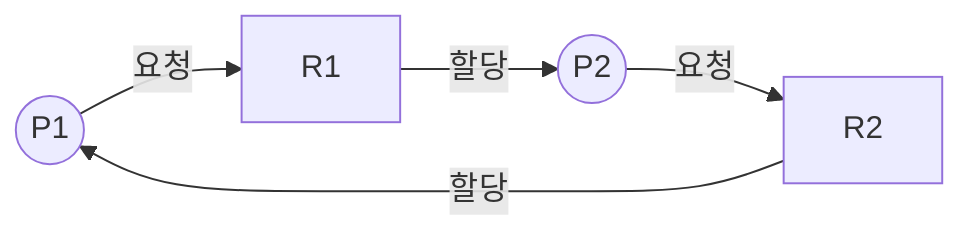

<Callout type="info">
  **이번 문서의 목표:** 이 파일을 다 읽으면 동기화 기법(뮤텍스·세마포어·모니터·스핀락)을 오버헤드와 용도로 비교하고, 은행원 알고리즘으로 자원 상태의 안전 시퀀스를 직접 찾아내며, 자원할당그래프 축약으로 교착상태를 검출하고, 예방·회피·검출·복구 네 전략의 트레이드오프를 설명할 수 있다.
</Callout>

## 2단계와 이 편의 역할 구분

임계구역 문제의 정의, 세마포어·뮤텍스의 기본 동작, 교착상태 4조건과 자원할당그래프의 기본 개념은 [2단계 운영체제 10편](/독학사/2단계/운영체제/10_synchronization-and-critical-section), [11편](/독학사/2단계/운영체제/11_deadlock)에서 이미 다뤘다. 이 편에서는 그 정의를 반복하지 않는다.

이 편은 **여러 동기화 기법을 오버헤드 기준으로 줄 세우고**, **은행원 알고리즘의 안전성 검사를 실제 숫자 표로 끝까지 계산**하며, **교착상태 검출 알고리즘을 그래프 축약 과정으로 직접 수행**하는 데 집중한다.

> **쉽게 말하면:** 2단계가 "동기화가 왜 필요하고 세마포어가 어떻게 동작하는가"를 배웠다면, 이 편은 "여러 동기화 도구 중 언제 무엇을 쓸지"와 "이미 자원을 나눠준 상황에서 교착상태가 생길지 안 생길지를 숫자로 미리 계산하는 법"을 다룬다.

## 동기화 기법 비교

| 기법 | 바쁜 대기(busy waiting) | 오버헤드 | 주요 용도 |
|------|------|------|------|
| 스핀락(spinlock) | 있음(락이 풀릴 때까지 CPU를 계속 소모하며 확인) | 대기 시간이 짧으면 낮음, 길면 CPU 낭비가 큼 | 멀티프로세서에서 임계구역이 매우 짧을 때(문맥 교환보다 대기가 더 쌀 때) |
| 뮤텍스(mutex) | 없음(락을 못 얻으면 대기 큐로 들어가 잠듦) | 문맥 교환 비용 발생, 그러나 CPU를 낭비하지 않음 | 한 번에 하나의 스레드만 접근해야 하는 일반적인 상호 배제 |
| 세마포어(semaphore) | 없음(카운터 기반, 대기 큐 사용) | 뮤텍스와 유사, 카운팅형은 여러 개의 자원 관리에 적합 | 상호 배제(이진 세마포어)와 자원 개수 제한(카운팅 세마포어) 모두 가능 |
| 모니터(monitor) | 없음 | 언어·런타임 차원의 캡슐화로 안전성이 높지만 언어 지원이 필요 | 공유 자원과 접근 코드를 하나의 모듈로 묶어 실수를 줄이고 싶을 때 |

> **자주 틀리는 점:** "세마포어는 상호 배제에만 쓴다"고 오해하면 안 된다. 값을 1로 시작하는 **이진 세마포어**는 뮤텍스처럼 상호 배제에 쓰이지만, 값을 n으로 시작하는 **카운팅 세마포어**는 "동시에 n개까지만 허용"하는 자원 개수 제한(예: 프린터 3대 중 하나를 배정)에도 쓰인다. 뮤텍스는 오직 상호 배제 전용이고, **소유권**(잠근 스레드만 풀 수 있음) 개념이 있다는 점이 세마포어와의 결정적 차이다.

## 고전 동기화 문제 비교

| 문제 | 핵심 상황 | 해결의 핵심 |
|------|------|------|
| 생산자–소비자(producer–consumer) | 유한 버퍼에 생산자가 넣고 소비자가 꺼냄 | 버퍼가 가득 차면 생산자 대기, 비면 소비자 대기 — 카운팅 세마포어 두 개(빈 칸 수, 찬 칸 수)와 상호 배제용 세마포어 하나 |
| 읽기·쓰기(readers–writers) | 여러 읽기 작업은 동시에 허용하되, 쓰기 작업은 단독 접근 필요 | 읽기 카운트 변수로 "첫 읽기 작업이 쓰기 락을 걸고, 마지막 읽기 작업이 쓰기 락을 푸는" 방식. 읽기 우선(1st) vs 쓰기 우선(2nd) 변형에 따라 기아 위험 방향이 달라짐 |
| 식사하는 철학자(dining philosophers) | 원탁의 다섯 철학자가 좌우 포크(공유 자원) 두 개를 모두 들어야 식사 가능 | 모두가 동시에 왼쪽 포크만 집으면 교착상태. 해결책: 포크를 짝수 번째는 왼쪽부터, 홀수 번째는 오른쪽부터 집게 하거나(비대칭 접근), 한 번에 접근 가능한 철학자 수를 하나 줄이거나(n−1 제한), 두 포크를 동시에 집도록 강제(원자적 획득) |

이 세 문제는 각각 **동기화 도구 자체(생산자–소비자)**, **읽기/쓰기 우선순위 정책(읽기·쓰기)**, **교착상태 발생 시나리오(식사하는 철학자)** 를 대표하는 표준 사례로 시험에 반복 출제된다.

> **쉽게 말하면:** 식사하는 철학자 문제는 "모두가 똑같은 순서로 자원을 하나씩 쥐면 다 같이 멈춘다"는 교착상태의 본질을 보여주는 대표 비유다. 다음 절에서 이 상황을 정식으로 판정하는 도구(은행원 알고리즘, 검출 알고리즘)를 다룬다.

## 은행원 알고리즘 (Banker's Algorithm) — 교착상태 회피

**아이디어**: 은행이 대출 한도를 넘지 않는 선에서 여러 고객에게 돈을 빌려주듯이, 운영체제는 프로세스가 자원을 요청할 때마다 "이 요청을 들어줘도 시스템이 여전히 **안전 상태**(모든 프로세스가 순서대로 자원을 다 받고 종료할 수 있는 상태)에 남는지" 미리 시뮬레이션해 본 뒤에만 승인한다.

세 가지 자료구조를 쓴다.

- **Max**: 프로세스별 자원 유형별 **최대 요구량**(프로세스가 앞으로 요청할 수 있는 최대치)
- **Allocation**: 프로세스별 자원 유형별 **현재 할당량**
- **Need**: 프로세스별 자원 유형별 **앞으로 더 필요할 수 있는 최대량**

$$
\text{Need}[i] = \text{Max}[i] - \text{Allocation}[i]
$$

**Available**: 현재 시스템에 남아 있는(어느 프로세스에도 할당되지 않은) 자원의 양.

### 예제: 자원 A 한 종류, 프로세스 5개

| 프로세스 | Allocation | Max | Need(Max−Allocation) |
|------|------|------|------|
| P0 | 2 | 7 | 5 |
| P1 | 3 | 5 | 2 |
| P2 | 2 | 6 | 4 |
| P3 | 1 | 4 | 3 |
| P4 | 1 | 3 | 2 |

총 자원 A가 12개이고, 위 표의 Allocation 합(2+3+2+1+1=9)만큼 이미 할당되어 있으므로 남은 Available은 다음과 같다.

$$
\text{Available} = 12 - (2+3+2+1+1) = 12-9 = 3
$$

**안전 알고리즘 단계**: Available로 Need를 만족시킬 수 있는 프로세스를 찾아 그 프로세스가 자원을 다 쓰고 반납한다고 가정한 뒤, 반납된 자원을 Available에 더하고 다음 후보를 찾는 과정을 반복한다.

1. Available=3. Need를 모두 확인하면 P1의 Need(2)와 P4의 Need(2)가 3 이하로 만족 가능하다. 이 중 하나를 고른다 — 여기서는 P1을 먼저 선택한다.
   - P1 완료 가정 → Allocation(3) 반납 → Available = 3+3 = 6
2. Available=6. 남은 프로세스 P0(5), P2(4), P3(3), P4(2) 중 만족 가능한 것을 모두 찾을 수 있다. Need가 가장 작은 P4(2)를 선택한다.
   - P4 완료 가정 → Allocation(1) 반납 → Available = 6+1 = 7
3. Available=7. 남은 P0(5), P2(4), P3(3) 모두 만족 가능하다. P3(3)을 선택한다.
   - P3 완료 가정 → Allocation(1) 반납 → Available = 7+1 = 8
4. Available=8. 남은 P0(5), P2(4) 모두 만족 가능하다. P2(4)를 선택한다.
   - P2 완료 가정 → Allocation(2) 반납 → Available = 8+2 = 10
5. Available=10. 남은 P0(5)도 만족 가능하다. P0 완료 가정 → Allocation(2) 반납 → Available = 10+2 = 12(전체 자원 회수 완료)

**안전 시퀀스**: P1 → P4 → P3 → P2 → P0. 이 순서로 자원을 내주면 모든 프로세스가 결국 자원을 다 받아 종료할 수 있으므로, 이 시스템 상태는 **안전 상태**다.

> **결과 해석**: 안전 시퀀스가 하나라도 존재하면 현재 상태는 안전 상태다. 반대로 어느 단계에서도 Need를 만족시킬 수 있는 프로세스가 하나도 없다면 그 상태는 **불안전 상태**이고, 불안전 상태가 곧 교착상태인 것은 아니지만 **교착상태로 이어질 위험이 있는 상태**다. 은행원 알고리즘은 새 요청이 들어올 때마다 "이 요청을 들어준 뒤에도 안전 시퀀스가 존재하는가"를 검사해, 존재하지 않으면 그 요청을 보류시킴으로써 아예 불안전 상태에 빠지지 않도록 **회피**한다.

> **자주 틀리는 점:** 안전 시퀀스를 찾을 때 "Need가 가장 작은 프로세스부터 봐야 한다"고 순서를 고정해서 외우면 안 된다. 실제로는 **그 시점의 Available로 Need를 만족할 수 있는 프로세스라면 어떤 순서로 골라도** 결국 안전 시퀀스를 찾을 수 있다(존재한다면). 위 예제에서 Need가 작은 순서대로 고른 것은 계산을 쉽게 하기 위한 선택일 뿐, 유일한 정답 순서가 아니다.

## 자원할당그래프 축약 — 교착상태 검출

회피(은행원 알고리즘)는 **자원을 내주기 전에** 미리 안전성을 확인하는 전략이다. 반면 **검출**은 이미 자원을 나눠준 뒤, 지금 이 순간 교착상태가 실제로 발생했는지 사후에 확인하는 전략이다. 자원 유형마다 인스턴스가 하나뿐인 경우, 자원할당그래프에서 **사이클(cycle)이 존재하는지**로 교착상태 여부를 판정한다.

이 그래프에서 P1 → R1 → P2 → R2 → P1로 이어지는 사이클이 존재한다. 자원 유형마다 인스턴스가 하나씩이라면 **사이클이 존재 = 교착상태 존재**로 확정할 수 있다.

**축약(reduction) 절차로도 같은 결론을 확인할 수 있다**: 어떤 프로세스가 요청한 자원을 지금 당장 내줄 수 있다면(그 자원을 아무도 안 쓰고 있거나, 이미 그 프로세스가 필요한 만큼 확보했다면) 그 프로세스는 실행을 마치고 자원을 반납한다고 보고 그래프에서 지운다. 이 과정을 반복해 **모든 프로세스를 지울 수 있으면 교착상태가 없고**, **더 이상 지울 수 있는 프로세스가 없는데 그래프에 프로세스가 남아 있으면 그 남은 프로세스들이 교착상태에 걸려 있는 것**이다.

위 그래프에서는 P1이 요청한 R1은 이미 P2가 갖고 있고, P2가 요청한 R2는 이미 P1이 갖고 있어 **누구도 먼저 자원을 받을 수 없으므로 지울 수 있는 프로세스가 하나도 없다** — 따라서 P1과 P2 모두 교착상태에 걸려 있다고 검출된다.

## 예방·회피·검출·복구 네 전략 비교

| 전략 | 핵심 아이디어 | 언제 개입하는가 | 비용·대가 |
|------|------|------|------|
| 예방(prevention) | 교착상태 4조건(상호 배제·점유와 대기·비선점·순환 대기) 중 하나 이상을 원천 차단 | 설계 시점(자원 할당 규칙 자체를 제한) | 자원 이용률·병행성 저하(예: 모든 자원을 한 번에 요구하게 하면 대기 시간 증가) |
| 회피(avoidance) | 은행원 알고리즘처럼 자원을 내주기 전에 안전 상태 유지 여부를 매번 계산 | 자원 요청 시점마다 | 매 요청마다 안전성 계산 오버헤드, Max를 미리 알아야 함(현실적으로 어려운 가정) |
| 검출(detection) | 자원 할당을 자유롭게 허용하되, 주기적으로 그래프를 검사해 이미 발생한 교착상태를 찾음 | 검출 알고리즘을 실행하는 시점(주기적 또는 성능 저하 감지 시) | 검출 알고리즘 실행 비용 + 교착상태가 실제로 발생한 뒤에야 알게 됨 |
| 복구(recovery) | 검출된 교착상태를 프로세스 종료 또는 자원 선점(반납)으로 풀어냄 | 교착상태가 검출된 직후 | 종료된 프로세스의 작업 손실, 선점된 자원의 롤백 비용 |

> **쉽게 말하면:** 예방은 "애초에 교착상태가 생길 수 없는 규칙"을 만드는 것이고, 회피는 "위험한 순간마다 미리 계산해서 피하는" 것이며, 검출+복구는 "일단 자유롭게 두고 문제가 생기면 그때 찾아서 해결하는" 방식이다. 자원 활용도(병행성)는 검출+복구가 가장 높고 예방이 가장 낮은 경향이 있다 — 대신 안전성 보장 수준은 그 반대다.

> **자주 틀리는 점:** "회피가 예방보다 항상 좋다"고 단정하면 안 된다. 회피는 각 프로세스가 **앞으로 요청할 최대 자원량(Max)을 미리 정확히 알고 있어야 한다**는 비현실적인 가정을 전제로 한다. 실제 시스템에서는 이 가정이 성립하기 어려워, 오히려 예방 규칙이나 검출+복구 전략이 더 실용적으로 쓰이는 경우가 많다.

## 핵심 정리

- 스핀락은 바쁜 대기로 CPU를 소모하지만 문맥 교환이 없어 매우 짧은 임계구역에 유리하고, 뮤텍스·세마포어·모니터는 대기 큐를 이용해 CPU를 낭비하지 않는다.
- 뮤텍스는 소유권이 있는 상호 배제 전용 도구이고, 세마포어는 카운팅으로 자원 개수 제한까지 표현할 수 있다.
- 은행원 알고리즘은 Need=Max−Allocation을 계산하고, 그 시점의 Available로 Need를 만족하는 프로세스를 순서대로 완료시켜 나가며 안전 시퀀스가 존재하는지 확인해 자원 요청을 승인하거나 보류한다.
- 자원 인스턴스가 하나뿐인 자원할당그래프에서는 사이클 존재 여부가 곧 교착상태 존재 여부이며, 축약 절차로 어떤 프로세스가 교착상태에 걸렸는지 구체적으로 찾을 수 있다.
- 예방·회피·검출·복구는 안전성 보장 수준과 자원 이용률(병행성)이 서로 반비례하는 트레이드오프 관계에 있다.

## 마무리 복습

<Quiz
  questionNumber={1}
  question="뮤텍스와 세마포어의 차이에 대한 설명으로 옳은 것은?"
  options={['뮤텍스는 카운팅 세마포어처럼 여러 개의 자원 인스턴스를 표현할 수 있다', '세마포어는 상호 배제에만 쓰이고 자원 개수 제한에는 쓸 수 없다', '뮤텍스는 소유권 개념이 있어 잠근 스레드만 풀 수 있지만, 세마포어는 그런 소유권 제약이 없다', '뮤텍스와 세마포어는 완전히 동일한 개념으로 이름만 다르다']}
  correctAnswer={3}
  explanation="뮤텍스는 잠근 스레드만 풀 수 있는 소유권 개념을 갖는 상호 배제 전용 도구다. 반면 세마포어는 카운터 기반으로 동작하며 소유권 제약 없이 다른 스레드가 값을 조작할 수 있고, 이진 세마포어(상호 배제)와 카운팅 세마포어(자원 개수 제한) 모두로 쓰일 수 있다."
  optionExplanations={['여러 자원 인스턴스를 표현하는 것은 카운팅 세마포어의 특징이며 뮤텍스는 상호 배제 전용이다.', '세마포어는 카운팅 세마포어 형태로 자원 개수 제한에도 쓰일 수 있다.', '정답이다. 소유권 유무가 뮤텍스와 세마포어를 가르는 핵심 차이다.', '두 도구는 목적과 사용 방식이 다른 별개의 동기화 도구다.']}
/>

<Quiz
  questionNumber={2}
  question="은행원 알고리즘의 Need 값을 구하는 공식으로 옳은 것은?"
  options={['Need = Allocation − Max', 'Need = Max − Allocation', 'Need = Available − Allocation', 'Need = Max + Allocation']}
  correctAnswer={2}
  explanation="Need는 프로세스가 앞으로 더 필요할 수 있는 최대량이며, 이미 배정한 최대 요구량(Max)에서 현재 할당량(Allocation)을 뺀 값으로 계산한다."
  optionExplanations={['뺄셈 순서가 반대다.', '정답이다. Need는 Max에서 Allocation을 뺀 값이다.', 'Available은 Need 계산과 직접적인 관련이 없는 별도의 값이다.', 'Need는 두 값을 빼서 구하는 것이지 더해서 구하는 것이 아니다.']}
/>

<Quiz
  questionNumber={3}
  question="본문의 은행원 알고리즘 예제(자원 A 총 12개, P0~P4의 Allocation 합 9)에서 초기 Available 값은?"
  options={['2', '3', '9', '12']}
  correctAnswer={2}
  explanation="Available은 전체 자원에서 이미 할당된 자원의 합을 뺀 값이다. 12에서 9를 빼면 3이 남는다."
  optionExplanations={['2는 계산 과정 어느 단계와도 일치하지 않는다.', '정답이다. 12에서 이미 할당된 9를 빼면 3이 남는다.', '9는 이미 할당된 자원의 합이지 Available이 아니다.', '12는 전체 자원의 양이며 아직 아무것도 빼지 않은 값이다.']}
/>

<Quiz
  questionNumber={4}
  question="위 3번 문제의 상태에서 안전 알고리즘을 진행할 때, 가장 먼저 완료 가능한(Need를 만족시킬 수 있는) 프로세스로 옳지 않은 것은?"
  options={['P1(Need=2)은 Available=3으로 만족 가능하다', 'P4(Need=2)는 Available=3으로 만족 가능하다', 'P0(Need=5)는 Available=3으로 즉시 만족 가능하다', 'P2(Need=4)는 초기 Available=3만으로는 만족할 수 없다']}
  correctAnswer={3}
  explanation="P0의 Need는 5인데 초기 Available은 3이므로 즉시 만족시킬 수 없다. P0은 다른 프로세스들이 먼저 자원을 반납한 뒤에야 실행을 완료할 수 있다."
  optionExplanations={['P1의 Need는 2로 Available 3 이하이므로 정확한 설명이다.', 'P4의 Need도 2로 Available 3 이하이므로 정확한 설명이다.', '정답이다. P0의 Need는 5로 초기 Available 3보다 커서 즉시 만족시킬 수 없으므로 이 설명은 옳지 않다.', 'P2의 Need는 4로 초기 Available 3보다 크므로 정확한 설명이다.']}
/>

<Quiz
  questionNumber={5}
  question="자원 유형마다 인스턴스가 하나씩인 자원할당그래프에서 교착상태 존재 여부를 판정하는 방법으로 옳은 것은?"
  options={['그래프에 프로세스 노드가 3개 이상이면 항상 교착상태다', '그래프에서 사이클이 존재하면 교착상태가 존재한다고 확정할 수 있다', '자원 노드의 개수가 프로세스 노드보다 많으면 교착상태다', '그래프의 간선 방향과 관계없이 노드 개수만으로 판정한다']}
  correctAnswer={2}
  explanation="자원 유형마다 인스턴스가 하나뿐인 경우, 자원할당그래프에서 사이클이 존재하는 것은 교착상태가 존재하는 것과 필요충분조건이다."
  optionExplanations={['노드 개수만으로는 교착상태 여부를 판정할 수 없다. 그래프의 순환 구조를 봐야 한다.', '정답이다. 인스턴스가 하나뿐인 자원의 경우 사이클 존재가 곧 교착상태 존재와 같다.', '자원 노드와 프로세스 노드의 개수 비교만으로는 교착상태를 판정할 수 없다.', '간선의 방향(요청 대 할당)이 사이클을 이루는지가 핵심이며, 노드 개수만으로는 판정할 수 없다.']}
/>

<Quiz
  questionNumber={6}
  question="교착상태 축약(reduction) 절차에 대한 설명으로 옳은 것은?"
  options={['모든 프로세스를 무조건 한 번에 지운다', '요청한 자원을 즉시 받을 수 있는 프로세스부터 실행 완료로 간주해 그래프에서 지운다', '자원 노드부터 먼저 지우고 프로세스 노드는 남긴다', '축약 절차는 자원 인스턴스가 여러 개일 때는 적용할 수 없다']}
  correctAnswer={2}
  explanation="축약 절차는 요청한 자원을 지금 당장 받을 수 있는 프로세스를 실행 완료로 간주해 그래프에서 지우고, 이 과정을 반복해 더 이상 지울 프로세스가 없을 때 남은 프로세스들을 교착상태에 걸린 것으로 판정하는 방법이다."
  optionExplanations={['축약은 조건을 만족하는 프로세스부터 하나씩(또는 순서 없이 가능한 만큼) 지우는 절차이며 한 번에 전부 지우는 것이 아니다.', '정답이다. 요청 자원을 즉시 받을 수 있는 프로세스를 완료로 간주해 지우는 것이 축약 절차의 핵심이다.', '지워지는 것은 프로세스 노드이며 자원 노드를 먼저 지우는 절차가 아니다.', '축약의 기본 원리는 인스턴스가 여러 개인 일반적인 자원 할당 그래프의 교착상태 검출 알고리즘으로도 확장할 수 있다.']}
/>

<Quiz
  questionNumber={7}
  question="교착상태 예방·회피·검출·복구 네 전략의 비교로 옳지 않은 것은?"
  options={['예방은 4조건 중 하나 이상을 원천 차단하는 방식으로 자원 이용률이 낮아지는 경향이 있다', '회피는 각 프로세스의 최대 요구량을 미리 알아야 한다는 현실적 제약이 있다', '검출+복구 방식은 자원 이용률(병행성)이 가장 높은 편이지만 교착상태가 실제로 발생한 뒤에야 알 수 있다', '회피는 예방보다 항상 우월한 전략이므로 실제 시스템에서 예방을 쓸 이유가 없다']}
  correctAnswer={4}
  explanation="회피는 각 프로세스가 앞으로 요청할 최대 자원량을 미리 정확히 알아야 한다는 비현실적인 가정을 전제로 하기 때문에, 실제 시스템에서는 오히려 예방 규칙이나 검출+복구가 더 실용적으로 쓰이는 경우가 많다. 따라서 회피가 항상 우월하다는 설명은 옳지 않다."
  optionExplanations={['예방은 자원 할당 방식 자체를 제한하므로 자원 이용률이 낮아지는 경향이 있다는 정확한 설명이다.', '회피가 Max 값을 미리 알아야 한다는 제약을 갖는다는 정확한 설명이다.', '검출+복구가 자유롭게 자원을 할당하다가 사후에 대응하는 방식이라는 정확한 설명이다.', '정답이다. 회피는 비현실적인 가정을 전제로 하므로 예방보다 항상 우월하다고 단정할 수 없다.']}
/>

## 참고 자료

- [Silberschatz et al., Operating System Concepts 강의노트 정리](http://contents.kocw.or.kr/document/lec/2011_2/chungbuk/LeeJongyun_01.pdf)
- [대학 운영체제 강의노트 – 프로세스·스레드·동기화](https://github.com/yonghwankim-dev/OperatingSystem_Study/blob/main/README.md)
