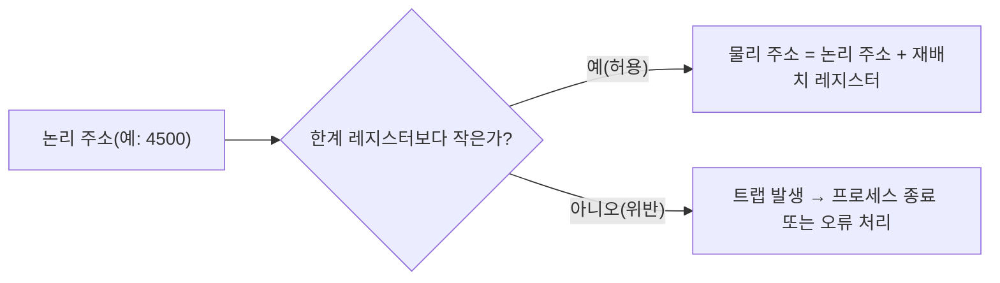

<Callout type="info">
  **이번 문서의 목표:** 이 파일을 다 읽으면 first fit·best fit·worst fit 세 알고리즘을 같은 가용 블록 목록과 요청 순서에 적용해 각기 다른 배치 결과를 손으로 계산하고, 내부 단편화와 외부 단편화를 숫자로 구분해 계산하며, 컴파일 시점·적재 시점·실행 시점 주소 바인딩의 차이와 재배치·보호 레지스터의 역할을 설명할 수 있다.
</Callout>

## 2단계와 이 편의 역할 구분

연속 메모리 할당의 기본 개념(고정 분할 대 가변 분할)과 페이징·세그먼테이션의 정의는 [2단계 운영체제 12편](/독학사/2단계/운영체제/12_memory-management-basic), [13편](/독학사/2단계/운영체제/13_paging-and-segmentation)에서 이미 다뤘다. 이 편은 그 정의를 다시 설명하지 않는다.

이 편이 다루는 것은 **같은 가용 블록 목록과 같은 요청 순서**에 대해 first fit·best fit·worst fit이 **서로 다른 결과**를 내는 과정을 직접 추적하고, 단편화 크기를 실제 숫자로 계산하며, "프로그램의 메모리 주소가 언제 확정되는가"라는 주소 바인딩 문제를 계산 없이도 명확히 구분하는 것이다.

> **쉽게 말하면:** 2단계가 "메모리를 어떻게 나눠 관리하는가"라는 큰 그림을 배웠다면, 이 편은 "같은 상황에서 배치 전략만 바꾸면 결과가 얼마나 달라지는가"를 숫자로 직접 확인하는 자리다.

## 하나의 가용 블록 목록으로 세 전략 비교하기

가용(빈) 메모리 블록이 다음과 같이 5개 있다고 하자(단위: KB).

| 블록 | 크기 |
|------|------|
| H1 | 100 |
| H2 | 500 |
| H3 | 200 |
| H4 | 300 |
| H5 | 600 |

이 상태에서 순서대로 220KB, 410KB, 130KB를 요청하는 프로세스 세 개(Q1, Q2, Q3)가 도착한다고 하자.

### First Fit (최초 적합)

**정의**: 블록 목록을 앞에서부터 순서대로 훑다가, **요청 크기 이상인 첫 번째 블록**을 찾으면 바로 그 자리에 배정한다.

> **쉽게 말하면:** 옷장을 앞칸부터 확인하다가 옷이 들어갈 만한 첫 번째 칸을 발견하면 더 뒤지지 않고 바로 넣는 방식이다.

- Q1(220KB): H1(100, 부족)→H2(500, 가능) → **H2에 배정**. H2는 500−220=280KB 남는다.
- Q2(410KB): H1(100, 부족)→H2(280, 부족, 이미 줄어든 값)→H3(200, 부족)→H4(300, 부족)→H5(600, 가능) → **H5에 배정**. H5는 600−410=190KB 남는다.
- Q3(130KB): H1(100, 부족)→H2(280, 가능) → **H2에 배정**. H2는 280−130=150KB 남는다.

| 요청 | 배정 블록 | 배정 후 남은 조각 |
|------|------|------|
| Q1(220) | H2 | 280 |
| Q2(410) | H5 | 190 |
| Q3(130) | H2(남은 조각) | 150 |

### Best Fit (최적 적합)

**정의**: 요청 크기 이상인 블록 중 **가장 작게 남는(가장 딱 맞는)** 블록을 골라 배정한다. 이를 위해 목록 전체를 확인해야 한다.

> **쉽게 말하면:** 옷장 전체를 다 확인한 뒤, 옷 크기에 가장 딱 맞는 칸을 골라 넣는 방식이다.

- Q1(220KB): 가능한 블록은 H2(500), H4(300), H5(600). 남는 조각은 각각 280, 80, 380 → 가장 작게 남는 **H4에 배정**. H4는 300−220=80KB 남는다.
- Q2(410KB): 가능한 블록은 H2(500), H5(600)(H4는 이미 80으로 줄어 부족, H3은 200으로 부족). 남는 조각은 각각 90, 190 → 가장 작게 남는 **H2에 배정**. H2는 500−410=90KB 남는다.
- Q3(130KB): 가능한 블록은 H3(200), H5(600)(H2는 90, H4는 80으로 부족). 남는 조각은 각각 70, 470 → 가장 작게 남는 **H3에 배정**. H3은 200−130=70KB 남는다.

| 요청 | 배정 블록 | 배정 후 남은 조각 |
|------|------|------|
| Q1(220) | H4 | 80 |
| Q2(410) | H2 | 90 |
| Q3(130) | H3 | 70 |

### Worst Fit (최악 적합)

**정의**: 요청 크기 이상인 블록 중 **가장 크게 남는** 블록을 골라 배정한다. 큰 조각을 남겨 나중에 재사용하기 쉽게 하려는 의도다.

> **쉽게 말하면:** 일부러 가장 넉넉하게 남는 큰 칸을 골라 옷을 넣어서, 남은 공간도 나중에 다른 옷을 넣기 편하게 하는 방식이다.

- Q1(220KB): 가능한 블록 H2(500), H4(300), H5(600), 남는 조각 280, 80, 380 → 가장 크게 남는 **H5에 배정**. H5는 600−220=380KB 남는다.
- Q2(410KB): 가능한 블록은 H2(500)뿐이다(H4=300 부족, H3=200 부족, H5는 380으로 부족). **H2에 배정**. H2는 500−410=90KB 남는다.
- Q3(130KB): 가능한 블록은 H3(200), H5(380)(H2는 90, H4는 300 가능하다 — 다시 확인하면 H4는 300으로 130 이상이라 가능). 정확히 다시 보면 가능한 블록은 H3(200), H4(300), H5(380)이고 남는 조각은 각각 70, 170, 250 → 가장 크게 남는 **H5에 배정**. H5는 380−130=250KB 남는다.

| 요청 | 배정 블록 | 배정 후 남은 조각 |
|------|------|------|
| Q1(220) | H5 | 380 |
| Q2(410) | H2 | 90 |
| Q3(130) | H5(남은 조각) | 250 |

### 세 전략 결과 비교

| 전략 | 검색 방식 | 이 예제의 특징 |
|------|------|------|
| First fit | 처음 발견한 적합 블록 즉시 배정 | 검색이 가장 빠르지만 앞쪽 블록에 작은 조각이 반복해서 쌓이기 쉽다(이 예제에서 H2가 계속 재사용됨) |
| Best fit | 전체를 검색해 가장 작게 남는 블록 선택 | 남는 조각이 매우 작아(80, 90, 70) 나중에 어느 요청도 채울 수 없는 자투리 조각이 늘어나기 쉽다 |
| Worst fit | 전체를 검색해 가장 크게 남는 블록 선택 | 큰 블록을 먼저 소진해(이 예제에서 H5가 반복 사용됨) 정작 큰 요청이 나중에 왔을 때 배정할 블록이 없어질 위험이 있다 |

> **자주 틀리는 점:** "best fit이 이름처럼 항상 가장 좋은 전략"이라고 오해하기 쉽다. 실제로는 best fit이 아주 작은 자투리 조각(외부 단편화의 씨앗)을 가장 많이 남기는 경향이 있어, 이름과 달리 장기적으로는 불리할 수 있다. 일반적으로 **속도는 first fit이 유리**하고, **공간 활용 측면에서는 상황에 따라 다르며 어느 하나가 항상 우월하지 않다**는 것이 정확한 이해다.

## 단편화 계산

### 외부 단편화 (External Fragmentation)

메모리 전체로 보면 빈 공간의 합이 요청 크기보다 크지만, **그 공간이 여러 조각으로 흩어져 있어** 하나의 요청을 채울 수 없는 상태다.

위 first fit 결과를 예로 들면, 세 요청을 모두 배정한 뒤 가용 공간은 H1(100, 원래부터 미사용) + H2(150) + H3(200, 원래부터 미사용) + H4(300, 원래부터 미사용) + H5(190) = 100+150+200+300+190 = 940KB다. 이 합은 상당히 크지만, **각 조각이 흩어져 있어** 만약 500KB짜리 요청이 새로 온다면 조각을 합칠 수 없는 한 배정할 블록이 하나도 없다 — 이것이 외부 단편화다.

### 내부 단편화 (Internal Fragmentation)

고정 크기 블록(예: 페이지 프레임)을 배정할 때, **요청한 크기가 블록 크기보다 작아서** 블록 내부에 남는 못 쓰는 공간이다.

**예제**: 페이지(프레임) 크기가 4KB(=4096바이트)이고, 프로세스가 10000바이트를 요청했다고 하자.

$$
\text{필요한 프레임 수} = \left\lceil \frac{10000}{4096} \right\rceil = \lceil 2.44 \rceil = 3
$$

$$
\text{실제 할당되는 크기} = 3 \times 4096 = 12288 \text{바이트}
$$

$$
\text{내부 단편화} = 12288 - 10000 = 2288 \text{바이트}
$$

**결과 해석**: 프로세스는 10000바이트만 필요했지만 프레임 단위로만 배정할 수 있어 12288바이트를 할당받았고, 그 차이인 2288바이트는 이 프로세스만 쓸 수 있고 다른 프로세스는 쓸 수 없는 **낭비 공간**이 된다. 이것이 페이징 방식이 안고 가는 내부 단편화다.

| 구분 | 외부 단편화 | 내부 단편화 |
|------|------|------|
| 발생 원인 | 가변 크기 블록을 계속 할당·해제하며 조각들이 흩어짐 | 고정 크기 블록보다 작은 요청을 배정하며 블록 내부에 남는 공간 |
| 주로 발생하는 방식 | 연속 할당(가변 분할) | 페이징(고정 크기 프레임) |
| 해결책 | 압축(compaction, 조각을 한쪽으로 모아 큰 블록으로 합침) | 프레임 크기를 작게 하거나(대신 페이지 테이블이 커짐) 근본적으로 페이징 자체의 특성으로 감수 |

> **쉽게 말하면:** 외부 단편화는 "빈 공간은 충분한데 모아 쓸 수가 없는" 문제이고, 내부 단편화는 "내가 받은 공간 안에 남는 자투리를 나만 쥐고 있어 남에게 못 주는" 문제다.

**압축(compaction)의 대가**: 압축은 이미 배정된 프로세스들을 메모리 안에서 이동시켜 빈 공간을 한쪽으로 모으는 작업이다. 이동하는 동안 해당 프로세스는 실행을 멈춰야 하고, 이동한 데이터만큼 복사 비용(시간)이 든다 — 즉 외부 단편화를 없애는 대가로 **일시적인 성능 저하**를 지불한다.

## 주소 바인딩: 언제 물리 주소가 확정되는가

프로그램 안의 변수·명령어는 처음에는 **논리 주소(logical address, 상대 주소)** 로 표현되다가, 결국 실제 메모리의 **물리 주소(physical address)** 로 대응(바인딩)되어야 실행할 수 있다. 이 바인딩이 **언제 일어나느냐**에 따라 세 단계로 나뉜다.

| 바인딩 시점 | 확정되는 때 | 장단점 |
|------|------|------|
| 컴파일 시점(compile-time binding) | 컴파일할 때 물리 주소가 절대 주소로 바로 확정 | 프로그램이 메모리의 어느 위치에서 실행될지 미리 알아야 하며, 위치가 바뀌면 다시 컴파일해야 한다. 구식·특수 목적 시스템에서만 쓰인다 |
| 적재 시점(load-time binding) | 프로그램을 메모리에 적재할 때 물리 주소 확정 | 컴파일 시점에는 상대 주소만 정하고, 적재될 위치가 정해지면 그 시점에 물리 주소로 변환한다. 한 번 적재된 뒤에는 실행 중 위치를 옮길 수 없다 |
| 실행 시점(execution-time binding) | 프로그램 실행 중에도 계속(명령어를 실행할 때마다) 물리 주소를 변환 | 실행 도중에도 프로세스를 다른 메모리 위치로 옮길 수 있다(예: 압축, 스와핑). 이를 위해서는 **재배치 레지스터(relocation register)** 같은 하드웨어 지원이 필요하다 |

**재배치 레지스터를 이용한 주소 변환**은 다음과 같이 계산한다.

$$
\text{물리 주소} = \text{논리 주소} + \text{재배치 레지스터 값}
$$

**예제**: 재배치 레지스터 값이 300000이고, 프로그램이 참조한 논리 주소가 4500이라면,

$$
\text{물리 주소} = 4500 + 300000 = 304500
$$

이 값이 **한계 레지스터(limit register)** 에 설정된 값(그 프로세스에게 허용된 최대 논리 주소, 예를 들어 120000)보다 작은지도 매 접근마다 검사한다.

$$
4500 < 120000 \;(\text{한계 검사 통과})
$$

만약 논리 주소가 한계 레지스터 값 이상이면 하드웨어가 **트랩(오류)** 을 발생시켜 그 프로세스가 다른 프로세스의 메모리 영역을 침범하지 못하게 막는다 — 이것이 **보호(protection)** 의 기본 메커니즘이다.

> **자주 틀리는 점:** "재배치 레지스터는 실행 시점 바인딩에서만 의미가 있다"는 것을 "재배치 레지스터가 있으면 무조건 실행 시점 바인딩"이라고 거꾸로 이해하면 안 된다. 정확히는 **실행 시점 바인딩을 지원하려면 재배치 레지스터 같은 하드웨어가 반드시 필요**하다는 방향의 관계다. 재배치 레지스터 자체는 실행 시점 바인딩을 가능하게 하는 수단이지, 그 존재만으로 바인딩 시점이 결정되는 것은 아니다.

## 핵심 정리

- First fit은 검색이 빠르지만 앞쪽 블록에 조각이 몰리고, best fit은 매우 작은 자투리를 많이 남기며, worst fit은 큰 블록을 먼저 소진해 정작 큰 요청에 대응하기 어려워질 수 있다 — 어느 하나가 항상 우월하지 않다.
- 외부 단편화는 빈 공간이 흩어져 큰 요청을 채우지 못하는 문제이고, 내부 단편화는 고정 크기 블록 내부에 남는 못 쓰는 공간이다. 압축은 외부 단편화를 없애지만 이동 비용(성능 저하)을 치른다.
- 주소 바인딩은 컴파일 시점·적재 시점·실행 시점 세 단계로 나뉘며, 실행 시점 바인딩만 프로세스를 실행 중에 다른 메모리 위치로 옮길 수 있게 해 준다.
- 물리 주소 = 논리 주소 + 재배치 레지스터 값이며, 매 접근마다 한계 레지스터와 비교해 다른 프로세스의 영역을 침범하지 않도록 보호한다.

## 마무리 복습

<Quiz
  questionNumber={1}
  question="본문의 가용 블록 목록(H1=100, H2=500, H3=200, H4=300, H5=600)에 220KB 요청 Q1이 도착했을 때, best fit으로 배정되는 블록은?"
  options={['H2', 'H4', 'H5', 'H1']}
  correctAnswer={2}
  explanation="220KB 이상인 블록은 H2(500), H4(300), H5(600)이며 남는 조각은 각각 280, 80, 380이다. 이 중 가장 작게 남는 H4가 best fit으로 선택된다."
  optionExplanations={['H2는 남는 조각이 280으로 H4의 80보다 크므로 best fit에서 선택되지 않는다.', '정답이다. 남는 조각이 80으로 가장 작은 H4가 best fit으로 선택된다.', 'H5는 남는 조각이 380으로 가장 크므로 오히려 worst fit에서 선택되는 블록이다.', 'H1은 100KB로 220KB 요청을 채우기에 크기가 부족하다.']}
/>

<Quiz
  questionNumber={2}
  question="같은 가용 블록 목록에 first fit을 적용할 때 Q1(220KB)이 배정되는 블록과 남는 크기로 옳은 것은?"
  options={['H2에 배정되고 280KB가 남는다', 'H4에 배정되고 80KB가 남는다', 'H5에 배정되고 380KB가 남는다', 'H3에 배정되고 부족해 배정되지 않는다']}
  correctAnswer={1}
  explanation="first fit은 목록을 앞에서부터 확인해 처음 발견한 적합 블록에 즉시 배정한다. H1(100)은 부족하고 그다음인 H2(500)가 220 이상이므로 H2에 배정되며, 500에서 220을 뺀 280KB가 남는다."
  optionExplanations={['정답이다. first fit은 앞에서부터 검색해 처음 발견한 H2에 배정하고 280KB가 남는다.', 'H4에 배정되는 것은 best fit의 결과다.', 'H5에 배정되는 것은 worst fit의 결과다.', 'H3(200)은 220KB 요청보다 작아 배정될 수 없지만, first fit은 애초에 H3까지 검색하지 않고 H2에서 이미 배정을 마친다.']}
/>

<Quiz
  questionNumber={3}
  question="worst fit 전략의 특징과 위험으로 옳은 것은?"
  options={['가장 작게 남는 블록을 선택해 자투리를 최소화한다', '가장 크게 남는 블록을 선택해 큰 블록을 먼저 소진시키므로 나중에 큰 요청을 처리하지 못할 위험이 있다', '목록의 첫 번째 적합 블록을 즉시 선택해 검색 속도가 가장 빠르다', '항상 best fit보다 메모리를 더 효율적으로 사용한다']}
  correctAnswer={2}
  explanation="worst fit은 요청 크기 이상인 블록 중 가장 크게 남는 블록을 선택한다. 이 때문에 큰 블록들이 먼저 소진되어, 이후 정말 큰 요청이 도착했을 때 배정할 수 있는 블록이 없어질 위험이 있다."
  optionExplanations={['가장 작게 남는 블록을 선택하는 것은 best fit의 특징이다.', '정답이다. 큰 블록을 먼저 소진시켜 이후 큰 요청에 대응하지 못할 위험이 worst fit의 대표적 단점이다.', '목록을 순서대로 확인하다 처음 적합한 블록을 즉시 선택하는 것은 first fit의 특징이다.', 'worst fit이 best fit보다 항상 효율적이라는 보장은 없으며, 상황에 따라 결과가 달라진다.']}
/>

<Quiz
  questionNumber={4}
  question="페이지(프레임) 크기가 4096바이트이고 프로세스가 10000바이트를 요청할 때, 발생하는 내부 단편화 크기는?"
  options={['1096바이트', '2288바이트', '3096바이트', '4096바이트']}
  correctAnswer={2}
  explanation="필요한 프레임 수는 10000을 4096으로 나눈 값을 올림한 3이다. 실제 할당되는 크기는 3×4096=12288바이트이며, 요청한 10000바이트를 뺀 2288바이트가 내부 단편화다."
  optionExplanations={['1096바이트는 본문 계산 어느 단계와도 일치하지 않는다.', '정답이다. 12288에서 10000을 뺀 2288바이트가 내부 단편화다.', '3096바이트는 본문 계산 결과와 일치하지 않는다.', '4096바이트는 프레임 하나의 크기이며 내부 단편화 값이 아니다.']}
/>

<Quiz
  questionNumber={5}
  question="외부 단편화와 내부 단편화를 구분하는 설명으로 옳은 것은?"
  options={['외부 단편화는 고정 크기 블록 내부에 남는 못 쓰는 공간이다', '내부 단편화는 빈 공간이 여러 조각으로 흩어져 큰 요청을 채우지 못하는 문제다', '외부 단편화는 빈 공간의 총합은 충분하지만 조각나 있어 하나의 요청을 채우지 못하는 문제다', '두 단편화는 항상 동시에 같은 크기로 발생한다']}
  correctAnswer={3}
  explanation="외부 단편화는 가변 크기 블록을 계속 할당·해제하는 과정에서 빈 공간이 여러 조각으로 흩어져, 총합은 충분해도 하나의 요청을 채울 수 없는 문제다. 반면 내부 단편화는 고정 크기 블록보다 작은 요청을 배정할 때 블록 내부에 남는 낭비 공간이다."
  optionExplanations={['이 설명은 내부 단편화에 대한 설명이다.', '이 설명은 외부 단편화에 대한 설명이다.', '정답이다. 외부 단편화는 조각난 빈 공간 때문에 큰 요청을 채우지 못하는 문제라는 정확한 설명이다.', '두 단편화는 발생 원인과 상황이 다르며 항상 같은 크기로 함께 발생하지 않는다.']}
/>

<Quiz
  questionNumber={6}
  question="주소 바인딩 시점 세 가지(컴파일·적재·실행 시점)에 대한 설명으로 옳지 않은 것은?"
  options={['컴파일 시점 바인딩은 프로그램이 실행될 메모리 위치를 미리 알아야 한다', '적재 시점 바인딩은 프로그램을 메모리에 올릴 때 물리 주소를 확정한다', '실행 시점 바인딩은 실행 중에도 프로세스를 다른 메모리 위치로 옮길 수 있게 한다', '실행 시점 바인딩은 재배치 레지스터 같은 하드웨어 지원 없이도 항상 가능하다']}
  correctAnswer={4}
  explanation="실행 시점 바인딩은 명령어를 실행할 때마다 논리 주소를 물리 주소로 변환해야 하므로, 이를 지원하려면 재배치 레지스터 같은 하드웨어의 도움이 반드시 필요하다. 하드웨어 지원 없이 항상 가능하다는 설명은 옳지 않다."
  optionExplanations={['컴파일 시점 바인딩은 정확히 이런 제약을 갖는다는 정확한 설명이다.', '적재 시점 바인딩에 대한 정확한 설명이다.', '실행 시점 바인딩의 핵심 장점에 대한 정확한 설명이다.', '정답이다. 실행 시점 바인딩은 재배치 레지스터 같은 하드웨어 지원이 반드시 필요하다.']}
/>

<Quiz
  questionNumber={7}
  question="재배치 레지스터 값이 300000이고 프로세스가 참조한 논리 주소가 4500일 때, 물리 주소는?"
  options={['295500', '300000', '304500', '4500']}
  correctAnswer={3}
  explanation="물리 주소는 논리 주소에 재배치 레지스터 값을 더한 값이다. 4500에 300000을 더하면 304500이 된다."
  optionExplanations={['295500은 뺄셈으로 잘못 계산했을 때 나올 수 있는 값이며 공식과 맞지 않는다.', '300000은 재배치 레지스터 값 그 자체이며 논리 주소를 더하지 않은 값이다.', '정답이다. 4500과 300000을 더한 304500이 물리 주소다.', '4500은 논리 주소이며 재배치 레지스터 값을 더하지 않은 값이다.']}
/>

## 참고 자료

- [Silberschatz et al., Operating System Concepts 강의노트 정리](http://contents.kocw.or.kr/document/lec/2011_2/chungbuk/LeeJongyun_01.pdf)
- [대학 운영체제 강의노트 – 가상메모리·페이징·페이지 교체](http://contents.kocw.or.kr/document/lec/2011_2/chungbuk/LeeJongyun_01.pdf)
