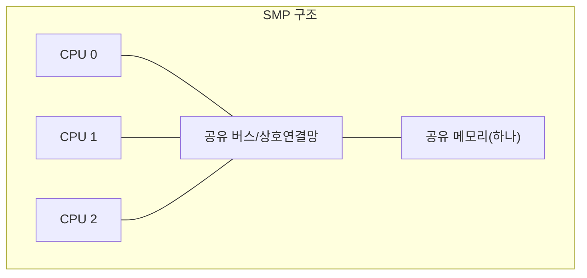
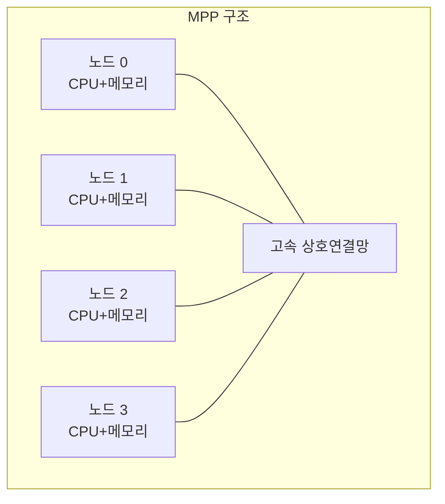
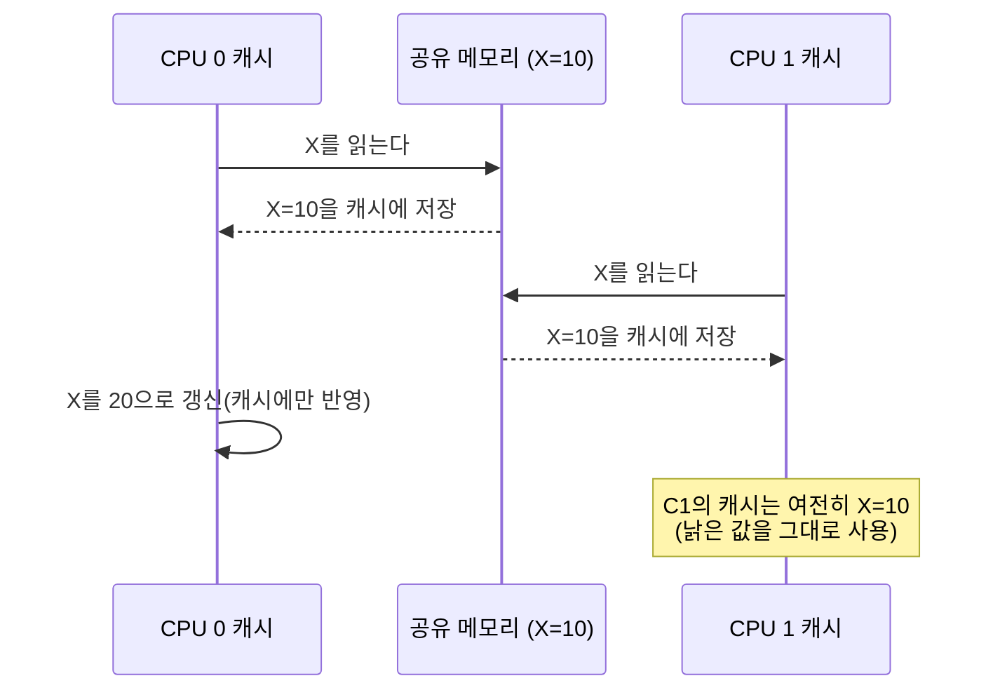

<Callout type="info">
  **이번 문서의 목표:** SMP·MPP 구조의 차이, 암달의 법칙으로 병렬 처리 성능을 계산하는 법, 캐시 일관성 문제가 왜 생기는지, 분산 시스템이 단일·멀티프로세서 시스템과 어떻게 다른지 설명할 수 있게 한다.
</Callout>

지금까지는 프로세서 하나, 메모리 하나로 이루어진 시스템을 전제로 파이프라인·캐시·스케줄링을 다뤘다. 하지만 실제 서버·데스크톱 대부분은 프로세서 코어를 여러 개 갖추고 있고, 대규모 서비스는 여러 대의 컴퓨터를 네트워크로 묶어 운영한다. 이 문서는 "프로세서가 여러 개일 때" 생기는 구조·성능·일관성 문제를 다룬다. 03편의 Amdahl's Law(암달의 법칙)를 이 문서에서 실제 계산에 사용하므로, 필요하면 03편을 함께 확인한다.

## 멀티프로세서 구조: 왜 필요한가

> **쉽게 말하면:** 프로세서 하나를 더 빠르게 만드는 데는 한계가 있으니, 여러 개를 동시에 쓰는 쪽으로 방향을 튼 것이다.

06~08편에서 다룬 파이프라인·해저드 처리로 단일 프로세서(uniprocessor)의 속도를 끌어올리는 데도 물리적 한계(발열, 신호 지연, 소비 전력)가 있다. 이 한계에 부딪히자, 프로세서 하나의 속도를 높이는 대신 **프로세서 자체를 여러 개 두어 작업을 나눠 동시에 처리**하는 방향으로 무게중심이 옮겨갔다. 이것이 멀티프로세서(multiprocessor) 시스템이다. 멀티프로세서는 메모리를 어떻게 공유하느냐에 따라 크게 두 갈래로 나뉜다.

### SMP(Symmetric Multiprocessing, 대칭형 다중처리)

여러 개의 동일한 프로세서(또는 코어)가 **하나의 물리 메모리를 공유**하고, 모든 프로세서가 동등한 자격으로 운영체제와 입출력 장치에 접근하는 구조다. "대칭(symmetric)"이라는 이름은 어느 한 프로세서가 특별한 역할(예: 관리자 역할)을 맡지 않고 모두 같은 지위를 가진다는 뜻에서 왔다.

- **장점**: 어떤 프로세서든 메모리의 어느 부분에나 똑같이 빠르게 접근할 수 있어(균일 메모리 접근, UMA — Uniform Memory Access) 프로그래밍이 비교적 단순하다. 오늘날의 멀티코어 데스크톱·서버 CPU가 대표적인 SMP 사례다.
- **단점**: 프로세서 수가 늘어날수록 공유 메모리와 버스에 접근이 몰려 병목(bottleneck)이 심해진다. 이 때문에 SMP는 확장성(scalability, 프로세서를 늘렸을 때 성능이 비례해 늘어나는 정도)에 한계가 있다.

### MPP(Massively Parallel Processing, 대규모 병렬처리)

수십에서 수천 개에 이르는 프로세서 각각이 **자신만의 독립된 메모리**를 가지고, 네트워크로 연결되어 메시지를 주고받으며 협력하는 구조다. 프로세서마다 메모리 접근 시간이 균일하지 않다는 뜻에서 비균일 메모리 접근(NUMA — Non-Uniform Memory Access) 구조를 취하는 경우가 많다.

- **장점**: 각 노드가 독립된 메모리를 쓰므로 공유 메모리 병목이 없고, 노드를 계속 추가해 나가는 방식으로 SMP보다 훨씬 큰 규모까지 확장할 수 있다.
- **단점**: 한 노드가 다른 노드의 메모리에 있는 데이터가 필요하면 네트워크를 거쳐야 해 지연(latency)이 커지고, 프로그래머가 데이터를 어느 노드에 둘지 직접 고려해야 하는 등 프로그래밍이 더 복잡하다.

| 구분 | SMP | MPP |
|---|---|---|
| 메모리 구조 | 프로세서들이 메모리 하나를 공유 | 프로세서마다 독립된 메모리 |
| 메모리 접근 특성 | UMA(균일 접근) | NUMA(비균일 접근)에 가까움 |
| 확장성 | 상대적으로 제한적(공유 자원 병목) | 상대적으로 높음(노드 추가로 확장) |
| 프로그래밍 난이도 | 비교적 단순 | 상대적으로 복잡(데이터 배치 고려) |
| 대표 예 | 멀티코어 CPU 한 대 | 대규모 클러스터, 슈퍼컴퓨터 |

## 병렬 처리 성능 계산: 암달의 법칙

> **쉽게 말하면:** 프로그램의 일부만 병렬로 빠르게 만들 수 있다면, 프로세서를 아무리 늘려도 전체 속도 향상에는 뚜렷한 한계가 있다.

03편에서 소개한 **암달의 법칙(Amdahl's Law)** 은 병렬화할 수 없는 부분(순차 부분)이 전체 성능 향상의 상한을 어떻게 결정하는지 보여 주는 식이다.

$$
\text{속도 향상} = \dfrac{1}{(1-p) + \dfrac{p}{n}}
$$

- $p$: 전체 실행시간 중 병렬화가 가능한 부분의 비율(0에서 1 사이).
- $1-p$: 병렬화할 수 없는 순차(serial) 부분의 비율. 프로세서를 아무리 늘려도 이 부분은 그대로 걸린다.
- $n$: 사용하는 프로세서(코어) 개수.

프로그램의 90퍼센트($p=0.9$)를 병렬화할 수 있고, 프로세서를 10개($n=10$) 쓴다고 하자.

$$
\text{속도 향상} = \dfrac{1}{(1-0.9) + \dfrac{0.9}{10}} = \dfrac{1}{0.1 + 0.09}
$$

$$
\text{속도 향상} = \dfrac{1}{0.19} \approx 5.26\text{배}
$$

**결과 해석:** 프로세서를 10배 늘렸는데도 속도는 5.26배밖에 빨라지지 않았다. 프로세서 수 $n$을 무한히 늘리면 $p/n$ 항은 0에 가까워지므로, 이론상 최대 속도 향상은 다음처럼 순차 부분만으로 결정되는 값에 수렴한다.

$$
\text{최대 속도 향상} = \dfrac{1}{1-p} = \dfrac{1}{0.1} = 10\text{배}
$$

즉 이 프로그램은 프로세서를 아무리 많이 투입해도 10배 이상 빨라질 수 없다. 시험에서는 "속도 향상이 특정 배수를 넘지 못하는 이유"나 "목표 속도 향상을 달성하기 위한 최소 병렬화 비율"을 역산하는 문제로 자주 나온다.

## 캐시 일관성 문제

> **쉽게 말하면:** 프로세서마다 자기만의 캐시에 같은 데이터의 사본을 갖고 있으면, 한쪽이 값을 바꿨을 때 다른 쪽이 낡은 값을 계속 쓰는 사고가 생길 수 있다.

09~10편에서 다룬 캐시는 원래 단일 프로세서를 전제로 설명했다. 그런데 SMP처럼 여러 프로세서가 메모리를 공유하면서 각자 자신의 캐시도 따로 갖는 구조에서는 새로운 문제가 생긴다.

CPU 0과 CPU 1이 같은 메모리 주소 X의 값(10)을 각자의 캐시에 복사해 두었다가, CPU 0이 자신의 캐시에서 X를 20으로 바꾸면, CPU 1의 캐시에는 여전히 옛날 값 10이 남아 있다. 이렇게 **여러 캐시에 있는 같은 데이터의 사본이 서로 다른 값을 갖게 되는 문제**를 캐시 일관성 문제(cache coherence problem)라 한다.

이 문제를 해결하기 위해 하드웨어는 캐시 일관성 프로토콜(cache coherence protocol)을 사용한다. 대표적으로 **쓰기 무효화(write-invalidate)** 방식은 한 프로세서가 데이터를 쓰면 다른 프로세서들이 가진 그 데이터의 캐시 사본을 무효(invalid) 상태로 표시해, 다음에 그 데이터를 읽을 때 반드시 최신 값을 다시 가져오도록 강제한다. 이런 프로토콜의 대표적인 예로 MESI(Modified-Exclusive-Shared-Invalid, 각 캐시 라인의 상태를 네 가지로 관리하는 프로토콜) 같은 상태 기반 프로토콜이 있으며, 세부 상태 전이는 컴퓨터구조 심화 과정에서 다룬다.

프로세서 수가 늘어날수록 이런 일관성 유지를 위한 통신(경합, contention)도 늘어나므로, 이는 SMP 확장성의 한계를 만드는 또 다른 요인이 된다. **경합(contention)** 이란 여러 프로세서가 같은 자원(공유 메모리, 버스, 락 등)을 동시에 쓰려고 다투는 정도를 말하며, 경합이 심할수록 프로세서를 늘려도 실제 성능 향상은 암달의 법칙이 예측하는 값보다 더 낮아질 수 있다.

## 분산 시스템: 멀티프로세서와 무엇이 다른가

> **쉽게 말하면:** 멀티프로세서는 한 컴퓨터 안의 여러 프로세서 이야기이고, 분산 시스템은 여러 대의 독립된 컴퓨터를 네트워크로 묶은 이야기다.

**분산 시스템(distributed system)** 은 물리적으로 떨어져 있는 여러 대의 독립된 컴퓨터(노드)가 네트워크를 통해 통신하며, 사용자에게는 마치 하나의 통합된 시스템처럼 보이도록 동작하는 시스템이다. MPP와 개념적으로 비슷해 보이지만, 다음과 같은 차이가 있다.

| 구분 | MPP | 분산 시스템 |
|---|---|---|
| 결합 정도 | 강결합(tightly coupled) — 고속 전용 상호연결망으로 촘촘히 연결 | 약결합(loosely coupled) — 일반 네트워크(근거리/광역)로 연결 |
| 물리적 위치 | 보통 한 장소(전용 시설)에 모여 있음 | 서로 다른 위치·건물·지역에 흩어질 수 있음 |
| 관리 주체 | 단일 시스템으로 통합 관리 | 각 노드가 독립적으로 존재할 수 있고 이질적일 수 있음 |
| 목적 | 하나의 대규모 계산을 나눠 빠르게 처리(고성능 계산) | 가용성·확장성·자원 공유(웹 서비스, 파일 공유 등)가 목적인 경우가 많음 |

분산 시스템에서 자주 다뤄지는 대표 사례로는 다음이 있다.

- **클러스터(cluster)**: 여러 대의 컴퓨터를 하나의 논리적 자원처럼 묶어, 한 노드가 고장 나도 다른 노드가 대신 작업을 이어받게 하거나(고가용성, high availability) 부하를 나눠 처리하게(부하 분산, load balancing) 하는 구성이다.
- **네트워크 파일시스템(NFS, Network File System)**: 18편에서 다룬 파일 시스템을 네트워크 너머의 원격 서버에 두고, 사용자는 마치 자신의 로컬 디스크에 있는 파일처럼 접근할 수 있게 해 주는 방식이다. 사용자 입장에서 파일이 로컬에 있는지 원격에 있는지 신경 쓰지 않아도 되게 하는 성질을 **투명성(transparency)** 이라 하며, 분산 시스템 설계에서 중요하게 다뤄지는 목표다.

## 통합 관점의 출제 포인트

독학사 4단계 시험은 이 단원을 단독으로 깊게 묻기보다, 앞선 편들과 엮어 **"왜 여러 프로세서·여러 컴퓨터를 쓰는가"** 라는 관점에서 묻는 경우가 많다.

- 파이프라인(07~08편)이 명령어 수준의 병렬성(ILP, Instruction-Level Parallelism)을 프로세서 하나 안에서 끌어낸다면, 멀티프로세서는 그 위 단계에서 스레드·프로세스 수준의 병렬성(TLP, Thread-Level Parallelism)을 끌어낸다는 계층적 관계를 이해해 두면 통합형 문항에 유리하다.
- 13~15편의 동기화 기법(뮤텍스, 세마포어)은 멀티프로세서 환경의 경합·임계구역 문제와 직접 연결된다. 여러 CPU가 동시에 같은 자원에 접근할 수 있는 멀티프로세서 환경에서는 단일 프로세서보다 동기화 실패의 위험이 더 크다는 점이 자주 출제된다.
- 12편의 RAID처럼 여러 디스크를 묶어 성능·신뢰성을 높이는 아이디어는, 이 편의 여러 프로세서·여러 컴퓨터를 묶는 아이디어와 "자원을 여러 개 두어 성능 또는 신뢰성을 높인다"는 같은 설계 철학을 공유한다. 이런 연결을 짚어 주는 서술형 문항이 통합형 문제에서 나올 수 있다.

## 자주 틀리는 점

- **SMP와 MPP를 프로세서 개수로만 구분한다.** 개수보다 **메모리를 공유하는지 여부**가 핵심 구분 기준이다. 메모리를 공유하면 SMP, 각자 독립된 메모리를 쓰면 MPP(또는 그와 유사한 구조)다.
- **암달의 법칙에서 순차 부분의 비중을 무시한다.** 병렬화 비율 $p$가 아무리 1에 가까워도 $1-p$가 0이 아닌 한 프로세서 수를 무한히 늘려도 성능 향상에는 명확한 상한이 있다.
- **캐시 일관성 문제를 캐시 미스와 혼동한다.** 캐시 일관성 문제는 "같은 데이터의 여러 사본이 서로 달라지는" 문제이지, 09편에서 다룬 "캐시에 데이터가 없어 못 찾는" 캐시 미스와는 다른 문제다.
- **분산 시스템과 MPP를 완전히 같은 것으로 본다.** 둘 다 여러 노드가 협력한다는 점은 같지만, 결합 정도(강결합 vs 약결합)와 목적(고성능 계산 vs 가용성·자원 공유)이 다르다.

## 핵심 정리

- SMP는 여러 프로세서가 메모리 하나를 공유하는 구조(UMA)이고, MPP는 프로세서마다 독립된 메모리를 갖는 구조(NUMA에 가까움)이며, SMP는 확장성이 제한적이고 MPP는 프로그래밍이 더 복잡하다.
- 암달의 법칙은 병렬화 가능 비율 $p$와 프로세서 수 $n$으로 속도 향상을 계산하며, $n$을 무한히 늘려도 속도 향상은 $1/(1-p)$을 넘지 못한다.
- 여러 프로세서가 각자 캐시에 같은 데이터의 사본을 가질 때 값이 어긋나는 것이 캐시 일관성 문제이며, 쓰기 무효화 같은 프로토콜로 해결한다.
- 분산 시스템은 약결합된 여러 독립 컴퓨터가 네트워크로 연결된 구조로, MPP(강결합)와는 결합 정도와 목적이 다르다. 클러스터와 네트워크 파일시스템이 대표 사례다.
- 이 단원은 파이프라인의 명령어 수준 병렬성, 동기화, RAID 등 앞선 편들과 "병렬·복수 자원을 통한 성능·신뢰성 향상"이라는 관점으로 묶여 통합형 문항에 자주 등장한다.

## 마무리 복습

<Quiz
  questionNumber={1}
  question="SMP(대칭형 다중처리)와 MPP(대규모 병렬처리)를 구분하는 가장 핵심적인 기준은?"
  options={['프로세서의 제조사가 같은지 여부', '프로세서들이 물리 메모리를 공유하는지 여부', '운영체제의 버전이 같은지 여부', '설치된 디스크의 개수']}
  correctAnswer={2}
  explanation="SMP는 여러 프로세서가 하나의 공유 메모리에 동등하게 접근하는 구조이고, MPP는 프로세서마다 독립된 메모리를 갖는 구조다. 이 메모리 공유 여부가 두 구조를 가르는 핵심 기준이다."
  optionExplanations={['제조사 동일 여부는 SMP·MPP 구분과 관련이 없다', '정답. 메모리 공유 여부가 SMP와 MPP를 가르는 핵심 기준이다', '운영체제 버전은 이 구분의 기준이 아니다', '디스크 개수는 이 구분과 직접 관련이 없다']}
/>

<Quiz
  questionNumber={2}
  question="어떤 프로그램의 80퍼센트를 병렬화할 수 있을 때, 프로세서 개수를 아무리 늘려도 이론상 넘을 수 없는 최대 속도 향상은?"
  options={['1.25배', '4배', '5배', '8배']}
  correctAnswer={3}
  explanation="암달의 법칙에서 프로세서 수를 무한히 늘리면 최대 속도 향상은 1/(1-p)에 수렴한다. p=0.8이므로 1/(1-0.8)=1/0.2=5배가 이론상 상한이다."
  optionExplanations={['1-p=0.2를 그대로 답으로 쓴 값에 가깝다(1/0.8을 잘못 계산한 값)', '병렬화 비율 자체(0.8)를 다른 방식으로 오계산한 값이다', '정답. 1/(1-0.8)=5배가 이론상 최대 속도 향상이다', '1/p=1/0.8을 반올림한 값으로, 공식을 잘못 적용한 결과다']}
/>

<Quiz
  questionNumber={3}
  question="프로그램의 병렬화 가능 비율이 0.75이고 프로세서 4개를 사용할 때의 속도 향상은?"
  options={['약 1.6배', '약 2.29배', '약 3배', '약 4배']}
  correctAnswer={2}
  explanation="속도 향상=1/((1-p)+p/n)에 p=0.75, n=4를 대입하면 1/(0.25+0.1875)=1/0.4375=약 2.29배가 된다."
  optionExplanations={['계산 과정에서 분모를 잘못 구한 값에 가깝다', '정답. 1/(0.25+0.1875)=1/0.4375≈2.29배다', '프로세서 개수를 그대로 병렬화 비율에 곱한 값과 비슷한 착오다', '병렬화가 완벽하다고(순차 부분이 없다고) 잘못 가정했을 때의 값(4배)이다']}
/>

<Quiz
  questionNumber={4}
  question="캐시 일관성 문제(cache coherence problem)에 대한 설명으로 옳은 것은?"
  options={['캐시에 원하는 데이터가 없어 주기억장치까지 가야 하는 문제다', '여러 프로세서의 캐시에 있는 같은 데이터의 사본이 서로 다른 값을 갖게 되는 문제다', '캐시의 접근시간이 주기억장치보다 느려지는 문제다', '캐시 블록 크기가 프로세서마다 달라 발생하는 문제다']}
  correctAnswer={2}
  explanation="여러 프로세서가 같은 메모리 주소의 값을 각자의 캐시에 복사해 두고 있다가 한쪽이 값을 갱신하면, 다른 프로세서의 캐시에는 낡은 값이 남는다. 이 사본 간 불일치가 캐시 일관성 문제다."
  optionExplanations={['이는 09편에서 다룬 캐시 미스에 대한 설명이며 일관성 문제와는 다른 개념이다', '정답. 여러 캐시 사본 간의 값 불일치가 캐시 일관성 문제의 핵심이다', '캐시가 주기억장치보다 느려지는 것은 일반적으로 발생하지 않는 상황 설정이다', '블록 크기 차이는 일관성 문제의 직접적인 원인이 아니다']}
/>

<Quiz
  questionNumber={5}
  question="쓰기 무효화(write-invalidate) 방식의 캐시 일관성 프로토콜이 하는 일로 옳은 것은?"
  options={['한 프로세서가 데이터를 쓰면 다른 프로세서의 캐시에 있는 그 데이터 사본을 무효 상태로 만든다', '데이터를 쓸 때마다 모든 프로세서의 캐시를 최신 값으로 즉시 갱신해 둔다', '캐시 일관성을 포기하는 대신 접근 속도를 최우선으로 높인다', '한 프로세서만 캐시를 쓰고 나머지는 캐시를 아예 사용하지 못하게 막는다']}
  correctAnswer={1}
  explanation="쓰기 무효화 방식은 한 프로세서가 값을 갱신하면, 다른 프로세서가 가진 그 데이터의 캐시 사본을 무효 상태로 표시해 다음 읽기 때 반드시 최신 값을 다시 가져오게 강제하는 방식이다."
  optionExplanations={['정답. 갱신 시 다른 캐시 사본을 무효화하는 것이 이 방식의 핵심 동작이다', '이는 쓰기 갱신(write-update) 방식에 가까운 설명으로, 무효화 방식과는 다르다', '캐시 일관성을 포기한다는 설명은 이 프로토콜의 목적과 정반대다', '이는 캐시 일관성 프로토콜이 아니라 캐시 사용 자체를 제한하는 상황 설정이다']}
/>

<Quiz
  questionNumber={6}
  question="MPP와 분산 시스템의 차이를 설명한 것으로 옳지 않은 것은?"
  options={['MPP는 강결합, 분산 시스템은 약결합 방식으로 노드를 연결하는 경우가 많다', 'MPP는 보통 한 장소에 모여 있고, 분산 시스템은 여러 위치에 흩어질 수 있다', 'MPP와 분산 시스템은 목적과 결합 방식에 관계없이 완전히 동일한 개념이다', 'MPP는 고성능 계산 목적이 강하고, 분산 시스템은 가용성·자원 공유 목적이 강한 경우가 많다']}
  correctAnswer={3}
  explanation="MPP와 분산 시스템은 여러 노드가 협력한다는 공통점이 있지만, 결합 정도와 주된 목적이 다른 서로 구별되는 개념이다. 완전히 동일하다는 설명은 옳지 않다."
  optionExplanations={['옳은 설명이다. 결합 정도의 차이는 두 개념을 구분하는 핵심 기준이다', '옳은 설명이다. 물리적 위치의 집중도 차이가 있다', '정답(옳지 않음). 두 개념은 결합 방식과 목적에서 뚜렷한 차이가 있어 동일하지 않다', '옳은 설명이다. 목적의 차이도 두 개념을 구분하는 요소다']}
/>

<Quiz
  questionNumber={7}
  question="분산 시스템에서 말하는 투명성(transparency)의 의미로 가장 적절한 것은?"
  options={['모든 노드의 하드웨어 사양이 동일해야 한다는 원칙이다', '사용자가 자원의 위치가 로컬인지 원격인지 신경 쓰지 않아도 되게 하는 성질이다', '네트워크 트래픽을 암호화해 외부에서 보이지 않게 하는 것이다', '시스템의 소스 코드를 공개해야 한다는 원칙이다']}
  correctAnswer={2}
  explanation="투명성은 분산 시스템에서 사용자가 자원(파일, 서비스 등)이 실제로 어디에 있는지 신경 쓰지 않고 마치 하나의 로컬 시스템처럼 사용할 수 있게 하는 설계 목표를 말한다. 네트워크 파일시스템이 대표적인 예다."
  optionExplanations={['하드웨어 동일성은 투명성과 직접 관련이 없으며 분산 시스템은 이질적인 노드로 구성될 수도 있다', '정답. 위치를 신경 쓰지 않아도 되는 성질이 투명성의 핵심이다', '이는 보안(암호화)에 관한 설명이며 투명성의 정의가 아니다', '소스 코드 공개는 투명성이라는 용어의 이 문맥에서의 의미와 무관하다']}
/>

## 참고 자료

- 국가평생교육진흥원 독학학위제: https://bdes.nile.or.kr
- 관련 심화 내용: `/독학사/2단계/컴퓨터구조/19_pipeline-and-parallel-processing-basics`
- 관련 심화 내용: `/독학사/2단계/운영체제/10_synchronization-and-critical-section`
