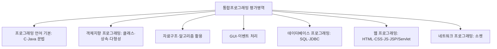

<Callout type="info">
  **이번 문서의 목표:** 이 파일을 다 읽으면 독학사 4단계(학위취득 종합시험) 안에서 통합프로그래밍이 어떤 시험인지 설명할 수 있고, 총점합격제·과목별합격제의 차이를 구분할 수 있으며, 뒤에 이어지는 25개 편이 왜 "언어 기초 → 심화 구조 → 응용 영역 → 통합 실습 → 기출" 순서로 짜여 있는지 스스로 지도를 그릴 수 있다.
</Callout>

## 왜 시험 구조부터 알아야 하는가

통합프로그래밍이라는 과목 이름을 처음 보면 "새로운 언어나 프레임워크를 배우는 과목인가?"라고 오해하기 쉽습니다. 하지만 이 과목은 완전히 새로운 지식을 배우는 자리가 아니라, 여러분이 이미 2·3단계에서 따로따로 배운 C 언어, 객체지향, 자료구조, 데이터베이스, 웹, 네트워크를 **코드라는 하나의 축으로 다시 묶어서 시험 보는 과목**입니다. 이 성격을 모르고 "모르는 새 이론이 나오면 어쩌지"라는 자세로 공부를 시작하면, 이미 아는 개념을 코드로 표현하는 훈련보다 새 이론을 찾아 헤매는 데 시간을 낭비하게 됩니다. 그래서 코드를 한 줄이라도 보기 전에, 이 시험이 정확히 무엇을 묻는 시험이고 어떤 틀 안에서 채점되는지부터 짚어야 합니다.

> **쉽게 말하면:** 통합프로그래밍은 새 과목을 배우는 시간이 아니라, 이미 배운 여러 과목을 코드 위에서 다시 모아 보는 "종합 리허설" 시간입니다.

## 1. 독학사 학위제도와 4단계의 위치

**독학사**(獨學學位制, 정식 명칭은 독학에 의한 학위취득제도)는 국가평생교육진흥원(National Institute for Lifelong Education, 줄여서 국평원 또는 NILE)이 주관하는 시험으로, 정규 대학 강의를 듣지 않아도 정해진 단계를 순서대로 통과하면 학사 학위를 받을 수 있는 제도입니다. 독학사는 다음 4단계로 구성됩니다.

| 단계 | 이름 | 성격 |
|------|------|------|
| 1단계 | 교양과정 인정시험 | 전공과 무관한 공통 교양(국어, 영어, 일반수학 등) |
| 2단계 | 전공기초과정 인정시험 | 전공의 기초 도구(C프로그래밍, 컴퓨터구조 등) |
| 3단계 | 전공심화과정 인정시험 | 전공기초 위에 쌓는 심화 과목(자료구조, 운영체제, 프로그래밍언어론 등) |
| 4단계 | 학위취득 종합시험 | 학위 수여 직전 마지막 종합 시험 |

**통합프로그래밍은 4단계, 즉 학위취득 종합시험에 속합니다.** 4단계라는 위치가 중요한 이유는 이 단계가 "새로운 것을 배우는 단계"가 아니라 "지금까지 배운 것을 학위를 줄 만큼 충분히 소화했는지 최종 확인하는 단계"이기 때문입니다. 그래서 통합프로그래밍은 특정 언어의 지엽적인 문법 하나를 깊이 파기보다, C와 Java라는 두 축의 언어 위에서 자료구조·DB·웹·네트워크까지 아우르는 **폭넓은 코드 이해력**을 확인합니다.

> **쉽게 말하면:** 1~3단계가 건물의 각 층을 하나씩 짓는 과정이라면, 4단계는 완성된 건물 전체를 걸어서 점검하는 최종 검수입니다. 통합프로그래밍은 그 검수 중에서도 "코드로 지어진 부분"을 전부 훑는 역할을 맡습니다.

**자주 틀리는 점**: "4단계니까 가장 어려운 새 이론이 나온다"고 생각하는 경우가 많습니다. 하지만 통합프로그래밍의 어려움은 새 이론의 난이도가 아니라 **다루는 범위의 폭**에서 옵니다. C 포인터부터 Java 컬렉션, JDBC, JSP, 소켓까지 한 시험 안에 섞여 나오기 때문에, 각 영역을 얕게라도 빠짐없이 점검해 두는 전략이 중요합니다.

## 2. 총점합격제와 과목별합격제

4단계 학위취득 종합시험은 합격 판정 방식이 2·3단계와 다릅니다. 국가평생교육진흥원은 4단계 응시자가 다음 두 방식 중 하나를 선택할 수 있게 운영합니다(정확한 과목 수·점수 기준은 회차 공고 확인이 필요합니다).

| 방식 | 핵심 개념 | 통합프로그래밍 응시자에게 의미 |
|------|-----------|-------------------------------|
| 총점합격제 | 응시한 여러 과목의 **점수를 합산**해 총점 기준을 넘으면 합격 | 통합프로그래밍 한 과목의 점수가 낮아도 다른 과목 점수로 보완할 여지가 있음 |
| 과목별합격제 | 과목마다 **정해진 점수 이상**을 받아야 그 과목이 합격 처리됨 | 통합프로그래밍 단독으로 기준선을 넘겨야 하므로 과목 자체의 완성도가 중요 |

이 차이를 아는 것이 왜 중요할까요. 총점합격제를 택한 응시자라면 통합프로그래밍에서 다소 취약한 영역(예: 소켓 프로그래밍)이 있어도 다른 강점 과목으로 보완하는 전략을 세울 수 있습니다. 반대로 과목별합격제를 택했다면 통합프로그래밍 내부에서 특정 영역을 완전히 포기하는 전략은 위험합니다. 어느 방식을 택하든, 국가평생교육진흥원 공고에서 해당 회차의 정확한 합격 기준·과목 조합을 반드시 확인해야 합니다.

> **쉽게 말하면:** 총점합격제는 "여러 과목 점수를 한 바구니에 담아 합계로 승부"하는 방식이고, 과목별합격제는 "과목마다 각자 문턱을 넘어야 하는" 방식입니다.

**자주 틀리는 점**: 총점합격제와 과목별합격제를 "쉬운 방식/어려운 방식"으로 단순 비교하면 안 됩니다. 두 방식은 응시자의 과목별 강약점 분포에 따라 유불리가 달라지는 전략적 선택지이며, 어느 쪽이 절대적으로 유리하다고 말할 수 없습니다.

## 3. 통합프로그래밍 평가영역 개관

국가평생교육진흥원은 과목마다 **평가영역**(과목별로 어떤 영역에서 어떤 수준으로 출제할지 미리 공개한 공식 범위)을 제시합니다. 통합프로그래밍의 평가영역을 큰 그림으로 그리면 다음과 같습니다(세부 배점·항목은 해당 연도 공고 확인 필요).

이 그림에서 알 수 있듯, 통합프로그래밍은 하나의 언어나 하나의 이론을 깊게 묻는 과목이 아니라 **일곱 갈래의 영역을 코드 관점에서 얕지 않게 훑는** 과목입니다. 뒤에 이어지는 06~21편은 이 일곱 갈래를 순서대로 다루고, 22~23편은 이 갈래들을 다시 섞어 통합 문제로 풀어 봅니다.

> **쉽게 말하면:** 다른 과목이 "한 우물을 깊게 파는" 시험이라면, 통합프로그래밍은 "이미 파 놓은 여러 우물을 하나의 수로로 잇는" 시험입니다.

## 4. 시험 방식과 문항 형태

정확한 회차별 문항 수·시험 시간·배점 비율은 공고마다 달라질 수 있으므로 **공고 확인이 필요**합니다. 다만 여러 회차에 걸쳐 공통적으로 유지되어 온 큰 틀은 다음과 같습니다.

- 문제 형식은 **4지선다형 객관식**이 중심이되, 4단계는 2·3단계와 달리 **주관식(단답·서술·짧은 코드 작성)** 문항이 함께 출제되는 경우가 있습니다. 이 사이트의 `Quiz` 구성 요소는 객관식 4지선다 형태를 기준으로 하되, 본문 설명은 주관식 대비까지 겨냥해 "정답만 아는 것"이 아니라 "코드를 직접 손으로 완성할 수 있는 수준"까지 다룹니다.
- 문제 유형은 크게 세 갈래로 나뉩니다. **단순 개념형**(용어 정의를 아는지), **코드 실행 결과 예측형**(코드를 보고 최종 출력값을 맞히는), **오류 찾기·빈칸 채우기형**(잘못된 부분을 골라내거나 빈 코드를 완성하는)입니다. 통합프로그래밍은 특히 뒤의 두 유형 비중이 높습니다.
- 시험은 **지필**(紙筆, 종이와 펜을 쓰는 방식) 시험입니다. 컴퓨터 앞에서 코드를 실행해 보며 푸는 것이 아니라, 인쇄된 코드를 눈으로 읽고 실행 결과를 머릿속으로 추적해서 답해야 합니다. 이 점이 뒤에 이어질 06편 이후 "한 줄씩 실행 추적표"를 강조하는 이유입니다.

> **쉽게 말하면:** 이 시험은 "컴파일러가 대신 답을 알려주는 문제"가 아니라 "사람이 손으로 코드를 따라가며 값을 추적해 답하는 문제"를 목표로 훈련해야 하는 시험입니다.

## 5. 이 시리즈 26개 편의 전체 지도

앞으로 이어질 편들은 크게 네 구간으로 나뉩니다.

| 구간 | 편 번호 | 목적 |
|------|---------|------|
| 선행 | 01–05 | 시험 구조·평가영역 개관, C·Java 문법 빠른 복습, 객체지향 용어 지도, 자료구조·알고리즘 개념 지도, 웹·DB·네트워크 큰 그림 |
| 본론 | 06–23 | C 핵심(06–08), Java·객체지향(09–12), 자료구조 구현(13–15), GUI·DB·웹·네트워크(16–21), 통합 실습(22–23) |
| 기출·모의 | 24–26 | 평가영역별 출제 비율 분석(24), C·Java 기출·모의(25), 웹·DB·네트워크 연동 기출·모의(26) |

이 지도에서 지금 읽고 있는 01편의 역할은 "본론에 들어가기 전에 이 과목이 왜 이런 순서로 짜였는지 납득시키는 것"입니다. 02편은 C·Java 문법을 손코딩 감각으로 다시 정렬하고, 03편은 객체지향 용어 사이의 관계를 지도로 그리며, 04편은 자료구조·알고리즘의 큰 그림을, 05편은 웹·DB·네트워크가 서로 어떻게 연결되는지 조망합니다. 이 네 편을 마치면 06편부터 본격적인 C 언어 핵심 학습이 시작됩니다.

## 핵심 정리

- 통합프로그래밍은 독학사 4단계(학위취득 종합시험)에 속하며, 새 이론을 배우는 과목이 아니라 이전 단계에서 배운 여러 과목을 코드 관점으로 묶어 재확인하는 과목이다.
- 4단계는 총점합격제와 과목별합격제 중 하나로 합격이 판정되며, 어느 방식이든 정확한 기준은 회차 공고 확인이 필요하다.
- 통합프로그래밍 평가영역은 언어 기본, 객체지향, 자료구조·알고리즘, GUI, DB·JDBC, 웹, 네트워크의 일곱 갈래로 구성된다.
- 시험은 지필 방식이며 코드 실행 결과 예측·오류 찾기·빈칸 채우기 비중이 높아, 손으로 코드를 추적하는 훈련이 핵심이다.
- 이 시리즈는 선행(01–05) → 본론(06–23) → 기출·모의(24–26) 순서로 구성된다.

## 마무리 복습

<Quiz
  questionNumber={1}
  question="독학사 4단계와 통합프로그래밍의 관계에 대한 설명으로 가장 적절한 것은?"
  options={['통합프로그래밍은 2단계 전공기초과정에 속하는 과목이다.', '통합프로그래밍은 4단계 학위취득 종합시험에 속하는 과목이다.', '통합프로그래밍은 1단계 교양과정에서만 다루는 과목이다.', '독학사는 단계 구분 없이 모든 과목을 동일한 시험에서 함께 치른다.']}
  correctAnswer={2}
  explanation="독학사는 1단계 교양과정, 2단계 전공기초과정, 3단계 전공심화과정, 4단계 학위취득 종합시험으로 구성되며, 통합프로그래밍은 4단계 학위취득 종합시험에 속하는 과목이다."
  optionExplanations={['2단계 전공기초과정은 C프로그래밍·컴퓨터구조처럼 전공의 기초 도구를 다루는 단계이며 통합프로그래밍의 위치가 아니다.', '정답. 통합프로그래밍은 4단계 학위취득 종합시험에 속한다.', '1단계는 전공과 무관한 공통 교양 과목을 다루는 단계로 통합프로그래밍의 위치가 아니다.', '독학사는 1~4단계로 구분되며 각 단계마다 별도의 시험으로 치러진다.']}
/>

<Quiz
  questionNumber={2}
  question="총점합격제와 과목별합격제에 대한 설명으로 옳지 않은 것은?"
  options={['총점합격제는 응시한 여러 과목의 점수를 합산해 총점 기준을 넘으면 합격하는 방식이다.', '과목별합격제는 과목마다 정해진 점수 이상을 받아야 그 과목이 합격 처리되는 방식이다.', '두 방식 중 어느 쪽을 택하든 정확한 합격 기준은 회차 공고를 통해 확인해야 한다.', '총점합격제는 모든 응시자에게 과목별합격제보다 항상 유리한 방식이다.']}
  correctAnswer={4}
  explanation="총점합격제와 과목별합격제는 응시자의 과목별 강약점 분포에 따라 유불리가 달라지는 전략적 선택지이며, 어느 한쪽이 모든 응시자에게 항상 유리하다고 단정할 수 없다."
  optionExplanations={['옳은 설명이다. 총점합격제는 여러 과목 점수를 합산해 총점 기준으로 판정한다.', '옳은 설명이다. 과목별합격제는 과목마다 개별 기준선을 넘어야 한다.', '옳은 설명이다. 정확한 기준은 항상 회차 공고 확인이 필요하다.', '정답. 두 방식은 응시자의 강약점 분포에 따라 유불리가 달라지는 전략적 선택지이지 절대적 우열 관계가 아니다.']}
/>

<Quiz
  questionNumber={3}
  question="통합프로그래밍 평가영역이 다루는 갈래로 보기 어려운 것은?"
  options={['C·Java 언어 기본 문법', '객체지향 프로그래밍(클래스·상속·다형성)', '데이터베이스 프로그래밍(SQL·JDBC)', '컴퓨터 그래픽스의 3D 렌더링 파이프라인 설계']}
  correctAnswer={4}
  explanation="통합프로그래밍의 평가영역은 언어 기본, 객체지향, 자료구조·알고리즘, GUI, DB·JDBC, 웹, 네트워크의 일곱 갈래이며, 3D 렌더링 파이프라인 설계는 별도 과목인 컴퓨터그래픽스의 영역이다."
  optionExplanations={['통합프로그래밍 평가영역의 언어 기본 갈래에 해당한다.', '통합프로그래밍 평가영역의 객체지향 갈래에 해당한다.', '통합프로그래밍 평가영역의 DB·JDBC 갈래에 해당한다.', '정답. 3D 렌더링 파이프라인은 컴퓨터그래픽스 과목의 영역이며 통합프로그래밍 평가영역에 포함되지 않는다.']}
/>

<Quiz
  questionNumber={4}
  question="통합프로그래밍 시험 방식에 대한 설명으로 가장 적절한 것은?"
  options={['시험은 컴퓨터 앞에서 코드를 직접 실행해 보며 푸는 실기 방식이다.', '시험은 지필 방식이며 코드 실행 결과 예측·오류 찾기 비중이 높다.', '4단계는 2·3단계와 달리 객관식 문항이 전혀 출제되지 않는다.', '문항 유형은 오직 단순 개념 암기형 한 가지뿐이다.']}
  correctAnswer={2}
  explanation="통합프로그래밍은 지필 시험이며, 코드를 눈으로 읽고 실행 결과를 예측하거나 오류를 찾는 유형의 비중이 높다."
  optionExplanations={['독학사는 지필 시험이므로 컴퓨터로 코드를 직접 실행하며 푸는 실기 방식이 아니다.', '정답. 지필 방식이며 코드 실행 결과 예측·오류 찾기·빈칸 채우기 비중이 높다.', '4단계는 4지선다형 객관식을 중심으로 주관식 문항이 함께 출제될 수 있어 객관식이 전혀 없다고 볼 수 없다.', '문항 유형은 단순 개념형, 코드 실행 결과 예측형, 오류 찾기·빈칸 채우기형 등으로 나뉜다.']}
/>

<Quiz
  questionNumber={5}
  question="이 시리즈 26개 편의 구간 구분에 대한 설명으로 가장 적절한 것은?"
  options={['선행 구간(01–05편)은 시험 구조·평가영역 개관과 언어·객체지향·자료구조·웹/DB/네트워크의 큰 그림을 정리한다.', '본론 구간(06–23편)은 통합프로그래밍 평가영역과 무관한 새로운 이론만 다룬다.', '기출·모의 구간(24–26편)은 선행 구간(01–05편) 내용만 반복한다.', '이 시리즈는 구간 구분 없이 무작위 순서로 편성되어 있다.']}
  correctAnswer={1}
  explanation="선행 구간(01–05편)은 시험 구조·평가영역 개관, C·Java 문법 복습, 객체지향 용어 지도, 자료구조·알고리즘 개념 지도, 웹·DB·네트워크 큰 그림을 정리하는 구간이다."
  optionExplanations={['정답. 선행 구간은 본론에 들어가기 전 시험 구조와 여러 영역의 큰 그림을 정리한다.', '본론 구간(06–23편)은 통합프로그래밍 평가영역의 일곱 갈래를 순서대로 심화하는 구간이다.', '기출·모의 구간(24–26편)은 본론에서 다룬 영역을 실전 기출·모의 문제로 재확인하는 구간이다.', '이 시리즈는 선행·본론·기출·모의 세 구간으로 목적에 맞게 순서대로 편성되어 있다.']}
/>

<Quiz
  questionNumber={6}
  question="통합프로그래밍이라는 과목의 성격을 가장 바르게 설명한 것은?"
  options={['이전 단계에서 다루지 않은 완전히 새로운 프레임워크와 도구를 배우는 과목이다.', 'C 언어 문법 한 가지만 극도로 깊게 파고드는 과목이다.', '이전 단계에서 배운 여러 과목의 개념을 코드 관점에서 통합해 재확인하는 과목이다.', '이론 시험이며 코드는 전혀 등장하지 않는 과목이다.']}
  correctAnswer={3}
  explanation="통합프로그래밍은 새 이론을 배우는 과목이 아니라, 2·3단계에서 배운 언어·객체지향·자료구조·DB·웹·네트워크 개념을 코드 관점에서 통합해 재확인하는 4단계 종합시험 과목이다."
  optionExplanations={['통합프로그래밍은 출제기준에 없는 실무 프레임워크(Spring Boot 전반 등)를 새로 배우는 과목이 아니다.', 'C 언어뿐 아니라 Java·자료구조·DB·웹·네트워크까지 폭넓게 다루는 과목이다.', '정답. 여러 과목의 개념을 코드로 통합해 재확인하는 성격의 과목이다.', '코드 실행 결과 예측·오류 찾기·손코딩이 핵심 문항 유형이므로 코드가 시험의 중심이다.']}
/>

## 참고 자료

- [국가평생교육진흥원 독학학위제](https://bdes.nile.or.kr)
