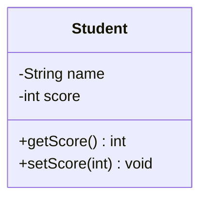
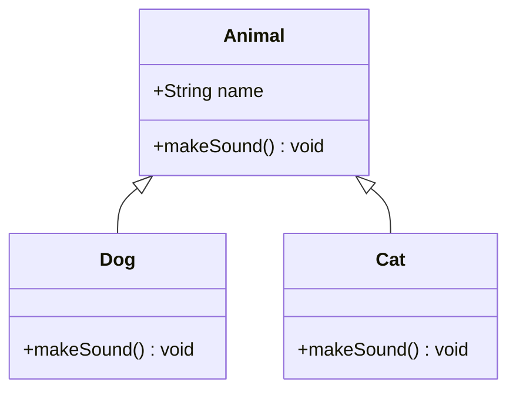
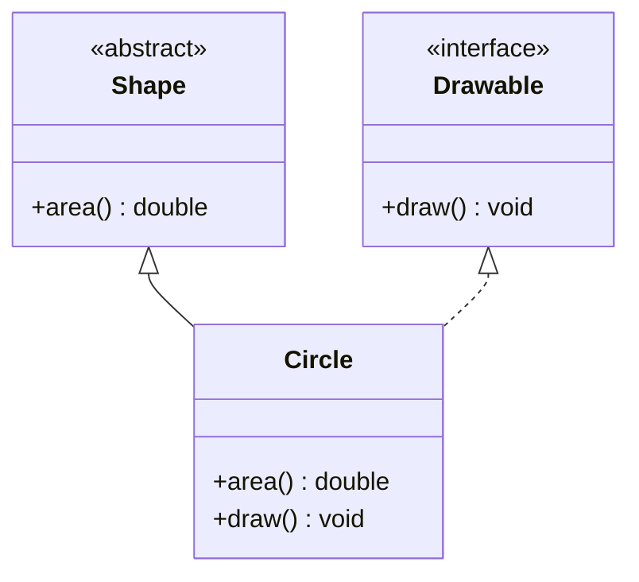
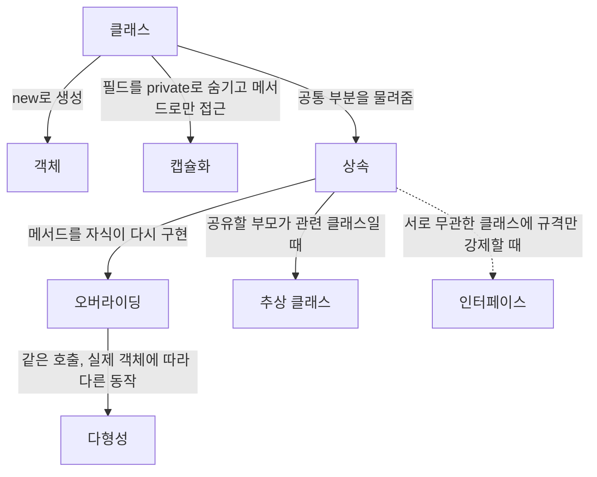

<Callout type="info">
  **이번 문서의 목표:** 이 파일을 다 읽으면 클래스·객체·캡슐화·상속·다형성·인터페이스·추상 클래스라는 객체지향 핵심 용어를 서로의 관계 속에서 설명할 수 있고, 09~11편에서 이 용어들이 실제 Java 코드로 어떻게 나타나는지 볼 준비를 갖출 수 있다.
</Callout>

## 왜 용어부터 지도로 그려야 하는가

객체지향(Object-Oriented Programming, 줄여서 OOP)은 3단계 객체지향프로그래밍에서 이미 배운 내용입니다. 그런데 통합프로그래밍에서 객체지향 용어를 다시 마주치면 당황하는 경우가 많은데, 이유는 단순합니다. 이 시험은 객체지향 이론을 **독립된 지식**으로 묻지 않고, 09~11편처럼 **실제 Java 코드의 실행 결과**로 바꿔서 묻기 때문입니다. "다형성이 무엇인가"를 아는 것과 "이 코드가 다형성 때문에 어떤 값을 출력하는가"를 맞히는 것은 전혀 다른 능력입니다. 그래서 본격적으로 코드를 보기 전에, 용어들이 서로 어떤 관계에 있는지 지도부터 명확히 그려 두어야 합니다.

> **쉽게 말하면:** 이 편은 객체지향이라는 도시의 새 지도를 그리는 것이 아니라, 이미 갖고 있는 낡은 지도의 길 이름들이 서로 어떻게 이어지는지 다시 확인하는 작업입니다.

## 1. 클래스와 객체 — 설계도와 실체

**클래스**(class, 객체를 만들기 위한 설계도)는 데이터(필드, field)와 그 데이터를 다루는 동작(메서드, method)을 하나로 묶어 놓은 틀입니다. **객체**(object, 클래스라는 설계도로부터 실제로 만들어진 실체)는 클래스를 바탕으로 메모리에 실제로 생성된 결과물입니다. 이 관계를 붕어빵에 비유하면, 클래스는 붕어빵 틀이고 객체는 그 틀로 찍어낸 낱개의 붕어빵입니다. 같은 틀에서 나온 붕어빵이라도 안에 든 팥의 양(필드 값)은 저마다 다를 수 있습니다.



이 다이어그램에서 `Student`는 클래스이고, `-name`과 `-score`는 필드(음수 기호 `-`는 접근 제어자 private을 뜻하는 UML 표기 관례), `+getScore()`와 `+setScore()`는 메서드(양수 기호 `+`는 public을 뜻함)입니다. 이 설계도로부터 `student1`, `student2`처럼 이름이 다른 여러 객체를 만들 수 있고, 각 객체는 서로 다른 `name`과 `score` 값을 가질 수 있습니다.

> **쉽게 말하면:** 클래스는 "학생이라면 이름과 점수를 가지고 있어야 한다"는 약속이고, 객체는 그 약속을 지키며 실제로 존재하는 "김민수 학생", "이서연 학생" 한 명 한 명입니다.

**자주 틀리는 점**: 클래스와 객체를 같은 것으로 혼동하는 경우가 많습니다. 클래스는 메모리에 실체로 존재하지 않는 설계도일 뿐이며, `new` 키워드로 실제 메모리 공간을 확보해야 비로소 객체가 생성됩니다(09편에서 생성자와 함께 자세히 다룹니다).

## 2. 캡슐화 — 데이터를 숨기고 창구만 연다

**캡슐화**(encapsulation, 데이터와 그 데이터를 다루는 동작을 하나로 묶고 외부에서 직접 접근하지 못하게 숨기는 것)는 필드를 `private`(접근 제어자, 클래스 외부에서 직접 접근할 수 없게 막는 표시)으로 감추고, `public`(외부에서 접근 가능하게 여는 표시) 메서드를 통해서만 데이터를 읽고 쓰게 하는 설계 원칙입니다.

| 접근 제어자 | 접근 가능 범위 |
|-------------|----------------|
| `private` | 같은 클래스 내부에서만 접근 가능 |
| (제어자 없음, default) | 같은 패키지 내부에서 접근 가능 |
| `protected` | 같은 패키지 + 상속받은 자식 클래스에서 접근 가능 |
| `public` | 어디서든 접근 가능 |

캡슐화가 왜 필요한지는 "은행 계좌"에 비유하면 이해가 쉽습니다. 여러분이 은행 창구(메서드) 없이 금고(필드)에 직접 손을 넣어 돈을 넣고 뺄 수 있다면, 잔액이 음수가 되는 것 같은 잘못된 상태를 막을 방법이 없습니다. 캡슐화는 `deposit`(입금)이나 `withdraw`(출금) 같은 창구 메서드만 열어 두고, 그 창구 안에서 "잔액이 0보다 작아지면 안 된다" 같은 규칙을 강제할 수 있게 합니다.

> **쉽게 말하면:** 캡슐화는 데이터를 금고 안에 숨기고, 정해진 창구(메서드)를 통해서만 접근하게 해서 잘못된 상태가 되지 않도록 지키는 것입니다.

**자주 틀리는 점**: 캡슐화를 "필드를 private으로 만드는 것"으로만 이해하고 끝내는 경우가 많습니다. 캡슐화의 핵심은 숨기는 것 자체가 아니라, **숨긴 데이터에 대한 접근을 메서드로 통제해서 데이터의 일관성(잘못된 값이 들어가지 않는 상태)을 지키는 것**입니다.

## 3. 상속 — 공통 부분을 물려받는다

**상속**(inheritance, 기존 클래스의 필드와 메서드를 새로운 클래스가 물려받는 것)은 여러 클래스가 공통으로 가지는 특성을 하나의 클래스(부모 클래스, superclass)에 모아 두고, 이를 필요로 하는 다른 클래스(자식 클래스, subclass)가 물려받게 하는 방식입니다.



이 다이어그램에서 화살표(`<|--`)는 "누가 누구를 상속받는가"를 나타내며, 화살표는 자식에서 부모 쪽으로 향합니다. `Dog`와 `Cat`은 `Animal`의 `name` 필드를 그대로 물려받고, `makeSound()` 메서드는 각자 자신에 맞게 다시 정의(오버라이딩, overriding — 부모의 메서드를 자식이 같은 이름·같은 매개변수로 다시 구현하는 것)합니다.

> **쉽게 말하면:** 상속은 "동물이라면 공통으로 이름을 가지고 소리를 낸다"는 부분을 부모 클래스에 미리 정해 두고, 강아지와 고양이는 "소리를 내는 방식"만 자기 식으로 바꿔 쓰는 것입니다.

**자주 틀리는 점**: 상속을 "코드를 복사해서 붙여넣는 것"과 같다고 오해하는 경우가 있습니다. 상속은 복사가 아니라 **부모 클래스와의 관계를 유지한 채로 공유**하는 것이며, 부모 클래스가 나중에 수정되면 그 변경이 모든 자식 클래스에 자동으로 반영됩니다. 이 관계는 10편에서 실제 코드와 실행 결과로 확인합니다.

## 4. 다형성 — 같은 호출, 다른 동작

**다형성**(polymorphism, "여러 형태"라는 뜻의 그리스어에서 온 말로, 같은 이름의 메서드 호출이 실제 객체 종류에 따라 다르게 동작하는 성질)은 상속과 오버라이딩이 있을 때 나타나는 효과입니다. 부모 타입으로 자식 객체를 가리키더라도, 실제로 호출되는 메서드는 **그 객체가 실제로 어떤 클래스의 인스턴스인지**에 따라 결정됩니다.

앞의 `Animal`, `Dog`, `Cat` 예시를 코드로 옮기면 다음과 같습니다.

```java
class Animal {
    void makeSound() {
        System.out.println("동물이 소리를 냅니다");
    }
}

class Dog extends Animal {
    void makeSound() {
        System.out.println("멍멍");
    }
}

class Cat extends Animal {
    void makeSound() {
        System.out.println("야옹");
    }
}

public class Main {
    public static void main(String[] args) {
        Animal a1 = new Dog();
        Animal a2 = new Cat();
        a1.makeSound();
        a2.makeSound();
    }
}
```

```text
멍멍
야옹
```

`a1`과 `a2`는 둘 다 `Animal` 타입 변수로 선언되었지만(이렇게 부모 타입 변수가 자식 객체를 가리키는 것을 **업캐스팅**, upcasting이라 함), 실제로 호출되는 `makeSound()`는 각 변수가 **실제로 가리키는 객체**(`Dog` 또는 `Cat`)의 메서드입니다. 이렇게 어떤 메서드가 실행될지 실행 시점에 결정되는 방식을 **동적 바인딩**(dynamic binding, 실행 중에 실제로 호출할 메서드를 결정하는 것)이라 부릅니다.

> **쉽게 말하면:** 다형성은 "동물아, 소리를 내라"라고 똑같이 말해도, 실제로 그 자리에 서 있는 것이 강아지면 멍멍, 고양이면 야옹 하고 각자의 방식으로 반응하는 것입니다.

**자주 틀리는 점**: 변수의 선언 타입(`Animal`)을 보고 호출될 메서드도 `Animal`의 것이라 착각하는 경우가 매우 많습니다. 오버라이딩된 메서드 호출에서는 **선언 타입이 아니라 실제 객체의 타입**이 실행 결과를 결정합니다. 이 원리는 10편의 실행 결과 추적 문제에서 반복적으로 시험됩니다.

## 5. 추상 클래스와 인터페이스 — 강제하는 방법의 차이

**추상 클래스**(abstract class, 하나 이상의 몸체 없는 메서드를 포함할 수 있는, 그 자체로는 객체를 만들 수 없는 클래스)와 **인터페이스**(interface, 메서드의 이름과 규격만 정의하고 실제 구현은 강제하지 않는 약속)는 둘 다 "자식이 반드시 구현해야 할 메서드"를 강제한다는 공통점이 있지만, 쓰임새가 다릅니다.

| 항목 | 추상 클래스 | 인터페이스 |
|------|-------------|------------|
| 목적 | 관련 있는 클래스끼리 공통 필드·구현을 일부 공유 | 서로 관계없는 클래스에 공통 규격(계약)만 강제 |
| 필드 | 일반 필드를 가질 수 있음 | 기본적으로 상수(고정된 값)만 가질 수 있음 |
| 다중 상속 | 자바에서 클래스는 한 부모만 상속 가능(단일 상속) | 한 클래스가 여러 인터페이스를 동시에 구현 가능 |
| 메서드 구현 | 일반 메서드와 추상 메서드를 섞어 가질 수 있음 | 기본적으로 구현 없는 메서드 규격 위주(자바 8 이후 기본 메서드 예외 존재) |



이 다이어그램에서 `Circle`은 추상 클래스 `Shape`를 상속(실선 화살표)받으면서, 동시에 인터페이스 `Drawable`을 구현(점선 화살표)합니다. `Shape`가 "도형이라면 넓이를 계산할 수 있어야 한다"는 관련 클래스 간 공통 규칙을 담당한다면, `Drawable`은 "그릴 수 있는 능력이 있다"는, 도형이 아닌 다른 클래스(예: 아이콘)에도 똑같이 붙일 수 있는 독립적인 약속입니다.

> **쉽게 말하면:** 추상 클래스는 "같은 가족끼리 공유하는 물려받은 습관"이고, 인터페이스는 "가족이 달라도 계약서에 서명하면 지켜야 하는 규칙"입니다.

**자주 틀리는 점**: "추상 클래스와 인터페이스는 결국 같은 것 아닌가"라고 뭉뚱그리는 경우가 많습니다. 가장 결정적인 차이는 **다중 상속 가능 여부**입니다. Java의 클래스는 부모를 하나만 가질 수 있지만(단일 상속), 인터페이스는 여러 개를 동시에 구현할 수 있습니다. 이 차이 때문에 "여러 능력을 조합해야 하는 상황"에서는 인터페이스가 선택됩니다. 이 주제는 11편에서 실제 코드로 다시 다룹니다.

## 6. 전체 용어 관계 지도

지금까지 다룬 용어들이 서로 어떤 순서로 쌓이는지 하나의 그림으로 정리하면 다음과 같습니다.



이 지도가 말해 주는 순서는 다음과 같습니다. **클래스가 있어야 객체가 나오고, 캡슐화는 클래스 설계의 원칙이며, 상속이 있어야 오버라이딩이 가능하고, 오버라이딩이 있어야 다형성이 나타납니다.** 추상 클래스와 인터페이스는 상속의 두 갈래 방식으로, 상황(관련 클래스인가 vs 서로 무관한 클래스인가)에 따라 선택됩니다. 09~11편은 이 지도를 순서대로 따라가며 각 용어를 Java 코드와 실행 결과로 확인합니다.

## 핵심 정리

- 클래스는 설계도, 객체는 그 설계도로 만들어진 실체이며, 하나의 클래스에서 여러 객체가 서로 다른 필드 값을 가지고 만들어질 수 있다.
- 캡슐화는 필드를 숨기고(`private`) 메서드로만 접근하게 해 데이터의 일관성을 지키는 원칙이다.
- 상속은 부모 클래스의 필드·메서드를 자식 클래스가 물려받는 것이며, 코드 복사가 아니라 관계를 유지한 공유다.
- 다형성은 상속과 오버라이딩이 있을 때 나타나며, 부모 타입 변수로 자식 객체를 가리켜도 실제 호출되는 메서드는 실제 객체 타입에 따라 동적으로 결정된다.
- 추상 클래스는 관련 클래스 간 공통 구현 일부를 공유하고, 인터페이스는 서로 무관한 클래스에 규격만 강제하며 다중 구현이 가능하다.

## 마무리 복습

<Quiz
  questionNumber={1}
  question="클래스와 객체의 관계에 대한 설명으로 가장 적절한 것은?"
  options={['클래스와 객체는 완전히 같은 개념이며 구분할 필요가 없다.', '클래스는 설계도이고 객체는 그 설계도로 실제 만들어진 실체다.', '객체가 먼저 만들어진 뒤에 클래스가 그 객체를 참고해 정의된다.', '하나의 클래스에서는 오직 하나의 객체만 만들 수 있다.']}
  correctAnswer={2}
  explanation="클래스는 필드와 메서드를 묶어 놓은 설계도이며, 객체는 그 설계도를 바탕으로 실제 메모리에 생성된 실체다. 하나의 클래스에서 여러 객체를 만들 수 있다."
  optionExplanations={['클래스는 설계도이고 객체는 실체이므로 서로 다른 개념이다.', '정답. 클래스는 설계도, 객체는 그 설계도로부터 만들어진 실제 인스턴스다.', '클래스가 먼저 정의되어야 그 설계도로 객체를 생성할 수 있다.', '하나의 클래스로부터 여러 객체를 자유롭게 만들 수 있다.']}
/>

<Quiz
  questionNumber={2}
  question="캡슐화에 대한 설명으로 옳지 않은 것은?"
  options={['필드를 private으로 선언해 외부에서 직접 접근하지 못하게 막는다.', '외부에서는 public 메서드를 통해서만 데이터를 읽고 쓰게 한다.', '캡슐화의 목적은 데이터를 숨기는 행위 자체로 끝나며 값의 일관성과는 무관하다.', '메서드 안에서 잘못된 값이 들어오지 않도록 검증 로직을 넣을 수 있다.']}
  correctAnswer={3}
  explanation="캡슐화의 핵심은 데이터를 단순히 숨기는 것이 아니라, 메서드를 통한 통제된 접근으로 데이터의 일관성(잘못된 상태가 되지 않는 것)을 지키는 데 있다."
  optionExplanations={['옳은 설명이다. private 필드는 외부에서 직접 접근할 수 없다.', '옳은 설명이다. public 메서드가 데이터 접근의 창구 역할을 한다.', '정답. 캡슐화의 목적은 숨기는 것 자체가 아니라 값의 일관성을 지키는 것이다.', '옳은 설명이다. 메서드 안에서 검증 로직을 넣어 잘못된 값의 유입을 막을 수 있다.']}
/>

<Quiz
  questionNumber={3}
  question="상속에 대한 설명으로 가장 적절한 것은?"
  options={['상속은 부모 클래스의 코드를 자식 클래스에 그대로 복사하는 것과 완전히 같다.', '상속은 부모 클래스와의 관계를 유지한 채로 필드와 메서드를 공유하는 것이다.', '상속을 받은 자식 클래스는 부모 클래스의 메서드를 절대로 다시 정의할 수 없다.', '자식 클래스는 부모 클래스가 수정되어도 항상 이전 버전의 동작을 그대로 유지한다.']}
  correctAnswer={2}
  explanation="상속은 코드를 복사하는 것이 아니라 부모 클래스와의 관계를 유지한 채로 공유하는 것이며, 부모 클래스가 수정되면 그 변경이 자식 클래스에도 반영된다."
  optionExplanations={['상속은 단순 복사가 아니라 관계를 유지한 공유다.', '정답. 상속은 부모와의 관계를 유지하며 필드·메서드를 공유하는 것이다.', '자식 클래스는 오버라이딩을 통해 부모의 메서드를 다시 정의할 수 있다.', '부모 클래스가 수정되면 그 변경 사항이 상속 관계를 통해 자식 클래스에도 반영된다.']}
/>

<Quiz
  questionNumber={4}
  question={"다음 Java 코드의 실행 결과로 옳은 것은?\n\n```java\nclass Animal {\n  void makeSound() {\n    System.out.println(\"동물 소리\");\n  }\n}\n\nclass Dog extends Animal {\n  void makeSound() {\n    System.out.println(\"멍멍\");\n  }\n}\n\nAnimal a = new Dog();\na.makeSound();\n```"}
  options={['동물 소리', '멍멍', '동물 소리와 멍멍이 모두 출력된다', '컴파일 오류가 발생한다']}
  correctAnswer={2}
  explanation="변수 a는 Animal 타입으로 선언되었지만 실제로 가리키는 객체는 Dog다. 오버라이딩된 메서드 호출은 실제 객체 타입을 기준으로 동적 바인딩되므로 Dog의 makeSound가 실행되어 멍멍이 출력된다."
  optionExplanations={['선언 타입인 Animal의 메서드가 실행된다고 착각한 결과다. 실제로는 객체의 실제 타입인 Dog의 메서드가 실행된다.', '정답. 동적 바인딩에 의해 실제 객체 타입인 Dog의 makeSound가 실행된다.', '오버라이딩된 메서드는 하나만 실행되며 부모와 자식의 메서드가 동시에 실행되지 않는다.', '업캐스팅된 참조로 오버라이딩 메서드를 호출하는 것은 문법적으로 정상이므로 컴파일 오류가 아니다.']}
/>

<Quiz
  questionNumber={5}
  question="추상 클래스와 인터페이스의 차이에 대한 설명으로 옳지 않은 것은?"
  options={['추상 클래스는 관련 있는 클래스끼리 공통 필드와 구현 일부를 공유하는 데 적합하다.', '인터페이스는 서로 관계없는 클래스에 공통 규격만 강제하는 데 적합하다.', 'Java에서 한 클래스는 여러 개의 추상 클래스를 동시에 상속받을 수 있다.', 'Java에서 한 클래스는 여러 개의 인터페이스를 동시에 구현할 수 있다.']}
  correctAnswer={3}
  explanation="Java의 클래스는 부모 클래스를 오직 하나만 상속받을 수 있는 단일 상속 구조이므로, 여러 추상 클래스를 동시에 상속받을 수 없다. 다중 구현이 가능한 것은 인터페이스다."
  optionExplanations={['옳은 설명이다. 추상 클래스는 관련 클래스 간 공통 구현 공유에 적합하다.', '옳은 설명이다. 인터페이스는 서로 무관한 클래스에도 공통 규격을 강제할 수 있다.', '정답. Java의 클래스는 부모를 하나만 가질 수 있는 단일 상속 구조라 여러 추상 클래스를 동시에 상속받을 수 없다.', '옳은 설명이다. 인터페이스는 다중 구현이 가능하다.']}
/>

<Quiz
  questionNumber={6}
  question="다형성이 실제로 나타나기 위한 전제 조건으로 가장 적절한 것은?"
  options={['클래스 안에 필드가 하나도 없어야 한다.', '상속 관계와 메서드 오버라이딩이 함께 존재해야 한다.', '모든 메서드가 private으로 선언되어 있어야 한다.', '자식 클래스가 부모 클래스의 필드를 전혀 사용하지 않아야 한다.']}
  correctAnswer={2}
  explanation="다형성은 상속 관계에서 자식 클래스가 부모의 메서드를 오버라이딩했을 때, 부모 타입 참조로 호출해도 실제 객체 타입의 메서드가 실행되는 현상이다. 상속과 오버라이딩이 함께 있어야 다형성이 나타난다."
  optionExplanations={['필드의 존재 여부는 다형성이 나타나는 전제 조건과 무관하다.', '정답. 상속 관계와 오버라이딩이 함께 있어야 동적 바인딩에 의한 다형성이 나타난다.', 'private 메서드는 오버라이딩 대상이 되기 어려워 다형성과는 오히려 거리가 멀다.', '자식 클래스가 부모의 필드를 사용하는지 여부는 다형성이 나타나는 전제 조건이 아니다.']}
/>

## 참고 자료

- [국가평생교육진흥원 독학학위제](https://bdes.nile.or.kr)
- [국가평생교육진흥원 과목별 평가영역](https://bdes.nile.or.kr)
