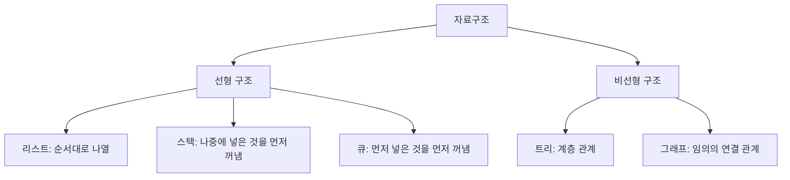
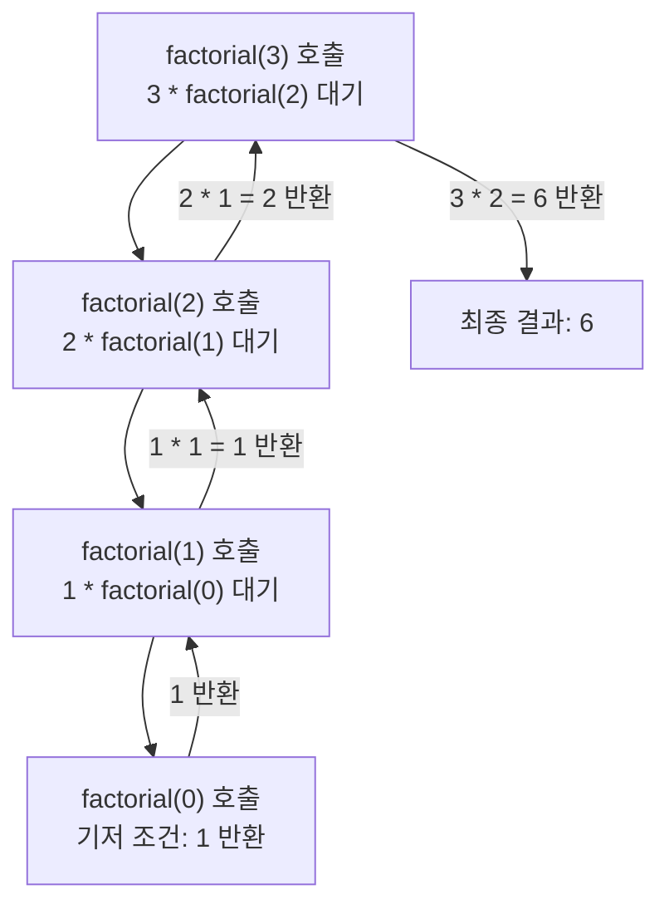
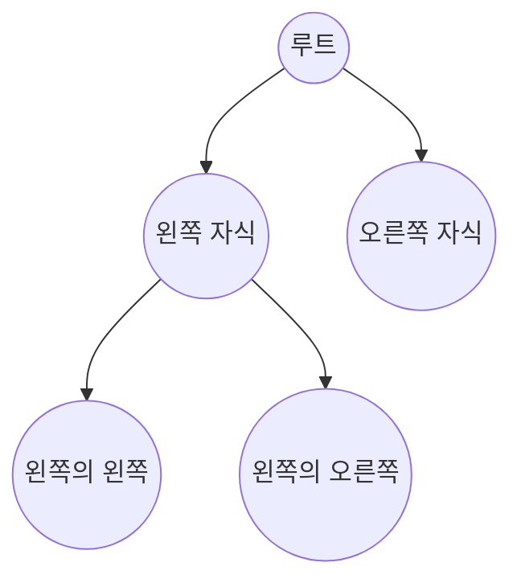
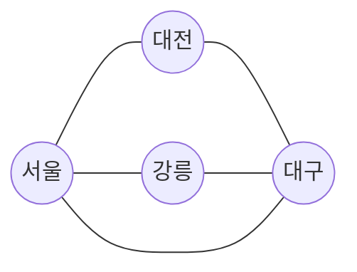

<Callout type="info">
  **이번 문서의 목표:** 이 파일을 다 읽으면 리스트·스택·큐·트리·그래프의 정의와 쓰임을 서로 구분해 설명할 수 있고, 재귀 호출이 스택 구조 위에서 어떻게 동작하는지 그림으로 그릴 수 있으며, 시간복잡도(빅오)를 반복 횟수를 세는 방식으로 직접 유도할 수 있다.
</Callout>

## 왜 자료구조를 다시 지도로 그려야 하는가

자료구조는 이미 4단계 자료구조(또는 그에 준하는 과목)에서 한 차례 다뤘을 개념입니다. 그런데 통합프로그래밍에서 자료구조를 다시 마주치면, 이론적인 정의보다 **C 배열이나 Java 코드로 직접 구현했을 때 한 줄씩 어떤 값이 바뀌는지**를 묻는 방식으로 나옵니다. 예를 들어 "스택이 무엇인가"를 아는 것과 "이 배열 기반 스택 코드에서 `push`를 세 번, `pop`을 한 번 호출한 뒤 배열의 상태가 무엇인가"를 맞히는 것은 전혀 다른 능력입니다. 이 편은 13~15편에서 코드로 들어가기 전에, 각 자료구조가 무엇을 위한 도구인지와 복잡도를 어떻게 세는지부터 지도로 그립니다.

> **쉽게 말하면:** 이 편은 자료구조라는 도구 상자를 열어, 각 도구가 "무엇을 넣고 어떤 순서로 꺼내는 상자인지"를 라벨로 다시 붙이는 작업입니다.

## 1. 자료구조 전체 지도 — 무엇을 위한 도구인가

자료구조(data structure)는 데이터를 어떤 규칙으로 저장하고 꺼낼지 정해 놓은 방식입니다. 각 자료구조는 "데이터를 넣고 빼는 순서"라는 기준으로 구분하면 이해가 쉽습니다.



| 자료구조 | 데이터 순서 규칙 | 대표 용도 |
|----------|-------------------|-----------|
| 리스트(list) | 저장한 순서를 그대로 유지 | 순서가 있는 목록 관리(할 일 목록 등) |
| 스택(stack) | 후입선출(LIFO, Last In First Out — 나중에 넣은 것을 먼저 꺼냄) | 함수 호출 기록, 되돌리기(undo) 기능 |
| 큐(queue) | 선입선출(FIFO, First In First Out — 먼저 넣은 것을 먼저 꺼냄) | 대기열, 작업 순서 처리 |
| 트리(tree) | 부모–자식 계층 관계 | 파일 시스템 폴더 구조, 조직도 |
| 그래프(graph) | 노드 사이에 임의의 연결(간선) 관계 | 지도의 길 찾기, 친구 관계망 |

> **쉽게 말하면:** 리스트는 줄을 서 있는 사람들의 명단이고, 스택은 접시를 쌓아 놓은 더미(맨 위 접시부터 꺼냄)이며, 큐는 은행 창구 대기줄(먼저 온 사람부터 처리)이고, 트리는 회사 조직도, 그래프는 지하철 노선도처럼 자유롭게 얽힌 연결망입니다.

**자주 틀리는 점**: 스택과 큐를 "둘 다 순서대로 데이터를 넣고 빼는 구조"로 뭉뚱그려 헷갈리는 경우가 많습니다. 결정적인 차이는 **어느 쪽 끝에서 데이터를 꺼내는가**입니다. 스택은 마지막에 넣은 데이터를 가장 먼저 꺼내고(후입선출), 큐는 가장 먼저 넣은 데이터를 가장 먼저 꺼냅니다(선입선출).

## 2. 스택 — 후입선출의 동작 과정 추적

스택은 `push`(데이터를 위에 쌓는 연산)와 `pop`(맨 위 데이터를 꺼내는 연산) 두 가지 기본 연산으로 동작합니다. 다음 연산 순서를 단계별 표로 추적해 보겠습니다.

연산 순서: `push(10)` → `push(20)` → `push(30)` → `pop()` → `push(40)`

| 단계 | 연산 | 스택 상태(아래→위) | 반환값 |
|------|------|----------------------|--------|
| 1 | `push(10)` | `[10]` | – |
| 2 | `push(20)` | `[10, 20]` | – |
| 3 | `push(30)` | `[10, 20, 30]` | – |
| 4 | `pop()` | `[10, 20]` | 30 |
| 5 | `push(40)` | `[10, 20, 40]` | – |

4단계에서 `pop()`은 가장 최근에 넣은 30을 꺼냅니다. 이것이 후입선출(LIFO)의 핵심입니다. 스택이 비어 있는데 `pop()`을 호출하면 **스택 언더플로**(stack underflow, 꺼낼 데이터가 없는데 꺼내려는 오류 상태)가 발생하고, 반대로 스택이 가득 찬 상태에서 `push()`를 호출하면 **스택 오버플로**(stack overflow, 배열 기반 스택에서 저장 공간이 가득 찬 상태에서 더 넣으려는 오류 상태)가 발생합니다.

> **쉽게 말하면:** 스택은 접시 더미와 같아서, 맨 위 접시(가장 최근에 올려놓은 것)만 집을 수 있습니다. 접시가 하나도 없는데 집으려 하면 손이 헛돌고(언더플로), 더미가 천장까지 차 있는데 더 올리려 하면 무너집니다(오버플로).

## 3. 큐 — 선입선출의 동작 과정 추적

큐는 `enqueue`(뒤쪽에 데이터를 추가하는 연산)와 `dequeue`(앞쪽 데이터를 꺼내는 연산)로 동작합니다.

연산 순서: `enqueue(1)` → `enqueue(2)` → `enqueue(3)` → `dequeue()` → `enqueue(4)`

| 단계 | 연산 | 큐 상태(앞→뒤) | 반환값 |
|------|------|-----------------|--------|
| 1 | `enqueue(1)` | `[1]` | – |
| 2 | `enqueue(2)` | `[1, 2]` | – |
| 3 | `enqueue(3)` | `[1, 2, 3]` | – |
| 4 | `dequeue()` | `[2, 3]` | 1 |
| 5 | `enqueue(4)` | `[2, 3, 4]` | – |

4단계에서 `dequeue()`는 가장 먼저 들어온 1을 꺼냅니다. 스택과 정반대로, 큐는 넣은 순서 그대로 꺼내집니다.

> **쉽게 말하면:** 큐는 은행 창구 대기줄과 같아서, 가장 먼저 줄을 선 사람이 가장 먼저 처리됩니다.

## 4. 재귀와 스택 프레임

**재귀**(recursion, 함수가 자기 자신을 다시 호출하는 것)는 겉보기에 스택과 무관해 보이지만, 실제로는 함수 호출이 일어날 때마다 컴퓨터 내부에서 **스택 프레임**(stack frame, 함수 하나가 호출될 때마다 그 함수의 지역 변수·매개변수·복귀 주소를 저장하는 메모리 구획)이 스택 구조로 쌓입니다. 재귀 함수가 자기 자신을 호출할 때마다 새 스택 프레임이 쌓이고(push와 같은 원리), 함수가 값을 반환하며 종료될 때마다 스택 프레임이 하나씩 제거됩니다(pop과 같은 원리).

`factorial(3)`(3의 팩토리얼, 3×2×1)을 재귀로 계산하는 과정을 스택 프레임 그림으로 그리면 다음과 같습니다.



이 과정을 단계별 표로도 추적할 수 있습니다.

| 호출 깊이 | 함수 호출 | 대기 중인 계산 | 도달한 값 |
|-----------|-----------|-----------------|-----------|
| 1 | `factorial(3)` | `3 * factorial(2)` | – |
| 2 | `factorial(2)` | `2 * factorial(1)` | – |
| 3 | `factorial(1)` | `1 * factorial(0)` | – |
| 4 | `factorial(0)` | 기저 조건(base case, 재귀를 멈추는 조건) | 1 반환 |
| 3 | `factorial(1)` 복귀 | `1 * 1` | 1 반환 |
| 2 | `factorial(2)` 복귀 | `2 * 1` | 2 반환 |
| 1 | `factorial(3)` 복귀 | `3 * 2` | 6 반환 |

**자주 틀리는 점**: 재귀 함수에 **기저 조건**(base case, 더 이상 자기 자신을 호출하지 않고 값을 바로 반환하는 조건)이 없으면, 호출이 끝없이 쌓여 스택 프레임이 계속 늘어나다가 실제 메모리 공간을 초과해 **스택 오버플로**가 발생합니다. 이 원리는 스택 자료구조의 오버플로와 정확히 같은 이름, 같은 원인(공간을 넘어선 쌓기)입니다.

> **쉽게 말하면:** 재귀는 "문제를 풀려면 먼저 더 작은 같은 문제를 풀어야 한다"며 계속 미루다가, 가장 작은 문제(기저 조건)에 도달해서야 답을 들고 거슬러 올라오는 방식입니다.

## 5. 트리와 그래프 — 계층과 연결망

**트리**(tree, 하나의 루트에서 시작해 부모–자식 관계로 뻗어나가는 비선형 구조)는 사이클(cycle, 같은 노드로 다시 돌아오는 경로)이 없는 특수한 그래프입니다. **그래프**(graph, 노드와 그 노드를 잇는 간선의 집합)는 트리보다 훨씬 자유로워서, 노드 사이에 임의의 연결이 가능하고 사이클이 있어도 됩니다.



이 트리에서 `루트`는 부모가 없는 최상위 노드이고, `왼쪽 자식`과 `오른쪽 자식`은 `루트`의 자식이면서 동시에 `왼쪽의 왼쪽`, `왼쪽의 오른쪽`의 부모입니다. 트리는 이렇게 "위에서 아래로만" 관계가 뻗어나가며, 자식에서 다른 자식으로 직접 가는 경로는 없습니다.

반면 그래프는 다음처럼 노드 사이에 자유로운 연결이 가능합니다.



이 그래프에서는 `대구`에서 `서울`로 직접 가는 간선(`D --- A`)이 있어 `서울 → 강릉 → 대구 → 서울`처럼 다시 출발점으로 돌아오는 사이클이 만들어질 수 있습니다. 트리에서는 이런 사이클이 절대 만들어지지 않습니다.

> **쉽게 말하면:** 트리는 한 뿌리에서 위에서 아래로만 가지가 뻗는 나무이고, 그래프는 어느 도시에서 어느 도시로든 길이 나 있을 수 있는 지도입니다. 나무는 절대 가지 끝이 다시 뿌리로 이어지지 않지만, 지도의 길은 한 바퀴 돌아 제자리로 올 수 있습니다.

**자주 틀리는 점**: "트리도 그래프의 한 종류"라는 사실을 잊고 완전히 별개의 개념처럼 다루는 경우가 있습니다. 트리는 **사이클이 없고 모든 노드가 루트로부터 하나의 경로로만 연결된 특수한 그래프**입니다. 14편에서 트리 순회와 그래프 탐색(DFS·BFS)을 구현할 때, 그래프 탐색 알고리즘을 트리에도 그대로 적용할 수 있는 이유가 바로 이 포함 관계 때문입니다.

## 6. 시간복잡도(빅오) — 반복 횟수를 세어서 유도하기

**시간복잡도**(time complexity, 입력 크기가 커질수록 연산 횟수가 얼마나 늘어나는지 나타내는 척도)는 감으로 외우는 것이 아니라, 코드 안의 **반복 횟수를 실제로 세어서** 유도해야 합니다. 입력 크기를 $n$(엔, 데이터의 개수를 나타내는 변수)이라 할 때, 대표적인 경우를 직접 세어 보겠습니다.

```c
for (int i = 0; i < n; i++) {
    printf("%d\n", i);
}
```

이 반복문은 `i`가 0부터 `n - 1`까지 총 $n$번 실행됩니다. 실행 횟수가 $n$에 정확히 비례하므로 이 코드의 시간복잡도는 $O(n)$(빅오 엔, 선형 시간)입니다.

```c
for (int i = 0; i < n; i++) {
    for (int j = 0; j < n; j++) {
        printf("%d %d\n", i, j);
    }
}
```

바깥 반복문이 $n$번 도는 동안, 안쪽 반복문도 매번 $n$번씩 돕니다. 따라서 전체 실행 횟수는 $n \times n$번입니다.

$$
n \times n = n^2
$$

이 반복 횟수가 곧 이 코드의 시간복잡도이며, $O(n^2)$(빅오 엔 제곱, 이차 시간)로 표기합니다. 이렇게 **바깥 반복문의 반복 횟수와 안쪽 반복문의 반복 횟수를 곱하는 방식**이 중첩 반복문의 복잡도를 유도하는 기본 원리입니다.

이진 탐색(binary search, 정렬된 배열에서 절반씩 범위를 좁혀 가며 찾는 탐색법)은 조금 다른 방식으로 세어야 합니다. 매 단계마다 탐색 범위가 절반으로 줄어들기 때문에, 범위가 1이 될 때까지 몇 번 나눌 수 있는지를 세면 됩니다. 데이터 8개를 예로 들면 다음과 같습니다.

| 단계 | 남은 범위 크기 |
|------|-----------------|
| 시작 | 8 |
| 1회 절반 | 4 |
| 2회 절반 | 2 |
| 3회 절반 | 1 |

8개의 데이터를 1개로 줄이는 데 절반 나누기를 3번 반복했습니다. 이는 $2^3 = 8$이라는 관계, 즉 $n$을 1로 줄이기 위해 몇 번 나눠야 하는지를 로그(log, 몇 번 거듭제곱해야 그 수가 되는지를 구하는 연산)로 나타낸 것과 같습니다.

$$
n = 2^k \implies k = \log_2 n
$$

여기서 $k$(케이)는 절반으로 나눈 횟수, $\log_2 n$(로그 밑 2, 엔)은 "2를 몇 번 곱해야 $n$이 되는가"를 뜻합니다. 그래서 이진 탐색의 시간복잡도는 $O(\log n)$(빅오 로그 엔, 로그 시간)입니다.

> **쉽게 말하면:** 빅오는 "입력이 커질 때 일이 얼마나 빨리 늘어나는가"를 재는 자입니다. 반복문 하나면 $O(n)$, 반복문을 겹쳐 쓰면 $O(n^2)$, 매번 절반씩 줄이면 $O(\log n)$처럼, **코드가 실제로 몇 번 도는지 세어 보면** 복잡도가 저절로 나옵니다.

**자주 틀리는 점**: 반복문 두 개가 있으면 무조건 $O(n^2)$이라고 단정하는 경우가 있습니다. 두 반복문이 **중첩**(안쪽에 포함)되어 있을 때만 곱셈으로 계산되며, 두 반복문이 **순서대로 나란히**(중첩되지 않고 차례로) 있으면 각각의 반복 횟수를 더해서 $O(n) + O(n) = O(n)$이 됩니다. 중첩 여부를 확인하지 않고 반복문 개수만 세면 틀리기 쉽습니다.

## 핵심 정리

- 자료구조는 데이터를 넣고 꺼내는 순서 규칙으로 구분되며, 스택은 후입선출(LIFO), 큐는 선입선출(FIFO)이 핵심 차이다.
- 재귀 호출은 함수가 호출될 때마다 스택 프레임이 쌓이고 반환될 때마다 제거되는, 스택과 같은 원리로 동작한다.
- 트리는 사이클이 없고 루트에서 하나의 경로로만 연결된 특수한 그래프이며, 그래프는 노드 사이에 임의의 연결과 사이클이 가능하다.
- 시간복잡도는 암기가 아니라 코드의 반복 횟수를 실제로 세어서 유도하며, 중첩 반복문은 곱셈, 순차적인 반복문은 덧셈으로 계산한다.
- 이진 탐색처럼 매번 절반으로 줄어드는 구조는 로그 시간복잡도($O(\log n)$)를 가진다.

## 마무리 복습

<Quiz
  questionNumber={1}
  question="스택과 큐의 차이에 대한 설명으로 가장 적절한 것은?"
  options={['스택과 큐는 데이터를 꺼내는 순서가 완전히 동일하다.', '스택은 후입선출(LIFO), 큐는 선입선출(FIFO) 방식으로 데이터를 꺼낸다.', '스택은 선입선출, 큐는 후입선출 방식으로 데이터를 꺼낸다.', '스택과 큐는 모두 데이터를 저장한 순서와 무관하게 무작위로 꺼낸다.']}
  correctAnswer={2}
  explanation="스택은 나중에 넣은 데이터를 먼저 꺼내는 후입선출(LIFO) 구조이고, 큐는 먼저 넣은 데이터를 먼저 꺼내는 선입선출(FIFO) 구조다."
  optionExplanations={['스택은 LIFO, 큐는 FIFO로 서로 반대되는 순서 규칙을 가진다.', '정답. 스택은 후입선출, 큐는 선입선출이다.', '스택과 큐의 설명이 서로 뒤바뀌었다.', '스택과 큐 모두 정해진 순서 규칙에 따라 데이터를 꺼내며 무작위가 아니다.']}
/>

<Quiz
  questionNumber={2}
  question="스택에 push(1), push(2), push(3), pop()을 순서대로 실행했을 때, pop()의 반환값과 남은 스택 상태로 옳은 것은?"
  options={['반환값 1, 남은 스택 [2, 3]', '반환값 3, 남은 스택 [1, 2]', '반환값 1, 남은 스택 [1, 2]', '반환값 3, 남은 스택 [2, 3]']}
  correctAnswer={2}
  explanation="스택은 후입선출이므로 pop()은 가장 마지막에 넣은 3을 반환하고, 남은 스택에는 아래에서부터 1, 2가 남는다."
  optionExplanations={['스택은 선입선출이 아니므로 가장 먼저 넣은 1을 반환하지 않는다.', '정답. 가장 마지막에 넣은 3이 반환되고 1, 2가 남는다.', '반환값은 옳지만 남은 스택에 3이 남아 있는 것은 잘못되었다. pop된 3은 스택에서 제거된다.', '반환값이 3이 아니라 1로 잘못되었다.']}
/>

<Quiz
  questionNumber={3}
  question="재귀 함수와 스택의 관계에 대한 설명으로 옳지 않은 것은?"
  options={['재귀 함수가 호출될 때마다 새로운 스택 프레임이 쌓인다.', '재귀 함수가 값을 반환하고 종료될 때마다 스택 프레임이 하나씩 제거된다.', '기저 조건이 없는 재귀 함수는 스택 프레임이 무한히 쌓여 스택 오버플로가 발생할 수 있다.', '재귀 함수는 스택과 무관하게 항상 고정된 메모리 공간만 사용한다.']}
  correctAnswer={4}
  explanation="재귀 함수는 호출될 때마다 새로운 스택 프레임을 쌓으므로 호출 깊이가 깊어질수록 사용하는 메모리 공간이 늘어난다. 고정된 메모리만 사용한다는 설명은 옳지 않다."
  optionExplanations={['옳은 설명이다. 함수 호출마다 새 스택 프레임이 쌓인다.', '옳은 설명이다. 함수가 반환되며 종료되면 스택 프레임이 제거된다.', '옳은 설명이다. 기저 조건이 없으면 호출이 끝없이 쌓여 스택 오버플로가 발생한다.', '정답. 재귀 호출은 깊이에 비례해 스택 프레임이 쌓이므로 고정된 메모리만 사용한다고 볼 수 없다.']}
/>

<Quiz
  questionNumber={4}
  question="트리와 그래프의 관계에 대한 설명으로 가장 적절한 것은?"
  options={['트리와 그래프는 서로 완전히 무관한 별개의 자료구조다.', '트리는 사이클이 없고 루트에서 하나의 경로로만 연결된 특수한 그래프다.', '그래프는 반드시 하나의 루트 노드를 가져야 한다.', '트리에는 항상 사이클이 존재해야 한다.']}
  correctAnswer={2}
  explanation="트리는 그래프의 한 종류로, 사이클이 없고 루트로부터 각 노드가 하나의 경로로만 연결되는 특수한 형태의 그래프다."
  optionExplanations={['트리는 그래프의 특수한 형태이므로 완전히 무관하다고 볼 수 없다.', '정답. 트리는 사이클이 없는 특수한 그래프다.', '루트 노드 개념은 트리의 특징이며, 일반 그래프는 반드시 루트를 가질 필요가 없다.', '트리는 사이클이 없는 구조이며, 사이클이 있으면 트리가 아니라 일반 그래프가 된다.']}
/>

<Quiz
  questionNumber={5}
  question={"다음 C 코드의 시간복잡도로 옳은 것은?\n\n```c\nfor (int i = 0; i < n; i++) {\n  for (int j = 0; j < n; j++) {\n    printf(\"%d\", i);\n  }\n}\n```"}
  options={['O(1)', 'O(n)', 'O(n^2)', 'O(log n)']}
  correctAnswer={3}
  explanation="바깥 반복문이 n번 도는 동안 안쪽 반복문도 매번 n번씩 돌기 때문에 전체 실행 횟수는 n곱하기 n, 즉 n의 제곱이 되어 O(n^2)이 된다."
  optionExplanations={['O(1)은 입력 크기와 무관하게 항상 일정한 횟수만 실행되는 경우이며, 이 코드는 n에 따라 실행 횟수가 달라진다.', 'O(n)은 반복문이 중첩되지 않고 한 번만 n번 도는 경우에 해당한다.', '정답. 중첩된 두 반복문이 각각 n번씩 돌아 n곱하기 n번 실행되므로 O(n^2)이다.', 'O(log n)은 매 단계마다 범위가 절반으로 줄어드는 이진 탐색 같은 경우에 해당한다.']}
/>

<Quiz
  questionNumber={6}
  question="이진 탐색의 시간복잡도가 O(log n)인 이유로 가장 적절한 것은?"
  options={['매 단계마다 탐색 범위가 절반으로 줄어들어 범위가 1이 될 때까지 걸리는 단계 수가 로그로 표현되기 때문이다.', '이진 탐색은 모든 원소를 처음부터 끝까지 하나씩 확인하기 때문이다.', '이진 탐색은 입력 크기와 무관하게 항상 정확히 한 번만 비교하기 때문이다.', '이진 탐색은 두 개의 중첩 반복문으로 구현되어야만 하기 때문이다.']}
  correctAnswer={1}
  explanation="이진 탐색은 매 단계마다 탐색 범위를 절반으로 줄이며, 범위가 1이 될 때까지 필요한 단계 수는 n을 2로 몇 번 나눌 수 있는지를 나타내는 로그값(log2 n)과 같다."
  optionExplanations={['정답. 매 단계 절반씩 줄어드는 구조가 로그 시간복잡도를 만든다.', '모든 원소를 하나씩 확인하는 것은 선형 탐색(O(n))의 특징이다.', '이진 탐색도 입력 크기에 따라 비교 횟수가 늘어나며, 항상 한 번만 비교하는 것은 아니다.', '이진 탐색은 중첩 반복문이 아니라 범위를 절반씩 줄여가는 단일 반복(또는 재귀) 구조로 구현된다.']}
/>

## 참고 자료

- [국가평생교육진흥원 독학학위제](https://bdes.nile.or.kr)
- [국가평생교육진흥원 과목별 평가영역](https://bdes.nile.or.kr)
