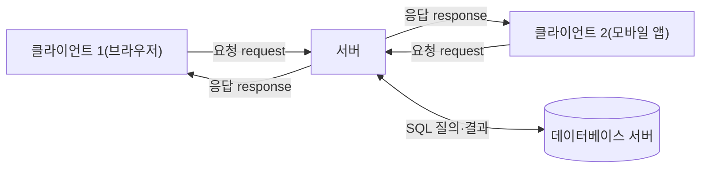
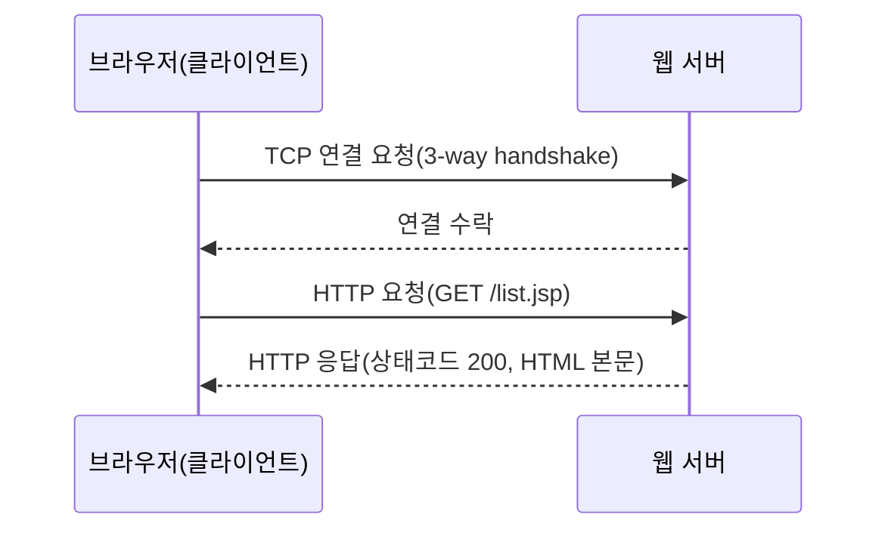
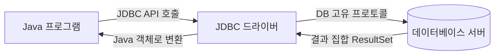
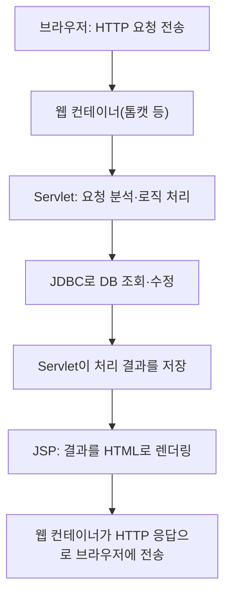

<Callout type="info">
  **이번 문서의 목표:** 이 파일을 다 읽으면 브라우저에서 요청 하나가 출발해 서버·서블릿·DB를 거쳐 응답으로 돌아오기까지 전체 경로를 그림으로 그릴 수 있고, HTTP·소켓·SQL·JDBC·JSP라는 용어가 이 경로의 어느 지점을 가리키는지 정확히 짚을 수 있다.
</Callout>

## 왜 웹·DB·네트워크를 한 편에서 먼저 훑는가

독학사 4단계 통합프로그래밍은 이름 그대로 여러 영역을 **연결**해서 묻는 과목이다. 17편(DB·SQL)·18편(JDBC)·19~20편(웹·JSP·Servlet)·21편(소켓)에서 각 조각을 깊게 다루기 전에, 이 조각들이 실제로 어떻게 하나의 요청-응답 흐름 안에서 맞물리는지 먼저 큰 그림을 그려 두지 않으면, 나중에 "JDBC가 왜 필요한지", "서블릿이 왜 존재하는지"를 각각 암기하게 되어 통합형 문제에서 흐름을 놓친다.

> **쉽게 말하면:** 이번 편은 자동차 부품을 하나씩 뜯어보기 전에, 먼저 자동차 전체 구조도를 보고 "엔진이 어디 있고 바퀴로 힘이 어떻게 전달되는지"를 파악하는 단계다.

## 클라이언트-서버 구조: 누가 요청하고 누가 응답하는가

**클라이언트-서버 구조**(client-server architecture)는 역할을 요청하는 쪽과 처리해서 응답하는 쪽으로 나눈 구조다. 웹 브라우저·모바일 앱처럼 사람이 직접 쓰는 프로그램이 **클라이언트**(client)이고, 데이터를 저장하고 로직을 처리해 응답을 돌려주는 컴퓨터·프로그램이 **서버**(server)다.

- **클라이언트**: 요청(request)을 보내고 응답(response)을 받아 화면에 보여준다. 예: 웹 브라우저, 스마트폰 앱.
- **서버**: 여러 클라이언트의 요청을 동시에 받아 처리하고 결과를 돌려준다. 예: 웹 서버, DB 서버.

> **쉽게 말하면:** 식당에 비유하면 손님(클라이언트)이 주문(요청)을 하고, 주방(서버)이 음식을 만들어 내주는(응답) 구조다. 손님이 여러 명이어도 주방 하나가 순서대로(또는 동시에) 처리한다.

이 구조에서 중요한 점은 **서버가 상태를 중앙에서 관리**한다는 것이다. 회원 정보·게시글·주문 내역 같은 데이터는 클라이언트(브라우저)가 아니라 서버와 그 뒤의 데이터베이스에 저장된다. 클라이언트는 매번 서버에 물어봐서 최신 데이터를 받아온다. 통합프로그래밍에서 나오는 웹·DB·소켓 코드는 결국 전부 "클라이언트와 서버가 어떤 약속(프로토콜)으로 데이터를 주고받는가"를 구현한 것이다.

## HTTP와 소켓: 클라이언트와 서버가 대화하는 두 가지 층

클라이언트와 서버가 실제로 데이터를 주고받으려면 네트워크 통신이 필요하다. 이때 등장하는 두 용어, **소켓**(socket)과 **HTTP**(HyperText Transfer Protocol, 하이퍼텍스트 전송 프로토콜)는 서로 다른 층(layer)에 있다.

### 소켓 - 네트워크 통신의 기본 통로

**소켓**(socket)은 두 프로그램이 네트워크로 데이터를 주고받기 위해 운영체제가 제공하는 **통신 종단점**(endpoint)이다. 전화로 비유하면 소켓은 전화기 자체에 해당하고, IP 주소는 전화번호, 포트(port) 번호는 그 집 안의 몇 번째 내선 번호에 해당한다.

- **IP 주소**: 네트워크 안에서 컴퓨터 한 대를 구분하는 주소.
- **포트 번호**: 같은 컴퓨터 안에서 어떤 프로그램(서비스)에게 데이터를 전달할지 구분하는 번호(0~65535). 예: 웹 서버는 보통 80번(HTTP) 또는 443번(HTTPS)을 쓴다.
- **TCP**(Transmission Control Protocol): 연결을 먼저 맺고(handshake) 순서를 보장하며 데이터를 전달하는 프로토콜. 신뢰성이 중요한 웹·파일 전송에 쓴다.
- **UDP**(User Datagram Protocol): 연결 없이 데이터를 그냥 보내는 프로토콜. 순서·도착을 보장하지 않는 대신 빠르다. 실시간 영상·음성에 쓴다.

소켓 프로그래밍의 세부 문법(생성·바인딩·리스닝·연결)은 21편에서 코드로 자세히 다룬다. 여기서는 "소켓은 TCP 또는 UDP 위에서 두 프로그램을 연결하는 저수준 통로"라는 위치만 잡아 둔다.

### HTTP - 소켓 위에 얹은 웹의 약속

**HTTP**는 TCP 소켓 연결 위에서 동작하는 **응용 계층 프로토콜**(application layer protocol)이다. 즉 브라우저와 웹 서버는 내부적으로 TCP 소켓을 맺은 다음, 그 위에서 "이런 형식으로 요청하고 이런 형식으로 응답한다"는 규칙인 HTTP를 주고받는다.

HTTP 요청에는 크게 두 방식이 있다.

| 방식 | 이름 | 특징 | 예시 |
|------|------|------|------|
| GET | 조회 요청 | 데이터를 URL 뒤에 붙여 보냄, 브라우저 주소창에 노출됨 | `list.jsp?page=2` |
| POST | 등록·변경 요청 | 데이터를 요청 본문(body)에 담아 보냄, 주소창에 노출 안 됨 | 로그인 폼 전송 |

> **자주 틀리는 점:** "소켓과 HTTP는 같은 개념이다" 또는 "HTTP가 더 저수준이다"라고 착각하기 쉽다. 실제로는 **소켓이 더 아래층(전송 계층에 가까운 통신 통로)이고, HTTP는 그 통로 위에서 정한 약속**(응용 계층 프로토콜)이다. 웹 서버 프로그램 내부에도 결국 TCP 소켓 코드가 들어 있지만, 통합프로그래밍에서 웹 프로그래밍 문제(19~20편)는 HTTP·서블릿 수준을, 네트워크 프로그래밍 문제(21편)는 소켓 수준을 직접 다룬다는 차이를 구분해야 한다.

## DB·SQL·JDBC 개요: 데이터는 어디에 어떻게 저장되는가

서버가 클라이언트에게 돌려줄 데이터(회원 정보, 게시글 등)는 보통 **데이터베이스**(database, DB)에 저장된다. 데이터베이스 중 표(테이블) 형태로 데이터를 저장하는 방식을 **관계형 데이터베이스**(relational database, RDB)라 하고, 이 표를 조회·수정하는 언어가 **SQL**(Structured Query Language, 구조화 질의 언어)이다.

- **테이블**(table): 행(row, 레코드)과 열(column, 속성)로 구성된 표. 예: 회원(member) 테이블에 아이디·이름·이메일 열이 있고, 각 회원이 한 행을 차지한다.
- **SQL의 대표 명령**: `SELECT`(조회), `INSERT`(추가), `UPDATE`(수정), `DELETE`(삭제). 세부 문법과 조인(JOIN)은 17편에서 예제와 함께 다룬다.

문제는 SQL 자체는 DB 서버에 직접 질의를 보내는 언어일 뿐, C나 Java 같은 **범용 프로그래밍 언어 코드 안에서 그대로 실행되지 않는다**는 점이다. 그래서 Java 프로그램이 DB에 접속해 SQL을 실행하려면 중간에 다리 역할을 하는 표준 인터페이스가 필요한데, 이것이 **JDBC**(Java DataBase Connectivity, 자바 데이터베이스 연결)다.

JDBC는 "Connection(연결) 맺기 → Statement(SQL 실행 도구) 만들기 → SQL 실행 → ResultSet(결과 집합)에서 값 꺼내기 → 자원 반납" 순서로 동작한다. 이 코드 패턴 자체는 시험에서 빈칸 채우기·오류 찾기로 자주 나오며, 18편에서 실제 코드로 한 줄씩 추적한다.

> **쉽게 말하면:** SQL이 "냉장고(DB)에서 반찬을 꺼내 오라"는 주문서라면, JDBC는 그 주문서를 냉장고가 알아듣는 말로 전달하고 꺼내온 반찬을 다시 그릇(Java 객체)에 담아주는 배달원이다.

## JSP·Servlet과 웹 애플리케이션 전체 흐름

브라우저가 보낸 HTTP 요청을 Java 진영에서 실제로 처리하는 프로그램 조각을 **서블릿**(Servlet)이라 부르고, HTML 안에 Java 코드를 섞어 응답 화면을 쉽게 만들 수 있게 한 기술을 **JSP**(JavaServer Pages)라 부른다. 두 기술 모두 **웹 컨테이너**(web container, 예: 톰캣)라는 실행 환경 위에서 동작한다.

이 흐름에서 각 조각의 역할을 명확히 구분해 두면 20편(JSP·Servlet)이 훨씬 쉽게 읽힌다.

- **Servlet**: 로직 처리 담당. "이 요청이 로그인인지 조회인지 판단하고, DB에 접근해 결과를 만든다."
- **JSP**: 화면 표현 담당. "만들어진 결과를 HTML 형태로 사람이 보기 좋게 꾸민다."
- 이렇게 로직과 화면을 나누는 설계 방식을 **MVC 패턴**(Model-View-Controller)이라 부르며, 20편에서 Model(데이터)·View(JSP)·Controller(Servlet)로 역할을 어떻게 나누는지 자세히 다룬다.

19편에서는 이 흐름 중 **브라우저 쪽**(HTML 폼으로 데이터를 입력해 요청 파라미터로 실어 보내는 과정, CSS로 화면을 꾸미는 방법, JS로 간단한 이벤트를 처리하는 방법)을 다루고, 20편에서는 **서버 쪽**(Servlet 생명주기, JSP 문법, MVC, 세션·쿠키)을 다룬다.

## 이 다섯 조각이 한 문제에서 어떻게 만나는가

통합프로그래밍의 통합 실습 편(23편)에서는 이번 편에서 본 다섯 조각—클라이언트-서버, HTTP, 소켓, DB·JDBC, JSP·Servlet—이 하나의 시나리오 문제로 묶여 나온다. 예를 들어 "회원 가입 폼(HTML)에서 값을 입력하면 → Servlet이 요청 파라미터를 받아 → JDBC로 DB에 저장하고 → 처리 결과를 JSP로 보여주는" 흐름 전체를 코드 일부만 주고 빈칸을 채우게 하는 식이다. 이번 편의 지도를 기억해 두면, 코드 조각 하나만 봐도 "이게 전체 흐름 중 어느 단계인가"를 바로 판단할 수 있다.

> **자주 틀리는 점:** SQL·JDBC·JSP·Servlet·소켓을 각각 독립된 암기 항목으로 따로 외우면, 실제 시험에서 "이 코드가 실행되면 다음 중 어떤 계층이 먼저 동작하는가" 같은 흐름 문제에 약해진다. 항상 이번 편의 흐름도(클라이언트 -> 소켓/HTTP -> Servlet -> JDBC -> DB -> JSP -> 응답) 위에 새 개념을 얹어서 이해해야 한다.

## 핵심 정리

- 클라이언트-서버 구조에서 클라이언트는 요청을, 서버는 처리와 응답을 담당하며 데이터는 서버(및 DB)가 중앙에서 관리한다.
- 소켓은 TCP·UDP 위에서 두 프로그램을 잇는 저수준 통신 통로이고, HTTP는 그 통로 위에서 웹이 쓰는 응용 계층 약속이다.
- SQL은 관계형 DB에 질의하는 언어이고, JDBC는 Java 프로그램이 SQL을 실행하고 결과(ResultSet)를 받아오는 표준 연결 방법이다.
- Servlet은 요청 처리·로직 담당, JSP는 화면 표현 담당이며, 이 둘을 나누는 설계가 MVC 패턴이다.
- 전체 흐름은 "브라우저 요청 -> 웹 컨테이너 -> Servlet -> JDBC -> DB -> Servlet -> JSP -> HTTP 응답" 순서로 이어진다.

## 마무리 복습

<Quiz
  questionNumber={1}
  question="클라이언트-서버 구조에 대한 설명으로 옳은 것은?"
  options={['클라이언트가 데이터를 중앙에서 관리하고 서버는 화면만 표시한다', '서버는 여러 클라이언트의 요청을 받아 처리하고 응답을 돌려준다', '클라이언트와 서버는 항상 같은 컴퓨터 안에서만 통신한다', '서버는 한 번에 하나의 클라이언트만 상대할 수 있다']}
  correctAnswer={2}
  explanation="클라이언트-서버 구조에서 서버는 여러 클라이언트의 요청을 받아 처리한 뒤 응답을 돌려주는 역할을 하며, 데이터는 서버와 그 뒤의 데이터베이스가 중앙에서 관리한다."
  optionExplanations={['데이터를 중앙에서 관리하는 쪽은 클라이언트가 아니라 서버다.', '정답이다. 서버는 여러 클라이언트의 요청을 처리하고 응답을 돌려준다.', '클라이언트와 서버는 네트워크로 연결된 서로 다른 컴퓨터에서 통신하는 것이 일반적이다.', '서버는 동시에 여러 클라이언트의 요청을 처리할 수 있도록 설계된다.']}
/>

<Quiz
  questionNumber={2}
  question="소켓과 HTTP의 관계에 대한 설명으로 옳은 것은?"
  options={['HTTP가 소켓보다 더 저수준의 통신 방식이다', '소켓은 TCP·UDP 위의 통신 통로이고 HTTP는 그 위에서 동작하는 응용 계층 프로토콜이다', '소켓과 HTTP는 완전히 같은 개념으로 서로 대체 가능하다', 'HTTP를 쓰면 소켓 연결 없이도 통신할 수 있다']}
  correctAnswer={2}
  explanation="소켓은 TCP나 UDP 위에서 두 프로그램을 잇는 저수준 통신 통로이고, HTTP는 그 소켓 연결 위에서 요청과 응답 형식을 정한 응용 계층 프로토콜이다."
  optionExplanations={['HTTP가 아니라 소켓이 더 아래 계층에 있는 통신 방식이다.', '정답이다. 소켓이 저수준 통로이고 HTTP는 그 위의 약속이다.', '두 개념은 서로 다른 계층에 있으며 대체 관계가 아니다.', '웹의 HTTP 통신도 내부적으로는 TCP 소켓 연결을 먼저 맺은 뒤 이루어진다.']}
/>

<Quiz
  questionNumber={3}
  question="TCP와 UDP의 차이에 대한 설명으로 옳지 않은 것은?"
  options={['TCP는 연결을 먼저 맺고 순서를 보장하며 데이터를 전달한다', 'UDP는 연결 없이 데이터를 보내며 순서·도착을 보장하지 않는다', 'TCP는 신뢰성이 중요한 웹·파일 전송에 주로 쓰인다', 'UDP는 TCP보다 항상 느리고 신뢰성이 더 높다']}
  correctAnswer={4}
  explanation="UDP는 연결 설정 과정이 없어 TCP보다 일반적으로 빠르지만, 순서·도착을 보장하지 않아 신뢰성은 TCP보다 낮다. 따라서 UDP가 항상 느리고 신뢰성이 더 높다는 설명은 옳지 않다."
  optionExplanations={['TCP는 연결(handshake)을 먼저 맺고 순서를 보장하는 프로토콜이므로 옳은 설명이다.', 'UDP는 연결 없이 데이터그램을 보내는 방식이므로 옳은 설명이다.', 'TCP는 신뢰성이 중요한 통신에 쓰이므로 옳은 설명이다.', '정답이다. UDP는 TCP보다 빠르지만 신뢰성은 더 낮으므로 이 설명이 옳지 않다.']}
/>

<Quiz
  questionNumber={4}
  question="JDBC의 역할에 대한 설명으로 가장 적절한 것은?"
  options={['SQL 문법 자체를 새로 정의하는 언어다', 'Java 프로그램이 DB에 접속해 SQL을 실행하고 결과를 받아오도록 연결해 주는 표준 인터페이스다', 'HTML 화면을 자동으로 생성해 주는 도구다', '소켓 통신을 대체하는 새로운 네트워크 프로토콜이다']}
  correctAnswer={2}
  explanation="JDBC는 SQL 자체를 대체하는 언어가 아니라, Java 프로그램이 표준화된 방식으로 DB에 연결하고 SQL을 실행한 뒤 ResultSet으로 결과를 받아올 수 있게 해 주는 인터페이스다."
  optionExplanations={['JDBC는 SQL 문법을 새로 정의하지 않고 기존 SQL을 그대로 실행하는 통로 역할을 한다.', '정답이다. JDBC는 Java와 DB 사이를 표준화된 방식으로 연결하는 인터페이스다.', 'HTML 화면 생성은 JSP의 역할이며 JDBC와는 관계가 다르다.', 'JDBC는 소켓 통신 자체가 아니라 DB 연결을 위한 상위 계층 인터페이스다.']}
/>

<Quiz
  questionNumber={5}
  question="Servlet과 JSP의 역할 구분으로 옳은 것은?"
  options={['Servlet은 화면 표현, JSP는 로직 처리를 담당한다', 'Servlet은 로직 처리, JSP는 화면 표현을 담당한다', 'Servlet과 JSP는 완전히 동일한 역할을 하므로 구분할 필요가 없다', 'JSP는 DB 연결을 대체하므로 JDBC가 필요 없다']}
  correctAnswer={2}
  explanation="일반적으로 Servlet은 요청을 분석하고 로직을 처리하는 역할을, JSP는 처리된 결과를 HTML 형태로 사람이 보기 좋게 표현하는 역할을 담당하며, 이렇게 역할을 나누는 설계가 MVC 패턴이다."
  optionExplanations={['역할이 반대로 설명되어 있다.', '정답이다. Servlet은 로직 처리, JSP는 화면 표현을 담당한다.', '두 기술은 서로 다른 역할을 맡도록 설계되어 있어 구분이 필요하다.', 'JSP도 DB에 접근하려면 여전히 JDBC 같은 연결 방법이 필요하다.']}
/>

<Quiz
  questionNumber={6}
  question="다음 중 브라우저가 웹 서버로부터 HTML 응답을 받기까지의 순서로 옳은 것은?"
  options={['HTTP 요청 -> DB 조회 -> Servlet -> JSP -> TCP 연결 -> 응답', 'TCP 연결 -> HTTP 요청 -> Servlet 처리 -> JDBC로 DB 조회 -> JSP 렌더링 -> HTTP 응답', 'JSP 렌더링 -> TCP 연결 -> Servlet 처리 -> HTTP 응답 -> DB 조회', 'DB 조회 -> TCP 연결 -> HTTP 응답 -> Servlet 처리 -> JSP 렌더링']}
  correctAnswer={2}
  explanation="브라우저는 먼저 TCP 연결을 맺은 뒤 HTTP 요청을 보내고, 웹 컨테이너 위의 Servlet이 요청을 처리하며 필요하면 JDBC로 DB를 조회한다. 이 결과를 JSP가 HTML로 렌더링해 HTTP 응답으로 돌려준다."
  optionExplanations={['TCP 연결이 가장 먼저 이루어져야 그 위에서 HTTP 요청을 보낼 수 있다.', '정답이다. TCP 연결 이후 HTTP 요청, Servlet 처리, JDBC 조회, JSP 렌더링, 응답 순서로 이어진다.', 'TCP 연결과 요청 처리가 화면 렌더링보다 먼저 이루어져야 한다.', 'TCP 연결과 요청 처리 없이 DB 조회가 먼저 이루어질 수 없다.']}
/>

## 참고 자료

- [국가평생교육진흥원 독학학위제](https://bdes.nile.or.kr)
- [RFC 9110 - HTTP Semantics](https://www.rfc-editor.org/rfc/rfc9110)
