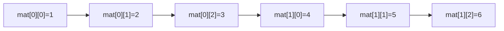

<Callout type="info">
  **이번 문서의 목표:** 이 파일을 다 읽으면 1차원·2차원 배열과 문자열의 메모리 배치를 그림으로 그릴 수 있고, 포인터 선언·연산 코드를 한 줄씩 추적해 실행 결과를 예측할 수 있으며, "배열 이름은 포인터다"라는 문장이 정확히 어떤 뜻인지 설명할 수 있다.
</Callout>

## 왜 배열과 포인터를 묶어서 다시 보는가

02편에서 C의 기본 문법(자료형·연산·제어문·함수)을 빠르게 복습했다면, 이번 편부터는 통합프로그래밍 시험에서 실제로 가장 많이 나오는 **C의 메모리 조작 부분**—배열·문자열·포인터—을 코드 실행 결과 추적 수준까지 깊게 다룬다. 독학사 4단계는 문법을 아는지보다 "이 코드가 실행되면 정확히 무엇이 출력되는가"를 묻는 문제가 많으므로, 이번 편의 목표는 단순 암기가 아니라 **코드를 한 줄씩 손으로 추적하는 습관**을 들이는 것이다.

> **쉽게 말하면:** 배열은 "같은 종류의 상자를 나란히 붙여 놓은 것"이고, 포인터는 "그 상자들 중 하나의 주소를 적어 둔 메모지"다. 이번 편은 상자가 어떻게 나란히 놓이는지, 그리고 메모지에 적힌 주소가 어떻게 계산되는지를 다룬다.

## 1차원 배열: 연속된 메모리에 나란히 놓인 값

**배열**(array)은 같은 자료형의 값을 메모리에 연속으로 늘어놓은 자료구조다. 배열 `int arr[5]`를 선언하면, `int` 하나의 크기(보통 4바이트)만큼씩 다섯 칸이 메모리에 빈틈없이 이어져 만들어진다.

```c
#include <stdio.h>

int main(void) {
    int arr[5] = {10, 20, 30, 40, 50};
    int i;

    for (i = 0; i < 5; i++) {
        printf("arr[%d] = %d, 주소 = %p\n", i, arr[i], (void *)&arr[i]);
    }
    return 0;
}
```

```text
arr[0] = 10, 주소 = 0x7ffee0a1200
arr[1] = 20, 주소 = 0x7ffee0a1204
arr[2] = 30, 주소 = 0x7ffee0a1208
arr[3] = 40, 주소 = 0x7ffee0a120c
arr[4] = 50, 주소 = 0x7ffee0a1210
```

(실제 주소값은 실행할 때마다 달라지지만, 인접한 원소끼리 **정확히 4씩 차이 나는 규칙**은 항상 유지된다. `int`가 4바이트이기 때문이다.)

| 인덱스 | 값 | 주소(예시, 시작 주소를 X라 할 때) |
|--------|----|-----------------------------------|
| 0 | 10 | X + 0 |
| 1 | 20 | X + 4 |
| 2 | 30 | X + 8 |
| 3 | 40 | X + 12 |
| 4 | 50 | X + 16 |

이 표가 시험에서 중요한 이유는, `arr[i]`라는 표현이 실제로는 시작 주소 X에서 **i칸(각 칸은 자료형 크기만큼)만큼 이동한 위치의 값을 읽으라는 뜻**이기 때문이다. 이 계산 방식은 뒤에서 포인터 연산과 완전히 같은 원리로 다시 등장한다.

## 문자열: 문자 배열 + null 종료 문자

C에는 별도의 문자열 자료형이 없다. **문자열**(string)은 `char` 배열에 문자들을 담고 마지막에 **널 종료 문자**(null terminator) `\0`을 붙인 것일 뿐이다.

```c
#include <stdio.h>
#include <string.h>

int main(void) {
    char str[10] = "hi";
    int len = strlen(str);

    printf("str = %s, strlen = %d\n", str, len);
    printf("str[0]=%c, str[1]=%c, str[2]=%d\n", str[0], str[1], str[2]);
    return 0;
}
```

```text
str = hi, strlen = 2
str[0]=h, str[1]=i, str[2]=0
```

`char str[10]`은 10칸을 확보했지만 `"hi"`를 넣으면 `h`, `i`, `\0`(정수값 0)만 채워지고 나머지 7칸은 값이 정해지지 않은 채로 남는다. `strlen`은 배열 전체 크기(10)가 아니라 **`\0`을 만나기 전까지의 문자 개수**(2)를 센다.

| 함수 | 시그니처 | 반환값 규칙 |
|------|----------|-------------|
| `strlen` | `size_t strlen(const char *s)` | `\0` 이전까지의 문자 개수(길이)를 반환한다 |
| `strcpy` | `char *strcpy(char *dest, const char *src)` | src를 dest로 복사하고, dest의 시작 주소를 반환한다. dest 공간이 부족하면 정의되지 않은 동작이다 |
| `strcmp` | `int strcmp(const char *s1, const char *s2)` | 같으면 0, s1이 사전순으로 크면 양수, 작으면 음수를 반환한다 |
| `strcat` | `char *strcat(char *dest, const char *src)` | dest 문자열 끝(`\0` 위치)부터 src를 이어붙이고 dest를 반환한다 |

> **자주 틀리는 점:** `strcmp(s1, s2) == 0`을 "s1이 s2보다 작다"로 착각하는 경우가 많다. `strcmp`는 두 문자열이 **같을 때** 0을 반환하며, 대소 비교는 반환값의 부호(양수·음수)로 판단해야 한다.

## 2차원 배열: 행 우선으로 저장되는 배열의 배열

**2차원 배열**(2D array) `int mat[2][3]`은 실제로는 "길이 3인 int 배열이 2개 이어진 것"으로, 메모리에는 **행(row) 우선**(row-major order)으로 한 줄씩 이어서 저장된다.

```c
#include <stdio.h>

int main(void) {
    int mat[2][3] = {{1, 2, 3}, {4, 5, 6}};
    int i, j;

    for (i = 0; i < 2; i++) {
        for (j = 0; j < 3; j++) {
            printf("mat[%d][%d]=%d ", i, j, mat[i][j]);
        }
        printf("\n");
    }
    return 0;
}
```

```text
mat[0][0]=1 mat[0][1]=2 mat[0][2]=3
mat[1][0]=4 mat[1][1]=5 mat[1][2]=6
```

메모리 배치를 그림으로 보면 다음과 같다.



즉 `mat[1][0]`은 논리적으로는 "2행 1열"이지만, 실제 메모리 상으로는 `mat[0][0]`부터 시작해 **3칸(한 행의 길이)을 건너뛴 네 번째 칸**이다. 이 규칙은 뒤에서 포인터로 2차원 배열에 접근할 때(`*(*(mat + i) + j)`) 그대로 적용된다.

## 포인터 선언과 연산: 주소를 담는 변수

**포인터**(pointer)는 다른 변수의 **메모리 주소**를 값으로 저장하는 변수다. 포인터를 이해하려면 두 연산자를 정확히 구분해야 한다.

- `&`(주소 연산자, address-of operator): 변수 앞에 붙여 "이 변수의 주소를 구하라"는 뜻이다.
- `*`(역참조 연산자, dereference operator): 포인터 앞에 붙여 "이 포인터가 가리키는 주소에 있는 값을 가져오라"는 뜻이다. 단, 선언문에서 `*`는 "이 변수는 포인터형이다"를 뜻해 역할이 다르다.

```c
#include <stdio.h>

int main(void) {
    int x = 100;
    int *p = &x;   /* p는 x의 주소를 저장하는 포인터 */

    printf("x = %d\n", x);
    printf("&x = %p\n", (void *)&x);
    printf("p = %p\n", (void *)p);
    printf("*p = %d\n", *p);

    *p = 200;      /* p가 가리키는 곳, 즉 x의 값을 바꾼다 */
    printf("x = %d (변경 후)\n", x);
    return 0;
}
```

```text
x = 100
&x = 0x7ffee0a1220
p = 0x7ffee0a1220
*p = 100
x = 200 (변경 후)
```

| 줄 | 코드 | x의 값 | p의 값(주소) | *p의 값 |
|----|------|--------|---------------|---------|
| 1 | `int x = 100;` | 100 | (미정의) | - |
| 2 | `int *p = &x;` | 100 | x의 주소 | 100 |
| 3 | `*p = 200;` | 200 | x의 주소(변화 없음) | 200 |

이 추적표에서 핵심은 `*p = 200;`이 **p 자신의 값을 바꾸는 게 아니라, p가 가리키는 곳(x)의 값을 바꾼다**는 점이다. p에 저장된 주소값은 이 줄 앞뒤로 전혀 바뀌지 않는다.

### 포인터 연산: 주소 계산은 자료형 크기 단위로

포인터에 정수를 더하거나 빼면, 그 값은 **바이트 단위가 아니라 가리키는 자료형의 크기 단위**로 이동한다.

```c
#include <stdio.h>

int main(void) {
    int arr[3] = {10, 20, 30};
    int *p = arr;   /* 배열 이름 arr가 첫 원소의 주소로 변환되어 대입된다 */

    printf("p = %p, *p = %d\n", (void *)p, *p);
    p = p + 1;      /* int 크기(4바이트)만큼 이동 */
    printf("p = %p, *p = %d\n", (void *)p, *p);
    return 0;
}
```

```text
p = 0x7ffee0a1230, *p = 10
p = 0x7ffee0a1234, *p = 20
```

`p + 1`은 주소값에 정수 1을 더하는 것이 아니라, **`p`가 가리키는 자료형(`int`, 4바이트) 하나만큼 다음 칸으로 이동**하라는 뜻이다. 만약 `p`가 `double *`(보통 8바이트)이었다면 `p + 1`은 8바이트만큼 이동한다.

## 배열과 포인터의 관계: 배열 이름은 포인터로 변환된다

C에서 배열 이름을 (몇 가지 예외를 빼고) 식에 사용하면, 그 배열 이름은 **첫 번째 원소의 주소를 가리키는 포인터로 자동 변환**된다. 이를 **배열의 포인터로의 decay**(array-to-pointer decay)라 부른다. 이 성질 덕분에 다음 두 표현은 완전히 같은 값을 만든다.

```c
#include <stdio.h>

int main(void) {
    int arr[4] = {5, 10, 15, 20};
    int i;

    for (i = 0; i < 4; i++) {
        printf("arr[%d]=%d, *(arr+%d)=%d\n", i, arr[i], i, *(arr + i));
    }
    return 0;
}
```

```text
arr[0]=5, *(arr+0)=5
arr[1]=10, *(arr+1)=10
arr[2]=15, *(arr+2)=15
arr[3]=20, *(arr+3)=20
```

즉 `arr[i]`는 컴파일러 내부적으로 `*(arr + i)`로 처리된다. 2차원 배열도 같은 원리로, `mat[i][j]`는 `*(*(mat + i) + j)`와 같다.

> **자주 틀리는 점:** "배열 이름과 포인터는 완전히 같은 것이다"라고 착각하는 경우가 많다. `arr`는 값을 다시 대입할 수 없는 **배열 그 자체**(고정된 메모리 블록)이고, `p`는 다른 주소를 다시 가리키도록 값을 바꿀 수 있는 **변수**다. 즉 `arr = p;` 같은 코드는 컴파일 에러가 나지만 `p = arr;`은 정상이다. 또한 `sizeof(arr)`는 배열 전체 크기(예: `int arr[4]`이면 16)를, `sizeof(p)`는 포인터 변수 자체의 크기(보통 8, 64비트 환경 기준)를 반환한다는 차이도 시험에 자주 나온다.

## 핵심 정리

- 배열은 같은 자료형의 값이 메모리에 연속으로 이어진 구조이며, `arr[i]`의 주소는 시작 주소에서 `i × 자료형 크기`만큼 떨어져 있다.
- C 문자열은 `char` 배열 + `\0` 널 종료 문자로 표현되며, `strlen`은 `\0` 이전까지의 길이만 센다.
- 2차원 배열은 행 우선(row-major)으로 한 줄씩 이어서 저장되며, `mat[i][j]`는 `*(*(mat + i) + j)`와 같다.
- `&`는 주소를 구하고 `*`는 역참조하며, 포인터에 정수를 더하는 연산은 가리키는 자료형의 크기 단위로 이동한다.
- 배열 이름은 식에서 첫 원소의 주소를 가리키는 포인터로 변환되지만, 배열 자체와 포인터 변수는 같은 것이 아니며 `sizeof` 결과도 서로 다르다.

## 마무리 복습

<Quiz
  questionNumber={1}
  question="int arr[4]가 시작 주소 1000에서 선언되었을 때, arr[3]의 주소는 (int 크기를 4바이트라 할 때) 얼마인가?"
  options={['1000', '1004', '1008', '1012']}
  correctAnswer={4}
  explanation="arr[i]의 주소는 시작 주소 + i * 자료형 크기이므로 1000 + 3 * 4 = 1012이다."
  optionExplanations={['1000은 arr[0]의 주소다.', '1004는 arr[1]의 주소다.', '1008은 arr[2]의 주소다.', '정답이다. 1000 + 3 * 4 = 1012가 arr[3]의 주소다.']}
/>

<Quiz
  questionNumber={2}
  question="char str[10] = 'hi'; 로 선언했을 때 strlen(str)의 값은?"
  options={['0', '2', '3', '10']}
  correctAnswer={2}
  explanation="strlen은 배열 전체 크기가 아니라 null 종료 문자를 만나기 전까지의 문자 개수를 센다. h, i 두 글자 다음에 널 종료 문자가 오므로 strlen(str)은 2다."
  optionExplanations={['빈 문자열이 아니라 h, i 두 글자가 들어 있으므로 0이 아니다.', '정답이다. 널 종료 문자 이전까지의 문자 개수인 2가 반환된다.', '3은 널 종료 문자까지 포함한 개수이지만 strlen은 이를 포함하지 않는다.', '10은 배열 전체 크기이지 문자열의 실제 길이가 아니다.']}
/>

<Quiz
  questionNumber={3}
  question="int mat[2][3]가 행 우선(row-major)으로 저장될 때, 메모리 상에서 mat[0][0] 바로 다음에 저장되는 원소는?"
  options={['mat[1][0]', 'mat[0][1]', 'mat[1][1]', 'mat[0][2]']}
  correctAnswer={2}
  explanation="행 우선 저장 방식에서는 한 행을 먼저 전부 채운 뒤 다음 행으로 넘어가므로, mat[0][0] 다음에는 같은 행의 mat[0][1]이 저장된다."
  optionExplanations={['mat[1][0]은 첫 번째 행 전체(mat[0][0]~mat[0][2])가 지난 뒤에 저장된다.', '정답이다. 행 우선 저장에서는 같은 행의 다음 열이 바로 이어서 저장된다.', 'mat[1][1]은 mat[1][0]보다도 뒤에 저장된다.', 'mat[0][2]는 mat[0][1]보다 뒤에 저장된다.']}
/>

<Quiz
  questionNumber={4}
  question="int x = 5; int *p = &x; 로 선언한 뒤 *p = 10;을 실행하면 어떤 결과가 나타나는가?"
  options={['p가 가리키는 주소가 바뀐다', 'x의 값이 10으로 바뀐다', 'p 자체의 값이 10으로 바뀐다', '컴파일 에러가 발생한다']}
  correctAnswer={2}
  explanation="*p = 10;은 p가 가리키는 대상, 즉 x의 값을 10으로 바꾸는 연산이다. p에 저장된 주소값 자체는 변하지 않는다."
  optionExplanations={['*p = 10;은 p가 가리키는 대상의 값을 바꾸는 것이지 p가 가리키는 주소를 바꾸는 것이 아니다.', '정답이다. 역참조를 통해 p가 가리키는 x의 값이 10으로 바뀐다.', 'p 자체의 값(주소)을 바꾸려면 p = 어떤주소; 형태로 대입해야 한다.', '이 코드는 정상적으로 컴파일되고 실행된다.']}
/>

<Quiz
  questionNumber={5}
  question="int arr[3]; int *p = arr; 로 선언한 뒤 p = p + 1;을 실행했을 때 p가 이동하는 거리는?"
  options={['1바이트', '4바이트(int 크기만큼)', '항상 8바이트', '배열 전체 크기만큼']}
  correctAnswer={2}
  explanation="포인터에 정수를 더하는 연산은 바이트 단위가 아니라 그 포인터가 가리키는 자료형의 크기 단위로 이동한다. int가 4바이트인 환경에서는 p + 1이 4바이트만큼 이동한다."
  optionExplanations={['포인터 연산은 1바이트 단위가 아니라 가리키는 자료형 크기 단위로 이루어진다.', '정답이다. int 포인터의 덧셈 연산은 int 크기(보통 4바이트) 단위로 이동한다.', '8바이트는 double 등 다른 자료형의 크기이며 int 포인터에는 해당하지 않는다.', '배열 전체 크기만큼 이동하는 것이 아니라 원소 하나 크기만큼 이동한다.']}
/>

<Quiz
  questionNumber={6}
  question="배열 이름과 포인터 변수의 차이에 대한 설명으로 옳은 것은?"
  options={['배열 이름에도 다른 배열의 주소를 다시 대입할 수 있다', 'sizeof(배열이름)은 항상 포인터 변수의 크기와 같다', '배열 이름은 값을 다시 대입할 수 없는 고정된 메모리 블록이고, 포인터 변수는 다른 주소로 다시 대입할 수 있다', '배열 이름은 식에서 절대 포인터로 변환되지 않는다']}
  correctAnswer={3}
  explanation="배열 이름은 컴파일 시점에 고정된 메모리 블록을 가리키는 이름일 뿐 재대입이 불가능하지만, 포인터 변수는 다른 주소를 다시 가리키도록 값을 바꿀 수 있다."
  optionExplanations={['배열 이름은 다시 대입할 수 없으므로 arr = 다른배열; 형태는 컴파일 에러다.', 'sizeof(배열이름)은 배열 전체 크기이며 포인터 변수 크기와 다르다.', '정답이다. 배열 이름은 재대입이 불가능한 고정 블록이고 포인터 변수는 재대입이 가능하다.', '배열 이름은 대부분의 식에서 첫 원소의 주소를 가리키는 포인터로 변환된다.']}
/>

<Quiz
  questionNumber={7}
  question="strcmp(a, b) 함수 호출의 반환값에 대한 설명으로 옳은 것은?"
  options={['a와 b가 같으면 1을 반환한다', 'a와 b가 같으면 0을 반환한다', 'a가 b보다 항상 크면 0을 반환한다', 'strcmp는 항상 두 문자열의 길이 차이를 반환한다']}
  correctAnswer={2}
  explanation="strcmp는 두 문자열이 완전히 같을 때 0을 반환하고, 사전순으로 a가 크면 양수, 작으면 음수를 반환한다."
  optionExplanations={['같을 때 반환하는 값은 1이 아니라 0이다.', '정답이다. strcmp는 두 문자열이 같으면 0을 반환한다.', 'a가 b보다 크면 0이 아니라 양수를 반환한다.', 'strcmp의 반환값 부호는 대소 관계를 나타낼 뿐, 항상 길이 차이와 같은 것은 아니다.']}
/>

## 참고 자료

- [국가평생교육진흥원 독학학위제](https://bdes.nile.or.kr)
- [cppreference.com - C 배열과 포인터](https://en.cppreference.com/w/c/language/array)
