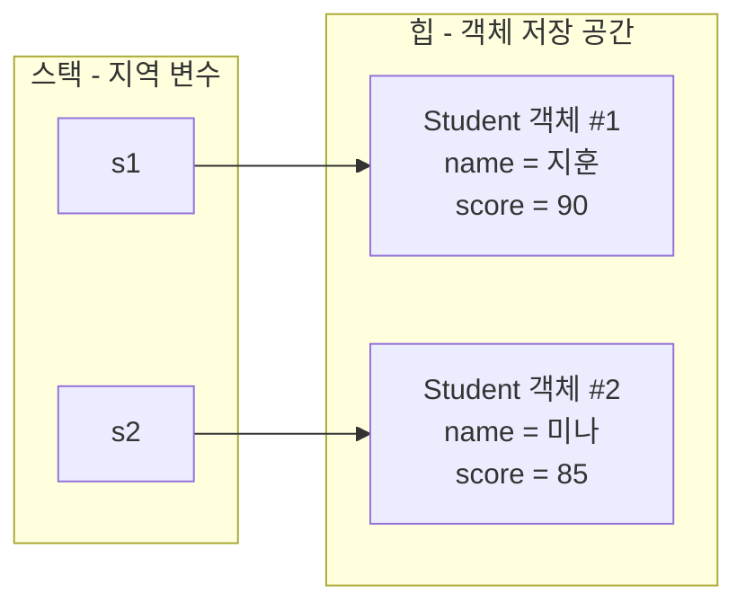
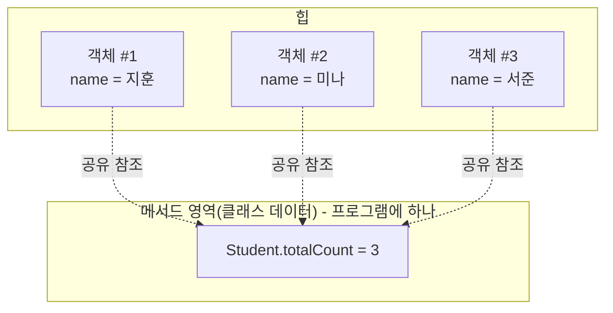

<Callout type="info">
  **이번 문서의 목표:** 이 문서를 다 읽으면 클래스로부터 객체가 어떻게 만들어지는지 메모리 관점에서 설명할 수 있고, 생성자·this·접근 제어자·static 키워드가 섞인 코드의 실행 결과를 변수 값 표로 추적할 수 있으며, 독학사 4단계 통합프로그래밍에서 자주 나오는 "필드 초기화 순서" 함정 문제를 풀 수 있다.
</Callout>

## 왜 이 편이 필요한가

선행 03편(객체지향 용어 지도)에서 클래스(class, 객체를 만들기 위한 설계도)와 객체(object, 설계도로 실제로 만들어진 것)의 관계, 캡슐화(encapsulation, 데이터와 그 데이터를 다루는 동작을 하나로 묶고 외부에는 필요한 부분만 보여주는 것)라는 용어를 개념적으로 정리했다. 이 편부터는 그 용어들이 실제 Java 코드에서 어떤 문법으로 나타나는지, 그리고 그 코드가 메모리에서 어떻게 동작하는지를 다룬다. 독학사 4단계는 프로그래밍언어론이나 객체지향프로그래밍 같은 3단계 이론 과목과 달리 **코드를 읽고 실행 결과를 맞히는 능력**을 직접 시험하므로, 이 편의 목표는 "정의를 아는 것"이 아니라 "코드를 보고 메모리 상태를 그려낼 수 있는 것"이다.

> **쉽게 말하면:** 클래스는 붕어빵 틀이고, 객체는 그 틀로 찍어낸 붕어빵 하나하나다. 틀은 하나지만 붕어빵은 여러 개 만들 수 있고, 각 붕어빵(객체)은 서로 다른 속(필드 값)을 가질 수 있다.

## 클래스와 객체 — 코드와 메모리

가장 단순한 클래스부터 시작한다.

```java
class Student {
    String name;
    int score;

    void printInfo() {
        System.out.println(name + "의 점수는 " + score + "점이다.");
    }
}

public class Main {
    public static void main(String[] args) {
        Student s1 = new Student();
        s1.name = "지훈";
        s1.score = 90;

        Student s2 = new Student();
        s2.name = "미나";
        s2.score = 85;

        s1.printInfo();
        s2.printInfo();
    }
}
```

```text
지훈의 점수는 90점이다.
미나의 점수는 85점이다.
```

`Student`는 필드(field, 클래스가 가지는 데이터) `name`, `score`와 메서드(method, 클래스가 가지는 동작) `printInfo`를 정의한 **설계도**다. `new Student()`는 이 설계도를 이용해 실제로 메모리 공간을 확보하고 객체를 하나 만드는 연산이다. `new` 연산자가 힙(heap, 객체가 저장되는 메모리 영역. 06편에서 C의 동적 할당 메모리로 이미 다룬 개념과 같은 자리)에 `Student` 객체를 위한 공간을 만들고, 그 공간의 주소를 반환한다. 이 주소를 `s1`, `s2`라는 **참조 변수**(reference variable, 객체의 주소를 담는 변수)가 저장한다.



이 그림이 이 편 전체를 관통하는 핵심 그림이다. `s1`과 `s2`는 서로 다른 힙 공간을 가리키므로, 같은 클래스에서 만들어졌어도 필드 값이 독립적이다. `s1.name`을 바꿔도 `s2.name`은 영향받지 않는다. 07편에서 다룬 C의 포인터가 메모리 주소를 담는 것과 원리가 같다 — 다만 Java의 참조 변수는 포인터 연산(주소 값에 숫자를 더하는 것 등)을 프로그래머가 직접 할 수 없도록 언어 차원에서 막아 놓았다는 차이가 있다.

> **자주 틀리는 점:** `Student s1;`만 쓰고 `new Student()`를 하지 않은 상태에서 `s1.name`에 접근하면 `NullPointerException`(널 포인터 예외, 12편에서 자세히)이 발생한다. `s1`은 선언만 된 상태에서는 아무 객체도 가리키지 않는 값인 `null`을 담고 있기 때문이다.

## 생성자 — 객체를 만드는 순간 초기화하기

위 예제에서는 객체를 만든 뒤 필드를 하나씩 대입했다. 실무에서는 객체를 만드는 그 순간에 필드 값을 넣어 주는 **생성자**(constructor, 클래스 이름과 똑같은 이름을 가지며 반환 타입이 없는 특수한 메서드로, `new`로 객체를 만들 때 자동으로 호출된다)를 쓰는 것이 일반적이다.

```java
class Student {
    String name;
    int score;

    Student(String name, int score) {
        this.name = name;
        this.score = score;
    }

    void printInfo() {
        System.out.println(name + "의 점수는 " + score + "점이다.");
    }
}

public class Main {
    public static void main(String[] args) {
        Student s1 = new Student("지훈", 90);
        s1.printInfo();
    }
}
```

```text
지훈의 점수는 90점이다.
```

`this`(디스, 현재 실행 중인 메서드나 생성자를 호출한 바로 그 객체 자신을 가리키는 참조)는 생성자의 매개변수 이름과 필드 이름이 똑같을 때 둘을 구분하기 위해 꼭 필요하다. `this.name = name;`에서 왼쪽 `this.name`은 **객체의 필드**, 오른쪽 `name`은 **생성자에 넘어온 매개변수**를 가리킨다. 이름이 같아서 헷갈리기 쉬우므로 다음과 같이 구분해 외운다.

<Steps>
1. **매개변수 우선 규칙**: `this` 없이 `name`이라고만 쓰면, 같은 이름의 지역 변수(매개변수도 지역 변수의 일종)가 필드를 **가린다**(shadowing). 그래서 `name = name;`이라고 쓰면 매개변수를 자기 자신에게 대입하는 의미 없는 코드가 되고, 필드는 초기화되지 않는다.
2. **this로 명시**: `this.name`이라고 쓰면 지역 변수가 아니라 "이 객체의 필드"임을 명확히 지정한다.
3. **이름이 다르면 this가 필수는 아니다**: 매개변수 이름을 `n`, `sc`처럼 다르게 지으면 `this` 없이도 필드에 바로 접근되지만, 가독성을 위해 매개변수 이름을 필드와 맞추고 `this`를 쓰는 관례가 널리 쓰인다.
</Steps>

### 기본 생성자와 생성자 오버로딩

클래스에 생성자를 하나도 정의하지 않으면, 컴파일러가 매개변수가 없고 아무 일도 하지 않는 **기본 생성자**(default constructor)를 자동으로 만들어 준다. 하지만 **생성자를 하나라도 직접 정의하면 기본 생성자는 자동으로 생기지 않는다.** 이 규칙이 시험에서 자주 나온다.

```java
class Student {
    String name;
    int score;

    Student(String name, int score) {
        this.name = name;
        this.score = score;
    }
}

public class Main {
    public static void main(String[] args) {
        Student s = new Student();  // 컴파일 오류!
    }
}
```

`Student(String, int)` 생성자를 정의했기 때문에 매개변수 없는 `Student()` 생성자는 더 이상 자동으로 존재하지 않는다. 매개변수 없는 생성 방식도 함께 쓰고 싶다면, 08편의 자료구조 코드에서처럼 **생성자 오버로딩**(overloading, 같은 이름이지만 매개변수 목록이 다른 메서드·생성자를 여러 개 정의하는 것. 정확한 규칙은 10편에서 오버라이딩과 비교해 다시 정리한다)으로 직접 추가해야 한다.

```java
class Student {
    String name;
    int score;

    Student() {
        this("이름없음", 0);
    }

    Student(String name, int score) {
        this.name = name;
        this.score = score;
    }
}
```

여기서 `this("이름없음", 0);`은 **같은 클래스의 다른 생성자를 호출**하는 문법이다. 이렇게 생성자 안에서 다른 생성자를 부르는 것을 **생성자 체이닝**(constructor chaining)이라 한다. 조건이 하나 있다 — `this(...)` 호출은 반드시 생성자의 **첫 줄**에만 올 수 있다.

> **자주 틀리는 점:** `this(...)`를 생성자 중간이나 끝에 쓰면 컴파일 오류가 난다. "생성자 체이닝은 항상 첫 줄"이라는 규칙을 정확히 기억해야 한다.

## 접근 제어자 — 캡슐화를 문법으로 구현하기

03편에서 캡슐화를 "데이터를 숨기고 필요한 통로만 열어 주는 것"으로 정의했다. Java에서 이 통로를 여닫는 문법이 **접근 제어자**(access modifier)다.

| 접근 제어자 | 같은 클래스 | 같은 패키지 | 다른 패키지의 자식 클래스 | 다른 패키지 |
|---|---|---|---|---|
| `private` | 접근 가능 | 접근 불가 | 접근 불가 | 접근 불가 |
| (default, 아무것도 안 씀) | 접근 가능 | 접근 가능 | 접근 불가 | 접근 불가 |
| `protected` | 접근 가능 | 접근 가능 | 접근 가능 | 접근 불가 |
| `public` | 접근 가능 | 접근 가능 | 접근 가능 | 접근 가능 |

표에서 위에서 아래로 갈수록 공개 범위가 넓어진다. 캡슐화의 기본 원칙은 **필드는 `private`로 숨기고, 외부에는 `public` 메서드(getter·setter)로만 접근을 허용하는 것**이다.

```java
class Student {
    private String name;
    private int score;

    public Student(String name, int score) {
        this.name = name;
        setScore(score);
    }

    public int getScore() {
        return score;
    }

    public void setScore(int score) {
        if (score < 0 || score > 100) {
            System.out.println("점수는 0~100 사이여야 합니다. 0으로 처리합니다.");
            this.score = 0;
        } else {
            this.score = score;
        }
    }
}

public class Main {
    public static void main(String[] args) {
        Student s = new Student("지훈", 150);
        System.out.println(s.getScore());
    }
}
```

```text
점수는 0~100 사이여야 합니다. 0으로 처리합니다.
0
```

`score`가 `public`이었다면 `s.score = 150;`처럼 검증 없이 바로 값을 바꿀 수 있어 잘못된 상태(0~100 범위를 벗어난 점수)가 그대로 들어갈 수 있다. `private`로 숨기고 `setScore` 메서드 안에서 검증 로직을 거치게 하면, **객체가 항상 유효한 상태를 유지하도록 강제**할 수 있다. 이것이 캡슐화가 실제로 버그를 막아 주는 방식이다.

## static 키워드 — 객체가 아니라 클래스에 속하는 것

지금까지 다룬 필드는 모두 **객체마다 따로 존재하는** 인스턴스 필드(instance field)였다. `static`을 붙이면 그 필드는 객체가 아니라 **클래스 자체에 딱 하나만** 존재하며, 모든 객체가 이를 공유한다.

```java
class Student {
    static int totalCount = 0;
    String name;

    Student(String name) {
        this.name = name;
        totalCount++;
    }
}

public class Main {
    public static void main(String[] args) {
        Student s1 = new Student("지훈");
        Student s2 = new Student("미나");
        Student s3 = new Student("서준");

        System.out.println(s1.totalCount);
        System.out.println(Student.totalCount);
    }
}
```

```text
3
3
```

`totalCount`는 `Student` 객체가 몇 개 만들어졌는지 세는 용도로, 특정 객체 하나에 속한 값이 아니라 **모든 Student 객체가 공유하는 값**이어야 하므로 `static`이 적절하다.



`s1.totalCount`처럼 객체를 통해 접근하는 것도 문법상 허용되지만, `totalCount`는 어차피 객체마다 따로 있는 값이 아니므로 `Student.totalCount`처럼 **클래스 이름으로 접근하는 것이 정확한 표현**이다. 독학사 시험에서는 "객체를 통한 static 필드 접근이 문법 오류인가"를 묻는 함정이 나오는데, **오류는 아니지만 권장되지 않는 표기**라는 점을 정확히 알아야 한다.

`static` 메서드도 같은 원리다. `static` 메서드는 특정 객체의 필드(인스턴스 필드)에 접근할 수 없다 — 애초에 어떤 객체를 대상으로 실행되는지가 정해져 있지 않기 때문이다.

```java
class MathUtil {
    static int square(int x) {
        return x * x;
    }
}

public class Main {
    public static void main(String[] args) {
        System.out.println(MathUtil.square(5));
    }
}
```

```text
25
```

`square`는 어떤 `MathUtil` 객체의 상태에도 의존하지 않는 순수한 계산이므로 객체를 만들 필요 없이 `MathUtil.square(5)`처럼 바로 호출한다. `main` 메서드 자체가 `static`인 이유도 같다 — 프로그램이 시작될 때는 아직 어떤 객체도 만들어지지 않았으므로, JVM이 객체 없이 바로 호출할 수 있는 지점이 필요하기 때문이다.

> **자주 틀리는 점:** `static` 메서드 안에서 인스턴스 필드나 인스턴스 메서드를 `this` 없이 바로 사용하려 하면 컴파일 오류가 발생한다. 반대로 인스턴스 메서드 안에서는 `static` 필드에 자유롭게 접근할 수 있다 — "static은 인스턴스를 모르지만, 인스턴스는 static을 안다"는 방향으로 기억한다.

## 기본 제어문·배열 복습 — 독학사식 코드 추적

02편에서 C·Java 공통 문법을 훑었다. 여기서는 Java 배열과 제어문이 섞인 코드를 실행 추적표로 연습해 본다.

```java
public class Main {
    public static void main(String[] args) {
        int[] scores = {70, 85, 90, 60, 95};
        int sum = 0;
        int count = 0;

        for (int i = 0; i < scores.length; i++) {
            if (scores[i] >= 80) {
                sum += scores[i];
                count++;
            }
        }

        System.out.println("합계: " + sum + ", 개수: " + count);
    }
}
```

```text
합계: 270, 개수: 3
```

| 반복 `i` | `scores[i]` | 조건(80 이상) | `sum` | `count` |
|---|---|---|---|---|
| 0 | 70 | 거짓 | 0 | 0 |
| 1 | 85 | 참 | 85 | 1 |
| 2 | 90 | 참 | 175 | 2 |
| 3 | 60 | 거짓 | 175 | 2 |
| 4 | 95 | 참 | 270 | 3 |

Java의 배열은 `scores.length`로 길이를 얻는다는 점이 C의 배열(길이 정보를 배열 자신이 갖고 있지 않아 `sizeof` 등으로 별도 계산해야 했던 것, 06편 참고)과 다르다. Java 배열은 `new int[5]`처럼 만들어질 때 힙에 길이 정보까지 함께 저장되는 객체이기 때문이다. 그래서 Java 배열도 사실은 객체이며, 참조 변수 `scores`가 그 배열 객체를 가리키는 구조는 위에서 본 `Student` 객체 참조 구조와 동일하다.

> **자주 틀리는 점:** `scores.length`를 `scores.length()`처럼 메서드 호출로 착각하는 실수가 잦다. 배열의 `length`는 **메서드가 아니라 필드**다(반면 문자열 `String`의 길이는 `str.length()`로 **메서드 호출**이다 — 이 둘을 반대로 쓰는 문제가 시험에 자주 나온다).

## 자주 틀리는 점 정리

- 생성자를 하나라도 직접 정의하면 매개변수 없는 기본 생성자는 자동으로 사라진다.
- `this(...)` 생성자 체이닝은 반드시 생성자의 첫 줄에만 쓸 수 있다.
- `static` 필드·메서드는 객체가 아니라 클래스에 속하며, 객체를 통해 접근해도 오류는 아니지만 클래스 이름으로 접근하는 것이 정확한 표기다.
- `static` 메서드 안에서는 `this`를 쓸 수 없고 인스턴스 필드에 직접 접근할 수 없다.
- 배열의 길이는 `length`(필드, 괄호 없음), 문자열의 길이는 `length()`(메서드, 괄호 있음)로 서로 다르게 접근한다.

## 핵심 정리

- 클래스는 설계도, 객체는 `new`로 힙에 만들어진 실체이며, 참조 변수는 그 객체의 주소를 담는다.
- 생성자는 객체 생성 시점에 자동 호출되는 특수 메서드이고, `this`로 필드와 매개변수를 구분하며, `this(...)`로 생성자를 연결할 수 있다.
- 접근 제어자(`private`, default, `protected`, `public`)는 캡슐화를 문법으로 구현하며, 필드는 숨기고 메서드로만 검증된 접근을 허용하는 것이 기본 설계 원칙이다.
- `static`은 객체가 아니라 클래스에 속하는 필드·메서드를 만들며, 모든 객체가 하나의 값을 공유한다.
- Java 배열은 객체이며 `length` 필드로 길이를 얻는다는 점이 C 배열과 다르다.

## 마무리 복습

<Quiz
  questionNumber={1}
  question="클래스에 매개변수가 있는 생성자만 하나 정의했을 때 나타나는 현상으로 옳은 것은?"
  options={['매개변수 없는 기본 생성자가 자동으로 함께 만들어진다', '매개변수 없는 기본 생성자는 더 이상 자동으로 만들어지지 않는다', '컴파일 시점에 오류가 발생해 클래스 자체를 사용할 수 없다', '정의한 생성자가 자동으로 오버로딩되어 매개변수 없는 버전도 생긴다']}
  correctAnswer={2}
  explanation="생성자를 하나라도 직접 정의하면 컴파일러는 기본 생성자를 더 이상 자동으로 추가하지 않는다. 매개변수 없는 생성 방식이 필요하면 직접 오버로딩해야 한다."
  optionExplanations={['기본 생성자는 클래스에 생성자가 하나도 없을 때만 자동으로 생긴다.', '정답. 직접 정의한 생성자가 있으면 기본 생성자는 사라진다.', '생성자 하나만 정의한 클래스도 정상적으로 컴파일되고 사용할 수 있다.', '자동 오버로딩이라는 기능은 존재하지 않으며, 필요하면 직접 추가해야 한다.']}
/>

<Quiz
  questionNumber={2}
  question="다음 중 this 키워드에 대한 설명으로 옳지 않은 것은?"
  options={['현재 실행 중인 메서드나 생성자를 호출한 객체 자신을 가리킨다', '매개변수 이름과 필드 이름이 같을 때 필드를 명확히 지정하는 데 쓰인다', 'this(...) 형태로 같은 클래스의 다른 생성자를 호출할 수 있다', 'this(...) 생성자 호출은 생성자 안 어디에나 자유롭게 위치할 수 있다']}
  correctAnswer={4}
  explanation="this(...)로 다른 생성자를 호출하는 생성자 체이닝은 반드시 생성자의 첫 줄에만 위치할 수 있다."
  optionExplanations={['this는 현재 객체 자신을 가리키는 참조라는 설명은 옳다.', '필드와 매개변수 이름이 같을 때 this로 구분한다는 설명은 옳다.', 'this(...) 문법으로 생성자 체이닝이 가능하다는 설명은 옳다.', '정답. this(...) 호출은 반드시 생성자의 첫 줄에만 올 수 있으므로 이 설명이 옳지 않다.']}
/>

<Quiz
  questionNumber={3}
  question="private 필드와 public getter/setter 메서드를 함께 쓰는 설계의 주된 목적은?"
  options={['프로그램의 실행 속도를 높이기 위해서다', '필드 이름을 외부에서 숨겨 코드를 짧게 만들기 위해서다', '객체가 항상 유효한 상태를 유지하도록 검증 로직을 통과시키기 위해서다', 'static 필드로 전환하기 쉽게 만들기 위해서다']}
  correctAnswer={3}
  explanation="필드를 private로 숨기고 public 메서드로만 접근하게 하면, setter 안에서 값을 검증하는 로직을 강제할 수 있어 객체가 잘못된 상태에 빠지는 것을 막을 수 있다. 이것이 캡슐화가 실제로 버그를 예방하는 방식이다."
  optionExplanations={['접근 제어자는 실행 속도와 직접적인 관련이 없다.', '코드 길이를 줄이는 것이 목적이 아니라 안전한 접근 통제가 목적이다.', '정답. 검증을 거친 값만 필드에 들어가도록 강제하는 것이 핵심 목적이다.', 'static 전환과는 관련이 없는 개념이다.']}
/>

<Quiz
  questionNumber={4}
  question="static 필드와 인스턴스 필드에 대한 설명으로 옳은 것은?"
  options={['static 필드는 객체마다 독립적으로 존재하고, 인스턴스 필드는 클래스 전체가 공유한다', 'static 필드는 클래스 전체가 공유하고, 인스턴스 필드는 객체마다 독립적으로 존재한다', 'static 필드와 인스턴스 필드는 저장되는 메모리 영역이 항상 같다', 'static 필드는 인스턴스 메서드 안에서 접근할 수 없다']}
  correctAnswer={2}
  explanation="static 필드는 클래스당 하나만 존재해 모든 객체가 공유하고, 인스턴스 필드는 객체가 생성될 때마다 각 객체 안에 독립적으로 만들어진다."
  optionExplanations={['설명이 반대로 되어 있다. static이 공유, 인스턴스가 독립이다.', '정답. static은 클래스 전체 공유, 인스턴스 필드는 객체별 독립이라는 설명이 정확하다.', 'static 필드는 메서드 영역, 인스턴스 필드는 힙의 객체 안에 저장되어 영역이 다르다.', '인스턴스 메서드 안에서는 static 필드에 자유롭게 접근할 수 있다.']}
/>

<Quiz
  questionNumber={5}
  question="static 메서드 안에서 할 수 없는 것은?"
  options={['다른 static 메서드를 호출하는 것', 'static 필드의 값을 읽고 쓰는 것', 'this 키워드로 인스턴스 필드에 접근하는 것', '매개변수로 받은 값을 계산해 반환하는 것']}
  correctAnswer={3}
  explanation="static 메서드는 특정 객체와 연결되지 않으므로 this를 사용할 수 없고, 따라서 this를 통한 인스턴스 필드 접근도 불가능하다."
  optionExplanations={['static 메서드 안에서 다른 static 메서드를 호출하는 것은 정상적으로 가능하다.', 'static 필드는 static 메서드 안에서 자유롭게 읽고 쓸 수 있다.', '정답. static 메서드는 객체와 연결되지 않으므로 this를 쓸 수 없다.', '매개변수를 받아 계산해 반환하는 것은 static 메서드의 일반적인 용도다.']}
/>

<Quiz
  questionNumber={6}
  question="Java 배열의 길이를 구하는 문법으로 옳은 것은? (배열 변수 이름은 arr이다)"
  options={['arr.length()', 'arr.length', 'length(arr)', 'arr.size()']}
  correctAnswer={2}
  explanation="Java 배열의 길이는 length라는 필드로 저장되어 있어 괄호 없이 arr.length로 접근한다. 문자열의 length()나 컬렉션의 size()와 헷갈리지 않아야 한다."
  optionExplanations={['배열의 length는 메서드가 아니라 필드이므로 괄호를 붙이면 오류다.', '정답. 배열의 length는 필드이므로 괄호 없이 접근한다.', '이런 형태의 함수 호출 문법은 존재하지 않는다.', 'size()는 12편에서 다룰 컬렉션 프레임워크의 메서드이지 배열의 문법이 아니다.']}
/>

<Quiz
  questionNumber={7}
  question="다음 코드를 실행했을 때 콘솔에 출력되는 결과로 옳은 것은?"
  options={['0', '1', '3', '컴파일 오류']}
  correctAnswer={3}
  explanation="static 필드 totalCount는 클래스에 하나만 존재하며 객체가 생성될 때마다 1씩 증가한다. 세 번 객체를 생성했으므로 최종 값은 3이 된다."
  optionExplanations={['생성자가 호출될 때마다 값이 누적되므로 0이 아니다.', '한 번만 증가한 값이 아니라 세 번 누적된 값이다.', '정답. 객체 3개가 생성되며 totalCount가 0에서 3까지 누적된다.', '이 코드는 문법적으로 문제가 없어 정상적으로 컴파일된다.']}
/>

## 참고 자료

- [Oracle Java Tutorials - Classes and Objects](https://docs.oracle.com/javase/tutorial/java/javaOO/index.html) — 클래스·객체·생성자·접근 제어자에 대한 공식 설명.
- [Oracle Java Tutorials - Understanding Class Members](https://docs.oracle.com/javase/tutorial/java/javaOO/classvars.html) — static 필드·메서드(클래스 변수·클래스 메서드)의 공식 설명.
