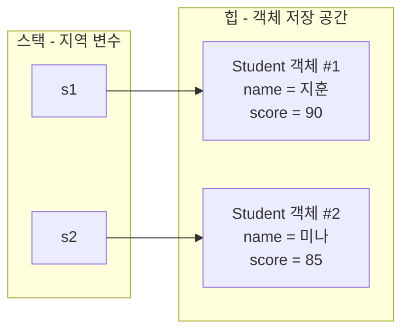
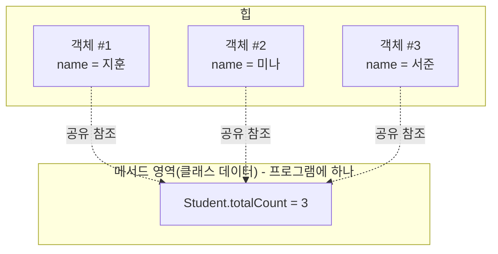

## 클래스와 객체 — 코드와 메모리

가장 단순한 클래스부터 시작한다.

```java
class Student {
    String name;
    int score;

    void printInfo() {
        System.out.println(name + "의 점수는 " + score + "점이다.");
    }
}

public class Main {
    public static void main(String[] args) {
        Student s1 = new Student();
        s1.name = "지훈";
        s1.score = 90;

        Student s2 = new Student();
        s2.name = "미나";
        s2.score = 85;

        s1.printInfo();
        s2.printInfo();
    }
}
```

```text
지훈의 점수는 90점이다.
미나의 점수는 85점이다.
```

`Student`는 필드(field, 클래스가 가지는 데이터) `name`, `score`와 메서드(method, 클래스가 가지는 동작) `printInfo`를 정의한 **설계도**다. `new Student()`는 이 설계도를 이용해 실제로 메모리 공간을 확보하고 객체를 하나 만드는 연산이다.


```mermaid
graph LR
    subgraph 스택[스택 - 지역 변수]
        s1["s1"]
        s2["s2"]
    end
    subgraph 힙[힙 - 객체 저장 공간]
        obj1["Student 객체 #1<br/>name = 지훈<br/>score = 90"]
        obj2["Student 객체 #2<br/>name = 미나<br/>score = 85"]
    end
    s1 --> obj1
    s2 --> obj2
```

이 그림이 이 편 전체를 관통하는 핵심 그림이다. `s1`과 `s2`는 서로 다른 힙 공간을 가리키므로, 같은 클래스에서 만들어졌어도 필드 값이 독립적이다.

> **자주 틀리는 점:** `Student s1;`만 쓰고 `new Student()`를 하지 않은 상태에서 `s1.name`에 접근하면 `NullPointerException`(널 포인터 예외, 11편에서 자세히)이 발생한다. `s1`은 선언만 된 상태에서는 아무 객체도 가리키지 않는 값인 `null`을 담고 있기 때문이다.

## 생성자 — 객체를 만드는 순간 초기화하기

위 예제에서는 객체를 만든 뒤 필드를 하나씩 대입했다. 실무에서는 객체를 만드는 그 순간에 필드 값을 넣어 주는 **생성자**(constructor, 클래스 이름과 똑같은 이름을 가지며 반환 타입이 없는 특수한 메서드로, `new`로 객체를 만들 때 자동으로 호출된다)를 쓰는 것이 일반적이다.

```java
class Student {
    String name;
    int score;

    Student(String name, int score) {
        this.name = name;
        this.score = score;
    }

    void printInfo() {
        System.out.println(name + "의 점수는 " + score + "점이다.");
    }
}

public class Main {
    public static void main(String[] args) {
        Student s1 = new Student("지훈", 90);
        s1.printInfo();
    }
}
```

```text
지훈의 점수는 90점이다.
```

`this`(디스, 현재 실행 중인 메서드나 생성자를 호출한 바로 그 객체 자신을 가리키는 참조)는 생성자의 매개변수 이름과 필드 이름이 똑같을 때 둘을 구분하기 위해 꼭 필요하다. `this.name = name;`에서 왼쪽 `this.name`은 **객체의 필드**, 오른쪽 `name`은 **생성자에 넘어온 매개변수**를 가리킨다.

### 기본 생성자와 생성자 오버로딩

클래스에 생성자를 하나도 정의하지 않으면, 컴파일러가 매개변수가 없고 아무 일도 하지 않는 **기본 생성자**(default constructor)를 자동으로 만들어 준다. 하지만 **생성자를 하나라도 직접 정의하면 기본 생성자는 자동으로 생기지 않는다.** 이 규칙이 시험에서 자주 나온다.

```java
class Student {
    String name;
    int score;

    Student(String name, int score) {
        this.name = name;
        this.score = score;
    }
}

public class Main {
    public static void main(String[] args) {
        Student s = new Student();  // 컴파일 오류!
    }
}
```

`Student(String, int)` 생성자를 정의했기 때문에 매개변수 없는 `Student()` 생성자는 더 이상 자동으로 존재하지 않는다. 매개변수 없는 생성 방식도 함께 쓰고 싶다면, 07편의 자료구조 코드에서처럼 **생성자 오버로딩**(overloading, 같은 이름이지만 매개변수 목록이 다른 메서드·생성자를 여러 개 정의하는 것.

```java
class Student {
    String name;
    int score;

    Student() {
        this("이름없음", 0);
    }

    Student(String name, int score) {
        this.name = name;
        this.score = score;
    }
}
```

여기서 `this("이름없음", 0);`은 **같은 클래스의 다른 생성자를 호출**하는 문법이다. 이렇게 생성자 안에서 다른 생성자를 부르는 것을 **생성자 체이닝**(constructor chaining)이라 한다. 조건이 하나 있다 — `this(...)` 호출은 반드시 생성자의 **첫 줄**에만 올 수 있다.

> **자주 틀리는 점:** `this(...)`를 생성자 중간이나 끝에 쓰면 컴파일 오류가 난다. "생성자 체이닝은 항상 첫 줄"이라는 규칙을 정확히 기억해야 한다.

## 접근 제어자 — 캡슐화를 문법으로 구현하기

02편에서 캡슐화를 "데이터를 숨기고 필요한 통로만 열어 주는 것"으로 정의했다. Java에서 이 통로를 여닫는 문법이 **접근 제어자**(access modifier)다.

| 접근 제어자 | 같은 클래스 | 같은 패키지 | 다른 패키지의 자식 클래스 | 다른 패키지 |
|---|---|---|---|---|
| `private` | 접근 가능 | 접근 불가 | 접근 불가 | 접근 불가 |
| (default, 아무것도 안 씀) | 접근 가능 | 접근 가능 | 접근 불가 | 접근 불가 |
| `protected` | 접근 가능 | 접근 가능 | 접근 가능 | 접근 불가 |
| `public` | 접근 가능 | 접근 가능 | 접근 가능 | 접근 가능 |

표에서 위에서 아래로 갈수록 공개 범위가 넓어진다. 캡슐화의 기본 원칙은 **필드는 `private`로 숨기고, 외부에는 `public` 메서드(getter·setter)로만 접근을 허용하는 것**이다.

```java
class Student {
    private String name;
    private int score;

    public Student(String name, int score) {
        this.name = name;
        setScore(score);
    }

    public int getScore() {
        return score;
    }

    public void setScore(int score) {
        if (score < 0 || score > 100) {
            System.out.println("점수는 0~100 사이여야 합니다. 0으로 처리합니다.");
            this.score = 0;
        } else {
            this.score = score;
        }
    }
}

public class Main {
    public static void main(String[] args) {
        Student s = new Student("지훈", 150);
        System.out.println(s.getScore());
    }
}
```

```text
점수는 0~100 사이여야 합니다. 0으로 처리합니다.
0
```

`score`가 `public`이었다면 `s.score = 150;`처럼 검증 없이 바로 값을 바꿀 수 있어 잘못된 상태(0~100 범위를 벗어난 점수)가 그대로 들어갈 수 있다. `private`로 숨기고 `setScore` 메서드 안에서 검증 로직을 거치게 하면, **객체가 항상 유효한 상태를 유지하도록 강제**할 수 있다.

## static 키워드 — 객체가 아니라 클래스에 속하는 것

지금까지 다룬 필드는 모두 **객체마다 따로 존재하는** 인스턴스 필드(instance field)였다. `static`을 붙이면 그 필드는 객체가 아니라 **클래스 자체에 딱 하나만** 존재하며, 모든 객체가 이를 공유한다.

```java
class Student {
    static int totalCount = 0;
    String name;

    Student(String name) {
        this.name = name;
        totalCount++;
    }
}

public class Main {
    public static void main(String[] args) {
        Student s1 = new Student("지훈");
        Student s2 = new Student("미나");
        Student s3 = new Student("서준");

        System.out.println(s1.totalCount);
        System.out.println(Student.totalCount);
    }
}
```

```text
3
3
```

`totalCount`는 `Student` 객체가 몇 개 만들어졌는지 세는 용도로, 특정 객체 하나에 속한 값이 아니라 **모든 Student 객체가 공유하는 값**이어야 하므로 `static`이 적절하다.


```mermaid
graph TB
    subgraph 메서드영역["메서드 영역(클래스 데이터) - 프로그램에 하나"]
        static["Student.totalCount = 3"]
    end
    subgraph 힙["힙"]
        obj1["객체 #1<br/>name = 지훈"]
        obj2["객체 #2<br/>name = 미나"]
        obj3["객체 #3<br/>name = 서준"]
    end
    obj1 -.공유 참조.-> static
    obj2 -.공유 참조.-> static
    obj3 -.공유 참조.-> static
```

`s1.totalCount`처럼 객체를 통해 접근하는 것도 문법상 허용되지만, `totalCount`는 어차피 객체마다 따로 있는 값이 아니므로 `Student.totalCount`처럼 **클래스 이름으로 접근하는 것이 정확한 표현**이다. 독학사 시험에서는 "객체를 통한 static 필드 접근이 문법 오류인가"를 묻는 함정이 나오는데, **오류는 아니지만 권장되지 않는 표기**라는 점을 정확히 알아야 한다.

`static` 메서드도 같은 원리다. `static` 메서드는 특정 객체의 필드(인스턴스 필드)에 접근할 수 없다 — 애초에 어떤 객체를 대상으로 실행되는지가 정해져 있지 않기 때문이다.

```java
class MathUtil {
    static int square(int x) {
        return x * x;
    }
}

public class Main {
    public static void main(String[] args) {
        System.out.println(MathUtil.square(5));
    }
}
```

```text
25
```

`square`는 어떤 `MathUtil` 객체의 상태에도 의존하지 않는 순수한 계산이므로 객체를 만들 필요 없이 `MathUtil.square(5)`처럼 바로 호출한다. `main` 메서드 자체가 `static`인 이유도 같다 — 프로그램이 시작될 때는 아직 어떤 객체도 만들어지지 않았으므로, JVM이 객체 없이 바로 호출할 수 있는 지점이 필요하기 때문이다.

> **자주 틀리는 점:** `static` 메서드 안에서 인스턴스 필드나 인스턴스 메서드를 `this` 없이 바로 사용하려 하면 컴파일 오류가 발생한다. 반대로 인스턴스 메서드 안에서는 `static` 필드에 자유롭게 접근할 수 있다 — "static은 인스턴스를 모르지만, 인스턴스는 static을 안다"는 방향으로 기억한다.

## 기본 제어문·배열 복습 — 독학사식 코드 추적

01편에서 C·Java 공통 문법을 훑었다. 여기서는 Java 배열과 제어문이 섞인 코드를 실행 추적표로 연습해 본다.

```java
public class Main {
    public static void main(String[] args) {
        int[] scores = {70, 85, 90, 60, 95};
        int sum = 0;
        int count = 0;

        for (int i = 0; i < scores.length; i++) {
            if (scores[i] >= 80) {
                sum += scores[i];
                count++;
            }
        }

        System.out.println("합계: " + sum + ", 개수: " + count);
    }
}
```

```text
합계: 270, 개수: 3
```

| 반복 `i` | `scores[i]` | 조건(80 이상) | `sum` | `count` |
|---|---|---|---|---|
| 0 | 70 | 거짓 | 0 | 0 |
| 1 | 85 | 참 | 85 | 1 |
| 2 | 90 | 참 | 175 | 2 |
| 3 | 60 | 거짓 | 175 | 2 |
| 4 | 95 | 참 | 270 | 3 |

Java의 배열은 `scores.length`로 길이를 얻는다는 점이 C의 배열(길이 정보를 배열 자신이 갖고 있지 않아 `sizeof` 등으로 별도 계산해야 했던 것, 05편 참고)과 다르다. Java 배열은 `new int[5]`처럼 만들어질 때 힙에 길이 정보까지 함께 저장되는 객체이기 때문이다.

> **자주 틀리는 점:** `scores.length`를 `scores.length()`처럼 메서드 호출로 착각하는 실수가 잦다. 배열의 `length`는 **메서드가 아니라 필드**다(반면 문자열 `String`의 길이는 `str.length()`로 **메서드 호출**이다 — 이 둘을 반대로 쓰는 문제가 시험에 자주 나온다).

## 자주 틀리는 점 정리

- 생성자를 하나라도 직접 정의하면 매개변수 없는 기본 생성자는 자동으로 사라진다.
- `this(...)` 생성자 체이닝은 반드시 생성자의 첫 줄에만 쓸 수 있다.
- `static` 필드·메서드는 객체가 아니라 클래스에 속하며, 객체를 통해 접근해도 오류는 아니지만 클래스 이름으로 접근하는 것이 정확한 표기다.
- `static` 메서드 안에서는 `this`를 쓸 수 없고 인스턴스 필드에 직접 접근할 수 없다.

## 핵심 정리

- 클래스는 설계도, 객체는 `new`로 힙에 만들어진 실체이며, 참조 변수는 그 객체의 주소를 담는다.
- 생성자는 객체 생성 시점에 자동 호출되는 특수 메서드이고, `this`로 필드와 매개변수를 구분하며, `this(...)`로 생성자를 연결할 수 있다.
- 접근 제어자(`private`, default, `protected`, `public`)는 캡슐화를 문법으로 구현하며, 필드는 숨기고 메서드로만 검증된 접근을 허용하는 것이 기본 설계 원칙이다.
- `static`은 객체가 아니라 클래스에 속하는 필드·메서드를 만들며, 모든 객체가 하나의 값을 공유한다.
- Java 배열은 객체이며 `length` 필드로 길이를 얻는다는 점이 C 배열과 다르다.

## 마무리 복습

<Quiz
  questionNumber={1}
  question={"클래스에 매개변수가 있는 생성자만 하나 정의했을 때 나타나는 현상으로 옳은 것은?"}
  options={["매개변수 없는 기본 생성자가 자동으로 함께 만들어진다","매개변수 없는 기본 생성자는 더 이상 자동으로 만들어지지 않는다","컴파일 시점에 오류가 발생해 클래스 자체를 사용할 수 없다","정의한 생성자가 자동으로 오버로딩되어 매개변수 없는 버전도 생긴다"]}
  correctAnswer={2}
  explanation={"생성자를 하나라도 직접 정의하면 컴파일러는 기본 생성자를 더 이상 자동으로 추가하지 않는다. 매개변수 없는 생성 방식이 필요하면 직접 오버로딩해야 한다."}
/>

<Quiz
  questionNumber={2}
  question={"다음 중 this 키워드에 대한 설명으로 옳지 않은 것은?"}
  options={["현재 실행 중인 메서드나 생성자를 호출한 객체 자신을 가리킨다","매개변수 이름과 필드 이름이 같을 때 필드를 명확히 지정하는 데 쓰인다","this(...) 형태로 같은 클래스의 다른 생성자를 호출할 수 있다","this(...) 생성자 호출은 생성자 안 어디에나 자유롭게 위치할 수 있다"]}
  correctAnswer={4}
  explanation={"this(...)로 다른 생성자를 호출하는 생성자 체이닝은 반드시 생성자의 첫 줄에만 위치할 수 있다."}
/>

<Quiz
  questionNumber={3}
  question={"private 필드와 public getter/setter 메서드를 함께 쓰는 설계의 주된 목적은?"}
  options={["프로그램의 실행 속도를 높이기 위해서다","필드 이름을 외부에서 숨겨 코드를 짧게 만들기 위해서다","객체가 항상 유효한 상태를 유지하도록 검증 로직을 통과시키기 위해서다","static 필드로 전환하기 쉽게 만들기 위해서다"]}
  correctAnswer={3}
  explanation={"필드를 private로 숨기고 public 메서드로만 접근하게 하면, setter 안에서 값을 검증하는 로직을 강제할 수 있어 객체가 잘못된 상태에 빠지는 것을 막을 수 있다. 이것이 캡슐화가 실제로 버그를 예방하는 방식이다."}
/>

## 참고 자료

- [Oracle Java Tutorials - Classes and Objects](https://docs.oracle.com/javase/tutorial/java/javaOO/index.html) — 클래스·객체·생성자·접근 제어자에 대한 공식 설명.
- [Oracle Java Tutorials - Understanding Class Members](https://docs.oracle.com/javase/tutorial/java/javaOO/classvars.html) — static 필드·메서드(클래스 변수·클래스 메서드)의 공식 설명.
