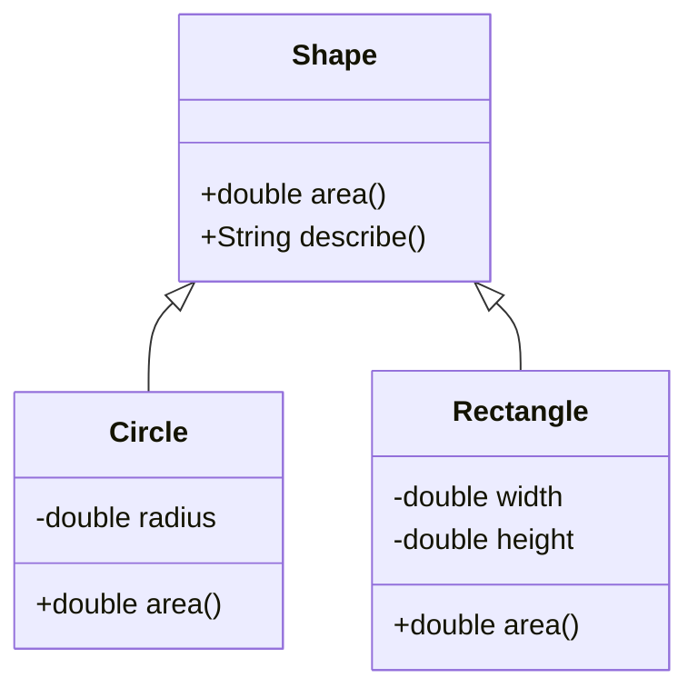

<Callout type="info">
  **이번 문서의 목표:** 이 문서를 다 읽으면 상속 관계에 있는 클래스들의 생성자 호출 순서와 필드 초기화 순서를 정확히 추적할 수 있고, 오버라이딩된 메서드가 있는 코드에서 어떤 메서드가 실제로 실행되는지 동적 바인딩 원리로 설명할 수 있으며, 독학사 4단계에서 자주 나오는 다형성 실행 결과 문제를 변수 값 표로 풀 수 있다.
</Callout>

## 왜 이 편이 필요한가

09편에서 클래스·객체·생성자·static을 다뤘다. 이 편은 여기에 **상속**(inheritance, 이미 만들어진 클래스의 필드와 메서드를 다른 클래스가 물려받아 재사용하는 것)을 더한다. 상속은 독학사 4단계 통합프로그래밍에서 단순 정의보다 **코드를 주고 출력 결과를 맞히는 문제**로 훨씬 많이 나오는 영역이다. 왜냐하면 상속이 걸리는 순간 "생성자가 어떤 순서로 실행되는가", "어떤 메서드가 실제로 호출되는가" 같은, 눈으로 코드만 봐서는 바로 답이 안 나오는 질문들이 생기기 때문이다. 이 편은 정의를 짧게 정리한 뒤 대부분의 분량을 실행 추적 연습에 쓴다.

> **쉽게 말하면:** 상속은 "이미 있는 클래스를 확장해서 새 클래스를 만드는 것"이고, 오버라이딩은 "물려받은 동작을 자식 클래스가 자기 방식대로 다시 정의하는 것"이다. 다형성은 이 둘이 합쳐져서 "같은 코드가 실제 객체 종류에 따라 다르게 동작하는" 현상을 말한다.

## 상속의 기본 문법과 생성자 호출 순서

```java
class Animal {
    String name;

    Animal(String name) {
        this.name = name;
        System.out.println("Animal 생성자 실행: " + name);
    }

    void makeSound() {
        System.out.println(name + "이(가) 소리를 낸다.");
    }
}

class Dog extends Animal {
    Dog(String name) {
        super(name);
        System.out.println("Dog 생성자 실행: " + name);
    }
}

public class Main {
    public static void main(String[] args) {
        Dog d = new Dog("바둑이");
    }
}
```

```text
Animal 생성자 실행: 바둑이
Dog 생성자 실행: 바둑이
```

`class Dog extends Animal`에서 `extends`(익스텐즈, "확장한다"는 뜻으로 상속 관계를 선언하는 키워드)는 `Dog`가 `Animal`의 필드와 메서드를 물려받는다는 것을 나타낸다. `Dog` 생성자 안의 `super(name)`(수퍼, 부모 클래스를 가리키는 키워드)는 **부모 클래스의 생성자를 호출**한다. 여기서 실행 순서가 중요하다.

<Steps>
1. `new Dog("바둑이")`가 호출되면 먼저 `Dog` 생성자로 들어간다.
2. `Dog` 생성자의 첫 줄인 `super(name)`이 실행되며 제어가 `Animal` 생성자로 넘어간다.
3. `Animal` 생성자가 완전히 끝날 때까지 실행된 다음, 다시 `Dog` 생성자로 돌아온다.
4. `Dog` 생성자의 나머지 부분이 실행된다.
</Steps>

즉 **부모 생성자가 항상 자식 생성자보다 먼저 완전히 끝난다.** `super(...)`를 명시적으로 쓰지 않아도, 부모 클래스에 매개변수 없는 생성자가 있다면 컴파일러가 자식 생성자의 첫 줄에 `super()`를 **자동으로** 추가해 준다. 하지만 부모 클래스에 매개변수 없는 생성자가 없다면(위 `Animal`처럼 `Animal(String name)`만 있다면), 자식 생성자에서 반드시 명시적으로 `super(적절한 인자)`를 호출해야 하며, 그렇지 않으면 컴파일 오류가 발생한다.

> **자주 틀리는 점:** `super(...)`도 09편의 `this(...)`처럼 반드시 생성자의 **첫 줄**에만 올 수 있다. 그리고 한 생성자 안에 `this(...)`와 `super(...)`를 동시에 쓸 수는 없다 — 어느 쪽이든 첫 줄은 하나뿐이기 때문이다.

## 오버라이딩의 규칙

**오버라이딩**(overriding)은 부모 클래스가 정의한 메서드를 자식 클래스가 자신의 상황에 맞게 **다시 정의**하는 것이다. 09편에서 다루지 않은 새로운 종류의 재정의이므로, 이름이 비슷한 **오버로딩**(overloading, 같은 이름이지만 매개변수 목록이 다른 메서드를 여러 개 두는 것)과 정확히 구분해야 한다.

```java
class Animal {
    String name;

    Animal(String name) {
        this.name = name;
    }

    String makeSound() {
        return name + "이(가) 소리를 낸다.";
    }
}

class Dog extends Animal {
    Dog(String name) {
        super(name);
    }

    @Override
    String makeSound() {
        return name + "이(가) 멍멍 짖는다.";
    }
}
```

`Dog`의 `makeSound`가 `Animal`의 `makeSound`를 오버라이딩했다고 말하려면 다음 조건을 모두 만족해야 한다.

1. **메서드 이름이 같아야 한다.**
2. **매개변수 목록(개수·타입·순서)이 완전히 같아야 한다.** 하나라도 다르면 오버라이딩이 아니라 새 메서드를 하나 더 만든 것(우연히 오버로딩된 것)이다.
3. **반환 타입이 같거나, 공변 반환 타입**(covariant return type, 부모 메서드의 반환 타입의 하위 클래스로 좁혀서 반환하는 것)이어야 한다.
4. **접근 제어자를 부모보다 좁게 줄일 수 없다.** `protected`를 `private`로 좁히면 컴파일 오류다.
5. `static` 메서드, `private` 메서드, `final`(파이널, 더 이상 변경·상속·재정의할 수 없음을 뜻하는 키워드) 메서드는 오버라이딩할 수 없다.

| 구분 | 오버로딩(overloading) | 오버라이딩(overriding) |
|---|---|---|
| 관계 | 같은 클래스 안 | 부모-자식 상속 관계 |
| 매개변수 목록 | 반드시 달라야 함 | 반드시 같아야 함 |
| 바인딩 시점 | 컴파일 시점(정적 바인딩) | 실행 시점(동적 바인딩) |
| 결정 기준 | 참조 변수의 선언 타입과 인자 타입 | 실제로 생성된 객체의 타입 |
| 접근 제어자 | 제약 없음 | 부모보다 좁힐 수 없음 |

> **자주 틀리는 점:** "오버라이딩한 메서드는 부모보다 접근 범위를 넓힐 수만 있다"를 반대로 외워서 `protected`를 `private`로 좁혀도 된다고 착각하는 보기가 자주 나온다. 방향을 "좁히기는 금지, 넓히기는 허용"으로 정확히 기억해야 한다.

## 업캐스팅과 다운캐스팅

상속 관계에서는 자식 클래스의 객체를 부모 타입의 참조 변수에 담을 수 있다. 이를 **업캐스팅**(upcasting)이라 한다.

```java
Animal a = new Dog("바둑이");
```

`a`의 **선언 타입**(참조 변수의 타입)은 `Animal`이지만, `a`가 실제로 가리키는 **객체의 실제 타입**(런타임 타입)은 `Dog`다. 이 둘이 다를 수 있다는 것이 다형성의 출발점이다. 업캐스팅은 "Dog는 Animal이다"라는 is-a 관계가 성립하므로 자동으로 일어난다.

반대로 부모 타입 참조를 다시 자식 타입으로 되돌리는 것을 **다운캐스팅**(downcasting)이라 하며, 반드시 명시적으로 타입을 적어야 한다.

```java
Animal a = new Dog("바둑이");
Dog d = (Dog) a;

if (a instanceof Dog) {
    Dog d2 = (Dog) a;
    System.out.println("다운캐스팅 성공");
}
```

다운캐스팅은 `a`가 실제로 `Dog` 객체를 가리키고 있어야만 성공하고, 실제로는 다른 자식 클래스(예를 들어 `Cat`)의 객체였다면 `ClassCastException`(클래스 형변환 예외)이 실행 중에 발생한다. 그래서 다운캐스팅 전에는 `instanceof`(인스턴스오브, 왼쪽 참조가 실제로 오른쪽 타입의 객체를 가리키는지 확인하는 연산자) 연산자로 확인하는 것이 안전한 관례다.

## 동적 바인딩의 동작 원리

오버라이딩과 업캐스팅을 합치면, 시험에 가장 많이 나오는 형태의 코드가 만들어진다.

```java
class Animal {
    String makeSound() {
        return "동물이 소리를 낸다.";
    }
}

class Dog extends Animal {
    @Override
    String makeSound() {
        return "멍멍!";
    }
}

class Cat extends Animal {
    @Override
    String makeSound() {
        return "야옹!";
    }
}

public class Main {
    public static void main(String[] args) {
        Animal a1 = new Dog();
        Animal a2 = new Cat();
        System.out.println(a1.makeSound());
        System.out.println(a2.makeSound());
    }
}
```

```text
멍멍!
야옹!
```

`a1`, `a2`는 둘 다 **선언 타입이 Animal**이지만, 실행 결과는 각각의 **실제 타입**(런타임 타입)에 따른 메서드가 출력된다. 이것이 **동적 바인딩**(dynamic binding, 프로그램이 실제로 돌아가는 중에 호출할 메서드를 결정하는 방식)이다.

| 변수 | 선언 타입 | 실제 타입(런타임) | `makeSound()` 호출 시 실행되는 메서드 |
|---|---|---|---|
| `a1` | `Animal` | `Dog` | `Dog.makeSound()` |
| `a2` | `Animal` | `Cat` | `Cat.makeSound()` |

컴파일러는 `a1`의 선언 타입인 `Animal`을 보고 "`Animal`(또는 그 자손)에 `makeSound()`가 있는가"만 확인한다. 어떤 메서드 몸체가 실행될지는 실행 시점에 JVM이 `a1`이 실제로 가리키는 객체의 타입을 보고 결정한다.

## 필드는 동적 바인딩되지 않는다

독학사 시험에서 가장 잘 노리는 함정이다. **메서드는 동적 바인딩되지만, 필드는 정적 바인딩**된다. 즉 필드 접근은 참조 변수의 **선언 타입**을 기준으로 결정된다.

```java
class Animal {
    String kind = "동물";

    String makeSound() {
        return "동물이 소리를 낸다.";
    }
}

class Dog extends Animal {
    String kind = "개";

    @Override
    String makeSound() {
        return "멍멍!";
    }
}

public class Main {
    public static void main(String[] args) {
        Animal a = new Dog();
        System.out.println(a.kind);
        System.out.println(a.makeSound());
    }
}
```

```text
동물
멍멍!
```

`a.kind`는 `a`의 선언 타입인 `Animal`의 `kind`를 그대로 읽어서 "동물"이 출력된다. 하지만 `a.makeSound()`는 실제 타입인 `Dog`의 메서드가 실행되어 "멍멍!"이 출력된다.

> **자주 틀리는 점:** 필드도 메서드처럼 자식 클래스의 값을 따라간다고 착각해 "개"가 출력될 것이라 예상하는 경우가 많다. **필드는 오버라이딩되지 않는다.** 자식 클래스가 부모와 같은 이름의 필드를 선언하면 그것은 부모 필드를 **가리는 것**(shadowing)이며, 어느 필드가 보이는지는 참조 변수의 선언 타입이 결정한다. `static` 메서드도 같은 원리로 선언 타입 기준(메서드 숨김)이다.

## 실행 결과 추적 문제 — 생성자 안에서 오버라이딩된 메서드 호출

다음은 09편의 필드 초기화 순서와 이 편의 동적 바인딩이 겹치는, 시험 난이도가 높은 유형이다.

```java
class Parent {
    Parent() {
        print();
    }

    void print() {
        System.out.println("Parent.print");
    }
}

class Child extends Parent {
    int value = 10;

    @Override
    void print() {
        System.out.println("Child.print, value = " + value);
    }
}

public class Main {
    public static void main(String[] args) {
        new Child();
    }
}
```

```text
Child.print, value = 0
```

| 단계 | 실행 위치 | 설명 |
|---|---|---|
| 1 | `new Child()` | `Child` 객체 생성 시작. 위에서 다룬 대로 부모 생성자가 먼저 호출된다. |
| 2 | `Parent()` 생성자 실행 | 이 시점에 `Child`의 필드 `value`는 아직 기본값 `0`으로만 초기화된 상태이고, `value = 10`이라는 명시적 초기화는 아직 실행되지 않았다. |
| 3 | `print()` 호출 | `Parent` 생성자 안에서 `this.print()`가 암묵적으로 호출된다. `this`의 실제 타입은 이미 `Child`이므로 동적 바인딩에 따라 `Child.print()`가 실행된다. |
| 4 | `Child.print()` 실행 | `value`를 출력하는데, 아직 `10`으로 초기화되지 않았으므로 기본값인 `0`이 출력된다. |
| 5 | `Child` 생성자의 나머지 부분 실행 | 필드 초기화 `value = 10`이 이 단계에서 비로소 적용된다. |

> **자주 틀리는 점:** "생성자 안에서 오버라이딩 가능한 메서드를 호출하면, 아직 자식 클래스의 필드 초기화가 끝나지 않은 상태에서 실행될 수 있다"는 것이 이 문제의 핵심 함정이다. 독학사 시험에서는 이 위험성 자체를 이해했는지 확인하려고 즐겨 출제한다.

## 다형적 배열과 메서드 목록 순회

여러 자식 클래스의 객체를 부모 타입 배열에 모아 순회하는 코드도 자주 나온다.

```java
class Shape {
    double area() {
        return 0.0;
    }

    String describe() {
        return "도형의 넓이는 " + area() + "이다.";
    }
}

class Circle extends Shape {
    double radius;

    Circle(double radius) {
        this.radius = radius;
    }

    @Override
    double area() {
        return Math.PI * radius * radius;
    }
}

class Rectangle extends Shape {
    double width, height;

    Rectangle(double width, double height) {
        this.width = width;
        this.height = height;
    }

    @Override
    double area() {
        return width * height;
    }
}

public class Main {
    public static void main(String[] args) {
        Shape[] shapes = { new Circle(2.0), new Rectangle(3.0, 4.0) };
        for (Shape s : shapes) {
            System.out.println(s.describe());
        }
    }
}
```

```text
도형의 넓이는 12.566370614359172이다.
도형의 넓이는 12.0이다.
```

`describe()`는 `Shape`에만 정의되어 있고 오버라이딩되지 않았는데도, 그 안에서 부르는 `area()`는 동적 바인딩되어 실제 객체(`Circle` 또는 `Rectangle`)의 `area()`가 실행된다. `Shape` 타입 배열 하나로 서로 다른 도형을 같은 코드로 다룰 수 있는 것이 다형성이 실제로 쓸모 있는 이유다.



이 클래스 다이어그램의 `Shape <|-- Circle`은 UML(Unified Modeling Language, 통합 모델링 언어, 다음 편 이후에 다루는 컴포넌트에서도 재사용되는 표기법)에서 상속 관계를 나타내며, 속이 빈 삼각형 화살표가 자식에서 부모 쪽을 향한다.

## 자주 틀리는 점 정리

- 오버로딩과 오버라이딩의 특징(바인딩 시점, 매개변수 규칙)을 반대로 설명하는 보기가 자주 나온다.
- `static` 메서드는 인스턴스가 아니라 클래스에 속하므로 오버라이딩(동적 바인딩)의 대상이 아니다. 같은 시그니처로 다시 선언하면 메서드 숨김이며 선언 타입 기준으로 호출된다.
- 필드는 항상 선언 타입 기준(정적 바인딩)이며, 메서드처럼 동적 바인딩되지 않는다.
- 생성자에서 호출한 오버라이딩 메서드는 부모가 아니라 항상 실제 객체 타입(가장 자식 쪽) 기준으로 실행된다.
- 다운캐스팅은 실제 타입과 대상 타입이 맞지 않으면 `ClassCastException`이 발생한다.

## 핵심 정리

- 상속 관계에서 객체 생성 시 부모 생성자가 자식 생성자보다 먼저 완전히 실행되며, `super(...)`·`this(...)`는 반드시 생성자의 첫 줄에만 올 수 있다.
- 오버라이딩은 부모-자식 관계에서 같은 시그니처의 메서드를 자식이 다시 정의하는 것이고, 접근 제어자는 좁힐 수 없다.
- 업캐스팅은 자동으로, 다운캐스팅은 명시적 형변환과 `instanceof` 확인을 거쳐 안전하게 수행한다.
- 메서드 호출은 실제 객체 타입(런타임 타입)을 따르는 동적 바인딩이지만, 필드 접근과 static 메서드 호출은 참조 변수의 선언 타입을 따르는 정적 바인딩이다.
- 다형성은 부모 타입 하나로 여러 자식 타입의 객체를 같은 코드로 다룰 수 있게 하며, 배열·컬렉션 순회 코드에서 실용적으로 나타난다.

## 마무리 복습

<Quiz
  questionNumber={1}
  question="상속 관계에서 자식 클래스의 객체를 생성할 때 생성자 실행 순서로 옳은 것은?"
  options={['자식 생성자가 완전히 끝난 뒤 부모 생성자가 실행된다', '부모 생성자가 먼저 완전히 실행된 뒤 자식 생성자의 나머지가 실행된다', '부모와 자식 생성자가 동시에 실행된다', '어느 쪽이 먼저 실행될지는 실행할 때마다 달라진다']}
  correctAnswer={2}
  explanation="자식 생성자의 첫 줄에서 super(...)를 통해 부모 생성자가 호출되며, 부모 생성자가 완전히 끝난 뒤에야 자식 생성자의 나머지 코드가 실행된다."
  optionExplanations={['실행 순서가 반대로 서술되어 있다.', '정답. 부모 생성자가 먼저 완전히 끝난 뒤 자식 생성자의 나머지가 실행된다.', '두 생성자는 순차적으로 실행되며 동시에 실행되지 않는다.', '생성자 호출 순서는 상속 구조에 의해 항상 고정되어 있다.']}
/>

<Quiz
  questionNumber={2}
  question="메서드 오버라이딩이 성립하기 위한 조건으로 옳지 않은 것은?"
  options={['메서드 이름과 매개변수 목록이 부모 메서드와 완전히 같아야 한다', '반환 타입은 부모와 같거나 공변 반환 타입이어야 한다', '접근 제어자는 부모보다 넓히는 것만 허용된다', '접근 제어자는 부모보다 자유롭게 좁힐 수 있다']}
  correctAnswer={4}
  explanation="오버라이딩 시 접근 제어자는 부모보다 넓히는 것은 허용되지만 좁히는 것은 컴파일 오류다."
  optionExplanations={['이름과 매개변수 목록이 완전히 같아야 한다는 것은 오버라이딩의 기본 조건이다.', '반환 타입이 같거나 공변 반환 타입이어야 한다는 것은 옳은 규칙이다.', '접근 제어자를 넓히는 것만 허용된다는 설명은 옳다.', '정답. 접근 제어자를 좁히는 것은 금지되어 있으므로 이 설명이 옳지 않다.']}
/>

<Quiz
  questionNumber={3}
  question="Animal a = new Dog();로 선언하고 a.makeSound()를 호출했을 때(Animal, Dog는 makeSound를 오버라이딩) 실행되는 것은?"
  options={['Animal의 makeSound가 실행된다', 'Dog의 makeSound가 실행된다', '컴파일 오류가 발생한다', 'Animal과 Dog의 makeSound가 모두 실행된다']}
  correctAnswer={2}
  explanation="메서드 호출은 동적 바인딩을 따르므로, 참조 변수의 선언 타입이 Animal이어도 실제 객체의 타입인 Dog의 makeSound가 실행된다."
  optionExplanations={['동적 바인딩에 의해 선언 타입이 아니라 실제 타입의 메서드가 실행되므로 옳지 않다.', '정답. 실제 객체 타입인 Dog를 기준으로 동적 바인딩이 일어난다.', '오버라이딩 조건을 만족한 정상 코드이므로 컴파일 오류가 아니다.', '오버라이딩된 메서드는 실제 타입의 메서드 하나만 실행된다.']}
/>

<Quiz
  questionNumber={4}
  question="참조 변수를 통한 필드 접근과 메서드 호출에 대한 설명으로 옳은 것은?"
  options={['필드와 메서드 모두 실제 객체 타입을 기준으로 결정된다', '필드와 메서드 모두 참조 변수의 선언 타입을 기준으로 결정된다', '메서드 호출은 실제 객체 타입을, 필드 접근은 참조 변수의 선언 타입을 기준으로 결정된다', '필드 접근은 실제 객체 타입을, 메서드 호출은 참조 변수의 선언 타입을 기준으로 결정된다']}
  correctAnswer={3}
  explanation="메서드는 오버라이딩되어 동적 바인딩되므로 실제 객체 타입을 따르지만, 필드는 오버라이딩되지 않고 가려질 뿐이므로 참조 변수의 선언 타입을 따른다."
  optionExplanations={['필드는 동적 바인딩 대상이 아니므로 이 설명은 옳지 않다.', '메서드는 동적 바인딩 대상이므로 이 설명은 옳지 않다.', '정답. 메서드는 동적(실제 타입), 필드는 정적(선언 타입) 바인딩이라는 설명이 정확하다.', '메서드와 필드의 기준이 반대로 서술되어 있다.']}
/>

<Quiz
  questionNumber={5}
  question="Animal a = new Dog();로 선언된 상태에서 (Cat) a로 다운캐스팅을 시도하면 일어나는 일은? (Cat도 Animal의 자식 클래스다)"
  options={['정상적으로 성공하고 Cat 타입 참조 변수가 만들어진다', '컴파일 오류가 발생한다', '실행 중에 ClassCastException이 발생한다', '아무 일도 일어나지 않고 a는 그대로 Dog 객체를 가리킨다']}
  correctAnswer={3}
  explanation="a가 실제로 가리키는 객체는 Dog이므로 Cat으로 다운캐스팅하면 컴파일은 통과하지만 실행 중에 ClassCastException이 발생한다."
  optionExplanations={['실제 타입이 Dog이므로 Cat으로의 다운캐스팅은 실패한다.', 'Cat이 Animal의 자식이므로 문법적으로는 컴파일이 통과한다.', '정답. 실제 객체 타입과 다운캐스팅 대상 타입이 맞지 않아 실행 중 예외가 발생한다.', '다운캐스팅 시도 자체가 실행되므로 아무 일도 일어나지 않는다는 설명은 옳지 않다.']}
/>

<Quiz
  questionNumber={6}
  question="생성자 안에서 오버라이딩 가능한 메서드를 호출하는 코드에 대한 설명으로 옳은 것은?"
  options={['항상 부모 클래스에 정의된 메서드가 실행된다', '자식 클래스의 필드 초기화가 아직 끝나지 않은 상태에서 자식 클래스의 오버라이딩된 메서드가 실행될 수 있다', '컴파일 시점에 오류가 발생하므로 이런 코드는 작성할 수 없다', '이런 코드는 항상 무한 재귀를 일으킨다']}
  correctAnswer={2}
  explanation="부모 생성자가 실행되는 시점에 this의 실제 타입은 이미 자식 클래스이므로 동적 바인딩에 의해 자식의 오버라이딩된 메서드가 실행되지만, 이 시점에는 자식 클래스의 명시적 필드 초기화가 아직 적용되지 않은 상태다."
  optionExplanations={['동적 바인딩에 의해 실제 타입인 자식 클래스의 메서드가 실행되므로 이 설명은 옳지 않다.', '정답. 필드 초기화 순서와 동적 바인딩이 겹치면서 나타나는 현상을 정확히 설명한다.', '문법적으로 오류가 없으므로 컴파일은 정상적으로 통과한다.', '재귀 호출 구조가 아니라면 무한 재귀가 발생하지 않는다.']}
/>

<Quiz
  questionNumber={7}
  question="static 메서드를 자식 클래스에서 부모와 같은 시그니처로 다시 선언했을 때 나타나는 현상은?"
  options={['오버라이딩이며 동적 바인딩이 적용된다', '메서드 숨김이며 참조 변수의 선언 타입을 기준으로 호출된다', '컴파일 오류가 발생한다', '두 메서드가 동시에 실행된다']}
  correctAnswer={2}
  explanation="static 메서드는 인스턴스가 아니라 클래스에 속하므로 동적 바인딩 대상이 아니다. 같은 시그니처로 다시 선언하면 메서드 숨김이 일어나며, 참조 변수의 선언 타입이 어떤 클래스의 static 메서드가 호출되는지 결정한다."
  optionExplanations={['static 메서드는 동적 바인딩 대상이 아니므로 오버라이딩이라는 설명은 옳지 않다.', '정답. 메서드 숨김은 필드 접근과 마찬가지로 선언 타입을 기준으로 결정된다.', '문법적으로 허용되는 코드이므로 컴파일 오류가 아니다.', '호출 시점에는 하나의 메서드만 실행된다.']}
/>

## 참고 자료

- [Oracle Java Tutorials - Inheritance](https://docs.oracle.com/javase/tutorial/java/IandI/subclasses.html) — 상속·생성자 호출 순서에 대한 공식 설명.
- [Oracle Java Tutorials - Polymorphism](https://docs.oracle.com/javase/tutorial/java/IandI/polymorphism.html) — 오버라이딩·다형성·동적 바인딩의 공식 설명.
