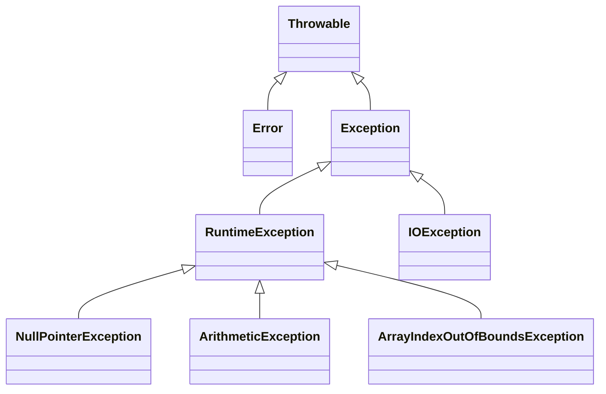

<Callout type="info">
  **이번 문서의 목표:** 이 문서를 다 읽으면 checked 예외와 unchecked 예외를 구분해 언제 throws가 강제되는지 판단할 수 있고, try-catch-finally 블록이 섞인 코드의 실행 순서를 정확히 추적할 수 있으며, List·Set·Map의 차이를 알고 컬렉션을 순회하다가 흔히 발생하는 오류를 코드에서 찾아낼 수 있다.
</Callout>

## 왜 이 편이 필요한가

06~11편에서 C의 파일 입출력, Java의 클래스·상속·인터페이스를 다뤘다. 이 편에서는 이 언어들이 **실행 중 오류를 어떻게 처리하는가**(예외 처리)와, **여러 데이터를 어떻게 묶어서 다루는가**(컬렉션 프레임워크)를 다룬다. 두 주제 모두 독학사 4단계에서 "이 코드를 실행하면 어떤 예외가 발생하는가", "이 컬렉션 순회 코드의 어디가 잘못되었는가"를 묻는 **오류 찾기형 문제**로 자주 나온다.

> **쉽게 말하면:** 예외 처리는 "프로그램이 죽지 않고 문제 상황을 넘기거나 정리할 수 있게 하는 안전장치"이고, 컬렉션은 "배열보다 유연하게 여러 데이터를 담고 다루는 상자"다.

## 예외 클래스 계층

Java의 모든 오류·예외는 `Throwable`(스로어블, "던질 수 있는 것"이라는 뜻으로 예외 계층의 최상위 클래스)을 최상위로 하는 클래스 계층을 이룬다.



이 계층에서 시험에 가장 자주 나오는 구분이 **checked 예외**와 **unchecked 예외**다.

| 구분 | checked 예외 | unchecked 예외 |
|---|---|---|
| 소속 | `Exception`의 자손 중 `RuntimeException`이 아닌 것(예: `IOException`) | `RuntimeException`과 그 자손(예: `NullPointerException`) |
| 컴파일러 검사 | 반드시 처리(`try-catch`)하거나 `throws`로 선언해야 함 | 처리를 강제하지 않음 |
| 발생 원인 | 파일이 없다, 네트워크가 끊겼다 등 **프로그램 로직만으로는 막기 어려운** 외부 상황 | 배열 범위 초과, `null` 참조 등 **코드를 제대로 짰다면 원천적으로 막을 수 있는** 프로그래밍 실수 |
| 08편과의 연결 | 파일 입출력(`FileNotFoundException` 등)이 대표적 | 배열·참조 관련 실수가 대표적 |

`Error`(에러, `OutOfMemoryError` 등 메모리 부족처럼 프로그램이 스스로 복구하기 어려운 심각한 문제)는 일반적으로 애플리케이션 코드에서 잡아서 처리하는 대상이 아니라는 점도 함께 알아 둔다.

> **자주 틀리는 점:** "모든 예외는 반드시 catch하거나 throws해야 한다"는 설명은 틀렸다. **checked 예외만** 컴파일러가 처리를 강제하고, `RuntimeException` 계열의 unchecked 예외는 처리하지 않아도 컴파일이 통과한다(다만 처리하지 않으면 실행 중에 프로그램이 종료될 수 있다).

## try-catch-finally 실행 순서 추적

```java
public class Main {
    public static void main(String[] args) {
        int[] arr = {1, 2, 3};
        try {
            System.out.println("try 시작");
            System.out.println(arr[5]);
            System.out.println("try 끝");
        } catch (ArrayIndexOutOfBoundsException e) {
            System.out.println("catch 실행: " + e.getMessage());
        } finally {
            System.out.println("finally 실행");
        }
        System.out.println("main 계속 진행");
    }
}
```

```text
try 시작
catch 실행: Index 5 out of bounds for length 3
finally 실행
main 계속 진행
```

| 순서 | 실행 위치 | 설명 |
|---|---|---|
| 1 | `"try 시작"` 출력 | 정상 실행. |
| 2 | `arr[5]` 접근 | 배열 길이가 3인데 인덱스 5에 접근해 `ArrayIndexOutOfBoundsException`(배열 범위 초과 예외) 발생. **이 순간 try 블록의 나머지 코드(`"try 끝"` 출력)는 건너뛴다.** |
| 3 | `catch` 블록 실행 | 예외 타입이 일치하므로 `catch` 블록이 실행되어 메시지를 출력한다. |
| 4 | `finally` 블록 실행 | 예외가 발생했든 안 했든, catch로 잡혔든 안 잡혔든 **항상 실행된다.** |
| 5 | `main` 계속 진행 | 예외가 catch에서 잡혀 처리되었으므로 프로그램은 종료되지 않고 다음 줄로 진행한다. |

`finally`(피널리, "결국·마지막에는"이라는 뜻)는 자원 정리(파일 닫기, 연결 종료 등) 코드를 넣는 자리로, **예외 발생 여부와 무관하게 반드시 실행된다**는 것이 핵심이다. 심지어 `try`나 `catch` 블록 안에 `return`이 있어도 `finally`는 그 `return`이 실제로 메서드를 빠져나가기 직전에 끼어들어 실행된다.

```java
public class Main {
    static int test() {
        try {
            return 1;
        } finally {
            System.out.println("finally 실행");
        }
    }

    public static void main(String[] args) {
        int result = test();
        System.out.println("result = " + result);
    }
}
```

```text
finally 실행
result = 1
```

> **자주 틀리는 점:** `try` 블록에 `return`이 있으면 `finally`가 실행되지 않는다고 착각하는 경우가 많다. `finally`는 `return`으로 메서드를 나가기 **직전**에 반드시 끼어들어 실행된다. 다만 `finally` 안에서 다시 `return`을 하면 그 값이 최종 반환값을 **덮어쓴다**(정상적인 설계에서는 잘 쓰지 않는 패턴이지만 시험에는 함정으로 나올 수 있다).

## 다중 catch와 예외 처리 순서

```java
public class Main {
    public static void main(String[] args) {
        try {
            int x = 10 / 0;
        } catch (ArithmeticException e) {
            System.out.println("산술 예외: " + e.getMessage());
        } catch (Exception e) {
            System.out.println("일반 예외: " + e.getMessage());
        }
    }
}
```

```text
산술 예외: / by zero
```

여러 개의 `catch` 블록을 둘 때는 **더 구체적인(자식) 예외 타입을 먼저, 더 일반적인(부모) 예외 타입을 나중에** 배치해야 한다. 위 예제에서 `10 / 0`은 정수 나눗셈에서 0으로 나누어 `ArithmeticException`(산술 예외)을 던지므로, 첫 번째 `catch`가 먼저 이를 확인해 처리한다. 만약 순서를 반대로 `catch (Exception e)`를 먼저 쓰면, `ArithmeticException`도 `Exception`의 자손이므로 그 블록에서 먼저 잡혀버려 두 번째 `catch (ArithmeticException e)`는 **절대 실행될 수 없는 죽은 코드**가 되고, 이는 컴파일 오류(unreachable catch block)로 이어진다.

> **자주 틀리는 점:** 부모 예외 타입의 `catch`를 자식 예외 타입의 `catch`보다 먼저 쓰면 컴파일 오류가 발생한다는 규칙을 "실행은 되지만 항상 첫 catch만 실행된다"로 잘못 아는 경우가 있다. 정확히는 **컴파일 시점에 이미 오류로 걸러진다.**

## checked 예외와 throws

```java
import java.io.FileReader;
import java.io.IOException;

public class Main {
    static void readFile(String path) throws IOException {
        FileReader fr = new FileReader(path);
        fr.close();
    }

    public static void main(String[] args) {
        try {
            readFile("data.txt");
        } catch (IOException e) {
            System.out.println("파일 읽기 오류: " + e.getMessage());
        }
    }
}
```

`FileReader`(08편에서 다룬 파일 입출력과 대응되는 Java 클래스)의 생성자는 파일이 없을 수 있다는 상황을 처리하도록 `IOException`(입출력 예외, checked 예외)을 던질 수 있다고 선언되어 있다. `readFile` 메서드는 이 예외를 직접 처리하지 않고 **자신을 호출한 쪽에 책임을 넘기겠다**는 뜻으로 `throws IOException`을 메서드 선언에 붙인다. 이렇게 하면 `readFile`을 호출하는 `main`이 반드시 `try-catch`로 처리하거나, `main` 자신도 `throws`로 다시 위임해야 한다 — checked 예외는 이렇게 **호출 사슬을 따라 반드시 누군가는 처리해야 한다.**

## 컬렉션 프레임워크 — List, Set, Map

09편에서 다룬 배열은 크기가 고정되어 있고, 중간에 원소를 넣거나 빼는 연산이 불편하다. **컬렉션 프레임워크**(collection framework, 여러 데이터를 담고 다루는 표준 자료구조 모음)는 이 문제를 해결한다.

| 인터페이스 | 순서 유지 | 중복 허용 | 대표 구현 클래스 | 특징 |
|---|---|---|---|---|
| `List` | 유지됨 | 허용 | `ArrayList`, `LinkedList` | 인덱스로 접근 가능, 배열처럼 순서가 있는 목록 |
| `Set` | 유지 안 됨(구현체마다 다름) | 허용 안 함 | `HashSet`, `TreeSet` | 중복 제거가 필요할 때 |
| `Map` | 키 순서는 유지 안 됨(구현체마다 다름) | 키는 중복 불가, 값은 중복 가능 | `HashMap`, `TreeMap` | 키-값 쌍으로 저장, 13–14편의 트리·해시 자료구조와 실제로 연결되는 부분 |

```java
import java.util.ArrayList;
import java.util.List;

public class Main {
    public static void main(String[] args) {
        List<String> names = new ArrayList<>();
        names.add("지훈");
        names.add("미나");
        names.add("지훈");

        System.out.println(names.size());
        for (String name : names) {
            System.out.println(name);
        }
    }
}
```

```text
3
지훈
미나
지훈
```

`List<String>`(리스트, 제네릭 문법으로 "String 타입만 담는 List"라는 뜻. `<>`는 이 타입 목록을 지정하는 자리)은 `ArrayList`로 실제 구현되며, `add`로 넣은 순서가 그대로 유지되고 `"지훈"`이 중복으로 들어가는 것도 허용된다. 반면 같은 데이터를 `Set`에 넣으면 다르게 동작한다.

```java
import java.util.HashSet;
import java.util.Set;

public class Main {
    public static void main(String[] args) {
        Set<String> names = new HashSet<>();
        names.add("지훈");
        names.add("미나");
        names.add("지훈");

        System.out.println(names.size());
    }
}
```

```text
2
```

`HashSet`(해시셋, 14편에서 다루는 해시 자료구조를 활용해 중복을 자동으로 걸러내는 `Set` 구현체)에 `"지훈"`을 두 번 넣어도 실제로 저장되는 것은 한 번뿐이므로 `size()`는 2다. 순서가 유지된다는 보장도 없다 — `HashSet`은 저장 순서가 아니라 해시 값에 따른 내부 순서로 저장된다.

```java
import java.util.HashMap;
import java.util.Map;

public class Main {
    public static void main(String[] args) {
        Map<String, Integer> scores = new HashMap<>();
        scores.put("지훈", 90);
        scores.put("미나", 85);
        scores.put("지훈", 95);

        System.out.println(scores.get("지훈"));
        System.out.println(scores.size());
    }
}
```

```text
95
2
```

`Map<String, Integer>`는 키(`String`)와 값(`Integer`)의 쌍을 저장한다. `"지훈"`이라는 **같은 키**로 `put`을 두 번 하면, 새 값이 이전 값을 **덮어쓴다**(90 대신 95). 그래서 `scores.size()`는 서로 다른 키의 개수인 2다.

> **자주 틀리는 점:** `Map`의 `put`이 항상 새 항목을 추가한다고 착각하기 쉽다. **키가 이미 존재하면 값만 교체되고 항목 수는 늘지 않는다.** 이 점은 `List.add`(항상 새 항목 추가)와 정확히 대비된다.

## 반복자(Iterator)와 순회 중 원소 제거 오류

```java
import java.util.ArrayList;
import java.util.List;

public class Main {
    public static void main(String[] args) {
        List<Integer> numbers = new ArrayList<>();
        numbers.add(1);
        numbers.add(2);
        numbers.add(3);

        for (Integer n : numbers) {
            if (n == 2) {
                numbers.remove(n);
            }
        }
    }
}
```

```text
Exception in thread "main" java.util.ConcurrentModificationException
```

이 코드는 컴파일은 되지만 **실행 중 예외**가 발생한다. `for (Integer n : numbers)`(향상된 for문, 09편에서 다룬 배열 순회와 같은 문법이지만 내부적으로는 `Iterator`를 사용한다)로 컬렉션을 순회하는 중에 그 컬렉션 자체를 `remove`로 수정하면, `Iterator`(이터레이터, 컬렉션을 순서대로 하나씩 꺼내 주는 객체)가 "내가 순회를 시작한 뒤로 컬렉션이 몰래 바뀌었다"는 것을 감지해 `ConcurrentModificationException`(동시 수정 예외)을 던진다. 이 오류를 피하려면 `Iterator`를 직접 사용해 `Iterator`의 `remove()` 메서드로 지워야 한다.

```java
import java.util.ArrayList;
import java.util.Iterator;
import java.util.List;

public class Main {
    public static void main(String[] args) {
        List<Integer> numbers = new ArrayList<>();
        numbers.add(1);
        numbers.add(2);
        numbers.add(3);

        Iterator<Integer> it = numbers.iterator();
        while (it.hasNext()) {
            int n = it.next();
            if (n == 2) {
                it.remove();
            }
        }
        System.out.println(numbers);
    }
}
```

```text
[1, 3]
```

`it.hasNext()`(다음 원소가 있는가), `it.next()`(다음 원소를 꺼내며 커서를 한 칸 전진), `it.remove()`(방금 `next()`로 꺼낸 원소를 안전하게 제거)의 세 메서드로 컬렉션을 순회하며 지운다. `Iterator` 자신이 제공하는 `remove()`는 "지금 컬렉션이 바뀌고 있다"는 사실을 `Iterator` 스스로 알고 있으므로 예외가 발생하지 않는다.

> **자주 틀리는 점:** 향상된 for문(`for-each`) 안에서 컬렉션의 `add`나 `remove`를 직접 호출하면 `ConcurrentModificationException`이 발생할 수 있다는 것이 시험에서 자주 나오는 오류 찾기 포인트다. "컬렉션을 순회하면서 동시에 그 컬렉션의 구조를 바꾸지 마라"는 원칙으로 기억한다.

## NullPointerException 오류 찾기

```java
import java.util.HashMap;
import java.util.Map;

public class Main {
    public static void main(String[] args) {
        Map<String, Integer> scores = new HashMap<>();
        scores.put("지훈", 90);

        Integer score = scores.get("미나");
        int result = score + 10;
        System.out.println(result);
    }
}
```

```text
Exception in thread "main" java.lang.NullPointerException
```

`scores.get("미나")`는 `"미나"`라는 키가 존재하지 않으므로 예외를 던지는 대신 **`null`을 반환**한다(이 점이 배열의 잘못된 인덱스 접근과 다르다 — 배열은 범위를 벗어나면 즉시 예외가 나지만, `Map.get`은 없는 키에 대해 조용히 `null`을 돌려준다). 이 `null`을 `score`라는 `Integer` 변수에 담은 뒤 `score + 10`처럼 산술 연산을 하려는 순간, `null`은 언박싱(unboxing, `Integer` 같은 객체 타입을 `int` 같은 기본 타입으로 자동 변환하는 것)될 수 없으므로 `NullPointerException`이 발생한다.

> **자주 틀리는 점:** `Map.get`이 없는 키에 대해 예외를 던진다고 착각하는 경우가 많다. **`Map.get`은 없는 키에 대해 예외 없이 `null`을 반환한다.** 문제는 그 `null`을 검증 없이 바로 사용할 때 발생한다. 안전하게 처리하려면 `containsKey`로 미리 존재 여부를 확인하거나, `getOrDefault`로 기본값을 지정해야 한다.

## 자주 틀리는 점 정리

- checked 예외만 컴파일러가 처리를 강제하고, `RuntimeException` 계열의 unchecked 예외는 강제하지 않는다.
- `finally`는 `try`나 `catch`에 `return`이 있어도 메서드를 빠져나가기 직전에 반드시 실행된다.
- 다중 `catch`는 자식 예외를 먼저, 부모 예외를 나중에 배치해야 하며 순서가 반대면 컴파일 오류다.
- `List.add`는 항상 새 항목을 추가하지만, `Map.put`은 같은 키가 있으면 값만 덮어쓰고 항목 수가 늘지 않는다.
- 향상된 for문으로 순회하며 컬렉션을 직접 수정하면 `ConcurrentModificationException`이 발생하며, `Iterator.remove()`로 안전하게 지워야 한다.
- `Map.get`은 없는 키에 예외 없이 `null`을 반환하며, 그 값을 검증 없이 연산에 쓰면 `NullPointerException`이 발생한다.

## 핵심 정리

- Java 예외는 `Throwable` 아래 `Error`와 `Exception`으로 나뉘고, `Exception`은 다시 컴파일러가 처리를 강제하는 checked 예외와 강제하지 않는 unchecked 예외(`RuntimeException` 계열)로 나뉜다.
- `try-catch-finally`에서 예외 발생 시 `try`의 나머지 코드는 건너뛰고 `catch`로 이동하며, `finally`는 예외·`return` 여부와 무관하게 항상 실행된다.
- `List`는 순서 유지·중복 허용, `Set`은 중복 불허, `Map`은 키-값 쌍으로 저장하며 같은 키의 `put`은 값을 덮어쓴다.
- 컬렉션을 순회하며 구조를 바꾸려면 `Iterator`의 `remove()`를 써야 `ConcurrentModificationException`을 피할 수 있다.

## 마무리 복습

<Quiz
  questionNumber={1}
  question="checked 예외와 unchecked 예외에 대한 설명으로 옳은 것은?"
  options={['모든 예외는 반드시 catch하거나 throws로 선언해야 한다', 'checked 예외만 컴파일러가 처리를 강제하며, RuntimeException 계열은 강제하지 않는다', 'RuntimeException 계열의 예외만 컴파일러가 처리를 강제한다', 'Error 계열도 반드시 catch해야 컴파일이 통과한다']}
  correctAnswer={2}
  explanation="컴파일러는 checked 예외(IOException 등)에 대해서만 try-catch나 throws를 강제하고, RuntimeException과 그 자손인 unchecked 예외는 처리를 강제하지 않는다."
  optionExplanations={['unchecked 예외는 처리하지 않아도 컴파일이 통과하므로 이 설명은 옳지 않다.', '정답. checked 예외만 컴파일러가 처리를 강제한다는 설명이 정확하다.', 'RuntimeException 계열은 unchecked 예외로 처리가 강제되지 않는다.', 'Error는 일반적으로 애플리케이션에서 처리를 강제하는 대상이 아니다.']}
/>

<Quiz
  questionNumber={2}
  question="try 블록 안에 return 문이 있고 finally 블록도 있을 때의 실행 순서로 옳은 것은?"
  options={['finally는 실행되지 않고 바로 메서드가 종료된다', 'return이 실행된 이후 메서드가 완전히 종료된 다음 finally가 실행된다', 'finally는 return으로 메서드를 빠져나가기 직전에 반드시 실행된다', 'finally는 예외가 발생했을 때만 실행된다']}
  correctAnswer={3}
  explanation="finally 블록은 try나 catch에 return이 있더라도 메서드를 실제로 빠져나가기 직전에 반드시 끼어들어 실행된다."
  optionExplanations={['finally는 return이 있어도 실행되지 않는 것이 아니라 반드시 실행된다.', '메서드가 종료된 다음이 아니라 종료되기 직전에 finally가 실행된다.', '정답. finally는 return 직전에 반드시 실행되는 것이 핵심 규칙이다.', 'finally는 예외 발생 여부와 무관하게 항상 실행된다.']}
/>

<Quiz
  questionNumber={3}
  question="다중 catch 블록을 작성할 때의 규칙으로 옳은 것은?"
  options={['부모 예외 타입을 자식 예외 타입보다 먼저 배치해야 한다', '자식 예외 타입을 부모 예외 타입보다 먼저 배치해야 한다', '순서는 실행 결과에 영향을 주지 않으므로 자유롭게 배치해도 된다', 'catch 블록은 하나만 작성할 수 있다']}
  correctAnswer={2}
  explanation="더 구체적인 자식 예외 타입을 먼저 배치해야 한다. 부모 타입을 먼저 두면 자식 예외도 그 블록에서 먼저 잡혀버려 뒤의 자식 타입 catch 블록이 도달 불가능한 코드가 되어 컴파일 오류가 발생한다."
  optionExplanations={['부모를 먼저 두면 뒤의 자식 catch가 도달 불가능해져 컴파일 오류가 발생한다.', '정답. 자식(구체적) 예외를 먼저, 부모(일반적) 예외를 나중에 배치해야 한다.', '순서가 잘못되면 컴파일 자체가 되지 않으므로 실행 결과에 영향이 없다는 설명은 옳지 않다.', '여러 개의 catch 블록을 연속으로 작성할 수 있다.']}
/>

<Quiz
  questionNumber={4}
  question="List와 Set, Map에 대한 설명으로 옳지 않은 것은?"
  options={['List는 원소의 중복을 허용하고 추가한 순서를 유지한다', 'Set은 중복된 원소를 허용하지 않는다', 'Map은 키의 중복은 허용하지 않지만 값의 중복은 허용한다', 'Map.put은 같은 키로 다시 호출하면 항상 새로운 항목이 추가되어 크기가 늘어난다']}
  correctAnswer={4}
  explanation="Map.put은 이미 존재하는 키로 다시 호출하면 기존 값을 새 값으로 덮어쓸 뿐, 새로운 항목이 추가되지 않아 size()는 늘어나지 않는다."
  optionExplanations={['List가 중복을 허용하고 순서를 유지한다는 설명은 옳다.', 'Set이 중복을 허용하지 않는다는 설명은 옳다.', 'Map의 키는 중복 불가, 값은 중복 가능하다는 설명은 옳다.', '정답. 같은 키로 다시 put하면 값만 덮어쓰고 항목 수는 늘지 않으므로 이 설명이 옳지 않다.']}
/>

<Quiz
  questionNumber={5}
  question="향상된 for문(for-each)으로 List를 순회하는 도중 그 List의 remove 메서드를 직접 호출하면 어떤 일이 일어나는가?"
  options={['정상적으로 해당 원소만 제거되고 순회가 계속된다', 'ConcurrentModificationException이 발생할 수 있다', '컴파일 오류가 발생한다', 'List의 모든 원소가 자동으로 제거된다']}
  correctAnswer={2}
  explanation="순회 중인 컬렉션을 컬렉션 자신의 remove로 직접 수정하면 Iterator가 구조 변경을 감지해 ConcurrentModificationException을 던진다. 안전하게 지우려면 Iterator의 remove()를 사용해야 한다."
  optionExplanations={['컬렉션의 remove를 직접 호출하면 예외가 발생할 수 있어 항상 정상적으로 동작하지는 않는다.', '정답. 순회 중 컬렉션 구조를 직접 바꾸면 ConcurrentModificationException이 발생할 수 있다.', '이 코드는 문법적으로는 문제가 없어 컴파일은 통과한다.', '모든 원소가 자동으로 제거되는 동작은 존재하지 않는다.']}
/>

<Quiz
  questionNumber={6}
  question="HashMap에서 존재하지 않는 키로 get을 호출했을 때의 동작으로 옳은 것은?"
  options={['NoSuchElementException이 즉시 발생한다', '예외 없이 null을 반환한다', '자동으로 기본값 0을 반환한다', '컴파일 오류가 발생한다']}
  correctAnswer={2}
  explanation="Map.get은 키가 존재하지 않으면 예외를 던지지 않고 null을 반환한다. 이 null을 검증 없이 그대로 산술 연산 등에 사용하면 그 순간 NullPointerException이 발생할 수 있다."
  optionExplanations={['get 자체는 예외를 던지지 않고 null을 반환한다.', '정답. 존재하지 않는 키에 대한 get은 null을 반환한다.', '기본값을 자동으로 반환하지 않으며, 기본값이 필요하면 getOrDefault를 사용해야 한다.', '문법적으로 문제가 없으므로 컴파일 오류가 아니다.']}
/>

<Quiz
  questionNumber={7}
  question="checked 예외를 던질 수 있는 메서드를 호출하는 코드를 작성할 때 취할 수 있는 방법으로 옳지 않은 것은?"
  options={['try-catch로 그 예외를 직접 처리한다', '메서드 선언에 throws를 붙여 호출한 쪽으로 처리를 위임한다', '아무 처리도 하지 않고 그대로 두어도 컴파일이 정상적으로 통과한다', '상위 호출자가 다시 throws로 위임하는 방식으로 호출 사슬을 따라 전달한다']}
  correctAnswer={3}
  explanation="checked 예외는 컴파일러가 처리를 강제하므로, try-catch로 처리하거나 throws로 위임하지 않으면 컴파일 오류가 발생한다."
  optionExplanations={['try-catch로 직접 처리하는 것은 checked 예외에 대한 올바른 대응 방법이다.', 'throws로 호출한 쪽에 위임하는 것도 올바른 대응 방법이다.', '정답. checked 예외는 아무 처리 없이 두면 컴파일 오류가 발생하므로 이 설명이 옳지 않다.', '호출 사슬을 따라 throws로 계속 위임하는 것은 가능한 방식이다.']}
/>

## 참고 자료

- [Oracle Java Tutorials - Exceptions](https://docs.oracle.com/javase/tutorial/essential/exceptions/index.html) — 예외 계층·try-catch-finally·throws의 공식 설명.
- [Oracle Java Tutorials - Collections Framework Overview](https://docs.oracle.com/javase/tutorial/collections/intro/index.html) — List·Set·Map과 Iterator의 공식 설명.
