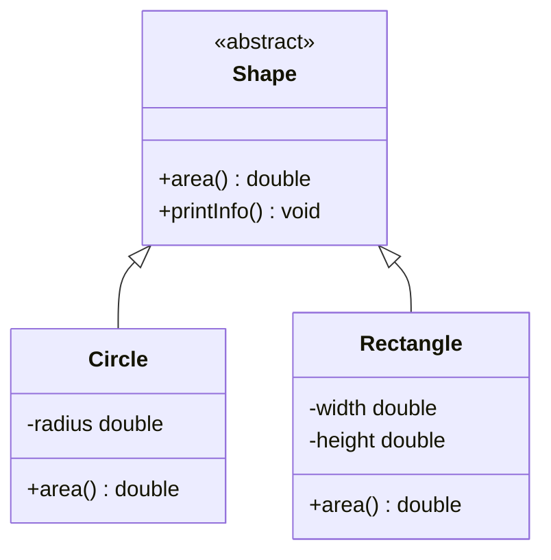

<Callout type="info">
  **이번 문서의 목표:** 이 문서를 다 읽으면 추상 클래스와 인터페이스를 각각 언제 써야 하는지 판단할 수 있고, 두 방식이 섞인 코드의 컴파일 가능 여부와 실행 결과를 판별할 수 있으며, 캡슐화 원칙을 어긴 설계를 코드에서 찾아낼 수 있다.
</Callout>

## 왜 이 편이 필요한가

10편에서 상속과 오버라이딩, 동적 바인딩을 다뤘다. 이 편은 상속의 특수한 두 형태인 **추상 클래스**(abstract class)와 **인터페이스**(interface)를 다룬다. 두 개념 모두 "구체적인 구현을 강제하지 않고 규격만 정의한다"는 점에서 비슷해 보이지만, 언제 어떤 것을 써야 하는지, 문법상 무엇이 다른지를 정확히 구분하는 문제가 독학사 4단계에서 꾸준히 나온다. 이 편의 뒷부분에서는 캡슐화·정보 은닉을 설계 관점에서 다시 짚어, "어떤 설계가 객체지향 원칙에 맞는가"를 판단하는 **설계형 문제**까지 대비한다.

> **쉽게 말하면:** 추상 클래스는 "일부는 이미 만들어 놓고 일부만 자식에게 채우게 하는 미완성 설계도"이고, 인터페이스는 "무엇을 할 수 있어야 하는지 약속만 정해 놓은 계약서"다.

## 추상 클래스와 추상 메서드

**추상 클래스**는 `abstract` 키워드로 선언하며, 그 자체로는 **객체를 만들 수 없다.** 일반 메서드와 함께 **추상 메서드**(abstract method, 몸체 `{}` 없이 선언부만 있고 자식 클래스가 반드시 구현해야 하는 메서드)를 가질 수 있다.

```java
abstract class Shape {
    String name;

    Shape(String name) {
        this.name = name;
    }

    abstract double area();

    void printArea() {
        System.out.println(name + "의 넓이: " + area());
    }
}

class Circle extends Shape {
    double radius;

    Circle(double radius) {
        super("원");
        this.radius = radius;
    }

    @Override
    double area() {
        return Math.PI * radius * radius;
    }
}

public class Main {
    public static void main(String[] args) {
        Circle c = new Circle(3.0);
        c.printArea();
    }
}
```

```text
원의 넓이: 28.274333882308138
```

`Shape shape = new Shape("도형");`처럼 추상 클래스 자체의 객체는 만들 수 없다 — 컴파일 오류가 발생한다. 추상 클래스는 오직 **상속의 부모로만** 쓰인다. `area()`는 추상 메서드이므로 `Shape`는 그 계산 방법을 모르지만, `printArea()`는 일반 메서드이므로 `Shape` 안에 이미 구현되어 있다. 이 `printArea()` 안에서 `area()`를 부르는 것은 10편에서 다룬 동적 바인딩 그대로다 — `Circle` 객체를 통해 호출되었으므로 `Circle.area()`가 실행된다.

`Circle`은 `Shape`를 상속받으면서 `area()`를 반드시 구현해야 한다. **추상 메서드를 하나라도 구현하지 않은 자식 클래스는 그 자신도 `abstract`로 선언해야 하며**, 그렇지 않으면 컴파일 오류가 발생한다.

> **자주 틀리는 점:** "추상 클래스는 생성자를 가질 수 없다"고 착각하는 경우가 많다. 위 예제처럼 추상 클래스도 생성자를 가질 수 있으며, 그 생성자는 자식 클래스가 `super(...)`로 호출한다. 다만 추상 클래스 **자신의 객체**는 `new`로 직접 만들 수 없을 뿐이다.

## 인터페이스

**인터페이스**는 `interface` 키워드로 선언하며, 원래는 **상수와 추상 메서드만** 가질 수 있는 순수한 "계약서" 역할을 한다(Java 8 이후 `default` 메서드·`static` 메서드가 추가되었지만, 독학사 시험 범위에서는 전통적인 형태를 중심으로 이해하면 충분하다).

```java
interface Flyable {
    void fly();
}

interface Swimmable {
    void swim();
}

class Duck implements Flyable, Swimmable {
    @Override
    public void fly() {
        System.out.println("오리가 날아간다.");
    }

    @Override
    public void swim() {
        System.out.println("오리가 헤엄친다.");
    }
}

public class Main {
    public static void main(String[] args) {
        Duck d = new Duck();
        d.fly();
        d.swim();
    }
}
```

```text
오리가 날아간다.
오리가 헤엄친다.
```

`implements`(임플리먼츠, "구현한다"는 뜻으로 인터페이스를 실제로 구현할 때 쓰는 키워드)는 `extends`와 다르다. Java의 클래스는 **오직 하나의 클래스만 상속**(단일 상속)할 수 있지만, **인터페이스는 여러 개를 동시에 구현**할 수 있다. 위 예제에서 `Duck`이 `Flyable`과 `Swimmable`을 동시에 구현하는 것이 그 예다.

> **자주 틀리는 점:** "Java는 다중 상속을 지원한다"는 보기가 나오면 틀린 설명이다. Java는 클래스의 다중 상속(`extends`)은 지원하지 않지만, 인터페이스의 다중 구현(`implements`)은 지원한다. 이 둘을 혼동하면 안 된다. 다중 상속을 금지한 이유는 두 부모 클래스가 같은 이름의 메서드를 서로 다르게 구현하고 있을 때 어느 쪽을 물려받을지 모호해지는 "다이아몬드 문제"를 피하기 위해서다. 인터페이스는 (전통적인 형태에서는) 구현 코드가 없는 선언만 가지므로 이런 모호함이 생기지 않는다.

인터페이스를 구현하는 메서드는 반드시 `public`으로 선언해야 한다. 인터페이스의 메서드는 기본적으로 `public abstract`로 간주되기 때문에, 구현할 때 접근 범위를 좁히면 10편에서 다룬 "오버라이딩 시 접근 제어자를 좁힐 수 없다"는 규칙에 걸려 컴파일 오류가 난다.

## 추상 클래스와 인터페이스 비교

| 구분 | 추상 클래스 | 인터페이스 |
|---|---|---|
| 선언 키워드 | `abstract class` | `interface` |
| 구현 키워드 | `extends`(단일 상속만 가능) | `implements`(다중 구현 가능) |
| 필드 | 일반 필드 가능 | 기본적으로 `public static final`(상수)만 가능 |
| 일반 메서드(구현 있음) | 가질 수 있음 | 전통적으로는 불가(추상 메서드만) |
| 생성자 | 가질 수 있음(자식이 super로 호출) | 가질 수 없음 |
| 객체 생성 | 직접 생성 불가 | 직접 생성 불가 |
| 목적 | 관련 있는 클래스들이 **코드를 공유**하며 일부만 다르게 구현 | 관련 없는 클래스들도 **같은 행동 규격**을 약속 |

이 표에서 가장 중요한 구분 기준은 "관계의 성격"이다. `Circle`, `Rectangle`처럼 **본질적으로 같은 종류**(둘 다 "도형")이고 공통 코드를 공유하고 싶다면 추상 클래스가 적합하다. 반면 `Duck`(동물), `Airplane`(기계)처럼 **서로 완전히 다른 종류**의 클래스인데 "날 수 있다"는 행동만 공통으로 갖게 하고 싶다면 인터페이스가 적합하다.

> **자주 틀리는 점:** "인터페이스는 필드를 가질 수 없다"고 단정하면 틀린다. 정확히는 인터페이스의 필드는 자동으로 `public static final`(공개·클래스 공유·변경 불가)이 되어, 사실상 **상수만** 선언할 수 있다는 뜻이다. 인스턴스마다 다른 값을 가지는 일반 필드는 가질 수 없다.

## 캡슐화 원칙을 위반한 설계 찾기

09편에서 캡슐화를 "필드는 `private`로 숨기고 `public` 메서드로만 검증된 접근을 허용하는 것"으로 정리했다. 독학사 4단계에서는 **주어진 클래스 설계가 이 원칙을 지켰는지 판단하는 설계형 문제**가 나온다.

```java
class BankAccount {
    public int balance;

    public BankAccount(int balance) {
        this.balance = balance;
    }
}

public class Main {
    public static void main(String[] args) {
        BankAccount acc = new BankAccount(10000);
        acc.balance = -5000;
        System.out.println(acc.balance);
    }
}
```

```text
-5000
```

이 설계는 캡슐화 원칙을 위반한다. `balance`(잔액)가 `public`이므로 외부 코드가 검증 없이 잔액을 음수로 만들 수 있다. 은행 계좌의 잔액이 음수가 되는 것은 현실적으로 말이 안 되는 상태인데, 이 클래스는 그런 잘못된 상태를 막을 방법이 없다. 다음과 같이 고쳐야 한다.

```java
class BankAccount {
    private int balance;

    public BankAccount(int balance) {
        this.balance = balance;
    }

    public int getBalance() {
        return balance;
    }

    public void withdraw(int amount) {
        if (amount < 0 || amount > balance) {
            System.out.println("출금할 수 없는 금액입니다.");
            return;
        }
        balance -= amount;
    }
}
```

`balance`를 `private`로 숨기고, 잔액을 바꾸는 유일한 통로를 `withdraw`(출금) 메서드 하나로 좁힌 뒤 그 안에서 검증한다. 이렇게 하면 `balance`가 음수가 되는 경로 자체를 원천적으로 차단할 수 있다.

> **쉽게 말하면:** 캡슐화가 잘 된 클래스는 "이 객체의 상태가 이상해지는 경로가 있는가?"라는 질문에 "없다"고 답할 수 있는 클래스다.

## 설계형 문제 — 추상 클래스로 리팩터링하기

다음은 코드 중복이 있는 설계를 추상 클래스로 개선하는 유형이다.

```java
class Circle {
    double radius;
    Circle(double radius) { this.radius = radius; }
    double area() { return Math.PI * radius * radius; }
    void printInfo() { System.out.println("넓이: " + area()); }
}

class Rectangle {
    double width, height;
    Rectangle(double width, double height) { this.width = width; this.height = height; }
    double area() { return width * height; }
    void printInfo() { System.out.println("넓이: " + area()); }
}
```

두 클래스는 `area()`의 계산 방법만 다르고 `printInfo()`는 완전히 동일한 코드가 중복되어 있다. 이런 코드는 다음과 같이 추상 클래스로 리팩터링(refactoring, 겉으로 드러나는 동작은 바꾸지 않으면서 내부 구조를 개선하는 것)하는 것이 객체지향 설계 원칙에 맞는다.



`printInfo()`처럼 **모든 자식이 똑같이 쓰는 코드**는 부모 클래스(추상 클래스)로 끌어올려 한 곳에서만 관리하고, `area()`처럼 **자식마다 달라야 하는 부분**만 추상 메서드로 남겨 각 자식이 구현하게 한다. 이렇게 하면 새로운 도형(예를 들어 `Triangle`)을 추가할 때 `printInfo()`를 다시 작성할 필요 없이 `area()`만 구현하면 되므로, 코드 중복이 사라지고 유지보수가 쉬워진다.

## 자주 틀리는 점 정리

- 추상 클래스도 생성자를 가질 수 있다. 다만 추상 클래스 자신의 객체는 `new`로 만들 수 없다.
- Java는 클래스의 다중 상속은 지원하지 않지만, 인터페이스의 다중 구현은 지원한다.
- 인터페이스의 필드는 완전히 금지된 것이 아니라 `public static final` 상수로만 허용된다.
- 인터페이스를 구현하는 메서드는 반드시 `public`으로 선언해야 하며, 좁히면 컴파일 오류다.
- 추상 메서드를 하나라도 구현하지 않은 자식 클래스는 그 자신도 `abstract`로 선언해야 한다.

## 핵심 정리

- 추상 클래스는 관련된 클래스들이 코드를 공유하면서 일부 동작만 다르게 구현하도록 설계할 때, 인터페이스는 관련 없는 클래스들에게 같은 행동 규격을 약속할 때 쓴다.
- 추상 클래스는 단일 상속만, 인터페이스는 다중 구현이 가능하다는 점이 Java의 상속 제약을 보완하는 핵심 차이다.
- 캡슐화 원칙에 맞는 설계는 필드를 `private`로 숨기고, 상태를 바꾸는 유일한 통로를 검증 로직이 있는 메서드로 제한한다.
- 여러 클래스에서 반복되는 공통 코드는 추상 클래스의 일반 메서드로 끌어올리고, 클래스마다 달라지는 부분만 추상 메서드로 남기는 것이 리팩터링의 기본 방향이다.

## 마무리 복습

<Quiz
  questionNumber={1}
  question="추상 클래스에 대한 설명으로 옳지 않은 것은?"
  options={['abstract 키워드로 선언한다', '생성자를 가질 수 있다', '추상 클래스 자신의 객체를 new로 직접 생성할 수 있다', '추상 메서드를 구현하지 않은 자식 클래스는 그 자신도 abstract로 선언해야 한다']}
  correctAnswer={3}
  explanation="추상 클래스는 미완성 설계도이므로 자신의 객체를 직접 생성할 수 없다. 오직 상속의 부모로만 쓰이며, 자식 클래스를 통해서만 객체가 만들어진다."
  optionExplanations={['abstract 키워드로 선언한다는 설명은 옳다.', '추상 클래스도 생성자를 가질 수 있고 자식이 super로 호출한다는 설명은 옳다.', '정답. 추상 클래스는 직접 객체를 생성할 수 없으므로 이 설명이 옳지 않다.', '추상 메서드를 구현하지 않으면 그 클래스도 abstract여야 한다는 설명은 옳다.']}
/>

<Quiz
  questionNumber={2}
  question="Java의 상속·구현에 대한 설명으로 옳은 것은?"
  options={['클래스는 여러 클래스를 동시에 상속할 수 있다', '인터페이스는 하나만 구현할 수 있다', '클래스는 하나만 상속할 수 있지만 인터페이스는 여러 개 구현할 수 있다', '클래스와 인터페이스 모두 다중 상속·다중 구현이 불가능하다']}
  correctAnswer={3}
  explanation="Java는 클래스의 다중 상속을 지원하지 않아 extends는 하나의 클래스에만 쓸 수 있지만, implements로는 여러 인터페이스를 동시에 구현할 수 있다."
  optionExplanations={['Java는 클래스의 다중 상속을 지원하지 않는다.', '인터페이스는 콤마로 여러 개를 나열해 동시에 구현할 수 있다.', '정답. 클래스는 단일 상속, 인터페이스는 다중 구현이 Java의 규칙이다.', '인터페이스의 다중 구현은 가능하므로 이 설명은 옳지 않다.']}
/>

<Quiz
  questionNumber={3}
  question="인터페이스의 필드에 대한 설명으로 옳은 것은?"
  options={['필드를 전혀 선언할 수 없다', '선언한 필드는 자동으로 public static final 상수가 된다', '인스턴스마다 다른 값을 가지는 일반 필드를 자유롭게 선언할 수 있다', 'private 필드만 선언할 수 있다']}
  correctAnswer={2}
  explanation="인터페이스에 선언된 필드는 자동으로 public static final로 처리되어 사실상 상수로만 쓰인다. 인스턴스마다 다른 값을 가지는 일반 필드는 선언할 수 없다."
  optionExplanations={['필드 자체를 선언할 수는 있으나 상수 형태로만 허용된다.', '정답. 인터페이스의 필드는 public static final 상수로 자동 처리된다.', '인터페이스의 필드는 static이므로 인스턴스마다 다른 값을 가질 수 없다.', 'private 필드는 인터페이스의 필드 규칙과 맞지 않는다.']}
/>

<Quiz
  questionNumber={4}
  question="다음 은행 계좌 클래스 설계에서 캡슐화 원칙을 위반하는 부분은 무엇인가? (필드 balance가 public int로 선언되어 있고 이를 검증 없이 직접 대입할 수 있다)"
  options={['생성자에서 balance를 초기화하는 부분', 'balance 필드가 public으로 선언되어 외부에서 검증 없이 직접 수정할 수 있는 부분', '클래스 이름을 BankAccount로 지은 부분', '클래스에 메서드가 하나도 없는 부분']}
  correctAnswer={2}
  explanation="balance가 public이면 외부 코드가 검증 로직을 거치지 않고 잔액을 임의의 값(음수 포함)으로 바꿀 수 있어 객체가 잘못된 상태에 빠질 수 있다. private로 숨기고 검증하는 메서드로만 접근을 허용해야 한다."
  optionExplanations={['생성자에서 초기화하는 것 자체는 캡슐화 위반이 아니다.', '정답. public 필드는 검증 없는 직접 수정을 허용해 캡슐화 원칙을 위반한다.', '클래스 이름 자체는 캡슐화와 관련이 없다.', '메서드 유무 자체보다 필드의 접근 제어자가 문제의 핵심이다.']}
/>

<Quiz
  questionNumber={5}
  question="Circle과 Rectangle 클래스가 area()의 계산 방법만 다르고 printInfo() 코드는 완전히 동일하게 중복되어 있을 때, 가장 적절한 리팩터링 방향은?"
  options={['두 클래스를 완전히 하나로 합쳐 area()도 하나로 통일한다', 'printInfo()를 인터페이스의 default 메서드로만 옮긴다', '공통 코드인 printInfo()는 추상 클래스로 끌어올리고, area()만 추상 메서드로 남겨 각 자식이 구현하게 한다', '두 클래스 모두에 printInfo()를 그대로 두고 중복을 허용한다']}
  correctAnswer={3}
  explanation="모든 자식이 동일하게 쓰는 코드는 추상 클래스의 일반 메서드로 끌어올려 한 곳에서 관리하고, 클래스마다 달라지는 계산만 추상 메서드로 남기는 것이 코드 중복을 없애는 표준적인 리팩터링이다."
  optionExplanations={['area() 계산 방법이 도형마다 다르므로 하나로 통일할 수 없다.', 'default 메서드는 전통적인 인터페이스 형태를 벗어나며, 이 문제의 핵심 해법도 아니다.', '정답. 공통 코드는 추상 클래스로, 달라지는 부분만 추상 메서드로 분리하는 것이 올바른 방향이다.', '중복을 허용하면 새 도형이 추가될 때마다 같은 코드를 반복해서 유지보수가 어려워진다.']}
/>

<Quiz
  questionNumber={6}
  question="인터페이스를 구현하는 메서드의 접근 제어자로 올바른 것은? (전통적인 인터페이스 형태 기준)"
  options={['private로 선언해야 한다', 'protected로 선언해야 한다', 'public으로 선언해야 한다', '접근 제어자를 생략해야 한다']}
  correctAnswer={3}
  explanation="인터페이스의 메서드는 기본적으로 public abstract로 간주되므로, 구현할 때도 public으로 선언해야 한다. 좁히면 오버라이딩의 접근 제어자 규칙을 위반해 컴파일 오류가 난다."
  optionExplanations={['private로 좁히면 접근 제어자를 좁히는 것이 되어 컴파일 오류가 발생한다.', 'protected 역시 public보다 좁으므로 오류가 발생한다.', '정답. 인터페이스 메서드는 public abstract로 간주되므로 구현부도 public이어야 한다.', '접근 제어자를 생략하면 default가 되어 public보다 좁아지므로 오류가 발생한다.']}
/>

## 참고 자료

- [Oracle Java Tutorials - Abstract Methods and Classes](https://docs.oracle.com/javase/tutorial/java/IandI/abstract.html) — 추상 클래스·추상 메서드의 공식 설명.
- [Oracle Java Tutorials - Interfaces](https://docs.oracle.com/javase/tutorial/java/IandI/createinterface.html) — 인터페이스 정의·구현·다중 구현의 공식 설명.
