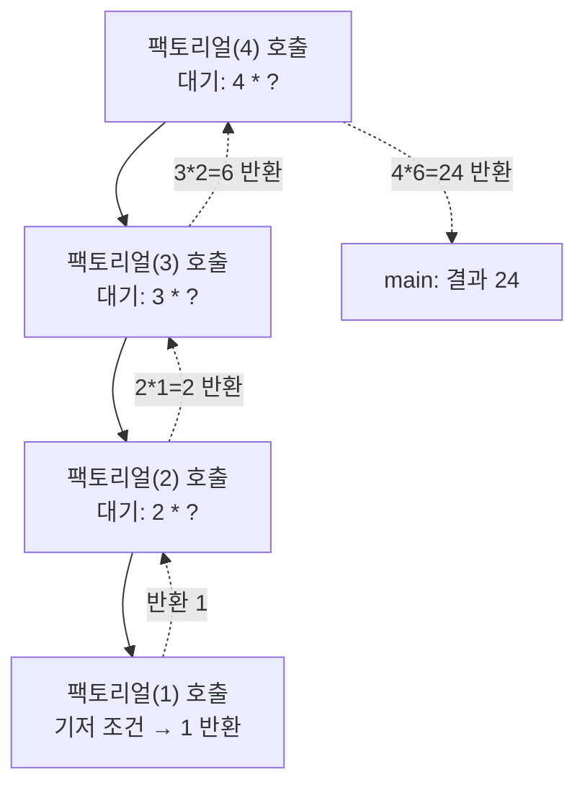
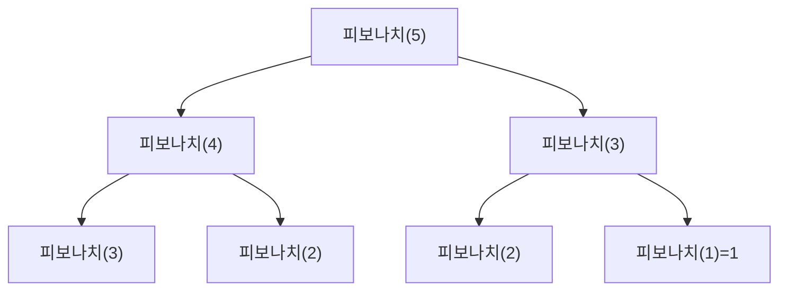

<Callout type="info">
  **이번 문서의 목표:** 이 문서를 다 읽으면 배열 기반 리스트·스택·큐를 C 코드로 직접 구현하고 각 연산의 결과를 한 줄씩 추적할 수 있으며, 재귀 함수가 호출될 때 스택 프레임이 어떻게 쌓이고 풀리는지 그림으로 설명할 수 있다. 또한 같은 스택 구조를 C(절차형)와 Java(객체지향)로 각각 구현했을 때 무엇이 같고 무엇이 다른지 비교할 수 있다.
</Callout>

## 왜 다시 자료구조를 구현하는가

04편에서 리스트·스택·큐·트리·그래프가 무엇인지 개념 지도를 그렸다. 그런데 독학사 4단계 통합프로그래밍은 "스택이 무엇인지 아는가"가 아니라 "**이 스택 코드를 실행하면 화면에 무엇이 찍히는가**", "**이 코드에서 배열 인덱스가 몇 번 틀렸는가**"를 묻는다. 즉 개념을 코드 수준으로 끌어내려 한 줄씩 손으로 따라갈 수 있어야 실제 시험 문항(코드 실행 결과 예측, 빈칸 채우기, 오류 찾기)을 풀 수 있다.

이 편에서는 06~08편에서 정리한 C의 배열·포인터·구조체·동적 할당 지식을 총동원해 **배열 기반 리스트, 스택, 큐**를 처음부터 구현하고, 뒤이어 **재귀**(recursion, 함수가 자기 자신을 다시 호출하는 것)가 내부적으로 스택과 똑같은 구조(스택 프레임)를 쓴다는 점을 확인한다.

> **쉽게 말하면:** 04편이 "자료구조라는 도구의 사용설명서"였다면, 이 편은 그 도구를 실제로 만들어 보고 부품(배열 인덱스, 포인터)이 하나라도 잘못 끼워지면 어떤 결과가 나오는지 직접 눈으로 확인하는 시간이다.

## 배열 기반 리스트: 삽입·삭제와 원소 밀기

**배열 기반 리스트**(array-based list)는 고정 크기 배열에 원소를 순서대로 채워 넣고, 실제로 채워진 원소 개수를 별도 변수(`size`)로 관리하는 구조다. 연결리스트(07편)와 달리 포인터로 노드를 연결하지 않고, 인덱스만으로 다음 원소 위치를 계산한다.

```c
#include <stdio.h>

#define MAX 5

typedef struct {
    int data[MAX];
    int size;
} 배열리스트;

void 초기화(배열리스트 *lst) {
    lst->size = 0;
}

int 끝에추가(배열리스트 *lst, int value) {
    if (lst->size >= MAX) return 0;
    lst->data[lst->size] = value;
    lst->size = lst->size + 1;
    return 1;
}

int 중간에삽입(배열리스트 *lst, int index, int value) {
    if (lst->size >= MAX || index < 0 || index > lst->size) return 0;
    for (int i = lst->size; i > index; i--) {
        lst->data[i] = lst->data[i - 1];
    }
    lst->data[index] = value;
    lst->size = lst->size + 1;
    return 1;
}

void 출력(배열리스트 *lst) {
    for (int i = 0; i < lst->size; i++) {
        printf("%d ", lst->data[i]);
    }
    printf("\n");
}

int main(void) {
    배열리스트 lst;
    초기화(&lst);
    끝에추가(&lst, 10);
    끝에추가(&lst, 20);
    끝에추가(&lst, 30);
    출력(&lst);
    중간에삽입(&lst, 1, 99);
    출력(&lst);
    return 0;
}
```

```text
10 20 30
10 99 20 30
```

**한 줄씩 실행 추적**:

| 단계 | 실행 위치 | 배열 상태(size) |
|---|---|---|
| 1 | `초기화(&lst)` | `[]`(size=0) |
| 2 | `끝에추가(10)` | `[10]`(size=1) |
| 3 | `끝에추가(20)` | `[10, 20]`(size=2) |
| 4 | `끝에추가(30)` | `[10, 20, 30]`(size=3) |
| 5 | `중간에삽입(1, 99)` — `i=3`부터 시작해 뒤에서 앞으로 한 칸씩 밀기 | `data[3]=data[2]`→`[10,20,30,30]`, `data[2]=data[1]`→`[10,20,20,30]`, 반복 종료(`i=1`은 조건 `i>index` 거짓) |
| 6 | `data[1] = 99` | `[10, 99, 20, 30]`(size=4) |

`중간에삽입`이 **뒤에서부터 앞으로** 값을 미는 이유가 시험에서 자주 묻는 지점이다. 만약 앞에서부터(`i = index`부터 증가시키며) 밀면, 아직 옮기지 않은 값을 덮어써서 데이터가 사라진다. 배열 기반 삽입·삭제는 이런 "밀기(shift)" 연산 때문에 최악의 경우 O(n)이 걸린다 — 이는 15편에서 복잡도로 다시 정리한다.

> **자주 틀리는 점:** `중간에삽입`에서 `for (int i = lst->size; i > index; i--)`를 `for (int i = index; i < lst->size; i++)`로 잘못 쓰면 앞의 값이 뒤의 값을 그대로 덮어써 원소가 중복되고 마지막 원소가 사라진다. 손코딩 문제에서 이 방향을 반대로 쓰는 오류가 자주 출제된다.

## 스택을 배열로 구현하기

09편에서 배운 스택의 LIFO(Last-In-First-Out, 후입선출) 성질을 C 배열로 직접 구현한다.

```c
#include <stdio.h>

#define MAX 5

typedef struct {
    int data[MAX];
    int top;
} 스택;

void 스택초기화(스택 *s) {
    s->top = -1;
}

int 스택비었나(스택 *s) {
    return s->top == -1;
}

int 스택가득찼나(스택 *s) {
    return s->top == MAX - 1;
}

int push(스택 *s, int value) {
    if (스택가득찼나(s)) {
        printf("오버플로: push(%d) 실패\n", value);
        return 0;
    }
    s->top = s->top + 1;
    s->data[s->top] = value;
    return 1;
}

int pop(스택 *s, int *result) {
    if (스택비었나(s)) {
        printf("언더플로: pop 실패\n");
        return 0;
    }
    *result = s->data[s->top];
    s->top = s->top - 1;
    return 1;
}

int main(void) {
    스택 s;
    int value;
    스택초기화(&s);
    push(&s, 1);
    push(&s, 2);
    push(&s, 3);
    pop(&s, &value);
    printf("pop 결과: %d\n", value);
    printf("top 인덱스: %d\n", s.top);
    return 0;
}
```

```text
pop 결과: 3
top 인덱스: 1
```

`top`을 "가장 최근에 넣은 원소의 인덱스"로 두고 -1을 빈 스택 표시로 쓰는 방식은 09편에서 이미 익힌 규칙이다. 여기서는 `push`·`pop`을 **함수**로, 스택 상태(`data`, `top`)를 **구조체**로 분리했다. 이 분리가 다음 절의 절차형·객체지향 비교에서 핵심 비교 지점이 된다.

## 큐를 배열로 구현하기: 원형 큐

09편에서 다룬 원형 큐(circular queue)를 C로 구현한다. `front`와 `rear` 인덱스를 나머지 연산(`%`)으로 순환시킨다는 점이 핵심이다.

```c
#include <stdio.h>

#define MAX 5

typedef struct {
    int data[MAX];
    int front;
    int rear;
    int count;
} 원형큐;

void 큐초기화(원형큐 *q) {
    q->front = 0;
    q->rear = 0;
    q->count = 0;
}

int enqueue(원형큐 *q, int value) {
    if (q->count == MAX) return 0;
    q->data[q->rear] = value;
    q->rear = (q->rear + 1) % MAX;
    q->count = q->count + 1;
    return 1;
}

int dequeue(원형큐 *q, int *result) {
    if (q->count == 0) return 0;
    *result = q->data[q->front];
    q->front = (q->front + 1) % MAX;
    q->count = q->count - 1;
    return 1;
}

int main(void) {
    원형큐 q;
    int value;
    큐초기화(&q);
    enqueue(&q, 10);
    enqueue(&q, 20);
    enqueue(&q, 30);
    dequeue(&q, &value);
    printf("dequeue 결과: %d\n", value);
    enqueue(&q, 40);
    printf("front=%d, rear=%d, count=%d\n", q.front, q.rear, q.count);
    return 0;
}
```

```text
dequeue 결과: 10
front=1, rear=4, count=3
```

`count` 변수를 별도로 두어 "가득 참"과 "비어 있음"을 `front == rear`만으로 구분하는 모호함을 없앴다는 점에 주목한다. 09편에서 언급한 "칸 하나를 항상 비워 두는" 방식 대신, 이 코드는 **원소 개수 카운터**로 그 문제를 해결하는 두 번째 방식을 보여준다.

## 재귀: 함수가 자기 자신을 부르면 생기는 일

**재귀**(recursion)는 함수 정의 안에서 자기 자신을 다시 호출하는 프로그래밍 기법이다. 04편에서 재귀를 "자기 자신을 더 작은 문제로 쪼개 호출하는 것"이라고 정의했는데, 이 편에서는 그 호출이 메모리에서 실제로 어떤 모양을 만드는지 스택 프레임으로 추적한다.

> **쉽게 말하면:** 재귀는 러시아 인형(마트료시카)과 같다. 큰 인형을 열면 그 안에 작은 인형이, 또 그 안에 더 작은 인형이 들어 있다. 가장 작은 인형(더 이상 쪼갤 수 없는 경우, **기저 조건**)에 도달하면 거기서부터 다시 바깥 인형을 하나씩 닫아가며(반환하며) 빠져나온다.

### 팩토리얼: 가장 단순한 재귀

```c
#include <stdio.h>

int 팩토리얼(int n) {
    if (n <= 1) return 1;
    return n * 팩토리얼(n - 1);
}

int main(void) {
    printf("%d\n", 팩토리얼(4));
    return 0;
}
```

```text
24
```

`n <= 1`이 **기저 조건**(base case, 재귀를 멈추는 조건)이고, `n * 팩토리얼(n - 1)`이 **재귀 단계**(recursive step, 더 작은 문제를 호출하는 부분)다. 기저 조건이 없거나 재귀 단계가 문제를 작게 만들지 못하면(예: `팩토리얼(n)`을 다시 호출) 함수 호출이 끝없이 이어지는 **무한 재귀**가 되어 결국 스택 오버플로로 프로그램이 강제 종료된다.



**한 줄씩 실행 추적**(스택 프레임이 쌓이는 방향을 `push`, 풀리는 방향을 `pop`이라고 생각하면 09편의 스택과 정확히 같은 구조다):

| 단계 | 호출 스택(아래가 먼저 쌓인 프레임) | 동작 |
|---|---|---|
| 1 | `팩토리얼(4)` | `n=4`, 기저 조건 거짓 → `팩토리얼(3)` 호출 대기 |
| 2 | `팩토리얼(4)`, `팩토리얼(3)` | `n=3`, 기저 조건 거짓 → `팩토리얼(2)` 호출 대기 |
| 3 | `팩토리얼(4)`, `팩토리얼(3)`, `팩토리얼(2)` | `n=2`, 기저 조건 거짓 → `팩토리얼(1)` 호출 대기 |
| 4 | ... , `팩토리얼(1)` | `n=1`, 기저 조건 참 → 1 반환, 이 프레임 제거(pop) |
| 5 | ... , `팩토리얼(2)` | `2 * 1 = 2` 반환, 프레임 제거 |
| 6 | ... , `팩토리얼(3)` | `3 * 2 = 6` 반환, 프레임 제거 |
| 7 | `팩토리얼(4)` | `4 * 6 = 24` 반환, 프레임 제거 |
| 8 | (없음) | main이 24를 받아 출력 |

이 표가 09편의 스택 `push`/`pop` 추적표와 구조가 똑같다는 점이 핵심이다. **함수 호출 자체가 시스템이 자동으로 관리하는 스택**(호출 스택, call stack)이며, 재귀는 이 스택에 프레임을 여러 개 쌓았다가 기저 조건부터 역순으로 되감는 과정이다.

### 피보나치: 재귀 호출이 두 갈래로 갈라질 때

```c
#include <stdio.h>

int 피보나치(int n) {
    if (n <= 1) return n;
    return 피보나치(n - 1) + 피보나치(n - 2);
}

int main(void) {
    printf("%d\n", 피보나치(5));
    return 0;
}
```

```text
5
```

피보나치는 재귀 호출이 한 번에 두 개(`피보나치(n-1)`과 `피보나치(n-2)`)로 갈라진다는 점이 팩토리얼과 다르다. `피보나치(5)`를 계산하려면 `피보나치(4)`와 `피보나치(3)`을 호출하고, 그 각각이 또 두 갈래로 갈라지므로 호출 횟수가 트리 모양으로 폭증한다.



> **자주 틀리는 점:** 재귀 피보나치는 코드가 짧다고 해서 "효율적"이라고 착각하기 쉽지만, 같은 값(`피보나치(3)`, `피보나치(2)`)을 여러 번 중복 계산하므로 시간복잡도가 지수적으로 늘어난다(15편에서 복잡도를 정식으로 다룬다). 시험에서는 "재귀 호출 횟수를 세어 보라"는 형태로 이 비효율을 확인시키는 문제가 나올 수 있다.

## 절차형 구현과 객체지향 구현 비교: 같은 스택, 다른 설계

같은 스택 기능을 C(절차형, procedural)와 Java(객체지향, object-oriented)로 각각 구현하면 무엇이 같고 무엇이 달라지는지 비교한다. 03편에서 정리한 캡슐화(encapsulation) 개념이 실제 코드에서 어떻게 드러나는지 보는 자리이기도 하다.

```c
/* C: 절차형 — 데이터(구조체)와 동작(함수)이 분리되어 있다 */
typedef struct {
    int data[5];
    int top;
} 스택;

void push(스택 *s, int value) { /* ... */ }
int pop(스택 *s, int *result) { /* ... */ }
```

```java
// Java: 객체지향 — 데이터와 동작을 하나의 클래스 안에 묶는다(캡슐화)
public class IntStack {
    private int[] data = new int[5];
    private int top = -1;

    public boolean push(int value) {
        if (top == data.length - 1) return false;
        data[++top] = value;
        return true;
    }

    public int pop() {
        if (top == -1) throw new IllegalStateException("언더플로");
        return data[top--];
    }
}
```

| 비교 항목 | C(절차형) 구현 | Java(객체지향) 구현 |
|---|---|---|
| 데이터와 동작의 관계 | `구조체`(데이터)와 `함수`(동작)가 별개로 존재. 함수 이름 앞에 데이터가 오지 않는다(`push(스택 *s, ...)`) | `data`·`top`(데이터)과 `push`·`pop`(동작)이 한 `클래스` 안에 묶여 있다(캡슐화) |
| 접근 제어 | 구조체 멤버는 기본적으로 외부에서 자유롭게 접근 가능. 규약(convention)으로만 "함수를 통해서만 접근하라"고 지킬 뿐 강제되지 않는다 | `private` 접근 제어자(11편)로 `data`·`top`을 캡슐 안에 숨기고, `push`·`pop` 메서드로만 접근을 강제한다 |
| 호출 문법 | `push(&s, 10)` — 조작 대상(`&s`)을 인자로 명시 전달 | `intStack.push(10)` — 조작 대상(`intStack`)이 메서드 호출의 주체(수신 객체, receiver)로 앞에 온다 |
| 오류 처리 방식 예시 | 반환값(0 또는 1)으로 성공·실패를 알림. 호출한 쪽이 반환값을 확인하지 않으면 오류를 놓치기 쉽다 | `예외`(exception, 12편)를 던져 오류 상황을 명시적으로 강제 전파한다 |
| 재사용·확장 | 같은 구조를 문자열 스택 등 다른 타입에 쓰려면 별도 구조체·함수 세트를 다시 작성(또는 매크로·제네릭 흉내)해야 한다 | 상속·제네릭(Generic)을 활용하면 `Stack<String>`처럼 타입을 바꿔 재사용하기 쉽다(10·11편의 다형성과 연결) |

> **자주 틀리는 점:** "C는 객체지향을 절대 쓸 수 없다"는 설명은 지나치다. C에서도 구조체와 함수를 세트로 묶어 캡슐화를 흉내 낼 수는 있지만(위 표의 "규약으로만" 부분), **언어 차원에서 접근 제어자·상속·다형성을 강제하지 않는다**는 점이 Java 같은 객체지향 언어와의 근본적 차이다. 통합프로그래밍 시험은 이 "언어가 강제하는가 vs 관례로만 지키는가"의 구분을 정확히 짚는 문제를 낸다.

## 핵심 정리

- 배열 기반 리스트의 중간 삽입은 뒤에서부터 앞으로 원소를 밀어야 데이터를 잃지 않는다.
- 배열 스택은 `top` 인덱스 하나로, 원형 큐는 `front`·`rear`를 나머지 연산(`%`)으로 순환시켜 구현한다.
- 재귀 함수 호출은 시스템이 자동으로 관리하는 호출 스택에 스택 프레임을 쌓았다가(재귀 단계) 기저 조건부터 역순으로 반환하며 되감는(pop) 구조로, 09편의 스택 연산과 원리가 같다.
- 피보나치처럼 재귀 호출이 여러 갈래로 갈라지면 중복 계산이 급격히 늘어날 수 있다.
- 같은 스택 기능도 C(데이터와 함수 분리, 접근 제어 비강제)와 Java(클래스로 캡슐화, 접근 제어자로 강제)는 설계 방식이 근본적으로 다르다.

## 마무리 복습

<Quiz
  questionNumber={1}
  question="배열 기반 리스트에서 인덱스 1 위치에 새 원소를 삽입할 때, 기존 원소를 밀어야 하는 올바른 방향은?"
  options={['앞(인덱스가 작은 쪽)에서부터 뒤로 밀어야 한다', '뒤(인덱스가 큰 쪽)에서부터 앞으로 밀어야 한다', '방향은 상관없으며 결과가 항상 같다', '밀지 않고 덮어쓰면 된다']}
  correctAnswer={2}
  explanation="뒤에서부터 앞으로 밀어야 아직 옮기지 않은 값을 덮어쓰지 않는다. 앞에서부터 밀면 옮기기 전의 값을 다음 반복에서 다시 읽어야 하는데 이미 덮어써져 있어 데이터가 손실된다."
  optionExplanations={['이 방향으로 밀면 아직 옮기지 않은 값 위에 옮긴 값을 덮어써서 데이터가 사라진다.', '정답. 뒤에서부터 밀어야 아직 옮기지 않은 원본 값을 안전하게 보존한 채 이동할 수 있다.', '방향에 따라 결과가 달라지므로 상관없다는 설명은 옳지 않다.', '삽입할 자리를 비우려면 반드시 밀기 연산이 필요하다.']}
/>

<Quiz
  questionNumber={2}
  question="크기 5인 원형 큐에서 count를 별도로 두어 관리하는 이유로 가장 적절한 것은?"
  options={['탐색 속도를 O(log n)으로 낮추기 위해서다', 'front와 rear가 같아지는 상황이 가득 참인지 비어 있음인지 구분하기 위해서다', 'push와 pop 연산을 스택처럼 만들기 위해서다', '배열 크기를 자동으로 늘리기 위해서다']}
  correctAnswer={2}
  explanation="원형 큐를 front, rear 두 인덱스만으로 관리하면 가득 찼을 때와 비었을 때 모두 front == rear가 될 수 있어 두 상태를 구분할 수 없다. 별도의 count로 실제 원소 개수를 세면 이 모호함이 해소된다."
  optionExplanations={['count는 탐색 알고리즘과 관련이 없다.', '정답. count가 0이면 비어 있음, MAX이면 가득 참으로 명확히 구분된다.', '큐 연산은 여전히 FIFO이며 스택(LIFO)으로 바뀌지 않는다.', 'count를 둔다고 배열 자체의 크기(MAX)가 변하지는 않는다.']}
/>

<Quiz
  questionNumber={3}
  question="다음 C 함수 팩토리얼(3)을 호출했을 때의 반환값과 그 과정에서 쌓이는 호출 스택 프레임의 개수(자기 자신 포함, main 제외)로 옳은 것은? (기저 조건: n이 1 이하이면 1 반환)"
  options={['반환값 6, 프레임 2개', '반환값 6, 프레임 3개', '반환값 3, 프레임 3개', '반환값 6, 프레임 1개']}
  correctAnswer={2}
  explanation="팩토리얼(3)은 팩토리얼(2), 팩토리얼(1)을 차례로 호출하므로 팩토리얼(3), 팩토리얼(2), 팩토리얼(1) 총 3개의 프레임이 동시에 쌓인다. 반환값은 3*2*1=6이다."
  optionExplanations={['프레임 개수가 실제보다 하나 적다.', '정답. 팩토리얼(3), 팩토리얼(2), 팩토리얼(1) 세 프레임이 쌓이고 결과는 6이다.', '반환값 계산이 틀렸다. 3*2*1은 6이다.', '재귀 호출이 n=1에 도달할 때까지 계속 새 프레임을 만들므로 프레임이 1개일 수 없다.']}
/>

<Quiz
  questionNumber={4}
  question="재귀 함수에서 기저 조건(base case)이 없거나 잘못 설계되었을 때 발생할 수 있는 문제는?"
  options={['컴파일 시점에 오류가 발생해 실행조차 되지 않는다', '함수 호출이 끝없이 반복되어 결국 스택 오버플로가 발생한다', '항상 0을 반환하고 정상 종료된다', '재귀 대신 자동으로 반복문으로 변환되어 실행된다']}
  correctAnswer={2}
  explanation="기저 조건이 없으면 재귀 호출이 멈추지 않아 호출 스택에 프레임이 무한히 쌓이고, 결국 스택 공간이 소진되어 스택 오버플로로 프로그램이 강제 종료된다."
  optionExplanations={['기저 조건 누락은 문법 오류가 아니라 논리 오류이므로 컴파일은 정상적으로 된다.', '정답. 스택 프레임이 계속 쌓여 메모리 공간을 초과하는 스택 오버플로가 발생한다.', '무한 재귀는 정상 종료가 아니라 비정상 종료로 이어진다.', '컴파일러가 재귀를 반복문으로 자동 변환해 주지 않는다.']}
/>

<Quiz
  questionNumber={5}
  question="피보나치(5)를 재귀로 계산할 때 피보나치(2)가 여러 번 중복 호출되는 이유로 가장 적절한 것은?"
  options={['컴파일러가 최적화를 잘못했기 때문이다', '피보나치(n-1)과 피보나치(n-2) 두 갈래의 호출 경로가 서로 다른 상위 호출에서 같은 작은 값으로 수렴하기 때문이다', '배열 인덱스 계산이 잘못되었기 때문이다', '기저 조건이 두 개이기 때문이다']}
  correctAnswer={2}
  explanation="피보나치(4)와 피보나치(3) 각각의 호출 트리가 갈라지면서 결국 피보나치(2), 피보나치(1) 같은 작은 값을 여러 경로에서 반복해서 계산하게 된다. 이것이 재귀 피보나치가 비효율적인 근본 이유다."
  optionExplanations={['이 현상은 컴파일러 최적화 문제가 아니라 알고리즘 자체의 호출 구조 때문이다.', '정답. 서로 다른 호출 경로가 같은 작은 부분 문제로 수렴해 중복 계산이 발생한다.', '이 코드는 배열을 사용하지 않는 순수 재귀 함수다.', '기저 조건이 두 개(n=0, n=1)인 것과 중복 호출은 직접적인 인과 관계가 없다.']}
/>

<Quiz
  questionNumber={6}
  question="같은 스택 기능을 C(절차형)와 Java(객체지향)로 구현했을 때의 차이에 대한 설명으로 옳지 않은 것은?"
  options={['C는 데이터(구조체)와 동작(함수)이 문법적으로 분리되어 있다', 'Java는 private 접근 제어자로 내부 데이터를 캡슐화하고 메서드로만 접근하도록 강제할 수 있다', 'C도 구조체와 함수를 세트로 관리하면 캡슐화를 완전히 언어 차원에서 강제할 수 있다', 'Java의 메서드 호출은 조작 대상 객체가 호출문 앞에 온다(예: stack.push(10))']}
  correctAnswer={3}
  explanation="C는 구조체 멤버에 접근 제어자가 없어 외부 코드가 구조체 멤버에 직접 접근하는 것을 언어 차원에서 막지 못한다. 함수를 통해서만 접근하는 것은 어디까지나 프로그래머 사이의 관례일 뿐이다."
  optionExplanations={['옳은 설명이다. C는 구조체(데이터)와 함수(동작)가 별개의 문법 요소다.', '옳은 설명이다. private과 메서드 조합이 Java 캡슐화의 핵심이다.', '정답(옳지 않은 설명). C는 접근 제어자가 없어 캡슐화를 언어가 강제하지 못하고 관례로만 지켜진다.', '옳은 설명이다. 객체지향 언어의 메서드 호출 문법상 특징이다.']}
/>

<Quiz
  questionNumber={7}
  question="배열로 구현한 스택에서 top이 -1일 때 pop()을 호출하면 발생하는 상황을 가리키는 용어는?"
  options={['스택 오버플로(overflow)', '스택 언더플로(underflow)', '원형 큐 오류', '세그멘테이션 폴트만 발생하고 다른 명칭은 없다']}
  correctAnswer={2}
  explanation="top이 -1이라는 것은 스택이 비어 있다는 뜻이다. 빈 스택에서 pop을 시도하는 상황을 스택 언더플로라고 부르며, 배열이 가득 찬 상태에서 push를 시도하는 오버플로와 반대 개념이다."
  optionExplanations={['오버플로는 가득 찬 상태에서 push를 시도할 때의 상황이며 이 문제와는 반대다.', '정답. 빈 스택에서 원소를 꺼내려는 상황을 언더플로라고 부른다.', '이 상황은 큐가 아니라 스택의 문제이며, 원형 큐와는 관련이 없다.', '언더플로라는 명확한 용어가 있으며, 반드시 세그멘테이션 폴트로 이어지는 것도 아니다(코드에서 사전에 검사해 막을 수 있다).']}
/>

## 참고 자료

- [국가평생교육진흥원 독학학위제](https://bdes.nile.or.kr) — 4단계 통합프로그래밍의 평가영역과 출제 범위를 확인할 수 있는 공식 사이트.
- [Oracle Java SE Documentation](https://docs.oracle.com/en/java/javase/17/) — Java 클래스·접근 제어자·표준 라이브러리 사양 확인용 공식 문서.
