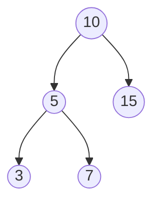
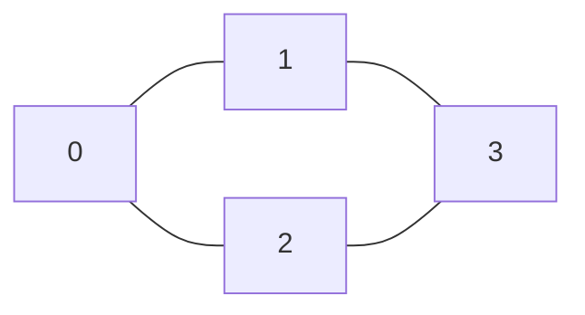

<Callout type="info">
  **이번 문서의 목표:** 이 문서를 다 읽으면 이진 트리와 이진 탐색 트리를 C 구조체와 포인터로 구현하고 세 가지 순회(전위·중위·후위) 결과를 손으로 추적할 수 있으며, 그래프를 인접 행렬·인접 리스트로 표현하는 두 방식의 장단점을 설명하고 DFS·BFS 탐색의 방문 순서를 단계별 표로 그릴 수 있다.
</Callout>

## 왜 트리와 그래프를 구현 수준까지 다루는가

04편에서 트리는 "계층 구조를 표현하는 자료구조", 그래프는 "임의의 관계를 표현하는 자료구조"라고 개념을 정리했다. 13편에서는 배열·스택·큐·재귀를 실제 C 코드로 구현하며 개념을 코드로 옮기는 훈련을 했다. 이 편은 그 연장선에서 **트리와 그래프를 포인터·배열로 실제로 구현**하고, 순회·탐색 알고리즘이 방문하는 노드 순서를 한 단계씩 표로 추적한다.

독학사 통합프로그래밍 시험에서 트리·그래프 문제는 "이 트리를 전위 순회하면 어떤 순서로 출력되는가", "이 그래프를 DFS로 탐색하면 방문 순서는?"처럼 **결과를 손으로 계산**시키는 형태가 압도적으로 많다. 개념만 알아서는 풀 수 없고, 알고리즘을 한 단계씩 직접 실행해 보는 훈련이 필요하다.

## 이진 트리 구현: 노드와 포인터

**이진 트리**(binary tree)는 각 노드가 최대 두 개의 자식(왼쪽·오른쪽)을 가지는 트리다. 07편의 연결리스트 노드가 다음 노드 포인터 하나만 가졌다면, 이진 트리 노드는 왼쪽 자식·오른쪽 자식, 두 개의 포인터를 가진다.

```c
#include <stdio.h>
#include <stdlib.h>

typedef struct 노드 {
    int data;
    struct 노드 *left;
    struct 노드 *right;
} 노드;

노드 *노드생성(int value) {
    노드 *n = (노드 *)malloc(sizeof(노드));
    n->data = value;
    n->left = NULL;
    n->right = NULL;
    return n;
}
```

`malloc`(08편에서 다룬 동적 메모리 할당 함수)으로 힙(heap) 영역에 노드를 하나씩 만들고, `left`·`right` 포인터로 부모-자식 관계를 연결한다. 아래 트리를 코드로 직접 구성해 본다.



```c
int main(void) {
    노드 *root = 노드생성(10);
    root->left = 노드생성(5);
    root->right = 노드생성(15);
    root->left->left = 노드생성(3);
    root->left->right = 노드생성(7);
    return 0;
}
```

`root->left->left`처럼 포인터를 연속으로 따라가는 표현은 "root의 왼쪽 자식의 왼쪽 자식"을 가리킨다. 화살표(`->`)가 이어질수록 트리에서 더 깊은 레벨로 내려간다는 점을 기억한다.

## 트리 순회: 전위·중위·후위

**순회**(traversal)는 트리의 모든 노드를 정해진 규칙에 따라 한 번씩 방문하는 것이다. 이진 트리의 세 가지 기본 순회는 **루트를 방문하는 시점**만 다르다.

| 순회 이름 | 방문 순서 규칙 | 영문 표기 |
|---|---|---|
| 전위 순회 | 루트 → 왼쪽 서브트리 → 오른쪽 서브트리 | preorder |
| 중위 순회 | 왼쪽 서브트리 → 루트 → 오른쪽 서브트리 | inorder |
| 후위 순회 | 왼쪽 서브트리 → 오른쪽 서브트리 → 루트 | postorder |

```c
void 전위순회(노드 *n) {
    if (n == NULL) return;
    printf("%d ", n->data);
    전위순회(n->left);
    전위순회(n->right);
}

void 중위순회(노드 *n) {
    if (n == NULL) return;
    중위순회(n->left);
    printf("%d ", n->data);
    중위순회(n->right);
}

void 후위순회(노드 *n) {
    if (n == NULL) return;
    후위순회(n->left);
    후위순회(n->right);
    printf("%d ", n->data);
}
```

앞서 만든 트리(루트 10, 왼쪽 서브트리 5-3-7, 오른쪽 서브트리 15)에 세 순회를 각각 호출한 결과다.

```text
전위: 10 5 3 7 15
중위: 3 5 7 10 15
후위: 3 7 5 10 15
```

**전위 순회 한 단계씩 추적**(재귀 호출이 어떤 순서로 `printf`를 실행하는지 13편의 스택 프레임 방식으로 따라간다):

| 단계 | 호출 | 동작 |
|---|---|---|
| 1 | `전위순회(10)` | 10 출력 → `전위순회(5)` 호출 |
| 2 | `전위순회(5)` | 5 출력 → `전위순회(3)` 호출 |
| 3 | `전위순회(3)` | 3 출력 → `전위순회(NULL)`, `전위순회(NULL)`(3은 자식이 없음) → 반환 |
| 4 | `전위순회(5)`로 복귀 | `전위순회(7)` 호출 → 7 출력 → 반환 |
| 5 | `전위순회(10)`으로 복귀 | `전위순회(15)` 호출 → 15 출력 → 반환 |

> **쉽게 말하면:** 전위 순회는 "일단 나부터 소개하고 왼쪽 자식들, 그다음 오른쪽 자식들을 소개한다"는 규칙이다. 중위는 "왼쪽 자식들을 먼저 다 소개한 다음 나를 소개하고, 마지막으로 오른쪽 자식들"이다. 이 트리가 **이진 탐색 트리**(다음 절)라면 중위 순회 결과가 항상 오름차순 정렬이 된다는 성질이 매우 중요하다.

> **자주 틀리는 점:** 중위 순회의 이름("중위")을 "가운데 자식을 먼저 방문한다"로 오해하는 경우가 있다. 이진 트리에는 "가운데 자식"이 없다. 중위는 **루트를 왼쪽과 오른쪽 사이(중간)에 방문**한다는 뜻이지, 자식의 위치와는 무관하다.

## 이진 탐색 트리: 정렬된 순서를 유지하는 트리

**이진 탐색 트리**(Binary Search Tree, BST)는 모든 노드에 대해 "왼쪽 서브트리의 모든 값 < 자신의 값 < 오른쪽 서브트리의 모든 값"이 성립하는 이진 트리다. 이 규칙 덕분에 값을 찾을 때 트리의 절반씩 후보를 제외하며 내려갈 수 있다(15편의 이진 탐색과 원리가 같다).

```c
노드 *삽입(노드 *root, int value) {
    if (root == NULL) return 노드생성(value);
    if (value < root->data) {
        root->left = 삽입(root->left, value);
    } else {
        root->right = 삽입(root->right, value);
    }
    return root;
}
```

값 `10, 5, 15, 3, 7`을 순서대로 `삽입`하면 앞서 그린 트리와 정확히 같은 모양이 만들어진다. `삽입(root, 3)`을 예로 한 단계씩 추적한다.

| 단계 | 현재 노드 | 비교 | 다음 행동 |
|---|---|---|---|
| 1 | 10(root) | 3 < 10 | 왼쪽으로 이동 |
| 2 | 5 | 3 < 5 | 왼쪽으로 이동 |
| 3 | NULL(5의 왼쪽 자식 없음) | - | `노드생성(3)`을 반환해 5의 왼쪽 자식으로 연결 |

이 BST를 **중위 순회**하면 `3 5 7 10 15`로, 삽입 순서와 무관하게 항상 오름차순이 나온다는 점이 BST의 핵심 성질이다.

## 그래프 표현: 인접 행렬 vs 인접 리스트

**그래프**(graph)는 정점(vertex, 노드)과 그 사이를 잇는 간선(edge)의 집합이다. 트리와 달리 순환(cycle)이 있을 수 있고 부모-자식 같은 계층 관계도 없다. 그래프를 코드로 표현하는 방법은 크게 두 가지다.



**인접 행렬**(adjacency matrix)은 정점 개수만큼의 2차원 배열로, `graph[i][j]`가 1이면 정점 i와 j 사이에 간선이 있다는 뜻이다.

```c
int graph[4][4] = {
    {0, 1, 1, 0},
    {1, 0, 0, 1},
    {1, 0, 0, 1},
    {0, 1, 1, 0}
};
```

**인접 리스트**(adjacency list)는 각 정점마다 "나와 연결된 정점들의 목록"을 연결리스트나 배열로 저장한다.

```c
typedef struct 간선노드 {
    int vertex;
    struct 간선노드 *next;
} 간선노드;

간선노드 *adjList[4]; /* adjList[i]는 정점 i와 연결된 정점들의 연결리스트 머리 */
```

| 비교 항목 | 인접 행렬 | 인접 리스트 |
|---|---|---|
| 메모리 사용량 | 정점 수의 제곱(O(V²)) — 정점이 많고 간선이 적으면(희소 그래프) 낭비가 크다 | 실제 간선 수에 비례(O(V+E)) — 희소 그래프에서 효율적 |
| 두 정점의 연결 여부 확인 | `graph[i][j]` 한 번 참조로 O(1) | i의 연결 리스트를 끝까지 순회해야 할 수 있어 최악 O(V) |
| 정점의 모든 이웃 나열 | 행 전체(V칸)를 훑어야 해서 O(V) | 그 정점의 리스트 길이만큼만 순회 O(간선 수) |
| 구현 난이도 | 2차원 배열로 단순 | 포인터·연결리스트 구조가 필요해 상대적으로 복잡 |

> **자주 틀리는 점:** "인접 리스트가 항상 더 좋다"는 생각은 틀렸다. 정점 수가 적고 간선이 조밀한(dense) 그래프에서는 인접 행렬의 O(1) 연결 확인이 더 유리할 수 있다. 어떤 표현이 나은지는 그래프의 **밀도**(간선이 얼마나 촘촘한가)에 달려 있다는 점을 시험은 "상황에 따라"라는 형태로 묻는다.

## DFS: 깊이 우선 탐색과 스택

**DFS**(Depth-First Search, 깊이 우선 탐색)는 한 정점에서 갈 수 있는 만큼 깊이 들어갔다가, 더 갈 곳이 없으면 되돌아와(백트래킹) 다른 경로를 탐색하는 방법이다. 13편에서 다룬 스택(또는 재귀 호출 스택)을 이용해 구현한다.

```c
int visited[4] = {0, 0, 0, 0};

void dfs(int graph[4][4], int v) {
    visited[v] = 1;
    printf("%d ", v);
    for (int next = 0; next < 4; next++) {
        if (graph[v][next] == 1 && visited[next] == 0) {
            dfs(graph, next);
        }
    }
}
```

앞서 정의한 그래프(정점 0-1, 0-2, 1-3, 2-3 간선)에서 `dfs(graph, 0)`을 호출했을 때의 방문 순서를 단계별로 추적한다.

| 단계 | 현재 정점 | 방문 표시 | 다음 행동 |
|---|---|---|---|
| 1 | 0 | `visited={1,0,0,0}` | 0의 이웃(1, 2) 중 방문 안 한 1로 이동 |
| 2 | 1 | `visited={1,1,0,0}` | 1의 이웃(0, 3) 중 방문 안 한 3으로 이동 |
| 3 | 3 | `visited={1,1,0,1}` | 3의 이웃(1, 2) 중 방문 안 한 2로 이동 |
| 4 | 2 | `visited={1,1,1,1}` | 2의 이웃(0, 3) 모두 방문됨 → 되돌아가며 종료 |

```text
0 1 3 2
```

## BFS: 너비 우선 탐색과 큐

**BFS**(Breadth-First Search, 너비 우선 탐색)는 현재 정점에서 **가까운 정점부터** 순서대로 탐색한다. DFS가 스택(또는 재귀)을 쓰는 것과 달리, BFS는 13편에서 다룬 **큐**(FIFO)를 사용한다.

```c
void bfs(int graph[4][4], int start) {
    int visited[4] = {0, 0, 0, 0};
    int queue[4], front = 0, rear = 0;

    visited[start] = 1;
    queue[rear++] = start;

    while (front < rear) {
        int v = queue[front++];
        printf("%d ", v);
        for (int next = 0; next < 4; next++) {
            if (graph[v][next] == 1 && visited[next] == 0) {
                visited[next] = 1;
                queue[rear++] = next;
            }
        }
    }
}
```

같은 그래프에서 `bfs(graph, 0)`을 호출했을 때 큐 상태를 단계별로 추적한다.

| 단계 | 동작 | 큐 상태(front가 왼쪽) | 출력 |
|---|---|---|---|
| 1 | 0 방문, 큐에 삽입 | `[0]` | - |
| 2 | 0을 꺼내 출력, 이웃 1·2를 방문 표시하고 큐에 삽입 | `[1, 2]` | 0 |
| 3 | 1을 꺼내 출력, 이웃 중 미방문 3을 큐에 삽입(0은 이미 방문) | `[2, 3]` | 0 1 |
| 4 | 2를 꺼내 출력, 이웃 모두 방문됨(0, 3) | `[3]` | 0 1 2 |
| 5 | 3을 꺼내 출력, 이웃 모두 방문됨(1, 2) | `[]` | 0 1 2 3 |

```text
0 1 2 3
```

같은 그래프인데도 DFS는 `0 1 3 2`, BFS는 `0 1 2 3`으로 **방문 순서가 다르다**는 점이 이 두 알고리즘의 가장 중요한 차이다.

| 비교 항목 | DFS | BFS |
|---|---|---|
| 사용하는 보조 자료구조 | 스택(또는 재귀 호출 스택) | 큐 |
| 탐색 방향 | 한 경로를 끝까지 파고든 뒤 되돌아옴 | 가까운 정점부터 레벨 단위로 넓게 |
| 대표 활용 | 백트래킹, 위상 정렬, 경로 존재 여부 확인 | 최단 경로(가중치 없는 그래프), 레벨별 탐색 |
| 구현 난이도 | 재귀로 간결하게 구현 가능 | 명시적인 큐 관리가 필요 |

## 핵심 정리

- 이진 트리 노드는 왼쪽·오른쪽 두 포인터를 가지며, 전위(루트-왼쪽-오른쪽)·중위(왼쪽-루트-오른쪽)·후위(왼쪽-오른쪽-루트) 순회는 루트를 방문하는 시점만 다르다.
- 이진 탐색 트리는 왼쪽 서브트리 < 자신 < 오른쪽 서브트리 규칙을 지키며, 중위 순회 결과가 항상 오름차순이 된다.
- 그래프는 인접 행렬(O(1) 연결 확인, O(V²) 메모리)과 인접 리스트(O(V+E) 메모리, 희소 그래프에 유리)로 표현할 수 있다.
- DFS는 스택(재귀)으로 깊이 우선, BFS는 큐로 너비 우선 탐색하며 같은 그래프에서도 방문 순서가 서로 다르다.

## 마무리 복습

<Quiz
  questionNumber={1}
  question="이진 트리 순회 중 '왼쪽 서브트리 → 루트 → 오른쪽 서브트리' 순서로 방문하는 것은?"
  options={['전위 순회', '중위 순회', '후위 순회', '레벨 순회']}
  correctAnswer={2}
  explanation="중위 순회(inorder)는 왼쪽 서브트리를 모두 방문한 다음 루트를 방문하고 마지막으로 오른쪽 서브트리를 방문하는 규칙이다."
  optionExplanations={['전위 순회는 루트를 가장 먼저 방문한다.', '정답. 중위 순회의 방문 순서 규칙이다.', '후위 순회는 루트를 가장 마지막에 방문한다.', '레벨 순회는 트리의 같은 깊이 노드를 가로로 방문하는 별도의 순회 방식이다.']}
/>

<Quiz
  questionNumber={2}
  question="루트가 10, 왼쪽 자식이 5(그 왼쪽 자식 3, 오른쪽 자식 7), 오른쪽 자식이 15인 이진 트리를 전위 순회한 결과는?"
  options={['3 5 7 10 15', '10 5 3 7 15', '3 7 5 15 10', '10 15 5 7 3']}
  correctAnswer={2}
  explanation="전위 순회는 루트를 먼저 방문한다. 10을 출력한 뒤 왼쪽 서브트리(5, 3, 7 순서로 전위 방문)를 모두 방문하고, 마지막으로 오른쪽 서브트리(15)를 방문한다."
  optionExplanations={['이 순서는 중위 순회 결과다.', '정답. 루트(10)를 먼저 출력하고 왼쪽 서브트리 전위 순회(5, 3, 7), 오른쪽 서브트리(15) 순서다.', '이 순서는 어떤 표준 순회 방식과도 일치하지 않는다.', '전위 순회는 루트를 가장 먼저 방문하며 오른쪽 서브트리보다 왼쪽 서브트리를 먼저 방문한다.']}
/>

<Quiz
  questionNumber={3}
  question="이진 탐색 트리(BST)의 성질에 대한 설명으로 옳은 것은?"
  options={['모든 노드는 반드시 두 개의 자식을 가져야 한다', '중위 순회 결과가 항상 오름차순으로 정렬된다', '삽입 순서와 관계없이 항상 완전히 균형 잡힌 모양이 된다', '왼쪽 서브트리의 값이 항상 오른쪽 서브트리의 값보다 크다']}
  correctAnswer={2}
  explanation="BST는 왼쪽 서브트리 값이 루트 값보다 작고 오른쪽 서브트리 값이 루트 값보다 크다는 규칙을 항상 만족하므로, 중위 순회로 노드를 방문하면 값이 항상 오름차순으로 나온다."
  optionExplanations={['BST의 노드는 자식이 0개, 1개, 2개일 수 있으며 반드시 두 개일 필요는 없다.', '정답. 중위 순회는 왼쪽(작은 값)-루트-오른쪽(큰 값) 순서라 항상 오름차순이 된다.', '삽입 순서에 따라 한쪽으로 치우친 불균형 트리가 될 수 있다.', 'BST의 규칙은 정반대다. 왼쪽 서브트리가 오른쪽보다 작아야 한다.']}
/>

<Quiz
  questionNumber={4}
  question="정점이 많고 간선이 상대적으로 적은 희소(sparse) 그래프를 표현할 때 메모리 효율 면에서 더 유리한 방식은?"
  options={['인접 행렬, 항상 O(1)로 접근하므로 무조건 유리하다', '인접 리스트, 실제 간선 수에 비례한 메모리만 사용하기 때문이다', '두 방식 모두 메모리 사용량이 완전히 동일하다', '인접 행렬과 인접 리스트를 항상 함께 사용해야 한다']}
  correctAnswer={2}
  explanation="인접 행렬은 정점 수의 제곱(O(V제곱))만큼 메모리를 쓰므로 간선이 적은 희소 그래프에서는 대부분의 칸이 0으로 낭비된다. 인접 리스트는 실제 존재하는 간선 수(O(V+E))만큼만 메모리를 쓰므로 이런 경우 더 효율적이다."
  optionExplanations={['O(1) 접근은 맞지만 메모리 사용량 면에서는 희소 그래프에 불리하다.', '정답. 간선 수에 비례하는 메모리만 사용해 희소 그래프에서 낭비가 적다.', '두 방식의 메모리 사용량 공식(O(V제곱) vs O(V+E))이 서로 다르다.', '두 방식은 각각 독립적으로 선택해 쓸 수 있으며 반드시 함께 쓸 필요는 없다.']}
/>

<Quiz
  questionNumber={5}
  question="정점 0에서 시작해 0-1, 0-2, 1-3, 2-3 간선으로 연결된 그래프를 DFS로 탐색할 때(작은 번호 정점을 먼저 방문), 방문 순서로 옳은 것은?"
  options={['0 1 2 3', '0 1 3 2', '0 2 1 3', '0 3 1 2']}
  correctAnswer={2}
  explanation="0에서 시작해 작은 번호인 1로 깊이 들어간다. 1에서 갈 수 있는 미방문 정점은 3뿐이므로 3으로 들어가고, 3에서 갈 수 있는 미방문 정점 2로 들어간다. 결과는 0, 1, 3, 2다."
  optionExplanations={['이 순서는 BFS(너비 우선) 탐색 결과다.', '정답. 0에서 1로, 1에서 3으로 깊이 파고든 뒤 3에서 2로 이동하는 DFS 경로다.', 'DFS는 0에서 작은 번호인 1을 먼저 방문하므로 2를 먼저 방문하는 이 순서는 옳지 않다.', '0의 이웃 중 1이 2보다 먼저 방문되어야 한다.']}
/>

<Quiz
  questionNumber={6}
  question="같은 정점 0에서 시작해 0-1, 0-2, 1-3, 2-3 간선으로 연결된 그래프를 BFS로 탐색할 때(작은 번호 정점을 먼저 큐에 넣는다), 방문 순서로 옳은 것은?"
  options={['0 1 3 2', '0 1 2 3', '0 2 3 1', '0 3 2 1']}
  correctAnswer={2}
  explanation="BFS는 큐를 사용해 가까운 정점부터 방문한다. 0을 방문한 뒤 이웃 1, 2를 순서대로 큐에 넣고, 1을 꺼내 방문한 뒤 이웃 3을 큐에 넣는다. 이어서 2를 방문하고(3은 이미 큐에 있음), 마지막으로 3을 방문한다. 결과는 0, 1, 2, 3이다."
  optionExplanations={['이 순서는 DFS(깊이 우선) 탐색 결과다.', '정답. 큐를 이용해 0의 이웃(1, 2)을 먼저 모두 방문한 뒤, 그다음 레벨(3)을 방문하는 BFS 순서다.', 'BFS는 0 다음 바로 3을 방문하지 않는다. 3은 1과 2의 이웃이므로 더 나중에 방문된다.', '0의 이웃인 1, 2가 3보다 먼저 방문되어야 한다.']}
/>

<Quiz
  questionNumber={7}
  question="DFS와 BFS의 차이에 대한 설명으로 옳지 않은 것은?"
  options={['DFS는 스택(또는 재귀 호출 스택)을 이용해 구현할 수 있다', 'BFS는 큐를 이용해 가까운 정점부터 탐색한다', '같은 그래프와 시작 정점이 주어지면 DFS와 BFS의 방문 순서는 항상 동일하다', 'DFS는 한 경로를 끝까지 탐색한 뒤 되돌아와 다른 경로를 탐색한다']}
  correctAnswer={3}
  explanation="DFS와 BFS는 서로 다른 보조 자료구조(스택 vs 큐)를 사용하므로 탐색 순서 규칙 자체가 다르다. 같은 그래프라도 방문 순서가 다르게 나오는 경우가 일반적이다."
  optionExplanations={['옳은 설명이다. DFS는 스택 성질(또는 재귀 호출 스택)을 이용해 구현된다.', '옳은 설명이다. 큐(FIFO)로 가까운 정점부터 순서대로 처리한다.', '정답(옳지 않은 설명). 두 알고리즘은 사용하는 자료구조가 달라 방문 순서가 다르게 나오는 것이 일반적이다.', '옳은 설명이다. DFS의 핵심 동작 방식(백트래킹)이다.']}
/>

## 참고 자료

- [국가평생교육진흥원 독학학위제](https://bdes.nile.or.kr) — 4단계 통합프로그래밍의 평가영역과 출제 범위를 확인할 수 있는 공식 사이트.
