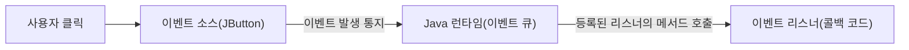

<Callout type="info">
  **이번 문서의 목표:** 이 문서를 다 읽으면 이벤트 기반 프로그래밍이 순차 실행 프로그램과 무엇이 다른지 설명할 수 있고, Java Swing의 기본 컴포넌트(JFrame, JButton 등)로 간단한 창을 구성하는 코드를 읽을 수 있으며, 이벤트 리스너·콜백이 실제로 호출되는 순서를 추적하고 C 스타일 함수 포인터 콜백과 Java 인터페이스 리스너의 차이를 설명할 수 있다.
</Callout>

## 왜 이벤트 기반 프로그래밍이 필요한가

지금까지 다룬 C·Java 코드는 모두 `main` 함수가 시작해서 위에서 아래로, 정해진 순서대로 실행되고 끝나는 **순차 실행**(sequential execution) 프로그램이었다. 그런데 버튼을 클릭하거나 글자를 입력하는 GUI(Graphical User Interface, 그래픽 사용자 인터페이스) 프로그램은 사용자가 **언제 어떤 동작을 할지 미리 알 수 없다**. 사용자가 버튼 A를 먼저 누를지, 텍스트를 먼저 입력할지, 아무것도 안 누르고 창을 닫을지 프로그램 작성 시점에는 정해져 있지 않다.

이 문제를 해결하는 방식이 **이벤트 기반 프로그래밍**(event-driven programming)이다. 프로그램은 "어떤 일(이벤트)이 생기면 이 코드를 실행하라"고 미리 등록만 해 두고, 실제 실행 순서는 사용자의 행동에 따라 그때그때 결정된다.

> **쉽게 말하면:** 순차 실행 프로그램이 "정해진 조리법대로 요리를 끝까지 만드는 것"이라면, 이벤트 기반 프로그래밍은 "식당에서 손님이 벨을 누르면(이벤트) 그제서야 담당 종업원(리스너)이 달려가 응대하는 것"이다. 종업원은 벨이 울리기 전까지는 대기하고 있을 뿐, 미리 정해진 순서대로 손님을 응대하지 않는다.

## 이벤트 기반 프로그래밍의 핵심 요소 세 가지

| 요소 | 설명 | 비유 |
|---|---|---|
| 이벤트(event) | 버튼 클릭, 키 입력, 마우스 이동처럼 "어떤 일이 일어났다"는 신호 | 손님이 누른 벨 |
| 이벤트 소스(event source) | 이벤트를 발생시키는 GUI 컴포넌트(버튼, 텍스트필드 등) | 벨이 달린 테이블 |
| 이벤트 리스너(event listener) | 특정 이벤트가 발생했을 때 실제로 호출될 코드(콜백)를 담은 객체 | 벨소리를 듣고 달려가는 종업원 |

프로그램은 이벤트 소스에 리스너를 **등록**해 두고, 실제 이벤트가 발생하면 자바 런타임이 등록된 리스너의 정해진 메서드를 자동으로 호출한다. 이 "미리 등록해 둔 코드가 나중에 특정 조건에서 자동으로 실행되는 방식"을 **콜백**(callback)이라고 부른다.



## Java Swing으로 기본 창 만들기

**Swing**은 Java 표준 라이브러리에 포함된 GUI 툴킷으로, `AWT`(Abstract Window Toolkit, Java 초기 GUI 라이브러리)를 개선해 만들어졌다. 통합프로그래밍 출제기준의 GUI 영역은 AWT·Swing의 **기초 범위**(창 만들기, 기본 위젯 배치, 이벤트 처리)에 한정된다.

```java
import javax.swing.JFrame;
import javax.swing.JButton;

public class 기본창 {
    public static void main(String[] args) {
        JFrame frame = new JFrame("독학사 GUI 예제");
        JButton button = new JButton("클릭하세요");

        frame.add(button);
        frame.setSize(300, 200);
        frame.setDefaultCloseOperation(JFrame.EXIT_ON_CLOSE);
        frame.setVisible(true);
    }
}
```

| 코드 요소 | 역할 |
|---|---|
| `JFrame` | 화면에 보이는 창(윈도) 자체를 나타내는 최상위 컨테이너 클래스 |
| `JButton` | 클릭 가능한 버튼 위젯(widget, 화면을 구성하는 부품 하나하나) |
| `frame.add(button)` | 버튼을 창 안에 배치 |
| `frame.setSize(300, 200)` | 창의 가로 300, 세로 200 픽셀 크기 지정 |
| `setDefaultCloseOperation(JFrame.EXIT_ON_CLOSE)` | 창의 닫기 버튼(X)을 누르면 프로그램 전체를 종료하도록 지정. 이 줄이 없으면 창만 닫히고 프로세스는 계속 실행될 수 있다 |
| `frame.setVisible(true)` | 지금까지 구성한 창을 실제 화면에 표시. 이 호출 전까지는 창이 만들어져 있어도 화면에 보이지 않는다 |

> **자주 틀리는 점:** `setVisible(true)`를 컴포넌트 배치(`add`)보다 먼저 호출하면 버튼이 없는 빈 창이 먼저 그려지고 이후 변경 사항이 반영되지 않을 수 있다. 코드 순서 문제로 "버튼이 안 보인다"는 오류 찾기 문항이 나올 수 있으므로, **배치를 모두 끝낸 뒤 마지막에 `setVisible(true)`를 호출**하는 순서를 기억한다.

## 이벤트 리스너 등록: ActionListener

버튼 클릭 같은 "동작"(action) 이벤트를 처리하려면 `ActionListener`라는 **인터페이스**(11편에서 다룬, 메서드의 이름과 형태만 정의하고 구현은 강제하는 문법 요소)를 구현해야 한다. `ActionListener`는 `actionPerformed(ActionEvent e)`라는 메서드 하나만 정의하고 있으며, 이 메서드 안에 "버튼을 클릭했을 때 실행할 코드"를 채워 넣는다.

```java
import javax.swing.JFrame;
import javax.swing.JButton;
import java.awt.event.ActionListener;
import java.awt.event.ActionEvent;

public class 버튼클릭예제 {
    public static void main(String[] args) {
        JFrame frame = new JFrame("클릭 이벤트 예제");
        JButton button = new JButton("눌러보세요");

        button.addActionListener(new ActionListener() {
            public void actionPerformed(ActionEvent e) {
                System.out.println("버튼이 클릭되었습니다.");
            }
        });

        frame.add(button);
        frame.setSize(300, 200);
        frame.setDefaultCloseOperation(JFrame.EXIT_ON_CLOSE);
        frame.setVisible(true);
        System.out.println("창이 화면에 표시되었습니다.");
    }
}
```

`new ActionListener() { ... }` 부분은 11편에서 다룬 인터페이스를 **익명 클래스**(anonymous class, 이름 없이 그 자리에서 바로 구현해 객체를 만드는 문법)로 즉석에서 구현한 것이다. `ActionListener` 인터페이스가 요구하는 유일한 메서드 `actionPerformed`를 채워 넣어야 컴파일이 된다.

**실행 결과(사용자가 버튼을 한 번 클릭했다고 가정한 콘솔 출력)**:

```text
창이 화면에 표시되었습니다.
버튼이 클릭되었습니다.
```

**실행 순서 한 단계씩 추적**:

| 단계 | 실행 위치 | 동작 |
|---|---|---|
| 1 | `main` 함수 위에서 아래로 실행 | 창·버튼 생성, 리스너 등록(`addActionListener`)은 "등록"만 할 뿐 아직 `actionPerformed`를 호출하지 않는다 |
| 2 | `frame.setVisible(true)` | 창이 화면에 나타남 |
| 3 | `System.out.println("창이 화면에 표시되었습니다.")` | 콘솔에 즉시 출력. `main` 함수의 코드는 여기서 끝(순차 실행 종료) |
| 4 | (사용자가 버튼 클릭) | Java 런타임이 이 이벤트를 감지해 등록된 `actionPerformed(e)`를 **호출** |
| 5 | `actionPerformed` 안의 `println` 실행 | "버튼이 클릭되었습니다." 출력 |

이 추적표에서 가장 중요한 것은 **4번 단계**다. `actionPerformed` 안의 코드는 `main` 함수가 이미 끝까지 실행되고 난 **뒤에도** 클릭이 발생할 때마다 다시 호출될 수 있다. 이것이 순차 실행과 이벤트 기반 실행의 근본적인 차이다 — 순차 실행 프로그램의 코드는 한 번 지나가면 다시 실행되지 않지만, 이벤트 리스너의 코드는 등록된 이벤트가 발생할 때마다 **몇 번이고 다시** 호출된다.

<Callout type="warning">
  시험 함정: "addActionListener를 호출하는 순간 actionPerformed 안의 코드가 실행된다"는 설명은 틀렸다. `addActionListener`는 어디까지나 "이 이벤트가 발생하면 이 코드를 실행해 달라"는 **등록**일 뿐이며, 실제 실행은 이벤트(클릭)가 일어난 시점에 이루어진다.
</Callout>

## 여러 위젯과 리스너 조합: 텍스트필드 읽어와 라벨 갱신

간단한 위젯 조합 코드를 읽는 훈련이다. 텍스트필드(`JTextField`)에 입력한 값을 버튼 클릭 시 라벨(`JLabel`)에 반영하는 예제다.

```java
import javax.swing.*;
import java.awt.event.ActionListener;
import java.awt.event.ActionEvent;

public class 인사말예제 {
    public static void main(String[] args) {
        JFrame frame = new JFrame("인사말 예제");
        JTextField nameField = new JTextField(10);
        JButton greetButton = new JButton("인사하기");
        JLabel resultLabel = new JLabel("이름을 입력하세요");

        greetButton.addActionListener(new ActionListener() {
            public void actionPerformed(ActionEvent e) {
                String name = nameField.getText();
                resultLabel.setText(name + "님, 안녕하세요!");
            }
        });

        frame.setLayout(new java.awt.FlowLayout());
        frame.add(nameField);
        frame.add(greetButton);
        frame.add(resultLabel);
        frame.setSize(300, 100);
        frame.setDefaultCloseOperation(JFrame.EXIT_ON_CLOSE);
        frame.setVisible(true);
    }
}
```

사용자가 텍스트필드에 "독학사"를 입력하고 버튼을 클릭했다고 가정한 `actionPerformed` 내부 동작을 추적한다.

| 단계 | 실행 위치 | 값의 흐름 |
|---|---|---|
| 1 | `nameField.getText()` | 텍스트필드에 표시된 문자열 "독학사"를 읽어 지역 변수 `name`에 저장 |
| 2 | `name + "님, 안녕하세요!"` | 문자열 연결(concatenation) 연산자 `+`로 "독학사님, 안녕하세요!" 생성 |
| 3 | `resultLabel.setText(...)` | 라벨의 표시 텍스트를 새 문자열로 교체. 화면이 즉시 갱신됨 |

여기서 핵심은 `actionPerformed` 메서드가 **다른 위젯(nameField, resultLabel)의 상태를 읽고 바꿀 수 있다**는 점이다. 이벤트 리스너는 독립된 코드 조각이 아니라, 자신이 정의된 지점에서 접근 가능한 다른 컴포넌트들과 상호작용하도록 설계된다(자바의 **클로저**와 유사하게, 익명 클래스 안에서 바깥의 지역 변수·객체 참조를 사용할 수 있다).

## 절차형 콜백과 객체지향 리스너 비교

"콜백"이라는 개념 자체는 절차형 언어에도 존재한다. C에는 클래스·인터페이스가 없으므로 **함수 포인터**(function pointer, 함수의 주소를 저장하는 포인터)로 콜백을 흉내 낸다. 같은 "버튼 클릭 시 실행할 코드를 등록한다"는 아이디어를 C와 Java가 어떻게 다르게 구현하는지 비교한다.

```c
/* C: 함수 포인터로 콜백을 흉내 낸다(실제 GUI 라이브러리 없이 개념만 표현) */
typedef void (*클릭콜백)(void);

void 버튼클릭시뮬레이션(클릭콜백 callback) {
    printf("버튼이 클릭되었다고 가정\n");
    callback();
}

void 내콜백함수(void) {
    printf("콜백 함수가 호출되었습니다.\n");
}

int main(void) {
    버튼클릭시뮬레이션(내콜백함수);
    return 0;
}
```

```text
버튼이 클릭되었다고 가정
콜백 함수가 호출되었습니다.
```

```java
// Java: 인터페이스 구현체(객체)를 등록해 콜백을 표현한다
button.addActionListener(new ActionListener() {
    public void actionPerformed(ActionEvent e) {
        System.out.println("콜백 메서드가 호출되었습니다.");
    }
});
```

| 비교 항목 | C(절차형) 콜백 | Java(객체지향) 콜백(리스너) |
|---|---|---|
| 등록하는 대상 | 함수의 주소 하나(함수 포인터) | 메서드 하나만 있는 것이 아니라, 관련 상태(필드)까지 함께 가질 수 있는 **객체** |
| 타입 안정성 | 함수 포인터의 시그니처(매개변수·반환형)가 맞아야 하지만 컴파일러 검사가 상대적으로 느슨하다 | 인터페이스가 요구하는 메서드 이름·시그니처를 강제해, 다르게 구현하면 컴파일 오류로 즉시 드러난다 |
| 여러 동작 묶기 | 함수 포인터 하나당 함수 하나. 여러 이벤트(클릭, 입력 등)를 처리하려면 함수 포인터를 여러 개 따로 관리해야 한다 | 하나의 리스너 객체가 여러 메서드(예: `MouseListener`의 클릭·진입·이탈 등)를 한 번에 구현하도록 인터페이스를 설계할 수 있다 |
| 상태 유지 | 함수 자체는 상태를 갖지 않으므로, 상태가 필요하면 전역 변수나 별도의 구조체를 함께 넘겨야 한다 | 익명 클래스·객체가 자신만의 필드나 바깥 변수 참조를 통해 상태를 자연스럽게 유지할 수 있다 |

> **자주 틀리는 점:** "GUI 이벤트 처리는 객체지향 언어에서만 가능하다"는 설명은 지나치다. C로도 함수 포인터를 이용해 콜백 방식의 이벤트 처리를 구현할 수 있다(실제로 많은 C 기반 GUI 라이브러리가 이 방식을 쓴다). 다만 인터페이스로 여러 메서드를 묶고 타입을 강제하는 능력은 객체지향 언어가 더 구조적으로 지원한다는 점이 핵심 차이다.

## 핵심 정리

- 이벤트 기반 프로그래밍은 실행 순서를 코드가 아니라 사용자의 행동(이벤트)이 결정하며, 리스너에 등록된 코드는 이벤트가 발생할 때마다 반복해서 호출될 수 있다.
- Swing의 기본 흐름은 컴포넌트 생성 → 배치(`add`) → 크기·닫기 동작 설정 → `setVisible(true)` 순서다.
- `addActionListener`는 리스너를 등록만 할 뿐이며, 실제 `actionPerformed` 호출은 이벤트가 발생하는 시점에 이루어진다.
- 이벤트 리스너는 자신이 정의된 범위의 다른 컴포넌트 상태를 읽고 바꿀 수 있다.
- C는 함수 포인터로, Java는 인터페이스를 구현한 객체로 콜백을 표현하며, Java 방식은 타입 강제와 상태 유지 면에서 더 구조적이다.

## 마무리 복습

<Quiz
  questionNumber={1}
  question="이벤트 기반 프로그래밍에 대한 설명으로 옳은 것은?"
  options={['프로그램의 모든 코드가 항상 위에서 아래로 한 번씩만 실행된다', '실행 순서가 사용자의 행동(이벤트) 발생 시점에 따라 결정되며, 리스너 코드는 여러 번 호출될 수 있다', '이벤트 리스너는 프로그램 시작과 동시에 딱 한 번만 실행된다', 'GUI 프로그램에는 이벤트라는 개념이 존재하지 않는다']}
  correctAnswer={2}
  explanation="이벤트 기반 프로그래밍에서는 리스너에 등록된 코드가 이벤트가 발생할 때마다 호출되므로, 같은 리스너 메서드가 여러 번 실행될 수 있다. 이는 위에서 아래로 한 번만 실행되는 순차 실행과 다른 점이다."
  optionExplanations={['이벤트 리스너 코드는 이벤트가 발생할 때마다 반복 호출될 수 있어 이 설명은 옳지 않다.', '정답. 실행 순서가 이벤트 발생 시점에 좌우되고 리스너는 여러 번 호출될 수 있다.', '버튼을 여러 번 클릭하면 리스너 메서드도 그만큼 여러 번 호출된다.', 'GUI 프로그램은 클릭, 입력 등 다양한 이벤트 개념을 기반으로 동작한다.']}
/>

<Quiz
  questionNumber={2}
  question="다음 중 JFrame 코드 작성 시 올바른 순서는?"
  options={['setVisible(true) 호출 -> 컴포넌트 add -> setSize 지정', '컴포넌트 add -> setSize 지정 -> setVisible(true) 호출', 'setSize 지정과 setVisible(true)는 동시에 호출해야 하며 순서가 없다', 'setVisible(true)는 반드시 생성자 안에서만 호출해야 한다']}
  correctAnswer={2}
  explanation="컴포넌트를 모두 배치하고 창의 크기 등 설정을 마친 뒤 마지막에 setVisible(true)를 호출해야 완성된 화면이 올바르게 표시된다. 이 순서를 지키지 않으면 배치가 반영되지 않은 빈 화면이 먼저 나타날 수 있다."
  optionExplanations={['setVisible을 먼저 호출하면 아직 배치되지 않은 빈 창이 먼저 그려질 수 있다.', '정답. 배치와 설정을 모두 마친 뒤 마지막에 화면에 표시하는 것이 올바른 순서다.', '두 호출은 순서가 있는 별개의 메서드 호출이며 동시 호출 개념이 아니다.', 'setVisible은 생성자가 아니라 main 메서드나 다른 일반 메서드에서도 자유롭게 호출할 수 있다.']}
/>

<Quiz
  questionNumber={3}
  question="다음 코드에서 addActionListener(...)가 호출되는 시점에 actionPerformed 메서드 안의 println이 실행되는가?"
  options={['즉시 실행된다', '프로그램이 종료될 때 실행된다', '실행되지 않으며, 실제 버튼 클릭 이벤트가 발생해야 실행된다', 'main 메서드가 끝나기 직전에 자동으로 한 번 실행된다']}
  correctAnswer={3}
  explanation="addActionListener는 리스너를 등록하는 동작일 뿐이다. actionPerformed 메서드 안의 코드는 실제로 해당 버튼에 대한 클릭 이벤트가 발생했을 때 자바 런타임이 호출해 준다."
  optionExplanations={['등록 시점에는 아직 어떤 이벤트도 발생하지 않았으므로 즉시 실행되지 않는다.', '프로그램 종료와 리스너 등록은 서로 무관한 시점이다.', '정답. 리스너는 등록만 될 뿐이며, 실제 클릭 이벤트가 발생해야 메서드가 호출된다.', 'main 메서드 종료와 이벤트 리스너 호출은 자동으로 연결되어 있지 않다.']}
/>

<Quiz
  questionNumber={4}
  question="Java에서 ActionListener 인터페이스를 구현할 때 반드시 정의해야 하는 메서드는?"
  options={['run()', 'actionPerformed(ActionEvent e)', 'main(String[] args)', 'paint(Graphics g)']}
  correctAnswer={2}
  explanation="ActionListener 인터페이스는 actionPerformed(ActionEvent e) 메서드 하나를 정의하도록 요구한다. 이 메서드를 구현하지 않으면 컴파일 오류가 발생한다."
  optionExplanations={['run()은 Runnable 인터페이스가 요구하는 메서드이며 ActionListener와는 관련이 없다.', '정답. ActionListener가 요구하는 유일한 추상 메서드다.', 'main은 프로그램의 시작점이며 인터페이스 구현과는 무관하다.', 'paint(Graphics g)는 컴포넌트를 직접 그릴 때 사용하는 메서드로 ActionListener와는 다른 목적이다.']}
/>

<Quiz
  questionNumber={5}
  question="텍스트필드에 독학사를 입력하고 버튼을 클릭했을 때, resultLabel.setText(name + 님, 안녕하세요!) 코드가 만드는 최종 라벨 텍스트는?"
  options={['이름을 입력하세요', '독학사', '독학사님, 안녕하세요!', 'name님, 안녕하세요!']}
  correctAnswer={3}
  explanation="nameField.getText()로 읽은 문자열 독학사가 변수 name에 저장되고, 문자열 연결 연산자 +로 님, 안녕하세요! 와 합쳐져 독학사님, 안녕하세요! 가 만들어진다."
  optionExplanations={['이는 초기 라벨 텍스트이며 버튼 클릭 이후에는 갱신된 텍스트로 교체된다.', 'name 변수만 출력된 것이며 뒤에 이어지는 인사말 문자열이 빠져 있다.', '정답. 입력값과 인사말 문자열이 연결 연산자로 합쳐진 결과다.', 'name은 변수이며 실제 실행 시에는 변수에 담긴 문자열 값(독학사)으로 치환되어 출력된다.']}
/>

<Quiz
  questionNumber={6}
  question="C에서 함수 포인터로 콜백을 구현하는 방식과 Java에서 인터페이스로 리스너를 구현하는 방식을 비교한 설명으로 옳지 않은 것은?"
  options={['C의 함수 포인터는 함수의 주소만 저장하며 그 자체로는 상태를 갖지 않는다', 'Java의 리스너 객체는 필드나 바깥 변수 참조를 통해 상태를 유지할 수 있다', 'C는 GUI 이벤트 처리 자체가 원천적으로 불가능한 언어다', 'Java 인터페이스는 요구하는 메서드의 이름과 시그니처를 컴파일 시점에 강제할 수 있다']}
  correctAnswer={3}
  explanation="C는 클래스나 인터페이스는 없지만 함수 포인터를 이용해 콜백 방식의 이벤트 처리를 구현할 수 있다. 실제로 여러 C 기반 GUI 라이브러리가 이 방식을 사용하므로 원천적으로 불가능하다는 설명은 옳지 않다."
  optionExplanations={['옳은 설명이다. 함수 포인터 자체는 상태를 갖지 않아 별도의 전역 변수나 구조체가 필요할 수 있다.', '옳은 설명이다. 객체는 필드나 클로저처럼 바깥 변수를 참조해 상태를 유지할 수 있다.', '정답(옳지 않은 설명). C도 함수 포인터 기반 콜백으로 이벤트 처리를 구현할 수 있다.', '옳은 설명이다. 인터페이스를 구현하지 않거나 시그니처가 다르면 컴파일 오류가 발생한다.']}
/>

<Quiz
  questionNumber={7}
  question="이벤트 소스, 이벤트, 이벤트 리스너의 관계를 올바르게 설명한 것은?"
  options={['이벤트 리스너가 이벤트 소스를 발생시킨다', '이벤트 소스에서 이벤트가 발생하면, 등록된 이벤트 리스너의 메서드가 호출된다', '이벤트는 리스너 없이도 항상 화면에 결과를 출력한다', '이벤트 소스와 이벤트 리스너는 항상 같은 클래스여야 한다']}
  correctAnswer={2}
  explanation="버튼 같은 이벤트 소스에서 클릭 같은 이벤트가 발생하면, 그 이벤트 소스에 등록해 둔 이벤트 리스너의 메서드(예: actionPerformed)가 자바 런타임에 의해 호출되는 구조다."
  optionExplanations={['이벤트를 발생시키는 것은 이벤트 소스(버튼 등)이지 리스너가 아니다.', '정답. 이벤트 소스에서 이벤트가 발생하면 등록된 리스너의 메서드가 호출된다.', '리스너가 등록되어 있지 않으면 이벤트가 발생해도 실행될 코드가 없어 아무 결과도 나오지 않는다.', '리스너는 익명 클래스나 별도의 클래스로 자유롭게 구현할 수 있으며 반드시 이벤트 소스와 같은 클래스일 필요는 없다.']}
/>

## 참고 자료

- [국가평생교육진흥원 독학학위제](https://bdes.nile.or.kr) — 4단계 통합프로그래밍의 평가영역과 출제 범위를 확인할 수 있는 공식 사이트.
- [Oracle Java SE Documentation](https://docs.oracle.com/en/java/javase/17/) — Swing·AWT 컴포넌트와 이벤트 리스너 인터페이스의 공식 API 문서.
