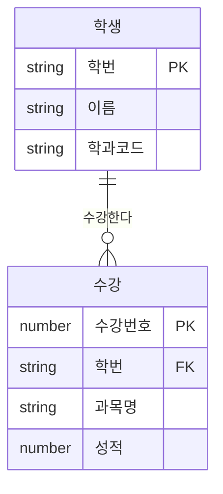

<Callout type="info">
  **이번 문서의 목표:** 이 문서를 다 읽으면 테이블·기본키·외래키의 관계를 그림으로 설명할 수 있고, SELECT·INSERT·UPDATE·DELETE 문을 정확한 문법으로 작성할 수 있으며, 여러 테이블을 묶는 JOIN(조인) 문제와 다음 편(18편)에서 이 SQL을 그대로 Java 코드 안에 넣어 실행하는 JDBC 문제를 풀 준비가 됩니다.
</Callout>

## 이 편이 DB 이론 과목과 다른 이유

> **쉽게 말하면:** DB 이론 과목이 "왜 이렇게 설계하는가"를 묻는다면, 이 과목은 "이 SQL을 실행하면 결과 테이블이 어떻게 나오는가"를 묻습니다.

01_학습방향.md에서 밝힌 대로, 통합프로그래밍은 데이터베이스 자체의 정규화 이론이나 트랜잭션 이론(4단계_데이터베이스 과목의 영역)을 장황하게 다루지 않습니다. 대신 **다음 편에서 Java 코드(JDBC) 안에 그대로 삽입해 실행할 SQL 문**을 정확히 쓰고, 그 실행 결과 테이블을 예측하는 능력에 집중합니다. 05편에서 "DB·SQL·JDBC 개요"를 큰 그림으로 먼저 봤다면, 이 편은 그중 SQL 문법 자체를 손으로 쓰고 실행 결과를 표로 그리는 훈련입니다.

이 사이트에는 SQL을 전문으로 다루는 SQLD 과목이 이미 있습니다. 그쪽이 SQL 함수·집계·서브쿼리의 세세한 문법을 폭넓게 다룬다면, 이 편은 **프로그래밍 코드 속에 자주 등장하는 최소한의 SQL 패턴**만 골라 깊게 다룹니다. SQL 문법은 이 사이트 다른 과목의 관행과 통일하기 위해 **Oracle 문법**을 기준으로 씁니다.

## 테이블·키·관계 기초

> **쉽게 말하면:** 테이블은 엑셀 시트 하나, 기본키는 그 시트에서 행을 절대 헷갈리지 않게 구별해 주는 "학번" 같은 열입니다.

관계형 데이터베이스(relational database, 표 형태로 데이터를 저장하는 DB)에서 **테이블**(table)은 행(row)과 열(column)로 이루어진 하나의 표입니다. 행은 레코드(record) 하나, 즉 실제 데이터 한 건을 뜻하고, 열은 그 데이터가 가진 속성(attribute) 하나를 뜻합니다.

예를 들어 학생 정보를 담는 `학생` 테이블과, 그 학생이 수강하는 과목 정보를 담는 `수강` 테이블을 만든다고 합시다.

```sql
CREATE TABLE 학생 (
  학번      VARCHAR2(10)  PRIMARY KEY,
  이름      VARCHAR2(20)  NOT NULL,
  학과코드  VARCHAR2(10)
);

CREATE TABLE 수강 (
  수강번호  NUMBER        PRIMARY KEY,
  학번      VARCHAR2(10)  REFERENCES 학생(학번),
  과목명    VARCHAR2(30),
  성적      NUMBER(3)
);
```

- **기본키**(primary key, PK): 한 테이블 안에서 각 행을 유일하게 구별하는 열. 값이 중복되거나 비어 있으면(`NULL`) 안 됩니다. 위에서 `학생.학번`, `수강.수강번호`가 기본키입니다.
- **외래키**(foreign key, FK): 다른 테이블의 기본키를 그대로 참조하는 열. `수강.학번`은 `학생.학번`을 가리키는 외래키로, 이 두 테이블이 "어떤 학생이 어떤 과목을 듣는가"라는 **관계**(relationship)로 연결됨을 나타냅니다.
- **NOT NULL**: 그 열에 빈 값을 허용하지 않는다는 제약(constraint).



위 관계 다이어그램(ER diagram, Entity-Relationship Diagram)에서 `||--o{`는 "학생 한 명(`||`, 정확히 하나)이 수강 여러 건(`o{`, 0개 이상)과 연결된다"는 뜻입니다. 이런 관계를 **1대다(1:N) 관계**라고 부르며, 실무·시험 모두에서 가장 흔한 관계 형태입니다.

<Callout type="warning">
  **자주 틀리는 점:** 기본키와 외래키를 헷갈려 "외래키도 반드시 유일한 값이어야 한다"고 착각하기 쉽습니다. 외래키는 **같은 값이 여러 번 나올 수 있습니다**(위 예시에서 한 학생이 여러 과목을 수강하면 `수강.학번`에 같은 학번이 여러 행에 등장). 유일해야 하는 것은 기본키뿐입니다.
</Callout>

이제 아래 예제 데이터를 두 편 내내 기준으로 삼겠습니다.

| 학번 | 이름 | 학과코드 |
|------|------|----------|
| S01 | 김민수 | CS |
| S02 | 이서연 | CS |
| S03 | 박지훈 | EE |

| 수강번호 | 학번 | 과목명 | 성적 |
|----------|------|--------|------|
| 1 | S01 | 자료구조 | 90 |
| 2 | S01 | 데이터베이스 | 85 |
| 3 | S02 | 자료구조 | 78 |
| 4 | S03 | 네트워크 | 92 |

## SELECT — 데이터 조회

> **쉽게 말하면:** SELECT는 "어느 열을, 어느 조건에 맞는 행만, 어떤 순서로 보여줘"라고 DB에 요청하는 문장입니다.

```sql
SELECT 이름, 학과코드
FROM 학생
WHERE 학과코드 = 'CS'
ORDER BY 이름 ASC;
```

SQL 문은 다음 순서로 **해석**됩니다(작성 순서와 실제 처리 순서가 다르다는 점이 시험 포인트입니다).

| 처리 순서 | 절(clause) | 이 예제에서 하는 일 |
|-----------|------------|----------------------|
| 1 | `FROM` | `학생` 테이블을 대상으로 지정 |
| 2 | `WHERE` | `학과코드 = 'CS'`인 행만 남김 (S01, S02) |
| 3 | `SELECT` | `이름`, `학과코드` 열만 골라냄 |
| 4 | `ORDER BY` | 이름 기준 오름차순(`ASC`, 기본값)으로 정렬 |

**실행 결과**

```text
이름     학과코드
-------- --------
김민수   CS
이서연   CS
```

`WHERE`는 개별 행 하나하나를 검사해 조건을 만족하는 행만 남기는 절이고, `ORDER BY`는 그 결과를 특정 열 기준으로 줄 세우는 절입니다. `DESC`를 붙이면 내림차순으로 바뀝니다. 문자열 값은 반드시 작은따옴표(`'CS'`)로 감싸야 하며, Oracle에서는 큰따옴표를 문자열이 아니라 식별자(테이블·열 이름)를 감쌀 때 씁니다.

집계 함수(aggregate function, 여러 행을 하나의 값으로 요약하는 함수)와 `GROUP BY`(그룹으로 묶기)도 자주 나옵니다.

```sql
SELECT 학번, COUNT(*) AS 수강과목수, AVG(성적) AS 평균성적
FROM 수강
GROUP BY 학번;
```

**실행 결과**

```text
학번   수강과목수   평균성적
------ ------------ ----------
S01    2            87.5
S02    1            78
S03    1            92
```

`COUNT(*)`는 그룹에 속한 행의 개수를 세고, `AVG(성적)`은 그 그룹의 성적 평균을 계산합니다. `GROUP BY 학번`은 "학번이 같은 행끼리 하나의 그룹으로 묶어라"는 뜻이며, `SELECT` 절에는 `GROUP BY`에 쓴 열이거나 집계 함수로 감싼 열만 올 수 있습니다.

<Callout type="warning">
  **자주 틀리는 점:** `WHERE` 절에 집계 함수를 바로 쓰려는 실수가 흔합니다(`WHERE COUNT(*) > 1`). 집계 함수로 만든 그룹 결과를 다시 걸러야 할 때는 `WHERE`가 아니라 **`HAVING`**을 씁니다. `WHERE`는 그룹으로 묶기 전 개별 행을 거르고, `HAVING`은 그룹으로 묶은 뒤의 결과를 거릅니다.
</Callout>

## INSERT·UPDATE·DELETE — 데이터 변경

> **쉽게 말하면:** INSERT는 새 행을 끼워 넣고, UPDATE는 있는 행의 값을 고치고, DELETE는 행을 통째로 지웁니다.

```sql
INSERT INTO 학생 (학번, 이름, 학과코드)
VALUES ('S04', '최유리', 'CS');

UPDATE 학생
SET 학과코드 = 'SW'
WHERE 학번 = 'S04';

DELETE FROM 학생
WHERE 학번 = 'S04';
```

| 명령 | 역할 | WHERE 없이 실행하면 |
|------|------|----------------------|
| `INSERT` | 새 행 한 건 추가 | 개념상 해당 없음(항상 한 건 추가) |
| `UPDATE` | 조건에 맞는 행의 값 수정 | **테이블의 모든 행이 수정됨** |
| `DELETE` | 조건에 맞는 행 삭제 | **테이블의 모든 행이 삭제됨**(테이블 구조는 남음) |

<Callout type="warning">
  **자주 틀리는 점:** `UPDATE`나 `DELETE`에서 `WHERE` 절을 빠뜨리는 것은 문법 오류가 아니라 **정상적으로 실행되는 문장**입니다. 그 결과 테이블의 모든 행이 수정되거나 삭제되어 버립니다. "이 SQL을 실행하면 몇 개의 행이 영향을 받는가?"라는 문제에서 `WHERE` 유무를 반드시 확인해야 합니다.
</Callout>

`DELETE FROM 학생;`과 `TRUNCATE TABLE 학생;`은 결과적으로 모든 행을 지운다는 점은 같지만, `DELETE`는 한 행씩 지우는 기록이 남아 `ROLLBACK`(되돌리기)이 가능한 반면 `TRUNCATE`는 테이블을 통째로 비우는 구조적 명령이라 되돌릴 수 없다는 차이가 있습니다. 18편에서 JDBC의 `Connection` 객체가 트랜잭션(transaction, 여러 SQL을 하나의 작업 단위로 묶는 것)을 어떻게 관리하는지 다룰 때 이 개념이 다시 등장합니다.

## JOIN — 여러 테이블 묶기

> **쉽게 말하면:** JOIN은 서로 다른 두 표를 공통 열(주로 외래키)을 기준으로 옆으로 이어 붙이는 것입니다.

`학생`과 `수강`은 별개의 테이블이므로, "김민수가 들은 과목과 성적"처럼 두 테이블의 정보를 동시에 보려면 JOIN이 필요합니다.

```sql
SELECT 학생.이름, 수강.과목명, 수강.성적
FROM 학생
JOIN 수강 ON 학생.학번 = 수강.학번;
```

**실행 과정을 단계별로 추적**

| 단계 | 하는 일 |
|------|---------|
| 1 | `학생`의 각 행과 `수강`의 각 행을 하나씩 짝지어 본다 |
| 2 | `ON 학생.학번 = 수강.학번` 조건이 참인 짝만 남긴다 |
| 3 | 남은 짝에서 `SELECT`에 지정한 열만 뽑아낸다 |

**실행 결과**

```text
이름     과목명       성적
-------- ------------ -----
김민수   자료구조     90
김민수   데이터베이스 85
이서연   자료구조     78
박지훈   네트워크     92
```

위 방식을 **INNER JOIN**(내부 조인, `JOIN`만 쓰면 기본값이 INNER JOIN)이라 부르며, 양쪽 조건을 모두 만족하는 짝만 남깁니다. 만약 수강 기록이 하나도 없는 학생(예: S04)도 결과에 포함시키고 싶다면 **LEFT OUTER JOIN**(왼쪽 외부 조인)을 씁니다.

```sql
SELECT 학생.이름, 수강.과목명
FROM 학생
LEFT JOIN 수강 ON 학생.학번 = 수강.학번;
```

**실행 결과**(S04를 미리 추가해 두었다고 가정)

```text
이름     과목명
-------- ------------
김민수   자료구조
김민수   데이터베이스
이서연   자료구조
박지훈   네트워크
최유리   (NULL)
```

| 조인 종류 | 결과에 포함되는 행 |
|-----------|---------------------|
| `INNER JOIN` | 양쪽 조건이 모두 맞는 행만 |
| `LEFT (OUTER) JOIN` | 왼쪽 테이블의 모든 행 + 오른쪽에 짝이 없으면 `NULL` |
| `RIGHT (OUTER) JOIN` | 오른쪽 테이블의 모든 행 + 왼쪽에 짝이 없으면 `NULL` |

<Callout type="warning">
  **자주 틀리는 점:** `LEFT JOIN`에서 "왼쪽"은 SQL 문에서 `FROM` 뒤에 먼저 적힌 테이블을 뜻합니다. `FROM 학생 LEFT JOIN 수강`이면 `학생`이 왼쪽이므로 수강 기록이 없는 학생도 결과에 남고, 짝이 없는 자리는 `NULL`로 채워집니다. `FROM`과 `JOIN`에 적힌 테이블 순서를 바꿔 놓고 결과가 같을 거라 착각하면 안 됩니다.
</Callout>

## 프로그래밍 문제에 자주 나오는 SQL 패턴

18편에서 다룰 JDBC 코드는 SQL 문장을 문자열(String)로 만들어 실행하는 구조이므로, 다음 두 패턴을 정확히 쓸 수 있어야 합니다.

**패턴 1 — 파라미터가 들어가는 조회**

```sql
SELECT * FROM 학생 WHERE 학번 = ?
```

물음표(`?`)는 값이 나중에 채워질 자리를 표시하는 **자리표시자**(placeholder)입니다. JDBC에서는 이 물음표에 실제 값을 안전하게 채워 넣는 `PreparedStatement`(준비된 문장)를 씁니다. 값을 문자열 이어붙이기로 직접 SQL 안에 끼워 넣으면 **SQL 삽입 공격**(SQL injection, 악의적인 SQL 조각을 입력값에 섞어 넣어 의도치 않은 쿼리를 실행시키는 공격)에 취약해지므로, 시험에서도 자리표시자 방식이 권장되는 이유를 함께 물어봅니다.

**패턴 2 — 서브쿼리(subquery, 쿼리 안의 쿼리)로 조건 비교**

```sql
SELECT 이름
FROM 학생
WHERE 학번 IN (
  SELECT 학번 FROM 수강 WHERE 과목명 = '자료구조'
);
```

안쪽 `SELECT 학번 FROM 수강 WHERE 과목명 = '자료구조'`가 먼저 실행되어 `('S01', 'S02')`라는 값 목록을 만들고, 바깥쪽 `SELECT`는 그 목록에 학번이 포함된 학생만 찾습니다. 서브쿼리는 **안쪽부터 먼저 계산되어 값 또는 값 목록으로 바뀐 뒤, 바깥쪽 문장에 끼워 넣어진다**고 이해하면 실행 순서를 헷갈리지 않습니다.

## 핵심 정리

- 테이블의 기본키(PK)는 유일하고 비어 있지 않아야 하며, 외래키(FK)는 다른 테이블의 기본키를 참조해 테이블 사이의 관계(주로 1:N)를 만든다.
- SQL은 작성 순서(`SELECT → FROM → WHERE → ORDER BY`)와 처리 순서(`FROM → WHERE → SELECT → ORDER BY`)가 다르며, 그룹으로 묶은 뒤 조건을 거를 때는 `WHERE`가 아니라 `HAVING`을 쓴다.
- `INSERT`는 새 행 추가, `UPDATE`·`DELETE`는 `WHERE`가 없으면 테이블 전체 행에 적용된다.
- `INNER JOIN`은 양쪽 조건이 맞는 행만, `LEFT JOIN`은 왼쪽 테이블의 모든 행을 기준으로 짝이 없으면 `NULL`을 채운다.
- 프로그래밍 코드 속 SQL은 자리표시자(`?`)와 `PreparedStatement`로 값을 안전하게 채우는 패턴이 기본이며, 서브쿼리는 안쪽부터 먼저 값으로 계산된다.

## 마무리 복습

<Quiz
  questionNumber={1}
  question="기본키(PK)와 외래키(FK)에 대한 설명으로 옳은 것은?"
  options={['외래키도 기본키처럼 값이 항상 유일해야 한다', '기본키는 한 테이블 안에서 행을 유일하게 구별하며 NULL을 허용하지 않는다', '외래키는 반드시 자기 테이블의 기본키와 이름이 같아야 한다', '기본키는 한 테이블에 여러 개 존재해도 서로 값이 중복될 수 있다']}
  correctAnswer={2}
  explanation="기본키는 각 행을 유일하게 구별하는 열로 값이 중복되거나 비어 있으면 안 된다. 외래키는 다른 테이블의 기본키를 참조하는 값이므로 같은 값이 여러 행에 반복해서 나타날 수 있다."
  optionExplanations={['외래키는 같은 값이 여러 번 나올 수 있다', '정답 — 기본키의 정의 그대로다', '외래키의 열 이름은 참조 대상과 달라도 된다', '기본키는 정의상 서로 중복될 수 없다']}
/>

<Quiz
  questionNumber={2}
  question="SELECT 문의 실제 처리 순서로 옳은 것은?"
  options={['SELECT → FROM → WHERE → ORDER BY', 'FROM → WHERE → SELECT → ORDER BY', 'WHERE → SELECT → FROM → ORDER BY', 'ORDER BY → FROM → WHERE → SELECT']}
  correctAnswer={2}
  explanation="SQL은 FROM으로 대상 테이블을 정하고, WHERE로 행을 거른 뒤, SELECT로 열을 골라내고, 마지막으로 ORDER BY로 정렬한다. 작성 순서(SELECT가 맨 앞)와 처리 순서가 다르다는 점이 핵심이다."
  optionExplanations={['이것은 작성 순서이지 처리 순서가 아니다', '정답 — FROM이 가장 먼저 처리된다', 'WHERE보다 FROM이 먼저 처리되어야 대상 테이블이 정해진다', 'ORDER BY는 가장 마지막에 처리된다']}
/>

<Quiz
  questionNumber={3}
  question="집계 함수로 묶은 그룹 결과에 조건을 추가로 걸고 싶을 때 사용하는 절은?"
  options={['WHERE', 'HAVING', 'ORDER BY', 'GROUP BY']}
  correctAnswer={2}
  explanation="WHERE는 그룹으로 묶기 전 개별 행을 거르고, HAVING은 GROUP BY로 묶은 그룹 결과(집계 함수 값 포함)를 다시 거르는 절이다."
  optionExplanations={['WHERE는 집계 함수 결과를 조건으로 쓸 수 없다', '정답 — 그룹 결과를 거르는 절은 HAVING이다', 'ORDER BY는 정렬만 담당한다', 'GROUP BY는 그룹으로 묶는 절이지 거르는 절이 아니다']}
/>

<Quiz
  questionNumber={4}
  question="다음 SQL을 실행했을 때의 결과로 옳은 것은? UPDATE 학생 SET 학과코드 = 'SW';"
  options={['학과코드가 원래 NULL이었던 행만 수정된다', 'WHERE 절이 없으므로 문법 오류로 실행되지 않는다', '학생 테이블의 모든 행의 학과코드가 SW로 바뀐다', '학생 테이블 전체가 삭제된다']}
  correctAnswer={3}
  explanation="UPDATE 문에 WHERE 절이 없으면 조건 없이 테이블의 모든 행이 수정 대상이 되므로, 학생 테이블의 모든 행의 학과코드가 SW로 바뀐다."
  optionExplanations={['조건이 없으므로 모든 행이 대상이 된다', 'WHERE 절 생략은 문법 오류가 아니라 정상적으로 실행되는 문장이다', '정답 — 모든 행이 수정된다', 'UPDATE는 값을 바꾸는 명령이지 행을 삭제하는 명령이 아니다']}
/>

<Quiz
  questionNumber={5}
  question="FROM 학생 LEFT JOIN 수강 ON 학생.학번 = 수강.학번 을 실행했을 때, 수강 기록이 하나도 없는 학생의 결과로 옳은 것은?"
  options={['결과에서 아예 제외된다', '수강 관련 열이 NULL로 채워진 채 결과에 포함된다', 'INNER JOIN과 동일하게 동작해 차이가 없다', '오류가 발생해 쿼리 실행이 중단된다']}
  correctAnswer={2}
  explanation="LEFT JOIN은 왼쪽 테이블(FROM 뒤에 먼저 적힌 학생)의 모든 행을 기준으로 삼아, 오른쪽 테이블에 짝이 없으면 그 열들을 NULL로 채워 결과에 포함시킨다."
  optionExplanations={['LEFT JOIN은 왼쪽 테이블의 행을 제외하지 않는다', '정답 — LEFT JOIN의 정의 그대로다', 'INNER JOIN이었다면 이 학생은 결과에서 제외되므로 서로 다르다', 'LEFT JOIN 자체는 오류를 일으키지 않는다']}
/>

<Quiz
  questionNumber={6}
  question="JDBC 코드에서 SELECT * FROM 학생 WHERE 학번 = ? 처럼 물음표(?)를 쓰는 방식이 문자열을 직접 이어붙이는 방식보다 권장되는 이유로 가장 옳은 것은?"
  options={['물음표를 쓰면 쿼리 실행 속도가 항상 더 빠르기 때문이다', 'SQL 삽입 공격을 방지하고 값을 안전하게 전달할 수 있기 때문이다', '물음표는 Oracle에서만 지원되는 특수 문법이기 때문이다', '문자열을 이어붙이면 문법 오류가 발생해 아예 실행되지 않기 때문이다']}
  correctAnswer={2}
  explanation="자리표시자(?)와 PreparedStatement를 함께 쓰면 입력값이 SQL 문의 일부로 해석되지 않고 순수한 데이터 값으로만 전달되어, 악의적인 SQL 조각이 섞여 들어가는 SQL 삽입 공격을 방지할 수 있다."
  optionExplanations={['속도 개선은 부수적 효과일 뿐 핵심 이유가 아니다', '정답 — 보안상 안전하게 값을 전달하기 위해서다', 'PreparedStatement는 여러 DB에서 공통으로 지원되는 표준 JDBC 기능이다', '문자열 이어붙이기도 문법적으로는 정상 실행될 수 있어 더 위험하다']}
/>

## 참고 자료

- [Oracle Database SQL Language Reference](https://docs.oracle.com/en/database/oracle/oracle-database/)
- [국가평생교육진흥원 독학학위제](https://bdes.nile.or.kr)
