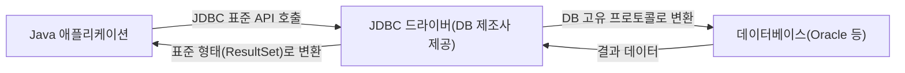

<Callout type="info">
  **이번 문서의 목표:** 이 문서를 다 읽으면 JDBC(Java Database Connectivity)로 DB에 접속해 SQL을 실행하고 결과를 꺼내는 코드의 고정된 순서를 외우지 않고 이해할 수 있고, 그 순서 중 한 줄이 빠지거나 순서가 바뀐 코드에서 무엇이 잘못됐는지 짚어낼 수 있으며, 예외 처리와 자원 반납 패턴을 코드로 작성할 수 있게 됩니다.
</Callout>

## JDBC는 무엇을 연결하는 다리인가

> **쉽게 말하면:** JDBC는 Java 코드와 데이터베이스 사이에 놓인 "표준 통역 창구"입니다.

Java 프로그램은 그 자체로 Oracle이나 MySQL 같은 데이터베이스와 직접 대화할 수 없습니다. 각 DB 제조사는 서로 다른 통신 방식을 쓰기 때문입니다. **JDBC**(Java DataBase Connectivity, 자바 데이터베이스 연결)는 "Java 코드는 이 정해진 방법으로만 요청하면, 어떤 DB든 알아서 응답을 돌려준다"는 **표준 인터페이스**(interface, 12_java-exception-collection에서 다룬 것과 같은 의미의, 구현은 없고 규칙만 정한 설계)의 집합입니다.



Java 코드는 항상 같은 JDBC API(`Connection`, `Statement`, `ResultSet` 등)만 호출하면 되고, 실제로 Oracle과 대화하는 세부 방식은 **드라이버**(driver, DB 제조사가 만들어 배포하는 통역 프로그램)가 담당합니다. 이 구조 덕분에 DB를 바꾸더라도 애플리케이션 코드 대부분은 그대로 두고 드라이버만 교체하면 됩니다.

## JDBC 프로그래밍의 고정된 5단계

> **쉽게 말하면:** JDBC 코드는 "문 열기 → 주문서 준비하기 → 주문 넣기 → 결과 받기 → 문 닫기"라는 다섯 단계를 항상 같은 순서로 반복합니다.

<Steps>

### 1. 드라이버 로딩(driver loading)

```java
Class.forName("oracle.jdbc.driver.OracleDriver");
```

`Class.forName(문자열)`은 그 이름의 클래스를 메모리에 강제로 읽어들이는 코드입니다. JDBC 드라이버 클래스는 이렇게 읽히는 순간 내부적으로 자기 자신을 `DriverManager`(드라이버 관리자)에 등록하도록 작성되어 있습니다. 참고로 최신 JDBC(4.0 이상) 버전과 최근 드라이버는 이 과정을 자동으로 처리해 이 줄을 생략할 수 있지만, 독학사 시험은 전체 구조를 이해했는지 확인하기 위해 이 줄을 포함한 형태로 자주 출제됩니다.

### 2. 연결 생성(Connection)

```java
String url = "jdbc:oracle:thin:@localhost:1521:orcl";
Connection conn = DriverManager.getConnection(url, "user", "password");
```

`DriverManager.getConnection(주소, 계정, 비밀번호)`은 실제로 DB에 접속해 하나의 통신 세션(session)을 여는 `Connection` 객체를 돌려줍니다. `url` 문자열은 `jdbc:하위프로토콜:@호스트:포트:DB이름` 형태로, "JDBC로, 이 DB 종류의 방식으로, 이 주소에 접속하라"는 정보를 한 줄에 담습니다.

### 3. 실행 객체 준비(Statement / PreparedStatement)

```java
String sql = "SELECT 이름, 성적 FROM 수강 WHERE 학번 = ?";
PreparedStatement pstmt = conn.prepareStatement(sql);
pstmt.setString(1, "S01");
```

`Connection`에서 실제로 SQL을 실행할 객체를 만듭니다. 17편에서 다룬 자리표시자(`?`) 방식을 쓰려면 `Statement`가 아니라 **`PreparedStatement`**(준비된 문장)를 써야 합니다. `setString(1, "S01")`은 "첫 번째(1번) 물음표 자리에 문자열 'S01'을 채워라"는 뜻이며, 물음표의 순서는 **1부터 시작**합니다(배열 인덱스처럼 0부터가 아닙니다).

### 4. 실행과 결과 처리(ResultSet)

```java
ResultSet rs = pstmt.executeQuery();
while (rs.next()) {
  String 이름 = rs.getString("이름");
  int 성적 = rs.getInt("성적");
  System.out.println(이름 + ": " + 성적);
}
```

`executeQuery()`는 SELECT처럼 결과 행 여러 개를 돌려주는 명령을 실행할 때 쓰고, 그 결과는 `ResultSet`(결과 집합) 객체에 담깁니다. `ResultSet`은 처음에는 **첫 번째 행보다 한 칸 앞**을 가리키고 있어서, `rs.next()`를 호출해야 다음 행으로 커서(cursor, 현재 위치를 가리키는 포인터)를 옮기며 그 행이 존재하면 `true`, 더 이상 행이 없으면 `false`를 반환합니다. 그래서 `while (rs.next())`는 "행이 있는 동안 계속 반복하며 한 행씩 읽는다"는 뜻이 됩니다.

</Steps>

<Callout type="warning">
  **자주 틀리는 점:** `rs.next()`를 호출하지 않고 바로 `rs.getString(...)`을 부르면 커서가 아직 첫 행 이전에 있어 예외가 발생합니다. "이 코드에서 `while (rs.next())`를 빼면 어떻게 되는가?"라는 문제가 자주 나오는데, 정답은 "무한 반복이 아니라 오류가 발생해 조회가 실행조차 안 된다"입니다.
</Callout>

### 5. 자원 반납(close)

```java
rs.close();
pstmt.close();
conn.close();
```

`Connection`, `Statement`(및 `PreparedStatement`), `ResultSet`은 모두 JVM 바깥의 DB 서버 쪽 자원을 차지하고 있습니다. 다 쓴 뒤 닫지 않으면 그 연결이 계속 점유된 채로 남아 DB가 허용하는 동시 연결 수를 소진시키는 **자원 누수**(resource leak)가 발생합니다. 닫는 순서는 **만든 순서의 역순**(`ResultSet → Statement → Connection`)이 원칙입니다. 안쪽에서 만들어진 객체가 바깥쪽 객체에 의존하기 때문입니다.

## 예외 처리와 안전한 자원 반납 패턴

> **쉽게 말하면:** DB 연결은 언제든 실패할 수 있으므로, "성공하든 실패하든 반드시 문을 닫는다"는 약속이 필요합니다.

12_java-exception-collection에서 다룬 `try-catch-finally` 구조가 JDBC 코드에서 가장 정형화된 형태로 등장합니다. `Class.forName`, `getConnection`, `executeQuery` 등은 모두 실패할 수 있는 **checked exception**(컴파일 시점에 처리를 강제하는 예외, 12편 참고)을 던지도록 선언되어 있으므로 반드시 처리해야 합니다.

```java
Connection conn = null;
PreparedStatement pstmt = null;
ResultSet rs = null;

try {
  conn = DriverManager.getConnection(url, "user", "password");
  pstmt = conn.prepareStatement(sql);
  rs = pstmt.executeQuery();
  while (rs.next()) {
    System.out.println(rs.getString("이름"));
  }
} catch (SQLException e) {
  System.out.println("DB 처리 중 오류: " + e.getMessage());
} finally {
  try {
    if (rs != null) rs.close();
    if (pstmt != null) pstmt.close();
    if (conn != null) conn.close();
  } catch (SQLException e) {
    System.out.println("자원 반납 중 오류: " + e.getMessage());
  }
}
```

`finally` 블록은 `try` 블록이 정상 종료되든 예외로 중간에 빠져나가든 **반드시 실행됩니다**. 그래서 자원을 닫는 코드를 `finally`에 넣으면, 쿼리 실행 도중 예외가 터지더라도 이미 열린 연결이 닫히지 않은 채 남는 사태를 막을 수 있습니다. 각 `close()` 호출 앞에 `if (변수 != null)`을 붙이는 이유는, `try` 블록 초반(예: `getConnection` 단계)에서 예외가 발생하면 `pstmt`나 `rs`가 아직 `null`인 상태로 `finally`에 도달하기 때문입니다. `null`인 객체의 `close()`를 호출하면 `NullPointerException`(12편 참고)이 새로 발생해 원래 예외 처리 흐름을 방해합니다.

<Callout type="warning">
  **자주 틀리는 점:** `finally` 블록 안의 `close()` 호출 자체도 `SQLException`을 던질 수 있다는 점을 놓치기 쉽습니다. `finally` 안에서 예외 처리 없이 `rs.close(); pstmt.close(); conn.close();`를 그냥 나열하면, `rs.close()`에서 예외가 발생했을 때 그 아래 `pstmt.close()`, `conn.close()`가 **아예 실행되지 못하고 건너뛰어집니다.** 그래서 `finally` 안에 또 다른 `try-catch`가 필요합니다.
</Callout>

Java 7부터는 이 반복적인 패턴을 줄여주는 **try-with-resources** 문법을 지원합니다. `Connection`, `PreparedStatement`, `ResultSet`이 모두 `AutoCloseable`(자동으로 닫히는) 인터페이스를 구현하고 있어서, 다음처럼 쓰면 블록을 벗어날 때 **선언의 역순으로 자동으로 close()가 호출**됩니다.

```java
String sql = "SELECT 이름, 성적 FROM 수강 WHERE 학번 = ?";

try (Connection conn = DriverManager.getConnection(url, "user", "password");
     PreparedStatement pstmt = conn.prepareStatement(sql)) {
  pstmt.setString(1, "S01");
  try (ResultSet rs = pstmt.executeQuery()) {
    while (rs.next()) {
      System.out.println(rs.getString("이름"));
    }
  }
} catch (SQLException e) {
  System.out.println("DB 처리 중 오류: " + e.getMessage());
}
```

`try` 옆 괄호 안에 선언한 자원은 `finally` 절을 직접 쓰지 않아도 자동으로 닫히므로, 코드가 훨씬 짧아지고 자원 반납 순서 실수도 줄어듭니다. 최신 기출·모의 문제에서는 이 문법이 정답 선택지로도, "왜 이 방식이 더 안전한가"를 묻는 서술형으로도 등장할 수 있습니다.

## 트랜잭션과 자원 반납의 관계

17편에서 `DELETE`·`TRUNCATE`의 되돌리기 가능 여부를 언급했는데, JDBC의 `Connection`은 기본적으로 **자동 커밋**(auto-commit) 모드로 동작해 SQL 문 하나가 실행될 때마다 즉시 확정(commit, 변경을 실제로 반영)됩니다. 여러 SQL을 하나의 작업 단위로 묶어 "전부 성공하거나 전부 취소"하고 싶다면 자동 커밋을 꺼야 합니다.

```java
conn.setAutoCommit(false);
try {
  // INSERT, UPDATE 등 여러 SQL 실행
  conn.commit();   // 모두 성공 시 확정
} catch (SQLException e) {
  conn.rollback();  // 하나라도 실패 시 전부 되돌림
}
```

`commit()`은 지금까지의 변경을 DB에 실제로 반영해 확정하고, `rollback()`(되돌리기)은 마지막 커밋 이후의 변경 사항을 모두 취소해 이전 상태로 되돌립니다. 계좌 이체처럼 "출금과 입금이 둘 다 성공해야만 의미가 있는" 작업에서 이 구조가 필수적입니다.

## 핵심 정리

- JDBC는 Java 코드와 DB 사이의 표준 인터페이스이며, DB 제조사가 제공하는 드라이버가 실제 통신을 담당한다.
- JDBC 코드의 고정 순서는 드라이버 로딩 → `Connection` 생성 → `Statement`/`PreparedStatement` 준비 → `executeQuery()`로 실행하고 `ResultSet`을 `rs.next()`로 순회 → `close()`로 자원 반납이다.
- `PreparedStatement`의 자리표시자(`?`)는 1번부터 번호가 매겨지며, `setXxx(번호, 값)`으로 값을 채운다.
- 자원은 만든 순서의 역순(`ResultSet → Statement → Connection`)으로 닫아야 하며, `finally` 블록 안에서 각 `close()` 호출 전에 `null` 검사와 별도의 예외 처리가 필요하다.
- Java 7 이상의 try-with-resources 문법을 쓰면 `AutoCloseable` 자원이 자동으로, 선언의 역순으로 닫힌다.
- 여러 SQL을 하나의 단위로 묶으려면 `setAutoCommit(false)` 후 `commit()`/`rollback()`으로 직접 트랜잭션을 제어한다.

## 마무리 복습

<Quiz
  questionNumber={1}
  question="JDBC 프로그래밍의 일반적인 실행 순서로 옳은 것은?"
  options={['ResultSet 처리 → Connection 생성 → 드라이버 로딩 → close', '드라이버 로딩 → Connection 생성 → Statement 준비 → 실행·ResultSet 처리 → close', 'Statement 준비 → 드라이버 로딩 → Connection 생성 → close', 'close → Connection 생성 → 드라이버 로딩 → 실행']}
  correctAnswer={2}
  explanation="JDBC 코드는 드라이버 로딩으로 시작해 Connection을 얻고, 그 Connection으로 Statement를 준비해 SQL을 실행한 뒤 ResultSet을 처리하고, 마지막에 자원을 close()로 반납하는 순서를 따른다."
  optionExplanations={['ResultSet 처리는 Connection과 Statement가 준비된 이후에만 가능하다', '정답 — JDBC의 표준 실행 순서다', 'Connection 없이는 Statement를 준비할 수 없다', 'close()는 자원을 다 쓴 마지막 단계에서 호출한다']}
/>

<Quiz
  questionNumber={2}
  question="PreparedStatement에서 pstmt.setString(1, 'S01') 코드의 1이 의미하는 것은?"
  options={['SQL 문에서 첫 번째로 등장하는 물음표(?) 자리', '결과로 반환될 행의 첫 번째 순번', '배열 인덱스 규칙에 따른 0번째 자리', 'DB 연결 시도 횟수']}
  correctAnswer={1}
  explanation="PreparedStatement의 자리표시자(?) 번호는 SQL 문에 등장하는 순서대로 1번부터 매겨지며, setString(1, 값)은 첫 번째 물음표 자리에 그 값을 채운다."
  optionExplanations={['정답 — 물음표의 등장 순서를 1번부터 센 것이다', '반환되는 행의 순번과는 관계가 없다', '자리표시자 번호는 배열과 달리 0이 아니라 1부터 시작한다', 'DB 연결 횟수와는 무관한 값이다']}
/>

<Quiz
  questionNumber={3}
  question="다음 코드에서 while (rs.next()) 부분을 실수로 빼고 바로 rs.getString(&quot;이름&quot;)을 호출하면 어떤 일이 벌어지는가?"
  options={['첫 번째 행의 값이 정상적으로 출력된다', '커서가 첫 행 이전을 가리키고 있어 예외가 발생한다', '모든 행이 무한히 반복 출력된다', 'ResultSet이 자동으로 첫 행으로 이동한 뒤 값을 반환한다']}
  correctAnswer={2}
  explanation="ResultSet은 생성 직후 첫 번째 행보다 한 칸 앞을 가리키고 있으므로, next()를 호출해 커서를 옮기지 않은 상태에서 값을 읽으려 하면 예외가 발생한다."
  optionExplanations={['커서를 옮기지 않았으므로 값을 읽을 수 없다', '정답 — next() 없이 값을 읽으면 예외가 발생한다', 'next() 호출이 없으므로 반복 자체가 일어나지 않는다', 'ResultSet은 자동으로 커서를 이동시키지 않는다']}
/>

<Quiz
  questionNumber={4}
  question="자원을 닫는 순서로 옳은 것은? (Connection conn, Statement stmt, ResultSet rs 순서로 생성했다고 가정)"
  options={['conn → stmt → rs', 'rs → stmt → conn', 'stmt → conn → rs', '순서는 결과에 영향을 주지 않는다']}
  correctAnswer={2}
  explanation="자원은 생성한 순서의 역순으로 닫는 것이 원칙이다. Connection, Statement, ResultSet 순서로 만들었다면 ResultSet, Statement, Connection 순서로 닫아야 안쪽 자원이 바깥쪽 자원에 의존하는 구조가 안전하게 정리된다."
  optionExplanations={['생성 순서와 동일하게 닫으면 역순 원칙에 어긋난다', '정답 — 생성의 역순으로 닫는다', 'Connection을 먼저 닫으면 그에 의존하는 자원 정리가 불안정해질 수 있다', '역순으로 닫지 않으면 자원이 제대로 정리되지 않을 수 있다']}
/>

<Quiz
  questionNumber={5}
  question="finally 블록 안에서 conn.close() 등을 호출할 때 if (conn != null) 검사가 필요한 이유로 가장 옳은 것은?"
  options={['null 검사가 없으면 컴파일 오류가 발생하기 때문이다', 'try 블록 초반에서 예외가 발생하면 일부 변수가 아직 null인 채로 finally에 도달할 수 있기 때문이다', 'close() 메서드는 null 값을 자동으로 무시하지 못하기 때문에 항상 필요한 문법 규칙이다', 'null 검사를 하면 예외 발생 확률이 줄어들기 때문이다']}
  correctAnswer={2}
  explanation="Connection 생성이나 Statement 준비 단계에서 예외가 발생하면 그 뒤에 만들어질 예정이던 pstmt나 rs는 여전히 null인 채로 finally 블록에 도달한다. 이 상태에서 close()를 바로 호출하면 NullPointerException이 새로 발생해 원래 처리 흐름을 방해한다."
  optionExplanations={['null 검사가 없다고 컴파일 자체가 실패하지는 않는다', '정답 — 초기화되지 않은 채로 finally에 도달하는 경우를 막기 위함이다', 'null인 객체의 메서드를 호출하면 NullPointerException이 발생하는 것이 원인이지, close() 자체의 결함이 아니다', 'null 검사는 예외 발생 자체를 줄이는 것이 아니라 이미 발생한 예외 이후의 안전한 처리를 위한 것이다']}
/>

<Quiz
  questionNumber={6}
  question="conn.setAutoCommit(false)로 설정한 뒤 여러 SQL을 실행하다가 중간에 예외가 발생했을 때 호출해야 하는 메서드는?"
  options={['conn.commit()', 'conn.rollback()', 'conn.close()', 'conn.setAutoCommit(true)']}
  correctAnswer={2}
  explanation="자동 커밋을 끈 상태에서는 여러 SQL이 하나의 작업 단위로 묶이므로, 중간에 오류가 발생하면 rollback()을 호출해 마지막 커밋 이후의 모든 변경을 취소하고 이전 상태로 되돌려야 한다."
  optionExplanations={['commit()은 변경을 확정하는 메서드로, 오류 상황에서 호출하면 잘못된 중간 상태가 반영된다', '정답 — 오류 발생 시 변경을 되돌리는 메서드다', 'close()는 연결을 끊을 뿐 데이터 정합성 문제를 해결하지 않는다', '자동 커밋 모드를 다시 켜는 것만으로는 이미 실행된 변경이 되돌아가지 않는다']}
/>

## 참고 자료

- [Oracle JDBC 튜토리얼(Java SE Documentation)](https://docs.oracle.com/javase/tutorial/jdbc/)
- [국가평생교육진흥원 독학학위제](https://bdes.nile.or.kr)
