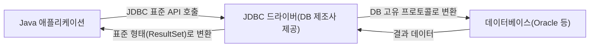

## JDBC는 무엇을 연결하는 다리인가

Java 프로그램은 그 자체로 Oracle이나 MySQL 같은 데이터베이스와 직접 대화할 수 없습니다. **JDBC**(Java DataBase Connectivity, 자바 데이터베이스 연결)는 "Java 코드는 이 정해진 방법으로만 요청하면, 어떤 DB든 알아서 응답을 돌려준다"는 **표준 인터페이스**(interface, 11_java-exception-collection에서 다룬 것과 같은 의미의, 구현은 없고 규칙만 정한 설계)의 집합입니다.


```mermaid
flowchart LR
    A["Java 애플리케이션"] -->|"JDBC 표준 API 호출"| B["JDBC 드라이버(DB 제조사 제공)"]
    B -->|"DB 고유 프로토콜로 변환"| C["데이터베이스(Oracle 등)"]
    C -->|"결과 데이터"| B
    B -->|"표준 형태(ResultSet)로 변환"| A
```

Java 코드는 항상 같은 JDBC API(`Connection`, `Statement`, `ResultSet` 등)만 호출하면 되고, 실제로 Oracle과 대화하는 세부 방식은 **드라이버**(driver, DB 제조사가 만들어 배포하는 통역 프로그램)가 담당합니다. 이 구조 덕분에 DB를 바꾸더라도 애플리케이션 코드 대부분은 그대로 두고 드라이버만 교체하면 됩니다.

## JDBC 프로그래밍의 고정된 5단계

<Callout type="warning">
  **자주 틀리는 점:** `rs.next()`를 호출하지 않고 바로 `rs.getString(...)`을 부르면 커서가 아직 첫 행 이전에 있어 예외가 발생합니다. "이 코드에서 `while (rs.next())`를 빼면 어떻게 되는가?"라는 문제가 자주 나오는데, 정답은 "무한 반복이 아니라 오류가 발생해 조회가 실행조차 안 된다"입니다.
</Callout>

### 5. 자원 반납(close)

```java
rs.close();
pstmt.close();
conn.close();
```

`Connection`, `Statement`(및 `PreparedStatement`), `ResultSet`은 모두 JVM 바깥의 DB 서버 쪽 자원을 차지하고 있습니다. 다 쓴 뒤 닫지 않으면 그 연결이 계속 점유된 채로 남아 DB가 허용하는 동시 연결 수를 소진시키는 **자원 누수**(resource leak)가 발생합니다.

## 예외 처리와 안전한 자원 반납 패턴

11_java-exception-collection에서 다룬 `try-catch-finally` 구조가 JDBC 코드에서 가장 정형화된 형태로 등장합니다. `Class.forName`, `getConnection`, `executeQuery` 등은 모두 실패할 수 있는 **checked exception**(컴파일 시점에 처리를 강제하는 예외, 11편 참고)을 던지도록 선언되어 있으므로 반드시 처리해야 합니다.

```java
Connection conn = null;
PreparedStatement pstmt = null;
ResultSet rs = null;

try {
  conn = DriverManager.getConnection(url, "user", "password");
  pstmt = conn.prepareStatement(sql);
  rs = pstmt.executeQuery();
  while (rs.next()) {
    System.out.println(rs.getString("이름"));
  }
} catch (SQLException e) {
  System.out.println("DB 처리 중 오류: " + e.getMessage());
} finally {
  try {
    if (rs != null) rs.close();
    if (pstmt != null) pstmt.close();
    if (conn != null) conn.close();
  } catch (SQLException e) {
    System.out.println("자원 반납 중 오류: " + e.getMessage());
  }
}
```

`finally` 블록은 `try` 블록이 정상 종료되든 예외로 중간에 빠져나가든 **반드시 실행됩니다**. 그래서 자원을 닫는 코드를 `finally`에 넣으면, 쿼리 실행 도중 예외가 터지더라도 이미 열린 연결이 닫히지 않은 채 남는 사태를 막을 수 있습니다.

<Callout type="warning">
  **자주 틀리는 점:** `finally` 블록 안의 `close()` 호출 자체도 `SQLException`을 던질 수 있다는 점을 놓치기 쉽습니다. `finally` 안에서 예외 처리 없이 `rs.close(); pstmt.close(); conn.close();`를 그냥 나열하면, `rs.close()`에서 예외가 발생했을 때 그 아래 `pstmt.close()`, `conn.close()`가 **아예 실행되지 못하고 건너뛰어집니다.** 그래서 `finally` 안에 또 다른 `try-catch`가 필요합니다.
</Callout>

Java 7부터는 이 반복적인 패턴을 줄여주는 **try-with-resources** 문법을 지원합니다. `Connection`, `PreparedStatement`, `ResultSet`이 모두 `AutoCloseable`(자동으로 닫히는) 인터페이스를 구현하고 있어서, 다음처럼 쓰면 블록을 벗어날 때 **선언의 역순으로 자동으로 close()가 호출**됩니다.

```java
String sql = "SELECT 이름, 성적 FROM 수강 WHERE 학번 = ?";

try (Connection conn = DriverManager.getConnection(url, "user", "password");
     PreparedStatement pstmt = conn.prepareStatement(sql)) {
  pstmt.setString(1, "S01");
  try (ResultSet rs = pstmt.executeQuery()) {
    while (rs.next()) {
      System.out.println(rs.getString("이름"));
    }
  }
} catch (SQLException e) {
  System.out.println("DB 처리 중 오류: " + e.getMessage());
}
```

`try` 옆 괄호 안에 선언한 자원은 `finally` 절을 직접 쓰지 않아도 자동으로 닫히므로, 코드가 훨씬 짧아지고 자원 반납 순서 실수도 줄어듭니다. 최신 기출·모의 문제에서는 이 문법이 정답 선택지로도, "왜 이 방식이 더 안전한가"를 묻는 서술형으로도 등장할 수 있습니다.

## 트랜잭션과 자원 반납의 관계

16편에서 `DELETE`·`TRUNCATE`의 되돌리기 가능 여부를 언급했는데, JDBC의 `Connection`은 기본적으로 **자동 커밋**(auto-commit) 모드로 동작해 SQL 문 하나가 실행될 때마다 즉시 확정(commit, 변경을 실제로 반영)됩니다. 여러 SQL을 하나의 작업 단위로 묶어 "전부 성공하거나 전부 취소"하고 싶다면 자동 커밋을 꺼야 합니다.

```java
conn.setAutoCommit(false);
try {
  // INSERT, UPDATE 등 여러 SQL 실행
  conn.commit();   // 모두 성공 시 확정
} catch (SQLException e) {
  conn.rollback();  // 하나라도 실패 시 전부 되돌림
}
```

`commit()`은 지금까지의 변경을 DB에 실제로 반영해 확정하고, `rollback()`(되돌리기)은 마지막 커밋 이후의 변경 사항을 모두 취소해 이전 상태로 되돌립니다. 계좌 이체처럼 "출금과 입금이 둘 다 성공해야만 의미가 있는" 작업에서 이 구조가 필수적입니다.

## 핵심 정리

- JDBC는 Java 코드와 DB 사이의 표준 인터페이스이며, DB 제조사가 제공하는 드라이버가 실제 통신을 담당한다.
- JDBC 코드의 고정 순서는 드라이버 로딩 → `Connection` 생성 → `Statement`/`PreparedStatement` 준비 → `executeQuery()`로 실행하고 `ResultSet`을 `rs.next()`로 순회 → `close()`로 자원 반납이다.
- `PreparedStatement`의 자리표시자(`?`)는 1번부터 번호가 매겨지며, `setXxx(번호, 값)`으로 값을 채운다.
- 자원은 만든 순서의 역순(`ResultSet → Statement → Connection`)으로 닫아야 하며, `finally` 블록 안에서 각 `close()` 호출 전에 `null` 검사와 별도의 예외 처리가 필요하다.
- Java 7 이상의 try-with-resources 문법을 쓰면 `AutoCloseable` 자원이 자동으로, 선언의 역순으로 닫힌다.
- 여러 SQL을 하나의 단위로 묶으려면 `setAutoCommit(false)` 후 `commit()`/`rollback()`으로 직접 트랜잭션을 제어한다.

## 마무리 복습

<Quiz
  questionNumber={1}
  question={"JDBC 프로그래밍의 일반적인 실행 순서로 옳은 것은?"}
  options={["ResultSet 처리 → Connection 생성 → 드라이버 로딩 → close","드라이버 로딩 → Connection 생성 → Statement 준비 → 실행·ResultSet 처리 → close","Statement 준비 → 드라이버 로딩 → Connection 생성 → close","close → Connection 생성 → 드라이버 로딩 → 실행"]}
  correctAnswer={2}
  explanation={"JDBC 코드는 드라이버 로딩으로 시작해 Connection을 얻고, 그 Connection으로 Statement를 준비해 SQL을 실행한 뒤 ResultSet을 처리하고, 마지막에 자원을 close()로 반납하는 순서를 따른다."}
/>

<Quiz
  questionNumber={2}
  question={"PreparedStatement에서 pstmt.setString(1, 'S01') 코드의 1이 의미하는 것은?"}
  options={["SQL 문에서 첫 번째로 등장하는 물음표(?) 자리","결과로 반환될 행의 첫 번째 순번","배열 인덱스 규칙에 따른 0번째 자리","DB 연결 시도 횟수"]}
  correctAnswer={1}
  explanation={"PreparedStatement의 자리표시자(?) 번호는 SQL 문에 등장하는 순서대로 1번부터 매겨지며, setString(1, 값)은 첫 번째 물음표 자리에 그 값을 채운다."}
/>

<Quiz
  questionNumber={3}
  question={"다음 코드에서 while (rs.next()) 부분을 실수로 빼고 바로 rs.getString(&quot;이름&quot;)을 호출하면 어떤 일이 벌어지는가?"}
  options={["첫 번째 행의 값이 정상적으로 출력된다","커서가 첫 행 이전을 가리키고 있어 예외가 발생한다","모든 행이 무한히 반복 출력된다","ResultSet이 자동으로 첫 행으로 이동한 뒤 값을 반환한다"]}
  correctAnswer={2}
  explanation={"ResultSet은 생성 직후 첫 번째 행보다 한 칸 앞을 가리키고 있으므로, next()를 호출해 커서를 옮기지 않은 상태에서 값을 읽으려 하면 예외가 발생한다."}
/>

## 참고 자료

- [Oracle JDBC 튜토리얼(Java SE Documentation)](https://docs.oracle.com/javase/tutorial/jdbc/)
- [국가평생교육진흥원 독학학위제](https://bdes.nile.or.kr)
