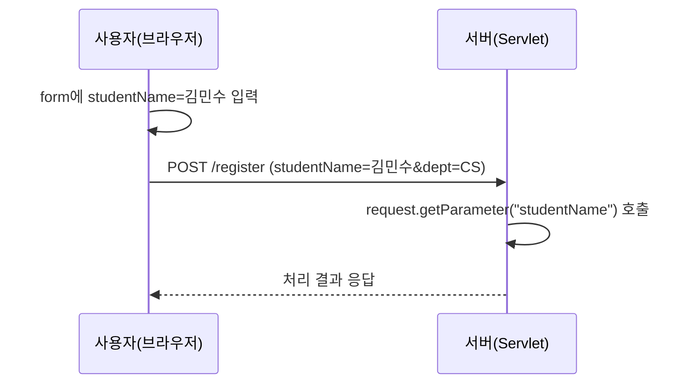
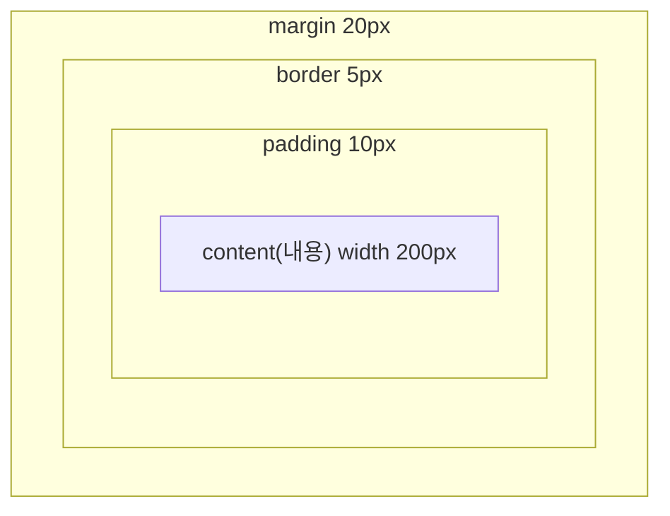

<Callout type="info">
  **이번 문서의 목표:** 이 문서를 다 읽으면 HTML 문서의 기본 골격과 폼(form) 요소가 서버로 어떤 데이터를 어떤 이름으로 보내는지 설명할 수 있고, CSS 선택자의 우선순위와 박스 모델을 계산할 수 있으며, 간단한 JavaScript 이벤트 처리 코드의 동작을 예측할 수 있게 됩니다.
</Callout>

## 이 편의 위치 — 클라이언트에서 벌어지는 일

> **쉽게 말하면:** 이 편은 사용자의 화면(브라우저) 안에서 벌어지는 일을, 다음 편(20편)은 그 요청이 서버에 도착한 뒤 벌어지는 일을 다룹니다.

05편에서 클라이언트-서버 구조의 큰 그림을 봤습니다. 웹 브라우저(클라이언트)는 **HTML**(HyperText Markup Language, 문서의 구조를 표시하는 마크업 언어)로 뼈대를 만들고, **CSS**(Cascading Style Sheets, 계단식 스타일 시트)로 겉모습을 꾸미고, **JavaScript**로 동작을 붙입니다. 사용자가 폼에 입력해 제출(submit)하면 그 데이터가 서버로 전송되는데, 서버 쪽에서 이 요청을 받아 처리하는 **Servlet**·**JSP**는 20편에서 다룹니다. 이 편은 그 요청이 만들어지기까지, 즉 브라우저 안에서 벌어지는 구조·표현·동작 세 가지에 집중합니다.

## HTML 기본 구조

> **쉽게 말하면:** HTML 문서는 상자 안에 상자를 겹겹이 넣는 방식으로 내용의 뼈대를 짭니다.

```html
<!DOCTYPE html>
<html>
  <head>
    <title>학생 등록</title>
  </head>
  <body>
    <h1>학생 정보 입력</h1>
    <p>아래 form을 작성해 주세요.</p>
  </body>
</html>
```

| 태그(tag) | 역할 |
|-----------|------|
| `!DOCTYPE html` | 이 문서가 최신 HTML(HTML5) 표준을 따른다고 브라우저에 선언 |
| `html` | 문서 전체를 감싸는 최상위 요소(element) |
| `head` | 화면에 직접 보이지 않는 정보(제목, 문자 인코딩, 외부 CSS·JS 연결 등) |
| `title` | 브라우저 탭에 표시되는 문서 제목 |
| `body` | 화면에 실제로 보이는 모든 내용 |

HTML의 각 태그는 대부분 여는 태그(`h1`)와 닫는 태그(`/h1`)로 내용을 감싸며, 이렇게 감싼 하나의 단위를 **요소**(element)라고 부릅니다. 여는 태그 안에는 그 요소의 성질을 추가로 지정하는 **속성**(attribute)을 `이름="값"` 형태로 붙일 수 있습니다(예: `img` 태그의 `src` 속성).

## 폼(form) 요소와 요청 파라미터

> **쉽게 말하면:** form은 사용자가 입력한 값들을 이름표를 붙여 서버로 보내는 소포 상자입니다.

```html
<form action="/register" method="post">
  <input type="text" name="studentName" />
  <input type="password" name="studentPw" />
  <select name="dept">
    <option value="CS">컴퓨터공학</option>
    <option value="EE">전자공학</option>
  </select>
  <input type="checkbox" name="agree" value="Y" />
  <input type="submit" value="등록" />
</form>
```

| 속성 | 의미 |
|------|------|
| `action` | 제출된 데이터를 받을 서버 쪽 주소(URL) |
| `method` | 전송 방식. `get` 또는 `post` |
| `name` | 서버가 이 값을 받을 때 사용할 파라미터(parameter) 이름 |

사용자가 이름 칸에 "김민수"를, 학과 선택에서 "컴퓨터공학"을 고르고 등록 버튼을 누르면, 브라우저는 각 `input`·`select`의 `name` 속성을 열쇠(key)로, 사용자가 입력·선택한 값을 값(value)으로 묶어 서버에 전달합니다. 20편에서 다룰 Servlet 코드는 이 값을 `request.getParameter("studentName")`처럼 **폼에 적힌 name 값과 정확히 일치하는 문자열**로 꺼내 쓰므로, HTML의 `name` 속성이 서버 코드와 이어지는 유일한 연결 고리라는 점이 중요합니다.



`method="get"`과 `method="post"`의 차이도 자주 출제됩니다.

| 구분 | GET | POST |
|------|-----|------|
| 데이터 위치 | URL 뒤에 붙음(`?studentName=김민수`) | 요청 본문(body)에 숨겨져 전송됨 |
| 길이 제한 | 브라우저·서버별 제한 있음 | 상대적으로 여유 있음 |
| 용도 | 조회처럼 서버 상태를 바꾸지 않는 요청 | 등록·수정처럼 서버 상태를 바꾸는 요청 |
| 보안 | URL에 그대로 노출되어 비밀번호 등에 부적합 | 본문에 담겨 URL에 노출되지 않음(암호화 여부와는 별개) |

<Callout type="warning">
  **자주 틀리는 점:** "POST 방식은 안전하니 비밀번호도 그대로 노출되지 않는다"고 오해하기 쉽습니다. POST는 URL에 값이 노출되지 않을 뿐, HTTPS 같은 암호화 없이는 통신 과정에서 값이 그대로 읽힐 수 있습니다. GET·POST의 차이는 **전송 방식의 차이**이지 **암호화 여부**가 아닙니다.
</Callout>

## CSS 선택자와 우선순위

> **쉽게 말하면:** CSS 선택자는 "이 스타일을 어떤 태그에 적용할지" 고르는 규칙이고, 여러 규칙이 겹치면 더 구체적인 규칙이 이깁니다.

```html
<p id="notice" class="highlight">등록이 완료되었습니다.</p>
```

```css
p { color: black; }
.highlight { color: blue; }
#notice { color: red; }
```

| 선택자 종류 | 문법 | 이 예시에서 가리키는 대상 |
|-------------|------|------------------------------|
| 태그 선택자 | `p` | 모든 `p` 태그 |
| 클래스 선택자 | `.highlight` | `class="highlight"`를 가진 모든 요소 |
| 아이디 선택자 | `#notice` | `id="notice"`를 가진 요소(문서 전체에서 유일해야 함) |

세 규칙이 모두 같은 `p` 태그에 적용될 수 있지만, 최종적으로 적용되는 색은 **빨간색**(`red`)입니다. CSS는 선택자의 **명시도**(specificity, 얼마나 구체적으로 대상을 지정했는지 나타내는 점수)가 높은 규칙을 우선 적용하며, 명시도는 아이디 선택자 > 클래스 선택자 > 태그 선택자 순으로 높습니다.

<Callout type="warning">
  **자주 틀리는 점:** "코드에서 나중에 적힌 규칙이 무조건 이긴다"고 착각하기 쉽습니다. CSS의 이름(Cascading, 계단식)은 "위에서 아래로 순서대로 겹쳐 쌓인다"는 뜻이지만, **명시도가 다르면 순서와 상관없이 명시도가 높은 규칙이 이깁니다.** 명시도가 완전히 같을 때만 코드에서 나중에 적힌 규칙이 이깁니다.
</Callout>

## 박스 모델(box model)

> **쉽게 말하면:** 화면의 모든 요소는 내용물 → 안쪽 여백 → 테두리 → 바깥쪽 여백 순서로 겹겹이 둘러싸인 상자입니다.

```css
div {
  width: 200px;
  padding: 10px;
  border: 5px solid black;
  margin: 20px;
}
```



| 영역 | 뜻 |
|------|-----|
| `content`(내용) | 실제 글자·이미지가 표시되는 영역. `width`·`height`로 지정한 크기 |
| `padding`(안쪽 여백) | 내용과 테두리 사이의 여백. 배경색이 여기까지 칠해짐 |
| `border`(테두리) | 상자의 테두리 선 |
| `margin`(바깥쪽 여백) | 이 요소와 다른 요소 사이의 간격. 배경색이 칠해지지 않음 |

기본 박스 모델(`box-sizing: content-box`, 지정하지 않았을 때의 기본값)에서 요소가 실제로 화면에서 차지하는 가로 폭은 다음과 같이 계산됩니다.

$$
\text{전체 가로 폭} = \text{width} + \text{padding} \times 2 + \text{border} \times 2
$$

- $\text{width}$: 내용 영역의 너비로 지정한 값(위 예시 `200px`)
- $\text{padding} \times 2$: 좌우 양쪽에 각각 붙는 안쪽 여백(위 예시 `10px`씩 → `20px`)
- $\text{border} \times 2$: 좌우 양쪽 테두리 두께(위 예시 `5px`씩 → `10px`)

$$
200 + (10 \times 2) + (5 \times 2) = 230
$$

즉 `width: 200px`으로 지정했더라도 실제로 화면에서 차지하는 가로 폭은 `230px`입니다. `margin`(바깥쪽 여백)은 이 계산에 포함되지 않는데, margin은 "이 상자 자체의 크기"가 아니라 "이 상자와 다른 상자 사이의 거리"이기 때문입니다.

<Callout type="warning">
  **자주 틀리는 점:** `width`에 지정한 값이 곧 화면에서 차지하는 전체 크기라고 착각하기 쉽습니다. 기본 박스 모델에서는 `padding`과 `border`가 `width`에 **더해집니다.** 이 문제를 피하려고 실무에서는 `box-sizing: border-box`(padding·border를 width 안에 포함시키는 설정)를 자주 쓰지만, 독학사 시험에서 별도 언급이 없으면 기본값(`content-box`) 기준으로 계산해야 합니다.
</Callout>

## JavaScript 이벤트 처리

> **쉽게 말하면:** 이벤트 처리는 "사용자가 무언가를 하면(클릭 등), 미리 정해 둔 함수를 실행하라"고 미리 약속해 두는 것입니다.

```html
<input type="text" id="nameInput" />
<button id="submitBtn">확인</button>
<p id="result"></p>
```

```js
const btn = document.getElementById("submitBtn");

btn.addEventListener("click", function () {
  const name = document.getElementById("nameInput").value;
  document.getElementById("result").innerText = name + "님, 확인되었습니다.";
});
```

| 코드 조각 | 역할 |
|-----------|------|
| `document.getElementById("id값")` | DOM(Document Object Model, 09_java-basics-1이 아니라 웹프로그래밍 과목에서 다루는 "HTML 문서를 트리 구조 객체로 다루는 방법")에서 특정 요소를 하나 찾아온다 |
| `addEventListener("click", 함수)` | 그 요소를 클릭했을 때 실행할 함수를 등록한다 |
| `.value` | `input` 요소에 사용자가 입력한 현재 값 |
| `.innerText` | 요소 안에 표시되는 글자 내용을 읽거나 바꾼다 |

사용자가 입력 칸에 "이서연"을 입력하고 버튼을 클릭하면, 등록해 둔 함수가 실행되어 `nameInput`의 `value`("이서연")를 읽고, 그 값을 이어붙인 문자열을 `result` 요소의 `innerText`에 대입합니다. 이 코드는 form을 실제로 제출하지 않고도 **브라우저 안에서만** 즉시 화면을 바꾸는데, 이런 방식을 폼 제출·서버 응답 없이 처리한다고 해서 20편에서 배울 서버 측 처리와 대비해 이해해 두면 두 편의 역할 구분이 분명해집니다.

<CodePlayground
  template="static"
  activeFile="/index.html"
  showConsole
  label="입력값을 바꿔가며 버튼을 눌러 결과 문구가 어떻게 바뀌는지 확인하세요"
  files={{
    '/index.html': `<input type="text" id="nameInput" placeholder="이름 입력" />
<button id="submitBtn">확인</button>
<p id="result"></p>`,
    '/styles.css': `#result {
  color: blue;
  font-weight: bold;
}`,
  }}
/>

폼 제출을 가로채 서버로 보내지 않고 처리하고 싶을 때는 `submit` 이벤트에서 **기본 동작을 취소**해야 합니다.

```js
const form = document.getElementById("myForm");

form.addEventListener("submit", function (event) {
  event.preventDefault(); // 폼의 기본 제출 동작(페이지 새로고침·서버 전송)을 막음
  console.log("서버로 보내지 않고 자바스크립트가 먼저 처리함");
});
```

`event.preventDefault()`를 호출하지 않으면, 이 함수가 실행된 뒤에도 브라우저는 원래대로 form을 제출해 페이지를 새로고침하며 서버로 요청을 보냅니다. 이 한 줄의 유무가 "자바스크립트로만 처리하는 코드"와 "자바스크립트 처리 후 서버로도 전송되는 코드"를 가르는 지점이라 출제 빈도가 높습니다.

## 핵심 정리

- HTML은 `html > head, body` 구조를 기본 골격으로 하며, `form`의 각 입력 요소는 `name` 속성 값을 열쇠로 삼아 서버에 데이터를 전달한다.
- GET은 URL에, POST는 요청 본문에 데이터를 담아 전송하며 차이는 전송 방식이지 암호화 여부가 아니다.
- CSS는 아이디 > 클래스 > 태그 순으로 명시도가 높은 선택자가 이기며, 명시도가 같을 때만 나중에 적힌 규칙이 이긴다.
- 기본 박스 모델에서 요소의 전체 가로 폭은 `width + padding × 2 + border × 2`로 계산되고, margin은 이 계산에 포함되지 않는다.
- `addEventListener`로 이벤트를 등록하고, `event.preventDefault()`로 폼의 기본 제출 동작을 막아 자바스크립트가 먼저 처리하도록 만들 수 있다.

## 마무리 복습

<Quiz
  questionNumber={1}
  question="다음 form에서 서버가 사용자가 입력한 이름 값을 받을 때 기준이 되는 것은? &lt;input type=&quot;text&quot; name=&quot;studentName&quot; /&gt;"
  options={['input 태그가 화면에 나타나는 순서', 'id 속성 값', 'name 속성 값인 studentName', 'input 태그의 type 속성 값인 text']}
  correctAnswer={3}
  explanation="폼 데이터는 각 입력 요소의 name 속성 값을 열쇠(key)로 삼아 서버에 전달되므로, 서버는 request.getParameter(&quot;studentName&quot;)처럼 name 속성 값과 정확히 일치하는 문자열로 값을 꺼낸다."
  optionExplanations={['화면에 나타나는 순서는 서버 전달 방식과 무관하다', 'id는 주로 자바스크립트·CSS에서 요소를 찾을 때 쓰이며 서버 전달의 기준이 아니다', '정답 — name 속성이 서버와 연결되는 열쇠다', 'type은 입력 형식을 지정할 뿐 서버 전달 키가 아니다']}
/>

<Quiz
  questionNumber={2}
  question="HTTP GET과 POST 방식의 차이에 대한 설명으로 옳은 것은?"
  options={['POST는 항상 암호화되어 전송되므로 GET보다 안전하다', 'GET은 데이터를 URL에 담아 보내고, POST는 요청 본문에 담아 보낸다', 'GET과 POST는 데이터 전송 위치가 같고 이름만 다르다', 'POST는 조회 전용이고 GET은 등록·수정 전용이다']}
  correctAnswer={2}
  explanation="GET은 요청 데이터를 URL 뒤에 붙여 전송하고 POST는 요청 본문(body)에 담아 전송한다는 것이 핵심 차이이며, 이는 암호화 여부와는 별개의 문제다."
  optionExplanations={['POST 자체가 암호화를 보장하지는 않으며, 암호화는 HTTPS 같은 별도 기술이 담당한다', '정답 — 데이터가 담기는 위치가 다르다는 것이 핵심 차이다', '전송 위치가 서로 다르므로 이 설명은 틀렸다', '용도 구분이 반대로 설명되어 있다']}
/>

<Quiz
  questionNumber={3}
  question={"다음 CSS 규칙이 모두 같은 p 태그(id=\"notice\", class=\"highlight\")에 적용될 때 최종 적용되는 색은?\n\n```css\np {\n  color: black;\n}\n.highlight {\n  color: blue;\n}\n#notice {\n  color: red;\n}\n```"}
  options={['black', 'blue', 'red', '셋 중 어느 것도 적용되지 않는다']}
  correctAnswer={3}
  explanation="CSS는 명시도가 높은 선택자를 우선 적용하며, 아이디 선택자(#notice)가 클래스 선택자·태그 선택자보다 명시도가 높으므로 red가 최종 적용된다."
  optionExplanations={['태그 선택자는 명시도가 가장 낮아 다른 규칙에 밀린다', '클래스 선택자보다 아이디 선택자의 명시도가 더 높다', '정답 — 아이디 선택자의 명시도가 가장 높다', 'CSS 규칙이 충돌하면 명시도가 가장 높은 규칙이 반드시 적용된다']}
/>

<Quiz
  questionNumber={4}
  question={"다음처럼 설정된 요소가 기본 박스 모델에서 실제로 차지하는 가로 폭은?\n\n```css\nwidth: 200px;\npadding: 10px;\nborder: 5px solid black;\nmargin: 20px;\n```"}
  options={['200px', '220px', '230px', '270px']}
  correctAnswer={3}
  explanation="기본 박스 모델에서 전체 가로 폭은 width + padding × 2 + border × 2로 계산된다. 200 + (10 × 2) + (5 × 2) = 230이며, margin은 이 계산에 포함되지 않는다."
  optionExplanations={['padding과 border가 width에 더해진다는 것을 반영하지 않은 값이다', 'padding만 반영하고 border를 빠뜨린 계산이다', '정답 — padding과 border를 양쪽에 각각 더한 값이다', 'margin까지 더해 계산한 값으로, margin은 요소 자체의 크기 계산에 포함되지 않는다']}
/>

<Quiz
  questionNumber={5}
  question="form의 submit 이벤트 처리 함수 안에서 event.preventDefault()를 호출하지 않으면 벌어지는 일로 옳은 것은?"
  options={['자바스크립트 처리 함수가 아예 실행되지 않는다', '함수 실행 후에도 브라우저가 폼을 원래대로 제출해 서버로 요청을 보낸다', '폼이 제출되지 않고 항상 화면만 갱신된다', 'preventDefault 호출 여부는 결과에 영향을 주지 않는다']}
  correctAnswer={2}
  explanation="preventDefault()는 이벤트의 기본 동작(이 경우 폼 제출)을 취소하는 메서드다. 이를 호출하지 않으면 등록한 함수가 실행된 뒤에도 브라우저는 원래의 폼 제출 동작을 그대로 수행해 서버로 요청을 보낸다."
  optionExplanations={['이벤트 리스너에 등록된 함수는 preventDefault 호출 여부와 관계없이 실행된다', '정답 — 기본 동작을 막지 않으면 폼이 그대로 제출된다', '기본 동작을 막지 않으면 오히려 폼이 서버로 제출된다', 'preventDefault 호출 여부에 따라 서버 전송 여부가 갈리므로 결과에 직접 영향을 준다']}
/>

<Quiz
  questionNumber={6}
  question="HTML 문서의 head 요소와 body 요소에 대한 설명으로 옳은 것은?"
  options={['head는 화면에 보이는 모든 내용을 담고, body는 화면에 보이지 않는 정보를 담는다', 'head는 제목·문자 인코딩 등 화면에 직접 보이지 않는 정보를 담고, body는 화면에 실제로 보이는 내용을 담는다', 'head와 body는 서로 바꿔 써도 결과가 동일하다', 'head 안에는 title 태그를 쓸 수 없다']}
  correctAnswer={2}
  explanation="head는 title, 문자 인코딩, 외부 CSS·JS 연결처럼 화면에 직접 보이지 않는 정보를 담는 영역이고, body는 h1·p 같은 화면에 실제로 표시되는 모든 내용을 담는 영역이다."
  optionExplanations={['head와 body의 역할 설명이 서로 뒤바뀌었다', '정답 — head는 비가시 정보, body는 가시 내용을 담는다는 것이 두 영역의 핵심 차이다', 'head와 body는 역할이 명확히 다르므로 바꿔 쓰면 문서 구조와 표시 결과가 달라진다', 'title은 head 안에 들어가는 대표적인 태그로, 브라우저 탭에 표시되는 문서 제목을 정한다']}
/>

<Quiz
  questionNumber={7}
  question="document.getElementById('submitBtn')과 addEventListener('click', 함수)를 함께 쓰는 코드의 동작으로 옳은 것은?"
  options={['페이지가 로드되는 즉시 등록한 함수가 한 번 실행된다', 'id가 submitBtn인 요소를 찾아 그 요소가 클릭될 때마다 등록한 함수를 실행한다', 'submitBtn이라는 이름의 CSS 클래스를 가진 모든 요소를 찾는다', 'addEventListener는 서버로 요청을 보내는 함수다']}
  correctAnswer={2}
  explanation="document.getElementById로 id 값이 일치하는 요소 하나를 DOM에서 찾아온 뒤, addEventListener('click', 함수)로 그 요소가 클릭될 때마다 실행할 함수를 등록해 두는 것이 이 코드의 동작이다."
  optionExplanations={['addEventListener로 등록된 함수는 클릭 같은 이벤트가 실제로 발생할 때 실행되며, 페이지 로드 즉시 실행되는 것이 아니다', '정답 — getElementById로 요소를 찾고 addEventListener로 클릭 시 실행할 함수를 등록한다', 'getElementById는 id 속성 값으로 요소를 찾는 함수이며 CSS 클래스를 찾는 것은 querySelector 등 다른 방식이다', 'addEventListener는 브라우저 안에서 이벤트에 반응해 함수를 실행하는 역할이며, 그 자체로 서버 요청을 보내지 않는다']}
/>

## 참고 자료

- [MDN Web Docs - HTML](https://developer.mozilla.org/en-US/docs/Web/HTML)
- [MDN Web Docs - CSS](https://developer.mozilla.org/en-US/docs/Web/CSS)
