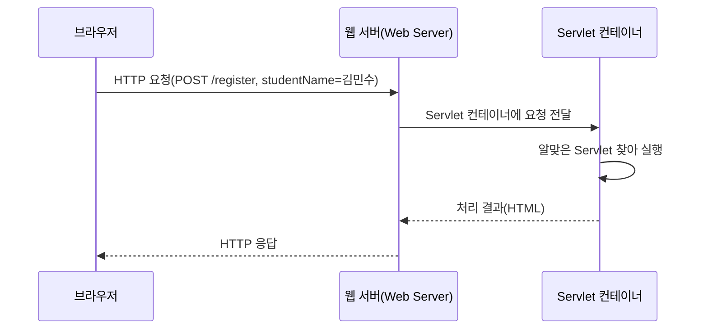
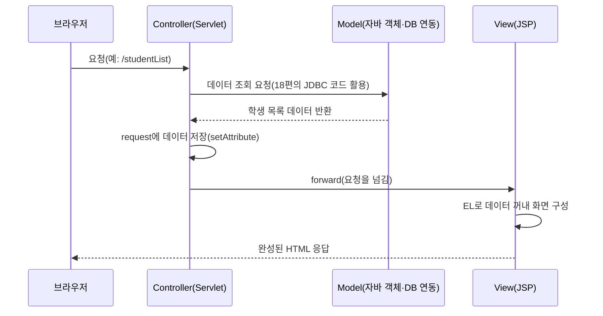

<Callout type="info">
  **이번 문서의 목표:** 이 문서를 다 읽으면 19편에서 만든 form이 서버에 도착한 뒤 Servlet이 어떤 순서로 요청을 처리하는지 설명할 수 있고, JSP 스크립틀릿·EL 문법을 읽을 수 있으며, MVC 패턴에서 각 구성 요소의 역할과 세션·쿠키의 차이를 구분할 수 있게 됩니다.
</Callout>

## HTTP 요청·응답의 왕복 구조

> **쉽게 말하면:** 웹은 "손님이 주문서를 내밀면(요청), 주방이 요리해서 접시를 돌려주는(응답)" 식당과 같습니다.

**HTTP**(HyperText Transfer Protocol, 하이퍼텍스트 전송 규약)는 브라우저와 서버가 주고받는 메시지의 형식을 정한 약속입니다. 19편의 form을 제출하면 브라우저는 **요청**(request)을 만들어 서버에 보내고, 서버는 그 요청을 처리한 뒤 **응답**(response)을 돌려줍니다.



**Servlet**(서블릿, Java로 작성된 서버 쪽 프로그램 조각)은 Java 코드로 이 요청을 받아 처리하는 방식이고, **JSP**(JavaServer Pages)는 HTML 문서 안에 Java 코드를 끼워 넣어 화면을 만드는 방식입니다. 둘 다 **Servlet 컨테이너**(Servlet container, Tomcat 등 Servlet·JSP를 실행해 주는 프로그램) 위에서 동작합니다.

## Servlet의 생명주기(life cycle)

> **쉽게 말하면:** Servlet은 "처음 한 번만 준비하고, 요청이 올 때마다 반복 실행하고, 서버가 종료될 때 한 번만 정리"하는 세 단계로 삽니다.

```java
public class RegisterServlet extends HttpServlet {

  @Override
  public void init() {
    System.out.println("1) 초기화 — 서버가 이 Servlet을 처음 메모리에 올릴 때 한 번만 실행");
  }

  @Override
  protected void doPost(HttpServletRequest request, HttpServletResponse response)
      throws IOException {
    System.out.println("2) 서비스 — 요청이 올 때마다 매번 실행");
    String name = request.getParameter("studentName");
    response.getWriter().println(name + "님, 등록되었습니다.");
  }

  @Override
  public void destroy() {
    System.out.println("3) 소멸 — 서버가 종료되거나 이 Servlet을 내릴 때 한 번만 실행");
  }
}
```

| 단계 | 메서드 | 호출 시점 | 호출 횟수 |
|------|--------|-----------|-----------|
| 초기화 | `init()` | 이 Servlet이 처음 메모리에 로드될 때 | 딱 1번 |
| 서비스 | `service()` → `doGet()`/`doPost()` | 요청이 들어올 때마다 | 요청 횟수만큼 |
| 소멸 | `destroy()` | 서버 종료 또는 컨테이너가 이 Servlet을 내릴 때 | 딱 1번 |

Servlet 컨테이너는 같은 Servlet 클래스의 객체를 요청마다 새로 만들지 않고 **하나만 만들어 재사용**합니다(싱글턴, singleton과 유사한 방식). 그래서 `init()`은 한 번만 불리고, 요청이 100번 오면 `doPost()`(또는 `doGet()`)만 100번 불립니다. 브라우저가 form을 `method="post"`로 제출했다면 컨테이너는 자동으로 `doPost()`를 실행하고, `method="get"`이었다면 `doGet()`을 실행합니다.

<Callout type="warning">
  **자주 틀리는 점:** "요청이 올 때마다 Servlet 객체가 새로 생성된다"고 착각하기 쉽습니다. 실제로는 Servlet 객체는 하나만 생성되어 재사용되고, **요청마다 새로 생성되는 것은 `HttpServletRequest`·`HttpServletResponse` 객체**입니다. 이 차이 때문에 Servlet의 인스턴스 변수(필드)에 요청별로 달라지는 값을 저장하면 여러 사용자의 요청이 뒤섞이는 문제가 생길 수 있습니다.
</Callout>

`request.getParameter("studentName")`은 19편에서 다룬 form의 `name="studentName"` 값을 그대로 꺼내오는 코드입니다. HTML의 `name` 속성 문자열과 이 문자열이 **정확히 일치**해야 값을 제대로 받을 수 있습니다.

## JSP — 스크립틀릿과 EL

> **쉽게 말하면:** JSP는 HTML 안에 Java 코드를 섞어 쓰는 방식이고, EL은 그 Java 코드를 더 짧게 쓰는 표기법입니다.

```jsp
<%@ page contentType="text/html; charset=UTF-8" %>
<html>
<body>
  <%
    String name = request.getParameter("studentName");
    int count = 3;
  %>
  <h1><%= name %>님, 환영합니다.</h1>
  <p>남은 등록 인원: <%= count %>명</p>
</body>
</html>
```

| 표기 | 이름 | 역할 |
|------|------|------|
| `<% ... %>` | 스크립틀릿(scriptlet) | Java 코드를 그대로 실행. 화면에 출력하지 않음 |
| `<%= ... %>` | 표현식(expression) | 계산 결과를 그 자리에 문자열로 출력 |
| `<%@ page ... %>` | 지시어(directive) | 이 JSP 페이지 전체에 적용할 설정(문자 인코딩 등) |

스크립틀릿은 사실상 Servlet의 `doGet()`/`doPost()` 안에 들어갈 Java 코드를 HTML 사이사이에 흩어 쓰는 것과 같습니다. 실제로 JSP 파일은 서버에서 실행되기 전에 **Servlet 코드로 자동 변환된 뒤 컴파일**되는데, 이 변환 과정 때문에 JSP와 Servlet은 "HTML 중심으로 쓰느냐, Java 코드 중심으로 쓰느냐"만 다를 뿐 근본적으로 같은 실행 구조를 공유합니다.

스크립틀릿 안에 Java 로직을 많이 넣으면 HTML과 Java가 뒤섞여 읽기 어려워지므로, 최신 JSP에서는 **EL**(Expression Language, 표현 언어)과 **JSTL**(JSP Standard Tag Library)을 함께 써서 화면 쪽 코드를 단순화합니다.

```jsp
<h1>${studentName}님, 환영합니다.</h1>
```

`${studentName}`은 `request`, `session`, `application`(19편~20편에서 다루는 요청·세션·애플리케이션 범위, scope) 등에 저장된 값을 자동으로 찾아 출력하는 EL 문법입니다. `<%= request.getParameter("studentName") %>`과 비슷한 결과를 내지만, EL은 Java 문법을 직접 쓰지 않고도 값을 꺼낼 수 있어 디자이너(비개발자)도 다루기 쉽다는 장점이 있습니다.

<Callout type="warning">
  **자주 틀리는 점:** `<% %>`(스크립틀릿)과 `<%= %>`(표현식)을 헷갈리기 쉽습니다. 스크립틀릿은 코드를 **실행**만 하고 화면에 아무것도 출력하지 않으며, 표현식은 그 계산 결과를 화면에 **출력**합니다. `<% int count = 3; %>`만 쓰면 화면에는 아무 숫자도 보이지 않고, `<%= count %>`를 써야 비로소 `3`이라는 글자가 화면에 나타납니다.
</Callout>

## MVC 패턴

> **쉽게 말하면:** MVC는 "데이터 담당, 화면 담당, 중간 지휘자 담당"으로 역할을 나눠 일을 시키는 방식입니다.

JSP 파일 하나에 데이터 처리·화면 출력 로직을 모두 몰아넣으면 코드가 금방 뒤섞여 유지보수가 어려워집니다. **MVC**(Model-View-Controller) 패턴은 이 책임을 셋으로 나눕니다.



| 구성 요소 | 담당 | 이 흐름에서의 역할 |
|-----------|------|----------------------|
| Model | 데이터와 업무 로직 | 18편의 JDBC 코드로 DB에서 학생 목록을 조회 |
| View | 화면 표시 | JSP가 EL로 데이터를 꺼내 HTML로 그려냄 |
| Controller | 흐름 제어 | Servlet이 요청을 받아 Model을 호출하고, 결과를 View로 넘김 |

```java
@Override
protected void doGet(HttpServletRequest request, HttpServletResponse response)
    throws ServletException, IOException {
  List<String> students = studentDao.findAll(); // Model 호출 (18편 JDBC 활용)
  request.setAttribute("students", students);    // View에 데이터 전달
  request.getRequestDispatcher("studentList.jsp").forward(request, response);
}
```

`request.setAttribute("students", students)`는 이 요청이 살아 있는 동안 참조할 수 있는 임시 저장소에 데이터를 넣는 것이고, `getRequestDispatcher(...).forward(...)`는 지금까지 만든 `request`·`response`를 그대로 들고 지정한 JSP로 처리를 넘기는 것입니다. JSP는 `${students}`처럼 EL로 이 값을 꺼내 화면을 완성합니다. Controller가 화면 출력을 직접 하지 않고 View에게 넘기며, Model이 화면을 알지 못하는 이런 **역할 분리**가 MVC의 핵심입니다.

<Callout type="warning">
  **자주 틀리는 점:** MVC를 "화면과 데이터를 물리적으로 다른 서버에 둔다"는 뜻으로 오해하기 쉽습니다. MVC는 물리적 분리가 아니라 **코드 안에서 책임을 나누는 설계 원칙**입니다. 같은 서버, 같은 프로젝트 안에서 Servlet 클래스와 JSP 파일, DB 연동 클래스를 역할별로 나누어 작성하는 것이 MVC입니다.
</Callout>

## 세션(session)과 쿠키(cookie)

> **쉽게 말하면:** HTTP는 원래 "매번 처음 만나는 사람"처럼 요청을 독립적으로 처리하는데, 세션과 쿠키는 "이 사람을 계속 기억하기 위한" 두 가지 방법입니다.

HTTP는 **무상태**(stateless, 이전 요청을 기억하지 않는 성질) 프로토콜입니다. 로그인 상태처럼 "이 사용자가 누구인지" 요청 사이에 계속 기억하려면 별도의 장치가 필요합니다.

```java
HttpSession session = request.getSession();
session.setAttribute("loginUser", "김민수");
```

```java
HttpSession session = request.getSession(false); // 기존 세션이 없으면 새로 만들지 않음
if (session != null && session.getAttribute("loginUser") != null) {
  // 로그인 상태 확인됨
}
```

| 구분 | 세션(session) | 쿠키(cookie) |
|------|-----------------|----------------|
| 저장 위치 | 서버 |브라우저(클라이언트) |
| 저장 가능한 데이터 | Java 객체 등 다양한 형태 | 문자열 형태의 작은 값 |
| 식별 방식 | 서버가 세션마다 고유한 ID(주로 `JSESSIONID`)를 발급해 쿠키로 브라우저에 전달 | 서버가 응답에 담아 보내면 브라우저가 저장했다가 다음 요청에 자동으로 함께 보냄 |
| 만료 | 서버가 설정한 시간(일정 시간 요청이 없으면) 또는 브라우저 종료 | 쿠키 자체에 지정한 만료 시각 또는 브라우저 종료(설정에 따라) |
| 보안 | 실제 값은 서버에만 있어 상대적으로 안전 | 클라이언트에 그대로 저장되어 상대적으로 노출 위험이 큼 |

세션이 사실은 쿠키에 **의존**한다는 점이 중요합니다. 서버는 세션을 만들면서 그 세션을 구별할 고유 ID(예: `JSESSIONID=ABC123`)를 발급하고, 이 ID를 쿠키에 담아 브라우저로 보냅니다. 브라우저는 이후 같은 서버로 요청을 보낼 때마다 이 쿠키를 자동으로 함께 전송하고, 서버는 그 ID로 "아, 이 요청은 아까 그 사용자구나"라고 알아챕니다. 즉 **세션은 서버 쪽 저장소, 쿠키는 그 세션을 찾아가는 열쇠**라는 관계입니다.

<Callout type="warning">
  **자주 틀리는 점:** 세션과 쿠키를 서로 대체 가능한 별개의 두 저장 수단으로만 이해하기 쉽습니다. 실제로는 **일반적인 세션 구현이 쿠키를 이용해 세션 ID를 전달**하므로, 브라우저에서 쿠키를 완전히 차단하면 세션 기반 로그인 유지 기능도 함께 동작하지 않게 되는 경우가 많습니다(이 경우 URL에 세션 ID를 붙이는 대체 방식이 쓰이기도 합니다).
</Callout>

## 핵심 정리

- Servlet은 `init()`(1회) → `service()`/`doGet()`·`doPost()`(요청마다) → `destroy()`(1회) 순서로 생명주기를 가지며, Servlet 객체 자체는 요청마다 새로 만들어지지 않고 재사용된다.
- JSP의 `<% %>`(스크립틀릿)은 코드를 실행만 하고, `<%= %>`(표현식)은 결과를 화면에 출력하며, EL(`${...}`)은 Java 문법 없이 값을 꺼내는 최신 표기법이다.
- MVC 패턴은 Model(데이터·업무 로직)·View(화면)·Controller(흐름 제어)로 책임을 나누는 설계 원칙이며, 물리적 서버 분리를 뜻하지 않는다.
- HTTP는 무상태 프로토콜이라 세션·쿠키로 사용자 상태를 유지하며, 세션은 서버 쪽 저장소이고 쿠키는 그 세션을 찾아가는 ID를 담는 클라이언트 쪽 저장소다.

## 마무리 복습

<Quiz
  questionNumber={1}
  question="Servlet의 init(), doPost(), destroy() 메서드가 각각 호출되는 시점과 횟수에 대한 설명으로 옳은 것은?"
  options={['세 메서드 모두 요청이 올 때마다 매번 호출된다', 'init()과 destroy()는 각각 한 번씩만 호출되고, doPost()는 요청이 올 때마다 호출된다', 'doPost()만 서버 시작 시 한 번 호출되고 나머지는 호출되지 않는다', '세 메서드 모두 개발자가 직접 호출해야만 실행된다']}
  correctAnswer={2}
  explanation="init()은 Servlet이 처음 메모리에 로드될 때 한 번, destroy()는 서버 종료나 컨테이너가 Servlet을 내릴 때 한 번 호출되며, doPost()는 POST 요청이 들어올 때마다 매번 호출된다."
  optionExplanations={['init·destroy는 매 요청마다가 아니라 각각 한 번씩만 호출된다', '정답 — 생명주기 메서드의 호출 시점과 횟수를 정확히 설명한다', 'doPost는 요청이 올 때마다 호출되는 메서드다', '이 메서드들은 Servlet 컨테이너가 자동으로 적절한 시점에 호출한다']}
/>

<Quiz
  questionNumber={2}
  question="다음 중 요청마다 새로 생성되는 객체로 옳은 것은?"
  options={['Servlet 객체 자체', 'HttpServletRequest 객체', 'init()에서 초기화한 인스턴스 변수', '서버가 시작될 때 로드된 클래스 정보']}
  correctAnswer={2}
  explanation="Servlet 객체는 하나만 생성되어 재사용되지만, 요청이 들어올 때마다 그 요청에 해당하는 HttpServletRequest와 HttpServletResponse 객체는 매번 새로 생성된다."
  optionExplanations={['Servlet 객체는 재사용되며 요청마다 새로 생성되지 않는다', '정답 — 요청 정보를 담는 이 객체는 요청마다 새로 만들어진다', '인스턴스 변수는 Servlet 객체에 속하므로 재사용되는 값이다', '클래스 로드는 최초 1회만 이루어진다']}
/>

<Quiz
  questionNumber={3}
  question={"다음 JSP 코드를 실행했을 때 화면에 나타나는 내용으로 옳은 것은?\n\n```jsp\n<% int count = 3; %>\n<%= count %>\n```"}
  options={['아무것도 출력되지 않는다', 'int count = 3; 이라는 코드 문자열이 그대로 출력된다', '3', '두 스크립틀릿 모두 화면에 출력하므로 33이 출력된다']}
  correctAnswer={3}
  explanation="앞의 &lt;% %&gt;(스크립틀릿)은 변수를 선언·초기화만 할 뿐 화면에 출력하지 않고, 뒤의 &lt;%= %&gt;(표현식)만 그 값을 화면에 출력하므로 결과는 3이다."
  optionExplanations={['표현식(<%= %>)은 결과를 화면에 출력한다', '스크립틀릿은 코드를 실행할 뿐 소스 코드 문자열을 그대로 보여주지 않는다', '정답 — 표현식만 값을 출력하므로 3이 나타난다', '스크립틀릿(<% %>)은 화면에 아무것도 출력하지 않는다']}
/>

<Quiz
  questionNumber={4}
  question="MVC 패턴에서 각 구성 요소의 역할로 옳지 않은 것은?"
  options={['Model은 데이터와 업무 로직을 담당한다', 'View는 사용자에게 보여줄 화면을 담당한다', 'Controller는 요청을 받아 Model을 호출하고 View로 결과를 넘기는 흐름을 담당한다', 'MVC는 반드시 서로 다른 물리 서버에 각 구성 요소를 배치해야 하는 패턴이다']}
  correctAnswer={4}
  explanation="MVC는 물리적인 서버 분리를 요구하는 패턴이 아니라, 같은 프로젝트 안에서 코드의 책임을 Model·View·Controller로 나누는 설계 원칙이다."
  optionExplanations={['Model의 역할 설명으로 옳다', 'View의 역할 설명으로 옳다', 'Controller의 역할 설명으로 옳다', '정답 — 물리적 분리를 요구한다는 설명이 틀렸다']}
/>

<Quiz
  questionNumber={5}
  question="HTTP가 무상태(stateless) 프로토콜이라는 성질과 세션·쿠키의 관계에 대한 설명으로 옳은 것은?"
  options={['세션은 쿠키와 완전히 무관하게 동작하는 별개의 기술이다', '일반적인 세션 구현은 세션 ID를 쿠키에 담아 전달함으로써 요청 간 상태를 이어준다', '쿠키는 서버에 저장되고 세션은 브라우저에 저장된다', 'HTTP는 원래 상태를 기억하는 프로토콜이므로 세션·쿠키가 필요 없다']}
  correctAnswer={2}
  explanation="HTTP는 이전 요청을 기억하지 않는 무상태 프로토콜이므로, 서버는 세션을 만들면서 발급한 고유 ID를 쿠키에 담아 브라우저에 전달하고 브라우저는 이후 요청마다 이 쿠키를 자동으로 함께 보내 세션을 이어간다."
  optionExplanations={['일반적인 세션 구현은 쿠키를 이용해 세션 ID를 주고받는다', '정답 — 세션은 서버 저장소, 쿠키는 그 세션을 찾는 ID를 전달하는 수단이다', '저장 위치 설명이 서로 뒤바뀌었다', 'HTTP는 무상태 프로토콜이라 상태 유지를 위해 세션·쿠키 같은 별도 장치가 필요하다']}
/>

<Quiz
  questionNumber={6}
  question="EL(${studentName})과 스크립틀릿 표현식(&lt;%= request.getParameter(&quot;studentName&quot;) %&gt;)의 관계에 대한 설명으로 옳은 것은?"
  options={['EL은 Java 문법을 직접 쓰지 않고도 request·session 등에 저장된 값을 찾아 출력할 수 있어 비슷한 결과를 더 단순하게 낼 수 있다', 'EL은 화면에 값을 출력하지 못하고 계산만 수행한다', 'EL은 Servlet 코드에서만 사용할 수 있고 JSP에서는 사용할 수 없다', 'EL과 스크립틀릿 표현식은 서로 전혀 다른 데이터를 출력한다']}
  correctAnswer={1}
  explanation="EL(${...})은 request·session·application 등에 저장된 값을 Java 문법 없이 자동으로 찾아 출력하는 표기법으로, 스크립틀릿 표현식과 비슷한 결과를 더 단순한 문법으로 낼 수 있다."
  optionExplanations={['정답 — EL은 Java 코드를 직접 쓰지 않고도 값을 꺼내 출력할 수 있는 단순화된 표기법이다', 'EL은 화면에 값을 그대로 출력하는 용도로 쓰이며, 표현식(<%= %>)과 비슷하게 결과를 출력한다', 'EL은 JSP 화면 쪽에서 쓰기 위해 만들어진 표기법이다', '두 방식 모두 request 등에 저장된 같은 이름의 값을 찾아 출력하므로 결과가 같을 수 있다']}
/>

<Quiz
  questionNumber={7}
  question="request.getSession(false) 코드가 request.getSession()과 다른 점으로 옳은 것은?"
  options={['getSession(false)는 항상 새로운 세션을 강제로 생성한다', 'getSession(false)는 기존 세션이 없으면 새로 만들지 않고 null을 반환할 수 있다', 'getSession(false)는 쿠키를 사용하지 않는 세션을 만든다', 'getSession(false)와 getSession()은 완전히 동일하게 동작한다']}
  correctAnswer={2}
  explanation="request.getSession(false)는 이미 존재하는 세션이 있으면 그 세션을 반환하지만, 없으면 새로 생성하지 않고 null을 반환한다. 반면 인자 없는 getSession()은 기존 세션이 없으면 새 세션을 생성한다."
  optionExplanations={['false 인자는 오히려 세션이 없을 때 새로 생성하지 않도록 막는 역할을 한다', '정답 — false를 넘기면 기존 세션이 없을 때 새로 생성하지 않고 null을 반환할 수 있다', '세션 구현은 일반적으로 세션 ID를 쿠키로 전달하는 방식을 그대로 따르며, 인자 값이 이 방식 자체를 바꾸지는 않는다', '인자 값에 따라 세션이 없을 때의 동작(새로 생성 여부)이 달라지므로 두 호출은 동일하지 않다']}
/>

## 참고 자료

- [Oracle Java EE / Jakarta EE Servlet 튜토리얼](https://docs.oracle.com/javaee/7/tutorial/servlets.htm)
- [국가평생교육진흥원 독학학위제](https://bdes.nile.or.kr)
