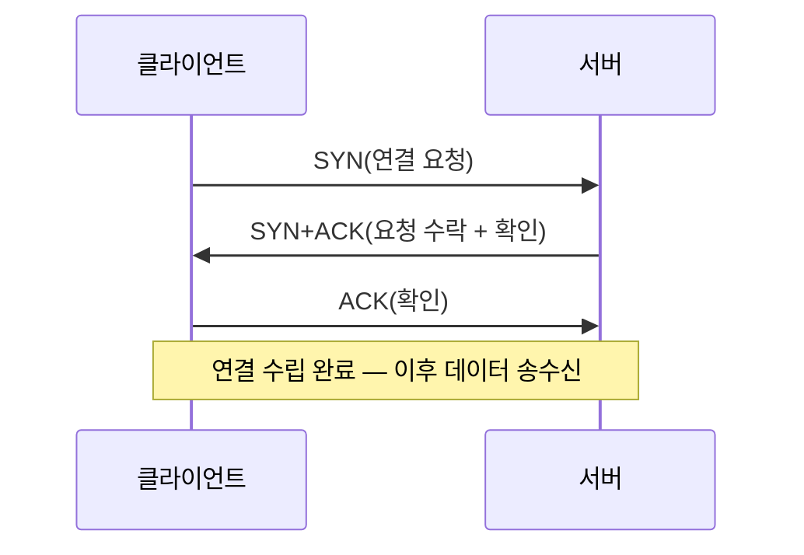
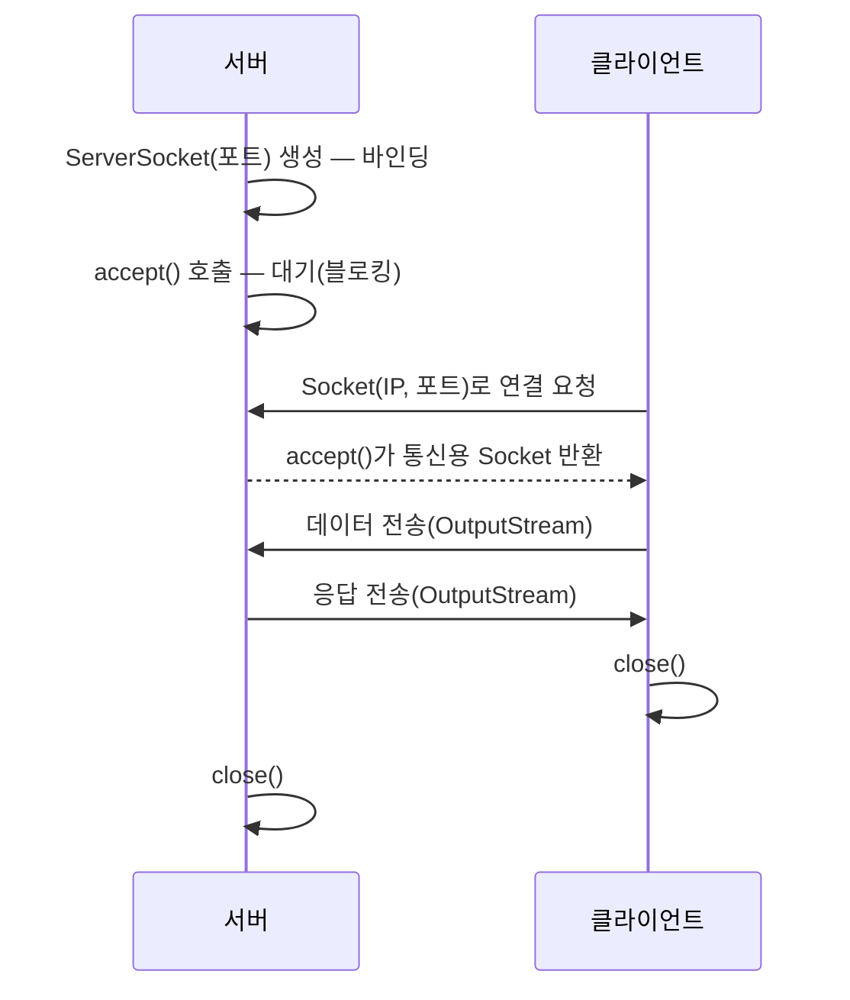

04편에서 클라이언트–서버 구조와 소켓·HTTP의 큰 그림을 훑어봤다. 이 편에서는 그중 **소켓 프로그래밍**(socket programming)을 실제 코드 수준으로 파고든다.

## 왜 소켓이 필요한가 — 프로세스 간 통신의 문제

두 프로그램이 데이터를 주고받으려면 "어느 컴퓨터의, 어느 프로그램에" 보낼지를 정확히 지정해야 한다. 이를 위한 두 가지 좌표가 **IP 주소**(Internet Protocol address, 네트워크 안에서 컴퓨터 한 대를 가리키는 주소)와 **포트 번호**(port number, 그 컴퓨터 안에서 실행 중인 프로그램 하나를 가리키는 번호, 0~65535)다.

**소켓**(socket, 콘센트에 플러그를 꽂는 구멍이라는 뜻에서 따온 이름 — 네트워크 통신의 플러그 역할을 한다)은 이 IP 주소와 포트 번호를 묶어, 운영체제가 프로그램에게 제공하는 통신용 **엔드포인트**(endpoint, 통신의 양 끝점)다. 프로그래머는 소켓이라는 객체(또는 파일 디스크립터)를 통해 "이 주소로 데이터를 보내라", "이 주소에서 오는 데이터를 받아라"라고 지시할 뿐, 실제 패킷 조립·전송은 운영체제와 네트워크 계층이 처리한다.

## TCP와 UDP — 신뢰성과 속도의 트레이드오프

전송 계층(4계층)의 두 대표 프로토콜인 **TCP**(Transmission Control Protocol, 전송 제어 프로토콜)와 **UDP**(User Datagram Protocol, 사용자 데이터그램 프로토콜)는 통합프로그래밍뿐 아니라 컴퓨터네트워크 과목에서도 반복 출제되는 비교 쌍이다.

| 특성 | TCP | UDP |
|---|---|---|
| 연결 방식 | 연결 지향(connection-oriented) — 3-way handshake로 연결 수립 | 비연결(connectionless) — 연결 수립 과정 없음 |
| 신뢰성 | 높다 — 순서 보장, 손실된 데이터 재전송, 흐름·혼잡 제어 | 낮다 — 순서·도착·중복 제거를 보장하지 않음 |
| 속도·오버헤드 | 느리다 — 확인 응답(ACK)·재전송 절차로 오버헤드 큼 | 빠르다 — 헤더가 단순하고 확인 절차가 없음 |
| 자료 단위 | 스트림(stream, 바이트의 연속적 흐름) | 데이터그램(datagram, 하나씩 독립적으로 전송되는 패킷 단위) |
| 대표 용도 | 파일 전송(FTP), 웹(HTTP), 메일(SMTP) — 정확성이 중요한 응용 | 실시간 스트리밍, 온라인 게임, DNS 질의 — 속도가 중요하고 약간의 손실은 허용되는 응용 |
| 자바 클래스 | `Socket`, `ServerSocket` | `DatagramSocket`, `DatagramPacket` |

TCP가 신뢰성을 보장하는 핵심 장치가 **3방향 핸드셰이크**(3-way handshake)다. 클라이언트가 SYN(연결 요청)을 보내면 서버가 SYN+ACK(요청 수락+확인)로 응답하고, 클라이언트가 다시 ACK(확인)를 보내야 연결이 확정된다.



UDP는 이 절차가 아예 없다. 그냥 데이터그램을 상대 주소로 던질 뿐이며, 상대가 받았는지 UDP 계층은 확인하지 않는다. 그래서 "빠르지만 도착을 보장 못 한다"는 특성이 나온다.

## 소켓 프로그래밍의 기본 흐름

TCP 소켓 통신은 서버와 클라이언트가 비대칭적인 순서를 따른다.



여기서 시험에 자주 나오는 함정이 하나 있다. `accept()`는 **블로킹**(blocking, 결과가 준비될 때까지 그 자리에서 실행을 멈추고 기다리는 방식) 호출이다.

## 자바로 만드는 최소 에코 서버·클라이언트

아래는 클라이언트가 보낸 문자열을 그대로 되돌려 주는 **에코 서버**(echo server, 받은 것을 그대로 돌려주는 서버)다. 자바 표준 라이브러리의 `java.net` 패키지를 사용한다.

```java
// EchoServer.java
import java.io.*;
import java.net.*;

public class EchoServer {
    public static void main(String[] args) throws IOException {
        ServerSocket serverSocket = new ServerSocket(5000); // 1. 5000번 포트에 바인딩
        System.out.println("서버 대기 중...");

        Socket clientSocket = serverSocket.accept(); // 2. 연결 요청이 올 때까지 블로킹
        System.out.println("클라이언트 연결됨");

        BufferedReader in = new BufferedReader(
            new InputStreamReader(clientSocket.getInputStream()));
        PrintWriter out = new PrintWriter(clientSocket.getOutputStream(), true);

        String line = in.readLine();       // 3. 클라이언트가 보낸 한 줄을 읽음
        System.out.println("받은 메시지: " + line);
        out.println("ECHO: " + line);      // 4. 받은 내용에 접두어를 붙여 되돌림

        clientSocket.close();
        serverSocket.close();
    }
}
```

```java
// EchoClient.java
import java.io.*;
import java.net.*;

public class EchoClient {
    public static void main(String[] args) throws IOException {
        Socket socket = new Socket("127.0.0.1", 5000); // 서버 IP·포트로 연결 요청

        PrintWriter out = new PrintWriter(socket.getOutputStream(), true);
        BufferedReader in = new BufferedReader(
            new InputStreamReader(socket.getInputStream()));

        out.println("안녕하세요");           // 서버로 한 줄 전송
        String response = in.readLine();    // 서버 응답을 한 줄 읽음
        System.out.println("서버 응답: " + response);

        socket.close();
    }
}
```

서버를 먼저 실행하고(포트 5000에서 대기 상태) 클라이언트를 실행하면, 콘솔에는 다음과 같이 출력된다.

```text
[서버 콘솔]
서버 대기 중...
클라이언트 연결됨
받은 메시지: 안녕하세요

[클라이언트 콘솔]
서버 응답: ECHO: 안녕하세요
```

코드에서 눈여겨볼 시그니처 몇 가지를 정리한다.

| 메서드·생성자 | 소속 클래스 | 역할·반환값 |
|---|---|---|
| `new ServerSocket(int port)` | `ServerSocket` | 지정한 포트에 바인딩된 서버 소켓 생성. 포트가 이미 사용 중이면 `IOException` 발생 |
| `serverSocket.accept()` | `ServerSocket` | 연결 요청이 올 때까지 블로킹하다가, 연결이 오면 그 클라이언트 전용 `Socket` 객체를 반환 |
| `new Socket(String host, int port)` | `Socket` | 지정한 호스트·포트로 연결을 시도하는 클라이언트 소켓 생성(TCP 핸드셰이크 수행) |
| `socket.getInputStream()` / `getOutputStream()` | `Socket` | 그 소켓으로 데이터를 읽고 쓰는 스트림 반환 |
| `PrintWriter(OutputStream, boolean autoFlush)` | `java.io.PrintWriter` | 둘째 인자를 `true`로 주면 `println()` 호출마다 자동으로 버퍼를 비워(flush) 즉시 전송 |

`PrintWriter`의 `autoFlush`를 `false`로 두거나 생략하면(기본 생성자 사용 시) `println()`을 호출해도 데이터가 버퍼에만 쌓이고 실제로 전송되지 않을 수 있다. 이 실수는 "코드는 맞는데 클라이언트가 응답을 못 받는" 상황으로 이어지는 대표적인 오류 찾기 문항 소재다.

## UDP 소켓 — 연결 없이 데이터그램 주고받기

UDP는 연결 절차가 없으므로 `accept()`·`connect()` 같은 단계가 없다. 대신 매번 전송할 때마다 목적지 주소를 함께 지정한다.

```java
import java.net.*;

public class UdpSender {
    public static void main(String[] args) throws Exception {
        DatagramSocket socket = new DatagramSocket(); // 포트는 시스템이 임의로 할당
        byte[] data = "hello".getBytes();

        InetAddress address = InetAddress.getByName("127.0.0.1");
        DatagramPacket packet = new DatagramPacket(data, data.length, address, 6000);

        socket.send(packet); // 도착 여부를 확인하지 않고 그냥 전송
        socket.close();
    }
}
```

`DatagramPacket`은 데이터 자체와 함께 "어디로 보낼지"(주소·포트)를 한 덩어리로 담는다. `socket.send(packet)`을 호출한 순간 프로그램은 곧바로 다음 줄로 넘어간다 — TCP의 `accept()`처럼 상대의 확인을 기다리지 않는다는 점이 UDP 코드의 핵심 특징이며, 시험에서는 이 차이를 "왜 UDP 코드에는 accept가 없는가"로 묻는다.

## 포트 번호와 잘 알려진 포트

포트 번호는 0~65535 범위이며, 다음과 같이 구간이 나뉜다.

| 구간 | 이름 | 설명 |
|---|---|---|
| 0–1023 | 잘 알려진 포트(well-known port) | HTTP(80), HTTPS(443), FTP(21), SSH(22)처럼 표준으로 정해진 서비스가 사용 |
| 1024–49151 | 등록된 포트(registered port) | 특정 애플리케이션이 등록해 사용(예: MySQL의 3306) |
| 49152–65535 | 동적·사설 포트(dynamic/private port) | 클라이언트가 임시로 사용하는 포트(위 예제의 `new DatagramSocket()`처럼 포트를 지정하지 않으면 이 범위에서 자동 할당) |

## 자주 틀리는 점

- `ServerSocket`과 `Socket`을 혼동한다. `ServerSocket`은 리스닝 전용(연결 요청을 받는 문지기)이고, 실제 데이터 송수신은 `accept()`가 반환한 `Socket` 객체로 한다. 서버 쪽에서도 데이터는 `serverSocket`이 아니라 `accept()`의 반환값으로 주고받는다.
- `accept()`가 블로킹이라는 사실을 놓치고, 서버·클라이언트 실행 순서를 뒤바꾸면 안 된다고 착각한다. 실제로는 서버를 먼저 실행해 대기 상태로 만들어 두는 것이 정상 순서다.
- TCP가 "패킷 손실이 아예 없다"고 착각하기 쉽다. 정확히는 패킷이 손실되면 **재전송**해서 결과적으로 신뢰성을 확보하는 것이지, 네트워크 계층에서 손실 자체가 없는 것은 아니다.
- UDP를 "신뢰성이 아예 없어 쓸모없는 프로토콜"로 오해하기 쉽다. 신뢰성 보장 절차가 없는 대신 오버헤드가 작아, 실시간성이 신뢰성보다 중요한 응용(실시간 스트리밍, DNS)에는 오히려 UDP가 적합하다.

## 핵심 정리

- 소켓은 IP 주소와 포트 번호로 식별되는 통신용 엔드포인트이며, TCP는 연결 지향·신뢰성 보장, UDP는 비연결·저오버헤드라는 상반된 특성을 갖는다.
- TCP 연결은 SYN → SYN+ACK → ACK의 3방향 핸드셰이크로 수립된다.
- 서버는 `ServerSocket`으로 바인딩·리스닝하고 `accept()`로 연결을 수락하며, 이때 반환되는 새 `Socket`으로 실제 데이터를 주고받는다. 클라이언트는 `Socket(host, port)`로 바로 연결을 시도한다.
- `accept()`는 블로킹 호출이므로 서버는 클라이언트 연결 전까지 그 줄에서 대기한다.
- UDP는 `DatagramSocket`·`DatagramPacket`으로 매 전송마다 목적지를 지정하며 연결·확인 절차가 없다.

## 마무리 복습

<Quiz
  questionNumber={1}
  question={"TCP와 UDP의 차이에 대한 설명으로 옳은 것은?"}
  options={["TCP는 비연결형이고 UDP는 연결 지향형이다","TCP는 3방향 핸드셰이크로 연결을 수립하지만 UDP는 연결 수립 절차가 없다","UDP는 순서 보장과 재전송을 지원하지만 TCP는 지원하지 않는다","TCP와 UDP 모두 데이터그램 단위로 전송한다"]}
  correctAnswer={2}
  explanation={"TCP는 SYN, SYN+ACK, ACK의 3방향 핸드셰이크로 연결을 맺는 연결 지향 프로토콜이고, UDP는 이런 절차 없이 바로 데이터그램을 전송하는 비연결 프로토콜이다."}
/>

<Quiz
  questionNumber={2}
  question={"다음 자바 코드에서 밑줄 부분에 들어갈 메서드로 가장 적절한 것은? (서버 소켓이 5000번 포트에서 클라이언트 연결을 기다리는 코드)"}
  options={["serverSocket.connect()","serverSocket.accept()","serverSocket.listenFor()","serverSocket.bind()"]}
  correctAnswer={2}
  explanation={"ServerSocket 객체가 연결 요청을 받아들여 통신용 Socket 객체를 반환받으려면 accept() 메서드를 호출해야 한다."}
/>

<Quiz
  questionNumber={3}
  question={"ServerSocket과 accept()가 반환하는 Socket의 관계에 대한 설명으로 옳은 것은?"}
  options={["ServerSocket 하나로 모든 클라이언트와의 데이터 송수신을 직접 처리한다","accept()가 반환하는 새 Socket 객체를 통해 해당 클라이언트와 데이터를 주고받는다","accept()는 데이터 송수신용 스트림을 직접 반환한다","ServerSocket과 Socket은 완전히 동일한 클래스로 상호 교환 가능하다"]}
  correctAnswer={2}
  explanation={"ServerSocket은 연결 요청을 받는 리스닝 전용 객체다. accept() 호출로 클라이언트별 통신용 Socket 객체가 새로 생성되어 반환되며, 실제 데이터 송수신은 이 Socket을 통해 이루어진다."}
/>

## 참고 자료

- [국가평생교육진흥원 독학학위제 시험안내](https://bdes.nile.or.kr)
- [RFC Editor — TCP(RFC 793)·UDP(RFC 768) 명세](https://www.rfc-editor.org)
- [Oracle Java SE 공식 문서 — java.net 패키지](https://docs.oracle.com/en/java/javase/)
