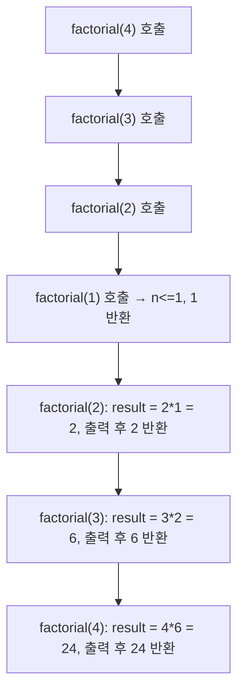

<Callout type="info">
  **이번 문서의 목표:** 이 문서를 다 읽으면 배열 기반 스택·큐, 재귀, 정렬·탐색이 섞인 C 코드를 받았을 때 변수 값 표로 한 줄씩 실행을 추적해 출력을 예측하고, 포인터·인덱스 오류를 스스로 찾아 고칠 수 있다.
</Callout>

06~08편에서 C의 배열·포인터·구조체·파일 I/O를, 13~15편에서 자료구조·정렬·탐색을 각각 다뤘다. 독학사 4단계 통합프로그래밍은 이 둘을 **한 문제 안에서 묶어서** 낸다 — 예를 들어 "포인터로 구현한 스택에 정수를 push한 뒤 pop 순서를 쓰시오", "배열을 버블 정렬하는 도중 특정 시점의 배열 상태를 쓰시오" 같은 식이다. 이 편은 개념을 다시 설명하지 않고, **여러 개념이 섞인 손코딩 문제를 실제로 풀어보는 데** 집중한다.

## 통합 문제를 푸는 절차

> **쉽게 말하면:** 긴 코드는 한 번에 이해하려 하지 말고, 변수 하나하나의 값을 표에 적어가며 한 줄씩 따라간다.

<Steps>
1. **선언부 확인** — 배열 크기, 포인터가 가리키는 대상, 구조체 멤버를 먼저 파악한다.
2. **함수 호출 관계 정리** — 어떤 함수가 어떤 함수를 호출하는지, 매개변수가 값으로 전달되는지 주소로 전달되는지 표시한다.
3. **변수 값 표 작성** — 반복문 한 바퀴, 함수 호출 한 번마다 변화하는 변수 값을 행으로 추가한다.
4. **출력 시점 표시** — `printf` 호출이 나오는 줄에서 그 시점의 변수 값을 그대로 옮겨 출력 결과를 만든다.
5. **함정 지점 재확인** — 인덱스가 배열 범위를 벗어나지 않는지, 포인터가 가리키는 값이 함수 종료 후에도 유효한지 다시 확인한다.
</Steps>

## 문제 1 — 배열 기반 스택에 포인터로 접근하기

다음은 정수를 담는 배열 기반 스택을 포인터로 조작하는 코드다. 스택은 "나중에 넣은 것이 먼저 나온다"는 **LIFO**(Last In First Out, 후입선출) 구조이며, `top`은 가장 최근에 push된 원소의 인덱스를 가리킨다.

```c
#include <stdio.h>
#define MAX 5

typedef struct {
    int data[MAX];
    int top; // 비어 있으면 -1
} Stack;

void push(Stack *s, int value) {
    if (s->top == MAX - 1) {
        printf("스택이 가득 찼습니다\n");
        return;
    }
    s->top = s->top + 1;
    s->data[s->top] = value;
}

int pop(Stack *s) {
    if (s->top == -1) {
        printf("스택이 비어 있습니다\n");
        return -1;
    }
    int value = s->data[s->top];
    s->top = s->top - 1;
    return value;
}

int main(void) {
    Stack s;
    s.top = -1;

    push(&s, 10);
    push(&s, 20);
    push(&s, 30);

    printf("%d\n", pop(&s));
    printf("%d\n", pop(&s));

    push(&s, 40);
    printf("%d\n", pop(&s));
    printf("%d\n", pop(&s));

    return 0;
}
```

`push`·`pop`이 매개변수로 `Stack *s`(구조체의 주소)를 받는 이유부터 짚어야 한다. C에서 함수는 기본적으로 **값에 의한 호출**(call by value)이라 인자를 복사해서 넘긴다. 만약 `Stack s`로 값 전체를 복사해서 넘기면, 함수 안에서 `top`을 바꿔도 `main`의 원본 `s`는 그대로다. 원본을 실제로 바꾸려면 **주소를 넘겨(call by pointer, 포인터로 원본의 위치를 알려주는 방식)** `s->top`처럼 화살표 연산자로 원본 멤버에 직접 접근해야 한다.

실행을 변수 값 표로 추적하면 다음과 같다.

| 실행 시점 | 호출 | s.top (호출 후) | s.data 내용(인덱스 0–2) | 반환값·출력 |
|---|---|---|---|---|
| 1 | `push(&s, 10)` | 0 | `[10, ?, ?]` | – |
| 2 | `push(&s, 20)` | 1 | `[10, 20, ?]` | – |
| 3 | `push(&s, 30)` | 2 | `[10, 20, 30]` | – |
| 4 | `pop(&s)` | 1 | `[10, 20, 30]`(값은 남아 있으나 top이 줄어 논리적으로 무효) | 30 출력 |
| 5 | `pop(&s)` | 0 | `[10, 20, 30]` | 20 출력 |
| 6 | `push(&s, 40)` | 1 | `[10, 40, 30]` | – (인덱스 1에 40이 덮어써짐) |
| 7 | `pop(&s)` | 0 | `[10, 40, 30]` | 40 출력 |
| 8 | `pop(&s)` | -1 | `[10, 40, 30]` | 10 출력 |

`pop`은 배열의 값을 실제로 지우지 않고 `top`만 감소시킨다. 그래서 6번째 `push(&s, 40)`이 인덱스 1 자리(이전에 20이 있던 자리)에 40을 **덮어쓰는** 것이다. 이 지점이 "스택은 pop 후에도 배열 값이 그대로 남아 있는가"를 묻는 대표적인 함정 문항이다.

```text
30
20
40
10
```

## 문제 2 — 재귀 함수의 스택 프레임 추적

재귀 함수를 추적할 때는 **호출될 때마다 새로운 스택 프레임(지역 변수의 독립된 복사본)이 생긴다**는 점이 핵심이다. 팩토리얼을 재귀로 구현한 코드를 보자.

```c
#include <stdio.h>

int factorial(int n) {
    if (n <= 1) {
        return 1;
    }
    int result = n * factorial(n - 1);
    printf("factorial(%d)의 result = %d\n", n, result);
    return result;
}

int main(void) {
    int answer = factorial(4);
    printf("최종 answer = %d\n", answer);
    return 0;
}
```

재귀 호출은 "내려가는 방향"(호출이 쌓이는 단계)과 "올라오는 방향"(반환값이 정리되는 단계)을 분리해서 추적해야 한다.



| 호출 깊이 | n | 이 프레임의 result | printf 출력 | 반환값 |
|---|---|---|---|---|
| 4 | 4 | 4 × 6 = 24 | `factorial(4)의 result = 24` (가장 마지막에 출력) | 24 |
| 3 | 3 | 3 × 2 = 6 | `factorial(3)의 result = 6` | 6 |
| 2 | 2 | 2 × 1 = 2 | `factorial(2)의 result = 2` | 2 |
| 1 | 1 | – (재귀 종료 조건) | 없음(printf 줄 자체를 실행하지 않음) | 1 |

`printf` 호출은 각 프레임이 **자신의 재귀 호출에서 반환받은 뒤**에 실행되므로, 출력 순서는 호출 순서(4, 3, 2)가 아니라 **반환이 완료되는 순서**(2, 3, 4)로 뒤집힌다. 이것이 재귀 추적 문제에서 가장 자주 틀리는 지점이다.

```text
factorial(2)의 result = 2
factorial(3)의 result = 6
factorial(4)의 result = 24
최종 answer = 24
```

## 문제 3 — 버블 정렬 패스별 배열 상태

정렬 알고리즘은 "패스(pass)마다 배열이 어떻게 바뀌는지"를 표로 그리는 문제가 자주 나온다. 다음 배열을 오름차순 버블 정렬한다.

```c
#include <stdio.h>

void bubbleSort(int arr[], int n) {
    for (int i = 0; i < n - 1; i++) {
        for (int j = 0; j < n - 1 - i; j++) {
            if (arr[j] > arr[j + 1]) {
                int temp = arr[j];
                arr[j] = arr[j + 1];
                arr[j + 1] = temp;
            }
        }
    }
}

int main(void) {
    int arr[] = {5, 2, 4, 1, 3};
    bubbleSort(arr, 5);
    for (int i = 0; i < 5; i++) {
        printf("%d ", arr[i]);
    }
    return 0;
}
```

**버블 정렬**(bubble sort, 인접한 두 원소를 비교해 큰 값을 뒤로 밀어내는 정렬)은 한 패스(바깥 반복문 한 바퀴)가 끝날 때마다 가장 큰 값이 뒤로 하나씩 확정된다는 규칙을 이용해 표를 채운다.

| 패스(i) | 비교·교환 진행 | 패스 종료 후 배열 |
|---|---|---|
| 초기 | – | `5 2 4 1 3` |
| i=0 | (5,2)교환→2 5 4 1 3 / (5,4)교환→2 4 5 1 3 / (5,1)교환→2 4 1 5 3 / (5,3)교환→2 4 1 3 5 | `2 4 1 3 5` |
| i=1 | (2,4)유지 / (4,1)교환→2 1 4 3 5 / (4,3)교환→2 1 3 4 5 | `2 1 3 4 5` |
| i=2 | (2,1)교환→1 2 3 4 5 / (2,3)유지 | `1 2 3 4 5` |
| i=3 | (1,2)유지 | `1 2 3 4 5` |

각 패스마다 가장 큰 값(5, 4, 3)이 순서대로 오른쪽에 자리 잡는 것을 확인할 수 있다. 안쪽 반복문의 범위가 `n - 1 - i`로 매 패스 하나씩 줄어드는 이유가 바로 "이미 확정된 뒤쪽 원소는 다시 비교할 필요가 없기 때문"이다.

```text
1 2 3 4 5
```

## 문제 4 — 오류 찾기: 포인터로 두 값 교환하기

다음 코드는 두 변수의 값을 서로 바꾸려는 의도로 작성됐지만 오류가 있다.

```c
#include <stdio.h>

void swap(int a, int b) {
    int temp = a;
    a = b;
    b = temp;
}

int main(void) {
    int x = 10, y = 20;
    swap(x, y);
    printf("x = %d, y = %d\n", x, y);
    return 0;
}
```

이 코드를 실행하면 `x = 10, y = 20`이 그대로 출력되어 교환이 되지 않는다. 원인은 `swap` 함수가 `int a, int b`로 **값**을 받기 때문이다. `swap` 내부에서 `a`, `b`를 아무리 바꿔도 그것은 `x`, `y`의 **복사본**일 뿐이며, `main`의 `x`, `y`에는 영향을 주지 못한다. 이 복사본은 `swap` 함수가 끝나는 순간 스택 프레임과 함께 사라진다.

올바르게 고치려면 **포인터**로 원본의 주소를 받아 그 주소가 가리키는 값을 바꿔야 한다.

```c
void swap(int *a, int *b) {
    int temp = *a;
    *a = *b;
    *b = temp;
}

int main(void) {
    int x = 10, y = 20;
    swap(&x, &y); // x, y의 주소를 전달
    printf("x = %d, y = %d\n", x, y);
    return 0;
}
```

`&x`는 "x의 주소"를, `*a`는 "a가 가리키는 주소에 저장된 값"을 뜻한다. 수정된 코드는 `a`가 `x`의 주소를 직접 가리키므로 `*a = *b`가 곧 `x`의 실제 값을 바꾸는 것과 같다.

```text
x = 20, y = 10
```

## 자주 틀리는 점

- 스택에서 `pop`이 배열 값을 실제로 지운다고 착각한다. 대부분의 배열 기반 구현은 `top` 인덱스만 조정할 뿐, 이전 값은 다음에 덮어써질 때까지 배열에 남아 있다.
- 재귀 함수의 `printf`가 호출 순서대로 출력된다고 착각한다. 반환(return) 이후에 실행되는 코드는 **반환이 완료되는 순서**로 실행된다.
- 정렬 알고리즘의 안쪽 반복문 범위를 매 패스 줄이지 않고 항상 전체 배열을 도는 것으로 착각해, 패스별 배열 상태를 잘못 계산한다.
- 값에 의한 호출(call by value)로는 원본을 바꿀 수 없다는 사실을 놓치고, `swap(x, y)`처럼 값만 넘겨도 교환이 될 것이라 기대한다.

## 핵심 정리

- 구조체를 함수에서 수정하려면 포인터(주소)로 넘겨 `->` 연산자로 원본 멤버에 접근해야 하며, 값으로 넘기면 함수 안의 변경이 원본에 반영되지 않는다.
- 배열 기반 스택의 `pop`은 대개 `top` 인덱스만 감소시키므로, 이후 `push`가 이전 값을 덮어쓸 수 있다.
- 재귀 함수의 실행 흐름은 "호출이 쌓이는 하강 구간"과 "반환값이 정리되는 상승 구간"으로 나눠 추적하며, 반환 이후 코드는 상승 구간에서 역순으로 실행된다.
- 버블 정렬은 패스마다 가장 큰(또는 작은) 값이 하나씩 정해진 위치로 확정되며, 그만큼 다음 패스의 비교 범위가 줄어든다.
- 두 변수를 교환하려면 포인터로 주소를 전달해야 하며, 값으로 전달하면 함수 종료 시 변경 내용이 사라진다.

## 마무리 복습

<Quiz
  questionNumber={1}
  question="문제 1의 스택 코드에서 push 함수가 Stack 자체가 아닌 Stack 포인터를 매개변수로 받는 이유로 가장 적절한 것은?"
  options={['포인터를 쓰면 컴파일 속도가 빨라지기 때문이다', '값으로 전달하면 함수 안에서 원본 구조체의 멤버를 변경해도 main의 원본에는 반영되지 않기 때문이다', 'C 언어는 구조체를 값으로 전달하는 문법을 지원하지 않기 때문이다', '포인터를 쓰지 않으면 배열 인덱스 연산이 불가능하기 때문이다']}
  correctAnswer={2}
  explanation="C는 기본적으로 call by value이므로 구조체를 값으로 전달하면 함수 안의 복사본만 바뀌고 원본은 그대로다. 원본 top·data를 실제로 바꾸려면 주소(포인터)를 전달해 화살표 연산자로 원본에 직접 접근해야 한다."
  optionExplanations={['컴파일 속도와는 무관한 이유다.', '정답이다. call by value의 한계를 극복하기 위해 포인터를 사용한다.', 'C는 구조체를 값으로도 전달할 수 있다. 다만 이 경우 원본이 바뀌지 않을 뿐이다.', '배열 인덱스 연산 자체는 포인터 없이도 가능하다.']}
/>

<Quiz
  questionNumber={2}
  question="문제 1의 스택 코드를 순서대로 실행했을 때 네 번째 pop(마지막 pop) 호출의 반환값은?"
  options={['10', '20', '30', '40']}
  correctAnswer={1}
  explanation="push(10), push(20), push(30) 후 pop 두 번으로 30과 20이 빠지고 top은 0이 된다. 이후 push(40)이 인덱스 1(20이 있던 자리)을 덮어써 배열은 [10, 40, 30]이 되고, 세 번째 pop은 40, 네 번째 pop은 10을 반환한다."
  optionExplanations={['정답이다. 마지막 pop은 top이 0인 상태에서 data[0]인 10을 반환한다.', '20은 두 번째 pop에서 이미 반환되었고 이후 40으로 덮어써졌다.', '30은 첫 번째 pop에서 이미 반환되었다.', '40은 세 번째 pop에서 반환된 값이다.']}
/>

<Quiz
  questionNumber={3}
  question="문제 2의 재귀 factorial(4) 실행에서 콘솔에 가장 먼저 출력되는 printf 줄은?"
  options={['factorial(4)의 result = 24', 'factorial(3)의 result = 6', 'factorial(2)의 result = 2', 'factorial(1)의 result = 1']}
  correctAnswer={3}
  explanation="printf는 각 재귀 호출이 반환값을 받은 뒤 실행되므로, 가장 먼저 반환이 완료되는 가장 깊은 호출(factorial(2))의 printf가 가장 먼저 출력된다. factorial(1)은 종료 조건이라 printf 자체를 실행하지 않는다."
  optionExplanations={['factorial(4)의 printf는 모든 하위 호출이 끝난 뒤 가장 마지막에 실행된다.', 'factorial(3)의 printf는 factorial(2)의 반환을 받은 뒤 실행되므로 두 번째로 출력된다.', '정답이다. factorial(2)가 가장 먼저 반환을 완료하므로 그 printf가 가장 먼저 출력된다.', 'factorial(1)은 n<=1 조건으로 바로 반환하며 printf 줄을 실행하지 않는다.']}
/>

<Quiz
  questionNumber={4}
  question="문제 3의 버블 정렬에서 i=0 패스가 끝난 직후의 배열 상태로 옳은 것은? (초기 배열: 5 2 4 1 3)"
  options={['1 2 3 4 5', '2 4 1 3 5', '2 5 4 1 3', '5 4 3 2 1']}
  correctAnswer={2}
  explanation="i=0 패스에서 인접 비교·교환을 순서대로 진행하면 5 2 4 1 3에서 시작해 2 5 4 1 3, 2 4 5 1 3, 2 4 1 5 3을 거쳐 2 4 1 3 5가 되어, 가장 큰 값 5가 맨 뒤로 이동한다."
  optionExplanations={['이는 정렬이 모두 끝난 최종 상태이며 i=0 패스만으로는 도달하지 않는다.', '정답이다. i=0 패스가 끝나면 가장 큰 값 5가 맨 뒤로 확정된다.', '이는 첫 번째 비교·교환 한 번만 진행한 중간 상태이며 패스 전체가 끝난 상태가 아니다.', '내림차순 결과이며 이 코드는 오름차순 정렬을 수행한다.']}
/>

<Quiz
  questionNumber={5}
  question="문제 4의 원래 오류 코드(swap(int a, int b))를 실행하면 x, y 값은 어떻게 출력되는가? (x=10, y=20으로 시작)"
  options={['x = 20, y = 10', 'x = 10, y = 20', 'x = 0, y = 0', '컴파일 오류가 발생한다']}
  correctAnswer={2}
  explanation="swap 함수가 값으로 전달받은 a, b는 x, y의 복사본이다. 함수 안에서 a, b를 교환해도 원본 x, y에는 영향을 주지 않으므로 main의 x, y는 그대로 10, 20으로 출력된다."
  optionExplanations={['이는 포인터로 올바르게 수정한 코드의 결과다.', '정답이다. call by value이므로 원본은 바뀌지 않는다.', '변수가 초기화되지 않아 0이 되는 상황이 아니다. x, y는 각각 10, 20으로 정상 초기화되어 있다.', '문법상 오류가 없으므로 컴파일은 정상적으로 된다. 다만 의도한 동작(교환)이 일어나지 않을 뿐이다.']}
/>

<Quiz
  questionNumber={6}
  question="포인터를 이용해 두 변수를 교환하는 올바른 swap(int *a, int *b) 함수에서, temp에 저장해야 하는 값으로 옳은 것은?"
  options={['a 자체(포인터 값)', 'a가 가리키는 주소에 저장된 값(*a)', 'b 자체(포인터 값)', '아무 값도 저장할 필요가 없다']}
  correctAnswer={2}
  explanation="포인터가 가리키는 실제 값을 교환해야 하므로, temp에는 *a(a가 가리키는 곳에 저장된 값)를 먼저 담아 둔 뒤, *a = *b, *b = temp 순서로 값을 교환해야 한다."
  optionExplanations={['a 자체는 주소값이며, 주소를 교환하는 것은 원본 변수의 값을 바꾸는 것이 아니다.', '정답이다. *a는 a가 가리키는 위치에 저장된 실제 값이며, 이를 임시로 보관해야 안전하게 교환할 수 있다.', 'b 자체도 주소값이며 값 교환의 대상이 아니다.', '임시 변수 없이 교환하면 첫 값을 덮어쓰는 순간 원래 값을 잃는다.']}
/>

## 참고 자료

- [국가평생교육진흥원 독학학위제 시험안내](https://bdes.nile.or.kr)
- [ISO/IEC 9899 (C 언어 표준) 관련 자료 — cppreference](https://en.cppreference.com/w/c)
