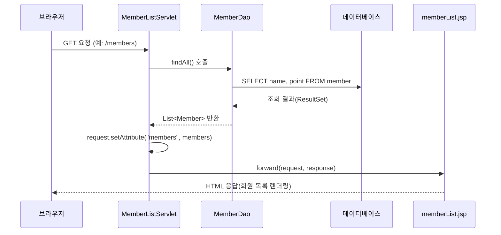

<Callout type="info">
  **이번 문서의 목표:** 이 문서를 다 읽으면 Java 상속 구조 위에 JDBC 조회, 웹 요청 처리, 소켓 통신이 함께 얽힌 시나리오형 코드를 읽고, 빈칸을 채우거나 오류를 찾아 고칠 수 있다.
</Callout>

10~12편에서 Java 객체지향과 예외·컬렉션을, 18편에서 JDBC를, 20편에서 JSP·Servlet을, 21편에서 소켓을 각각 다뤘다. 독학사 4단계 시험의 마지막 퍼즐은 이 조각들을 **하나의 이야기**로 엮는 것이다 — "회원 정보를 담은 클래스 계층이 있고, DB에서 조회해서, 웹 요청으로 응답하거나 소켓으로 다른 서버에 전달한다"는 식의 시나리오다. 이 편은 그런 통합 시나리오 문제 세 개를 실제로 풀어본다.

## 시나리오 1 — 상속 구조와 다형성이 있는 회원 클래스

다음은 일반 회원과 우수 회원을 상속으로 표현한 클래스다. 이 시나리오에서는 상속·오버라이딩이 실제로 어떻게 동작하는지 먼저 확인한다.

```java
class Member {
    protected String name;
    protected int point;

    public Member(String name, int point) {
        this.name = name;
        this.point = point;
    }

    public double getDiscountRate() {
        return 0.0; // 기본 회원은 할인 없음
    }

    public void printInfo() {
        System.out.println(name + "님의 할인율: " + (getDiscountRate() * 100) + "%");
    }
}

class VipMember extends Member {
    public VipMember(String name, int point) {
        super(name, point);
    }

    @Override
    public double getDiscountRate() {
        return point >= 1000 ? 0.1 : 0.05;
    }
}

public class MemberTest {
    public static void main(String[] args) {
        Member[] members = {
            new Member("일반회원", 200),
            new VipMember("우수회원A", 500),
            new VipMember("우수회원B", 1200)
        };

        for (Member m : members) {
            m.printInfo();
        }
    }
}
```

여기서 시험이 반드시 묻는 지점은 **`printInfo()`가 `Member`에만 정의되어 있는데, 왜 `VipMember` 객체에서 호출해도 `VipMember`의 `getDiscountRate()`가 실행되는가**이다. 답은 **동적 바인딩**(dynamic binding, 실행 시점에 실제 객체 타입을 보고 어떤 메서드를 실행할지 결정하는 방식)이다. `Member[] members` 배열은 **정적 타입**(컴파일 시점에 정해지는 타입, 여기서는 `Member`)으로 선언되어 있지만, 각 원소의 **실제 타입**(런타임에 생성된 객체의 진짜 타입)은 `Member` 또는 `VipMember`다. `m.printInfo()` 안에서 다시 `getDiscountRate()`를 호출할 때, 자바는 `m`의 정적 타입이 아니라 **실제 타입에 오버라이딩된 메서드**를 찾아 실행한다.

| 배열 원소 | 실제 타입 | point | getDiscountRate() 결과 | 출력 |
|---|---|---|---|---|
| members[0] | Member | 200 | 0.0(재정의 없음) | `일반회원님의 할인율: 0.0%` |
| members[1] | VipMember | 500 | 0.05(500 < 1000) | `우수회원A님의 할인율: 5.0%` |
| members[2] | VipMember | 1200 | 0.1(1200 >= 1000) | `우수회원B님의 할인율: 10.0%` |

```text
일반회원님의 할인율: 0.0%
우수회원A님의 할인율: 5.0%
우수회원B님의 할인율: 10.0%
```

## 시나리오 2 — JDBC로 회원을 조회해 예외 처리까지 연결하기

이제 위 회원 정보를 DB에서 읽어오는 코드를 붙인다. `member` 테이블은 `name`, `point` 컬럼을 가진다고 가정한다.

```java
import java.sql.*;
import java.util.ArrayList;
import java.util.List;

public class MemberDao {

    public List<Member> findAll() {
        List<Member> result = new ArrayList<>();
        String sql = "SELECT name, point FROM member";

        try (Connection conn = DriverManager.getConnection(
                 "jdbc:mysql://localhost:3306/shop", "user", "pass");
             PreparedStatement pstmt = conn.prepareStatement(sql);
             ResultSet rs = pstmt.executeQuery()) {

            while (rs.next()) {
                String name = rs.getString("name");
                int point = rs.getInt("point");

                Member m = (point >= 500) ? new VipMember(name, point) : new Member(name, point);
                result.add(m);
            }
        } catch (SQLException e) {
            System.out.println("DB 조회 오류: " + e.getMessage());
        }

        return result;
    }
}
```

이 코드에서 눈여겨볼 지점 세 가지가 있다.

- **try-with-resources**: `try (...)` 괄호 안에 선언한 `Connection`, `PreparedStatement`, `ResultSet`은 `try` 블록이 끝나면(정상 종료든 예외든) 자바가 자동으로 `close()`를 호출해 자원을 반납한다. 18편에서 배운 "자원 반납을 `finally`에서 수동으로 하던 방식"을 더 안전하게 대체한 문법이다.
- **`ResultSet.next()`의 역할**: 커서를 다음 행으로 이동시키고, 이동할 행이 있으면 `true`, 더 이상 없으면 `false`를 반환한다. 그래서 `while (rs.next())`가 "행이 남아 있는 동안 반복"이라는 의미가 된다.
- **DB 조회 결과로 다형성 객체 생성**: `point` 값에 따라 `Member` 또는 `VipMember`를 생성해 같은 리스트(`List<Member>`)에 담는다. 리스트의 선언 타입은 `Member`이지만 실제로는 두 종류의 객체가 섞여 있으며, 시나리오 1에서 본 동적 바인딩이 여기서도 그대로 적용된다.

`SQLException`을 잡지 않고 무시하면 어떤 문제가 생기는지도 시험 포인트다. `SQLException`은 **검사 예외**(checked exception, 컴파일러가 처리(try-catch 또는 throws)를 강제하는 예외)이므로, 처리하지 않으면 애초에 컴파일이 되지 않는다. 위 코드처럼 `catch` 블록에서 오류 메시지만 출력하고 빈 리스트를 반환하게 두면, 호출한 쪽은 "회원이 원래 없는 것"과 "DB 연결에 실패한 것"을 구분하지 못하는 문제가 생긴다는 점도 실전에서는 함께 언급된다.

## 시나리오 3 — 웹 요청과 소켓 통신을 잇는 처리 흐름

마지막으로 위 `MemberDao`를 웹 계층에서 호출하는 흐름을 정리한다. 실제 서블릿 컨테이너 없이도 흐름을 코드로 이해할 수 있도록, Servlet의 핵심 메서드 구조만 옮긴다.

```java
public class MemberListServlet extends HttpServlet {

    @Override
    protected void doGet(HttpServletRequest request, HttpServletResponse response)
            throws ServletException, IOException {

        MemberDao dao = new MemberDao();
        List<Member> members = dao.findAll();

        request.setAttribute("members", members);
        request.getRequestDispatcher("/memberList.jsp").forward(request, response);
    }
}
```

이 코드가 실행되는 순서는 다음과 같다.



`doGet`이 자동으로 호출되는 이유는 20편에서 배운 **서블릿 생명주기**(life cycle) 때문이다. 서블릿 컨테이너는 HTTP 메서드가 GET이면 `doGet`을, POST면 `doPost`를 호출하도록 정해 놓았다 — 개발자가 직접 이 메서드들을 호출할 필요가 없다. `request.setAttribute()`로 담은 `members` 객체는 `forward()`로 넘어간 JSP에서 `${members}`(EL, Expression Language) 형태로 꺼내 화면에 뿌린다.

이 회원 목록을 다른 지점 서버로 실시간 전달해야 한다면, 21편의 소켓을 이용해 다음과 같이 간단히 확장할 수 있다.

```java
public void notifyBranchServer(List<Member> members) {
    try (Socket socket = new Socket("branch-server.local", 6000);
         PrintWriter out = new PrintWriter(socket.getOutputStream(), true)) {

        for (Member m : members) {
            out.println(m.name + "," + m.point); // 회원 한 명씩 한 줄로 전송
        }
    } catch (IOException e) {
        System.out.println("지점 서버 통신 오류: " + e.getMessage());
    }
}
```

이 메서드가 던질 수 있는 예외는 `IOException`이며, 21편에서 본 것처럼 `new Socket(host, port)` 시점에 연결이 실패하면(서버가 꺼져 있거나 포트가 닫혀 있으면) 이 예외가 발생한다. `try-with-resources`로 `Socket`과 `PrintWriter`를 감쌌으므로, 예외가 나든 정상 종료되든 `close()`가 보장된다.

## 시나리오 통합: 코드 빈칸 채우기 연습

다음은 위 세 시나리오를 압축한 코드다. 빈칸 (가), (나)에 들어갈 내용을 생각해 보자.

```java
public double getDiscountRate() {
    return point >= 1000 ? 0.1 : 0.05;
}
```

위는 `VipMember`의 실제 구현이다. 이제 다음 코드의 (가)에 들어가 새 회원 객체를 만드는 조건을 완성해야 한다고 하자.

```java
Member m = (point >= 500) ? (가) : new Member(name, point);
```

(가)에는 `new VipMember(name, point)`가 들어가야 한다. 이는 시나리오 2에서 "point가 500 이상이면 VipMember로 만든다"는 규칙을 그대로 코드로 옮긴 것이며, `Member`형 변수 `m`에 `VipMember` 객체를 대입하는 것은 **업캐스팅**(upcasting, 자식 타입 객체를 부모 타입 참조 변수에 대입하는 것으로 항상 안전하게 허용된다)이라 문법적으로도 문제가 없다.

## 자주 틀리는 점

- `Member[] members` 배열 선언 타입만 보고 모든 원소가 `getDiscountRate()`에서 항상 `0.0`을 반환한다고 착각한다. 실제 타입이 `VipMember`인 원소는 오버라이딩된 메서드가 실행된다.
- `try-with-resources`를 쓰면 `catch` 블록이 필요 없다고 착각한다. 자원 반납(`close()`)이 자동화될 뿐, 예외 자체를 처리하려면 여전히 `catch`가 필요하다.
- 서블릿의 `doGet`을 개발자가 직접 호출해야 한다고 착각한다. 서블릿 컨테이너가 HTTP 메서드에 따라 자동으로 호출한다.
- 소켓 통신 코드에서 `IOException`을 잡지 않아도 된다고 착각한다. `IOException`은 검사 예외이므로 `try-catch` 또는 `throws` 선언이 없으면 컴파일이 되지 않는다.

## 핵심 정리

- 배열이나 컬렉션의 선언 타입이 부모 클래스여도, 실제 저장된 객체의 타입에 따라 오버라이딩된 메서드가 실행되는 것이 동적 바인딩이다.
- JDBC의 `try-with-resources`는 `Connection`·`PreparedStatement`·`ResultSet`을 자동으로 닫아 주지만, `SQLException` 같은 검사 예외 처리는 별도로 필요하다.
- 서블릿은 HTTP 메서드에 맞춰 컨테이너가 `doGet`·`doPost`를 자동 호출하며, `request.setAttribute()`와 `forward()`로 JSP에 데이터를 넘긴다.
- 소켓 통신은 `IOException`을 던질 수 있는 검사 예외 상황이며, `try-with-resources`로 자원 반납을 자동화할 수 있다.
- 여러 계층(객체지향·DB·웹·네트워크)이 섞인 시나리오 문제는 "이 객체의 실제 타입이 무엇인가", "이 예외는 검사 예외인가"라는 두 질문으로 대부분 정리된다.

## 마무리 복습

<Quiz
  questionNumber={1}
  question="시나리오 1의 MemberTest 실행 결과에서 우수회원A(point=500)의 할인율 출력으로 옳은 것은?"
  options={['우수회원A님의 할인율: 0.0%', '우수회원A님의 할인율: 5.0%', '우수회원A님의 할인율: 10.0%', '컴파일 오류가 발생한다']}
  correctAnswer={2}
  explanation="VipMember의 getDiscountRate()는 point가 1000 이상이면 0.1, 그렇지 않으면 0.05를 반환한다. point가 500이므로 0.05가 반환되어 5.0%로 출력된다."
  optionExplanations={['0.0%는 재정의되지 않은 기본 Member의 결과이며, 실제 타입이 VipMember이므로 이 값이 나오지 않는다.', '정답이다. point가 1000 미만이므로 0.05(5.0%)가 반환된다.', '10.0%는 point가 1000 이상일 때의 결과이며 500은 이 조건을 만족하지 않는다.', '문법에는 오류가 없으므로 정상적으로 컴파일된다.']}
/>

<Quiz
  questionNumber={2}
  question="Member[] members 배열에 VipMember 객체를 담아 m.printInfo()를 호출했을 때 VipMember의 getDiscountRate()가 실행되는 이유로 옳은 것은?"
  options={['정적 타입이 VipMember이기 때문이다', '자바가 실행 시점에 실제 객체 타입을 기준으로 오버라이딩된 메서드를 찾아 실행하는 동적 바인딩 때문이다', 'printInfo()가 VipMember에도 별도로 정의되어 있기 때문이다', 'Member 배열은 VipMember 타입 원소를 저장할 수 없기 때문이다']}
  correctAnswer={2}
  explanation="배열의 선언(정적) 타입은 Member이지만, 각 원소의 실제(런타임) 타입에 따라 오버라이딩된 메서드가 실행되는 동적 바인딩 덕분에 VipMember의 getDiscountRate()가 호출된다."
  optionExplanations={['정적 타입은 Member[] 선언에 따라 Member다. 실제 타입이 VipMember인 것이며 이 둘은 구분해야 한다.', '정답이다. 동적 바인딩이 이 동작의 원인이다.', 'printInfo()는 Member에만 정의되어 있고 VipMember는 이를 상속받아 그대로 사용한다.', 'Member 배열에는 Member의 자식 타입인 VipMember 객체도 업캐스팅되어 담길 수 있다.']}
/>

<Quiz
  questionNumber={3}
  question="시나리오 2의 MemberDao.findAll()에서 try-with-resources 문법에 대한 설명으로 옳은 것은?"
  options={['SQLException을 자동으로 무시해 준다', 'try 블록이 끝나면 괄호 안에서 선언한 Connection·PreparedStatement·ResultSet을 자동으로 close()해 준다', 'catch 블록을 생략해도 예외가 발생하지 않는다', 'DB 연결을 자동으로 재시도해 준다']}
  correctAnswer={2}
  explanation="try-with-resources는 괄호 안에서 선언한 자원들을 try 블록 종료 시(정상이든 예외든) 자동으로 close()하는 문법이다. 예외 처리 자체가 필요 없어지는 것은 아니다."
  optionExplanations={['예외를 무시하는 기능은 없으며, 여전히 catch로 처리해야 한다.', '정답이다. 자원의 자동 반납이 이 문법의 핵심 기능이다.', 'SQLException은 검사 예외이므로 catch 또는 throws 선언이 없으면 컴파일 오류가 난다.', '재시도 기능은 없다. 단순히 자원 반납을 자동화할 뿐이다.']}
/>

<Quiz
  questionNumber={4}
  question="ResultSet의 next() 메서드에 대한 설명으로 옳은 것은?"
  options={['현재 행의 첫 번째 컬럼 값을 반환한다', '커서를 다음 행으로 이동시키고, 이동할 행이 있으면 true, 없으면 false를 반환한다', '조회 결과 전체 행 개수를 반환한다', 'SQL 쿼리를 실행하고 그 결과를 ResultSet으로 반환한다']}
  correctAnswer={2}
  explanation="ResultSet.next()는 커서를 다음 행으로 이동시키는 메서드로, 이동할 다음 행이 존재하면 true, 더 이상 없으면 false를 반환한다. while(rs.next())는 이 반환값을 이용해 모든 행을 순회하는 관용구다."
  optionExplanations={['컬럼 값은 getString(), getInt() 같은 별도 메서드로 가져온다.', '정답이다. next()의 반환값은 boolean이며 커서 이동 성공 여부를 나타낸다.', '전체 행 개수를 세려면 별도의 카운트 로직이 필요하다.', '쿼리 실행은 executeQuery()가 담당하며, next()는 그 결과를 순회하는 역할만 한다.']}
/>

<Quiz
  questionNumber={5}
  question="MemberListServlet의 doGet() 메서드가 브라우저의 GET 요청 시 자동으로 호출되는 근거로 옳은 것은?"
  options={['개발자가 main() 메서드에서 doGet()을 직접 호출하도록 코드를 작성했기 때문이다', '서블릿 컨테이너가 서블릿의 생명주기에 따라 HTTP 메서드(GET/POST)에 맞는 메서드를 자동으로 호출하기 때문이다', 'JSP 파일이 doGet()을 직접 호출하기 때문이다', 'doGet()이 static 메서드로 선언되어 있기 때문이다']}
  correctAnswer={2}
  explanation="서블릿은 컨테이너가 관리하는 생명주기를 가지며, 요청의 HTTP 메서드가 GET이면 doGet(), POST면 doPost()를 컨테이너가 자동으로 호출한다. 개발자가 직접 호출하지 않는다."
  optionExplanations={['서블릿에는 main() 메서드가 없으며, 컨테이너가 생명주기를 관리한다.', '정답이다. 서블릿 컨테이너가 HTTP 메서드에 따라 자동 호출한다.', 'forward()로 이동한 JSP가 doGet()을 다시 호출하는 관계가 아니다.', 'doGet()은 인스턴스 메서드이며 static으로 선언되지 않는다.']}
/>

<Quiz
  questionNumber={6}
  question="notifyBranchServer 메서드에서 new Socket(host, port) 호출 시 서버가 꺼져 있을 때 발생할 수 있는 예외로 옳은 것은?"
  options={['NullPointerException', 'ArrayIndexOutOfBoundsException', 'IOException', 'ClassNotFoundException']}
  correctAnswer={3}
  explanation="소켓 연결이 실패하면(서버 미실행, 포트 닫힘 등) IOException 계열의 예외가 발생한다. Socket 생성자와 관련 스트림 메서드는 모두 IOException을 던질 수 있는 검사 예외 시그니처를 가진다."
  optionExplanations={['참조가 null인 상태에서 멤버에 접근할 때 발생하며 소켓 연결 실패와는 다른 상황이다.', '배열 인덱스 범위를 벗어날 때 발생하며 소켓 통신과는 무관하다.', '정답이다. 소켓 연결 실패는 IOException으로 나타난다.', '클래스를 찾지 못했을 때 발생하며 JDBC 드라이버 로딩 실패 등에서 주로 등장한다.']}
/>

<Quiz
  questionNumber={7}
  question="point가 500 이상이면 new VipMember(name, point)를, 그렇지 않으면 new Member(name, point)를 대입해 Member m을 만드는 삼항 연산자 문장에서, VipMember 객체를 Member 타입 변수에 대입하는 것에 대한 설명으로 옳은 것은?"
  options={['다운캐스팅이며 명시적 형변환이 반드시 필요하다', '업캐스팅이며 자식 타입을 부모 타입 참조 변수에 대입하는 것이라 별도 형변환 없이 허용된다', '타입이 다르므로 컴파일 오류가 발생한다', 'VipMember가 Member를 상속하지 않는 한 실행 시 예외가 발생한다']}
  correctAnswer={2}
  explanation="자식 클래스(VipMember)의 객체를 부모 클래스(Member) 타입의 참조 변수에 대입하는 것은 업캐스팅이며, 항상 안전하므로 명시적 형변환 없이 자동으로 허용된다."
  optionExplanations={['다운캐스팅은 부모 타입 참조를 자식 타입으로 변환하는 반대 방향이며 명시적 형변환이 필요하다. 이 문장은 그 반대인 업캐스팅이다.', '정답이다. 업캐스팅은 항상 안전해 자동으로 허용된다.', 'VipMember가 Member의 자식 클래스이므로 대입에 문제가 없다.', 'VipMember는 예시에서 Member를 상속하도록 정의되어 있으므로 이 상황 자체가 발생하지 않는다.']}
/>

## 참고 자료

- [국가평생교육진흥원 독학학위제 시험안내](https://bdes.nile.or.kr)
- [Oracle Java SE 공식 문서 — JDBC·Servlet 관련 API](https://docs.oracle.com/en/java/javase/)
