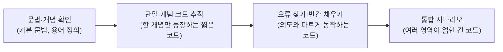

<Callout type="info">
  **이번 문서의 목표:** 이 문서를 다 읽으면 통합프로그래밍 4단계 시험이 어떤 평가영역을 어떤 비중으로, 어떤 문항 유형(실행 결과 추적·오류 찾기·빈칸 채우기)으로 묻는지 파악하고, 전체 범위를 아우르는 재구성 문제로 자신의 취약 영역을 점검할 수 있다.
</Callout>

<Callout type="warning">
  이 문서의 문제는 실제 기출 문제를 그대로 옮긴 것이 아니다. 국가평생교육진흥원이 공개한 통합프로그래밍 **평가영역**(출제기준)을 근거로, 06~23편에서 다룬 개념 범위 안에서 **새로 재구성한 연습 문제**다. 연도별 실제 기출 문항 수·배점·난이도는 매 회차 공고로 반드시 다시 확인해야 한다.
</Callout>

01편에서 4단계 시험 방식(총점합격제·과목별합격제)과 평가영역 개관을 다뤘다. 이 편에서는 그 평가영역을 실제 문제 유형과 연결해 "어디에 시간을 더 써야 하는지"를 정리하고, 06~23편 전체 범위를 아우르는 재구성 문제로 마무리 점검을 한다.

## 평가영역별 출제 비중 감 잡기

> **쉽게 말하면:** 통합프로그래밍은 한 과목처럼 보이지만 사실 C·Java·자료구조·DB·웹·네트워크 여섯 영역이 섞인 종합 시험이므로, 영역별로 공부 시간을 미리 배분해야 한다.

교재·합격 후기 자료를 종합하면, 통합프로그래밍은 대략 다음과 같은 비중으로 출제 영역이 나뉜다고 알려져 있다. 정확한 문항 수·배점은 회차 공고로 확인해야 하므로, 아래 비중은 "학습 시간 배분의 감"을 잡는 용도로만 참고한다.

| 평가영역(대분류) | 관련 편 | 체감 비중 | 대표 문항 유형 |
|---|---|---|---|
| C 언어(배열·포인터·구조체·파일 I/O) | 06–08, 22 | 높음 | 실행 결과 추적, 포인터 오류 찾기 |
| Java·객체지향(상속·다형성·예외·컬렉션) | 09–12, 23 | 높음 | 실행 결과 추적, 설계형 서술 |
| 자료구조·알고리즘(스택·큐·트리·그래프·정렬·탐색) | 13–15, 22 | 중간–높음 | 단계별 상태 추적, 복잡도 판단 |
| GUI·이벤트 처리 | 16 | 낮음 | 개념 확인형 객관식 |
| 데이터베이스·JDBC | 17–18, 23 | 중간 | SQL 결과 예측, 코드 빈칸 채우기 |
| 웹 프로그래밍(HTML/CSS/JS·JSP/Servlet) | 19–20, 23 | 중간 | 흐름 순서 배열, 개념 비교 |
| 네트워크 프로그래밍(소켓) | 21, 23 | 낮음–중간 | 개념 비교, 코드 빈칸 채우기 |

이 표에서 "높음"으로 표시된 C·Java·자료구조 영역이 사실상 시험의 근간이다. 22·23편의 통합 실습이 바로 이 영역들을 조합한 문제 유형을 미리 연습하도록 설계된 이유이기도 하다.

## 문항 유형 네 갈래

> **쉽게 말하면:** 통합프로그래밍은 지식을 묻기보다 "코드를 읽고 무슨 일이 일어나는지" 묻는 시험이다.

- **실행 결과 추적형**: 코드를 주고 최종 출력(또는 특정 시점의 변수 값)을 묻는다. 이 문서와 22·23편에서 계속 연습한 "변수 값 표"가 그대로 풀이 도구가 된다.
- **오류 찾기·수정형**: 의도한 동작과 다르게 동작하는 코드를 주고 원인과 수정 방법을 묻는다. call by value/포인터 혼동, 검사 예외 미처리, 인덱스 범위 초과가 단골 소재다.
- **빈칸 채우기형**: 코드 일부를 비워 두고 문맥상 들어갈 코드·값을 추론하게 한다. 앞뒤 코드의 자료형·조건을 근거로 답을 좁혀 나가야 한다.
- **개념 비교·서술형**: "A와 B의 차이", "이 상황에서 어떤 개념이 적용되는가"를 묻는다. 객관식으로 나올 수도, 주관식 서술로 나올 수도 있다.

## 난이도 흐름 읽기

시험 전체를 놓고 보면 난이도는 대체로 다음 순서로 올라간다고 알려져 있다.



학습 순서(06~23편)와 시험장에서의 풀이 순서를 다르게 가져가는 것도 전략이 된다. 즉 공부는 개념부터 통합까지 순서대로 하되, 실제 시험에서는 **자신 있는 영역의 문제부터 먼저 풀어 확실한 점수를 확보**하는 방식이 합격 후기에서 자주 언급된다.

## 재구성 연습 문제

아래 문제들은 06~23편에서 다룬 개념을 영역별로 골고루 재구성한 것이다. 정답 위치는 모두 최종 검토 시 옵션 배열의 실제 순서와 대조해 확인했다.

## 마무리 복습

<Quiz
  questionNumber={1}
  question="C 코드에서 int a = 5, b = 2로 선언한 뒤 a를 b로 나눈 값(a / b)을 정수로 출력했을 때 그 값은?"
  options={['2', '2.5', '3', '컴파일 오류']}
  correctAnswer={1}
  explanation="a와 b가 모두 int형이므로 a / b는 정수 나눗셈이 되어 소수점 이하가 버려진다. 5를 2로 나눈 몫은 2이므로 결과는 2다."
  optionExplanations={['정답이다. int끼리의 나눗셈은 몫만 남기고 소수점 이하를 버린다.', '2.5는 실수 나눗셈 결과이며 int 연산에서는 나오지 않는다.', '3은 올림한 값이며 C의 정수 나눗셈은 내림(버림)이다.', '문법상 오류가 없으므로 정상적으로 컴파일된다.']}
/>

<Quiz
  questionNumber={2}
  question="포인터 변수 p가 정수형 배열 arr의 첫 원소를 가리키고 있을 때, arr의 두 번째 원소 값을 얻는 표현으로 옳은 것은? (역참조 연산자는 asterisk 기호를 사용)"
  options={['p + 1', 'asterisk p + 1', 'asterisk(p + 1)', 'p 자체']}
  correctAnswer={3}
  explanation="포인터 연산에서 p + 1은 다음 원소를 가리키는 주소가 된다. 그 주소가 가리키는 실제 값을 얻으려면 역참조 연산자를 그 주소 전체에 적용해야 하므로, 괄호로 먼저 주소를 계산한 뒤 역참조하는 형태가 올바르다."
  optionExplanations={['이는 다음 원소를 가리키는 주소값이지, 그 주소에 저장된 값이 아니다.', '연산자 우선순위상 역참조가 먼저 적용되어 p가 가리키는 값에 1을 더하는 것으로 해석되어 의도와 다르다.', '정답이다. 주소를 먼저 계산한 뒤 그 주소가 가리키는 값을 얻어야 두 번째 원소 값이 나온다.', 'p 자체는 첫 번째 원소의 주소이며 값이 아니다.']}
/>

<Quiz
  questionNumber={3}
  question={"다음 자바 코드의 출력 결과는?\n\n```java\nclass A {\n  void show() {\n    System.out.println(\"부모\");\n  }\n}\n\nclass B extends A {\n  void show() {\n    System.out.println(\"자식\");\n  }\n}\n\nA obj = new B();\nobj.show();\n```"}
  options={['부모', '자식', '부모와 자식이 모두 출력', '컴파일 오류']}
  correctAnswer={2}
  explanation="obj의 정적 타입은 A지만 실제 타입은 B이므로, 동적 바인딩에 의해 B에서 재정의한 show가 실행되어 자식이 출력된다."
  optionExplanations={['정적 타입 A의 원래 메서드가 아니라 실제 타입 B의 재정의된 메서드가 실행된다.', '정답이다. 동적 바인딩으로 실제 타입인 B의 show가 호출된다.', '오버라이딩된 메서드만 실행되며 부모의 원래 메서드는 함께 실행되지 않는다.', '업캐스팅이므로 문법적으로 문제가 없어 정상적으로 컴파일된다.']}
/>

<Quiz
  questionNumber={4}
  question="배열 기반 큐에서 FIFO(선입선출) 구조를 올바르게 설명한 것은?"
  options={['가장 나중에 넣은 원소가 가장 먼저 나온다', '가장 먼저 넣은 원소가 가장 먼저 나온다', '넣은 순서와 무관하게 무작위로 나온다', '가장 큰 값이 먼저 나온다']}
  correctAnswer={2}
  explanation="큐는 First In First Out, 즉 먼저 들어온 원소가 먼저 나가는 구조다. 스택(LIFO)과 반대되는 개념으로 자주 비교 출제된다."
  optionExplanations={['이는 스택(LIFO)의 특성이며 큐와는 반대다.', '정답이다. FIFO는 먼저 들어온 것이 먼저 나가는 구조다.', '큐는 삽입 순서를 그대로 보존해 처리하는 구조이며 무작위가 아니다.', '값의 크기와 무관하게 삽입 순서만으로 처리 순서가 정해진다.']}
/>

<Quiz
  questionNumber={5}
  question="이진 탐색(binary search)이 정상적으로 동작하기 위한 전제 조건으로 옳은 것은?"
  options={['배열이 미리 정렬되어 있어야 한다', '배열의 크기가 짝수여야 한다', '배열에 중복된 값이 없어야 한다', '배열이 연결 리스트로 구현되어야 한다']}
  correctAnswer={1}
  explanation="이진 탐색은 중간값과 목표값을 비교해 탐색 범위를 절반씩 줄여 나가는 알고리즘이므로, 배열이 오름차순 또는 내림차순으로 정렬되어 있어야만 올바르게 동작한다."
  optionExplanations={['정답이다. 정렬되지 않은 배열에서는 중간값 비교로 탐색 범위를 좁히는 논리 자체가 성립하지 않는다.', '배열 크기의 홀짝 여부는 이진 탐색의 정상 동작과 무관하다.', '중복값이 있어도 이진 탐색은 정상적으로 동작할 수 있다.', '이진 탐색은 인덱스로 중간 위치에 즉시 접근해야 하므로 배열(연속 메모리) 구조에 적합하며, 연결 리스트에서는 효율이 크게 떨어진다.']}
/>

<Quiz
  questionNumber={6}
  question="member 테이블에서 point가 500보다 크고 1000 이하인 행의 name을 조회하는 SQL을 실행했을 때, 결과에 포함되는 행의 조건으로 옳은 것은?"
  options={['point가 500 이하인 행', 'point가 500보다 크고 1000 이하인 행', 'point가 500 이상이고 1000보다 작은 행', 'point 값과 무관하게 모든 행']}
  correctAnswer={2}
  explanation="AND로 연결된 두 조건을 모두 만족해야 하므로, point가 500보다 크면서 동시에 1000보다 작거나 같은 행만 결과에 포함된다."
  optionExplanations={['이 조건은 point가 500보다 큰 경우를 포함하지 않아 잘못된 해석이다.', '정답이다. 두 조건을 AND로 모두 만족하는 범위다.', '500 이상이 아니라 500보다 커야 하며(500 제외), 1000보다 작은 것이 아니라 1000 이하(1000 포함)여야 한다.', 'WHERE 절의 조건에 맞는 행만 필터링되므로 모든 행이 나오지 않는다.']}
/>

<Quiz
  questionNumber={7}
  question="JDBC 코드에서 ResultSet, PreparedStatement, Connection을 try-with-resources 구문의 괄호 안에 선언했을 때 얻는 이점으로 옳은 것은?"
  options={['SQL 문법 오류를 자동으로 수정해 준다', '조회 성능이 자동으로 향상된다', '블록이 종료될 때 세 자원이 자동으로 close 처리된다', 'DB 접속 정보를 암호화해 준다']}
  correctAnswer={3}
  explanation="try-with-resources는 괄호 안에 선언된 자원들을 블록 종료 시점(정상 종료든 예외 발생이든)에 자동으로 닫아 주는 문법으로, 자원 반납 누락을 방지하는 것이 핵심 이점이다."
  optionExplanations={['SQL 문법 오류 수정 기능은 없다.', '자원 반납을 자동화할 뿐 조회 성능 자체를 높이는 기능은 아니다.', '정답이다. 자원의 자동 반납이 try-with-resources의 핵심 이점이다.', '접속 정보 암호화와는 무관한 문법이다.']}
/>

<Quiz
  questionNumber={8}
  question="서블릿에서 HTTP GET 요청이 들어왔을 때 컨테이너가 자동으로 호출하는 메서드는?"
  options={['doPost', 'doGet', 'service만 직접 정의하면 되고 doGet은 필요 없다', 'main']}
  correctAnswer={2}
  explanation="서블릿 컨테이너는 요청의 HTTP 메서드가 GET이면 doGet을, POST면 doPost를 호출하도록 설계되어 있다."
  optionExplanations={['doPost는 POST 요청일 때 호출되는 메서드다.', '정답이다. GET 요청은 doGet 메서드가 처리한다.', 'HttpServlet을 상속하면 기본적으로 service가 요청 메서드를 분석해 doGet·doPost로 위임하므로, 개발자는 보통 doGet·doPost를 재정의한다.', '서블릿은 main 메서드로 직접 실행되지 않고 컨테이너가 생명주기를 관리한다.']}
/>

<Quiz
  questionNumber={9}
  question="TCP 소켓 통신에서 서버 쪽 accept 메서드의 동작 특성으로 옳은 것은?"
  options={['호출 즉시 결과 없이 다음 줄로 넘어간다', '클라이언트의 연결 요청이 올 때까지 실행을 멈추고 기다리는 블로킹 방식이다', '클라이언트 쪽에서만 사용하는 메서드다', 'UDP 통신에서만 사용하는 메서드다']}
  correctAnswer={2}
  explanation="ServerSocket의 accept 메서드는 연결 요청이 들어올 때까지 그 자리에서 실행을 멈추고 기다리는 블로킹 호출이며, 연결이 오면 통신용 Socket 객체를 반환한다."
  optionExplanations={['accept는 연결 요청이 있을 때까지 대기하는 블로킹 호출이다.', '정답이다. 블로킹 방식으로 연결 요청을 기다린다.', 'accept는 서버 쪽 ServerSocket에서 사용하는 메서드다.', 'accept는 연결 지향 방식인 TCP(ServerSocket)에서 사용되며, 비연결형인 UDP에는 대응 개념이 없다.']}
/>

<Quiz
  questionNumber={10}
  question="다음 C 함수 호출에서 원본 변수의 값을 변경하려면 반드시 필요한 것은? void changeValue(int x) 함수가 x = 100으로 값을 바꾸는 코드일 때, main의 원본 변수를 실제로 바꾸려면?"
  options={['함수 이름을 더 길게 짓는다', '매개변수를 포인터로 받아 역참조로 원본에 접근한다', '함수를 재귀 호출로 바꾼다', '변수를 전역 변수로 옮기지 않아도 자동으로 반영된다']}
  correctAnswer={2}
  explanation="C의 값에 의한 호출 방식에서는 매개변수가 복사본이므로, 원본을 바꾸려면 포인터로 원본의 주소를 전달받아 역참조 연산자로 그 주소의 값을 직접 변경해야 한다."
  optionExplanations={['함수 이름과 동작 결과는 무관하다.', '정답이다. 포인터와 역참조를 통한 접근이 필요하다.', '재귀 호출 자체는 원본 변경 문제와 관련이 없다.', '값에 의한 호출에서는 복사본만 바뀔 뿐 원본에는 자동으로 반영되지 않는다.']}
/>

<Quiz
  questionNumber={11}
  question="다음 중 검사 예외(checked exception)에 해당하는 것은?"
  options={['NullPointerException', 'ArrayIndexOutOfBoundsException', 'SQLException', 'ArithmeticException']}
  correctAnswer={3}
  explanation="SQLException은 컴파일러가 처리를 강제하는 검사 예외로, try-catch나 throws 선언 없이는 컴파일되지 않는다. 나머지 셋은 실행 중에만 드러나는 비검사 예외(RuntimeException 계열)다."
  optionExplanations={['비검사 예외로, 컴파일러가 처리를 강제하지 않는다.', '비검사 예외로, 배열 인덱스 범위를 벗어날 때 실행 중 발생한다.', '정답이다. SQLException은 대표적인 검사 예외다.', '비검사 예외로, 0으로 나누기 같은 산술 오류에서 실행 중 발생한다.']}
/>

<Quiz
  questionNumber={12}
  question="다음 C 코드에서 malloc으로 할당한 메모리를 free하지 않고 함수가 종료되면 발생하는 문제로 옳은 것은?"
  options={['컴파일 오류가 발생한다', '메모리 누수(memory leak)가 발생해 그 메모리를 다시 사용할 수 없게 된다', '자동으로 운영체제가 회수해 문제가 되지 않는다', '변수 값이 0으로 초기화된다']}
  correctAnswer={2}
  explanation="malloc으로 힙 영역에 할당한 메모리는 free를 호출하기 전까지 계속 점유된 상태로 남는다. 그 메모리를 가리키던 포인터 변수가 함수 종료로 사라지면 더는 그 메모리에 접근할 방법이 없어 메모리 누수가 된다."
  optionExplanations={['free를 호출하지 않아도 문법 오류는 아니므로 컴파일은 정상적으로 된다.', '정답이다. 접근할 수단을 잃은 채 메모리가 계속 점유되는 메모리 누수 상태가 된다.', '프로그램이 실행 중인 동안에는 운영체제가 자동으로 회수하지 않는다(프로그램 종료 시에는 회수된다).', '메모리 누수와 변수 초기화는 관련이 없다.']}
/>

<Quiz
  questionNumber={13}
  question="다음 재귀 함수 호출 fibo(4)에서 fibo(n)이 fibo(n마이너스1) 더하기 fibo(n마이너스2)로 정의되고 fibo(0)과 fibo(1)이 모두 1을 반환할 때, fibo(4)의 결과는?"
  options={['3', '5', '8', '13']}
  correctAnswer={2}
  explanation="fibo(0)=1, fibo(1)=1이라 하면 fibo(2)=fibo(1)+fibo(0)=2, fibo(3)=fibo(2)+fibo(1)=3, fibo(4)=fibo(3)+fibo(2)=3+2=5가 된다."
  optionExplanations={['fibo(3)의 값에 해당하며 fibo(4)가 아니다.', '정답이다. 계산 과정을 순서대로 누적하면 5가 나온다.', '기저값을 fibo(0)=0, fibo(1)=1로 정의하는 다른 방식의 fibo(6)에 해당하는 값으로, 이 문제의 정의와는 다른 결과다.', '이 정의에서는 나오지 않는 값이다.']}
/>

<Quiz
  questionNumber={14}
  question="선택 정렬(selection sort)에 대한 설명으로 옳지 않은 것은?"
  options={['매 패스마다 남은 범위에서 최솟값(또는 최댓값)을 찾아 제자리에 배치한다', '평균·최선·최악 시간복잡도가 모두 빅오(n제곱)이다', '이미 정렬된 배열을 입력받으면 비교 횟수 자체가 0이 되어 즉시 종료된다', '제자리 정렬(in-place)이 가능해 추가 배열 공간이 거의 필요 없다']}
  correctAnswer={3}
  explanation="선택 정렬은 이미 정렬되어 있어도 매 패스마다 남은 범위 전체를 비교해 최솟값을 찾는 과정을 그대로 수행하므로, 비교 횟수가 줄지 않고 시간복잡도가 항상 빅오(n제곱)로 동일하다."
  optionExplanations={['옳은 설명이다. 선택 정렬의 기본 동작 방식이다.', '옳은 설명이다. 선택 정렬은 입력 상태와 무관하게 항상 같은 횟수만큼 비교한다.', '정답이다. 이미 정렬되어 있어도 비교 자체는 그대로 수행되므로 비교 횟수가 0이 되지 않는다.', '옳은 설명이다. 선택 정렬은 별도의 큰 보조 배열 없이 원본 배열 안에서 교환만으로 정렬한다.']}
/>

<Quiz
  questionNumber={15}
  question="다음 중 이진 트리의 순회 방식과 방문 순서 설명이 잘못 짝지어진 것은?"
  options={['전위 순회: 루트, 왼쪽, 오른쪽 순서로 방문한다', '중위 순회: 왼쪽, 루트, 오른쪽 순서로 방문한다', '후위 순회: 왼쪽, 오른쪽, 루트 순서로 방문한다', '중위 순회: 루트, 오른쪽, 왼쪽 순서로 방문한다']}
  correctAnswer={4}
  explanation="중위 순회는 왼쪽, 루트, 오른쪽 순서로 방문하는 것이 올바른 정의다. 루트, 오른쪽, 왼쪽 순서는 어떤 표준 순회 방식과도 일치하지 않는 잘못된 설명이다."
  optionExplanations={['옳은 설명이다. 전위 순회의 정의 그대로다.', '옳은 설명이다. 중위 순회의 정의 그대로다.', '옳은 설명이다. 후위 순회의 정의 그대로다.', '정답이다. 이는 중위 순회의 올바른 정의(왼쪽, 루트, 오른쪽)와 다르다.']}
/>

<Quiz
  questionNumber={16}
  question={"다음 자바 코드에서 발생하는 예외의 종류로 옳은 것은?\n\n```java\nint[] arr = new int[3];\nSystem.out.println(arr[3]);\n```"}
  options={['NullPointerException', 'ArrayIndexOutOfBoundsException', 'ClassCastException', 'NumberFormatException']}
  correctAnswer={2}
  explanation="크기 3인 배열은 인덱스 0, 1, 2만 유효하다. 인덱스 3은 범위를 벗어나므로 ArrayIndexOutOfBoundsException이 발생한다."
  optionExplanations={['배열 자체는 정상적으로 생성되어 null이 아니므로 이 예외는 발생하지 않는다.', '정답이다. 유효 범위(0~2)를 벗어난 인덱스에 접근했기 때문이다.', '타입 변환과 관련된 예외이며 이 코드와는 무관하다.', '문자열을 숫자로 변환하는 과정에서 발생하는 예외이며 이 코드와는 무관하다.']}
/>

<Quiz
  questionNumber={17}
  question="추상 클래스와 인터페이스에 대한 설명으로 옳지 않은 것은?"
  options={['추상 클래스는 추상 메서드와 일반 메서드(구현부 포함)를 함께 가질 수 있다', '인터페이스를 구현하는 클래스는 인터페이스의 모든 추상 메서드를 재정의해야 한다(default 메서드 제외)', '자바에서 클래스는 여러 개의 추상 클래스를 동시에 상속할 수 있다', '추상 클래스는 객체를 직접 생성할 수 없고 상속을 통해서만 사용된다']}
  correctAnswer={3}
  explanation="자바는 클래스의 다중 상속을 허용하지 않으므로, 한 클래스는 하나의 클래스(추상 클래스 포함)만 상속할 수 있다. 여러 기능을 동시에 취하고 싶을 때는 인터페이스의 다중 구현을 사용한다."
  optionExplanations={['옳은 설명이다. 추상 클래스는 일반 메서드도 가질 수 있다.', '옳은 설명이다. default 메서드가 아닌 이상 반드시 재정의해야 한다.', '정답이다. 자바는 클래스의 다중 상속을 지원하지 않는다.', '옳은 설명이다. 추상 클래스는 인스턴스를 직접 만들 수 없다.']}
/>

<Quiz
  questionNumber={18}
  question="HTML 폼에서 method 속성을 POST로 설정했을 때의 특징으로 옳은 것은?"
  options={['전송 데이터가 URL의 쿼리 문자열에 그대로 노출된다', '전송 데이터가 요청 본문(body)에 담겨 전송되어 URL에는 노출되지 않는다', 'GET 방식보다 항상 전송 속도가 빠르다', '서버에서 요청 파라미터를 전혀 읽을 수 없다']}
  correctAnswer={2}
  explanation="POST 방식은 전송할 데이터를 HTTP 요청의 본문에 담아 보내므로, GET 방식과 달리 URL 쿼리 문자열에 데이터가 노출되지 않는다. 이 때문에 비밀번호처럼 민감한 값이나 긴 데이터 전송에 주로 사용된다."
  optionExplanations={['URL 쿼리 문자열에 데이터가 노출되는 것은 GET 방식의 특징이다.', '정답이다. POST는 요청 본문에 데이터를 담아 전송한다.', '전송 속도는 데이터 전달 방식(GET/POST) 자체보다 데이터 크기·네트워크 상황에 좌우된다.', 'POST로 전송된 데이터도 서버에서 요청 파라미터로 정상적으로 읽을 수 있다.']}
/>

<Quiz
  questionNumber={19}
  question="다음 자바 코드의 컬렉션 사용에 대한 설명으로 옳은 것은? List 목록 = new ArrayList(); 목록에 순서대로 원소를 추가하고 반복문으로 꺼낼 때"
  options={['Set과 마찬가지로 중복 원소를 자동으로 제거한다', '삽입한 순서를 그대로 유지하며 인덱스로 접근할 수 있다', '키와 값의 쌍으로만 저장할 수 있다', '저장된 원소의 개수를 미리 고정해야 한다']}
  correctAnswer={2}
  explanation="ArrayList는 List 인터페이스의 대표 구현체로, 삽입한 순서를 그대로 유지하며 배열처럼 인덱스로 원소에 접근할 수 있다. 중복 제거는 Set 계열의 특징이며, 키-값 쌍 저장은 Map 계열의 특징이다."
  optionExplanations={['중복을 자동으로 제거하는 것은 Set 계열 컬렉션의 특징이며 List는 중복을 허용한다.', '정답이다. List는 삽입 순서를 유지하고 인덱스 접근을 지원한다.', '키-값 쌍 저장은 Map 계열(HashMap 등)의 특징이다.', 'ArrayList는 내부적으로 크기를 자동으로 늘려 가므로 개수를 미리 고정할 필요가 없다.']}
/>

<Quiz
  questionNumber={20}
  question="다음 중 UDP 기반 통신에 가장 적합한 상황으로 옳은 것은?"
  options={['은행 계좌 이체처럼 데이터 손실이 절대 허용되지 않는 통신', '실시간 온라인 게임의 위치 정보 전송처럼 약간의 손실보다 빠른 전달이 더 중요한 통신', '큰 파일을 순서대로 정확히 전송해야 하는 통신', '웹 페이지 요청·응답처럼 신뢰성이 최우선인 통신']}
  correctAnswer={2}
  explanation="UDP는 연결 수립·재전송 절차가 없어 오버헤드가 작고 빠르지만 신뢰성을 보장하지 않는다. 그래서 약간의 데이터 손실은 감수하더라도 실시간성이 중요한 온라인 게임, 스트리밍 같은 응용에 적합하다."
  optionExplanations={['데이터 손실이 허용되지 않는 상황에는 신뢰성을 보장하는 TCP가 적합하다.', '정답이다. 실시간성이 신뢰성보다 중요한 상황에 UDP가 적합하다.', '순서·정확성이 중요한 파일 전송에는 TCP가 적합하다.', '웹 요청·응답(HTTP)은 신뢰성이 필요하므로 TCP 위에서 동작한다.']}
/>

<Quiz
  questionNumber={21}
  question="자바 GUI 프로그래밍에서 이벤트 리스너(event listener)의 역할에 대한 설명으로 옳은 것은?"
  options={['화면의 색상과 레이아웃을 직접 결정한다', '버튼 클릭 같은 사용자 동작이 발생했을 때 실행할 콜백 메서드를 등록해 두는 역할을 한다', 'DB 연결을 관리하는 역할을 한다', '네트워크 소켓의 포트 번호를 할당하는 역할을 한다']}
  correctAnswer={2}
  explanation="이벤트 리스너는 버튼 클릭, 키 입력 같은 사용자 동작(이벤트)이 발생했을 때 자동으로 호출될 콜백 메서드를 미리 등록해 두는 역할을 한다. 실제 이벤트가 발생하면 이벤트 기반 프로그래밍 구조에 따라 등록된 메서드가 실행된다."
  optionExplanations={['색상·레이아웃 결정은 별도의 컴포넌트·레이아웃 설정 코드가 담당한다.', '정답이다. 이벤트 발생 시 실행할 콜백을 등록하는 것이 리스너의 역할이다.', 'DB 연결 관리는 JDBC 코드의 역할이며 GUI 이벤트 리스너와는 무관하다.', '포트 번호 할당은 소켓 프로그래밍의 영역이며 GUI 이벤트 리스너와는 무관하다.']}
/>

<Quiz
  questionNumber={22}
  question="다음과 같은 그래프를 인접 리스트로 표현했다고 할 때(정점 A는 B, C와 연결, B는 A, D와 연결, C는 A와 연결, D는 B와 연결), 정점 A에서 시작한 너비 우선 탐색(BFS)의 방문 순서로 옳은 것은?"
  options={['A, B, C, D', 'A, B, D, C', 'A, C, B, D', 'A, D, C, B']}
  correctAnswer={1}
  explanation="BFS는 큐를 이용해 같은 깊이(레벨)의 정점을 먼저 모두 방문한 뒤 다음 깊이로 넘어간다. A를 방문한 뒤 A와 직접 연결된 B, C를 순서대로 큐에 넣고 방문하며, 그다음 B와 연결된 D를 방문하므로 A, B, C, D 순서가 된다."
  optionExplanations={['정답이다. A의 인접 정점 B, C를 먼저 모두 방문한 뒤 그다음 깊이인 D를 방문하는 순서다.', 'D는 A와 직접 연결되어 있지 않으므로 C보다 먼저 방문될 수 없다.', 'A의 인접 리스트에서 B가 C보다 먼저 나열되어 있으므로 B를 먼저 방문한다.', 'A와 직접 연결된 정점(B, C)을 모두 방문하기 전에 D(2단계 거리)를 방문할 수 없다.']}
/>

## 참고 자료

- [국가평생교육진흥원 독학학위제 시험안내](https://bdes.nile.or.kr)
- [Oracle Java SE 공식 문서](https://docs.oracle.com/en/java/javase/)
