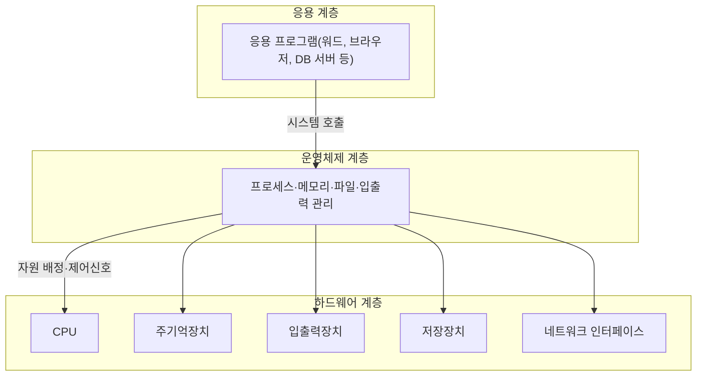

<Callout type="info">
  **이번 문서의 목표:** 이 파일을 다 읽으면 컴퓨터 시스템을 CPU·메모리·입출력·저장장치·네트워크가 하드웨어–운영체제–응용 세 계층 위에서 어떻게 맞물려 돌아가는 하나의 전체로 파악하고, 스루풋·응답시간·신뢰성·가용성을 실제 숫자로 계산해 두 시스템을 비교할 수 있다.
</Callout>

## 왜 이 과목은 "통합"이라는 이름을 달고 있는가

지금까지 컴퓨터구조는 컴퓨터구조대로, 운영체제는 운영체제대로, 컴퓨터네트워크는 네트워크대로 따로 배웠다. 각 과목은 그 안에서 완결된 이야기를 한다 — 컴퓨터구조는 "CPU가 어떻게 명령어 하나를 실행하는가"를, 운영체제는 "여러 프로세스에게 CPU와 메모리를 어떻게 나눠 주는가"를 각각의 눈높이에서 다룬다.

문제는 실제 시험(그리고 실제 시스템)에서는 이 경계가 사라진다는 점이다. "캐시 적중률이 떨어지면 프로세스의 응답시간에 어떤 영향을 주는가", "디스크 스케줄링을 바꾸면 시스템 전체의 스루풋이 어떻게 변하는가" 같은 문항은 컴퓨터구조 지식과 운영체제 지식을 동시에, 그것도 하나로 이어 붙여야 풀린다. 독학사 4단계 「통합컴퓨터시스템」은 바로 이 **이어 붙이는 능력**을 시험한다.

> **쉽게 말하면:** 이 과목은 새로운 지식을 처음부터 배우는 과목이 아니라, 이미 따로따로 아는 컴퓨터구조·운영체제 지식을 하나의 시스템 그림 위에 겹쳐 놓고 "그래서 전체적으로 어떻게 되는가"를 묻는 과목이다.

이 과목의 세부 계산(파이프라인, 캐시, CPU 스케줄링, 교착상태, 페이징, 디스크·RAID 등)은 [독학사 2단계 컴퓨터구조](/독학사/2단계_컴퓨터구조/06_computer-system-overview-and-performance)와 [독학사 2단계 운영체제](/독학사/2단계_운영체제/05_os-overview-and-types)에서 이미 다룬 개념들을 다시 쓴다. 이 편들과 완전히 똑같은 설명을 반복하지 않기 위해, 이 과목의 각 본론 편은 **기존 개념을 한두 문장으로 요약하고 링크로 넘긴 뒤, 곧바로 4단계 수준의 통합·비교·계산 문제**로 들어간다. 기초 정의부터 다시 읽고 싶다면 링크로 넘어간 편을 먼저 참고하는 것이 좋다.

## 시스템을 이루는 다섯 구성요소를 하나의 그림으로

> **쉽게 말하면:** 컴퓨터 한 대는 "생각하는 부품(CPU)", "당장 쓸 것을 두는 부품(메모리)", "오래 보관하는 부품(저장장치)", "바깥과 주고받는 부품(입출력·네트워크)"이 서로 신호를 주고받는 하나의 몸이다.

독학사 통합컴퓨터시스템 출제기준이 요구하는 "컴퓨터 시스템 구성"은 다음 다섯 구성요소를 하나의 유기적 그림으로 이해하는 것에서 출발한다.

| 구성요소 | 역할 | 이 과목에서 자세히 다루는 편 |
|---|---|---|
| CPU(Central Processing Unit, 중앙처리장치) | 명령어를 해석·실행하는 계산 주체 | 06–08편 |
| 주기억장치(main memory) | CPU가 지금 당장 쓰는 프로그램·데이터를 담는 고속 임시 저장소 | 09–10편, 16–17편 |
| 입출력장치(I/O device) | 키보드·모니터·네트워크 카드처럼 시스템 바깥과 신호를 주고받는 장치 | 11편 |
| 저장장치(secondary storage) | 전원이 꺼져도 내용이 남는 대용량 저장소(디스크 등) | 11–12편, 18편 |
| 네트워크(network) | 여러 컴퓨터 시스템을 연결해 자원을 공유하게 하는 통신 경로 | 19편 |

이 다섯 구성요소는 물리적으로는 따로 존재하지만, 논리적으로는 **하드웨어–운영체제–응용 프로그램**이라는 세 계층 위에 겹쳐서 동작한다.

이 그림에서 핵심은 **응용 프로그램이 하드웨어를 직접 건드리지 못한다**는 점이다. 응용 프로그램은 반드시 운영체제가 제공하는 시스템 호출(system call)이라는 창구를 거쳐야 CPU·메모리·디스크·네트워크에 접근할 수 있다. 운영체제는 이 요청들을 받아 실제 하드웨어 제어신호로 바꾸는 중개자 역할을 한다. 이 중개 과정에서 하드웨어 수준의 성능(파이프라인 효율, 캐시 적중률, 디스크 탐색시간)과 운영체제 수준의 정책(스케줄링, 페이지 교체, 디스크 스케줄링)이 서로 맞물려 시스템 전체 성능을 결정한다 — 이것이 이 과목이 "통합"인 이유다.

<Callout type="warning">
  시험 함정: 이 그림을 "하드웨어가 좋으면 시스템도 무조건 빠르다"로 단순화하면 안 된다. 아무리 CPU와 캐시가 빨라도, 운영체제의 스케줄링 정책이나 메모리 관리 정책이 나쁘면 그 하드웨어 성능을 응용 프로그램까지 전달하지 못한다. 통합형 문항은 항상 "하드웨어 요인과 운영체제 요인 중 무엇이 병목인가"를 함께 묻는다.
</Callout>

## 출제기준 영역을 이 과목의 목차에 매핑하기

국가평생교육진흥원의 최신 출제기준(공고 확인 필요)은 통합컴퓨터시스템 과목을 크게 하드웨어·시스템 영역과 운영체제 영역으로 나눈다. 아래 표는 그 영역이 이 과목의 어느 편에서 다뤄지는지, 그리고 더 기초적인 정의가 필요할 때 참고할 선수 과목 편을 정리한 것이다.

| 출제기준 영역 | 이 과목에서 다루는 편 | 선수 개념 참고(2단계 이하) |
|---|---|---|
| 컴퓨터 시스템 구성 | 05편(이 편) | [2단계 컴퓨터구조 06편](/독학사/2단계_컴퓨터구조/06_computer-system-overview-and-performance) |
| 프로세서·명령어·파이프라인 | 06–08편 | [2단계 컴퓨터구조 11–14편](/독학사/2단계_컴퓨터구조/11_cpu-registers-alu-control-unit), [19편](/독학사/2단계_컴퓨터구조/19_pipeline-and-parallel-processing-basics) |
| 메모리 계층·캐시 | 09–10편 | [2단계 컴퓨터구조 15–16편](/독학사/2단계_컴퓨터구조/16_cache-memory-mapping-and-replacement) |
| 입출력·저장장치 | 11–12편 | [2단계 컴퓨터구조 18편](/독학사/2단계_컴퓨터구조/18_io-interrupt-dma-and-bus) |
| 운영체제 원리·프로세스/스레드 | 13편 | [2단계 운영체제 05–06편](/독학사/2단계_운영체제/05_os-overview-and-types) |
| CPU 스케줄링 | 14편 | [2단계 운영체제 07–08편](/독학사/2단계_운영체제/07_cpu-scheduling-foundations) |
| 동기화·교착상태 | 15편 | [2단계 운영체제 10–11편](/독학사/2단계_운영체제/10_synchronization-and-critical-section) |
| 메모리 관리·가상메모리 | 16–17편 | [2단계 운영체제 12–15편](/독학사/2단계_운영체제/12_memory-management-basic) |
| 파일시스템 | 18편 | [2단계 운영체제 16–17편](/독학사/2단계_운영체제/16_file-system-fundamentals) |
| 멀티프로세서·병렬/분산 개요 | 19편 | [3단계 컴퓨터네트워크 05편](/독학사/3단계_컴퓨터네트워크/05_network-overview) |

**데이터베이스 설계·SQL 심화는 이 과목의 범위가 아니다.** 통합컴퓨터시스템은 하드웨어–운영체제 축의 통합을 다루며, 자료 저장의 논리적 설계는 [독학사 4단계 데이터베이스](/독학사/4단계_데이터베이스/01_exam-overview) 과목의 고유 범위다.

## 시스템 성능을 숫자로 말하는 네 가지 지표

> **쉽게 말하면:** "빠르다", "안정적이다"는 말만으로는 시험 답이 되지 않는다. 스루풋·응답시간·신뢰성·가용성이라는 네 개의 자로 재야 시스템을 비교할 수 있다.

개별 하드웨어의 성능 지표(CPI, MIPS 등)는 [2단계 컴퓨터구조 06편](/독학사/2단계_컴퓨터구조/06_computer-system-overview-and-performance)에서 이미 계산했다. 이 편에서는 그 지표들이 합쳐진 **시스템 전체 수준**의 지표 네 가지를 정리한다.

### 스루풋(throughput)과 응답시간(response time)

**스루풋**(throughput, 처리율)은 단위 시간당 시스템이 완료하는 작업(job)의 개수다.

$$
\text{스루풋} = \frac{\text{완료한 작업 수}}{\text{걸린 시간}}
$$

**응답시간**(response time)은 사용자가 요청을 보낸 시점부터 시스템이 첫 반응을 내놓기까지 걸리는 시간이다. 작업이 끝날 때까지 걸리는 전체 시간을 뜻하는 반환시간(turnaround time, 14편에서 CPU 스케줄링과 함께 다룬다)과는 다른 개념이라는 점에 주의한다.

**예제**: 어떤 서버가 1시간(3,600초) 동안 요청 7,200건을 처리했다.

$$
\text{스루풋} = \frac{7200\text{건}}{3600\text{초}} = 2\text{건/초}
$$

이 서버는 초당 2건을 처리하는 능력이 있다는 뜻이다. 스루풋만으로는 "사용자 한 명이 얼마나 기다렸는지"를 알 수 없다 — 그것은 응답시간이 따로 말해 준다. 두 지표가 항상 같은 방향으로 움직이는 것은 아니다. 예를 들어 여러 요청을 모아서 한꺼번에 처리하는 방식(배치 처리)은 스루풋은 높일 수 있지만, 개별 사용자의 응답시간은 오히려 늘어날 수 있다.

<Callout type="warning">
  시험 함정: "스루풋이 높으면 응답시간도 항상 짧다"는 진술은 **틀렸다.** 두 지표는 독립적으로 움직일 수 있으며, 시스템 설계에서는 이 둘 사이의 균형(trade-off)을 선택해야 하는 경우가 많다.
</Callout>

### 신뢰성(reliability)

**신뢰성**(reliability)은 시스템이 정해진 기간 동안 **고장 없이** 정상적으로 동작할 수 있는 정도를 말한다. 한 번이라도 고장(failure)이 나면 신뢰성 지표상으로는 그 순간 끝이다 — 고장 후 얼마나 빨리 고쳤는지는 신뢰성이 아니라 다음에 볼 가용성이 다루는 영역이다.

신뢰성을 나타내는 대표적인 값이 **평균 고장 간격**, 즉 **MTBF**(Mean Time Between Failures)다. MTBF는 고장이 발생한 시점부터 다음 고장이 발생하기까지 걸리는 시간의 평균이다. MTBF가 클수록 고장이 뜸하게 발생한다는 뜻이므로 신뢰성이 높다.

### 가용성(availability)

**가용성**(availability)은 신뢰성과 다르다 — 가용성은 "고장이 아예 안 나는가"가 아니라 다음 질문, 즉 "고장이 나도 얼마나 빨리 복구해서 전체 시간 중 실제로 쓸 수 있었던 비율이 얼마인가"를 본다.

가용성을 계산하려면 MTBF에 더해 **평균 수리 시간**, 즉 **MTTR**(Mean Time To Repair)이 필요하다. MTTR은 고장이 발생한 시점부터 복구를 마치기까지 걸리는 평균 시간이다.

$$
\text{가용성} = \frac{\text{MTBF}}{\text{MTBF} + \text{MTTR}}
$$

- $\text{MTBF}$: 평균 고장 간격(고장과 고장 사이, 정상 동작한 시간의 평균)
- $\text{MTTR}$: 평균 수리 시간(고장이 나고 나서 다시 정상화되기까지 걸린 시간의 평균)
- 분모(MTBF + MTTR)는 "정상 동작 시간 + 고장으로 멈춘 시간"을 합친 전체 시간이다. 분자(MTBF)는 그중 실제로 쓸 수 있었던 시간이다.

**예제**: 어떤 서버의 평균 고장 간격이 500시간이고, 고장이 나면 평균 10시간 만에 복구한다.

**1단계: 공식에 값을 대입한다.**

$$
\text{가용성} = \frac{500}{500 + 10}
$$

**2단계: 분모를 계산한다.**

$$
500 + 10 = 510
$$

**3단계: 나눈다.**

$$
\text{가용성} = \frac{500}{510} \approx 0.9804
$$

**결과 해석**: 이 서버는 전체 운영 시간의 약 98.04퍼센트(98.04%) 동안 정상적으로 쓸 수 있다는 뜻이다. 나머지 약 1.96퍼센트(1.96%)는 고장으로 멈춰 있는 시간이다.

<Callout type="warning">
  시험 함정: MTBF가 같아도 MTTR이 다르면 가용성은 크게 달라진다. 예를 들어 위 예제에서 MTTR이 10시간이 아니라 1시간이라면 가용성은 500/(500+1) ≈ 99.80퍼센트(99.80%)로 크게 올라간다. **"고장이 잦은가"(신뢰성)와 "고장이 나도 금방 고치는가"(가용성에 영향)는 서로 다른 축**이며, "신뢰성이 낮아도 복구가 빠르면 가용성은 높을 수 있다"는 결론이 시험에서 자주 나온다.
</Callout>

### 자주 틀리는 점

- 신뢰성과 가용성을 같은 개념으로 혼동한다. 신뢰성은 "고장 없이 버티는 능력", 가용성은 "고장이 나도 전체 시간 대비 실제로 쓸 수 있었던 비율"이다.
- MTBF를 "고장이 발생하는 주기"라고만 외우고 MTTR과의 관계(가용성 공식의 분모에 함께 들어간다는 점)를 놓친다.
- 스루풋 상승이 곧 사용자 체감 성능(응답시간) 개선이라고 단정한다.

## 핵심 정리

- 통합컴퓨터시스템은 새 지식이 아니라, 컴퓨터구조·운영체제 지식을 하드웨어–운영체제–응용의 한 시스템 그림 위에서 연결하는 과목이다.
- 응용 프로그램은 시스템 호출을 거쳐야만 운영체제를 통해 하드웨어에 접근하며, 하드웨어 성능과 운영체제 정책이 함께 시스템 전체 성능을 결정한다.
- 스루풋은 단위 시간당 처리한 작업 수, 응답시간은 요청부터 첫 반응까지 걸린 시간이며 서로 독립적으로 움직일 수 있다.
- 신뢰성은 MTBF로, 가용성은 MTBF/(MTBF+MTTR)로 계산하며 둘은 서로 다른 개념이다.
- 이 과목의 각 편은 기존 개념을 요약·링크로 넘기고 4단계 수준의 통합·계산·비교에 집중한다.

## 마무리 복습

<Quiz
  questionNumber={1}
  question="컴퓨터 시스템의 계층 구조에서 응용 프로그램이 하드웨어에 접근하는 방식으로 옳은 것은?"
  options={['응용 프로그램이 하드웨어 레지스터를 직접 제어한다', '운영체제가 제공하는 시스템 호출을 거쳐 간접적으로 접근한다', '네트워크를 통해서만 접근할 수 있다', '컴파일러가 하드웨어와 직접 통신한다']}
  correctAnswer={2}
  explanation="응용 프로그램은 운영체제가 제공하는 시스템 호출이라는 창구를 거쳐야만 CPU, 메모리, 디스크 등 하드웨어 자원에 접근할 수 있다."
  optionExplanations={['응용 프로그램이 하드웨어를 직접 제어하면 여러 프로그램이 충돌해 시스템이 불안정해지므로 운영체제가 이를 막는다', '정답이다. 시스템 호출은 응용 프로그램과 하드웨어 사이에서 운영체제가 중개하는 공식 통로다', '네트워크는 다섯 구성요소 중 하나일 뿐이며 하드웨어 접근의 유일한 경로가 아니다', '컴파일러는 소스코드를 기계어로 바꾸는 도구이며 실행 중 하드웨어 접근 경로와는 무관하다']}
/>

<Quiz
  questionNumber={2}
  question="평균 고장 간격(MTBF)이 900시간, 평균 수리 시간(MTTR)이 100시간인 시스템의 가용성은?"
  options={['10퍼센트', '90퍼센트', '99퍼센트', '100퍼센트']}
  correctAnswer={2}
  explanation="가용성 = MTBF/(MTBF+MTTR) = 900/(900+100) = 900/1000 = 0.9, 즉 90퍼센트다."
  optionExplanations={['MTTR을 분자로 잘못 대입한 계산 결과다', '정답이다. 900을 1000으로 나누면 0.9, 즉 90퍼센트다', 'MTBF만 보고 MTTR을 무시한 채 어림잡은 값으로 공식을 적용하지 않은 결과다', 'MTTR이 0이 아닌 이상 가용성이 100퍼센트가 될 수는 없다']}
/>

<Quiz
  questionNumber={3}
  question="신뢰성(reliability)과 가용성(availability)의 차이를 옳게 설명한 것은?"
  options={['두 지표는 완전히 같은 개념이며 계산식도 동일하다', '신뢰성은 고장 없이 버티는 능력을, 가용성은 고장 후 복구 속도까지 반영한 실사용 가능 비율을 나타낸다', '가용성은 MTBF만으로 계산하고 신뢰성은 MTTR만으로 계산한다', '신뢰성이 높으면 가용성은 항상 자동으로 100퍼센트가 된다']}
  correctAnswer={2}
  explanation="신뢰성은 MTBF로 대표되는 고장 없이 버티는 능력이고, 가용성은 MTBF와 MTTR을 함께 반영해 전체 시간 중 실제로 쓸 수 있었던 비율을 계산한다."
  optionExplanations={['두 지표는 계산식과 초점이 다른 별개의 개념이다', '정답이다. 신뢰성은 고장 자체의 빈도를, 가용성은 복구까지 포함한 실사용 비율을 본다', '가용성 공식은 MTBF와 MTTR을 모두 사용하며, 신뢰성 지표로 MTTR을 단독으로 쓰지 않는다', 'MTTR이 0보다 크면 신뢰성이 아무리 높아도 가용성은 100퍼센트에 못 미친다']}
/>

<Quiz
  questionNumber={4}
  question="어떤 시스템이 30분(1,800초) 동안 요청 3,600건을 처리했다면 이 시스템의 스루풋은?"
  options={['0.5건/초', '1건/초', '2건/초', '3,600건/초']}
  correctAnswer={3}
  explanation="스루풋 = 완료한 작업 수 / 걸린 시간 = 3600건 / 1800초 = 2건/초다."
  optionExplanations={['분자와 분모를 뒤바꿔 계산한 값이다', '단위 환산을 잘못해 1800초를 3600건과 같은 값으로 오인한 결과다', '정답이다. 3600을 1800으로 나누면 2건/초가 된다', '걸린 시간을 반영하지 않고 요청 건수만 그대로 쓴 값이다']}
/>

<Quiz
  questionNumber={5}
  question="스루풋과 응답시간의 관계에 대한 설명으로 옳은 것은?"
  options={['스루풋이 높아지면 응답시간도 항상 짧아진다', '두 지표는 항상 같은 방향으로만 움직인다', '배치 처리처럼 요청을 모아 처리하면 스루풋은 오르되 개별 응답시간은 늘어날 수 있다', '응답시간은 스루풋의 역수로 항상 정확히 계산된다']}
  correctAnswer={3}
  explanation="스루풋과 응답시간은 독립적으로 움직일 수 있는 지표이며, 요청을 모아 처리하는 배치 방식은 스루풋을 높이는 대신 개별 응답시간을 늘릴 수 있다."
  optionExplanations={['두 지표는 독립적으로 움직일 수 있어 항상 같은 방향이라고 단정할 수 없다', '앞 선택지와 같은 이유로 항상 같은 방향이라는 진술은 옳지 않다', '정답이다. 배치 처리는 스루풋 상승과 응답시간 증가가 동시에 나타날 수 있는 대표적인 사례다', '응답시간과 스루풋은 서로 다른 정의를 가진 별개의 지표로, 단순 역수 관계로 항상 환산되지 않는다']}
/>

<Quiz
  questionNumber={6}
  question="통합컴퓨터시스템 과목의 성격에 대한 설명으로 옳지 않은 것은?"
  options={['컴퓨터구조와 운영체제 지식을 하나의 시스템 관점으로 연결한다', '하드웨어 성능이 좋으면 운영체제 정책과 무관하게 항상 최고의 시스템 성능이 보장된다', '출제기준의 여러 영역이 통합형 문항에서 함께 묻힐 수 있다', '데이터베이스 설계·SQL 심화는 이 과목의 고유 범위가 아니다']}
  correctAnswer={2}
  explanation="하드웨어 성능이 아무리 좋아도 운영체제의 스케줄링·메모리 관리 정책이 나쁘면 그 성능이 응용 프로그램까지 전달되지 않으므로, 옳지 않은 설명이다."
  optionExplanations={['이 과목의 정의와 일치하는 옳은 설명이다', '정답이다. 하드웨어 성능과 운영체제 정책은 함께 시스템 성능을 결정하므로 무관하다는 서술은 틀렸다', '통합형 문항의 특징을 옳게 설명하고 있다', '학습방향에서 명시한 제외 범위와 일치하는 옳은 설명이다']}
/>

## 참고 자료

- [국가평생교육진흥원 독학학위제](https://bdes.nile.or.kr)
- [Silberschatz et al., Operating System Concepts 강의노트 요약](https://www.os-book.com)
- [Patterson & Hennessy, Computer Organization and Design 강의 자료](https://www.elsevier.com/books/computer-organization-and-design-mips-edition/patterson/978-0-12-820109-1)
