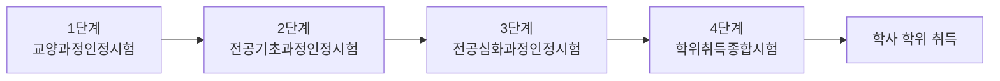
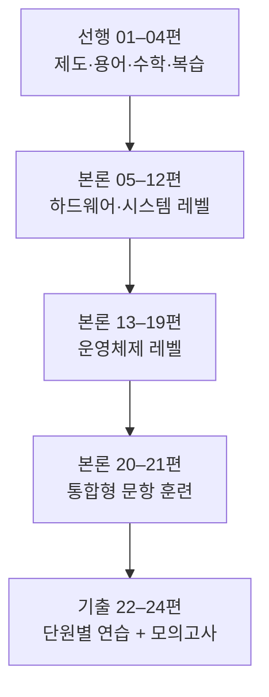

<Callout type="info">
  **이번 문서의 목표:** 독학사 학위취득 과정에서 4단계(학위취득종합시험)가 어떤 위치인지, 그중 통합컴퓨터시스템 과목이 무엇을 왜 통합해서 묻는지, 출제기준이 어떤 영역으로 나뉘는지를 이해하고, 앞으로 이어질 24편의 학습 지도를 머릿속에 그릴 수 있다.
</Callout>

## 왜 "통합" 컴퓨터시스템인가

독학사(독학에 의한 학위취득제도)는 국가평생교육진흥원(NILE, National Institute of Lifelong Education)이 시행하는 국가시험으로, 학교를 다니지 않고도 학사 학위를 취득할 수 있게 해주는 제도다. 컴퓨터공학 전공은 보통 1단계 교양과정인정시험, 2단계 전공기초과정인정시험, 3단계 전공심화과정인정시험, 4단계 학위취득종합시험까지 네 단계를 순서대로 통과해야 학위가 나온다.

> **쉽게 말하면:** 1~3단계가 "과목별로 나눠 배운 것"이라면, 4단계는 "그걸 다 합쳐서 한 사람의 전공 실력을 종합 판정하는 마지막 관문"이다.

3단계까지는 컴퓨터구조, 운영체제, 컴퓨터네트워크, 데이터베이스 같은 과목이 각각 독립된 시험으로 나뉘어 있었다. 그런데 4단계에서는 이 네 과목의 핵심을 하나로 묶은 **통합컴퓨터시스템**이라는 과목이 등장한다. 이유는 단순하다 — 실제 컴퓨터 시스템은 프로세서·메모리·운영체제·네트워크·저장장치가 서로 맞물려 동작하는 하나의 덩어리이고, 학위를 줄 만한 실력이 있는지 확인하려면 "이 부품들이 서로 어떻게 영향을 주고받는지"까지 볼 수 있어야 하기 때문이다.

예를 들어 캐시 미스율이 올라가면 CPU가 메모리를 더 자주 기다리게 되고, 이는 운영체제의 CPU 스케줄링 결과(대기시간)에도 영향을 준다. 3단계까지는 이런 연결고리를 각 과목 안에서만 다뤘다면, 4단계는 "캐시 미스율이 오르면 전체 시스템 처리량(throughput, 단위 시간당 처리하는 일의 양)이 왜 떨어지는가"를 한 문제 안에서 묻는다.

## 독학사 단계별 흐름과 4단계의 위치

각 단계는 시험에 합격해야 다음 단계로 넘어갈 수 있는 구조이며, 이미 학점은행제·정규 대학 학점 등으로 특정 단계를 면제받는 경로도 있다. 정확한 면제 조건과 응시 자격은 매 회차 공고마다 세부 사항이 달라질 수 있으므로 **국가평생교육진흥원 독학학위제 공고 확인이 필요**하다.

아래 표는 각 단계의 성격을 요약한 것이다.

| 단계 | 시험명 | 성격 | 통합컴퓨터시스템과의 관계 |
|---|---|---|---|
| 1단계 | 교양과정인정시험 | 전공과 무관한 교양 과목 위주 | 직접 관련 없음 |
| 2단계 | 전공기초과정인정시험 | 전공 입문 개념(컴퓨터구조, 운영체제 등 개별 과목) | 개별 과목으로 먼저 학습하는 선행 지식 |
| 3단계 | 전공심화과정인정시험 | 전공 심화 개념(컴퓨터네트워크, 데이터베이스 등) | 개별 과목으로 먼저 학습하는 선행 지식 |
| 4단계 | 학위취득종합시험 | 전공 전체를 종합해 응시자의 학사 수준을 최종 판정 | 이 과목이 속한 단계, 여러 과목의 통합 문항 출제 |

## 통합컴퓨터시스템 과목의 성격

이 과목은 크게 두 축의 내용을 다룬다.

1. **하드웨어·시스템 축** — 프로세서 구조, 명령어 처리, 파이프라인, 메모리 계층, 캐시, 입출력, 저장장치. 이 사이트의 `content/독학사2/컴퓨터구조/`에서 다루는 내용과 주제가 겹친다.
2. **운영체제 축** — 프로세스·스레드, CPU 스케줄링, 동기화·교착상태, 가상메모리, 파일시스템. `content/독학사2/운영체제/`와 주제가 겹친다.

여기에 **멀티프로세서·병렬·분산 시스템 개요**가 더해져, 단일 컴퓨터를 넘어 여러 대의 컴퓨터가 함께 일하는 상황까지 시야를 넓힌다.

> **쉽게 말하면:** 통합컴퓨터시스템은 새로운 지식보다 "이미 배운 컴퓨터구조·운영체제 지식을 얼마나 유기적으로 연결해서 쓸 수 있는가"를 확인하는 과목이다.

이 시리즈는 3단계까지의 기초 정의(이진수, 프로세스란 무엇인가 같은 왕초보 설명)를 반복하지 않는다. 대신 04편에서 "3단계 수준 복습"을 짧게 압축해 제공한 뒤, 05편부터는 곧바로 4단계 난이도(계산·통합·서술형 사고)로 들어간다. 이 사이트에 이미 있는 2단계 컴퓨터구조·운영체제, 3단계 컴퓨터네트워크, 4단계 데이터베이스 문서와 겹치는 정의는 요약 후 링크로 넘기고, 이 시리즈는 **통합 관점의 계산·비교·시나리오**에 집중한다.

## 출제기준의 영역 구조

독학사 각 과목은 국가평생교육진흥원이 공개하는 **출제기준**(평가영역과 평가내용을 정리한 공식 문서)을 기준으로 문제가 출제된다. 통합컴퓨터시스템 과목의 출제기준은 대체로 다음과 같은 영역으로 구성된다(정확한 영역명·배점 비중은 회차마다 바뀔 수 있으므로 **최신 출제기준 PDF 확인이 반드시 필요**하다).

| 영역 | 다루는 핵심 내용 | 이 시리즈의 대응 편 |
|---|---|---|
| 컴퓨터 시스템 구성 | 시스템 전체 구조, 성능 지표 | 05 |
| 프로세서·명령어·파이프라인 | 명령어 실행, 파이프라인 해저드 | 06–08 |
| 메모리 계층 | 캐시 매핑·정책 | 09–10 |
| 입출력·저장장치 | I/O 방식, 디스크·RAID | 11–12 |
| 운영체제 원리·프로세스/스레드 | 프로세스 모델, 스케줄링 | 13–14 |
| 동기화·교착상태 | 임계구역, 데드락 | 15 |
| 메모리 관리·가상메모리 | 페이징, 페이지 교체 | 16–17 |
| 파일시스템 | 파일 할당, 디렉터리 | 18 |
| 멀티프로세서·병렬·분산 | SMP, 캐시 일관성, 분산 개요 | 19 |
| 통합형 문항 | 여러 영역을 엮은 시나리오 | 20–21 |

각 영역의 **문항 비중은 균등하지 않을 수 있다.** 예를 들어 계산 문제가 자주 나오는 캐시·스케줄링·페이징 영역이 상대적으로 비중이 높게 느껴지는 경우가 많지만, 이는 공식 배점표가 아니라 시험 경향에 대한 일반적 관찰이므로 **실제 배점은 공고된 출제기준을 우선한다.**

## 문항 유형·시험 시간·배점

독학사 시험은 과목마다 객관식(4지선다)을 기본으로 하되, 4단계 학위취득종합시험은 과목에 따라 **주관식(서술형)이 함께 출제되는 경우**가 있다. 통합컴퓨터시스템처럼 계산·통합 사고를 요구하는 과목은 서술형 비중이 있을 가능성을 염두에 두고 준비하는 편이 안전하다.

> **자주 틀리는 점:** "독학사는 다 객관식"이라고 단정하고 서술형 대비를 전혀 하지 않는 경우가 있다. 회차별 문항 구성·배점·시험 시간은 공고마다 달라질 수 있으므로, 반드시 **응시하려는 회차의 공식 응시요강을 확인**해야 한다.

이 시리즈는 이런 불확실성을 감안해, 이론 설명 단계에서도 "왜 그런 결과가 나오는지"를 서술형 답안처럼 풀어 쓰는 방식을 취한다. 객관식 문제라도 서술형 수준의 이해가 없으면 "옳지 않은 것을 고르시오"류의 함정에 걸리기 쉽기 때문이다.

## 이 시리즈를 읽는 순서

01편(이 문서)에서 시험 구조를 잡고, 02편에서 이 과목 전체에서 반복해 쓰이는 용어 지도를 그리고, 03편에서 계산 문제에 필요한 수학 도구를 정리하고, 04편에서 3단계 수준 컴퓨터구조·운영체제를 압축 복습한다. 그 다음부터가 진짜 4단계 본론이다.

## 핵심 정리

- 독학사는 1~4단계로 구성되며, 4단계 학위취득종합시험이 마지막 관문이다.
- 통합컴퓨터시스템은 컴퓨터구조·운영체제(및 네트워크·DB의 일부 시야)를 하나로 묶어 통합 관점·계산·시나리오형 문항으로 묻는 4단계 과목이다.
- 출제기준은 시스템 구성, 프로세서·파이프라인, 메모리 계층, 입출력·저장장치, 운영체제 각 영역, 멀티프로세서·병렬·분산, 통합형 문항으로 구성된다.
- 문항 유형·시간·배점은 회차 공고마다 달라질 수 있으므로 항상 최신 공고를 확인해야 한다.
- 이 시리즈는 05편부터 곧바로 4단계 난이도로 들어가므로, 3단계 기초가 흐릿하다면 04편 복습을 건너뛰지 않는다.

## 마무리 복습

<Quiz
  questionNumber={1}
  question="독학사 4단계 학위취득종합시험의 성격으로 가장 적절한 것은?"
  options={['전공과 무관한 교양 과목만 평가하는 시험이다', '전공 여러 과목의 내용을 종합해 학사 수준을 최종 판정하는 시험이다', '실습 위주의 자격증 시험으로 이론 문항은 출제되지 않는다', '2단계를 통과하면 자동으로 면제되는 시험이다']}
  correctAnswer={2}
  explanation="4단계 학위취득종합시험은 1~3단계에서 배운 전공 지식을 종합해 학사 학위를 줄 만한 수준인지 최종 판정하는 시험이다."
  optionExplanations={['1단계 교양과정인정시험에 대한 설명이며 4단계와 무관하다', '정답. 통합컴퓨터시스템처럼 여러 전공 과목을 통합한 과목이 이 단계에 등장하는 이유다', '독학사는 국가 학위 시험이며 자격증 실기 시험과 성격이 다르다', '4단계는 별도로 응시해 합격해야 하는 시험이며 자동 면제 대상이 아니다']}
/>

<Quiz
  questionNumber={2}
  question="통합컴퓨터시스템 과목이 컴퓨터구조와 운영체제를 함께 묶어 다루는 이유로 가장 타당한 것은?"
  options={['두 과목의 내용이 완전히 동일하기 때문이다', '실제 컴퓨터 시스템에서 하드웨어와 운영체제가 서로 영향을 주고받으며 동작하기 때문이다', '컴퓨터구조 과목이 4단계에서 폐지되었기 때문이다', '운영체제는 하드웨어와 무관하게 독립적으로 동작하기 때문이다']}
  correctAnswer={2}
  explanation="캐시 미스율이 CPU 대기시간과 스케줄링 결과에 영향을 주는 것처럼, 하드웨어와 운영체제는 서로 맞물려 동작하므로 통합 관점의 이해가 필요하다."
  optionExplanations={['두 과목은 다루는 주제가 다르며 내용이 동일하지 않다', '정답. 통합 문항은 이 상호작용을 확인하기 위해 출제된다', '컴퓨터구조는 2단계 과목으로 계속 존재하며 폐지되지 않았다', '운영체제는 하드웨어 자원을 관리하는 소프트웨어이므로 하드웨어와 밀접하게 연관된다']}
/>

<Quiz
  questionNumber={3}
  question="독학사 출제기준에 대한 설명으로 옳지 않은 것은?"
  options={['국가평생교육진흥원이 공개하는 평가영역·평가내용 문서다', '과목별 출제 범위와 방향을 파악하는 공식 근거 자료다', '한 번 공개되면 이후 회차에서도 절대 개정되지 않는다', '통합컴퓨터시스템 과목은 여러 영역으로 나뉜 출제기준을 갖는다']}
  correctAnswer={3}
  explanation="출제기준은 필요에 따라 개정될 수 있으므로 항상 최신 공고를 확인해야 하며, 절대 불변이라는 설명은 옳지 않다."
  optionExplanations={['옳은 설명이다', '옳은 설명이다', '정답. 출제기준은 개정될 수 있으므로 이 설명이 옳지 않다', '옳은 설명이다']}
/>

<Quiz
  questionNumber={4}
  question="다음 중 통합컴퓨터시스템 출제기준의 영역으로 보기 어려운 것은?"
  options={['프로세서·명령어·파이프라인', '메모리 계층과 캐시', '운영체제의 프로세스·스케줄링', '특정 상용 클라우드 서비스의 요금제 비교']}
  correctAnswer={4}
  explanation="출제기준은 컴퓨터 시스템의 보편적 원리(구조, 성능, 운영체제 등)를 다루며, 특정 상용 서비스의 요금 정책 같은 실무 세부사항은 범위에 포함되지 않는다."
  optionExplanations={['출제기준에 포함되는 핵심 영역이다', '출제기준에 포함되는 핵심 영역이다', '출제기준에 포함되는 핵심 영역이다', '정답. 특정 상용 제품의 요금제는 학문적 출제기준의 범위가 아니다']}
/>

<Quiz
  questionNumber={5}
  question="독학사 4단계 시험의 문항 유형에 대한 설명으로 가장 안전한 태도는?"
  options={['모든 과목이 항상 객관식만 출제되므로 서술형 대비는 불필요하다', '회차별 문항 구성과 배점이 달라질 수 있으므로 최신 공고를 확인하고 서술형 대비도 함께 한다', '문항 유형은 과목명과 무관하게 전 과목이 동일하다', '통합컴퓨터시스템은 계산이 없는 암기 과목이므로 공식은 외울 필요가 없다']}
  correctAnswer={2}
  explanation="독학사 4단계는 과목에 따라 서술형이 포함될 수 있고 회차마다 세부 사항이 달라질 수 있으므로, 공고를 확인하고 서술형까지 대비하는 것이 안전하다."
  optionExplanations={['서술형이 포함되는 과목이 있을 수 있어 위험한 가정이다', '정답. 불확실성을 인정하고 폭넓게 대비하는 태도가 안전하다', '과목 성격에 따라 문항 구성은 달라질 수 있다', '통합컴퓨터시스템은 캐시·스케줄링·페이징 등 계산 문항 비중이 큰 과목이다']}
/>

<Quiz
  questionNumber={6}
  question="이 시리즈에서 04편(3단계 수준 복습)을 배치한 이유로 가장 적절한 것은?"
  options={['4단계 시험에 3단계 문제가 그대로 출제되기 때문이다', '05편부터 곧바로 4단계 난이도로 들어가기 전에 필요한 최소 선행 지식을 압축 정리하기 위해서다', '분량을 채우기 위한 형식적 구성일 뿐 학습에는 필요 없다', '3단계 컴퓨터구조·운영체제 과목을 완전히 대체하기 위해서다']}
  correctAnswer={2}
  explanation="04편은 3단계 내용을 처음부터 전부 재설명하지 않고, 4단계 본론을 이해하는 데 필요한 최소한의 기초만 압축해 제공하는 다리 역할을 한다."
  optionExplanations={['4단계는 3단계 문제를 그대로 출제하지 않고 통합·응용 수준으로 재구성해 출제한다', '정답. 기초가 흐릿한 상태로 본론에 들어가면 통합형 문항에서 혼동이 생기기 쉽다', '학습 순서상 필요한 다리 역할을 하는 편이다', '3단계 과목을 완전히 대체하는 것이 아니라 이 과목에 필요한 만큼만 압축한 것이다']}
/>

## 참고 자료

- [국가평생교육진흥원 독학학위제](https://bdes.nile.or.kr)
