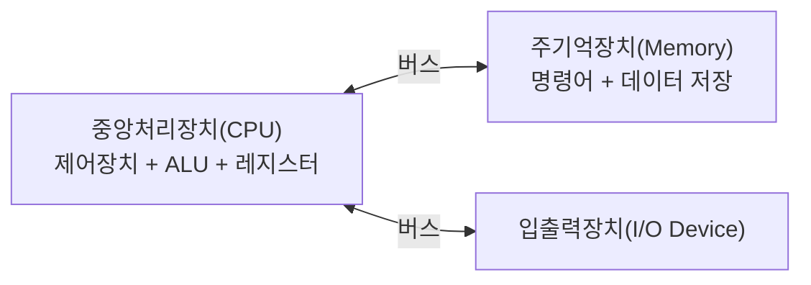
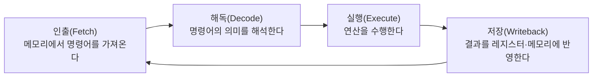
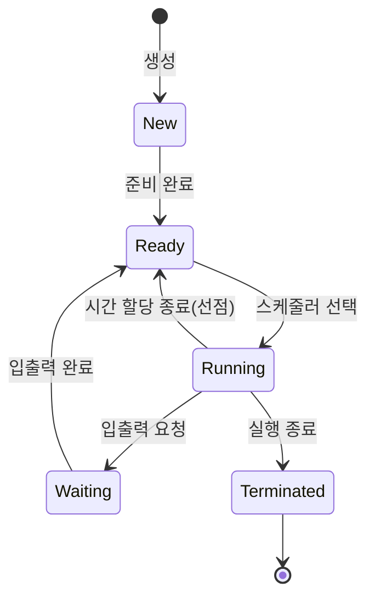
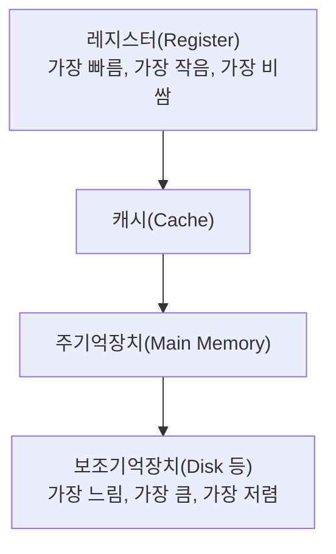

<Callout type="info">
  **이번 문서의 목표:** 05편부터 시작되는 4단계 본론에 들어가기 전, 폰 노이만 구조·명령어 실행 사이클·운영체제의 역할·프로세스 상태·메모리 계층·입출력 개요를 이 과목에서 필요한 최소한의 수준으로 압축 복습한다.
</Callout>

## 이 편의 위치 — 전부 재설명하지 않는다

이 시리즈는 3단계 컴퓨터구조·운영체제 과목의 왕초보 정의(이진수란 무엇인가, 프로세스란 무엇인가)를 처음부터 다시 설명하지 않는다. 대신 이 편에서 "4단계 본론을 이해하는 데 반드시 있어야 하는 최소 뼈대"만 빠르게 정리하고, 자세한 내용은 이 사이트의 2단계 컴퓨터구조·운영체제 문서로 연결한다.

> **쉽게 말하면:** 이 편은 본격적인 요리(05편부터)를 시작하기 전에 재료 손질만 빠르게 끝내두는 편이다.

## 폰 노이만 구조 — 컴퓨터가 프로그램을 실행하는 기본 틀

폰 노이만 구조(von Neumann architecture)는 오늘날 대부분의 컴퓨터가 따르는 설계 원칙이다. 핵심 아이디어는 **프로그램(명령어)과 데이터를 같은 기억장치에 저장**하고, 프로세서가 그 기억장치에서 명령어를 하나씩 순서대로 꺼내 실행한다는 것이다.

이 구조의 네 가지 핵심 구성요소는 다음과 같다.

- **중앙처리장치(CPU, Central Processing Unit)**: 명령어를 해석하고 실행하는 부품. 내부에 제어장치(control unit), 산술논리장치(ALU, Arithmetic Logic Unit), 레지스터(register, CPU 내부의 초고속 임시 저장 공간)를 가진다.
- **주기억장치(main memory)**: 실행 중인 프로그램의 명령어와 데이터를 저장하는 공간. 흔히 RAM(Random Access Memory, 임의 접근 기억장치)이라 부른다.
- **입출력장치(I/O device)**: 키보드, 모니터, 디스크처럼 컴퓨터와 외부 세계를 연결하는 장치.
- **버스(bus)**: 이들 사이에서 주소·데이터·제어 신호를 실어 나르는 공용 통로.

> **비유:** 폰 노이만 구조는 "요리사(CPU)가 레시피(명령어)와 재료(데이터)를 같은 냉장고(메모리)에 넣어두고, 필요할 때마다 하나씩 꺼내 쓰는" 부엌과 비슷하다. 레시피와 재료가 같은 곳에 있기 때문에 프로그램을 자유롭게 바꿔 넣을 수 있다는 것이 이 구조의 큰 장점이다.

## 명령어 실행 사이클

CPU는 하나의 명령어를 처리할 때 정해진 단계를 반복한다. 이를 명령어 실행 사이클(instruction cycle)이라 부른다.

- **인출(fetch)**: 프로그램 카운터(PC, Program Counter, 다음에 실행할 명령어의 주소를 담은 레지스터)가 가리키는 메모리 위치에서 명령어를 읽어온다.
- **해독(decode)**: 읽어온 명령어가 어떤 연산인지, 어떤 데이터를 대상으로 하는지 해석한다.
- **실행(execute)**: ALU가 실제 연산(덧셈, 비교 등)을 수행한다.
- **저장(writeback)**: 연산 결과를 레지스터나 메모리에 반영한다.

이 사이클은 프로그램이 끝날 때까지 계속 반복된다. 07편의 파이프라인은 바로 이 네 단계(또는 더 세분화된 단계)를 겹쳐 실행해 처리량을 높이는 기법이므로, 이 사이클의 순서를 정확히 기억해 두는 것이 중요하다. 자세한 명령어 형식·주소 지정 방식은 06편에서, 인터럽트를 포함한 확장된 사이클은 이 사이트의 [컴퓨터구조 12편](/독학사2/컴퓨터구조/12_instruction-cycle-and-interrupts)에서 다룬다.

## 운영체제의 역할 — 자원 관리자이자 추상화 제공자

운영체제(OS, Operating System)는 하드웨어와 응용 프로그램 사이에서 두 가지 큰 역할을 한다.

1. **자원 관리(resource management)**: CPU, 메모리, 입출력 장치 같은 한정된 자원을 여러 프로그램이 안전하고 효율적으로 나눠 쓰도록 조정한다.
2. **추상화(abstraction)**: 하드웨어의 복잡한 세부사항을 응용 프로그램이 몰라도 되게끔 단순한 인터페이스(시스템 호출, system call)로 감싸서 제공한다.

> **쉽게 말하면:** 운영체제는 "여러 세입자(프로그램)가 하나의 건물(하드웨어)을 쓸 때 방을 배정하고 전기·수도를 관리해주는 관리사무소"다.

이 두 역할은 이후 편에서 다룰 모든 주제의 배경이 된다. CPU 스케줄링(14편)은 자원 관리의 CPU 버전이고, 가상메모리(17편)는 메모리 자원 관리와 추상화가 결합된 예다. 운영체제의 유형(단일 사용자·다중 사용자·다중 프로그래밍·시분할 등)에 대한 자세한 설명은 이 사이트의 [운영체제 5편](/독학사2/운영체제/05_os-overview-and-types)을 참고한다.

## 프로세스 상태 모델

프로세스(실행 중인 프로그램)는 생애 동안 몇 가지 상태를 오간다. 4단계 본론(13~15편)에서 이 상태 전이를 계산·시나리오 문제에 활용하므로, 기본 형태를 다시 확인해 둔다.

- **생성(new)**: 프로세스가 막 만들어진 상태
- **준비(ready)**: CPU만 배정받으면 바로 실행할 수 있는 상태
- **실행(running)**: 실제로 CPU를 점유해 명령어를 실행 중인 상태
- **대기(waiting)**: 입출력 등 어떤 사건을 기다리느라 실행할 수 없는 상태
- **종료(terminated)**: 실행이 끝난 상태

이 상태 사이의 이동은 운영체제의 스케줄러(scheduler)가 결정한다. 상태 전이의 세부 조건과 PCB(Process Control Block, 프로세스 제어 블록)에 대한 자세한 설명은 이 사이트의 [운영체제 3편](/독학사2/운영체제/03_process-and-state-model)을 참고하고, 이 시리즈에서는 13편에서 이 모델을 4단계 시나리오 문제에 바로 연결한다.

## 메모리 계층 개요

메모리는 속도와 용량, 비용이 서로 트레이드오프(trade-off, 하나를 얻으면 다른 하나를 잃는 관계) 관계에 있다. 그래서 컴퓨터는 여러 종류의 기억장치를 계층(hierarchy)으로 쌓아 쓴다.

위로 갈수록 접근 속도는 빨라지지만 용량은 작아지고 비용(비트당 가격)은 비싸진다. 이 계층 구조가 성립하는 이유와 각 계층의 세부 동작(캐시의 매핑 방식, 주기억장치의 구성)은 09편부터 본격적으로 다룬다. 지금은 "빠른 것은 작고 비싸며, 느린 것은 크고 저렴하다"는 트레이드오프만 기억해 둔다.

## 입출력 개요

입출력장치는 CPU보다 훨씬 느리게 동작하는 경우가 많아, CPU가 입출력을 처리하는 방식이 시스템 성능에 큰 영향을 준다. 대표적인 세 가지 방식은 다음과 같다.

| 방식 | 동작 개념 | 특징 |
|---|---|---|
| 프로그램 제어 입출력(programmed I/O) | CPU가 입출력장치의 상태를 계속 확인(polling)하며 직접 데이터를 주고받음 | 구현이 단순하지만 CPU 시간을 낭비함 |
| 인터럽트 기반 입출력(interrupt-driven I/O) | 입출력이 끝나면 장치가 CPU에 인터럽트 신호를 보내 알림 | CPU가 다른 작업을 할 수 있어 효율적 |
| DMA(Direct Memory Access, 직접 메모리 접근) | 별도의 DMA 컨트롤러가 CPU 없이 메모리와 장치 사이 데이터를 직접 전송 | CPU 개입을 최소화해 대용량 전송에 유리 |

이 세 방식의 자세한 동작과 계산 문제는 11편에서 디스크 구조와 함께 깊게 다룬다.

## 이 편이 앞으로의 편과 연결되는 지점

| 이 편의 내용 | 자세히 다루는 본론 편 |
|---|---|
| 폰 노이만 구조, 명령어 실행 사이클 | 06(프로세서 구조), 07–08(파이프라인) |
| 운영체제의 자원 관리·추상화 | 13(운영체제 구조), 14(스케줄링) |
| 프로세스 상태 모델 | 13, 15(동기화·교착상태) |
| 메모리 계층 | 09–10(캐시), 16–17(메모리 관리·가상메모리) |
| 입출력 방식 | 11–12(입출력·저장장치·RAID) |

## 핵심 정리

- 폰 노이만 구조는 명령어와 데이터를 같은 기억장치에 저장하고, CPU가 이를 인출-해독-실행-저장 사이클로 처리하는 설계다.
- 운영체제는 하드웨어 자원을 관리하고 응용 프로그램에게 단순한 인터페이스를 제공하는 이중 역할을 한다.
- 프로세스는 생성-준비-실행-대기-종료 상태를 오가며, 이 전이는 스케줄러가 결정한다.
- 메모리는 속도·용량·비용의 트레이드오프 때문에 레지스터-캐시-주기억장치-보조기억장치의 계층으로 구성된다.
- 입출력은 프로그램 제어, 인터럽트 기반, DMA의 세 방식으로 구현되며 갈수록 CPU 개입이 줄어든다.

## 마무리 복습

<Quiz
  questionNumber={1}
  question="폰 노이만 구조의 핵심 아이디어로 가장 적절한 것은?"
  options={['프로그램과 데이터를 서로 다른 기억장치에 물리적으로 분리해 저장한다', '프로그램(명령어)과 데이터를 같은 기억장치에 저장하고 순서대로 인출해 실행한다', '입출력장치는 CPU 없이도 스스로 프로그램을 실행할 수 있다', 'CPU는 레지스터 없이 메모리에서 직접 연산을 수행한다']}
  correctAnswer={2}
  explanation="폰 노이만 구조는 명령어와 데이터를 같은 기억장치에 저장하고, CPU가 순서대로 인출해 실행하는 방식을 특징으로 한다."
  optionExplanations={['이는 하버드 구조 계열의 설명에 가까우며 폰 노이만 구조의 핵심 특징이 아니다', '정답. 명령어와 데이터를 같은 공간에 저장한다는 점이 핵심이다', '입출력장치는 CPU와 운영체제의 제어를 받아 동작한다', 'CPU 내부에는 연산을 위한 레지스터가 존재한다']}
/>

<Quiz
  questionNumber={2}
  question="명령어 실행 사이클의 올바른 순서는?"
  options={['해독 → 인출 → 실행 → 저장', '인출 → 실행 → 해독 → 저장', '인출 → 해독 → 실행 → 저장', '실행 → 인출 → 해독 → 저장']}
  correctAnswer={3}
  explanation="명령어 실행 사이클은 메모리에서 명령어를 가져오는 인출, 의미를 해석하는 해독, 연산을 수행하는 실행, 결과를 반영하는 저장의 순서로 진행된다."
  optionExplanations={['인출이 해독보다 먼저 일어나야 하므로 순서가 옳지 않다', '해독이 실행보다 먼저 일어나야 하므로 순서가 옳지 않다', '정답. 인출-해독-실행-저장의 순서가 올바르다', '인출이 가장 먼저 일어나야 하므로 순서가 옳지 않다']}
/>

<Quiz
  questionNumber={3}
  question="운영체제의 두 가지 핵심 역할로 옳게 짝지어진 것은?"
  options={['자원 관리와 추상화 제공', '회로 설계와 부품 제조', '네트워크 케이블 배선과 전력 공급', '컴파일러 설계와 데이터베이스 인덱싱']}
  correctAnswer={1}
  explanation="운영체제는 한정된 하드웨어 자원을 여러 프로그램이 나눠 쓰도록 관리하고, 복잡한 하드웨어를 단순한 인터페이스로 감싸 제공하는 두 가지 역할을 한다."
  optionExplanations={['정답. 자원 관리와 추상화 제공이 운영체제의 핵심 역할이다', '이는 하드웨어 설계·제조 영역으로 운영체제의 역할이 아니다', '이는 물리적 인프라 영역으로 운영체제의 핵심 역할이 아니다', '이는 각각 별도의 소프트웨어 영역이며 운영체제 고유의 핵심 역할로 보기 어렵다']}
/>

<Quiz
  questionNumber={4}
  question="프로세스 상태 모델에서 실행(running) 상태의 프로세스가 입출력을 요청했을 때 이동하는 상태는?"
  options={['준비(ready)', '대기(waiting)', '종료(terminated)', '생성(new)']}
  correctAnswer={2}
  explanation="실행 중인 프로세스가 입출력을 요청하면 그 결과를 기다려야 하므로 대기 상태로 이동한다."
  optionExplanations={['준비 상태는 시간 할당이 끝나 선점되었을 때 이동하는 상태다', '정답. 입출력을 기다려야 하므로 대기 상태로 이동한다', '종료 상태는 실행을 완전히 마쳤을 때의 상태다', '생성 상태는 프로세스가 처음 만들어졌을 때의 상태로 실행 중인 프로세스가 되돌아가지 않는다']}
/>

<Quiz
  questionNumber={5}
  question="메모리 계층 구조에 대한 설명으로 옳지 않은 것은?"
  options={['레지스터는 캐시보다 접근 속도가 빠르다', '보조기억장치는 주기억장치보다 일반적으로 저장 용량이 크다', '계층이 올라갈수록(레지스터에 가까울수록) 비트당 비용은 저렴해진다', '캐시는 레지스터보다 느리지만 주기억장치보다는 빠르다']}
  correctAnswer={3}
  explanation="계층이 올라갈수록 속도는 빨라지지만 용량이 작고 비트당 비용은 오히려 비싸진다는 것이 메모리 계층의 트레이드오프이므로, 비용이 저렴해진다는 설명은 옳지 않다."
  optionExplanations={['옳은 설명이다', '옳은 설명이다', '정답. 계층이 올라갈수록 비트당 비용은 비싸지므로 이 설명이 옳지 않다', '옳은 설명이다']}
/>

<Quiz
  questionNumber={6}
  question="입출력 방식 중 DMA(Direct Memory Access)에 대한 설명으로 가장 적절한 것은?"
  options={['CPU가 입출력장치의 상태를 계속 직접 확인해야 하는 방식이다', '별도의 컨트롤러가 CPU 개입 없이 메모리와 장치 사이 데이터를 직접 전송하는 방식이다', '입출력이 끝났을 때만 CPU에 신호를 보내고 그 외에는 CPU가 직접 데이터를 전송하는 방식이다', '입출력장치가 스스로 프로그램을 실행하는 방식이다']}
  correctAnswer={2}
  explanation="DMA는 CPU를 거치지 않고 DMA 컨트롤러가 메모리와 입출력장치 사이의 데이터 전송을 직접 처리해 CPU 부담을 줄이는 방식이다."
  optionExplanations={['이는 프로그램 제어 입출력에 대한 설명이다', '정답. DMA는 CPU 개입을 최소화하는 전송 방식이다', '전송 자체를 CPU가 아니라 DMA 컨트롤러가 담당하므로 이 설명은 정확하지 않다', 'DMA 컨트롤러는 데이터 전송을 담당할 뿐 프로그램을 실행하지 않는다']}
/>

## 참고 자료

- [독학사 컴퓨터구조 12편: 명령어 사이클과 인터럽트](/독학사2/컴퓨터구조/12_instruction-cycle-and-interrupts)
- [독학사 운영체제 3편: 프로세스와 상태 모델](/독학사2/운영체제/03_process-and-state-model)
- [독학사 운영체제 5편: 운영체제 개요와 유형](/독학사2/운영체제/05_os-overview-and-types)
- [국가평생교육진흥원 독학학위제](https://bdes.nile.or.kr)
