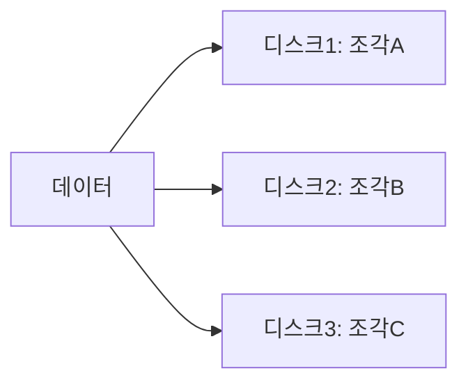

<Callout type="info">
  **이번 문서의 목표:** 이 파일을 다 읽으면 LOOK·C-LOOK 알고리즘의 헤드 이동 거리를 SCAN·C-SCAN과 같은 예제로 비교 계산하고, RAID 0·1·5·6·10 각각의 실제 사용 가능 용량과 장애 허용 능력을 디스크 개수·용량으로부터 직접 계산하며, 성능·신뢰성·비용 사이의 트레이드오프를 설명할 수 있다.
</Callout>

## 이 편에서 새로 다루는 것

FCFS·SSTF·SCAN·C-SCAN 네 알고리즘의 정의와 계산은 [독학사 2단계 운영체제 19편](/독학사2/운영체제/19_disk-scheduling)에서 헤드 53, 트랙 범위 0–199, 요청 큐 98·183·37·122·14·124·65·67 하나로 이미 전부 계산했다. 이 편은 그 계산을 반복하지 않고 **같은 예제에 LOOK·C-LOOK을 추가로 계산**해 여섯 알고리즘 전체를 한 표에 놓는다. 그리고 [11편](/독학사4/통합컴퓨터시스템/11_io-and-storage-architecture)에서 다룬 단일 디스크 접근시간 계산을 넘어, **여러 디스크를 묶어 신뢰성과 성능을 동시에 얻는 RAID**를 이 사이트의 어느 과목에도 없는 완전히 새로운 주제로 다룬다.

## 1. LOOK·C-LOOK — SCAN·C-SCAN의 실용적 개선판

> **쉽게 말하면:** SCAN과 C-SCAN은 디스크의 물리적 끝(0번, 199번 트랙)까지 항상 가지만, LOOK과 C-LOOK은 "더 이상 처리할 요청이 없으면" 거기서 바로 방향을 바꾸거나 점프한다.

- **LOOK**: SCAN처럼 한 방향으로 이동하며 요청을 처리하지만, 디스크 끝까지 가지 않고 **그 방향의 마지막 요청까지만** 간 뒤 반대로 방향을 바꾼다.
- **C-LOOK**: C-SCAN처럼 한 방향으로 이동하지만, 끝까지 가지 않고 **그 방향의 마지막 요청까지만** 간 뒤, 반대쪽에서 **가장 작은 요청 위치로 점프**하고(트랙 0이 아니다) 같은 방향으로 계속 진행한다.

SCAN·C-SCAN이 디스크 물리적 끝까지 가는 이유는 새 요청이 그 사이에 들어올 가능성을 고려한 이론적 정의이고, LOOK·C-LOOK은 "지금 큐에 있는 요청까지만" 처리하면 된다는 실용적 관점의 개선이다. 그래서 실제 디스크 컨트롤러는 LOOK·C-LOOK 계열을 더 널리 사용한다.

### 같은 예제로 계산: 헤드 53, 트랙 범위 0–199, 요청 큐 98, 183, 37, 122, 14, 124, 65, 67(큰 번호 방향으로 시작)

**LOOK**: 53에서 시작해 65, 67, 98, 122, 124를 지나 이 방향의 마지막 요청인 183까지 간 뒤, 방향을 바꿔 37, 14를 처리한다(트랙 199까지 가지 않는다).

$$
\text{LOOK 총 이동 거리} = (183 - 53) + (183 - 14) = 130 + 169 = 299
$$

- `183 - 53 = 130`: 53에서 이 방향의 마지막 요청 183까지 이동(가는 길에 65, 67, 98, 122, 124 처리)
- `183 - 14 = 169`: 183에서 방향을 바꿔 반대쪽 마지막 요청 14까지 이동(오는 길에 37도 처리)

**C-LOOK**: 53에서 183까지 이동해 처리한 뒤, **199까지 가지 않고 바로** 반대쪽 가장 작은 요청인 14로 점프하고, 같은 방향(큰 번호 쪽)으로 계속 이동해 37을 마저 처리한다.

$$
\text{C-LOOK 총 이동 거리} = (183 - 53) + (183 - 14) + (37 - 14) = 130 + 169 + 23 = 322
$$

- `183 - 53 = 130`: 53에서 183까지 이동(가는 길에 65, 67, 98, 122, 124 처리)
- `183 - 14 = 169`: 183에서 요청이 남아 있는 가장 작은 트랙인 14로 점프
- `37 - 14 = 23`: 14에서 같은 방향으로 계속 이동해 37 처리

## 2. 여섯 알고리즘 종합 비교표

같은 예제(헤드 53, 요청 큐 98·183·37·122·14·124·65·67)를 여섯 알고리즘 모두에 적용한 결과다. FCFS·SSTF·SCAN·C-SCAN 값은 [운영체제 19편](/독학사2/운영체제/19_disk-scheduling)의 계산 그대로다.

| 알고리즘 | 총 이동 거리 | 디스크 끝(0, 199)까지 가는가 |
|---|---|---|
| FCFS | 640 | 해당 없음(도착 순서대로만 이동) |
| SSTF | 299 | 아니오 |
| SCAN | 331 | 예 |
| C-SCAN | 359 | 예(점프도 끝에서 끝) |
| LOOK | 299 | 아니오(마지막 요청까지만) |
| C-LOOK | 322 | 아니오(점프도 마지막 요청까지만) |

**결과 해석**: LOOK은 SCAN(331)보다 32칸 짧고, C-LOOK은 C-SCAN(359)보다 37칸 짧다. 두 경우 모두 디스크의 물리적 끝까지 가지 않고 실제 요청이 있는 지점까지만 움직였기 때문에 생기는 차이다. 이 예제에서 LOOK이 SSTF와 같은 299가 나온 것은 **이 특정 요청 분포에서만 우연히 일치**한 결과이며, 일반적으로 두 값이 같다는 규칙은 아니다.

**자주 틀리는 점**: LOOK을 SCAN과 같은 알고리즘이라고 착각하지 말 것. 차이는 "요청이 없는 구간까지 굳이 가는가"이며, 이름의 위치(가는 대상이 물리적 끝인지 마지막 요청인지)로 구분해서 기억한다.

## 3. RAID — 여러 디스크를 하나처럼 묶기

> **쉽게 말하면:** 디스크 하나가 고장 나면 그 안의 데이터를 통째로 잃는다. RAID는 여러 디스크에 데이터를 나누거나 복제해 두어, 디스크 한두 개가 고장 나도 데이터를 지키거나 속도를 높이는 기술이다.

**RAID**(Redundant Array of Independent Disks, 독립 디스크들의 중복 배열)는 여러 개의 물리 디스크를 묶어 하나의 논리적 저장장치처럼 보이게 하면서, 데이터를 나누어 저장하는 **스트라이핑**(striping)이나 복제해 저장하는 **미러링**(mirroring), 오류를 복구할 수 있는 **패리티**(parity)를 이용해 성능과 신뢰성을 높인다. 이 주제는 [독학사 2단계 컴퓨터구조](/독학사2/컴퓨터구조)·[운영체제](/독학사2/운영체제) 과목 어디에도 없는, 4단계 통합컴퓨터시스템에서 새로 요구되는 영역이다.

### RAID 0 — 스트라이핑, 속도만 추구

데이터를 여러 디스크에 조각(스트라이프, stripe)내어 나누어 저장한다. 여러 디스크에 동시에 읽고 쓸 수 있어 속도는 빠르지만, **중복 저장이 전혀 없어** 디스크 하나만 고장 나도 전체 데이터를 잃는다.

$$
\text{사용 가능 용량(RAID 0)} = N \times S
$$

- $N$: 디스크 개수, $S$: 디스크 한 대의 용량

### RAID 1 — 미러링, 신뢰성만 추구

같은 데이터를 두 디스크에 **그대로 복제**해서 저장한다. 한 디스크가 고장 나도 다른 디스크에 똑같은 데이터가 있으므로 안전하지만, 디스크 용량의 절반만 실제로 사용할 수 있다.

$$
\text{사용 가능 용량(RAID 1)} = \frac{N \times S}{2}
$$

### RAID 5 — 분산 패리티, 속도와 신뢰성의 절충

데이터를 여러 디스크에 스트라이핑하면서, 그 데이터로부터 계산한 **패리티**(parity, 오류 복구용 검사 정보)를 디스크 하나 분량만큼 여러 디스크에 골고루 나누어 저장한다. 디스크 한 대가 고장 나도 나머지 디스크의 데이터와 패리티로 고장난 디스크의 내용을 복구할 수 있다.

$$
\text{사용 가능 용량(RAID 5)} = (N - 1) \times S
$$

- $N$개 디스크 중 **디스크 한 대 분량**이 패리티 저장에 쓰이므로 $N-1$대 분량만 실제 데이터 용량이 된다(패리티가 한 디스크에 몰리지 않고 여러 디스크에 나뉘어 저장되지만, 총량으로 보면 한 대 분량과 같다).

### RAID 6 — 이중 패리티, 디스크 두 대까지 허용

RAID 5와 원리는 같지만 패리티를 **두 세트** 저장해, 디스크 **두 대까지 동시에** 고장 나도 복구할 수 있다.

$$
\text{사용 가능 용량(RAID 6)} = (N - 2) \times S
$$

### RAID 10(1+0) — 미러링 후 스트라이핑

먼저 디스크를 두 대씩 미러링(RAID 1)한 뒤, 그렇게 만든 미러 쌍들을 다시 스트라이핑(RAID 0)한다. RAID 1의 신뢰성과 RAID 0의 속도를 동시에 취하지만, 용량 손해는 RAID 1과 같다.

$$
\text{사용 가능 용량(RAID 10)} = \frac{N \times S}{2}
$$

### 다섯 방식 비교표

| RAID 레벨 | 최소 디스크 수 | 사용 가능 용량 | 장애 허용 | 쓰기 성능 | 읽기 성능 |
|---|---|---|---|---|---|
| RAID 0 | 2 | $N \times S$ | 없음(한 대만 고장 나도 전체 손실) | 매우 좋음 | 매우 좋음 |
| RAID 1 | 2 | $\dfrac{N \times S}{2}$ | 디스크 1대까지 | 보통(두 곳에 써야 함) | 좋음 |
| RAID 5 | 3 | $(N-1) \times S$ | 디스크 1대까지 | 패리티 계산 부담으로 다소 저하 | 좋음 |
| RAID 6 | 4 | $(N-2) \times S$ | 디스크 2대까지 | RAID 5보다 더 저하 | 좋음 |
| RAID 10 | 4 | $\dfrac{N \times S}{2}$ | 각 미러 쌍에서 1대씩까지 | 좋음 | 매우 좋음 |

### 예제: 1TB 디스크 6대로 구성했을 때

$N=6$, $S=1\text{TB}$인 경우 각 RAID의 사용 가능 용량을 계산한다.

$$
\text{RAID 0} = 6 \times 1 = 6\text{TB}
$$

$$
\text{RAID 1} = \frac{6 \times 1}{2} = 3\text{TB}
$$

$$
\text{RAID 5} = (6 - 1) \times 1 = 5\text{TB}
$$

$$
\text{RAID 6} = (6 - 2) \times 1 = 4\text{TB}
$$

$$
\text{RAID 10} = \frac{6 \times 1}{2} = 3\text{TB}
$$

**결과 해석**: 같은 6대의 디스크로도 목적에 따라 실사용 용량이 3TB에서 6TB까지 크게 달라진다. **속도만이 목표**라면 RAID 0(6TB)을, **안정성이 최우선**이라면 RAID 1이나 RAID 10(각 3TB)을, **용량과 안정성의 절충**을 원한다면 RAID 5(5TB)나 RAID 6(4TB)을 선택하는 식으로, 사용 목적에 따른 트레이드오프 판단이 4단계 통합형 문항이 요구하는 핵심이다.

**자주 틀리는 점**: RAID 1과 RAID 10의 사용 가능 용량 공식이 똑같다고 해서 두 방식이 같다고 착각하기 쉽다. 용량은 같지만 RAID 10은 미러 쌍을 다시 스트라이핑하므로 **RAID 1보다 읽기·쓰기 성능이 더 좋다** — "용량이 같으면 성능도 같다"는 착각을 특히 조심해야 한다. 또한 RAID 5를 "디스크 몇 대가 고장 나도 안전하다"고 과대평가하는 경우가 있는데, RAID 5는 **동시에 두 대가 고장 나면 복구할 수 없다** — 이때는 RAID 6이 필요하다.

## 핵심 정리

- LOOK·C-LOOK은 SCAN·C-SCAN과 원리는 같지만 디스크의 물리적 끝이 아니라 **그 방향의 마지막 요청까지만** 이동한다는 점에서 실용적으로 더 짧은 이동 거리를 만든다.
- 같은 예제에서 총 이동 거리는 FCFS 640, SSTF 299, SCAN 331, C-SCAN 359, LOOK 299, C-LOOK 322 순으로 나타난다.
- RAID 0은 속도만, RAID 1은 신뢰성만, RAID 5·6은 절충(각각 1대·2대까지 장애 허용), RAID 10은 RAID 1의 안전성에 RAID 0의 속도를 더한 구조다.
- 사용 가능 용량 공식은 RAID 0이 $N \times S$, RAID 1·10이 $\frac{N \times S}{2}$, RAID 5가 $(N-1) \times S$, RAID 6이 $(N-2) \times S$다.
- 용량이 같다고 성능·신뢰성까지 같은 것은 아니다(RAID 1과 RAID 10 비교가 대표적).

## 마무리 복습

<Quiz
  questionNumber={1}
  question="LOOK 알고리즘이 SCAN과 다른 점으로 가장 정확한 것은?"
  options={['LOOK은 한 방향으로만 이동하고 절대 방향을 바꾸지 않는다', 'LOOK은 디스크의 물리적 끝이 아니라 그 방향의 마지막 요청까지만 이동한 뒤 방향을 바꾼다', 'LOOK은 요청을 도착 순서대로만 처리한다', 'LOOK은 헤드 이동 거리를 전혀 계산하지 않는다']}
  correctAnswer={2}
  explanation="SCAN은 디스크의 물리적 끝(0번 또는 199번 트랙)까지 이동한 뒤 방향을 바꾸지만, LOOK은 그 방향에 남은 요청이 없으면 마지막 요청 위치에서 바로 방향을 바꾼다."
  optionExplanations={['LOOK도 SCAN처럼 방향을 바꾸며 왕복한다 — FCFS나 SSTF와 헷갈린 설명이다', '정답이다', '도착 순서대로만 처리하는 것은 FCFS에 대한 설명이다', '모든 디스크 스케줄링 알고리즘은 헤드 이동 거리를 기준으로 비교된다']}
/>

<Quiz
  questionNumber={2}
  question="헤드 53, 트랙 범위 0~199, 요청 큐 98·183·37·122·14·124·65·67(큰 번호 방향 시작)에서 LOOK의 총 이동 거리는?"
  options={['299', '322', '331', '359']}
  correctAnswer={1}
  explanation="LOOK은 53에서 이 방향의 마지막 요청 183까지(130) 이동한 뒤, 방향을 바꿔 반대쪽 마지막 요청 14까지(169) 이동한다. 130+169=299."
  optionExplanations={['정답이다. 130+169=299', 'C-LOOK의 총 이동 거리다', 'SCAN의 총 이동 거리(디스크 끝 199까지 가는 경우)다', 'C-SCAN의 총 이동 거리다']}
/>

<Quiz
  questionNumber={3}
  question="같은 조건에서 C-LOOK의 총 이동 거리는?"
  options={['299', '322', '331', '359']}
  correctAnswer={2}
  explanation="C-LOOK은 53에서 183까지(130) 이동한 뒤, 199까지 가지 않고 바로 가장 작은 요청 14로 점프(169)하고, 같은 방향으로 계속 이동해 37을 처리(23)한다. 130+169+23=322."
  optionExplanations={['LOOK의 총 이동 거리다', '정답이다. 130+169+23=322', 'SCAN의 총 이동 거리다', 'C-SCAN의 총 이동 거리다']}
/>

<Quiz
  questionNumber={4}
  question="1TB 디스크 6대로 RAID 5를 구성했을 때 사용 가능한 총 용량은?"
  options={['3TB', '4TB', '5TB', '6TB']}
  correctAnswer={3}
  explanation="RAID 5의 사용 가능 용량은 (N-1)×S다. N=6, S=1TB이므로 (6-1)×1=5TB."
  optionExplanations={['RAID 1 또는 RAID 10의 사용 가능 용량(N×S/2=3TB)이다', 'RAID 6의 사용 가능 용량((N-2)×S=4TB)이다', '정답이다. (6-1)×1=5TB', 'RAID 0의 사용 가능 용량(N×S=6TB)으로 패리티를 고려하지 않은 값이다']}
/>

<Quiz
  questionNumber={5}
  question="RAID 1과 RAID 10에 대한 설명으로 옳은 것은?"
  options={['두 방식은 사용 가능 용량이 같으므로 성능도 항상 동일하다', '두 방식은 사용 가능 용량이 같지만, RAID 10이 미러 쌍을 다시 스트라이핑해 성능이 더 좋다', 'RAID 10은 RAID 1보다 사용 가능 용량이 더 크다', 'RAID 1은 디스크가 몇 대 고장 나도 항상 복구할 수 있다']}
  correctAnswer={2}
  explanation="RAID 1과 RAID 10의 사용 가능 용량 공식은 둘 다 N×S/2로 같지만, RAID 10은 미러 쌍을 다시 스트라이핑하는 구조 덕분에 읽기·쓰기 성능이 RAID 1보다 더 좋다."
  optionExplanations={['용량이 같다고 성능까지 같은 것은 아니다 — 본문이 지적한 대표적인 함정이다', '정답이다', '두 방식의 용량 공식은 동일하다(N×S/2)', 'RAID 1은 미러 쌍 안에서 한 대까지만 장애를 허용하며, 짝을 이루는 두 디스크가 동시에 고장 나면 복구할 수 없다']}
/>

<Quiz
  questionNumber={6}
  question="RAID 5와 RAID 6의 가장 핵심적인 차이는?"
  options={['RAID 5는 스트라이핑을 하지 않는다', 'RAID 6은 패리티를 두 세트 저장해 디스크 2대까지 동시 고장을 허용한다', 'RAID 6은 미러링만 사용해 패리티가 필요 없다', 'RAID 5가 RAID 6보다 사용 가능 용량이 더 작다']}
  correctAnswer={2}
  explanation="RAID 6은 RAID 5와 원리는 같지만 패리티를 두 세트로 늘려, 디스크 한 대가 아니라 두 대가 동시에 고장 나도 데이터를 복구할 수 있다."
  optionExplanations={['RAID 5도 RAID 6처럼 데이터를 스트라이핑하면서 패리티를 함께 분산 저장한다', '정답이다', 'RAID 6도 패리티 기반 방식이며 미러링을 사용하지 않는다', '같은 디스크 대수 기준으로는 RAID 5(N-1)가 RAID 6(N-2)보다 사용 가능 용량이 더 크다']}
/>

<Quiz
  questionNumber={7}
  question="속도만을 최우선으로 하고 장애 허용은 전혀 고려하지 않는 구성에 가장 적합한 RAID 레벨은?"
  options={['RAID 0', 'RAID 1', 'RAID 5', 'RAID 6']}
  correctAnswer={1}
  explanation="RAID 0은 패리티나 미러링 없이 순수하게 스트라이핑만 하므로 속도가 가장 빠르지만, 디스크 한 대만 고장 나도 전체 데이터를 잃는다."
  optionExplanations={['정답이다', 'RAID 1은 미러링으로 신뢰성을 확보하지만 용량 손해가 크다', 'RAID 5는 패리티 계산 부담으로 RAID 0보다 쓰기 속도가 느리다', 'RAID 6은 이중 패리티로 신뢰성은 가장 높지만 쓰기 성능은 다섯 방식 중 가장 저하된다']}
/>

## 참고 자료

- [독학사 2단계 운영체제 19편 — 디스크 스케줄링과 저장장치 접근](/독학사2/운영체제/19_disk-scheduling)
- [독학사 4단계 통합컴퓨터시스템 11편 — 입출력 시스템과 저장장치 구조](/독학사4/통합컴퓨터시스템/11_io-and-storage-architecture)
- 국가평생교육진흥원 독학학위제: https://bdes.nile.or.kr
