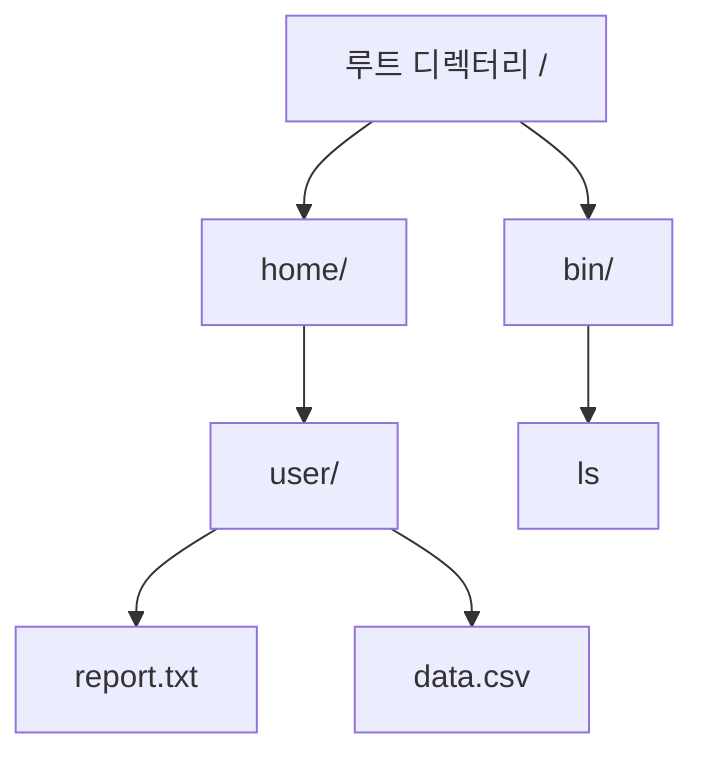
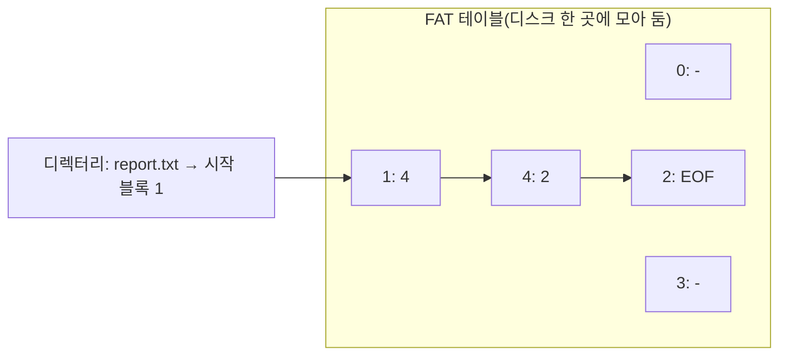

<Callout type="info">
  **이번 문서의 목표:** 파일이 디스크에 어떤 방식으로 저장되는지(연속·연결·인덱스 할당)를 예제로 비교하고, FAT와 inode 구조의 차이, 디스크 빈 공간 관리 기법, 저널링의 필요성을 설명할 수 있게 한다.
</Callout>

11편에서는 디스크의 물리적 구조(실린더·트랙·섹터)와 접근시간을 다뤘다. 파일 시스템(file system)은 그 물리적 저장 공간 위에 "파일"이라는 논리적 단위를 얹어, 사용자와 프로세스가 디스크의 물리 주소를 몰라도 이름만으로 데이터를 읽고 쓸 수 있게 해 주는 운영체제의 구성 요소다. 4단계 시험에서는 세 가지 파일 할당 방식의 장단점 비교와, 각 방식에서 특정 블록에 접근하는 데 필요한 디스크 접근 횟수를 계산하는 문항이 핵심이다.

## 파일과 디렉터리: 왜 필요한가

> **쉽게 말하면:** 디스크는 그냥 번호 매겨진 저장 칸의 나열일 뿐인데, 파일 시스템이 그 칸들을 묶어 "이름 있는 서류철"처럼 보이게 해 준다.

디스크 컨트롤러 입장에서 디스크는 순서대로 번호가 매겨진 블록(block)의 집합일 뿐이다. 여기에 의미를 부여하는 것이 파일 시스템의 역할이다.

- **파일(file)**: 관련된 정보를 논리적으로 하나로 묶은 이름 있는 데이터 집합. 운영체제는 파일마다 이름, 크기, 생성·수정 시각, 접근 권한 등의 메타데이터(metadata, 데이터에 관한 데이터)를 함께 관리한다.
- **디렉터리(directory)**: 파일 이름과 그 파일의 실제 위치(메타데이터가 저장된 곳)를 연결해 주는 표. 흔히 "폴더"라고 부르는 것이 디렉터리이며, 디렉터리 자체도 하나의 특수한 파일로 구현되는 경우가 많다.

디렉터리는 보통 트리 구조로 구성되어, 디렉터리 안에 또 다른 디렉터리(하위 디렉터리, subdirectory)를 둘 수 있다. 이 계층 구조 덕분에 사용자는 `/home/user/report.txt`처럼(코드 스팬 안의 경로 표기) 경로를 따라가며 파일을 조직적으로 관리할 수 있다.

## 파일 할당 방식: 연속·연결·인덱스

> **쉽게 말하면:** 파일 하나를 디스크의 여러 블록에 나눠 저장할 때, 그 블록들을 어떤 방식으로 연결해 기억해 둘지를 정하는 규칙이다.

파일 하나는 대개 디스크 블록 여러 개에 걸쳐 저장된다. 이 블록들을 어떻게 찾아가게 할지에 따라 세 가지 방식이 있다.

### 연속 할당(contiguous allocation)

파일의 모든 블록을 디스크에서 물리적으로 연속된 위치에 배치한다. 디렉터리에는 시작 블록 번호와 길이(블록 수)만 저장하면 된다.

| 항목 | 설명 |
|---|---|
| 순차 접근 | 매우 빠름 — 다음 블록이 바로 옆이라 헤드 이동이 최소화된다 |
| 임의 접근(random access) | 빠름 — 시작 블록 번호에 원하는 오프셋만 더하면 위치를 바로 계산할 수 있다 |
| 단점 | 16편에서 다룬 연속 메모리 할당과 똑같이 외부 단편화가 발생하고, 파일이 커지면 뒤 공간이 이미 다른 파일에 쓰이고 있어 확장이 어렵다 |

시작 블록이 $b$이고 원하는 것이 파일 내 $i$번째 블록(0부터 시작)이라면, 실제 디스크 블록 번호는 다음 계산 한 번으로 바로 나온다.

$$
\text{실제 블록 번호} = b + i
$$

### 연결 할당(linked allocation)

각 블록이 다음 블록의 번호를 포인터(pointer)로 담고 있어, 파일의 블록들이 디스크 여기저기 흩어져 있어도 사슬처럼 이어 찾아갈 수 있다. 디렉터리에는 첫 블록과 마지막 블록 번호만 있으면 된다.

| 항목 | 설명 |
|---|---|
| 외부 단편화 | 없음 — 빈 블록이 어디에 있든 하나씩 이어 붙이면 되므로 |
| 순차 접근 | 가능하지만, 포인터를 따라가야 하므로 연속 할당보다 느림 |
| 임의 접근 | 매우 느림 — $i$번째 블록을 찾으려면 첫 블록부터 포인터를 $i$번 따라가야 한다(디스크 접근이 $i+1$번 필요) |
| 단점 | 포인터 저장 공간만큼 블록의 실제 데이터 용량이 줄고, 포인터 하나가 손상되면 그 뒤 블록을 전부 잃는다 |

예를 들어 파일의 10번째 블록(인덱스 9, 0부터 셈)을 읽으려면 첫 블록부터 시작해 포인터를 9번 따라가야 하므로, 디스크 접근이 총 $9+1=10$번 필요하다 — 이는 연속 할당의 1번과 크게 대비된다.

### 인덱스 할당(indexed allocation)

파일마다 별도의 **인덱스 블록(index block)** 을 하나 두어, 그 안에 파일을 구성하는 모든 블록의 번호를 순서대로 기록한다. 실제 데이터 블록에는 포인터가 없다.

| 항목 | 설명 |
|---|---|
| 외부 단편화 | 없음 |
| 임의 접근 | 빠름 — 인덱스 블록만 한 번 읽으면 원하는 $i$번째 블록 번호를 바로 알 수 있다 |
| 단점 | 작은 파일도 인덱스 블록 하나를 따로 써야 해 공간 낭비가 있고, 파일이 매우 크면 인덱스 블록 하나에 모든 번호가 안 들어갈 수 있다 |

인덱스 블록 하나로 부족할 만큼 파일이 커지는 문제는 **연결 인덱스(linked index, 인덱스 블록끼리 사슬로 연결)**, **다단계 인덱스(multilevel index, 인덱스의 인덱스를 두는 방식)**, **다중 인덱스와 직접·간접 블록을 함께 쓰는 방식(다음 절의 inode)** 으로 해결한다.

| 방식 | 순차 접근 | 임의 접근($i$번째 블록) | 외부 단편화 | 대표 활용 |
|---|---|---|---|---|
| 연속 할당 | 매우 빠름 | 계산 1회로 즉시 | 있음 | CD-ROM처럼 파일이 고정되고 잘 안 바뀌는 매체 |
| 연결 할당 | 느림(포인터 추적) | 디스크 접근 $i+1$번 | 없음 | 초기 파일 시스템, 순차 접근 위주 매체 |
| 인덱스 할당 | 인덱스 블록 경유 | 인덱스 조회 후 즉시 | 없음 | 현대 범용 파일 시스템(FAT, inode 계열)의 기반 |

## FAT와 inode: 실제 파일 시스템의 구현

> **쉽게 말하면:** FAT는 연결 할당을 표로 모아 한 번에 관리하는 방식이고, inode는 인덱스 할당을 파일마다 압축해서 담는 방식이다.

### FAT(File Allocation Table)

FAT는 연결 할당의 아이디어를 발전시킨 구조다. 각 블록에 흩어져 있던 포인터를 디스크 한 곳에 모은 표(FAT 테이블)로 관리한다. FAT 테이블의 $i$번째 항목은 $i$번 블록 다음에 이어지는 블록의 번호를 담고 있으며, 파일의 마지막 블록에는 파일 끝(EOF, End Of File)을 뜻하는 특수 값이 들어간다.

이 예시에서 report.txt는 1번 블록에서 시작해, FAT 테이블을 보면 1번 다음은 4번, 4번 다음은 2번이고 2번이 EOF이므로 파일은 1 → 4 → 2번 블록 순서로 구성되어 있다는 것을 알 수 있다. FAT 테이블 전체를 메모리에 캐시해 두면 포인터를 디스크에서 매번 읽지 않아도 되어, 연결 할당의 느린 임의 접근 문제를 상당히 완화할 수 있다. 다만 FAT 테이블 자체가 손상되면 디스크 전체의 파일 구조를 잃을 위험이 있다.

### inode(index node)

유닉스·리눅스 계열 파일 시스템의 핵심 구조인 inode는 인덱스 할당을 발전시킨 방식이다. 파일마다 하나의 inode가 있으며, 그 안에는 파일의 메타데이터(권한, 소유자, 크기, 시각 등)와 함께 데이터 블록을 가리키는 포인터들이 들어 있다.

- **직접 블록(direct block) 포인터**: 파일의 앞쪽 데이터 블록을 바로 가리킨다. 작은 파일은 이 포인터만으로 전체를 표현할 수 있다.
- **단일 간접 블록(single indirect block)**: 직접 포인터로 부족하면, 포인터 하나가 "포인터들을 모아 놓은 블록"을 가리키게 해 훨씬 많은 데이터 블록을 표현한다.
- **이중·삼중 간접 블록(double/triple indirect block)**: 간접 블록이 다시 간접 블록을 가리키는 방식으로, 파일이 매우 커져도 inode 하나의 고정된 크기 안에서 확장할 수 있게 한다.

이 구조는 작은 파일에서는 직접 블록만으로 접근이 빨라 효율적이고, 큰 파일에서는 간접 블록의 단계 수만큼만 디스크 접근이 늘어나 인덱스 할당의 장점(빠른 임의 접근)을 유지하면서도 인덱스 블록 하나의 크기 제한 문제를 해결한다. 시험에서는 "직접 블록 12개, 블록 크기 4KB, 포인터 하나가 4바이트일 때 표현 가능한 최대 파일 크기" 같은 계산이 나올 수 있다.

블록 크기가 4KB이고 포인터 하나가 4바이트라면, 간접 블록 하나에는 $4096 \div 4 = 1024$개의 포인터가 들어간다. 직접 블록이 12개라면, 직접 블록만으로 표현 가능한 크기는 다음과 같이 계산한다.

$$
12 \times 4\text{KB} = 48\text{KB}
$$

여기에 단일 간접 블록을 더하면 추가로 $1024 \times 4\text{KB} = 4\text{MB}$만큼 더 표현할 수 있어, 파일 크기 상한이 급격히 늘어난다. 이처럼 간접 단계가 하나씩 늘 때마다 표현 가능한 크기가 포인터 개수(1024)배씩 곱해지는 구조라는 점을 기억해 두면 계산이 빨라진다.

## 디스크 공간 관리

> **쉽게 말하면:** 파일이 쓰는 블록을 관리하는 것만큼, 아직 안 쓰는 빈 블록이 어디인지 아는 것도 중요하다.

새 파일을 만들거나 기존 파일을 확장하려면 빈 블록을 찾아야 한다. 대표적인 관리 기법은 다음과 같다.

- **비트맵(bit vector/bitmap)**: 블록마다 1비트를 두어 사용 중이면 1, 비어 있으면 0으로 표시한다. 연속된 빈 공간을 찾기 쉽고 구현이 간단해 널리 쓰인다.
- **가용 공간 리스트(free list)**: 연결 할당처럼 빈 블록들을 포인터로 사슬처럼 연결해 관리한다. 비트맵보다 검색은 느릴 수 있지만 전체 블록 수만큼의 비트맵 공간이 필요 없다.
- **그룹화(grouping)**: 빈 블록 번호를 그룹으로 묶어 첫 번째 빈 블록에 나머지 빈 블록들의 번호를 잔뜩 저장해 두는 방식으로, 가용 공간 리스트를 조금 더 빠르게 탐색할 수 있게 개선한 방법이다.

비트맵으로 블록 8개짜리 디스크의 상태를 `1 1 0 1 0 0 1 0`(1은 사용 중, 0은 비어 있음)처럼 나타냈다면, 비어 있는 블록은 2, 4, 5, 7번(0부터 세었을 때)이며 이 중 4, 5번이 연속으로 비어 있으므로 두 블록짜리 연속 공간이 필요한 요청은 이 자리에 배정할 수 있다.

## 파일 시스템 신뢰성과 저널링

> **쉽게 말하면:** 파일을 쓰는 도중 정전이 나도 파일 시스템 전체가 망가지지 않도록, 작업 내용을 미리 일기장에 적어 두는 것이다.

파일 시스템은 메타데이터(디렉터리, inode, 비트맵 등)를 여러 곳에 나눠 갱신해야 하는 경우가 많다. 이 갱신 도중 시스템이 갑자기 멈추면 메타데이터가 서로 앞뒤가 안 맞는 상태(불일치, inconsistency)로 남을 수 있다 — 예를 들어 비트맵에는 블록이 사용 중이라고 표시되었는데 어떤 파일의 inode에도 그 블록이 연결되어 있지 않은 상태다.

**저널링(journaling)** 파일 시스템은 실제로 메타데이터를 갱신하기 전에, "무엇을 어떻게 바꿀 것인지"를 저널(journal, 로그 형태의 별도 영역)에 먼저 순서대로 기록해 둔다. 갱신 도중 시스템이 멈추더라도, 다시 부팅할 때 저널을 읽어 "끝까지 기록된 작업"은 재실행하고 "중간에 끊긴 작업"은 취소해 항상 일관된 상태로 복구할 수 있다. 이 방식 덕분에 과거처럼 부팅할 때마다 디스크 전체를 검사하는 방식(예: `fsck`)보다 훨씬 빠르게 복구할 수 있다.

## 자주 틀리는 점

- **연속 할당의 장점을 인덱스 할당에도 그대로 적용한다.** 임의 접근이 빠르다는 점은 세 방식 중 연속 할당과 인덱스 할당의 공통 장점이지만, 외부 단편화가 없다는 점은 연결 할당과 인덱스 할당의 공통 장점이다. 각 방식의 장단점을 표 전체로 함께 기억해야 헷갈리지 않는다.
- **FAT와 inode를 그냥 같은 것으로 뭉뚱그린다.** FAT는 포인터를 디스크 한 곳의 표에 모아 관리하고, inode는 파일마다 직접·간접 블록 포인터를 따로 갖는 구조다. 큰 파일을 다루는 방식(간접 블록 단계)이 FAT에는 없다는 차이가 시험 포인트다.
- **저널링을 백업(backup)과 혼동한다.** 저널링은 갑작스러운 중단으로부터 메타데이터의 일관성을 지키는 기법이지, 데이터를 다른 매체에 복제해 두는 백업과는 목적이 다르다.

## 핵심 정리

- 파일은 데이터의 논리적 단위, 디렉터리는 파일 이름과 위치를 연결하는 표이며 보통 트리 구조로 조직된다.
- 파일 할당 방식은 연속(빠른 접근, 단편화 있음), 연결(단편화 없음, 임의 접근 느림), 인덱스(단편화 없음, 임의 접근 빠름, 인덱스 블록 필요)로 나뉜다.
- FAT는 연결 할당의 포인터를 별도 표로 모은 방식이고, inode는 직접·간접 블록으로 인덱스 할당을 파일 크기에 맞게 확장한 방식이다.
- 디스크 빈 공간은 비트맵, 가용 공간 리스트, 그룹화 등으로 관리한다.
- 저널링은 메타데이터 갱신 내용을 미리 로그에 기록해 두어, 중단 후에도 빠르고 일관되게 복구할 수 있게 한다.

## 마무리 복습

<Quiz
  questionNumber={1}
  question="파일 할당 방식 중 연결 할당(linked allocation)의 특징으로 옳은 것은?"
  options={['외부 단편화가 발생하지만 임의 접근은 매우 빠르다', '외부 단편화는 없지만 임의 접근을 하려면 포인터를 순서대로 따라가야 한다', '디렉터리에 파일이 쓰는 모든 블록 번호를 하나씩 나열해야 한다', '파일마다 별도의 인덱스 블록을 반드시 두어야 한다']}
  correctAnswer={2}
  explanation="연결 할당은 각 블록이 다음 블록의 포인터를 가지고 있어 빈 블록을 어디서든 이어 붙일 수 있으므로 외부 단편화가 없다. 다만 i번째 블록을 찾으려면 첫 블록부터 포인터를 순서대로 따라가야 해 임의 접근이 느리다."
  optionExplanations={['연결 할당은 임의 접근이 느린 방식이며, 외부 단편화가 없다는 설명도 반대로 되어 있다', '정답. 단편화가 없다는 장점과 순차 추적이 필요하다는 단점을 모두 포함한다', '모든 블록 번호를 나열하는 것은 인덱스 할당의 특징이다', '인덱스 블록을 별도로 두는 것은 인덱스 할당의 특징이다']}
/>

<Quiz
  questionNumber={2}
  question="연속 할당 방식에서 파일의 시작 블록이 20번이고 파일 내 5번째 블록(인덱스 4, 0부터 셈)에 접근하려 할 때, 실제 디스크 블록 번호는?"
  options={['4번', '20번', '24번', '25번']}
  correctAnswer={3}
  explanation="연속 할당에서 실제 블록 번호는 시작 블록+인덱스로 계산한다. 20+4=24이므로 24번 블록이다."
  optionExplanations={['인덱스 값만 답으로 쓴 경우다', '시작 블록 번호만 답으로 쓴 경우다', '정답. 20+4=24번이다', '인덱스를 0부터가 아니라 1부터 세어 20+5로 계산한 값이다']}
/>

<Quiz
  questionNumber={3}
  question="연결 할당 방식의 파일에서 10번째 블록(인덱스 9, 0부터 셈)을 읽으려 할 때 필요한 디스크 접근 횟수는?"
  options={['1번', '9번', '10번', '20번']}
  correctAnswer={3}
  explanation="연결 할당은 첫 블록부터 포인터를 따라가야 하므로, 인덱스 9인 블록에 도달하려면 첫 블록을 포함해 총 9+1=10번의 디스크 접근이 필요하다."
  optionExplanations={['연속 할당이나 인덱스 할당에서 위치 계산 후 접근하는 경우의 값이다', '인덱스 값을 그대로 접근 횟수로 착각한 경우다', '정답. 첫 블록부터 포인터를 9번 따라가야 하므로 총 10번 접근한다', '왕복 접근이나 다른 오류로 두 배가 된 값이다']}
/>

<Quiz
  questionNumber={4}
  question="FAT(File Allocation Table)에 대한 설명으로 옳지 않은 것은?"
  options={['각 블록에 흩어져 있던 다음 블록 포인터를 디스크 한 곳의 표로 모아 관리한다', 'FAT 테이블의 항목 값으로 파일의 마지막 블록인지(EOF) 판단할 수 있다', 'FAT 테이블을 메모리에 캐시하면 임의 접근 성능을 개선할 수 있다', 'FAT는 파일마다 직접·간접 블록 포인터를 따로 두어 큰 파일을 표현한다']}
  correctAnswer={4}
  explanation="파일마다 직접·간접 블록 포인터를 두어 큰 파일을 표현하는 구조는 inode 방식이다. FAT는 모든 파일의 포인터 정보를 디스크의 한 표에 모아 관리하는 방식으로 inode와 구조가 다르다."
  optionExplanations={['옳은 설명이다. FAT의 핵심 아이디어다', '옳은 설명이다. 마지막 블록에는 EOF를 뜻하는 특수 값이 들어간다', '옳은 설명이다. 캐시하면 포인터를 디스크에서 매번 읽지 않아도 된다', '정답(옳지 않음). 이는 inode 구조에 대한 설명이며 FAT의 구조가 아니다']}
/>

<Quiz
  questionNumber={5}
  question="inode 구조에서 직접 블록만으로 표현 가능한 최대 크기를 넘는 큰 파일을 다루기 위한 방법은?"
  options={['모든 파일에 연속 할당 방식을 강제로 적용한다', '단일·이중·삼중 간접 블록 포인터로 더 많은 데이터 블록을 단계적으로 가리키게 한다', '디렉터리에 파일의 모든 블록 번호를 직접 나열한다', 'FAT 테이블을 별도로 함께 사용해야만 큰 파일을 저장할 수 있다']}
  correctAnswer={2}
  explanation="inode는 직접 블록으로 부족하면 간접 블록(포인터들을 모은 블록)을 가리키는 포인터를 두고, 이를 이중·삼중으로 확장해 훨씬 많은 데이터 블록을 표현한다."
  optionExplanations={['연속 할당은 inode 구조와 무관한 별개의 할당 방식이다', '정답. 간접 블록 단계를 늘려 표현 가능한 파일 크기를 키우는 것이 inode의 핵심 설계다', '이는 인덱스 할당의 단순한 형태이며 inode의 간접 블록 구조와는 다르다', 'inode는 FAT 없이도 독립적으로 큰 파일을 표현할 수 있는 구조다']}
/>

<Quiz
  questionNumber={6}
  question="저널링(journaling) 파일 시스템의 목적으로 가장 적절한 것은?"
  options={['디스크의 빈 공간을 비트맵보다 빠르게 검색하기 위해서다', '파일의 임의 접근 속도를 연속 할당 수준으로 높이기 위해서다', '갑작스러운 중단이 발생해도 메타데이터를 일관된 상태로 빠르게 복구하기 위해서다', '여러 사용자가 같은 파일을 동시에 수정할 수 있게 하기 위해서다']}
  correctAnswer={3}
  explanation="저널링은 메타데이터 갱신 내용을 미리 로그에 기록해 두어, 갱신 도중 시스템이 멈춰도 재부팅 시 로그를 보고 일관된 상태로 빠르게 복구할 수 있게 하는 기법이다."
  optionExplanations={['빈 공간 검색 속도는 비트맵·가용 공간 리스트 등 공간 관리 기법의 역할이다', '접근 속도 개선은 파일 할당 방식의 역할이며 저널링의 목적이 아니다', '정답. 저널링의 목적은 중단 후에도 메타데이터 일관성을 빠르게 복구하는 것이다', '동시 수정 제어는 파일 잠금이나 동시성 제어의 영역이며 저널링과는 다른 주제다']}
/>

<Quiz
  questionNumber={7}
  question="파일 할당 방식별 특징을 정리한 표 중 옳지 않은 것은?"
  options={['연속 할당은 순차 접근이 빠르지만 외부 단편화가 발생할 수 있다', '연결 할당은 외부 단편화가 없지만 임의 접근이 느리다', '인덱스 할당은 임의 접근이 빠르고 외부 단편화도 없다', '인덱스 할당은 작은 파일에도 인덱스 블록이 필요하지 않아 공간 낭비가 전혀 없다']}
  correctAnswer={4}
  explanation="인덱스 할당은 파일이 아무리 작아도 별도의 인덱스 블록을 하나 두어야 하므로, 작은 파일에서는 오히려 공간 낭비가 상대적으로 크다는 단점이 있다."
  optionExplanations={['옳은 설명이다. 연속 할당의 대표적인 장단점이다', '옳은 설명이다. 연결 할당의 대표적인 장단점이다', '옳은 설명이다. 인덱스 할당의 대표적인 장점이다', '정답(옳지 않음). 인덱스 할당은 작은 파일에도 인덱스 블록이 필요해 공간 낭비가 있을 수 있다']}
/>

## 참고 자료

- 국가평생교육진흥원 독학학위제: https://bdes.nile.or.kr
- 관련 심화 내용: `/독학사2/운영체제/16_file-system-fundamentals`, `/독학사2/운영체제/17_file-allocation-and-directory-structure`
