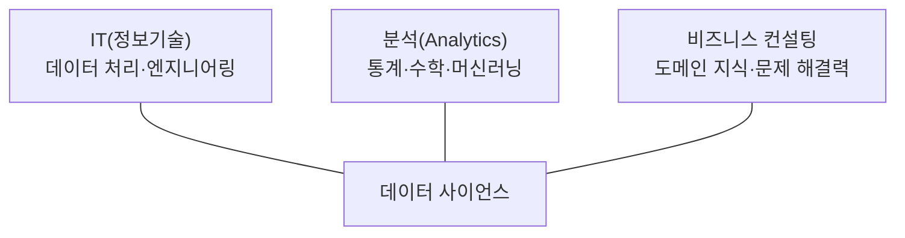
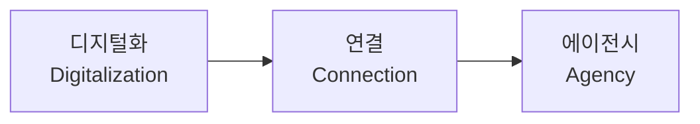

## 왜 "사이언스"인가 — 분석 그 이상이 필요한 이유

04편에서 빅데이터가 만든 4가지 변화를 봤습니다. 데이터를 저장할 시스템을 설계할 줄 알아야 하고(공학), 통계와 수학으로 패턴을 찾아낼 줄 알아야 하고(분석), 그 결과가 회사의 어떤 의사결정에 어떻게 연결되는지도 알아야 합니다(비즈니스).

## 1. 데이터 사이언스의 3가지 영역

데이터 사이언스가 다루는 역량은 다음 3가지 영역으로 정리됩니다. 이 3가지 중 어느 하나만 있어서는 데이터 사이언스가 성립하지 않는다는 점이 핵심입니다.

```mermaid
graph TD
  A["IT(정보기술)<br/>데이터 처리·엔지니어링"] --- D["데이터 사이언스"]
  B["분석(Analytics)<br/>통계·수학·머신러닝"] --- D
  C["비즈니스 컨설팅<br/>도메인 지식·문제 해결력"] --- D
```

| 영역 | 무엇을 하는가 | 없으면 생기는 문제 |
|---|---|---|
| IT(정보기술) | 대용량 데이터를 저장·수집·처리하는 시스템과 도구를 다룬다(분산 처리, 데이터베이스, 프로그래밍) | 아무리 좋은 분석 아이디어가 있어도 데이터를 실제로 꺼내 쓸 수 없다 |
| 분석(Analytics) | 통계학·수학·머신러닝 기법으로 데이터에서 패턴과 관계를 찾아낸다 | 데이터는 잘 쌓여 있어도 그 안에서 의미 있는 결론을 뽑아내지 못한다 |
| 비즈니스 컨설팅 | 그 조직의 산업·업무 맥락을 이해하고, 분석 결과를 실제 의사결정과 연결한다(도메인 지식) | 통계적으로는 맞는 분석이라도 회사의 실제 문제와 동떨어진 엉뚱한 결론이 나온다 |

세 영역이 겹치지 않으면 어떤 일이 생기는지 예를 들어 보겠습니다. IT와 분석만 갖춘 사람은 "이탈 확률이 87퍼센트로 계산됐습니다"라는 정확한 숫자는 낼 수 있지만, 그 숫자가 이 회사의 어떤 마케팅 예산 결정과 연결되어야 하는지는 모를 수 있습니다.

**02편과의 연결:** DIKW 피라미드(데이터→정보→지식→지혜)에서 데이터가 지혜(통찰)로 올라가려면 사람의 경험과 판단이 필요하다고 했습니다. 데이터 사이언스의 비즈니스 컨설팅 영역이 바로 이 마지막 단계, 즉 분석 결과를 실제 의사결정의 지혜로 바꾸는 역할을 담당합니다.

## 2. 데이터 사이언티스트의 하드 스킬과 소프트 스킬

데이터 사이언티스트에게 필요한 역량은 크게 **하드 스킬**(Hard Skill)과 **소프트 스킬**(Soft Skill) 두 갈래로 나뉩니다. 하드(hard)는 "단단하다"는 뜻 그대로 수치로 검증 가능한 기술적 역량을, 소프트(soft)는 사람과의 관계·소통처럼 수치화하기 어려운 역량을 가리키는 관용적 표현입니다.

| 구분 | 정의 | 구체적인 예 |
|---|---|---|
| 하드 스킬(Hard Skill) | 빅데이터에 대한 이론적 지식과 분석 기술의 숙련도 | 통계 이론 이해, 머신러닝 알고리즘 구현, R·Python 같은 프로그래밍, 분산 처리 시스템 운용 |
| 소프트 스킬(Soft Skill) | 통찰력 있는 분석, 설득력 있는 전달, 협업 능력 | 문제를 정의하는 통찰력, 분석 결과를 비전문가에게 설득력 있게 전달하는 커뮤니케이션, 여러 부서와 협업하는 능력 |

**판정 요령:** 기출문제는 여러 역량을 보기로 나열하고 "다음 중 소프트 스킬에 가장 가까운 것은?"이라고 묻는 형태를 즐겨 씁니다. **분산 처리 프레임워크 설정, 통계적 추정량 계산, 머신러닝 알고리즘 구현**처럼 기술 자체를 다루는 항목은 모두 하드 스킬이고, **서로 다른 부서의 관점을 통합해 분석 결과를 설득력 있게 전달하는 능력**, **분석 업무와 관리 업무를 상황에 맞게 함께 수행하는 유연성**, **팀워크**는 소프트 스킬로 분류됩니다.

**자주 틀리는 함정 — "객관성 확보를 위해 도메인 지식은 배제한다":** 이런 형태의 보기가 반복 출제되는데, 언제나 틀린 설명입니다. 예를 들어 "재구매율이 15퍼센트"라는 숫자만으로는 이 업종에서 좋은 수치인지 나쁜 수치인지 판단할 수 없고, 해당 산업의 평균과 맥락을 알아야만 의미 있는 해석이 나옵니다.

## 3. 데이터 시대의 가치 패러다임 변화

빅데이터가 만들어내는 가치는 시간이 지나며 한 방향으로 진화해 왔습니다. ADsP는 이 진화 과정을 3단계로 정리합니다. 영단어 순서를 정확히 외우는 것이 시험의 핵심입니다.

```mermaid
graph LR
  A["디지털화<br/>Digitalization"] --> B["연결<br/>Connection"] --> C["에이전시<br/>Agency"]
```

| 단계 | 영단어 | 무엇이 달라지는가 |
|---|---|---|
| 1단계 | 디지털화(Digitalization) | 아날로그 형태로 흩어져 있던 정보(종이 문서, 사람의 기억)를 컴퓨터가 다룰 수 있는 디지털 데이터로 바꾸는 단계다 |
| 2단계 | 연결(Connection) | 디지털화된 개별 데이터들을 서로 연결하고 통합해, 개별로는 보이지 않던 관계를 드러내는 단계다 |
| 3단계 | 에이전시(Agency) | 연결된 데이터를 바탕으로 시스템이 스스로 판단하고 행동하는 주체(에이전트)처럼 작동하는 단계다 |

각 단계를 예로 풀어 보면, 종이 진료 기록을 전자의무기록(EMR) 시스템에 입력하는 것이 **디지털화**입니다. 여러 병원의 전자의무기록을 서로 연동해 한 환자의 전체 진료 이력을 한 곳에서 볼 수 있게 만드는 것이 **연결**입니다.

**자주 틀리는 점:** 이 3단계의 순서를 뒤섞어 놓은 보기가 자주 나옵니다. 순서는 반드시 **디지털화 → 연결 → 에이전시**이며, 이는 논리적으로도 타당합니다.

## 핵심 정리

- 데이터 사이언스는 IT(정보기술)·분석(Analytics)·비즈니스 컨설팅의 3가지 영역이 겹치는 자리에서 성립하며, 어느 하나가 빠지면 성립하지 않는다.
- 데이터 사이언티스트의 하드 스킬은 이론·기술적 숙련(통계·프로그래밍·알고리즘 구현)이고, 소프트 스킬은 통찰력·전달력·협업 능력이다. "도메인 지식을 배제해야 객관적"이라는 보기는 항상 틀렸다.
- 빅데이터 시대의 가치 패러다임은 디지털화(Digitalization) → 연결(Connection) → 에이전시(Agency) 순서로 진화한다.

## 마무리 복습

<Quiz
  questionNumber={1}
  question={"데이터 사이언스를 구성하는 3가지 영역으로 가장 적절한 것은?"}
  options={["IT, 분석, 비즈니스 컨설팅","IT, 마케팅, 회계","분석, 디자인, 영업","비즈니스 컨설팅, 법무, 재무"]}
  correctAnswer={1}
  explanation={"데이터 사이언스는 데이터를 처리하는 IT(정보기술), 통계·수학으로 패턴을 찾는 분석(Analytics), 그 결과를 실제 의사결정과 연결하는 비즈니스 컨설팅 3가지 영역이 겹치는 자리에서 성립한다."}
/>

<Quiz
  questionNumber={2}
  question={"데이터 사이언스에서 분석(Analytics) 역량과 비즈니스 컨설팅 역량이 모두 있지만 IT 역량이 부족한 경우 발생하기 쉬운 문제로 가장 적절한 것은?"}
  options={["분석 결과를 회사 의사결정과 연결하지 못한다","통계적으로 유의미한 패턴을 찾지 못한다","대용량 데이터를 실제로 저장·처리·확보하지 못해 분석 자체를 시작하기 어렵다","분석 결과를 비전문가에게 설득력 있게 전달하지 못한다"]}
  correctAnswer={3}
  explanation={"IT 역량은 대용량 데이터를 저장·수집·처리하는 기술적 기반을 제공한다. 이 역량이 부족하면 아무리 좋은 분석·비즈니스 감각이 있어도 데이터 자체를 다룰 수단이 없어 분석을 시작하기 어렵다."}
/>

<Quiz
  questionNumber={3}
  question={"다음 중 데이터 사이언티스트의 소프트 스킬에 가장 가까운 것은?"}
  options={["분산 처리 프레임워크의 설정과 운용","통계적 추정량의 수식을 정확히 계산하는 능력","머신러닝 알고리즘을 코드로 직접 구현하는 능력","서로 다른 부서의 관점을 통합해 분석 결과를 설득력 있게 전달하는 능력"]}
  correctAnswer={4}
  explanation={"소프트 스킬은 통찰력 있는 분석과 설득력 있는 전달, 협업 능력을 뜻한다. 여러 부서의 관점을 통합해 전달하는 능력이 이에 해당한다."}
/>

## 참고 자료

- [데이터자격시험 - ADsP 출제기준](https://www.dataq.or.kr/www/sub/a_06.do)
