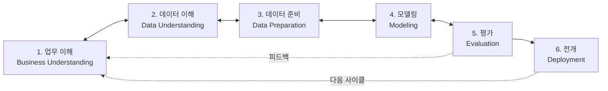

## 방법론이 왜 필요한가

### 정의

ADsP 시험 범위에서 가장 자주 등장하는 데이터분석 방법론은 세 가지다.

1. **KDD**(Knowledge Discovery in Databases, 데이터베이스에서의 지식 발견)
2. **CRISP-DM**(Cross Industry Standard Process for Data Mining, 산업 간 표준 데이터마이닝 프로세스)
3. **빅데이터 분석 방법론**(국내 데이터거버넌스 표준교재 기준의 5단계 방법론)

셋 다 "분석 프로젝트를 몇 개의 큰 단계로 나누고, 각 단계에서 무엇을 하는지 정의한다"는 목적은 같지만, 단계 수와 이름, 강조점이 다르다. 이 차이를 정확히 구분하는 문항이 회차마다 빠지지 않고 출제되므로, 세 방법론을 각각 외우는 것보다 **서로 대응시켜서** 이해하는 것이 훨씬 오래 기억에 남는다.

## KDD: 데이터베이스에서 지식을 캐내는 5단계

### 정의: KDD의 5단계

<Callout type="warning">
  **자주 틀리는 함정 (모의고사 125번 유형)**: "변환(Transformation) 단계의 목적은 시각화를 통한 해석이다" 같은 보기가 오답으로 나온다. 시각화·해석은 마지막 단계인 해석 및 평가의 역할이고, 변환 단계는 어디까지나 **데이터마이닝 알고리즘이 처리할 수 있는 형태로 데이터를 가공**하는 것이 목적이다. "이 단계의 산출물을 다음에 어떤 단계가 쓰는가"를 기준으로 단계를 구분하면 헷갈리지 않는다.
</Callout>

## CRISP-DM: 산업 표준 데이터마이닝 프로세스의 6단계

### 정의: CRISP-DM의 6단계

<Callout type="warning">
  **자주 틀리는 함정 (46회 기출)**: 6단계의 순서를 뒤섞어 놓은 보기가 반복 출제된다. 예를 들어 "데이터 이해 → 데이터 준비 → 업무 이해 → 모델링 → 평가 → 전개"처럼 업무 이해를 첫 단계가 아닌 자리에 넣는 함정이다. **업무 이해가 반드시 첫 단계**라는 점, 그리고 데이터 준비 단계에서 하는 활동으로 "데이터 정제·통합·포맷팅"은 맞지만 **탐색적 분석(데이터 탐색)은 데이터 이해 단계의 활동**이라는 점(48회 기출)을 혼동하지 않아야 한다.
</Callout>

### CRISP-DM은 왜 순환 구조인가

CRISP-DM의 6단계는 숫자가 매겨져 있어 얼핏 1번부터 6번까지 순서대로만 흘러가는 것처럼 보이지만, 실제로는 **단방향이 아니다.** 예를 들어 데이터 이해 단계에서 데이터를 살펴보다가 애초에 업무 이해 단계에서 정의한 문제 자체가 잘못됐다는 것을 깨달으면, 업무 이해 단계로 돌아가 문제 정의를 다시 다듬는다. 모델링 단계에서 모델 성능이 기대에 못 미치면 데이터 준비 단계로 돌아가 변수를 추가하거나 정제 방식을 바꾼다.

이렇게 이전 단계로 되돌아가 다시 다듬는 것을 **피드백**(feedback, 결과를 이전 단계에 되돌려 반영하는 것)이라 부르며, CRISP-DM은 이 피드백을 전제로 설계된 **순환형**(iterative) 프로세스다.

```mermaid
flowchart LR
    A["1. 업무 이해<br/>Business Understanding"] <--> B["2. 데이터 이해<br/>Data Understanding"]
    B <--> C["3. 데이터 준비<br/>Data Preparation"]
    C <--> D["4. 모델링<br/>Modeling"]
    D <--> E["5. 평가<br/>Evaluation"]
    E --> F["6. 전개<br/>Deployment"]
    E -.피드백.-> A
    F -.다음 사이클.-> A
```

위 다이어그램에서 실선 양방향 화살표(`<-->`)는 인접한 두 단계 사이를 자유롭게 오갈 수 있음을, 점선 화살표는 멀리 떨어진 단계로 되돌아가는 큰 피드백 루프를 나타낸다. 이 구조 때문에 CRISP-DM을 도식화할 때 흔히 원(circle) 모양으로 그려 "끝없이 돌아가는 순환"이라는 이미지를 강조한다.

<Callout type="warning">
  **자주 틀리는 점**: "CRISP-DM은 정해진 순서대로만 진행되는 폭포수(waterfall)식 모델이다"라는 진술은 옳지 않다. 정답 근거는 정확히 반대로, **단계 간 피드백을 허용하는 반복적(iterative) 프로세스**라는 점이다. 폭포수 모델(이전 단계가 완전히 끝나야만 다음 단계로 진행하고 되돌아가지 않는 방식)의 특징을 CRISP-DM에 잘못 갖다 붙이는 보기가 나오면 오답으로 걸러야 한다.
</Callout>

## KDD와 CRISP-DM 단계 대조

두 방법론은 **단계 수 자체가 다르다**(KDD 5단계, CRISP-DM 6단계). 그래서 1대1로 완벽히 맞아떨어지지는 않지만, "무엇을 하는 단계인가"를 기준으로 보면 대략 다음처럼 대응된다.

| 순서 | KDD (5단계) | CRISP-DM (6단계) | 공통적으로 하는 일 |
|---|---|---|---|
| 1 | — | 업무 이해(Business Understanding) | CRISP-DM에만 있는 단계. 비즈니스 목표를 분석 문제로 정의한다 |
| 2 | 데이터셋 선택(Selection) | 데이터 이해(Data Understanding) | 분석에 쓸 데이터를 고르고 탐색한다 |
| 3 | 데이터 전처리(Preprocessing), 데이터 변환(Transformation) | 데이터 준비(Data Preparation) | 잡음·결측치를 정리하고 분석 가능한 형태로 가공한다 |
| 4 | 데이터마이닝(Data Mining) | 모델링(Modeling) | 알고리즘을 적용해 패턴이나 모델을 찾는다 |
| 5 | 해석 및 평가(Interpretation/Evaluation) | 평가(Evaluation) | 결과가 목적에 맞는지 판단한다 |
| 6 | — | 전개(Deployment) | CRISP-DM에만 있는 단계. 실제 현업에 적용한다 |

이 표에서 눈여겨볼 점은 두 가지다. 첫째, **KDD의 전처리와 변환 두 단계가 CRISP-DM에서는 데이터 준비 한 단계로 합쳐진다.** 둘째, **CRISP-DM의 업무 이해와 전개는 KDD에 대응하는 단계가 없다.** KDD는 "이미 데이터베이스가 있고 그 안에서 지식을 캐낸다"는 데이터 중심 출발점을 가정하는 반면, CRISP-DM은 "비즈니스 문제가 무엇인지부터 정의하고, 해법을 실제 현장에 심는 것까지"를 범위에 포함하기 때문이다.

<Callout type="warning">
  **자주 틀리는 점 (모의고사 117·122번 유형)**: SEMMA(Sample-Explore-Modify-Model-Assess, SAS사가 제안한 5단계 방법론)까지 함께 등장해 세 방법론을 헷갈리게 하는 문항이 나온다. SEMMA의 Assess(평가) 단계는 **모델의 통계적 성능 평가에 집중**하고, CRISP-DM의 Evaluation(평가)처럼 비즈니스 목표 달성 여부까지 포괄적으로 보지는 않는다는 차이를 기억해 두면 오답 함정을 피할 수 있다.
</Callout>

## 빅데이터 분석 방법론의 5단계

### 정의: 5단계

CRISP-DM과 비교하면, "시스템 구현"이라는 단계를 별도로 명시해 **분석 결과를 실제 IT 시스템으로 만드는 공학적 작업**을 강조한다는 점이 특징이다. CRISP-DM의 전개(Deployment)가 이 시스템 구현과 평가 및 전개 두 단계에 걸쳐 나뉘어 들어 있다고 이해하면 된다.

## 핵심 정리

- 방법론은 분석 프로젝트를 표준 절차로 만들어 담당자가 바뀌어도 일관된 품질을 유지하게 한다.
- KDD는 데이터셋 선택 → 전처리 → 변환 → 데이터마이닝 → 해석 및 평가의 5단계로, 데이터베이스 중심의 지식 발견에 초점을 둔다.
- CRISP-DM은 업무 이해 → 데이터 이해 → 데이터 준비 → 모델링 → 평가 → 전개의 6단계로, 비즈니스 문제 해결에 초점을 두며 **단계 간 피드백을 허용하는 순환형 프로세스**다.
- KDD의 전처리·변환은 CRISP-DM의 데이터 준비에 대응하지만, CRISP-DM의 업무 이해·전개는 KDD에 대응 단계가 없다.
- 국내 빅데이터 분석 방법론은 분석 기획 → 데이터 준비 → 데이터 분석 → 시스템 구현 → 평가 및 전개의 5단계로, 시스템 구현을 별도 단계로 강조한다.

## 마무리 복습

<Quiz
  questionNumber={1}
  question={"KDD(Knowledge Discovery in Databases)의 5단계를 순서대로 나열한 것은?"}
  options={["전처리 → 선택 → 변환 → 데이터마이닝 → 해석 및 평가","데이터셋 선택 → 전처리 → 변환 → 데이터마이닝 → 해석 및 평가","데이터마이닝 → 선택 → 전처리 → 변환 → 해석 및 평가","선택 → 변환 → 전처리 → 해석 및 평가 → 데이터마이닝"]}
  correctAnswer={2}
  explanation={"KDD는 데이터셋 선택(Selection) → 전처리(Preprocessing) → 변환(Transformation) → 데이터마이닝(Data Mining) → 해석 및 평가(Interpretation/Evaluation) 순서로 진행된다."}
/>

<Quiz
  questionNumber={2}
  question={"CRISP-DM의 6단계 순서로 옳은 것은?"}
  options={["데이터 이해 → 업무 이해 → 데이터 준비 → 모델링 → 평가 → 전개","업무 이해 → 데이터 이해 → 데이터 준비 → 모델링 → 평가 → 전개","업무 이해 → 데이터 준비 → 데이터 이해 → 모델링 → 전개 → 평가","데이터 준비 → 업무 이해 → 데이터 이해 → 모델링 → 평가 → 전개"]}
  correctAnswer={2}
  explanation={"CRISP-DM은 업무 이해(Business Understanding)를 가장 먼저 수행한 뒤, 데이터 이해 → 데이터 준비 → 모델링 → 평가 → 전개 순서로 진행한다."}
/>

<Quiz
  questionNumber={3}
  question={"CRISP-DM 데이터 준비(Data Preparation) 단계에서 수행하는 활동으로 적절하지 않은 것은?"}
  options={["데이터 정제","데이터 통합","탐색적 데이터 분석을 통한 초기 인사이트 도출","데이터 포맷팅"]}
  correctAnswer={3}
  explanation={"탐색적 데이터 분석을 통해 데이터의 구조와 특성을 처음 파악하는 활동은 데이터 준비가 아니라 그 앞 단계인 데이터 이해(Data Understanding) 단계의 활동이다."}
/>

## 참고 자료

- [CRISP-DM 1.0 공정 가이드](https://www.the-modeling-agency.com/crisp-dm.pdf)
- [데이터자격시험 - ADsP 출제기준](https://www.dataq.or.kr/www/sub/a_06.do)
