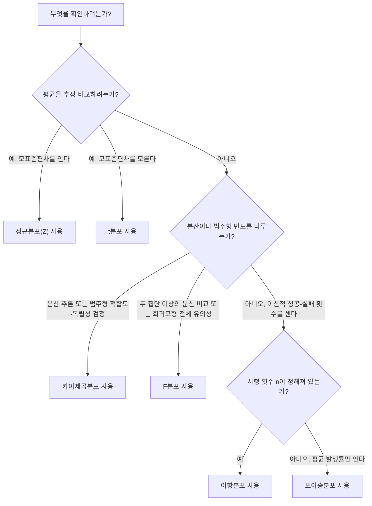

## 확률변수와 확률분포

### 정의

**확률변수**(random variable)는 무작위 실험(random experiment, 결과를 미리 확정할 수 없는 실험이나 관찰)의 결과를 숫자로 대응시키는 함수다. 예를 들어 동전을 두 번 던져 앞면이 나온 횟수를 $X$라 하면, $X$는 0, 1, 2 중 하나의 값을 가지는 확률변수다.

확률변수는 값을 셀 수 있느냐에 따라 두 종류로 나뉜다.

- **이산확률변수**(discrete random variable): 0, 1, 2처럼 셀 수 있는 값만 가진다(예: 주사위 눈, 하루 방문객 수).
- **연속확률변수**(continuous random variable): 키·몸무게처럼 구간 안의 모든 실수 값을 가질 수 있다.

**확률분포**(probability distribution)는 확률변수가 가질 수 있는 각 값에 확률을 대응시킨 것이다. 이산확률변수의 확률분포는 **확률질량함수**(probability mass function, PMF)로, 연속확률변수의 확률분포는 **확률밀도함수**(probability density function, PDF)로 나타낸다.

## 정규분포와 표준정규분포

### 정의

정규분포는 평균 $\mu$와 분산 $\sigma^2$ 두 개의 모수(parameter, 분포의 모양을 결정하는 값)로 완전히 결정되며, $X \sim N(\mu, \sigma^2)$로 표기한다. 정규분포는 다음 성질을 가진다.

- 평균을 중심으로 완전히 좌우 대칭이다. 그래서 평균 = 중앙값 = 최빈값이며 왜도는 0이다.
- 평균에서 표준편차 1개 범위(구간 $[\mu - \sigma, \mu + \sigma]$) 안에 전체 관측치의 약 68퍼센트가, 2개 범위 안에 약 95퍼센트가, 3개 범위 안에 약 99.7퍼센트가 들어온다(경험적 규칙, empirical rule).

문제는 평균과 표준편차가 다른 정규분포가 무수히 많다는 점이다(시험 점수 분포, 키 분포는 평균·표준편차가 서로 다르다). 매번 다른 모양의 곡선을 따로 계산하는 대신, 모든 정규분포를 **평균 0, 표준편차 1로 통일한 기준 분포**로 바꿔서 다루면 표 하나로 모든 문제를 풀 수 있다.

원래 값 $x$를 표준정규분포 위의 값으로 바꾸는 계산을 **표준화**(standardization)라 하며, 그 결과값을 **Z-점수**(Z-score)라 한다.

$$
Z = \frac{x - \mu}{\sigma}
$$

- $Z$: 표준화된 값(Z-점수). "평균에서 표준편차 몇 개만큼 떨어져 있는가"를 나타낸다.
- $x$: 원래 관측값
- $\mu$: 원래 분포의 평균
- $\sigma$: 원래 분포의 표준편차

### 작은 예시와 계산

어느 시험의 점수가 평균 $\mu = 70$점, 표준편차 $\sigma = 10$점인 정규분포를 따른다고 하자. 85점을 받은 학생의 Z-점수를 구하면 다음과 같다.

$$
Z = \frac{85 - 70}{10} = \frac{15}{10} = 1.5
$$

### 결과 해석

Z-점수 1.5는 "이 학생의 점수가 평균보다 표준편차 1.5배만큼 높다"는 뜻이다. 표준정규분포표를 찾아보면 $Z = 1.5$ 이하에 전체의 약 93.3퍼센트가 위치하므로, 이 학생은 상위 약 6.7퍼센트에 속한다고 해석할 수 있다.

### 자주 틀리는 점

Z-점수 공식에서 분자를 $\mu - x$로 뒤집어 계산하거나, 표준편차 대신 분산을 나누는 실수가 흔하다. 또한 표준정규분포는 정규분포의 특수한 하나의 경우($\mu=0, \sigma=1$)일 뿐, 별개의 분포가 아니라는 점도 헷갈리기 쉬운 부분이다.

## 이항분포와 포아송분포

### 정의: 이항분포

**이항분포**(binomial distribution)는 성공 확률이 $p$로 동일하고 서로 독립인 시행을 $n$번 반복할 때, 성공 횟수 $X$가 따르는 분포다. $X \sim B(n, p)$로 표기하며, 각 시행은 성공 아니면 실패의 두 결과만 가지는 **베르누이 시행**(Bernoulli trial)이어야 한다.

$$
E(X) = np
$$

- $E(X)$: $X$의 기댓값(평균적으로 기대되는 성공 횟수)
- $n$: 시행 횟수
- $p$: 각 시행에서의 성공 확률

예를 들어 동전을 10번 던질 때(성공 확률 $p=0.5$인 독립 시행 10번) 앞면이 나오는 횟수의 기댓값은 $E(X) = 10 \times 0.5 = 5$번이다.

### 정의: 포아송분포

**포아송분포**(Poisson distribution)는 정해진 시간이나 공간 안에서 평균적으로 $\lambda$(람다, lambda)번 발생하는 드문 사건이, 실제로는 몇 번 발생하는지를 나타내는 분포다. 예를 들어 "하루 평균 콜센터에 걸려오는 불만 전화 3건"처럼 발생 빈도가 낮고 발생 시점이 독립적인 사건에 적용한다.

### 자주 틀리는 점

이항분포와 포아송분포를 헷갈릴 때 기준은 "전체 시행 횟수 $n$이 명확히 정해져 있는가"이다. "주사위를 5번 던진다"처럼 $n$이 명시되면 이항분포, "한 시간 동안 매장에 방문하는 손님 수"처럼 $n$을 특정할 수 없고 평균 발생률만 알려진 경우는 포아송분포로 판단한다.

## t분포·카이제곱분포·F분포의 쓰임

### 정의

**t분포**(t-distribution)는 모표준편차를 모르는 상태에서 표본으로 모평균을 추정하거나 검정할 때 쓰는 분포다. 정규분포와 마찬가지로 좌우 대칭인 종 모양이지만, 표본 크기가 작을수록 양쪽 꼬리가 정규분포보다 두꺼워(극단값이 나올 가능성이 더 커) 불확실성을 더 크게 반영한다.

**카이제곱분포**(chi-squared distribution, $\chi^2$분포)는 정규분포를 따르는 값들을 제곱해서 더한 값이 따르는 분포로, 항상 0 이상의 값만 가지며 오른쪽으로 긴 꼬리를 가진 비대칭 분포다. 분산에 대한 추론이나, 범주형 자료에서 "관측된 빈도와 기대되는 빈도가 얼마나 차이 나는가"를 검정하는 적합도 검정·독립성 검정에 쓰인다.

**F분포**(F-distribution)는 두 개의 카이제곱분포의 비율로 정의되는 분포로, 역시 0 이상의 값만 가진다. 두 개 이상 집단의 분산이 같은지 비교하거나, 회귀분석에서 회귀모형 전체의 유의성을 검정할 때(18편 참고) 쓰인다.

### 어떤 분포를 언제 쓰는가: 판단 트리

```mermaid
flowchart TD
    A["무엇을 확인하려는가?"] --> B{"평균을 추정·비교하려는가?"}
    B -->|"예, 모표준편차를 안다"| C["정규분포(Z) 사용"]
    B -->|"예, 모표준편차를 모른다"| D["t분포 사용"]
    B -->|"아니오"| E{"분산이나 범주형 빈도를 다루는가?"}
    E -->|"분산 추론 또는 범주형 적합도·독립성 검정"| F["카이제곱분포 사용"]
    E -->|"두 집단 이상의 분산 비교 또는 회귀모형 전체 유의성"| G["F분포 사용"]
    E -->|"아니오, 이산적 성공-실패 횟수를 센다"| H{"시행 횟수 n이 정해져 있는가?"}
    H -->|"예"| I["이항분포 사용"]
    H -->|"아니오, 평균 발생률만 안다"| J["포아송분포 사용"]
```

### 자주 틀리는 점

기출 자료를 확인해 보면 "표본 크기가 매우 작을 때 비모수 검정을 고려할 수 있다" 같은 문항에서 t분포·정규분포 기반의 모수 검정과 비모수 검정을 구분하는 함정이 나온다. 모집단이 정규분포에 가깝고 표본이 충분히 크다면 모수 검정(t검정 등)이 일반적으로 더 효율적이며, "정규분포에 가까우면 비모수 검정이 항상 더 좋다"는 진술은 틀린 설명이다.

## 핵심 정리

- 확률변수는 이산형(셀 수 있음, PMF)과 연속형(구간 전체, PDF)으로 나뉜다.
- 정규분포는 $\mu, \sigma^2$로 결정되는 좌우 대칭 종 모양이며, $Z=(x-\mu)/\sigma$로 표준화해 표준정규분포 $N(0,1)$ 위에서 비교한다.
- 이항분포는 시행 횟수 $n$이 정해진 성공-실패 반복, 포아송분포는 $n$을 특정할 수 없는 드문 사건의 발생 횟수에 쓰인다.
- t분포는 모표준편차를 모를 때의 평균 추론, 카이제곱분포는 분산·범주형 빈도 검정, F분포는 분산 비교·회귀모형 유의성 검정에 쓰인다.
- t·카이제곱·F 분포는 자유도에 따라 모양이 달라지며, 표본이 커질수록 t분포는 표준정규분포에 가까워진다.

## 마무리 복습

<Quiz
  questionNumber={1}
  question={"확률변수와 확률분포에 대한 설명으로 가장 적절한 것은?"}
  options={["연속확률변수는 확률질량함수(PMF)로 나타낸다","이산확률변수는 키·몸무게처럼 구간 안의 모든 실수 값을 가진다","확률변수는 무작위 실험의 결과를 숫자로 대응시키는 함수다","확률분포는 항상 좌우 대칭 모양을 가진다"]}
  correctAnswer={3}
  explanation={"확률변수는 동전 던지기, 주사위 던지기처럼 결과를 미리 확정할 수 없는 무작위 실험의 결과를 숫자로 대응시키는 함수로 정의된다."}
/>

<Quiz
  questionNumber={2}
  question={"어느 자격시험 점수가 평균 60점, 표준편차 8점인 정규분포를 따를 때, 76점을 받은 응시자의 Z-점수는?"}
  options={["1.5","2.0","2.5","0.5"]}
  correctAnswer={2}
  explanation={"Z=(x-μ)/σ 공식에 대입하면 Z=(76-60)/8=16/8=2.0이다. 이 응시자의 점수는 평균보다 표준편차 2배만큼 높다는 뜻이다."}
/>

<Quiz
  questionNumber={3}
  question={"정규분포의 성질에 대한 설명으로 옳지 않은 것은?"}
  options={["평균을 중심으로 좌우 대칭이다","평균, 중앙값, 최빈값이 모두 같다","왜도는 0이다","표준편차가 다르면 서로 다른 확률변수이므로 비교할 수 없다"]}
  correctAnswer={4}
  explanation={"표준편차가 다른 정규분포라도 Z-점수로 표준화하면 표준정규분포라는 같은 기준 위에서 비교할 수 있다. 따라서 비교가 불가능하다는 설명은 틀렸다."}
/>

## 참고 자료

- [데이터자격시험 - ADsP 출제기준](https://www.dataq.or.kr/www/sub/a_06.do)
