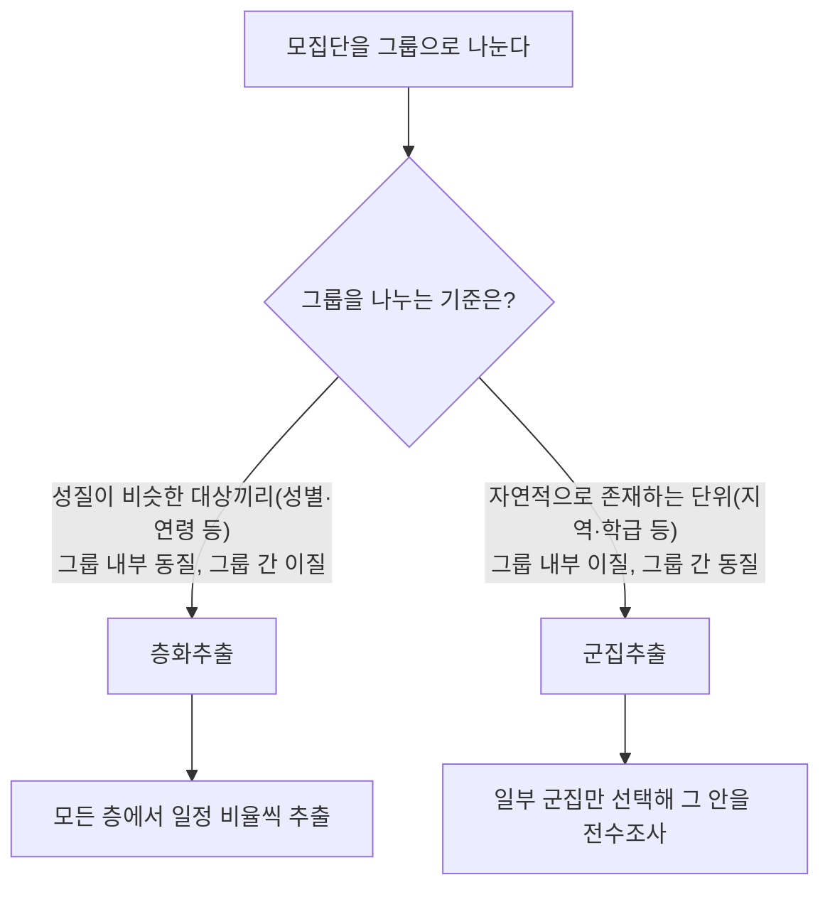

## 모집단과 표본, 그리고 표본추출이 필요한 이유

## 표본추출 방법 4가지

### 정의

| 추출 방법 | 영문 | 절차 | 핵심 아이디어 |
|---|---|---|---|
| 단순랜덤추출 | simple random sampling | 모집단의 모든 개체에 번호를 부여하고 완전히 무작위로 추출 | 모든 개체가 뽑힐 확률이 동일 |
| 계통추출 | systematic sampling | 번호를 부여한 뒤 첫 표본을 무작위로 정하고, 이후 일정한 간격 $k$마다 추출 | 단순랜덤추출을 간편하게 만든 방식 |
| 층화추출 | stratified sampling | 모집단을 성질이 비슷한 층(strata)으로 나눈 뒤, 각 층에서 일정 비율씩 추출 | 층 내부는 동질적, 층 사이는 이질적으로 나눈 뒤 모든 층에서 골고루 뽑음 |
| 군집추출 | cluster sampling | 모집단을 여러 군집(cluster)으로 나눈 뒤, 일부 군집을 통째로 선택해 그 안을 전수조사 | 군집 내부는 이질적, 군집 사이는 동질적으로 나눈 뒤 일부 군집만 뽑음 |

### 층화추출과 군집추출, 핵심 차이는 "무엇을 어떻게 나누고 뽑는가"

네 가지 방법 중 가장 대표적인 함정은 층화추출과 군집추출을 혼동하는 것이다. 둘 다 모집단을 여러 그룹으로 나눈다는 점은 같지만, **그룹을 나누는 기준**과 **그룹 안에서 뽑는 방식**이 정반대다.

**층화추출**은 모집단을 성별·연령대·지역처럼 성질이 비슷한 대상끼리 묶어 층(strata)을 만든다. 예를 들어 전국 유권자를 20대·30대·40대·50대 이상으로 층을 나누면, 같은 층 안의 사람들은 연령대 특성이 비슷하다(동질적).

**군집추출**은 반대로 지역·학급처럼 자연적으로 존재하는 집단을 그대로 군집(cluster)으로 삼는다. 군집을 나눈 뒤에는 **일부 군집만 무작위로 선택**해서, 그 선택된 군집 안에서는 전수조사(구성원 전체를 조사)한다.

```mermaid
flowchart TD
    A["모집단을 그룹으로 나눈다"] --> B{"그룹을 나누는 기준은?"}
    B -->|"성질이 비슷한 대상끼리(성별·연령 등)<br/>그룹 내부 동질, 그룹 간 이질"| C["층화추출"]
    B -->|"자연적으로 존재하는 단위(지역·학급 등)<br/>그룹 내부 이질, 그룹 간 동질"| D["군집추출"]
    C --> E["모든 층에서 일정 비율씩 추출"]
    D --> F["일부 군집만 선택해 그 안을 전수조사"]
```

| 구분 기준 | 층화추출 | 군집추출 |
|---|---|---|
| 그룹 내부 성질 | 동질적(비슷한 특성끼리 묶음) | 이질적(모집단의 축소판처럼 다양함) |
| 그룹 사이 성질 | 이질적(층마다 특성이 다름) | 동질적(군집끼리 비슷한 구성) |
| 추출 대상 | 모든 그룹에서 표본 추출 | 일부 그룹만 선택 |
| 선택된 그룹 내 처리 | 그 안에서 다시 표본 추출 | 그 안은 전수조사(통째로 포함) |
| 예시 | 연령대별로 나눠 각 연령대에서 100명씩 | 전국 학교 중 20개교를 뽑아 그 학교 학생 전체 조사 |

### 자주 틀리는 점

기출 자료를 확인해 보면 계통추출("번호를 부여하고 일정 간격으로 추출")을 단순랜덤추출이나 층화추출로 착각하게 만드는 보기가 자주 나온다. 계통추출은 첫 표본만 무작위로 뽑고 이후에는 규칙적인 간격 $k$를 따른다는 점에서 단순랜덤추출과 구별된다.

## 표본분포와 중심극한정리

### 정의

**표본분포**(sampling distribution)는 모집단에서 크기 $n$인 표본을 반복해서 뽑았을 때, 그 표본들로부터 계산한 통계량(표본평균, 표본비율 등)이 따르는 확률분포다. 표본평균의 표본분포에서 특히 중요한 정리가 **중심극한정리**(central limit theorem, CLT)다.

**중심극한정리**는 모집단의 분포 모양과 관계없이, 표본의 크기 $n$이 충분히 크면(일반적으로 $n \geq 30$을 기준으로 삼는다) 표본평균 $\bar{X}$의 분포가 정규분포에 가까워진다는 정리다.

$$
\bar{X} \sim N\left(\mu, \frac{\sigma^2}{n}\right) \quad (n\text{이 충분히 클 때})
$$

- $\bar{X}$: 표본평균(확률변수로서의 표본평균)
- $\mu$: 모집단의 평균
- $\sigma^2$: 모집단의 분산
- $n$: 표본의 크기

여기서 $\sigma/\sqrt{n}$을 **표준오차**(standard error, SE)라 하며, 표본평균이라는 확률변수 자체가 얼마나 흩어져 있는지를 나타낸다. 표본 크기 $n$이 커질수록 표준오차는 작아지므로, 표본이 클수록 표본평균이 모평균에 더 가깝게 몰린다는 뜻이다.

### 작은 예시

주사위를 한 번 던진 눈금은 1부터 6까지 균등하게 나오는 분포(균등분포, 정규분포와 전혀 다른 모양)를 따른다. 그런데 주사위를 30번 던진 평균을 계산하고, 이 시행을 수백 번 반복해 평균값들을 모아 그래프를 그리면, 원래 균등분포와 전혀 다른 좌우 대칭의 종 모양(정규분포에 가까운 모양)이 나타난다.

### 결과 해석

중심극한정리 덕분에, 모집단이 정규분포를 따르는지조차 몰라도 표본 크기만 충분히 크면 정규분포를 이용한 다양한 추정·검정 기법(구간추정, 16편의 가설검정 등)을 적용할 수 있다. 이것이 중심극한정리가 통계학 전체의 토대로 불리는 이유다.

### 자주 틀리는 점

"표본 크기가 크면 모집단 자체가 정규분포를 따르게 된다"는 오해가 흔하다. 중심극한정리가 정규분포에 가까워진다고 보장하는 대상은 **모집단이 아니라 표본평균의 분포**다. 모집단의 모양은 어떻든 원래 그대로다.

## 점추정과 구간추정

### 정의

**점추정**(point estimation)은 모수를 하나의 값(점)으로 추정하는 방법이다. 표본평균 $\bar{x}$로 모평균 $\mu$를, 표본분산 $s^2$으로 모분산 $\sigma^2$을 추정하는 것이 대표적이다.

**구간추정**(interval estimation)은 모수가 포함될 것으로 기대되는 범위를 제시하는 방법이다. 이 범위를 **신뢰구간**(confidence interval, CI)이라 하며, 모표준편차를 알고 표본 크기가 충분히 클 때 표본평균 기준 신뢰구간은 다음과 같이 구한다.

$$
\bar{x} \pm Z_{\alpha/2} \times \frac{\sigma}{\sqrt{n}}
$$

- $\bar{x}$: 표본평균
- $Z_{\alpha/2}$: 신뢰수준에 대응하는 표준정규분포의 임계값(95퍼센트 신뢰수준에서는 약 1.96)
- $\sigma/\sqrt{n}$: 표준오차

### 계산 예제

어느 공장에서 생산하는 부품 무게의 모표준편차가 $\sigma = 4$g으로 알려져 있다. 이 공장에서 표본 $n=64$개를 뽑아 측정했더니 표본평균이 $\bar{x} = 100$g이었다. 95퍼센트 신뢰구간을 구하면 다음과 같다.

$$
\frac{\sigma}{\sqrt{n}} = \frac{4}{\sqrt{64}} = \frac{4}{8} = 0.5
$$

$$
100 \pm 1.96 \times 0.5 = 100 \pm 0.98
$$

따라서 95퍼센트 신뢰구간은 약 $[99.02, 100.98]$이다.

**검산**: 신뢰구간의 폭은 $1.96 \times 0.5 \times 2 = 1.96$이며, 상한($100.98$)에서 하한($99.02$)을 빼면 $1.96$으로 일치한다.

## 신뢰수준의 의미: "95퍼센트 신뢰구간"을 올바르게 읽기

### 올바른 해석과 흔한 오해

앞서 계산한 신뢰구간 $[99.02, 100.98]$을 예로 들어보자.

- **흔한 오해**: "모평균이 이 구간 안에 있을 확률이 95퍼센트다." 이 해석은 틀렸다. 모평균 $\mu$는 이미 정해져 있는(우리가 모를 뿐인) 고정된 상수이지, 확률적으로 움직이는 값이 아니다. 이미 계산되어 고정된 구간 $[99.02, 100.98]$에 대해 "모평균이 그 안에 있을 확률이 95퍼센트"라고 말하는 것은, 이미 던져서 바닥에 떨어진 동전을 보면서 "앞면일 확률이 50퍼센트"라고 말하는 것과 같은 논리적 오류다. 이 구간이 모평균을 포함하는지 여부는 이미 예/아니오로 정해져 있으며, 다만 우리가 그 답을 모를 뿐이다.
- **올바른 해석**: 신뢰수준 95퍼센트는 **구간을 만드는 절차(방법)에 대한 신뢰도**를 의미한다. 즉 같은 표본추출 방법으로 신뢰구간을 100번 반복해서 만든다면, 표본을 뽑을 때마다 다른 구간이 나오겠지만, 그렇게 만들어진 100개의 구간 중 평균적으로 약 95개는 실제 모평균을 포함하고 약 5개는 포함하지 못한다는 뜻이다. 확률은 "구간 안에 모평균이 있는가"가 아니라 "이 절차가 모평균을 포함하는 구간을 만들어 낼 가능성"에 붙는다.

### 자주 틀리는 점

"신뢰수준을 99퍼센트로 높이면 구간이 더 좁아진다"는 오해도 흔하다. 더 높은 확률로 모평균을 포함시키려면 $Z_{\alpha/2}$ 값이 커져야 하므로(95퍼센트일 때 약 1.96, 99퍼센트일 때 약 2.58) 신뢰구간의 폭은 오히려 넓어진다.

## 핵심 정리

- 표본추출 4가지 방법 중 계통추출은 일정 간격으로, 층화추출은 동질적인 층 전부에서, 군집추출은 이질적인 군집 중 일부를 통째로 뽑는다.
- 층화추출은 "그룹 내부 동질, 그룹 간 이질, 모든 그룹에서 추출"이고, 군집추출은 "그룹 내부 이질, 그룹 간 동질, 일부 그룹만 통째로 추출"이다.
- 중심극한정리는 모집단의 분포 모양과 무관하게, 표본 크기가 충분히 크면 표본평균의 분포가 정규분포에 가까워진다는 정리다.
- 점추정은 값 하나로, 구간추정은 신뢰구간이라는 범위로 모수를 추정한다.
- 95퍼센트 신뢰구간은 "모평균이 그 구간에 있을 확률이 95퍼센트"가 아니라 "같은 방법으로 구간을 반복해 만들면 약 95퍼센트가 모평균을 포함한다"는 절차에 대한 신뢰도다.

## 마무리 복습

<Quiz
  questionNumber={1}
  question={"전국 고등학교를 지역·특성이 비슷한 15개 지역으로 나눈 뒤, 그중 3개 지역을 무작위로 선택해 선택된 지역의 모든 고등학교 학생을 조사했다. 이 표본추출 방법은?"}
  options={["단순랜덤추출","계통추출","층화추출","군집추출"]}
  correctAnswer={4}
  explanation={"지역을 하나의 집단(군집)으로 보고 일부 군집만 선택한 뒤 그 안을 통째로(전수) 조사했으므로 군집추출이다."}
/>

<Quiz
  questionNumber={2}
  question={"층화추출과 군집추출의 차이에 대한 설명으로 옳은 것은?"}
  options={["층화추출은 그룹 내부가 이질적이도록 나누고, 군집추출은 그룹 내부가 동질적이도록 나눈다","층화추출은 모든 그룹에서 표본을 뽑고, 군집추출은 일부 그룹만 선택해 통째로 조사한다","두 방법 모두 그룹을 나누지 않고 개체를 직접 무작위로 뽑는다","군집추출이 층화추출보다 항상 표본 오차가 작다"]}
  correctAnswer={2}
  explanation={"층화추출은 동질적인 층으로 나눈 뒤 모든 층에서 일정 비율씩 추출하고, 군집추출은 이질적인(모집단의 축소판 같은) 군집으로 나눈 뒤 일부 군집만 선택해 그 안을 통째로 조사한다."}
/>

<Quiz
  questionNumber={3}
  question={"중심극한정리(central limit theorem)에 대한 설명으로 가장 적절한 것은?"}
  options={["표본 크기가 충분히 크면 모집단 자체의 분포가 정규분포로 바뀐다","모집단의 분포 모양과 관계없이, 표본 크기가 충분히 크면 표본평균의 분포가 정규분포에 가까워진다","표본 크기가 작을수록 표본평균의 분포가 정규분포에 더 가까워진다","중심극한정리는 모집단이 정규분포일 때만 성립한다"]}
  correctAnswer={2}
  explanation={"중심극한정리는 원래 모집단의 분포 모양이 무엇이든, 표본 크기 n이 충분히 크면(일반적으로 30 이상) 표본평균의 분포가 정규분포에 가까워진다는 정리다."}
/>

## 참고 자료

- [데이터자격시험 - ADsP 출제기준](https://www.dataq.or.kr/www/sub/a_06.do)
