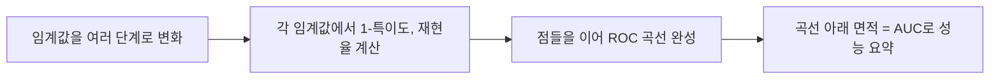

## 모형평가는 왜 필요한가

### 정의: 혼동행렬

분류 모델의 성능을 평가하려면 먼저 "모델이 예측한 값"과 "실제 정답"을 교차로 정리한 표가 필요한데, 이를 **혼동행렬**(confusion matrix, 오분류표)이라 한다. 이진 분류(결과가 양성/음성 두 가지)를 기준으로, 혼동행렬은 다음 4칸으로 구성된다.

| 구분 | 예측: 양성(Positive) | 예측: 음성(Negative) |
|---|---|---|
| 실제: 양성(Positive) | TP (True Positive, 참양성) | FN (False Negative, 거짓음성) |
| 실제: 음성(Negative) | FP (False Positive, 거짓양성) | TN (True Negative, 참음성) |

- **TP**(True Positive): 실제로 양성인데 모델도 양성으로 맞게 예측한 경우
- **FN**(False Negative): 실제로 양성인데 모델이 음성으로 잘못 예측한 경우(양성을 놓침)
- **FP**(False Positive): 실제로 음성인데 모델이 양성으로 잘못 예측한 경우(잘못된 경보)
- **TN**(True Negative): 실제로 음성인데 모델도 음성으로 맞게 예측한 경우

이 네 칸의 이름 규칙은 일정하다. 즉 FN은 "모델이 틀렸고(False), 음성(Negative)으로 예측했다"는 뜻이지, 실제 값이 아니라 **예측값 기준**으로 이름이 붙는다는 점을 헷갈리지 말아야 한다.

## 예시: 200명의 질병 진단 결과

어느 질병 진단 모델을 200명에게 적용한 결과, 다음과 같은 혼동행렬을 얻었다고 하자(질병이 있음을 양성으로 정의).

| 구분 | 예측: 양성 | 예측: 음성 | 합계 |
|---|---|---|---|
| 실제: 양성 | TP = 80 | FN = 20 | 100 |
| 실제: 음성 | FP = 30 | TN = 70 | 100 |
| 합계 | 110 | 90 | 200 |

이 표를 이용해 정확도·정밀도·재현율·특이도·F1을 순서대로 계산해본다. 앞으로 나오는 모든 계산은 이 표 하나의 숫자(TP=80, FN=20, FP=30, TN=70)만 사용한다.

### 정의와 계산: 정확도

**정확도**(accuracy)는 전체 예측 중 맞게 예측한 비율이다.

$$
\text{Accuracy} = \frac{TP + TN}{TP + FN + FP + TN}
$$

값을 대입하면 다음과 같다.

$$
\text{Accuracy} = \frac{80 + 70}{80 + 20 + 30 + 70} = \frac{150}{200} = 0.75
$$

정확도 0.75는 "200명 중 150명(75퍼센트)을 올바르게 판정했다"는 뜻이다.

### 정의와 계산: 정밀도

**정밀도**(precision)는 모델이 **양성으로 예측한 것 중**, 실제로 양성인 비율이다.

$$
\text{Precision} = \frac{TP}{TP + FP}
$$

값을 대입하면 다음과 같다.

$$
\text{Precision} = \frac{80}{80 + 30} = \frac{80}{110} \approx 0.727
$$

정밀도 약 0.727은 "모델이 양성이라고 판정한 110명 중 약 72.7퍼센트(80명)가 실제로도 양성이었다"는 뜻이다.

### 정의와 계산: 재현율

**재현율**(recall, 민감도sensitivity라고도 함)은 **실제로 양성인 것 중**, 모델이 양성으로 맞게 예측한 비율이다.

$$
\text{Recall} = \frac{TP}{TP + FN}
$$

값을 대입하면 다음과 같다.

$$
\text{Recall} = \frac{80}{80 + 20} = \frac{80}{100} = 0.8
$$

재현율 0.8은 "실제로 병이 있는 100명 중 80퍼센트(80명)를 모델이 놓치지 않고 잡아냈다"는 뜻이다.

### 정밀도와 재현율, 분모가 다르다

정밀도와 재현율은 둘 다 분자가 TP로 같기 때문에 자주 헷갈리지만, **분모가 무엇인가**를 보면 명확히 구분된다.

| 지표 | 분모의 기준 | 질문 형태 |
|---|---|---|
| 정밀도(Precision) | 모델이 양성이라고 **예측한** 것 (TP + FP) | 예측한 것 중 실제로 맞은 비율은? |
| 재현율(Recall) | 실제로 양성인 것 (TP + FN) | 실제인 것 중 놓치지 않고 맞춘 비율은? |

정밀도는 "모델의 양성 판정을 얼마나 믿을 수 있는가"(예측 기준)를 보는 지표이고, 재현율은 "실제 양성 사례를 얼마나 빠짐없이 찾아냈는가"(실제 기준)를 보는 지표다. 스팸 메일 필터를 예로 들면, 정밀도가 낮으면 정상 메일을 스팸으로 잘못 거르는 일이 잦다는 뜻이고(FP가 큼), 재현율이 낮으면 진짜 스팸을 놓쳐 받은편지함에 들어오게 둔다는 뜻이다(FN이 큼).

### 정의와 계산: 특이도

**특이도**(specificity)는 **실제로 음성인 것 중**, 모델이 음성으로 맞게 예측한 비율이다. 재현율이 양성 기준의 적중률이라면, 특이도는 음성 기준의 적중률이라고 볼 수 있다.

$$
\text{Specificity} = \frac{TN}{TN + FP}
$$

값을 대입하면 다음과 같다.

$$
\text{Specificity} = \frac{70}{70 + 30} = \frac{70}{100} = 0.7
$$

특이도 0.7은 "실제로 병이 없는 100명 중 70퍼센트(70명)를 모델이 정확히 음성으로 판정했다"는 뜻이다. 나머지 30퍼센트(FP=30명)는 병이 없는데도 양성으로 잘못 판정된 경우이며, 이 비율을 **1-특이도**(위양성률, False Positive Rate)라고 부른다.

### 정의와 계산: F1 점수

정밀도와 재현율은 흔히 한쪽이 오르면 다른 쪽이 내려가는 상충(trade-off) 관계에 있다. 예를 들어 "의심스러우면 무조건 양성으로 판정"하면 재현율은 올라가지만 정밀도는 떨어진다. 두 지표를 동시에 균형 있게 반영하고 싶을 때 쓰는 지표가 **F1 점수**(F1 score)다.

$$
F_1 = \frac{2 \times \text{Precision} \times \text{Recall}}{\text{Precision} + \text{Recall}}
$$

값을 대입하면 다음과 같다.

$$
F_1 = \frac{2 \times 0.727 \times 0.8}{0.727 + 0.8} \approx \frac{1.164}{1.527} \approx 0.762
$$

### F1이 조화평균인 이유, 그리고 검산

F1은 정밀도와 재현율의 **조화평균**(harmonic mean, 역수의 산술평균의 역수)이다. 조화평균의 일반식은 다음과 같다.

$$
F_1 = \frac{2}{\dfrac{1}{\text{Precision}} + \dfrac{1}{\text{Recall}}}
$$

단순 산술평균이 아니라 조화평균을 쓰는 이유는, 조화평균이 **작은 값 쪽으로 더 크게 끌려가는 성질**이 있기 때문이다. 예를 들어 정밀도가 1.0이고 재현율이 0.1처럼 한쪽이 극단적으로 낮으면, 산술평균은 0.55로 그럭저럭 괜찮아 보이지만 실제로는 재현율이 형편없는 모델이다.

위에서 구한 정밀도(약 0.727)와 재현율(0.8)을 조화평균 정의식에 다시 대입해 검산해보자.

$$
F_1 = \frac{2}{\dfrac{1}{0.727} + \dfrac{1}{0.8}} \approx \frac{2}{1.375 + 1.25} = \frac{2}{2.625} \approx 0.762
$$

앞서 곱셈 형태의 공식으로 구한 값(약 0.762)과 조화평균 정의식으로 다시 구한 값(약 0.762)이 일치하므로, 계산이 올바르게 되었음을 확인할 수 있다.

### 자주 틀리는 점

- 정밀도와 재현율의 **분모를 뒤바꿔** 계산하는 것이 가장 흔한 오답 패턴이다. 항상 "분모가 예측 기준인가(정밀도), 실제 기준인가(재현율)"를 먼저 확인해야 한다.
- 정확도가 높다고 항상 좋은 모델은 아니다. 예를 들어 실제 양성이 전체의 1퍼센트뿐인 데이터에서 무조건 "음성"이라고만 예측해도 정확도는 99퍼센트가 나온다. 이런 **불균형 데이터**(imbalanced data)에서는 정확도 대신 정밀도·재현율·F1을 함께 살펴야 한다.
- 재현율과 민감도는 완전히 같은 개념(TP 나누기 TP+FN)이다. 서로 다른 지표라고 착각하지 않아야 한다.

## ROC 곡선과 AUC

### 정의

**ROC 곡선**(Receiver Operating Characteristic curve)은 분류 임계값을 변화시키면서, X축에 **1-특이도**(위양성률, False Positive Rate), Y축에 **재현율**(민감도, True Positive Rate)을 찍어 이은 곡선이다. 좋은 모델일수록 곡선이 왼쪽 위 모서리(위양성률은 낮고 민감도는 높은 지점)에 바짝 붙어서 그려진다.

이 곡선 아래의 면적을 하나의 숫자로 요약한 지표가 **AUC**(Area Under the Curve)다. AUC는 0.5(완전히 무작위로 찍는 것과 같은 성능)에서 1(완벽한 분류)까지의 값을 가지며, 1에 가까울수록 모델의 분류 성능이 우수하다고 판단한다.

## 회귀모형의 평가지표

### 정의

대표적인 회귀모형 평가지표는 다음과 같다. $n$은 관측치 개수, $y_i$는 $i$번째 실제값, $\hat{y}_i$($y$ 햇, $y$ hat)는 $i$번째 예측값이다.

- **MAE**(Mean Absolute Error, 평균절대오차): 오차의 절댓값을 평균한 값.

$$
\text{MAE} = \frac{1}{n}\sum_{i=1}^{n} |y_i - \hat{y}_i|
$$

- **MSE**(Mean Squared Error, 평균제곱오차): 오차를 제곱해서 평균한 값. 오차를 제곱하므로 큰 오차에 더 큰 벌점을 준다.

$$
\text{MSE} = \frac{1}{n}\sum_{i=1}^{n} (y_i - \hat{y}_i)^2
$$

- **RMSE**(Root Mean Squared Error, 평균제곱근오차): MSE에 제곱근을 씌운 값. 제곱으로 커진 단위를 원래 종속변수의 단위로 되돌려주어 해석이 쉬워진다.

$$
\text{RMSE} = \sqrt{\text{MSE}}
$$

- **결정계수**($R^2$, R-squared): 18편에서 다룬 지표로, 모델이 종속변수의 전체 변동 중 얼마나 많은 부분을 설명하는지를 나타내며 0과 1 사이의 값을 가진다(1에 가까울수록 설명력이 높음). 자세한 정의와 계산은 18편을 참고한다.

MAE와 RMSE 모두 값이 작을수록 예측이 실제값에 가깝다는 뜻이며, 두 지표의 단위는 종속변수와 같은 단위를 갖는다는 공통점이 있다. 다만 RMSE는 오차를 제곱한 뒤 평균하므로 유난히 큰 오차(이상치)가 있으면 그 값에 더 민감하게 반응해 커지는 반면, MAE는 모든 오차를 동등한 비중으로 평균하므로 이상치의 영향을 상대적으로 덜 받는다.

## 핵심 정리

- 혼동행렬은 실제값(행)과 예측값(열)을 교차한 표이며, TP·FN·FP·TN의 이름은 예측이 맞았는지(True/False)와 무엇으로 예측했는지(Positive/Negative)로 정해진다.
- 정확도는 (TP+TN)/전체, 정밀도는 TP/(TP+FP), 재현율은 TP/(TP+FN), 특이도는 TN/(TN+FP)로 계산한다.
- 정밀도는 예측한 것 중 맞은 비율, 재현율은 실제인 것 중 맞춘 비율이며, 분모의 차이가 핵심 구분점이다.
- F1은 정밀도와 재현율의 조화평균이며, 두 값 중 낮은 쪽에 더 크게 영향을 받아 균형 잡힌 평가를 제공한다.
- ROC 곡선은 임계값을 바꿔가며 1-특이도 대 재현율을 그린 그래프이고, AUC는 그 곡선 아래 면적으로 1에 가까울수록 좋은 모델이다.
- 회귀모형은 MAE·MSE·RMSE·결정계수로 평가하며, RMSE는 MSE에 제곱근을 씌워 원래 단위로 해석할 수 있게 한 지표다.

## 마무리 복습

<Quiz
  questionNumber={1}
  question={"혼동행렬에서 FN(False Negative)이 의미하는 것은?"}
  options={["실제로 양성인데 모델이 양성으로 맞게 예측한 경우","실제로 양성인데 모델이 음성으로 잘못 예측한 경우","실제로 음성인데 모델이 양성으로 잘못 예측한 경우","실제로 음성인데 모델이 음성으로 맞게 예측한 경우"]}
  correctAnswer={2}
  explanation={"FN은 모델의 예측이 틀렸고(False), 그 예측이 음성(Negative)이었다는 뜻이다. 즉 실제로는 양성인데 모델이 음성으로 잘못 예측해 양성 사례를 놓친 경우다."}
/>

<Quiz
  questionNumber={2}
  question={"TP=80, FN=20, FP=30, TN=70인 혼동행렬에서 정확도(Accuracy)는?"}
  options={["0.7","0.727","0.75","0.8"]}
  correctAnswer={3}
  explanation={"정확도는 (TP+TN)을 전체(TP+FN+FP+TN)로 나눈 값이다. (80+70)을 200으로 나누면 0.75이다."}
/>

<Quiz
  questionNumber={3}
  question={"TP=80, FN=20, FP=30, TN=70인 혼동행렬에서 정밀도(Precision)와 재현율(Recall)을 각각 올바르게 계산한 것은?"}
  options={["정밀도 0.8, 재현율 0.727","정밀도 0.727, 재현율 0.8","정밀도 0.75, 재현율 0.75","정밀도 0.7, 재현율 0.7"]}
  correctAnswer={2}
  explanation={"정밀도는 TP/(TP+FP)=80/110≈0.727이고, 재현율은 TP/(TP+FN)=80/100=0.8이다."}
/>

## 참고 자료

- [데이터자격시험 - ADsP 출제기준](https://www.dataq.or.kr/www/sub/a_06.do)
