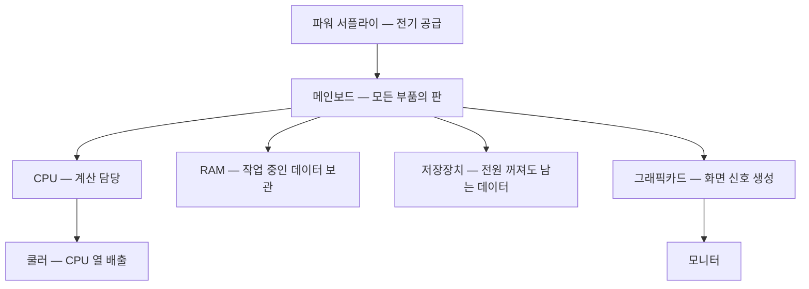

<Callout type="info">
  **이번 문서의 목표:** 이 파일을 다 읽으면 PC를 열었을 때 각 부품을 이름과 규격으로 지목할 수 있고, 메인보드 뒷면 포트를 색과 모양만 보고 명칭으로 답할 수 있으며, 실기 단답형에서 반복 출제되는 인터페이스 용어를 정확한 표기로 쓸 수 있습니다.
</Callout>

## 왜 부품 이름부터 다시 배우는가

"CPU는 연산을 한다"는 문장은 필기용입니다. 실기에서 필요한 문장은 이런 것입니다.

- 이 CPU는 **소켓** LGA1700이고, 그래서 이 메인보드에만 꽂힌다.
- 이 파란색 USB 포트는 **USB 3.0**(USB 3.2 Gen1)이고, 드래그앤드롭 문항에서 이 색이 단서다.
- 이 번개 모양 단자는 **썬더볼트**이며, 데이터·영상·음성을 한 케이블로 보낸다.

즉 실기는 부품을 **기능**이 아니라 **식별 단서와 규격 이름**으로 다룹니다. 이번 편은 그 언어를 갈아 끼우는 작업입니다.

> **쉽게 말하면:** 실기에서 부품 지식이란 "무슨 일을 하는가"가 아니라 "무엇으로 알아보고 뭐라고 부르는가"입니다.

## 1. 여섯 개의 핵심 부품 — 역할과 식별 단서

먼저 PC 한 대가 어떤 부품들의 협업으로 동작하는지 그림으로 잡습니다.

### CPU — 중앙처리장치

**CPU**(Central Processing Unit, 중앙처리장치)는 계산을 담당하는 부품입니다. 단어를 쪼개면 Central(중앙의) + Processing(처리하는) + Unit(장치)이므로, 이름 자체가 "중앙에서 처리하는 장치"라는 뜻입니다.

실기에서 CPU를 다룰 때 중요한 단서는 **소켓**(socket, 꽂는 자리)입니다. CPU 아랫면이 핀으로 되어 있는지, 평평한 접점으로 되어 있는지에 따라 두 방식으로 나뉩니다.

| 방식 | 이름 | 핀 위치 | 대표 예 |
|------|------|---------|---------|
| 핀이 CPU에 | PGA(Pin Grid Array) | CPU 아래에 핀 | AMD AM4 |
| 핀이 보드에 | LGA(Land Grid Array) | 메인보드 소켓에 핀 | 인텔 LGA1700 |

LGA에서 Land(랜드)는 "평평한 접점"이라는 뜻이고, Grid Array는 "격자 배열"입니다. 즉 **평평한 접점이 격자로 깔린 방식**이 LGA입니다. 이 구분이 실기에서 의미 있는 이유는 **핀이 있는 쪽이 부러지면 그 부품이 폐기**되기 때문입니다. LGA 보드는 소켓 핀을 절대 손대면 안 되고, PGA CPU는 아래를 바닥에 문지르면 안 됩니다.

### 메인보드 — 모든 부품이 올라가는 판

**메인보드**(mainboard) 또는 **마더보드**(motherboard)는 부품 사이에 전기와 신호를 연결하는 큰 인쇄회로기판입니다. Mother(어머니) + Board(판)이라는 이름은 "다른 모든 보드를 품는 판"이라는 뜻에서 왔습니다.

메인보드에서 실기가 묻는 것은 대개 세 가지입니다.

1. **폼팩터**(form factor, 규격 크기) — ATX, mATX(Micro ATX), Mini-ITX 순으로 작아집니다. 케이스와 맞아야 나사 구멍이 맞습니다.
2. **칩셋**(chipset) — CPU와 주변 장치 사이의 교통정리를 담당하는 칩. 어떤 기능을 지원하는지가 칩셋으로 결정됩니다. 자세한 내용은 04편.
3. **백패널 I/O 포트** — 뒤에서 별도로 다룹니다. 드래그앤드롭 문항의 단골입니다.

### RAM — 작업대

**RAM**(Random Access Memory, 임의 접근 기억장치)은 지금 작업 중인 데이터를 담아두는 곳입니다. Random Access는 "아무 위치나 같은 속도로 바로 읽을 수 있다"는 뜻으로, 앞에서부터 순서대로 감아야 하는 테이프와 대비되는 개념입니다.

RAM의 결정적 성질은 **휘발성**(volatile, 볼라타일)입니다. 전원이 끊기면 내용이 사라집니다. 그래서 책상 비유가 잘 맞습니다 — RAM은 책상 위, 저장장치는 서랍입니다. 책상이 좁으면 서랍을 자주 여닫아야 하니 느려집니다. 이 "책상이 좁을 때 서랍 일부를 책상처럼 쓰는" 기법이 바로 **가상 메모리**(virtual memory)이고, 실기 단골 문항입니다. 자세한 절차는 05편에서 다룹니다.

### 저장장치 — 서랍

전원을 꺼도 데이터가 남는 **비휘발성**(non-volatile) 장치입니다. 실기에서 구분해야 할 세 가지는 다음과 같습니다.

| 종류 | 저장 방식 | 연결 인터페이스 | 특징 |
|------|-----------|------------------|------|
| HDD(Hard Disk Drive) | 자기 원판 회전 | SATA | 대용량·저렴, 충격에 약함 |
| SATA SSD | 플래시 메모리 | SATA | HDD보다 빠름, 케이블 2개 필요 |
| NVMe SSD | 플래시 메모리 | M.2 슬롯 + PCIe | 가장 빠름, 케이블 없음 |

**NVMe**(Non-Volatile Memory Express)는 이름 그대로 "비휘발성 메모리를 위한 빠른 통로"라는 뜻의 규약입니다. 기존 SATA 규약이 회전하는 디스크를 전제로 설계된 반면, NVMe는 플래시 메모리의 병렬성을 살리도록 새로 설계되었습니다. 그래서 같은 플래시를 쓰더라도 NVMe 쪽이 훨씬 빠릅니다.

### 파워 서플라이 — 전기 변환기

**파워 서플라이**(PSU, Power Supply Unit, 전원 공급 장치)는 콘센트의 교류(AC, Alternating Current)를 부품이 쓰는 직류(DC, Direct Current)로 바꿔 공급합니다. 출력 전압은 `+12V`, `+5V`, `+3.3V` 세 가지가 중심입니다.

**교류와 직류는 전류가 흐르는 방향의 차이**입니다. 교류(AC)는 전류의 방향이 1초에 수십 번씩 주기적으로 바뀌는 전기이고, 발전소에서 먼 거리를 보낼 때 효율이 좋아서 콘센트에 들어오는 전기가 교류입니다. 직류(DC)는 전류가 한쪽 방향으로만 흐르는 전기이고, CPU·RAM 같은 반도체 부품은 방향이 일정해야 오작동하지 않으므로 직류로만 동작합니다. PSU는 그 중간에서 교류를 직류로 바꿔주는 변환기입니다.

> **쉽게 말하면:** 콘센트(AC, 방향이 왔다갔다) → PSU(변환) → 부품(DC, 한 방향으로만).

**어댑터나 PSU 라벨에 적힌 V·A는 서로 다른 값**을 나타냅니다.

- **V(볼트, Volt)** — 전압. 전기를 밀어내는 힘의 세기.
- **A(암페어, Ampere)** — 전류. 실제로 흐르는 전기의 양.
- **W(와트, Watt)** — 전력. 전압×전류로 계산되는 실제 공급 능력.

예를 들어 어댑터에 `12V 3A`라고 적혀 있으면 "12볼트 전압으로 최대 3암페어까지 전류를 공급할 수 있다"는 뜻이고, 이때 최대 출력은 12 × 3 = **36W**입니다. 어댑터를 다른 제품 것으로 바꿔 쓸 때 전압(V)은 반드시 같아야 하고, 전류(A)는 원래 표기보다 같거나 높은 것을 써야 합니다 — 전류가 부족하면 필요한 만큼 전기를 공급하지 못해 과부하가 걸립니다.

실기에서 파워는 **커넥터 모양**으로 식별합니다. 이때 나오는 두 규격도 짚고 갑니다.

- **PCIe**(PCI Express, Peripheral Component Interconnect Express) — 그래픽카드 등 확장 카드를 꽂는 고속 슬롯·전원 규격. 아래 그래픽카드 절에서 다시 다룹니다.
- **SATA**(Serial ATA, Serial Advanced Technology Attachment) — HDD·SATA SSD를 메인보드에 연결하는 저장장치 규격. 데이터 전송용 케이블과 전원 공급용 케이블이 따로 있습니다.

| 커넥터 | 핀 수 | 연결 대상 |
|--------|-------|-----------|
| 메인 전원 | 24핀 (20+4 분리형) | 메인보드 |
| CPU 보조 전원 | 8핀 (4+4 분리형) | 메인보드 CPU 옆 |
| PCIe 보조 전원 | 6+2핀 | 그래픽카드 |
| SATA 전원 | 15핀 납작 | SSD·HDD |

24핀과 8핀을 헷갈리는 일은 거의 없지만, **CPU 8핀과 PCIe 6+2핀은 겉모습이 비슷해 오삽입 사고**가 납니다. 구분법은 핀 구멍의 모서리 모양입니다. 자세한 것은 03편에서 다룹니다.

### 그래픽카드 — 화면 신호 생성기

**GPU**(Graphics Processing Unit, 그래픽 처리 장치)를 얹은 확장 카드로, **PCIe**(Peripheral Component Interconnect Express) 슬롯에 꽂습니다. Peripheral(주변기기) + Component(부품) + Interconnect(상호연결)이므로, 이름이 곧 "주변 부품을 잇는 통로"입니다.

CPU 안에 그래픽 기능이 들어 있는 경우를 **내장 그래픽**(iGPU, integrated GPU)이라 하고, 별도 카드를 **외장 그래픽**이라 합니다. 이 구분은 진단에서 결정적입니다 — 외장 그래픽을 꽂은 상태에서 모니터 케이블을 메인보드 쪽 단자에 연결하면 화면이 나오지 않습니다. 11편에서 다시 다룹니다.

## 2. 백패널 I/O 포트 식별 — 드래그앤드롭 대비

메인보드 뒷면(백패널)의 단자들은 실기 드래그앤드롭 문항에서 **위치와 명칭 연결**로 출제됩니다. 사진 없이도 맞히려면 **색·모양·핀 수**를 외워야 합니다.

| 포트 | 시각 단서 | 용도 | 헷갈리는 짝 |
|------|-----------|------|-------------|
| USB 2.0 | 직사각형, 내부 플라스틱 **검은색** | 저속 주변기기 | USB 3.0과 색으로 구분 |
| USB 3.0 (USB 3.2 Gen1) | 직사각형, 내부 플라스틱 **파란색** | 고속 저장장치 | USB 2.0 |
| USB Type-C | 작은 **타원형**, 상하 대칭 | 데이터·영상·전원 겸용 | 썬더볼트와 모양 동일 |
| HDMI | 사다리꼴, 19핀 | 영상 + 음성 | DP |
| DisplayPort (DP) | 사각형인데 **한쪽 모서리가 깎임** | 영상 + 음성 | HDMI |
| RJ-45 (LAN) | 정사각형에 가까운 8핀, 걸쇠 | 유선 네트워크 | RJ-11(전화, 6핀) |
| 3.5mm 오디오 | 둥근 구멍, 색상 구분 | 소리 입출력 | 색으로 역할 구분 |
| PS/2 | 둥근 6핀, 보라·초록 | 구형 키보드·마우스 | 색으로 역할 구분 |

여기서 시험이 특히 좋아하는 두 쌍을 짚습니다.

**USB 2.0과 USB 3.0** — 겉 모양이 같으므로 **색**이 유일한 단서입니다. 검은색이면 2.0, 파란색이면 3.0입니다. USB 3.0은 이후 이름이 바뀌어 USB 3.2 Gen1으로도 불립니다. 답을 적을 때는 문제에 제시된 표기를 따르되, 자유 기술이면 "USB 3.0"으로 적으면 됩니다.

**HDMI와 DisplayPort** — 둘 다 영상과 음성을 함께 보냅니다. 구분은 모양입니다. HDMI는 아래쪽이 좁아지는 사다리꼴이고, DisplayPort는 사각형에서 **한쪽 모서리만 비스듬히 깎인 비대칭** 형태입니다. DisplayPort는 VESA(Video Electronics Standards Association, 영상전자표준협회)가 정한 표준이며 버전 1.2, 1.4, 2.0 등이 있습니다. 이 설명이 그대로 단답형으로 나옵니다.

**3.5mm 오디오 잭의 색** 규약도 알아둘 만합니다.

| 색 | 역할 |
|-----|------|
| 연두색 | 라인 아웃(스피커·헤드폰) |
| 분홍색 | 마이크 입력 |
| 하늘색 | 라인 인(외부 음원 입력) |

11편의 사운드 문제 진단에서 이 색 규약이 다시 등장합니다.

## 3. 단답형 인터페이스 용어 — 정확한 표기로

실기 단답형은 **설명을 주고 이름을 쓰게** 합니다. 설명 문장의 특징적 단어를 기억해 두면 즉답이 가능합니다.

| 설명의 특징 단어 | 정답 표기 | 풀어 쓴 뜻 |
|------------------|-----------|------------|
| 번개 아이콘, 데이터·영상·음성을 한 케이블로 | 썬더볼트(Thunderbolt) | 인텔과 애플이 만든 다용도 고속 인터페이스 |
| VESA 표준, 한쪽 모서리가 깎인 비대칭 단자 | DP(DisplayPort) | 영상전자표준협회의 디스플레이 규격 |
| macOS 최신 파일 시스템, 스냅샷·공간 공유·암호화 | APFS(Apple File System) | SSD에 최적화된 애플의 파일 시스템 |
| 클라우드를 거치지 않고 기기 안에서 AI 연산 | 온디바이스 AI(On-Device AI) | 단말 내부에서 추론을 수행하는 방식 |
| 실행창에서 DirectX 진단 도구 실행 | `dxdiag` | DirectX Diagnostic Tool의 실행 파일명 |

세 가지는 조금 더 설명이 필요합니다.

**썬더볼트**는 USB Type-C와 **같은 모양의 단자**를 쓰지만 다른 규격입니다. 그래서 단자 옆에 번개 아이콘이 인쇄되어 있는지로 구분합니다. 문제에 "번개 모양"이라는 단어가 나오면 답은 Type-C가 아니라 썬더볼트입니다. 이 함정은 반복 출제됩니다.

**APFS**의 세 가지 특징을 각각 풀면 이렇습니다.

- **스냅샷**(snapshot): 특정 시점의 파일 시스템 상태를 통째로 찍어 두는 기능. 사진을 찍듯 순간을 보존해 두었다가 되돌릴 수 있습니다.
- **공간 공유**(Space Sharing): 하나의 저장 공간을 여러 볼륨이 나눠 쓰되, 각 볼륨이 필요한 만큼 유연하게 늘어나는 방식. 기존처럼 파티션 크기를 미리 못 박지 않습니다.
- **강력한 암호화**: 볼륨 단위로 여러 개의 암호화 키를 지원합니다.

**온디바이스 AI**는 서버로 데이터를 보내지 않으므로 **응답이 빠르고 개인정보 유출 위험이 낮다**는 장점이 함께 출제될 수 있습니다.

## 4. 실행 명령어 — 이름과 도구를 짝짓기

단답형에서 "이 도구를 실행하는 명령어를 쓰시오" 형태가 나오므로, 도구 이름과 명령어를 양방향으로 외워야 합니다. `Win` 키와 `R` 키를 함께 눌러 열리는 실행 창에 입력하는 문자열입니다.

| 명령어 | 실행되는 도구 | 이름의 유래 |
|--------|---------------|-------------|
| `dxdiag` | DirectX 진단 도구 | DirectX Diagnostic |
| `msinfo32` | 시스템 정보 | Microsoft System Information |
| `devmgmt.msc` | 장치 관리자 | Device Management |
| `diskmgmt.msc` | 디스크 관리 | Disk Management |
| `services.msc` | 서비스 관리자 | Services |
| `secpol.msc` | 로컬 보안 정책 | Security Policy |
| `regedit` | 레지스트리 편집기 | Registry Edit |
| `mstsc` | 원격 데스크톱 연결 | Microsoft Terminal Services Client |
| `sysdm.cpl` | 시스템 속성 | System Domain Control Panel |
| `msconfig` | 시스템 구성 | Microsoft System Configuration |

확장자에도 의미가 있습니다. `.msc` 는 Microsoft Management Console의 스냅인(snap-in, 끼워 넣는 관리 모듈) 파일이고, `.cpl` 은 Control Panel(제어판) 항목 파일입니다. 즉 **`.msc` 로 끝나면 관리 콘솔, `.cpl` 로 끝나면 제어판 창**이 뜬다고 기억하면 됩니다.

## 5. 백업 방식 — 드래그앤드롭 순서 문제 대비

부품과 함께 자주 나오는 배열 문제가 백업 방식입니다. 세 방식의 정의부터 정확히 잡습니다.

| 방식 | 무엇을 백업하는가 | 백업 소요 시간 | 복구 소요 시간 |
|------|-------------------|----------------|----------------|
| 전체 백업(Full) | 매번 전부 | 가장 김 | 가장 짧음 |
| 차등 백업(Differential) | 마지막 **전체 백업** 이후 바뀐 것 전부 | 중간 | 중간 |
| 증분 백업(Incremental) | 마지막 **어떤 백업이든** 그 이후 바뀐 것만 | 가장 짧음 | 가장 김 |

핵심은 **차등과 증분의 기준점 차이**입니다. 차등은 언제나 "마지막 전체 백업"을 기준으로 하므로 날이 갈수록 백업할 양이 누적되어 늘어납니다. 증분은 "직전 백업"을 기준으로 하므로 매일 백업량이 적습니다. 대신 복구할 때 증분은 전체 백업 + 그 이후 모든 증분을 순서대로 되돌려야 하므로 가장 오래 걸립니다.

생활 비유로 옮기면 이렇습니다. 전체 백업은 매일 방 전체 사진을 찍는 것, 차등 백업은 월요일 이후 달라진 물건을 매일 다시 모아 찍는 것, 증분 백업은 어제 이후 달라진 물건만 찍는 것입니다. 되돌릴 때 증분은 사진 여러 장을 날짜순으로 다 봐야 방을 복원할 수 있습니다.

따라서 **백업 수행 속도를 느린 순서부터 나열하면 전체 → 차등 → 증분**이고, **복구 속도를 빠른 순서부터 나열하면 전체 → 차등 → 증분**입니다. 두 문장의 순서가 우연히 같아 보이지만 의미가 반대이므로, 문제에서 "수행 속도"인지 "복구 속도"인지를 반드시 확인해야 합니다.

## 6. 자주 틀리는 점 정리

- **USB 색을 반대로 기억** — 파란색이 빠른 3.0입니다. "파란색이 시원하게 빠르다"로 묶어 기억하세요.
- **Type-C와 썬더볼트 혼동** — 모양은 같고, 번개 아이콘이 있으면 썬더볼트입니다.
- **HDMI와 DP 혼동** — 모서리가 깎였으면 DP입니다.
- **증분과 차등 뒤집기** — 증분은 "직전 대비", 차등은 "전체 대비"입니다.
- **RJ-45와 RJ-11 혼동** — 8핀 넓은 것이 LAN용 RJ-45, 6핀 좁은 것이 전화용 RJ-11입니다. 03편의 LAN 케이블 제작에서 다시 나옵니다.

## 핵심 정리

- 실기에서 부품 지식은 기능 설명이 아니라 **식별 단서(색·모양·핀 수)와 규격 이름**으로 저장해야 합니다.
- 백패널 포트는 USB 2.0(검은색)·USB 3.0(파란색)·Type-C(타원)·HDMI(사다리꼴)·DP(모서리 깎임)로 구분합니다.
- 단답형 단골은 썬더볼트, DisplayPort, APFS, 온디바이스 AI, `dxdiag` 이며 표기까지 정확해야 합니다.
- 실행 명령어는 `.msc`(관리 콘솔)와 `.cpl`(제어판)의 구분과 함께 도구 이름과 양방향으로 외웁니다.
- 백업은 차등이 전체 백업 기준, 증분이 직전 백업 기준이며 수행이 빠를수록 복구가 느립니다.

## 마무리 복습

<Quiz
  questionNumber={1}
  question="메인보드 백패널에서 내부 플라스틱이 파란색인 직사각형 USB 포트의 명칭은?"
  options={['USB 2.0', 'USB 3.0(USB 3.2 Gen1)', 'USB Type-C', '썬더볼트']}
  correctAnswer={2}
  explanation="USB 포트는 내부 플라스틱 색으로 세대를 구분하며 파란색이 USB 3.0(USB 3.2 Gen1)입니다. 검은색은 USB 2.0입니다."
  optionExplanations={['USB 2.0은 검은색입니다', '파란색은 USB 3.0 세대를 나타내는 표준 색상입니다', 'Type-C는 작은 타원형이라 모양부터 다릅니다', '썬더볼트는 Type-C 모양에 번개 아이콘이 붙습니다']}
/>

<Quiz
  questionNumber={2}
  question="VESA가 정한 표준으로 한쪽 모서리가 깎인 비대칭 형태를 가진 디스플레이 단자는?"
  options={['HDMI', 'DVI', 'DP(DisplayPort)', 'D-Sub']}
  correctAnswer={3}
  explanation="DisplayPort는 영상전자표준협회 VESA가 정한 규격으로 1.2, 1.4, 2.0 등의 버전이 있으며 한쪽 모서리가 깎인 비대칭 단자 형태가 식별 단서입니다."
  optionExplanations={['HDMI는 아래가 좁아지는 사다리꼴입니다', 'DVI는 다수의 핀이 노출된 흰색 커넥터입니다', '비대칭 모서리와 VESA 표준이라는 설명이 DisplayPort를 가리킵니다', 'D-Sub는 15핀 사다리꼴 아날로그 단자입니다']}
/>

<Quiz
  questionNumber={3}
  question="번개 모양 아이콘이 표시되며 데이터 전송과 영상 및 음성 출력을 한 케이블로 처리하는 다용도 인터페이스는?"
  options={['USB Type-C', '썬더볼트', 'eSATA', 'HDMI']}
  correctAnswer={2}
  explanation="썬더볼트는 Type-C와 동일한 단자 모양을 사용하지만 번개 아이콘으로 구분하며 데이터, 영상, 음성, 전원을 한 케이블로 처리합니다."
  optionExplanations={['Type-C는 커넥터 형태의 이름이며 번개 아이콘은 썬더볼트 표시입니다', '번개 아이콘이라는 단서가 썬더볼트를 가리킵니다', 'eSATA는 외장 저장장치 전용 인터페이스입니다', 'HDMI는 영상과 음성만 전송합니다']}
/>

<Quiz
  questionNumber={4}
  question="macOS의 최신 파일 시스템으로 스냅샷과 공간 공유 기능을 제공하며 SSD에 최적화된 것은?"
  options={['NTFS', 'exFAT', 'APFS', 'ext4']}
  correctAnswer={3}
  explanation="APFS(Apple File System)는 스냅샷, 공간 공유, 강력한 암호화를 지원하는 애플의 최신 파일 시스템입니다."
  optionExplanations={['NTFS는 Windows의 기본 파일 시스템입니다', 'exFAT는 대용량 이동식 저장매체용 범용 파일 시스템입니다', '스냅샷과 공간 공유는 APFS의 대표 기능입니다', 'ext4는 리눅스 계열의 파일 시스템입니다']}
/>

<Quiz
  questionNumber={5}
  question="Windows 실행창에서 DirectX 진단 도구를 실행하는 명령어는?"
  options={['msinfo32', 'dxdiag', 'devmgmt.msc', 'msconfig']}
  correctAnswer={2}
  explanation="DirectX Diagnostic Tool의 실행 명령어는 dxdiag이며 그래픽과 사운드 장치 정보를 한 화면에서 확인할 수 있습니다."
  optionExplanations={['msinfo32는 시스템 정보 창을 엽니다', 'dxdiag가 DirectX 진단 도구를 실행합니다', 'devmgmt.msc는 장치 관리자를 엽니다', 'msconfig는 시스템 구성 창을 엽니다']}
/>

<Quiz
  questionNumber={6}
  question="백업 방식을 백업 수행 속도가 느린 순서대로 올바르게 나열한 것은?"
  options={['증분 백업 → 차등 백업 → 전체 백업', '전체 백업 → 차등 백업 → 증분 백업', '차등 백업 → 전체 백업 → 증분 백업', '전체 백업 → 증분 백업 → 차등 백업']}
  correctAnswer={2}
  explanation="전체 백업은 매번 모든 데이터를 복사하므로 가장 느리고, 차등은 마지막 전체 백업 이후 변경분을, 증분은 직전 백업 이후 변경분만 복사하므로 가장 빠릅니다."
  optionExplanations={['빠른 순서로 나열한 것이라 조건과 반대입니다', '느린 순서로 나열하면 전체, 차등, 증분 순입니다', '차등이 전체보다 느릴 수는 없습니다', '증분이 차등보다 느릴 수는 없습니다']}
/>

<Quiz
  questionNumber={7}
  question="CPU 소켓 방식 중 메인보드 쪽에 핀이 있고 CPU 아랫면이 평평한 접점으로 된 방식은?"
  options={['PGA', 'LGA', 'BGA', 'ZIF']}
  correctAnswer={2}
  explanation="LGA(Land Grid Array)는 평평한 접점이 격자로 배열된 방식으로 핀이 메인보드 소켓에 있습니다. 따라서 소켓 핀을 손대면 보드가 손상됩니다."
  optionExplanations={['PGA는 CPU 아랫면에 핀이 있는 방식입니다', '메인보드에 핀이 있고 CPU가 평평한 접점인 것이 LGA입니다', 'BGA는 납볼로 기판에 직접 실장하는 방식입니다', 'ZIF는 삽입력을 줄인 소켓 구조의 명칭입니다']}
/>

<Quiz
  questionNumber={8}
  question="NVMe SSD가 SATA SSD보다 빠른 근본적인 이유로 가장 적절한 것은?"
  options={['플래시 메모리 대신 자기 원판을 사용하기 때문', '회전 디스크를 전제로 설계된 SATA 대신 플래시의 병렬성을 살리는 규약과 PCIe 통로를 쓰기 때문', '전원 케이블을 별도로 연결하기 때문', '용량이 항상 더 크기 때문']}
  correctAnswer={2}
  explanation="NVMe는 비휘발성 메모리를 위해 새로 설계된 규약이며 PCIe 통로를 사용해 플래시 메모리의 병렬 처리 능력을 살립니다. SATA는 회전 디스크 시대의 규약이라 병목이 생깁니다."
  optionExplanations={['NVMe도 플래시 메모리를 사용합니다', '규약과 통로의 차이가 속도 차이의 근본 원인입니다', 'M.2 NVMe는 별도 전원 케이블이 필요 없습니다', '용량과 속도는 직접적 인과가 없습니다']}
/>

## 참고 자료

- [한국정보통신자격협회 - PC정비사 2급](https://www.icqa.or.kr/cn/page/pc)
- [Intel - How to Choose RAM for a Gaming PC](https://www.intel.com/content/www/us/en/gaming/resources/how-much-ram-gaming.html)
- [Microsoft Learn - Boot to UEFI Mode or Legacy BIOS mode](https://learn.microsoft.com/en-us/windows-hardware/manufacture/desktop/boot-to-uefi-mode-or-legacy-bios-mode?view=windows-11)
