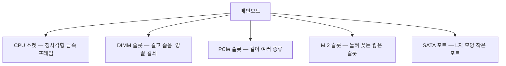
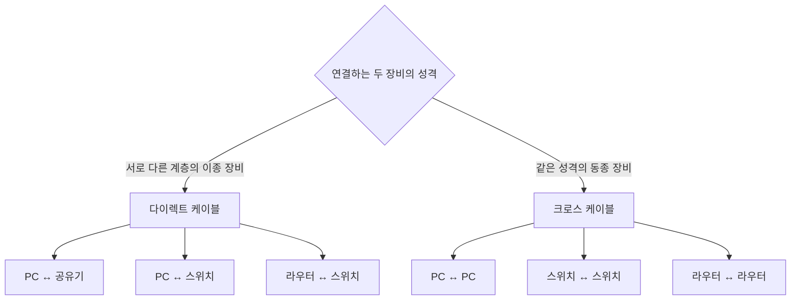

<Callout type="info">
  **이번 문서의 목표:** 이 파일을 다 읽으면 메인보드 위의 모든 슬롯과 케이블을 방향까지 정확히 구분할 수 있고, 실기 작업형에서 출제되는 T568B 다이렉트 케이블을 8핀 순서 그대로 제작해 압착·검사까지 끝낼 수 있습니다.
</Callout>

## 왜 슬롯과 커넥터부터인가

조립 실수의 거의 전부는 "**꽂을 곳을 착각했거나, 방향을 뒤집었거나, 끝까지 안 꽂았거나**" 셋 중 하나입니다. 개념을 몰라서 생기는 사고보다, 생김새를 구분하지 못해서 생기는 사고가 압도적으로 많습니다.

그리고 실기 시험에서 가장 확실한 배점 덩어리인 **LAN 케이블 제작**도 결국 커넥터 이야기입니다. RJ-45 잭이라는 커넥터 안에 여덟 가닥의 구리선을 정해진 순서로 밀어 넣는 작업이기 때문입니다.

> **쉽게 말하면:** 이번 편은 "PC 안팎의 구멍과 꽂이"를 전부 식별하고, 그중 하나인 RJ-45를 손으로 만드는 훈련입니다.

## 1. 정전기 대책 — 작업 시작 전 필수 절차

부품을 만지기 전에 이 항목부터 다룹니다. 순서를 바꾸면 안 되는 이유가 있습니다.

**ESD**(Electro-Static Discharge, 정전기 방전)는 사람 몸에 쌓인 정전기가 순간적으로 부품에 흘러 들어가는 현상입니다. 겨울에 문고리를 잡다가 따끔한 그 현상인데, 사람이 따끔함을 느끼려면 대략 3000볼트가 필요한 반면 **반도체는 수십에서 수백 볼트만으로도 손상**될 수 있습니다.

여기서 중요한 것은 손상이 두 종류라는 점입니다.

- **즉시 고장**(catastrophic failure): 바로 죽습니다. 원인을 알기 쉽습니다.
- **잠재 고장**(latent failure): 지금은 동작하는데 내부가 약해져 며칠 뒤 무작위로 죽습니다. **원인 추적이 거의 불가능**합니다.

정전기가 무서운 이유는 두 번째입니다. "만졌는데 잘 되던데요"는 안전의 근거가 되지 못합니다.

<Steps>

### 작업 전원을 완전히 차단한다

파워 서플라이의 스위치를 `O` 쪽으로 내리고, 콘센트에서 전원 케이블을 뽑습니다. 그 뒤 케이스 전원 버튼을 3초 이상 눌러 **잔류 전하를 방전**시킵니다. 메인보드에는 전원을 꺼도 대기 전력이 남아 있어, 이 과정을 생략하면 부품이 손상될 수 있습니다.

### 접지된 금속에 손을 댄다

전원 케이블을 뽑은 케이스의 도색되지 않은 금속 프레임을 맨손으로 몇 초간 잡습니다. 몸에 쌓인 전하를 넓은 금속으로 흘려보내 전위를 맞추는 것입니다.

### 손목 접지대를 착용한다

**손목 접지대**(anti-static wrist strap)를 손목에 밀착시키고 악어클립을 케이스 금속에 물립니다. 밀착이 중요합니다 — 피부에 닿지 않으면 아무 효과가 없습니다.

### 부품은 가장자리만 잡는다

메모리는 옆면, 그래픽카드는 브래킷과 기판 가장자리, CPU는 옆면을 잡습니다. **금색 접점과 핀은 절대 만지지 않습니다.**

### 정전기 방지 봉투 위에 놓지 않는다

부품을 꺼낸 뒤 그 은색 봉투 **위에** 올려놓는 것은 잘못된 습관입니다. 봉투는 바깥면이 전도성이라 통전 경로가 될 수 있습니다. 봉투 **안**에 넣어 보관하고, 작업대에는 정전기 방지 매트를 씁니다.

</Steps>

<Callout type="warning">
  **실기 감점 포인트:** 작업형·조립형 채점에서 손목 접지대 미착용, 전원 케이블을 뽑지 않은 상태의 작업, 카펫 위 작업 같은 항목이 안전 감점으로 잡힐 수 있습니다. 실제 조립보다 **절차를 소리 내어 확인하는 습관**이 점수를 지킵니다.
</Callout>

## 2. 메인보드의 슬롯 — 생김새로 구분하기

슬롯(slot)은 카드나 모듈을 세워 꽂는 긴 홈입니다. 메인보드에는 성격이 다른 슬롯이 여러 종류 있고, 서로 물리적으로 호환되지 않도록 **홈(notch, 노치)의 위치**가 다르게 설계되어 있습니다.

### DIMM 슬롯 — 메모리 자리

**DIMM**(Dual In-line Memory Module, 양면 인라인 메모리 모듈)은 기판 양면에 접점이 있는 메모리 모듈을 말합니다. Dual(양쪽) + In-line(일렬로) + Memory Module이므로, 이름이 곧 "양면에 접점이 일렬로 난 메모리 판"입니다.

슬롯의 결정적 특징은 **노치 위치**입니다. 메모리 접점 중간에 파인 홈이 하나 있고, 슬롯 안에도 대응하는 돌기가 있습니다. 세대마다 이 위치가 다릅니다.

| 세대 | 노치 위치 | 핀 수(데스크톱 DIMM) | 동작 전압 |
|------|-----------|----------------------|-----------|
| DDR3 | 중앙에서 약간 왼쪽 | 240핀 | 1.5V |
| DDR4 | DDR3보다 더 중앙 쪽 | 288핀 | 1.2V |
| DDR5 | DDR4와 또 다른 위치 | 288핀 | 1.1V |

DDR4와 DDR5는 핀 수가 같은데도 서로 꽂히지 않습니다. 노치 위치가 다르기 때문입니다. 즉 **핀 수는 호환의 근거가 되지 못하고, 노치가 진짜 열쇠**입니다.

<Callout type="warning">
  **실수 포인트:** 메모리가 잘 안 들어갈 때 힘으로 누르는 것. 방향이 맞으면 적당한 힘으로 양끝이 딸깍 소리와 함께 걸립니다. 안 들어가면 **뒤집어 보는 것이 먼저**입니다.
</Callout>

### PCIe 슬롯 — 확장 카드 자리

**PCIe**(Peripheral Component Interconnect Express)는 그래픽카드·확장 카드·NVMe SSD가 쓰는 통로입니다. 슬롯 길이는 **레인**(lane, 차선) 수에 따라 달라집니다.

| 표기 | 읽는 법 | 레인 수 | 슬롯 길이 | 주 용도 |
|------|---------|---------|-----------|---------|
| `x1` | 바이 원 | 1 | 가장 짧음 | 사운드·랜 카드 |
| `x4` | 바이 포 | 4 | 짧음 | NVMe 확장 카드 |
| `x8` | 바이 에이트 | 8 | 중간 | 보조 그래픽 |
| `x16` | 바이 식스틴 | 16 | 가장 긺 | 메인 그래픽카드 |

레인은 차선 비유가 정확합니다. 1차선 도로보다 16차선 도로가 같은 시간에 더 많은 차를 보내듯, 레인이 많을수록 대역폭이 큽니다.

여기서 실기가 좋아하는 함정이 있습니다. **물리적 길이와 실제 레인 수는 다를 수 있습니다.** `x16` 길이의 슬롯이지만 내부는 `x4` 로만 연결된 경우가 흔합니다. 그래서 그래픽카드는 반드시 **CPU에 가장 가까운 첫 번째 긴 슬롯**에 꽂습니다. 이 자리가 보통 진짜 `x16` 입니다.

### M.2 슬롯 — 눕혀 꽂는 저장장치 자리

**M.2**(엠 닷 투)는 카드를 세우지 않고 보드에 눕혀 꽂는 소형 슬롯입니다. 여기서 두 가지를 구분해야 합니다.

- **키**(key, 노치 모양): M키(M key)는 PCIe/NVMe용, B키는 SATA용, B+M 양쪽 노치는 두 방식 모두 대응.
- **길이 규격**: `2280` 이면 폭 22mm × 길이 80mm. 앞 두 자리가 폭, 뒤가 길이입니다.

M.2 슬롯에 꽂았는데 인식이 안 되는 사고의 대부분은 **M.2 SATA 모듈을 NVMe 전용 슬롯에 꽂았거나, 그 반대**입니다. 06편에서 진단 절차를 다룹니다.

### SATA 포트 — 데이터 케이블 자리

**SATA**(Serial ATA, 직렬 ATA)는 저장장치용 인터페이스입니다. 포트가 **L자 모양**으로 파여 있어 한 방향으로만 들어갑니다. 이 L자 홈이 오삽입 방지 장치입니다.

## 3. 케이블과 커넥터 — 오삽입을 막는 규칙

### 전원 케이블 세 종류

| 커넥터 | 핀 수 | 대상 | 구별법 |
|--------|-------|------|--------|
| 메인 전원 | 24핀 (20+4) | 메인보드 | 가장 넓고 걸쇠가 하나 |
| CPU 보조 | 8핀 (4+4) | CPU 소켓 근처 | 사각 구멍과 육각 구멍이 **각각 4개씩** |
| PCIe 보조 | 8핀 (6+2) | 그래픽카드 | 육각 구멍이 더 많음, 케이블에 PCI-E 각인 |

CPU 8핀과 PCIe 8핀은 **같은 8핀인데 절대 바꿔 꽂으면 안 됩니다.** 억지로 꽂으면 전압 배치가 달라 부품이 손상될 수 있습니다. 구별의 가장 확실한 방법은 두 가지입니다.

1. 커넥터 옆면의 각인을 읽습니다 — `CPU`, `EPS`, `PCI-E` 중 하나가 적혀 있습니다.
2. 구멍 단면 모양을 봅니다 — CPU용은 정사각형 4개와 모서리가 깎인 것 4개가 대칭으로 배열됩니다.

### 데이터 케이블

- **SATA 데이터 케이블**: 폭이 좁고 L자 단자. 한쪽이 90도로 꺾인 형태도 있으며, 케이스 안 공간이 좁을 때 씁니다. 걸쇠(latch)가 있는 제품은 뽑을 때 걸쇠를 누르지 않으면 포트가 부러집니다.
- **전면 패널 케이블**: 케이스 전원 버튼·리셋 버튼·전원 LED·HDD LED가 각각 얇은 2핀 선으로 나옵니다. 메인보드의 F_PANEL 헤더에 꽂습니다. **버튼(스위치)은 방향이 없고, LED는 방향이 있습니다.** LED는 극성이 있어 반대로 꽂으면 불이 안 들어옵니다 — 고장이 아니라 방향 문제입니다. 보통 색이 있는 선이 `+`, 흰색·검은색 선이 `-` 입니다.

<Callout type="warning">
  **감점 포인트:** 전면 패널 LED가 안 들어오는데 "메인보드 불량"으로 진단하는 것. 실기 진단형에서 자주 나오는 함정이며, 정답은 **극성 반대 결선**입니다.
</Callout>

## 4. LAN 케이블 제작 — 실기 작업형의 본체

이제 이번 편의 하이라이트입니다. 실기에서는 지참한 LAN Tool과 UTP 케이블, RJ-45 잭으로 지정 규격의 케이블을 제작해 제출합니다.

### 먼저 개념 — UTP, RJ-45, T568

**UTP**(Unshielded Twisted Pair, 비차폐 꼬임쌍선)는 두 가닥씩 꼬아 만든 네 쌍, 총 여덟 가닥의 구리선을 하나의 피복으로 감싼 케이블입니다.

왜 꼬여 있을까요? 두 선을 꼬면 외부에서 들어오는 전자기 잡음이 두 선에 **거의 똑같이** 실립니다. 수신 쪽에서 두 선의 전압 차이만 읽으면 공통으로 들어온 잡음은 상쇄되어 사라집니다. 이 방식을 차동 신호(differential signaling)라고 합니다. Unshielded(비차폐)는 별도의 금속 차폐막이 없다는 뜻이고, 차폐막이 있는 것은 STP(Shielded Twisted Pair)입니다.

**RJ-45**(Registered Jack 45)는 이 여덟 가닥을 물리는 8핀 커넥터입니다. 전화선용 RJ-11은 6핀이라 더 좁습니다.

**T568A와 T568B**는 여덟 가닥을 어떤 순서로 배열할지 정한 **배선 규격**입니다. 미국 통신산업협회(TIA/EIA)가 정했으며, 실기에서는 대부분 **T568B**를 지정합니다.

### T568B 8핀 배선 순서 — 반드시 암기

RJ-45 잭의 **걸쇠(클립)를 아래로 두고, 접점이 보이는 쪽을 정면으로** 향하게 잡았을 때 왼쪽부터 1번입니다.

| 핀 번호 | T568B 색 | 영문 표기 | 신호 역할(10/100Mbps 기준) |
|---------|----------|-----------|-----------------------------|
| 1 | 주황흰색 | Orange/White | 송신 `+` (TX+) |
| 2 | 주황 | Orange | 송신 `-` (TX-) |
| 3 | 초록흰색 | Green/White | 수신 `+` (RX+) |
| 4 | 파랑 | Blue | 미사용 |
| 5 | 파랑흰색 | Blue/White | 미사용 |
| 6 | 초록 | Green | 수신 `-` (RX-) |
| 7 | 갈색흰색 | Brown/White | 미사용 |
| 8 | 갈색 | Brown | 미사용 |

암기용 리듬은 "**주흰–주–초흰–파–파흰–초–갈흰–갈**"입니다. 여덟 글자를 소리 내어 열 번 읽으면 손이 먼저 기억합니다.

여기서 반드시 이해해야 할 두 가지 규칙이 있습니다.

**규칙 ①: 흰색이 먼저 온다.** 각 쌍은 언제나 "흰색 섞인 선 → 단색 선" 순서입니다. 주황흰색 다음 주황, 초록흰색 다음 초록. 예외처럼 보이는 것이 파랑 쌍인데, 4번이 파랑, 5번이 파랑흰색으로 **순서가 뒤집혀** 있습니다. 이 한 곳이 틀리기 쉬운 지점입니다.

**규칙 ②: 초록 쌍이 3번과 6번으로 갈라진다.** 초록흰색은 3번, 초록은 6번입니다. 사이에 파랑 쌍이 끼어듭니다. 이 구조는 우연이 아니라 **1·2번과 3·6번이 각각 송신·수신 쌍이 되도록** 설계된 결과입니다. 신호를 주고받는 쌍은 반드시 꼬인 한 쌍이어야 잡음이 상쇄되므로, 초록 쌍을 3번과 6번으로 벌려 놓은 것입니다.

T568A는 T568B에서 **주황 쌍과 초록 쌍만 서로 맞바꾼** 것입니다.

| 핀 | T568A | T568B |
|----|-------|-------|
| 1 | 초록흰색 | 주황흰색 |
| 2 | 초록 | 주황 |
| 3 | 주황흰색 | 초록흰색 |
| 4 | 파랑 | 파랑 |
| 5 | 파랑흰색 | 파랑흰색 |
| 6 | 주황 | 초록 |
| 7 | 갈색흰색 | 갈색흰색 |
| 8 | 갈색 | 갈색 |

### 다이렉트 케이블과 크로스 케이블

- **다이렉트 케이블**(Direct, Straight-through): 양쪽 끝을 **같은 규격**으로 만든 것. T568B–T568B.
- **크로스 케이블**(Cross-over): 한쪽은 T568A, 반대쪽은 T568B로 만든 것.

언제 무엇을 쓰는지는 **연결하는 두 장비가 같은 성격인가**로 판단합니다.

원리는 단순합니다. PC는 1·2번으로 **송신**하고 3·6번으로 **수신**합니다. 스위치나 공유기 같은 중계 장비는 반대로 1·2번으로 수신하고 3·6번으로 송신하도록 만들어져 있습니다. 그래서 PC와 공유기를 이을 때는 선을 곧게 이어도 송신이 상대의 수신으로 들어갑니다 — 다이렉트면 됩니다.

반면 PC 두 대를 직접 이으면 양쪽 다 1·2번으로 송신하려 하므로 신호가 부딪힙니다. 그래서 케이블 안에서 선을 교차시켜 한쪽의 1·2번이 반대쪽의 3·6번에 닿게 만든 것이 크로스 케이블입니다.

<Callout type="warning">
  **실기 판단 기준:** 문제에 "PC와 공유기를 연결하는 케이블"이라고 나오면 정답은 **다이렉트 케이블**이며, "T568B 규격 사용"이라는 조건이 붙으면 **양쪽 모두 T568B**로 제작합니다. 최근 장비는 자동 감지(Auto MDI-X)로 두 케이블을 가리지 않지만, 시험은 규격 기준으로 채점하므로 자동 감지를 근거로 답하면 안 됩니다.
</Callout>

### 제작 절차

<Steps>

### 피복을 벗긴다

LAN Tool의 탈피 날에 케이블을 넣고 한 바퀴 돌린 뒤 잡아당겨 바깥 피복만 약 `25~30mm` 벗깁니다. **속선 여덟 가닥의 피복까지 벗기면 안 됩니다.** 속선 피복이 상하면 그 가닥은 접촉 불량이 되거나 합선됩니다.

### 꼬임을 풀고 색 순서로 정렬한다

네 쌍의 꼬임을 풀어 T568B 순서(주흰–주–초흰–파–파흰–초–갈흰–갈)로 나란히 폅니다. 손가락으로 눌러 여덟 가닥을 완전히 평평하게 만듭니다. 한 가닥이라도 겹쳐 있으면 잭에 밀어 넣을 때 순서가 어긋납니다.

### 끝을 일직선으로 자른다

정렬한 상태에서 커터 날로 여덟 가닥 끝을 **한 번에 직각으로** 자릅니다. 이때 벗긴 길이가 약 `14mm` 정도 남게 합니다. 이 길이가 핵심입니다 — 너무 길면 피복이 잭 안에 물리지 않고, 너무 짧으면 심선이 잭 끝의 금속 날에 닿지 않습니다.

### 잭에 밀어 넣는다

RJ-45 잭의 걸쇠를 아래로 향하게 잡고, 정렬한 여덟 가닥을 한 번에 밀어 넣습니다. 잭의 투명한 앞쪽 끝에서 **여덟 가닥 구리선이 모두 보이는지** 확인합니다. 동시에 **바깥 피복이 잭 안쪽 턱까지 들어갔는지**도 확인합니다. 이 두 가지가 동시에 만족되어야 합니다.

### 압착한다

잭을 LAN Tool의 8P 자리에 끝까지 넣고 손잡이를 **한 번에 끝까지** 눌러 압착합니다. 압착하면 잭 안의 금속 날이 속선 피복을 뚫고 구리에 닿고(이 방식을 IDC, Insulation Displacement Contact라 합니다), 동시에 뒤쪽 턱이 바깥 피복을 물어 고정합니다. 어중간하게 누르다 놓으면 접촉 불량이 됩니다.

### 반대쪽도 같은 규격으로 제작한다

다이렉트 케이블이므로 반대쪽도 T568B 순서 그대로 반복합니다.

### 검사한다

**LAN 테스터**에 양 끝을 꽂고 전원을 켭니다. 송신부와 수신부의 LED가 `1→2→3→4→5→6→7→8` 순서로 **동시에 짝을 맞춰** 점등하면 정상입니다.

</Steps>

### 테스터 결과 읽기 — 증상별 원인

| 테스터 증상 | 원인 | 조치 |
|-------------|------|------|
| 특정 번호만 점등 안 됨 | 그 가닥이 잭 끝까지 안 들어감 | 잭을 잘라내고 재제작 |
| 번호 순서가 뒤바뀜(예: 3과 6 교차) | 배선 순서 오류 | 재제작 |
| 두 번호가 동시에 점등 | 심선 피복 손상으로 인한 합선 | 재제작 |
| 전부 점등 안 됨 | 압착 실패 또는 케이블 단선 | 압착 상태 확인 후 재제작 |

RJ-45 잭은 한 번 압착하면 **재사용이 불가능**합니다. 실패했으면 잭 부분을 잘라내고 새 잭으로 다시 만듭니다. 그래서 시험장에서는 여분 잭의 개수를 먼저 확인하고, 한 번에 성공한다는 마음으로 정렬 단계에 시간을 씁니다.

### 자주 하는 실수 다섯 가지

1. **파랑과 파랑흰색 순서를 뒤집음** — 4번이 파랑(단색), 5번이 파랑흰색입니다. 유일하게 흰색이 뒤에 오는 쌍입니다.
2. **속선 피복까지 벗김** — 겉 피복만 벗깁니다.
3. **자른 길이가 너무 김** — 겉 피복이 잭 안에 안 물려 잡아당기면 빠집니다.
4. **압착 전에 확인하지 않음** — 잭 앞쪽 투명부에서 여덟 가닥 색 순서를 눈으로 읽고 나서 압착합니다.
5. **한쪽만 T568B, 반대쪽을 무심코 T568A로** — 색 순서를 외운 사람이 오히려 손버릇으로 저지르는 실수입니다.

## 핵심 정리

- 부품을 만지기 전에 전원 차단 → 잔류 전하 방전 → 접지 → 손목 접지대 순서를 지키며, 정전기 손상에는 며칠 뒤 나타나는 잠재 고장도 있습니다.
- 슬롯은 노치 위치로 구분되며 DDR4와 DDR5는 핀 수가 같아도 서로 꽂히지 않습니다.
- CPU 8핀과 PCIe 6+2핀은 각인과 구멍 모양으로 구별하고 절대 바꿔 꽂지 않습니다.
- T568B 순서는 **주황흰색–주황–초록흰색–파랑–파랑흰색–초록–갈색흰색–갈색**이며, 4·5번만 흰색이 뒤에 옵니다.
- PC와 공유기처럼 서로 다른 성격의 장비를 이을 때는 양쪽 모두 같은 규격인 다이렉트 케이블을 만듭니다.

## 마무리 복습

<Quiz
  questionNumber={1}
  question="T568B 규격에서 4번과 5번 핀의 색 순서로 옳은 것은?"
  options={['4번 파랑흰색, 5번 파랑', '4번 파랑, 5번 파랑흰색', '4번 초록흰색, 5번 초록', '4번 갈색, 5번 갈색흰색']}
  correctAnswer={2}
  explanation="T568B에서 파랑 쌍만 단색이 먼저 오며 4번이 파랑, 5번이 파랑흰색입니다. 나머지 쌍은 모두 흰색 섞인 선이 앞에 옵니다."
  optionExplanations={['파랑 쌍은 단색이 먼저 오므로 순서가 반대입니다', '파랑 쌍은 유일하게 단색이 앞에 오는 쌍입니다', '초록흰색은 3번이고 초록은 6번으로 갈라집니다', '갈색흰색이 7번, 갈색이 8번입니다']}
/>

<Quiz
  questionNumber={2}
  question="PC와 공유기를 연결하는 LAN 케이블을 T568B 규격으로 제작하라는 지시가 있을 때 올바른 제작 방식은?"
  options={['한쪽은 T568A, 반대쪽은 T568B로 제작한다', '양쪽 모두 T568B로 제작한다', '양쪽 모두 T568A로 제작한다', '한쪽만 결선하고 반대쪽은 비워 둔다']}
  correctAnswer={2}
  explanation="PC와 공유기는 서로 다른 성격의 장비이므로 다이렉트 케이블을 사용하며, 규격이 T568B로 지정되었으므로 양쪽 모두 T568B로 제작합니다."
  optionExplanations={['양쪽 규격이 다르면 크로스 케이블이 되어 조건과 다릅니다', '다이렉트 케이블은 양쪽 규격이 동일하며 지정 규격은 T568B입니다', '지정 규격이 T568B이므로 T568A로 만들면 안 됩니다', '여덟 가닥을 모두 결선해야 정상 제작입니다']}
/>

<Quiz
  questionNumber={3}
  question="T568B에서 초록흰색과 초록이 연속되지 않고 3번과 6번으로 나뉘어 배치된 이유는?"
  options={['색상 배열을 보기 좋게 하려고', '송신과 수신에 쓰이는 1과 2번, 3과 6번이 각각 꼬인 한 쌍이 되도록 하기 위해', '커넥터 제작이 쉬워지기 때문에', '전원 공급 경로를 확보하기 위해']}
  correctAnswer={2}
  explanation="1과 2번은 송신, 3과 6번은 수신 쌍입니다. 잡음 상쇄를 위해 신호 쌍은 반드시 꼬인 한 쌍이어야 하므로 초록 쌍을 3번과 6번에 배치했습니다."
  optionExplanations={['미관과는 무관한 전기적 설계입니다', '신호 쌍을 꼬인 쌍으로 유지해 잡음을 상쇄하기 위한 배치입니다', '제작 난이도와는 관계가 없습니다', 'UTP의 이 배선에서 전원 공급은 고려 대상이 아닙니다']}
/>

<Quiz
  questionNumber={4}
  question="LAN 케이블 압착 후 테스터에서 3번과 6번의 점등 순서가 서로 바뀌어 나타났다면 가장 유력한 원인은?"
  options={['압착이 약해서', '한쪽 커넥터의 배선 순서를 잘못 넣어서', '케이블 길이가 너무 길어서', '테스터 배터리가 부족해서']}
  correctAnswer={2}
  explanation="특정 번호가 교차되어 점등하는 것은 심선의 배열 순서가 규격과 다르게 삽입되었다는 뜻이며, 커넥터를 잘라내고 재제작해야 합니다."
  optionExplanations={['압착 불량은 점등 자체가 안 되는 형태로 나타납니다', '번호 교차는 전형적인 배선 순서 오류 증상입니다', '길이는 순서 교차와 무관합니다', '배터리 부족은 전체 점등 불량으로 나타납니다']}
/>

<Quiz
  questionNumber={5}
  question="부품을 만지기 전 정전기 대책 절차로 옳지 않은 것은?"
  options={['전원 케이블을 뽑고 전원 버튼을 눌러 잔류 전하를 방전한다', '손목 접지대를 피부에 밀착시키고 케이스 금속에 물린다', '부품을 정전기 방지 봉투 바깥면 위에 올려놓고 작업한다', '부품은 접점을 피해 가장자리를 잡는다']}
  correctAnswer={3}
  explanation="정전기 방지 봉투의 바깥면은 전도성이 있어 통전 경로가 될 수 있으므로 부품을 그 위에 올려놓으면 안 됩니다. 봉투 안에 넣어 보관하고 작업대에는 방지 매트를 사용합니다."
  optionExplanations={['대기 전력을 빼는 올바른 절차입니다', '밀착과 접지가 손목 접지대 사용의 핵심입니다', '봉투 바깥면은 전도성이라 부품을 올려두면 위험합니다', '접점 보호를 위한 올바른 파지법입니다']}
/>

<Quiz
  questionNumber={6}
  question="DDR4와 DDR5 메모리가 핀 수가 같은데도 서로 다른 슬롯에만 장착되는 이유는?"
  options={['접점 재질이 다르기 때문', '모듈 중앙의 노치 위치가 다르기 때문', '길이가 다르기 때문', '동작 전압이 같기 때문']}
  correctAnswer={2}
  explanation="DDR4와 DDR5는 모두 288핀이지만 모듈 중앙의 노치 위치가 달라 물리적으로 호환되지 않습니다. 핀 수는 호환 판단 기준이 되지 못합니다."
  optionExplanations={['재질은 삽입 가능 여부를 결정하지 않습니다', '노치 위치 차이가 세대 간 오삽입을 막는 장치입니다', '모듈 길이는 두 세대가 사실상 같습니다', '전압은 오히려 서로 다르며 삽입 가능 여부와 직접 관련이 없습니다']}
/>

<Quiz
  questionNumber={7}
  question="케이스 전면 패널의 전원 LED에 불이 들어오지 않을 때 가장 먼저 점검해야 할 것은?"
  options={['메인보드 교체 여부', 'LED 커넥터의 극성이 반대로 꽂혔는지 여부', 'CPU 쿨러 회전 여부', 'RAM 용량']}
  correctAnswer={2}
  explanation="LED는 극성이 있어 반대로 꽂으면 점등하지 않습니다. 스위치는 극성이 없지만 LED는 방향을 지켜야 하며, 보통 색이 있는 선이 플러스입니다."
  optionExplanations={['부품 교체는 마지막에 검토할 사항입니다', '극성 반대 결선이 가장 흔한 원인입니다', '쿨러 회전은 LED 점등과 직접 관련이 없습니다', 'RAM 용량은 LED 점등과 무관합니다']}
/>

<Quiz
  questionNumber={8}
  question="RJ-45 잭에 심선을 삽입한 뒤 압착 직전에 반드시 눈으로 확인해야 할 두 가지는?"
  options={['잭의 색상과 케이블 길이', '여덟 가닥이 잭 끝까지 닿았는지와 바깥 피복이 잭 안쪽까지 물렸는지', '테스터 배터리 잔량과 공구 상태', '케이블 브랜드와 카테고리 표기']}
  correctAnswer={2}
  explanation="심선이 잭 끝의 금속 날에 닿아야 접촉이 되고, 바깥 피복이 잭 안쪽 턱에 물려야 잡아당겨도 빠지지 않습니다. 두 조건이 동시에 만족되어야 합니다."
  optionExplanations={['색상과 전체 길이는 압착 품질과 무관합니다', '접촉과 고정 두 조건을 동시에 확인하는 것이 핵심입니다', '공구 상태는 압착 전 확인 항목이 아닙니다', '표기는 제작 품질과 직접 관련이 없습니다']}
/>

## 참고 자료

- [한국정보통신자격협회 - PC정비사 2급](https://www.icqa.or.kr/cn/page/pc)
- [Intel - Supported Memory and Memory Population Rules for the Intel Server Board S2600WF](https://www.intel.com/content/www/us/en/support/articles/000055509/server-products/server-boards.html)
- [Intel - How to Choose RAM for a Gaming PC](https://www.intel.com/content/www/us/en/gaming/resources/how-much-ram-gaming.html)
