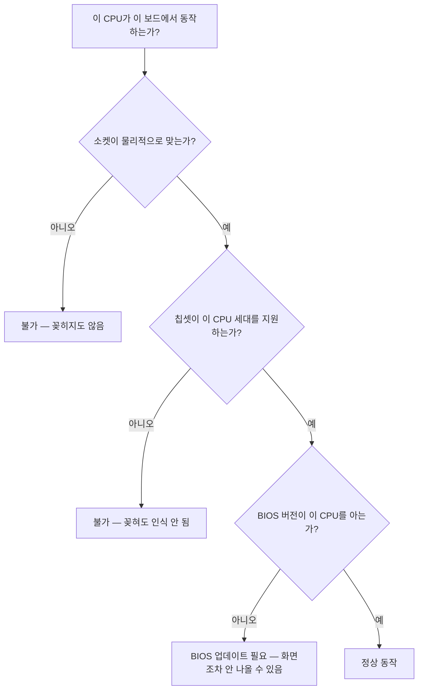
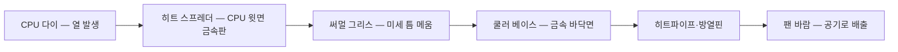

<Callout type="info">
  **이번 문서의 목표:** 이 파일을 다 읽으면 CPU와 메인보드의 호환 여부를 소켓·칩셋·BIOS 버전 세 축으로 판정할 수 있고, 실기 BIOS 에뮬레이터 문항에서 요구하는 항목을 정확한 메뉴 경로에서 찾아 지정된 값으로 바꾼 뒤 저장까지 마칠 수 있습니다.
</Callout>

## 호환성이란 결국 세 가지 질문이다

CPU를 메인보드에 꽂을 수 있는가는 하나의 질문이 아니라 세 개의 질문입니다.

세 관문을 순서대로 통과해야 합니다. 실기 서술·선택형에서 "꽂았는데 부팅이 안 됩니다, 원인은?"이라는 문제가 나오면 이 세 관문 중 어디서 막혔는지를 묻는 것입니다.

> **쉽게 말하면:** 소켓은 몸이 들어가는지, 칩셋은 말이 통하는지, BIOS는 이름을 아는지를 묻는 관문입니다.

## 1. 소켓 — 물리적 관문

**소켓**(socket)은 CPU를 꽂는 자리입니다. 이름에 붙은 숫자가 대체로 접점 수를 뜻합니다.

| 진영 | 소켓 이름 | 접점 수 | 방식 | 대응 메모리 |
|------|-----------|---------|------|-------------|
| 인텔 | LGA1151 | 1151 | LGA | DDR4 |
| 인텔 | LGA1200 | 1200 | LGA | DDR4 |
| 인텔 | LGA1700 | 1700 | LGA | DDR4 또는 DDR5 |
| AMD | AM4 | 1331 | PGA | DDR4 |
| AMD | AM5 | 1718 | LGA | DDR5 |

여기서 실기가 좋아하는 지점은 **LGA1700이 DDR4 보드와 DDR5 보드로 갈린다**는 사실입니다. 같은 CPU를 써도 보드가 DDR4용이면 DDR5 메모리는 절대 꽂히지 않습니다. 메모리 호환은 CPU가 아니라 **보드의 DIMM 슬롯 규격**이 결정합니다.

### CPU 장착 방향 — 삼각형 표시

CPU에는 한쪽 모서리에 작은 **삼각형(▲) 각인**이 있고, 소켓에도 같은 표시가 있습니다. 두 삼각형을 맞추면 방향이 맞습니다. LGA 방식은 소켓 양옆의 홈(키)에 CPU 옆면의 돌출부가 맞아 떨어져야 자연스럽게 안착합니다.

<Callout type="warning">
  **치명적 실수:** CPU를 힘으로 누르는 것. LGA에서 CPU는 **얹기만 하면** 되고, 고정은 레버와 브래킷이 합니다. 방향이 틀린 상태로 레버를 내리면 소켓 핀 수십 개가 한 번에 휩니다. 소켓 핀은 사실상 수리 불가이며 메인보드 폐기로 이어집니다.
</Callout>

## 2. 칩셋 — 기능을 결정하는 관문

**칩셋**(chipset)은 CPU와 주변 장치 사이의 신호를 중계하는 칩입니다. 예전에는 노스브리지(North Bridge, 메모리·그래픽 담당)와 사우스브리지(South Bridge, 저장장치·USB 담당) 두 칩으로 나뉘어 있었지만, 지금은 메모리 컨트롤러와 PCIe 컨트롤러가 CPU 안으로 들어가면서 **칩셋은 사실상 사우스브리지 역할**만 남았습니다.

칩셋이 결정하는 것은 대략 이렇습니다.

| 칩셋이 정하는 것 | 예시 |
|------------------|------|
| 지원 CPU 세대 | 특정 세대만 인식 |
| 오버클럭 허용 여부 | 인텔의 Z 계열, AMD의 X·B 계열은 허용 |
| PCIe 레인 개수 | 확장 카드를 몇 개 꽂을 수 있는가 |
| SATA·USB 포트 개수 | 저장장치·주변기기 수용량 |
| 메모리 속도 상한 | 특정 속도 이상 지원 여부 |

인텔 칩셋의 알파벳 규칙은 외워 둘 만합니다 — `Z`(최상위, 오버클럭 가능), `B`(보급형 사무용), `H`(중급), `Q`(기업용 관리 기능). AMD는 `X`(최상위), `B`(중급), `A`(보급형)입니다.

## 3. BIOS 버전 — 이름을 아는가의 관문

**BIOS**(Basic Input/Output System, 기본 입출력 시스템)는 메인보드에 내장된 펌웨어입니다. Basic(기본) + Input/Output(입출력) + System이므로, 이름이 곧 "부팅에 필요한 최소한의 입출력 담당 프로그램"입니다. 전원을 켜면 운영체제보다 먼저 실행되어 부품을 확인하고 부팅 장치에 제어를 넘깁니다.

**UEFI**(Unified Extensible Firmware Interface, 통합 확장 펌웨어 인터페이스)는 BIOS를 대체하는 현대적 규격입니다. 이름을 쪼개면 Unified(통합된) + Extensible(확장 가능한) + Firmware Interface(펌웨어 접점)입니다.

UEFI가 기존 BIOS보다 나은 점은 실기 선택형에 그대로 출제됩니다.

| UEFI의 특징 | 설명 | 참·거짓 |
|-------------|------|---------|
| 부팅 속도가 빠르다 | 초기화 절차가 병렬화·간소화됨 | 참 |
| 마우스로 직관적 설정 | 그래픽 인터페이스 제공 | 참 |
| 2.2TB 이상 디스크 지원 | GPT 파티션 방식과 결합 | 참 |
| 시큐어 부트로 악성코드 차단 | 서명된 부트로더만 실행 | 참 |
| 네트워크 부팅(PXE) 지원 | 네트워크에서 OS 이미지를 받아 부팅 | 참 |
| 32비트 운영체제만 지원 | **거짓** — 64비트 시스템을 지원 | 거짓 |

`2.2TB` 라는 숫자가 어디서 나왔는지도 이해해 둡시다. 기존 **MBR**(Master Boot Record) 파티션 방식은 섹터 번호를 32비트로 표현합니다. 섹터 하나가 512바이트이므로 표현 가능한 최대 용량은 다음과 같습니다.

$$
2^{32} \times 512 \text{바이트} \approx 2.2 \times 10^{12} \text{바이트}
$$

- $2^{32}$ : 32비트로 셀 수 있는 섹터의 개수(약 43억 개)
- $512$ : 섹터 하나의 크기(바이트)

그래서 MBR은 약 2.2TB에서 막히고, 그 이상을 쓰려면 **GPT**(GUID Partition Table)와 UEFI 조합이 필요합니다. 자세한 파티션 이야기는 07편에서 다룹니다.

**PXE**(Preboot eXecution Environment, 사전 부팅 실행 환경)는 저장장치 없이 네트워크로 부팅 이미지를 받아 실행하는 기능입니다. 학교 실습실처럼 여러 대를 동일하게 관리할 때 씁니다.

## 4. BIOS 설정 화면 — 실기 에뮬레이터의 무대

여기서부터가 실기 득점 구간입니다. 시험에서는 실제 PC가 아니라 **BIOS 에뮬레이터** 화면이 뜨고, "특정 항목을 특정 값으로 설정하시오"라는 과제가 주어집니다.

### 진입과 저장 — 이 두 개를 모르면 아무것도 못 한다

<Steps>

### 설정 화면 진입

전원을 켠 직후 제조사 로고가 뜰 때 `Del` 키를 연타합니다. 노트북·일부 브랜드 PC는 `F2` 를 씁니다. 에뮬레이터 문항에서는 보통 이미 진입한 화면부터 시작합니다.

### 메뉴 이동

방향키로 상단 메뉴를 좌우로, 항목을 상하로 이동합니다. `Enter` 로 항목을 열고 값을 선택합니다. 구형 인터페이스에서는 `Page Up`, `Page Down` 또는 `+`, `-` 로 값을 바꿉니다.

### 저장 후 종료

`F10` 키를 누르면 "Save & Exit Setup" 확인 창이 뜹니다. 여기서 `Y` 를 입력하거나 `Yes` 를 선택해야 설정이 반영됩니다.

</Steps>

<Callout type="warning">
  **감점 포인트:** 값만 바꾸고 `F10` 저장을 하지 않는 것. BIOS 설정은 저장 시점에 **CMOS**(Complementary Metal-Oxide-Semiconductor, 설정값을 담는 소형 메모리)에 기록됩니다. 저장하지 않으면 설정은 사라집니다. 반대로 `Esc` 로 나가면 "Exit Without Saving"이 되어 전부 취소됩니다.
</Callout>

### 메뉴 구조 — 어디에 무엇이 있는가

전통적인 BIOS(어워드·AMI 계열)의 상위 메뉴는 대체로 다음과 같습니다. 실기 문항은 "이 항목이 어느 메뉴에 있는가"를 아는 것만으로 절반이 끝납니다.

| 메뉴 | 담당 영역 | 대표 항목 |
|------|-----------|-----------|
| Standard CMOS Features | 날짜·시간·드라이브 기본 정보 | Date, Time, IDE/SATA Channel |
| Advanced BIOS Features | 부팅과 캐시 관련 | Boot Sequence, `Video BIOS Cacheable`, Quick Power On Self Test |
| Advanced Chipset Features | 칩셋·메모리 세부 | Memory Timing, AGP/PCIe 설정 |
| Integrated Peripherals | 내장 장치 활성화 | Onboard LAN, Onboard Audio, USB Controller |
| Power Management Setup | 전원 관리 | ACPI Suspend Type, Wake on LAN |
| PnP/PCI Configurations | 자원 할당 | IRQ 할당, Plug and Play OS |
| PC Health Status | 온도·전압·팬 속도 감시 | CPU Temperature, CPU Fan Speed |
| Load Optimized Defaults | 권장 기본값 복원 | 설정 초기화 |
| Set Supervisor/User Password | 암호 설정 | 진입·부팅 암호 |

### 실기에 나오는 대표 항목들 — 값과 원리를 함께

에뮬레이터 문항은 항목 이름을 그대로 주고 `Enabled` 또는 `Disabled` 로 바꾸라고 합니다. 이름만 외우면 헷갈리므로, **그 항목이 무엇을 하는지**를 함께 익혀야 합니다.

| 항목 | 위치 | 하는 일 | 대표 지시 |
|------|------|---------|-----------|
| `Video BIOS Cacheable` | Advanced BIOS Features | 그래픽 카드의 비디오 BIOS ROM 내용을 RAM에 복사해 두고 읽어 속도를 높임 | 활성화 시 `Enabled` |
| `System BIOS Cacheable` | Advanced BIOS Features | 시스템 BIOS ROM을 RAM에 캐싱 | `Enabled` |
| `Quick Power On Self Test` | Advanced BIOS Features | POST 자체 검사 항목을 일부 건너뛰어 부팅을 빠르게 | `Enabled` |
| `Boot Sequence` / `Boot Option` | Advanced BIOS Features | 부팅을 시도할 장치 순서 지정 | 지정 장치를 1순위로 |
| `Numlock Status` | Advanced BIOS Features | 부팅 시 숫자 잠금 켬 여부 | `On` 또는 `Off` |
| `Onboard LAN Controller` | Integrated Peripherals | 메인보드 내장 랜 사용 여부 | `Enabled` 또는 `Disabled` |
| `USB Controller` | Integrated Peripherals | USB 컨트롤러 사용 여부 | `Enabled` |
| `Wake on LAN` | Power Management | 네트워크 신호로 원격 전원 켜기 | `Enabled` |
| `Secure Boot` | UEFI Boot 메뉴 | 서명된 부트로더만 실행 허용 | `Enabled` 또는 `Disabled` |
| `CSM` (Compatibility Support Module) | UEFI Boot 메뉴 | 레거시 BIOS 호환 부팅 지원 | 레거시 필요 시 `Enabled` |
| `Load Optimized Defaults` | 최상위 메뉴 | 제조사 권장값 복원 | 초기화 지시 시 실행 |

#### 캐싱 항목을 이해하는 법

`Video BIOS Cacheable` 을 예로 원리를 풀어 봅니다.

그래픽 카드에는 **비디오 BIOS**라는 작은 프로그램이 ROM(Read Only Memory, 읽기 전용 기억장치)에 들어 있습니다. 화면 초기화에 쓰이는 코드입니다. 그런데 ROM은 RAM보다 훨씬 느립니다. 그래서 부팅 초기에 이 ROM 내용을 통째로 RAM의 특정 구역에 복사해 두고, 이후에는 RAM에서 읽게 만드는 기능이 캐싱입니다.

**캐싱**(caching)이란 "느린 곳의 내용을 빠른 곳에 미리 복사해 두고 거기서 읽는 기법"입니다. 도서관 서고에서 책을 꺼내 오는 대신 자주 보는 책을 책상 위에 놓아두는 것과 같습니다.

따라서 문제가 "비디오 BIOS 캐시 기능을 활성화하시오"라고 하면, 정답은 다음과 같습니다.

- 위치: `Advanced BIOS Features` 메뉴
- 항목: `Video BIOS Cacheable`
- 값: `Enabled`
- 마무리: `F10` → `Y` 로 저장

자주 하는 실수는 두 가지입니다. 첫째, 이름이 비슷한 `System BIOS Cacheable` 을 바꾸는 것. 문제가 "비디오"라고 했으면 Video 쪽입니다. 둘째, 값을 바꾸고 저장하지 않는 것입니다.

#### 부팅 순서 항목

`Boot Sequence` 또는 최신 UEFI의 `Boot Option Priorities` 는 부팅을 시도할 장치의 순서를 정합니다. 실기에서는 "USB 저장장치로 먼저 부팅되게 하시오" 같은 형태로 나옵니다. 자세한 절차는 06편에서 다룹니다.

#### PC Health Status — 진단용 화면

`PC Health Status` 메뉴에는 CPU 온도, 시스템 온도, CPU 팬 회전수(RPM, Revolutions Per Minute, 분당 회전수), 각 전압(`+12V`, `+5V`, `+3.3V`) 실측값이 표시됩니다. 이 화면은 09편·12편의 진단에서 **부품 교체 없이 상태를 읽는 유일한 창**으로 다시 등장합니다.

## 5. 쿨러 체결 — 손 감각의 원칙

**쿨러**(cooler)는 CPU가 만든 열을 받아 공기 중으로 버리는 부품입니다. 열이 이동하는 경로를 따라가면 왜 절차가 그렇게 정해졌는지 이해됩니다.

### 써멀 그리스가 필요한 이유

CPU 윗면과 쿨러 바닥은 눈에는 평평해 보여도 미세하게 울퉁불퉁합니다. 그 틈에 공기가 갇히는데, **공기는 열을 아주 못 옮기는 물질**입니다. 그래서 공기보다 열을 잘 옮기는 물질로 틈을 메워야 하며, 그것이 **써멀 그리스**(thermal grease, 열전도 물질)입니다.

여기서 오해를 바로잡아야 합니다. 써멀 그리스는 금속보다 열전도가 **나쁩니다.** 그러므로 두껍게 바르면 오히려 나빠집니다. 목적은 "금속끼리 닿지 않는 미세한 틈만" 메우는 것이므로 **쌀알 한 톨 정도를 중앙에 올리고 쿨러 압력으로 퍼뜨리는 것**이 정석입니다.

### 체결 순서

<Steps>

### 기존 그리스를 제거한다

재조립이라면 CPU 윗면과 쿨러 바닥의 굳은 그리스를 부드러운 천으로 닦아냅니다.

### 그리스를 도포한다

CPU 히트 스프레더 중앙에 쌀알 크기로 올립니다. 굳이 펴 바를 필요는 없습니다.

### 쿨러를 수직으로 내려 놓는다

비스듬히 놓았다 세우면 그리스가 한쪽으로 몰립니다. 수직으로 내려 접촉시킵니다.

### 나사를 대각선 순서로 조인다

네 귀퉁이를 `1 → 3 → 2 → 4` 처럼 **대각선으로 번갈아** 조입니다. 한 쪽부터 끝까지 조이면 반대쪽이 뜨면서 접촉 압력이 한쪽으로 쏠려, 온도가 비정상적으로 오릅니다.

### 팬 전원을 CPU_FAN 헤더에 연결한다

메인보드에서 `CPU_FAN` 이라고 표기된 4핀 헤더에 꽂습니다. `SYS_FAN` 이나 `CHA_FAN` 에 꽂으면 BIOS가 CPU 팬이 없다고 판단해 부팅을 멈추고 경고를 띄울 수 있습니다.

</Steps>

<Callout type="warning">
  **실기 감점 포인트 정리:** ① 나사를 한쪽부터 끝까지 조임 ② 그리스를 과다 도포 ③ 팬 케이블을 CPU_FAN이 아닌 곳에 연결 ④ 나사 조임 누락으로 쿨러가 들뜸. 네 가지 모두 채점표의 개별 항목이 될 수 있습니다.
</Callout>

## 6. 증상으로 되짚기 — 호환·체결 문제의 신호

| 증상 | 유력 원인 | 확인 방법 |
|------|-----------|-----------|
| 전원은 들어오는데 화면 무출력, 비프음 없음 | BIOS가 CPU를 모름(구 버전) | 지원 CPU 목록·BIOS 버전 확인 |
| 부팅 직후 CPU Fan Error 경고 | 팬 케이블이 CPU_FAN에 없음 | 헤더 위치 확인 |
| 부팅 몇 초 뒤 자동 종료 | 쿨러 밀착 불량으로 과열 보호 동작 | BIOS PC Health Status에서 온도 확인 |
| CPU 온도가 유휴 상태에서 80도 이상 | 그리스 과다·나사 편중 조임 | 재체결 |
| 메모리가 안 꽂힘 | 보드 슬롯 규격 불일치 | 보드 사양에서 DDR 세대 확인 |

**비프음**(beep)은 메인보드 스피커가 내는 경고음으로, 화면이 나오지 않을 때 유일한 단서입니다. 09편에서 코드별 의미를 다룹니다.

## 핵심 정리

- CPU 호환은 소켓(물리) → 칩셋(지원 세대) → BIOS 버전(인식) 세 관문을 순서대로 통과해야 합니다.
- BIOS 설정은 `Del` 또는 `F2` 로 진입하고 반드시 `F10` 으로 저장해야 CMOS에 기록됩니다.
- `Video BIOS Cacheable` 은 Advanced BIOS Features에 있으며, 비디오 BIOS ROM을 RAM에 캐싱해 속도를 높이는 항목이므로 활성화 지시에는 `Enabled` 를 선택합니다.
- UEFI는 빠른 부팅, 마우스 인터페이스, 2.2TB 초과 디스크 지원, 시큐어 부트, PXE를 제공하며 64비트 시스템을 지원합니다.
- 쿨러는 그리스를 쌀알 크기로 올리고 나사를 대각선 순서로 조이며, 팬은 반드시 `CPU_FAN` 헤더에 연결합니다.

## 마무리 복습

<Quiz
  questionNumber={1}
  question="비디오 BIOS 캐시 기능을 활성화하라는 지시에 대한 올바른 설정은?"
  options={['System BIOS Cacheable을 Disabled로 설정', 'Video BIOS Cacheable을 Enabled로 설정', 'Quick Power On Self Test를 Enabled로 설정', 'Onboard LAN Controller를 Enabled로 설정']}
  correctAnswer={2}
  explanation="Advanced BIOS Features 메뉴의 Video BIOS Cacheable 항목을 Enabled로 설정합니다. 이 항목은 비디오 BIOS ROM의 내용을 RAM에 캐싱해 접근 속도를 높입니다."
  optionExplanations={['시스템 BIOS 캐시는 별개 항목이며 값도 반대입니다', '비디오 BIOS 캐싱 항목을 활성화하는 것이 정답입니다', 'POST 축약 기능으로 캐시와 무관합니다', '내장 랜 사용 여부로 캐시와 무관합니다']}
/>

<Quiz
  questionNumber={2}
  question="BIOS 설정 화면에서 값을 변경한 뒤 반드시 수행해야 하는 것은?"
  options={['Esc를 눌러 종료', 'F10을 눌러 저장 후 종료', '전원 버튼을 길게 눌러 강제 종료', '리셋 버튼을 누름']}
  correctAnswer={2}
  explanation="BIOS 설정은 저장 시점에 CMOS에 기록되므로 F10으로 저장 후 종료해야 합니다. Esc로 나가면 저장하지 않고 종료되어 변경이 취소됩니다."
  optionExplanations={['Esc는 저장 없이 종료합니다', 'F10 저장이 설정 반영의 필수 절차입니다', '강제 종료 시 변경 내용이 반영되지 않습니다', '리셋도 저장 동작이 아닙니다']}
/>

<Quiz
  questionNumber={3}
  question="UEFI에 대한 설명으로 옳지 않은 것은?"
  options={['기존 BIOS보다 부팅 속도가 빠르다', '마우스를 이용한 직관적 설정이 가능하다', '32비트 운영체제만 지원한다', '2.2TB를 넘는 디스크를 지원한다']}
  correctAnswer={3}
  explanation="UEFI는 64비트 시스템을 지원하며 32비트만 지원한다는 설명은 틀립니다. 빠른 부팅, 그래픽 인터페이스, 대용량 디스크 지원, 시큐어 부트, PXE 지원은 모두 UEFI의 특징입니다."
  optionExplanations={['초기화 절차 개선으로 부팅이 빠릅니다', '그래픽 인터페이스를 제공합니다', 'UEFI는 64비트 시스템을 지원하므로 이 설명이 틀립니다', 'GPT와 결합해 2.2TB 이상을 지원합니다']}
/>

<Quiz
  questionNumber={4}
  question="MBR 파티션 방식이 약 2.2TB에서 막히는 이유를 설명한 것으로 옳은 것은?"
  options={['파티션을 4개까지만 만들 수 있어서', '섹터 번호를 32비트로 표현하고 섹터 크기가 512바이트이기 때문', '파일 시스템이 FAT32로 고정되어 있어서', 'BIOS가 하드디스크를 하나만 인식해서']}
  correctAnswer={2}
  explanation="MBR은 섹터 주소를 32비트로 표현하므로 최대 섹터 수가 약 43억 개이고, 섹터 하나가 512바이트이므로 곱하면 약 2.2TB가 상한이 됩니다."
  optionExplanations={['주 파티션 개수 제한은 별개의 제약입니다', '32비트 섹터 주소와 512바이트 섹터의 곱이 용량 상한을 만듭니다', '파일 시스템은 파티션 방식과 별개입니다', '디스크 인식 개수와는 무관합니다']}
/>

<Quiz
  questionNumber={5}
  question="CPU 쿨러의 나사를 대각선 순서로 번갈아 조이는 이유는?"
  options={['나사가 덜 마모되기 때문', '접촉 압력을 고르게 분포시켜 한쪽이 들뜨는 것을 막기 위해', '조립 시간이 단축되기 때문', '팬 소음이 줄어들기 때문']}
  correctAnswer={2}
  explanation="한쪽부터 끝까지 조이면 반대쪽이 들려 접촉 압력이 쏠리고 열 전달이 나빠집니다. 대각선으로 조금씩 번갈아 조여야 밀착이 균일해집니다."
  optionExplanations={['나사 마모는 고려 대상이 아닙니다', '균일한 밀착이 열 전달 성능을 좌우합니다', '시간 단축이 목적이 아닙니다', '소음은 팬 제어의 문제입니다']}
/>

<Quiz
  questionNumber={6}
  question="써멀 그리스를 두껍게 바르면 안 되는 이유로 가장 적절한 것은?"
  options={['그리스가 금속보다 열전도가 나빠 두꺼울수록 열 전달이 나빠지기 때문', '그리스가 전기를 통해 합선되기 때문', '그리스가 팬 회전을 방해하기 때문', '그리스가 CPU 핀을 부식시키기 때문']}
  correctAnswer={1}
  explanation="써멀 그리스의 역할은 금속 표면의 미세한 틈에 갇힌 공기를 몰아내는 것뿐입니다. 그리스 자체는 금속보다 열전도율이 낮으므로 층이 두꺼우면 오히려 방해가 됩니다."
  optionExplanations={['그리스는 금속보다 열전도가 낮아 얇게 발라야 합니다', '일반 그리스는 대개 비전도성이며 합선이 주된 이유가 아닙니다', '팬 회전과는 접촉하지 않습니다', '부식이 목적이 아닌 열 전달 효율의 문제입니다']}
/>

<Quiz
  questionNumber={7}
  question="부팅 직후 CPU Fan Error 경고가 표시될 때 가장 먼저 확인할 것은?"
  options={['RAM 용량', 'CPU 팬 케이블이 CPU_FAN 헤더에 연결되었는지', '모니터 케이블 종류', '파티션 방식']}
  correctAnswer={2}
  explanation="BIOS는 CPU_FAN 헤더의 회전수를 감시하므로, 팬을 SYS_FAN이나 CHA_FAN에 연결하면 CPU 팬이 없다고 판단해 경고를 표시합니다."
  optionExplanations={['메모리 용량은 팬 경고와 무관합니다', '헤더 위치가 팬 감시 대상 여부를 결정합니다', '영상 케이블은 팬 감시와 무관합니다', '파티션 방식은 부팅 이후 단계의 문제입니다']}
/>

<Quiz
  questionNumber={8}
  question="CPU 온도와 팬 회전수, 각 전압의 실측값을 부품 교체 없이 확인할 수 있는 BIOS 메뉴는?"
  options={['Standard CMOS Features', 'Integrated Peripherals', 'PC Health Status', 'PnP/PCI Configurations']}
  correctAnswer={3}
  explanation="PC Health Status 메뉴에서 CPU 온도, 시스템 온도, 팬 회전수, 12V와 5V 및 3.3V 전압 실측값을 확인할 수 있어 과열과 전원 계통 진단의 출발점이 됩니다."
  optionExplanations={['날짜와 드라이브 기본 정보를 다루는 메뉴입니다', '내장 장치 활성화를 다루는 메뉴입니다', '온도, 팬, 전압 감시 정보가 모여 있는 메뉴입니다', '자원 할당을 다루는 메뉴입니다']}
/>

## 참고 자료

- [Microsoft Learn - Boot to UEFI Mode or Legacy BIOS mode](https://learn.microsoft.com/en-us/windows-hardware/manufacture/desktop/boot-to-uefi-mode-or-legacy-bios-mode?view=windows-11)
- [Intel - How to Configure the System in UEFI Mode before Installing Windows](https://www.intel.com/content/www/us/en/support/articles/000025535/memory-and-storage/intel-optane-memory.html)
- [UEFI Forum - Windows Boot Environment](https://uefi.org/sites/default/files/resources/UEFI-Plugfest-WindowsBootEnvironment.pdf)
