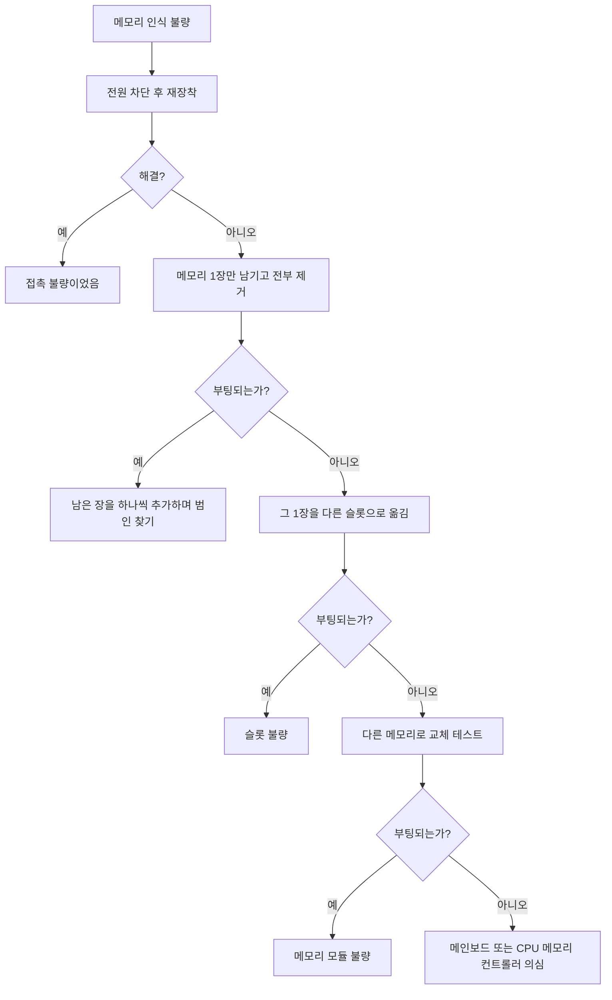

<Callout type="info">
  **이번 문서의 목표:** 이 파일을 다 읽으면 메모리를 듀얼채널로 정확히 장착하고, 인식 불량이 났을 때 부품을 사지 않고 배제법으로 원인을 좁힐 수 있으며, 실기 에뮬레이터에서 가상 메모리 크기와 프로세서 자원 할당, 시각 효과를 지정된 값으로 설정할 수 있습니다.
</Callout>

## RAM은 왜 문제의 진원지인가

PC 고장 신고에서 "화면이 안 나와요", "부팅이 되다 말아요", "블루스크린이 떠요" 세 가지는 원인이 제각각처럼 보이지만, 실제로는 상당수가 **메모리 접촉 불량 하나**로 수렴합니다. 이유는 단순합니다. 메모리는 부팅 초기에 CPU가 가장 먼저 크게 의존하는 부품인데, 동시에 **손으로 꽂았다 뺐다 하는 부품 중 접점이 가장 많기** 때문입니다.

그래서 실기의 진단형 문항은 메모리를 좋아합니다. "슬롯을 바꿔 꽂아 보았는가", "한 장씩 테스트했는가"라는 절차 자체가 채점 항목이 됩니다.

> **쉽게 말하면:** 메모리 진단이란 부품을 의심하기 전에 "꽂는 자리"와 "꽂힌 상태"를 먼저 의심하는 절차입니다.

## 1. 메모리 장착 — 슬롯 우선순위와 듀얼채널

### 채널이란 무엇인가

**채널**(channel)은 CPU의 메모리 컨트롤러와 메모리 사이를 잇는 독립된 통로입니다. 요즘 데스크톱 CPU는 채널을 두 개 가지고 있어, 두 통로를 동시에 쓰면 같은 시간에 두 배의 데이터를 옮길 수 있습니다. 이것이 **듀얼채널**(dual channel)입니다.

차선 비유가 정확합니다. 8GB 메모리 한 장을 꽂으면 1차선 도로를 쓰는 것이고, 4GB 두 장을 각각 다른 채널에 꽂으면 2차선 도로가 됩니다. **용량은 같은데 대역폭은 두 배**가 되는 것입니다.

$$
\text{대역폭} = \text{채널 수} \times \text{채널당 대역폭}
$$

- 채널 수: 동시에 사용하는 독립 통로의 개수(싱글 1, 듀얼 2)
- 채널당 대역폭: 한 통로가 초당 옮길 수 있는 데이터 양

여기서 실기가 묻는 지점은 계산이 아니라 "**어디에 꽂아야 듀얼채널이 되는가**"입니다.

### 슬롯 이름과 장착 규칙

메인보드의 DIMM 슬롯은 보통 네 개이고, CPU에서 가까운 쪽부터 `A1`, `A2`, `B1`, `B2` 또는 `DIMM1`~`DIMM4` 로 표기됩니다. 색이 두 가지로 칠해져 있는 경우, **같은 색끼리가 서로 다른 채널**입니다.

| 메모리 개수 | 장착 위치(일반적인 4슬롯 보드) | 결과 |
|-------------|-------------------------------|------|
| 1장 | `A2`(CPU에서 두 번째 슬롯) | 싱글채널 |
| 2장 | `A2` + `B2` (한 칸 띄워서) | 듀얼채널 |
| 4장 | 전체 | 듀얼채널 |

<Callout type="warning">
  **가장 흔한 실수:** 메모리 두 장을 **나란히 붙여서** `A1` + `A2` 에 꽂는 것. 같은 채널에 두 장이 들어가므로 듀얼채널이 되지 않습니다. 반드시 **한 칸 띄워서** 꽂습니다. 정확한 위치는 메인보드 매뉴얼의 메모리 장착 표를 따르는 것이 원칙이며, 일반적으로 CPU에서 두 번째 슬롯부터 채웁니다.
</Callout>

### 장착 절차

<Steps>

### 슬롯 걸쇠를 연다

슬롯 양끝(또는 한쪽만 있는 보드는 한쪽)의 걸쇠를 바깥으로 젖힙니다.

### 노치 위치를 맞춘다

메모리 접점 중간의 홈과 슬롯 안 돌기를 맞춥니다. 방향이 맞으면 좌우 길이가 비대칭으로 딱 떨어집니다. 안 맞으면 뒤집어 다시 봅니다.

### 양끝을 동시에 수직으로 누른다

한쪽만 누르면 반대쪽이 뜬 채로 걸쇠만 닫혀 **꽂힌 것처럼 보이는 미장착 상태**가 됩니다. 이것이 인식 불량의 최대 원인입니다.

### 딸깍 소리와 걸쇠 위치를 확인한다

양끝 걸쇠가 스스로 올라와 모듈 홈에 물리면 정상입니다. 손으로 걸쇠를 닫아 준 경우는 의심해야 합니다.

### 옆에서 눈높이를 맞춰 본다

모듈 윗면이 슬롯과 평행한지 옆에서 봅니다. 한쪽이 높으면 미장착입니다.

</Steps>

## 2. 메모리 인식 불량 — 배제법으로 좁히기

인식 불량이란 "장착한 용량보다 적게 잡히거나, 아예 부팅이 안 되는" 상태입니다. 부품을 사기 전에 아래 순서로 좁힙니다.

이 흐름의 핵심은 **한 번에 하나씩만 바꾼다**는 원칙입니다. 메모리도 옮기고 슬롯도 바꾸고 BIOS도 초기화하면, 해결되어도 원인을 모릅니다. 실기 서술형에서 "진단 절차를 서술하시오"가 나오면 이 원칙을 문장으로 쓰는 것이 점수입니다.

### 확인하는 지점 세 곳

| 확인 위치 | 보는 것 | 의미 |
|-----------|---------|------|
| POST 화면 / BIOS 메인 | Total Memory 표시 | 하드웨어가 인식한 실제 용량 |
| 작업 관리자 성능 탭 | 사용 가능 메모리, 슬롯 사용 현황 | OS가 쓰는 용량 |
| `msinfo32` 시스템 정보 | 설치된 실제 메모리, 사용 가능한 실제 메모리 | 예약분 확인 |

**BIOS에서 8GB로 보이는데 Windows에서 7.8GB로 보이는 것은 정상**입니다. 내장 그래픽이 시스템 메모리 일부를 화면용으로 가져가기 때문입니다. 반면 **BIOS에서부터 4GB만 보인다면 하드웨어 문제**입니다. 이 구분이 진단의 갈림길입니다.

### POST 비프음으로 읽기

**POST**(Power-On Self Test, 전원 인가 자체 검사)는 전원을 켠 직후 BIOS가 부품을 점검하는 과정입니다. 화면이 나오기 전에 문제가 생기면 소리로 알립니다. 메인보드 제조사(BIOS 제조사)마다 코드가 다르므로 대표적인 것만 기억합니다.

| BIOS 계열 | 비프 패턴 | 의미 |
|-----------|-----------|------|
| AMI | 짧게 1회 | 정상 |
| AMI | 짧게 3회 | 메모리 오류 |
| AMI | 길게 1회 + 짧게 3회 | 그래픽 관련 오류 |
| 어워드 | 길게 1회 + 짧게 2회 | 그래픽 오류 |
| 어워드 | 길게 반복 | 메모리 미장착 또는 접촉 불량 |

정확한 코드는 보드 매뉴얼이 우선입니다. 다만 실기에서 "길게 반복되는 비프음"이 나오면 **메모리를 먼저 의심**하는 것이 표준 답입니다. 09편에서 전원 계통 전체와 함께 다시 다룹니다.

### 메모리 자체 검사 — Windows 메모리 진단

부팅은 되는데 무작위로 블루스크린이 뜨는 경우, Windows 메모리 진단 도구로 검사합니다.

<Steps>

### 도구 실행

실행 창에 `mdsched.exe` 를 입력하거나, 시작 메뉴에서 Windows 메모리 진단을 검색합니다.

### 검사 시점 선택

지금 다시 시작하여 문제 확인을 선택하면 재부팅 후 검사 화면으로 들어갑니다.

### 결과 확인

검사가 끝나면 자동으로 Windows에 진입하며, 알림 영역에 결과가 표시됩니다. 결과가 사라졌다면 이벤트 뷰어에서 `MemoryDiagnostics-Results` 원본을 확인합니다.

</Steps>

## 3. 가상 메모리 — 실기 에뮬레이터 최다 출제 구간

### 왜 필요한가

RAM은 유한합니다. 프로그램을 여러 개 띄우면 RAM이 가득 차고, 그러면 새 프로그램을 실행할 수 없습니다. 이 문제를 우회하기 위해, 운영체제는 **당장 쓰지 않는 메모리 내용을 저장장치의 특정 파일로 옮겨 두고 RAM을 비웁니다.** 나중에 그 내용이 필요해지면 다시 RAM으로 가져옵니다.

이때 사용하는 파일이 **페이징 파일**(paging file)이며, Windows에서는 `pagefile.sys` 라는 숨김 파일로 존재합니다. 이 구조 전체를 **가상 메모리**(virtual memory)라고 부릅니다.

> **쉽게 말하면:** 가상 메모리는 책상이 좁을 때 안 쓰는 서류를 서랍에 잠시 넣어 두고, 필요하면 다시 꺼내는 방식입니다.

**페이지**(page)라는 이름은 메모리를 일정 크기(보통 4KB)의 조각으로 나누어 관리하기 때문에 붙었습니다. 책을 쪽 단위로 넘기듯 메모리를 쪽 단위로 옮긴다는 뜻입니다.

주의할 점은 저장장치가 RAM보다 훨씬 느리다는 것입니다. 그래서 가상 메모리를 많이 쓰기 시작하면 시스템이 눈에 띄게 느려지는데, 이 현상을 **스래싱**(thrashing)이라고 합니다. 즉 가상 메모리는 RAM 부족의 해결책이 아니라 **완충 장치**입니다.

### 설정 경로 — 정확히 이 순서

실기 문항은 보통 이렇게 나옵니다. "가상 메모리를 D 드라이브에 처음 크기 1000MB, 최대 크기 2000MB로 설정하시오."

<Steps>

### 시스템 속성 열기

`제어판 → 시스템 → 고급 시스템 설정` 순서로 들어갑니다. 실행 창에 `sysdm.cpl` 을 입력해도 같은 창이 열립니다.

### 고급 탭 → 성능 설정

시스템 속성 창의 `[고급]` 탭에서 성능 항목의 `[설정]` 버튼을 누릅니다.

### 성능 옵션 → 고급 탭 → 가상 메모리 변경

성능 옵션 창에서 다시 `[고급]` 탭으로 가면 가상 메모리 항목이 있고, 그 아래 `[변경]` 버튼이 있습니다.

### 자동 관리 체크 해제

가상 메모리 창 맨 위의 **모든 드라이브에 대한 페이징 파일 크기 자동 관리** 체크박스를 **해제**합니다. 이걸 해제하지 않으면 아래 입력란이 회색으로 비활성화되어 아무것도 입력할 수 없습니다.

### 대상 드라이브 선택

드라이브 목록에서 문제가 지정한 드라이브(예: `D:`)를 클릭해 선택합니다. 기본 선택은 `C:` 이므로 반드시 바꿔야 합니다.

### 사용자 지정 크기 입력

**사용자 지정 크기** 라디오 버튼을 선택하고, 처음 크기에 `1000`, 최대 크기에 `2000` 을 입력합니다. 단위는 MB이며, 문제가 MB로 주었으면 그대로 숫자만 넣습니다.

### 설정 버튼 클릭

**여기가 감점 1순위입니다.** 반드시 `[설정]` 버튼을 눌러야 위쪽 드라이브 목록의 해당 줄에 `1000 - 2000` 이 표시됩니다. 목록에 반영된 것을 눈으로 확인하세요.

### 확인 후 재시작 안내 수용

`[확인]` 을 눌러 창을 닫습니다. 다시 시작하라는 안내가 나오면 확인합니다.

</Steps>

<Callout type="warning">
  **채점 항목으로 쪼개 보기:** ① 자동 관리 해제 ② 올바른 드라이브 선택 ③ 처음 크기 값 ④ 최대 크기 값 ⑤ 설정 버튼 클릭. 다섯 개가 각각 점수입니다. 특히 ⑤를 빠뜨리면 ①~④가 전부 무효가 됩니다.
</Callout>

자주 하는 실수를 더 짚습니다.

- **단위 착각**: `1000MB` 를 `1GB` 로 이해해 `1` 을 입력. 입력란 단위는 MB입니다.
- **처음과 최대를 뒤집어 입력**: 처음 크기가 최대 크기보다 크면 적용되지 않습니다.
- **C 드라이브에 설정**: 문제가 D를 지정했으면 C는 건드리지 않습니다. 이미 C에 설정이 있다면 그대로 두는 것이 원칙이며, "C의 페이징 파일을 없애라"는 지시가 따로 있을 때만 페이징 파일 없음을 선택합니다.

## 4. 성능 옵션의 나머지 두 탭 — 함께 출제된다

가상 메모리 문항은 보통 같은 창의 다른 설정과 묶여 나옵니다. 세 가지 지시가 한 문항에 들어 있는 형태입니다.

### 프로세서 자원 할당 — 백그라운드 서비스

성능 옵션 창 `[고급]` 탭 맨 위에는 **프로세서 일정을 조정할 방법 선택** 항목이 있고, 두 개의 라디오 버튼이 있습니다.

| 선택 | 의미 | 적합한 용도 |
|------|------|-------------|
| 프로그램 | 지금 화면 앞에 있는 프로그램에 CPU 시간을 더 준다 | 일반 사무·게임 PC |
| 백그라운드 서비스 | 화면에 없는 서비스에도 CPU 시간을 균등하게 준다 | 서버·파일 공유·데이터베이스 |

원리는 **퀀텀**(quantum, CPU가 한 프로그램에게 한 번에 주는 시간 조각)의 길이에 있습니다. 프로그램 쪽을 선택하면 지금 활성화된 창의 프로세스에 더 긴 시간 조각을 주어 반응이 빨라지고, 백그라운드 서비스 쪽을 선택하면 모두에게 같은 길이를 주어 뒤에서 도는 작업이 밀리지 않습니다.

문제가 "백그라운드 서비스에 최적화"라고 하면 `성능 옵션 → [고급] 탭 → 백그라운드 서비스` 라디오를 선택하면 됩니다.

### 시각 효과 탭 — "항목만 체크"의 함정

`[시각 효과]` 탭에는 네 개의 라디오 버튼과 그 아래 개별 체크박스 목록이 있습니다.

| 라디오 선택 | 동작 |
|-------------|------|
| 컴퓨터에 가장 적합한 설정을 자동 선택 | 시스템이 판단 |
| 최적 모양으로 조정 | 모든 항목 체크 |
| 최적 성능으로 조정 | 모든 항목 해제 |
| 사용자 지정 | 개별 체크 가능 |

문제가 "**화면 글꼴의 가장자리 다듬기 항목만 체크**"라고 하면 수행 순서는 이렇습니다.

<Steps>

### 최적 성능으로 조정을 먼저 클릭

이렇게 하면 모든 체크박스가 한 번에 해제됩니다. 하나씩 해제하다 보면 반드시 빠뜨립니다.

### 목록에서 화면 글꼴의 가장자리 다듬기만 체크

체크하는 순간 라디오가 자동으로 사용자 지정으로 바뀝니다. 이것이 정상입니다.

### 적용 후 확인

`[적용]` 을 누르고 `[확인]` 으로 닫습니다.

</Steps>

"항목만"이라는 조건은 **나머지를 전부 해제하라는 지시**입니다. 이 한 단어를 놓쳐 다른 항목이 켜진 채로 남으면 감점됩니다.

참고로 **화면 글꼴의 가장자리 다듬기**(ClearType 등 안티에일리어싱)는 글자의 계단 현상을 완화해 부드럽게 보이게 하는 기능입니다. 픽셀 경계를 중간 밝기로 칠해 눈이 곡선으로 인식하게 만드는 원리입니다.

## 5. 메모리 관련 진단을 표로 정리

| 증상 | 1순위 확인 | 2순위 확인 |
|------|-----------|-----------|
| 전원은 켜지는데 화면 없음, 긴 비프음 반복 | 메모리 재장착 | 슬롯 변경 |
| BIOS에서 용량이 절반만 표시 | 한 장씩 분리 테스트 | 슬롯 불량 확인 |
| Windows에서 BIOS보다 조금 적게 표시 | 정상 – 내장 그래픽 할당분 | 별도 조치 불필요 |
| 무작위 블루스크린 | Windows 메모리 진단 실행 | 한 장씩 분리 테스트 |
| 프로그램 다수 실행 시 심한 느려짐 | 가상 메모리 설정 확인 | 물리 메모리 증설 검토 |

## 핵심 정리

- 듀얼채널은 슬롯을 **한 칸 띄워** 꽂아야 구성되며, 나란히 붙여 꽂으면 싱글채널이 됩니다.
- 인식 불량은 재장착 → 한 장 테스트 → 슬롯 변경 → 모듈 교체 순으로 **한 번에 하나씩** 배제합니다.
- BIOS 표시 용량과 Windows 표시 용량의 작은 차이는 내장 그래픽 할당분으로 정상입니다.
- 가상 메모리 경로는 `sysdm.cpl` → 고급 → 성능 설정 → 고급 → 가상 메모리 변경이며, **자동 관리 해제 → 드라이브 선택 → 크기 입력 → 설정 버튼**까지가 한 세트입니다.
- 성능 옵션의 프로세서 자원 할당에서 백그라운드 서비스를 고르면 서비스에 CPU 시간이 균등 배분되고, 시각 효과에서 "항목만 체크"는 최적 성능으로 전부 해제한 뒤 지정 항목만 켜는 것이 안전합니다.

## 마무리 복습

<Quiz
  questionNumber={1}
  question="가상 메모리 설정 창에서 사용자 지정 크기 입력란이 회색으로 비활성화되어 있을 때 가장 먼저 해야 할 일은?"
  options={['시스템을 재시작한다', '모든 드라이브에 대한 페이징 파일 크기 자동 관리 체크를 해제한다', '관리자 계정으로 다시 로그인한다', 'C 드라이브를 포맷한다']}
  correctAnswer={2}
  explanation="자동 관리 체크가 켜져 있으면 개별 드라이브의 크기 입력이 잠깁니다. 체크를 해제해야 드라이브 선택과 사용자 지정 크기 입력이 가능해집니다."
  optionExplanations={['재시작으로는 잠금이 풀리지 않습니다', '자동 관리 해제가 입력 활성화의 전제입니다', '권한 문제가 아니라 옵션 상태의 문제입니다', '포맷은 전혀 관련 없는 파괴적 조치입니다']}
/>

<Quiz
  questionNumber={2}
  question="가상 메모리를 D 드라이브에 처음 1000MB, 최대 2000MB로 지정한 뒤 반드시 눌러야 하는 버튼은?"
  options={['적용만 누르고 창을 닫는다', '설정 버튼을 눌러 목록에 반영한 뒤 확인한다', '취소 버튼을 눌러 값을 보존한다', '기본값 복원 버튼을 누른다']}
  correctAnswer={2}
  explanation="가상 메모리 창에서는 설정 버튼을 눌러야 입력값이 위쪽 드라이브 목록에 반영됩니다. 누르지 않으면 입력값이 그대로 사라져 앞의 모든 단계가 무효가 됩니다."
  optionExplanations={['설정 버튼을 거치지 않은 값은 반영되지 않습니다', '설정 버튼 클릭으로 목록에 반영되는 것을 확인해야 합니다', '취소는 변경을 버립니다', '기본값 복원은 지정한 값을 지웁니다']}
/>

<Quiz
  questionNumber={3}
  question="메모리 두 장을 듀얼채널로 구성하려 할 때 일반적인 4슬롯 메인보드에서 올바른 장착 방법은?"
  options={['CPU에 가장 가까운 두 슬롯에 나란히 꽂는다', '한 칸 띄워 서로 다른 채널의 슬롯에 꽂는다', '가장 먼 두 슬롯에 나란히 꽂는다', '아무 슬롯에나 꽂으면 자동으로 듀얼채널이 된다']}
  correctAnswer={2}
  explanation="듀얼채널은 서로 다른 채널의 슬롯에 한 장씩 장착해야 구성됩니다. 대개 같은 색 슬롯끼리가 다른 채널이며 한 칸 띄워 꽂는 형태가 됩니다."
  optionExplanations={['나란히 꽂으면 같은 채널에 몰려 싱글채널이 됩니다', '서로 다른 채널에 한 장씩 배치하는 것이 원칙입니다', '위치와 무관하게 나란히 꽂으면 같은 채널일 수 있습니다', '장착 위치가 채널 구성을 결정하므로 자동이 아닙니다']}
/>

<Quiz
  questionNumber={4}
  question="BIOS에서는 8GB로 표시되는데 Windows 시스템 정보에서 사용 가능한 실제 메모리가 조금 적게 표시된다면?"
  options={['메모리 모듈 불량이므로 교체한다', '내장 그래픽 등이 시스템 메모리 일부를 할당받은 정상 현상이다', '슬롯 불량이므로 위치를 바꾼다', '파티션이 손상된 것이다']}
  correctAnswer={2}
  explanation="내장 그래픽은 시스템 메모리 일부를 화면 표시용으로 예약합니다. BIOS 인식 용량과 Windows 사용 가능 용량의 작은 차이는 정상입니다."
  optionExplanations={['하드웨어 인식 자체는 정상이므로 교체 사유가 아닙니다', '그래픽 할당분으로 인한 정상적인 차이입니다', 'BIOS 인식이 정상이므로 슬롯 문제가 아닙니다', '파티션은 메모리 용량 표시와 무관합니다']}
/>

<Quiz
  questionNumber={5}
  question="성능 옵션에서 프로세서 자원 할당을 백그라운드 서비스로 선택했을 때의 효과는?"
  options={['화면 앞의 프로그램에 CPU 시간을 몰아준다', '화면에 없는 서비스에도 CPU 시간을 균등하게 배분한다', '모든 시각 효과가 꺼진다', '페이징 파일이 자동으로 커진다']}
  correctAnswer={2}
  explanation="백그라운드 서비스를 선택하면 CPU 시간 조각이 균등하게 배분되어 뒤에서 도는 서비스가 밀리지 않습니다. 서버나 파일 공유 용도의 PC에 적합합니다."
  optionExplanations={['그것은 프로그램 쪽을 선택했을 때의 동작입니다', '균등 배분이 백그라운드 서비스 선택의 효과입니다', '시각 효과는 별도 탭의 설정입니다', '페이징 파일 크기와는 관계가 없습니다']}
/>

<Quiz
  questionNumber={6}
  question="시각 효과에서 화면 글꼴의 가장자리 다듬기 항목만 체크하라는 조건을 가장 안전하게 수행하는 방법은?"
  options={['최적 모양으로 조정을 선택한 뒤 해당 항목을 체크한다', '최적 성능으로 조정을 선택해 전부 해제한 뒤 해당 항목만 체크한다', '자동 선택을 그대로 두고 해당 항목만 체크한다', '해당 항목만 해제한다']}
  correctAnswer={2}
  explanation="만이라는 조건은 나머지를 모두 해제하라는 뜻입니다. 최적 성능으로 조정을 눌러 전부 해제한 뒤 지정 항목만 체크하면 누락 없이 조건을 만족합니다."
  optionExplanations={['최적 모양은 모든 항목을 켜므로 조건에 어긋납니다', '전부 해제 후 지정 항목만 켜는 것이 가장 확실합니다', '자동 선택은 항목 상태를 통제할 수 없습니다', '체크 대상을 반대로 이해한 것입니다']}
/>

<Quiz
  questionNumber={7}
  question="메모리를 슬롯에 꽂았는데 인식되지 않는 경우 가장 먼저 시도해야 할 조치는?"
  options={['메인보드를 교체한다', '전원을 차단한 뒤 재장착하고 양끝 걸쇠가 스스로 물렸는지 확인한다', 'BIOS를 최신 버전으로 업데이트한다', 'Windows를 재설치한다']}
  correctAnswer={2}
  explanation="메모리 인식 불량의 최다 원인은 한쪽만 눌려 반대쪽이 뜬 접촉 불량입니다. 재장착과 걸쇠 확인을 먼저 하고 그다음 한 장 테스트와 슬롯 변경으로 좁혀 갑니다."
  optionExplanations={['부품 교체는 배제 절차의 마지막 단계입니다', '접촉 불량 배제가 진단의 출발점입니다', 'BIOS 업데이트는 위험이 있어 우선 조치가 아닙니다', 'OS 재설치는 하드웨어 인식과 무관합니다']}
/>

<Quiz
  questionNumber={8}
  question="가상 메모리에 대한 설명으로 옳은 것은?"
  options={['RAM 부족을 완전히 해결해 물리 메모리 증설을 대체한다', '저장장치의 페이징 파일을 이용해 RAM 부족을 완충하며 과도하게 사용되면 오히려 느려진다', 'CPU 캐시의 다른 이름이다', '전원이 꺼져도 내용이 유지되는 RAM을 말한다']}
  correctAnswer={2}
  explanation="가상 메모리는 당장 쓰지 않는 메모리 내용을 저장장치의 페이징 파일로 옮겨 RAM을 비우는 기법입니다. 저장장치는 RAM보다 느리므로 사용이 잦아지면 스래싱으로 성능이 떨어집니다."
  optionExplanations={['완충 장치일 뿐 증설을 대체하지 못합니다', '완충 역할과 과다 사용 시의 성능 저하가 모두 맞습니다', 'CPU 캐시는 전혀 다른 계층의 기억장치입니다', '비휘발성 메모리에 대한 설명이 아닙니다']}
/>

## 참고 자료

- [Intel - Supported Memory and Memory Population Rules for the Intel Server Board S2600WF](https://www.intel.com/content/www/us/en/support/articles/000055509/server-products/server-boards.html)
- [Intel - How to Choose RAM for a Gaming PC](https://www.intel.com/content/www/us/en/gaming/resources/how-much-ram-gaming.html)
- [한국정보통신자격협회 - PC정비사 2급](https://www.icqa.or.kr/cn/page/pc)
