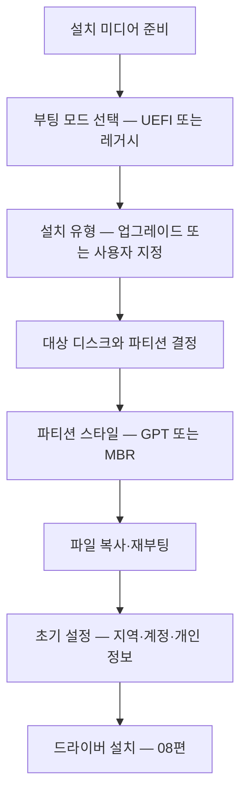
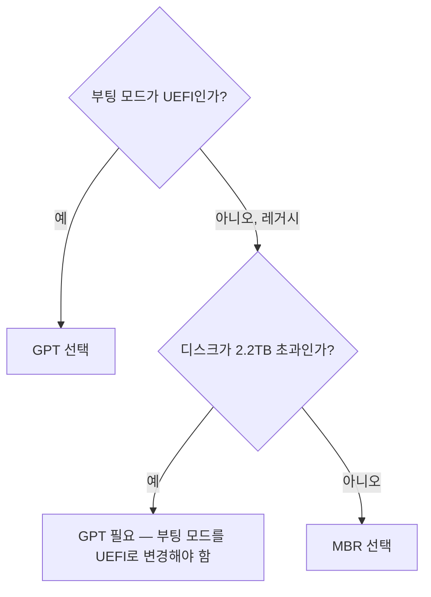

<Callout type="info">
  **이번 문서의 목표:** 이 파일을 다 읽으면 부팅 미디어를 만들고 UEFI 모드로 부팅해 Windows를 설치할 수 있으며, GPT와 MBR 중 무엇을 써야 하는지 근거를 대고 판단할 수 있고, 설치 중 발생하는 파티션 오류 메시지의 원인을 지목할 수 있습니다.
</Callout>

## 설치는 "고르는 작업"이다

Windows 설치 과정에서 실제로 사람이 결정하는 것은 몇 개 되지 않습니다. 그리고 그 몇 개가 전부 실기의 채점 항목입니다.



이 중 **B와 E는 서로 묶여 있습니다.** UEFI로 부팅하면 GPT를 요구하고, 레거시로 부팅하면 MBR을 요구합니다. 이 연결을 모르면 설치 화면에서 나오는 오류 메시지를 영원히 이해할 수 없습니다.

> **쉽게 말하면:** "어떻게 부팅했는가"가 "디스크를 어떤 방식으로 나눌 것인가"를 강제합니다.

## 1. 설치 미디어 준비

설치 미디어란 Windows 설치 파일이 담긴 부팅 가능한 USB 저장장치입니다.

<Steps>

### 8GB 이상의 USB 준비

작업 중 USB의 기존 데이터는 **전부 삭제**됩니다. 반드시 미리 백업합니다. 이 확인 절차 자체가 실기 서술형의 답이 되기도 합니다.

### 제작 도구 실행

마이크로소프트가 제공하는 미디어 생성 도구를 쓰거나, ISO 이미지를 받아 USB 굽기 도구로 씁니다.

### 파티션 방식 선택

굽기 도구에서 파티션 방식을 `GPT`(UEFI 대상) 또는 `MBR`(레거시 대상)로 고릅니다. 대상 PC를 UEFI로 설치할 것이라면 GPT를 고릅니다.

### 파일 시스템 선택

FAT32로 만들면 UEFI 펌웨어가 직접 읽을 수 있어 호환성이 좋습니다. 다만 설치 파일 중 `install.wim` 이 4GB를 넘는 경우 FAT32에 담기지 않으므로, 도구가 자동으로 파일을 분할하거나 NTFS를 쓰게 됩니다.

</Steps>

## 2. 부팅 모드 — UEFI와 레거시

06편에서 다룬 부팅 순서 설정에서 `UEFI:` 접두어를 선택했는지 여부가 여기서 결과로 나타납니다.

| 항목 | 레거시(Legacy BIOS) | UEFI |
|------|---------------------|------|
| 부팅 코드 위치 | 디스크 첫 섹터(MBR) | EFI 시스템 파티션의 부트로더 파일 |
| 요구 파티션 방식 | MBR | GPT |
| 최대 디스크 용량 | 약 2.2TB | 사실상 제한 없음 |
| 주 파티션 개수 | 4개 | 사실상 제한 없음 |
| 시큐어 부트 | 없음 | 지원 |
| 설정 인터페이스 | 키보드 전용 텍스트 | 마우스 가능 그래픽 |

**CSM**(Compatibility Support Module, 호환성 지원 모듈)은 UEFI 보드에서 레거시 방식으로도 부팅할 수 있게 해 주는 기능입니다. CSM이 켜져 있으면 부팅 메뉴에 같은 USB가 두 번 나타납니다. 순수 UEFI 설치를 원하면 CSM을 끄는 것이 가장 확실합니다.

### 현재 시스템의 부팅 모드 확인법

이미 설치된 Windows가 어느 모드로 부팅되었는지는 이렇게 확인합니다.

<Steps>

### 시스템 정보 실행

실행 창에 `msinfo32` 를 입력합니다.

### BIOS 모드 항목 확인

시스템 요약 화면 오른쪽 목록에서 **BIOS 모드** 항목을 찾습니다. `UEFI` 또는 `레거시` 로 표시됩니다.

</Steps>

디스크 쪽에서 확인하려면 `diskmgmt.msc` 를 열어 디스크 이름을 우클릭 → 속성 → 볼륨 탭에서 파티션 스타일을 봅니다. `GUID 파티션 테이블(GPT)` 이면 UEFI 설치입니다.

## 3. GPT와 MBR — 원리부터

### MBR — 디스크 첫 512바이트에 담긴 지도

**MBR**(Master Boot Record, 마스터 부트 레코드)은 디스크의 맨 앞 한 섹터(512바이트)에 부팅 코드와 파티션 표를 함께 담는 방식입니다.

512바이트를 이렇게 나눠 씁니다.

| 영역 | 크기 | 내용 |
|------|------|------|
| 부트 코드 | 446바이트 | 부팅을 시작하는 기계어 |
| 파티션 표 | 64바이트 | 파티션 4개 정보(각 16바이트) |
| 서명 | 2바이트 | 유효성 표시 |

여기서 두 가지 유명한 제약이 그대로 도출됩니다.

- **주 파티션 최대 4개** — 파티션 표가 64바이트뿐이고 한 항목이 16바이트이므로 $64 \div 16 = 4$ 개입니다. 더 만들려면 그중 하나를 확장 파티션으로 지정해 그 안에 논리 드라이브를 만듭니다.
- **약 2.2TB 용량 한계** — 섹터 주소를 32비트로 표현하기 때문입니다.

$$
2^{32} \times 512 \text{바이트} \approx 2.2 \times 10^{12} \text{바이트}
$$

- $2^{32}$ : 32비트 주소로 셀 수 있는 섹터 개수
- $512$ : 섹터 하나의 바이트 수

또한 파티션 표가 **한 곳에만** 있어서 그 영역이 손상되면 전체 디스크 구조를 잃습니다.

### GPT — 여유롭게 다시 설계한 지도

**GPT**(GUID Partition Table, GUID 파티션 테이블)는 UEFI와 함께 도입된 방식입니다. **GUID**(Globally Unique Identifier, 전역 고유 식별자)는 사실상 중복되지 않는 긴 식별 번호로, 파티션마다 이 번호가 붙습니다.

| 개선점 | 내용 |
|--------|------|
| 섹터 주소 64비트 | 용량 한계가 사실상 사라짐 |
| 파티션 개수 | Windows 기준 128개 |
| 헤더 이중화 | 디스크 앞과 뒤에 사본 보관, 손상 시 복구 가능 |
| CRC 검사 | 파티션 표의 손상 여부를 스스로 검증 |
| 보호용 MBR | 구형 도구가 빈 디스크로 오인해 지우지 않도록 앞에 가짜 MBR을 둠 |

**CRC**(Cyclic Redundancy Check, 순환 중복 검사)는 데이터를 정해진 규칙으로 계산해 짧은 값을 만들어 두고, 나중에 다시 계산해 값이 같은지로 손상을 감지하는 기법입니다.

### 어느 것을 고를 것인가



실기에서 판단 기준은 단순합니다. **UEFI로 부팅했으면 GPT, 레거시로 부팅했으면 MBR.** 그 외의 조합은 설치가 거부됩니다.

## 4. 설치 화면에서 만나는 오류 메시지

설치 중 파티션 선택 화면에서 나오는 대표 메시지 두 개는 원인이 정반대입니다. 이 구분이 실기 서술형 단골입니다.

| 메시지 | 상황 | 원인 | 해결 |
|--------|------|------|------|
| 선택한 디스크가 GPT 파티션 스타일입니다 | 레거시로 부팅함 | 부팅 모드와 디스크 방식 불일치 | UEFI 모드로 다시 부팅하거나 디스크를 MBR로 변환 |
| 선택한 디스크에 MBR 파티션 테이블이 있습니다 | UEFI로 부팅함 | 위와 반대의 불일치 | 레거시로 부팅하거나 디스크를 GPT로 변환 |

즉 두 메시지 모두 "**지금 부팅한 방식과 디스크의 방식이 다르다**"는 같은 이야기를 반대 방향에서 하는 것입니다.

### 해결 방법 두 가지

**방법 A — 부팅 모드를 바꾼다(권장).** 설치를 중단하고 BIOS로 들어가 부팅 모드를 맞춘 뒤 다시 시작합니다. 데이터가 보존됩니다.

**방법 B — 디스크 방식을 변환한다.** 설치 화면에서 `Shift` + `F10` 을 눌러 명령 프롬프트를 열고 `diskpart` 로 변환합니다. **이 방법은 디스크의 모든 데이터를 삭제합니다.**

```
diskpart
list disk
select disk 0
clean
convert gpt
exit
```

각 명령의 뜻은 이렇습니다.

- `list disk` : 디스크 목록과 번호를 표시
- `select disk 0` : 0번 디스크를 작업 대상으로 지정
- `clean` : 파티션 정보를 전부 삭제
- `convert gpt` : GPT 방식으로 초기화 (MBR로 바꾸려면 `convert mbr`)

<Callout type="warning">
  **치명적 실수:** `select disk` 에서 번호를 잘못 고르고 `clean` 을 실행하는 것. 데이터 디스크가 통째로 지워집니다. `list disk` 결과의 **용량 열을 보고 대상 디스크를 확인**한 뒤에 선택해야 합니다.
</Callout>

## 5. 설치 진행 절차

<Steps>

### 부팅 미디어로 부팅

`F11` 또는 `F12` 부팅 메뉴에서 `UEFI:` 가 붙은 USB 항목을 선택합니다.

### 언어·시간·키보드 선택

한국어, 한국, Microsoft 입력기를 확인하고 다음을 누릅니다.

### 지금 설치 클릭

아래의 컴퓨터 복구는 부팅 문제 해결용입니다. 10편에서 다룹니다.

### 제품 키 입력 또는 건너뛰기

키가 없으면 제품 키가 없음을 선택해 진행할 수 있습니다.

### 설치 유형 선택

**사용자 지정: Windows만 설치(고급**)를 선택합니다. 업그레이드는 기존 Windows가 있을 때만 쓰는 항목이며, 새 설치 상황에서는 선택할 수 없습니다.

### 파티션 구성

대상 디스크를 선택합니다.
- 전체를 새로 쓰는 경우: 기존 파티션을 모두 삭제해 하나의 비할당 공간으로 만든 뒤, 그 상태에서 다음을 누르면 Windows가 필요한 파티션을 자동 생성합니다.
- 크기를 지정하는 경우: 새로 만들기를 눌러 MB 단위로 크기를 입력합니다.

### 자동 생성되는 파티션 확인

UEFI/GPT 설치에서는 다음 파티션들이 함께 만들어집니다.

| 파티션 | 역할 |
|--------|------|
| 복구 | 복구 환경 도구 보관 |
| EFI 시스템 파티션(ESP) | 부트로더 파일 보관, FAT32로 포맷됨 |
| Microsoft 예약(MSR) | 시스템 관리용 예약 공간 |
| 주 파티션 | 실제 Windows가 설치되는 곳 |

이 파티션들을 지우면 부팅이 되지 않습니다. **탐색기에 보이지 않는 것이 정상**이며, 실기에서 "C 드라이브 외에 보이지 않는 파티션이 있는데 지워도 되는가"라는 질문의 답은 "안 된다"입니다.

### 파일 복사와 재부팅

복사·기능 설치·업데이트 단계가 자동으로 진행되고 재부팅합니다. 이때 **USB를 뽑아 두면** 설치 화면으로 되돌아가는 사고를 막을 수 있습니다.

### 초기 설정

지역·키보드·네트워크·계정·개인 정보 설정을 진행합니다. 개인 정보 설정 화면에서 위치, 진단 데이터, 맞춤형 광고 등의 스위치를 문제 지시에 따라 켜거나 끕니다.

</Steps>

## 6. 설치 후 즉시 확인할 것

설치가 끝났다고 작업이 끝난 것이 아닙니다. 실기 채점에서는 다음 확인 절차 자체가 항목입니다.

| 확인 | 방법 | 정상 상태 |
|------|------|-----------|
| 부팅 모드 | `msinfo32` 의 BIOS 모드 | 의도한 모드와 일치 |
| 파티션 스타일 | `diskmgmt.msc` 디스크 속성 → 볼륨 | UEFI면 GPT |
| 장치 인식 | `devmgmt.msc` | 노란 느낌표 없음 |
| 저장 공간 | 탐색기 | 지정한 크기대로 배분 |
| 네트워크 | 작업 표시줄 아이콘 | 연결됨 |

노란 느낌표가 남아 있으면 드라이버 작업이 필요합니다. 08편으로 이어집니다.

## 핵심 정리

- 부팅 모드(UEFI/레거시)와 파티션 방식(GPT/MBR)은 반드시 짝이 맞아야 하며, 설치 화면의 파티션 오류 메시지는 이 불일치를 알리는 신호입니다.
- MBR은 512바이트 안에 부트 코드와 파티션 표를 담기 때문에 주 파티션 4개와 약 2.2TB 한계가 생깁니다.
- GPT는 64비트 주소, 헤더 이중화, CRC 검사를 갖추어 용량과 안정성 모두에서 앞섭니다.
- 설치 유형은 새 설치라면 **사용자 지정**을 선택하며, 자동 생성되는 복구·EFI·예약 파티션은 삭제하면 안 됩니다.
- `diskpart` 의 `clean` 은 되돌릴 수 없으므로 `list disk` 로 대상 번호와 용량을 반드시 확인합니다.

## 마무리 복습

<Quiz
  questionNumber={1}
  question="Windows 설치 중 선택한 디스크가 GPT 파티션 스타일이라는 메시지가 나타났다면 무엇이 어긋난 것인가?"
  options={['디스크 용량이 부족하다', '레거시 모드로 부팅했는데 디스크가 GPT여서 부팅 모드와 파티션 방식이 불일치한다', '설치 미디어가 손상되었다', '메모리 용량이 부족하다']}
  correctAnswer={2}
  explanation="레거시 부팅은 MBR 디스크를 요구합니다. UEFI 모드로 다시 부팅하거나 디스크를 MBR로 변환하면 해결됩니다."
  optionExplanations={['용량 문제라면 다른 메시지가 표시됩니다', '부팅 모드와 파티션 방식의 불일치가 원인입니다', '미디어 손상은 다른 단계에서 오류를 냅니다', '메모리는 이 메시지와 무관합니다']}
/>

<Quiz
  questionNumber={2}
  question="MBR 방식에서 주 파티션을 최대 4개까지만 만들 수 있는 직접적인 이유는?"
  options={['파일 시스템이 FAT32여서', '파티션 표가 64바이트이고 항목 하나가 16바이트여서', 'BIOS가 4개까지만 인식해서', '드라이브 문자가 4개여서']}
  correctAnswer={2}
  explanation="MBR 512바이트 중 파티션 표는 64바이트이며 항목 하나가 16바이트이므로 64를 16으로 나눈 4개가 상한이 됩니다."
  optionExplanations={['파일 시스템과 파티션 개수는 별개입니다', '표의 크기와 항목 크기의 나눗셈이 상한을 만듭니다', 'BIOS의 인식 개수 제한이 아닙니다', '드라이브 문자는 26개까지 사용할 수 있습니다']}
/>

<Quiz
  questionNumber={3}
  question="GPT가 MBR보다 손상에 강한 이유로 옳은 것은?"
  options={['파티션 표를 디스크 앞과 뒤에 이중으로 보관하고 CRC로 무결성을 검사하기 때문', '섹터 크기가 더 크기 때문', '암호화가 기본 적용되기 때문', '파일 시스템이 NTFS로 고정되기 때문']}
  correctAnswer={1}
  explanation="GPT는 헤더와 파티션 표를 디스크 앞뒤에 이중으로 두고 CRC 검사로 손상을 감지합니다. MBR은 표가 한 곳뿐이라 손상 시 복구가 어렵습니다."
  optionExplanations={['이중화와 CRC 검사가 안정성의 근거입니다', '섹터 크기는 파티션 방식이 정하지 않습니다', 'GPT 자체가 암호화 기능을 제공하지는 않습니다', 'GPT는 파일 시스템을 고정하지 않습니다']}
/>

<Quiz
  questionNumber={4}
  question="UEFI 모드로 Windows를 설치했을 때 자동으로 만들어지며 부트로더 파일을 담고 FAT32로 포맷되는 파티션은?"
  options={['복구 파티션', 'EFI 시스템 파티션', 'Microsoft 예약 파티션', '주 파티션']}
  correctAnswer={2}
  explanation="EFI 시스템 파티션은 UEFI 펌웨어가 읽을 수 있도록 FAT32로 포맷되며 부트로더 파일을 보관합니다. 삭제하면 부팅이 되지 않습니다."
  optionExplanations={['복구 파티션은 복구 도구를 담습니다', '부트로더 보관과 FAT32 포맷이 EFI 시스템 파티션의 특징입니다', '예약 파티션은 시스템 관리용 공간으로 파일 시스템이 없습니다', '주 파티션은 Windows 본체가 설치되는 곳입니다']}
/>

<Quiz
  questionNumber={5}
  question="diskpart로 디스크를 GPT로 변환하는 과정에서 가장 위험한 명령과 그 이유는?"
  options={['list disk — 목록이 길어져서', 'clean — 선택한 디스크의 파티션 정보를 모두 삭제하므로 대상을 잘못 고르면 데이터를 잃는다', 'exit — 창이 닫혀서', 'convert gpt — 시간이 오래 걸려서']}
  correctAnswer={2}
  explanation="clean은 선택된 디스크의 파티션 정보를 전부 지웁니다. 반드시 list disk의 용량 정보로 대상 디스크 번호를 확인한 뒤 실행해야 합니다."
  optionExplanations={['목록 조회는 비파괴적입니다', '대상 오선택 시 데이터 전체를 잃는 명령입니다', '종료 명령은 위험하지 않습니다', '변환 자체는 clean 이후 빈 디스크에 적용됩니다']}
/>

<Quiz
  questionNumber={6}
  question="현재 실행 중인 Windows가 UEFI 모드로 부팅되었는지 확인하는 가장 간단한 방법은?"
  options={['작업 관리자의 성능 탭 확인', 'msinfo32를 실행해 BIOS 모드 항목 확인', '제어판의 프로그램 목록 확인', '장치 관리자의 디스플레이 어댑터 확인']}
  correctAnswer={2}
  explanation="시스템 정보 도구인 msinfo32의 시스템 요약에 BIOS 모드 항목이 있으며 UEFI 또는 레거시로 표시됩니다."
  optionExplanations={['성능 탭에는 부팅 모드 정보가 없습니다', 'BIOS 모드 항목이 부팅 방식을 직접 알려 줍니다', '프로그램 목록과는 무관합니다', '그래픽 장치 정보와는 무관합니다']}
/>

<Quiz
  questionNumber={7}
  question="설치 미디어를 제작하기 전 반드시 확인해야 할 사항은?"
  options={['USB의 색상', 'USB의 기존 데이터가 모두 삭제되므로 백업했는지 여부', 'USB의 제조사', 'USB 케이블 길이']}
  correctAnswer={2}
  explanation="부팅 미디어 제작 과정에서 USB는 포맷되어 기존 데이터가 전부 사라집니다. 사전 백업 확인은 실기 서술형에서도 요구되는 절차입니다."
  optionExplanations={['색상은 작업과 무관합니다', '데이터 삭제 전 백업 확인이 필수 절차입니다', '제조사는 제작 가능 여부를 결정하지 않습니다', 'USB는 케이블 길이와 무관합니다']}
/>

<Quiz
  questionNumber={8}
  question="Windows 설치 후 탐색기에 보이지 않는 복구 및 EFI 파티션에 대한 올바른 처리는?"
  options={['공간 낭비이므로 삭제한다', '부팅과 복구에 필요하므로 그대로 둔다', '드라이브 문자를 부여해 사용한다', 'exFAT으로 다시 포맷한다']}
  correctAnswer={2}
  explanation="복구 파티션과 EFI 시스템 파티션은 부팅과 복구 환경에 필수적이며 탐색기에 보이지 않는 것이 정상입니다. 삭제하면 부팅이 불가능해집니다."
  optionExplanations={['삭제 시 부팅이 되지 않습니다', '보이지 않는 것이 정상이며 유지해야 합니다', '문자 부여는 오조작 위험만 키웁니다', '재포맷하면 부팅 파일이 사라집니다']}
/>

## 참고 자료

- [Microsoft Learn - Windows Setup: Installing using the MBR or GPT partition style](https://learn.microsoft.com/en-us/windows-hardware/manufacture/desktop/windows-setup-installing-using-the-mbr-or-gpt-partition-style?view=windows-11)
- [Microsoft Learn - Boot to UEFI Mode or Legacy BIOS mode](https://learn.microsoft.com/en-us/windows-hardware/manufacture/desktop/boot-to-uefi-mode-or-legacy-bios-mode?view=windows-11)
- [Dell Support - UEFI Windows Install Error](https://www.dell.com/support/kbdoc/en-ie/000146878/uefi-windows-install-error)
- [Intel - How to Configure the System in UEFI Mode before Installing Windows](https://www.intel.com/content/www/us/en/support/articles/000025535/memory-and-storage/intel-optane-memory.html)
