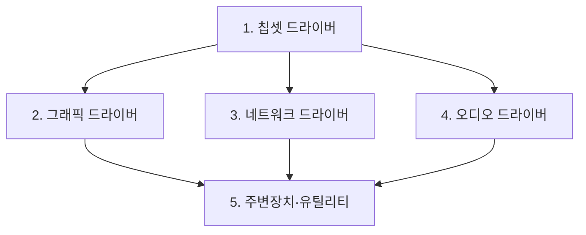

## 설치가 끝난 PC는 아직 반쪽이다

Windows 설치가 끝나면 화면은 나오고 마우스도 움직입니다. 그래서 다 됐다고 착각하기 쉽습니다. 그러나 이 상태는 Windows가 **표준 드라이버**라는 최소한의 범용 부품 조종법으로 겨우 굴러가는 상태입니다.

**드라이버**(driver, 장치 구동 프로그램)는 운영체제가 특정 하드웨어를 다루는 방법을 알려 주는 소프트웨어입니다. 사람이 외국인과 대화할 때 통역사가 필요한 것과 같습니다. 표준 드라이버는 "아무 언어나 대충 통하는 손짓 발짓"이고, 제조사 전용 드라이버는 "그 언어를 정확히 아는 통역사"입니다.

## 1. 드라이버 설치 순서 — 왜 칩셋이 먼저인가

순서에는 이유가 있습니다.

```mermaid
graph TD
  A[1. 칩셋 드라이버] --> B[2. 그래픽 드라이버]
  A --> C[3. 네트워크 드라이버]
  A --> D[4. 오디오 드라이버]
  B --> E[5. 주변장치·유틸리티]
  C --> E
  D --> E
```

**칩셋 드라이버**를 먼저 설치하는 이유는, 칩셋이 메인보드의 여러 통로(PCIe, SATA, USB 컨트롤러 등)를 관리하는 기반 부품이기 때문입니다. 이 통로의 정체를 Windows가 정확히 모르는 상태에서 그래픽·사운드를 설치하면, 장치가 엉뚱한 이름으로 잡히거나 설치가 실패할 수 있습니다.

**네트워크 드라이버**를 초반에 잡는 것도 실무적으로 중요합니다. 랜이 잡혀야 나머지를 인터넷으로 내려받을 수 있기 때문입니다. 그래서 실기 서술형에서 "인터넷이 안 되는 새 PC에서 가장 먼저 할 일"의 답은 **다른 PC에서 랜 드라이버를 USB로 옮겨 오는 것**입니다.

| 순서 | 드라이버 | 확보 방법 | 확인 위치(장치 관리자) |
|------|----------|-----------|------------------------|
| 1 | 칩셋 | 메인보드 제조사 지원 페이지 | 시스템 장치 |
| 2 | 그래픽 | GPU 제조사 또는 Windows 업데이트 | 디스플레이 어댑터 |
| 3 | 네트워크(유선·무선) | 메인보드 제조사 | 네트워크 어댑터 |
| 4 | 오디오 | 메인보드 제조사 | 사운드·비디오 및 게임 컨트롤러 |
| 5 | 기타(칩 기반 USB, 카드리더 등) | 제조사 | 범용 직렬 버스 컨트롤러 등 |

## 2. 장치 관리자 읽기

장치 관리자는 실행 창에 `devmgmt.msc` 를 입력하거나 시작 버튼 우클릭 메뉴에서 엽니다.

### 기호의 의미

| 표시 | 의미 | 조치 |
|------|------|------|
| 아무 표시 없음 | 정상 | 없음 |
| 노란색 느낌표 | 드라이버 없음·오류·자원 충돌 | 드라이버 설치 또는 업데이트 |
| 아래를 향한 화살표 | 사용자가 장치를 사용 안 함으로 설정 | 우클릭 → 디바이스 사용 |
| 알 수 없는 장치 항목 | 정체 불명 하드웨어 | 하드웨어 ID로 조회 후 드라이버 설치 |

### 정체 모를 장치의 신원 확인법

노란 느낌표가 뜬 **알 수 없는 장치**의 정체는 이렇게 밝힙니다.

### 드라이버 문제 해결 메뉴

| 상황 | 메뉴 | 설명 |
|------|------|------|
| 최신으로 올리고 싶다 | 드라이버 업데이트 | 자동 검색 또는 수동 파일 지정 |
| 업데이트 후 문제 발생 | 속성 → 드라이버 탭 → 드라이버 롤백 | 이전 버전으로 되돌림 |
| 완전히 다시 잡고 싶다 | 디바이스 제거 후 하드웨어 변경 사항 검색 | 재검색으로 새로 설치 |
| 장치를 잠시 꺼 두고 싶다 | 디바이스 사용 안 함 | 진단 시 배제용으로 유용 |

**드라이버 롤백**은 진단에서 특히 유용합니다. "어제까지 잘 되던 게 오늘 안 된다"면 그 사이에 바뀐 것을 되돌리는 것이 가장 빠른 검증이기 때문입니다. 09편의 블루스크린 진단에서 다시 다룹니다.

## 3. 레지스트리 편집기 — 실기의 정밀 조작 구간

### 레지스트리란 무엇인가

**레지스트리**(Registry)는 Windows와 프로그램의 설정을 한곳에 모아 둔 계층형 데이터베이스입니다. 예전에는 설정을 `.ini` 라는 텍스트 파일 여러 개에 흩어 두었는데, 프로그램이 많아지자 관리가 불가능해져 하나의 중앙 저장소로 통합한 것입니다.

구조는 탐색기의 폴더 구조와 똑같이 생겼습니다.

| 레지스트리 용어 | 탐색기로 비유하면 | 설명 |
|-----------------|-------------------|------|
| 키(Key) | 폴더 | 설정을 담는 그릇 |
| 하위 키(Subkey) | 하위 폴더 | 키 안의 키 |
| 값(Value) | 파일 | 실제 설정 데이터 |

### 최상위 키(하이브) 다섯 개

레지스트리 편집기를 열면 왼쪽에 다섯 개의 뿌리가 보입니다.

| 최상위 키 | 줄임 | 담는 내용 |
|-----------|------|-----------|
| `HKEY_CLASSES_ROOT` | HKCR | 파일 확장자와 연결 프로그램 정보 |
| `HKEY_CURRENT_USER` | HKCU | **현재 로그인한 사용자**의 설정 |
| `HKEY_LOCAL_MACHINE` | HKLM | **이 컴퓨터 전체**에 적용되는 설정 |
| `HKEY_USERS` | HKU | 모든 사용자 계정의 설정 |
| `HKEY_CURRENT_CONFIG` | HKCC | 현재 하드웨어 프로필 |

실기에서 가장 자주 나오는 것은 `HKEY_LOCAL_MACHINE` 입니다. 컴퓨터 전체에 적용되는 정책을 다루기 때문입니다. **HKCU와 HKLM을 혼동해 엉뚱한 뿌리에서 작업하면 0점**이므로, 경로의 첫 단어를 반드시 확인하세요.

### 값의 형식

값을 만들 때 형식을 고르라고 나옵니다. 형식이 틀리면 Windows가 그 값을 읽지 못합니다.

| 형식 | 표기 | 담는 것 | 예 |
|------|------|---------|-----|
| DWORD(32비트) 값 | `REG_DWORD` | 32비트 정수 | 켜기 끄기 스위치(`0` 또는 `1`) |
| QWORD(64비트) 값 | `REG_QWORD` | 64비트 정수 | 큰 수치 |
| 문자열 값 | `REG_SZ` | 글자 | 경로, 이름 |
| 확장 가능한 문자열 값 | `REG_EXPAND_SZ` | 변수를 포함한 글자 | 시스템 변수 포함 경로 |
| 다중 문자열 값 | `REG_MULTI_SZ` | 여러 줄 글자 | 목록 |
| 이진값 | `REG_BINARY` | 바이트 나열 | 장치 설정 원본 |

값의 자료형과 0·1의 의미는 **개별 설정 정의**를 따릅니다. REG_DWORD는 32비트 정수라는 뜻이지 항상 켜기·끄기라는 뜻이 아닙니다. 64비트 Windows에서도 DWORD를 요구하는 값은 DWORD로 만듭니다.

<Callout type="warning">
  Cortana 독립 실행형 앱은 지원이 종료되었습니다. 아래 AllowCortana는 이전 환경의 정책 값을 읽는 연습이며, 현재 Windows 11의 모든 음성·AI 기능을 끄는 방법이 아닙니다. Copilot 등 다른 기능에 그대로 적용하지 않습니다. 에뮬레이터에 해당 항목이 제시될 때만 지정 경로·자료형을 대조하고, 일반적인 레지스트리 입력 연습은 16편의 독립된 연습용 키를 사용합니다.
</Callout>

### 실기 예제 — Cortana 비활성화

문항은 이런 형태로 나옵니다. "AI 음성 비서 기능을 사용하지 못하도록 설정하시오."

정답을 한 줄로 정리하면 이렇습니다.

- 경로: `HKEY_LOCAL_MACHINE\SOFTWARE\Policies\Microsoft\Windows\Windows Search`
- 값 이름: `AllowCortana`
- 형식: DWORD(32비트)
- 데이터: `0`

**왜 `Policies` 아래인가**도 이해해 둘 만합니다. `Policies` 는 관리자가 강제하는 정책을 담는 구역으로, 사용자가 설정 앱에서 켠 값보다 우선합니다.

<Callout type="warning">
  **자주 하는 실수:** ① `HKEY_CURRENT_USER` 아래에서 작업 ② 형식을 문자열 값으로 선택 ③ 값 이름의 철자 오타(레지스트리 키·값 이름은 대소문자를 구분하지 않음) ④ 키 이름을 `WindowsSearch` 로 공백 없이 입력 ⑤ 데이터를 `1` 로 입력. 다섯 가지가 전부 개별 감점 사유입니다.
</Callout>

### 레지스트리 작업의 안전 수칙

레지스트리는 잘못 건드리면 부팅이 되지 않을 수 있습니다. 실무에서는 반드시 백업합니다.

## 4. 폴더 옵션 — 탐색기 동작 설정

실기 에뮬레이터 단골 중 하나입니다. 파일 탐색기의 `[보기]` 탭에서 옵션 → 폴더 및 검색 옵션 변경으로 열거나, 제어판에서 파일 탐색기 옵션을 엽니다.

### 세 개의 탭

| 탭 | 다루는 것 |
|-----|-----------|
| 일반 | 탐색기 시작 위치, 새 창 열기 방식, 클릭 방식 |
| 보기 | 숨김 파일, 확장명, 시스템 파일 표시 등 세부 항목 |
| 검색 | 검색 방식, 색인 사용 여부, 자연어 검색 |

### 보기 탭의 대표 항목

| 항목 | 의미 |
|------|------|
| 숨김 파일, 폴더 또는 드라이브 표시 안 함 | 숨김 속성 파일을 감춤(기본값) |
| 숨김 파일, 폴더 및 드라이브 표시 | 숨김 속성 파일을 보이게 함 |
| 알려진 파일 형식의 파일 확장명 숨기기 | 확장자를 감춤 |
| 보호된 운영 체제 파일 숨기기(권장) | 시스템 핵심 파일을 감춤 |

**숨김 파일 표시 여부**는 라디오 버튼 두 개 중 하나를 고르는 형태입니다. 문제가 "숨김 파일, 폴더 또는 드라이브 표시 안 함"이라고 하면 그 라디오를 직접 선택합니다.

실기에서 확장명 숨기기 항목이 중요한 이유도 알아 둡시다. 확장자가 감춰져 있으면 `보고서.pdf.exe` 라는 악성 파일이 `보고서.pdf` 로 보입니다. 그래서 보안 관점에서는 **확장명을 표시하도록 체크를 해제**하는 것이 권장됩니다.

### 검색 탭 — 자연어 검색

`[검색]` 탭에는 다음 항목들이 있습니다.

| 항목 | 의미 |
|------|------|
| 검색 시 자연어 검색 사용 | 사람이 말하듯 쓴 검색어를 해석 |
| 색인된 위치에서 파일 이름 및 내용 검색 | 내용까지 검색 |
| 시스템 디렉터리 포함 | 시스템 폴더도 검색 대상에 포함 |
| 압축 파일 포함 | 압축 파일 내부까지 검색 |

**자연어 검색**(natural language search)은 `작성자:홍길동 AND 종류:문서` 처럼 딱딱한 검색 문법 대신 "홍길동이 쓴 문서"처럼 자연스러운 문장으로 검색할 수 있게 해 주는 기능입니다. 문제가 "검색 시 자연어 검색 사용"을 지시하면 해당 체크박스를 켭니다.

### 폴더 옵션 문항 수행 예

> ① 숨김 파일, 폴더 또는 드라이브를 표시하지 않도록 설정 ② 검색 시 자연어 검색을 사용하도록 설정

## 5. 최초 부팅 후 기본 점검 목록

| 점검 항목 | 도구 | 정상 기준 |
|-----------|------|-----------|
| 드라이버 누락 | `devmgmt.msc` | 노란 느낌표 없음 |
| 그래픽·사운드 인식 | `dxdiag` | 디스플레이·사운드 탭에 실제 모델명 표시 |
| 시스템 요약 | `msinfo32` | BIOS 모드·메모리 용량 확인 |
| 네트워크 연결 | 작업 표시줄 아이콘 | 인터넷 연결됨 |
| 디스크 구성 | `diskmgmt.msc` | 의도한 볼륨 구성 |
| 업데이트 | 설정 → Windows 업데이트 | 최신 상태 |

`dxdiag` 는 특히 유용합니다. 한 창에서 시스템·디스플레이·사운드·입력 정보를 모두 보여 주기 때문에, 드라이버가 제대로 잡혔는지 빠르게 확인할 수 있습니다. 표준 드라이버 상태에서는 디스플레이 탭의 드라이버 이름이 기본 어댑터로 표시되고, 정상 설치 후에는 실제 제조사 드라이버 이름이 나타납니다.

## 핵심 정리

- 드라이버는 **칩셋 → 그래픽·네트워크·오디오 → 기타** 순으로 설치하며, 인터넷이 없는 새 PC에서는 랜 드라이버 확보가 최우선입니다.
- 장치 관리자의 노란 느낌표는 드라이버 문제, 아래 화살표는 사용 안 함 설정이며 원인이 다릅니다.
- 레지스트리는 키(폴더)와 값(파일)의 구조이고, 정책 스위치는 대부분 `HKEY_LOCAL_MACHINE` 아래 `Policies` 경로에 DWORD(32비트) 형식으로 만듭니다.
- Cortana 비활성화는 `HKEY_LOCAL_MACHINE\SOFTWARE\Policies\Microsoft\Windows\Windows Search` 의 `AllowCortana` 를 DWORD `0` 으로 설정합니다.
- 폴더 옵션은 보기 탭에서 숨김 파일 표시 여부를, 검색 탭에서 자연어 검색 사용을 설정하며 마지막에 확인을 눌러야 저장됩니다.

## 마무리 복습

<Quiz
  questionNumber={1}
  question={"Cortana 기능을 사용하지 못하도록 설정할 때 사용하는 레지스트리 값의 형식과 데이터로 옳은 것은?"}
  options={["문자열 값에 disable 입력","DWORD 32비트 값에 0 입력","QWORD 64비트 값에 1 입력","이진값에 FF 입력"]}
  correctAnswer={2}
  explanation={"이 예제의 AllowCortana는 DWORD 32비트 형식을 사용하며 허용 여부를 뜻하므로 금지하려면 데이터를 0으로 지정합니다."}
/>

<Quiz
  questionNumber={2}
  question={"컴퓨터 전체에 적용되는 정책 설정이 저장되는 레지스트리 최상위 키는?"}
  options={["HKEY_CURRENT_USER","HKEY_LOCAL_MACHINE","HKEY_CLASSES_ROOT","HKEY_CURRENT_CONFIG"]}
  correctAnswer={2}
  explanation={"HKEY_LOCAL_MACHINE은 이 컴퓨터 전체에 적용되는 설정을 담습니다. HKEY_CURRENT_USER는 현재 로그인한 사용자에게만 적용됩니다."}
/>

<Quiz
  questionNumber={3}
  question={"새 PC에 드라이버를 설치할 때 칩셋 드라이버를 가장 먼저 설치하는 이유는?"}
  options={["용량이 가장 작기 때문","칩셋이 PCIe와 SATA, USB 등 여러 통로를 관리하는 기반이라 다른 장치가 올바로 인식되기 위한 전제이기 때문","설치 시간이 가장 짧기 때문","재부팅이 필요 없기 때문"]}
  correctAnswer={2}
  explanation={"칩셋은 메인보드의 각종 통로를 관리하는 기반 부품입니다. 이를 먼저 잡아야 그 위에 연결된 장치들이 올바른 이름과 자원으로 인식됩니다."}
/>

## 참고 자료

- [Microsoft Support — Cortana 지원 종료](https://support.microsoft.com/en-us/Cortana/end-of-support-for-cortana)
- [Microsoft Learn — 레지스트리 자료형](https://learn.microsoft.com/en-us/windows/win32/sysinfo/registry-value-types)

- [Microsoft Learn - Boot to UEFI Mode or Legacy BIOS mode](https://learn.microsoft.com/en-us/windows-hardware/manufacture/desktop/boot-to-uefi-mode-or-legacy-bios-mode?view=windows-11)
- [Microsoft Learn - Windows Setup: Installing using the MBR or GPT partition style](https://learn.microsoft.com/en-us/windows-hardware/manufacture/desktop/windows-setup-installing-using-the-mbr-or-gpt-partition-style?view=windows-11)
- [한국정보통신자격협회 - PC정비사 2급](https://www.icqa.or.kr/cn/page/pc)
