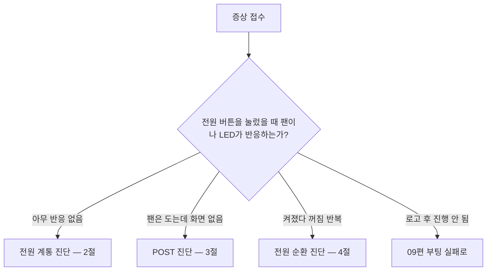

## "안 켜져요"는 다섯 가지 다른 말이다

정비 현장에서 가장 많이 듣는 문장이 "컴퓨터가 안 켜져요"입니다. 그런데 이 말은 다음 다섯 가지 중 어느 것인지 전혀 알려 주지 않습니다.

| 사용자의 표현 | 실제 상태 | 기술적 이름 |
|---------------|-----------|-------------|
| 아무 반응이 없어요 | 팬도 LED도 안 돎 | 전원 무반응 |
| 팬은 도는데 화면이 없어요 | 전원은 들어옴, 화면 신호 없음 | POST 실패 |
| 삐 소리가 나요 | POST가 오류를 알림 | 비프 코드 발생 |
| 켜졌다 꺼졌다 반복해요 | 전원이 유지되지 못함 | 전원 순환 |
| 로고는 뜨는데 그다음이 없어요 | POST는 통과, OS 로딩 실패 | 부팅 실패 — 09편 |

**진단의 첫 걸음은 이 다섯 중 어느 것인지 확정하는 것**입니다. 이 구분을 건너뛰면 엉뚱한 부품을 교체하게 됩니다. 실기 서술형에서도 "증상을 구체화한다"는 문장이 절차의 첫 줄로 요구됩니다.

## 1. 대분기 — 전원이 들어오는가

```mermaid
graph TD
  A[증상 접수] --> B{전원 버튼을 눌렀을 때 팬이나 LED가 반응하는가?}
  B -->|아무 반응 없음| C[전원 계통 진단 — 2절]
  B -->|팬은 도는데 화면 없음| D[POST 진단 — 3절]
  B -->|켜졌다 꺼짐 반복| E[전원 순환 진단 — 4절]
  B -->|로고 후 진행 안 됨| F[09편 부팅 실패로]
```

## 2. 전원 무반응 — 바깥부터 안쪽으로

전기가 흐르는 경로를 따라 **콘센트에서 메인보드 쪽으로** 순서대로 확인합니다. 가장 흔하고 가장 싼 원인부터 배제하는 것이 원칙입니다.

<Callout type="warning">
  **실기 감점 포인트:** 이 절차를 건너뛰고 곧바로 "파워 불량으로 교체"라고 답하는 것. 실기 서술형은 **배제 순서 자체**를 채점합니다. 콘센트 → 케이블 → 스위치 → 전면 패널 → 커넥터 → 파워 단독 → 최소 구성의 순서를 쓰는 것이 점수입니다.
</Callout>

### 파워 서플라이의 대기 전력과 PS_ON 원리

파워는 전원 케이블만 꽂혀 있으면 스위치가 꺼진 상태여도 **`+5VSB`**(Standby, 대기)라는 전압을 메인보드에 계속 공급합니다. 메인보드는 이 대기 전력으로 전원 버튼 입력을 기다립니다.

버튼을 누르면 메인보드가 `PS_ON` 신호선을 접지(0V)로 끌어내리고, 파워는 그 신호를 보고 나머지 모든 전압(`+12V`, `+5V`, `+3.3V`)을 출력하기 시작합니다. 파워 단독 테스트에서 초록선과 검은선을 잇는 것은 이 `PS_ON` 신호를 사람이 손으로 만들어 주는 것입니다.

이 구조를 알면 왜 "전원 케이블을 뽑고 전원 버튼을 3초 누르라"는 지시가 있는지 이해됩니다. 대기 전력과 축전기에 남은 전하를 소진시켜 완전한 무전원 상태를 만들기 위해서입니다.

## 3. POST 실패 — 팬은 도는데 화면이 없다

**POST**(Power-On Self Test, 전원 인가 자체 검사)는 전원이 들어온 직후 BIOS가 CPU·메모리·그래픽 순으로 최소 부품을 점검하는 과정입니다. 이 과정을 통과하지 못하면 화면 출력조차 시작되지 않습니다.

화면이 없다는 것은 곧 "**에러 메시지를 볼 방법이 없다**"는 뜻입니다. 그래서 다른 감각을 씁니다.

| 단서 | 확인 방법 | 읽는 법 |
|------|-----------|---------|
| 비프음 | 메인보드 스피커 소리 | 패턴별 오류 부위 |
| Q-LED / 디버그 LED | 보드 위 CPU·DRAM·VGA·BOOT LED | 켜진 채 멈춘 단계가 문제 부위 |
| POST 코드 | 두 자리 숫자 표시창 | 매뉴얼의 코드 표와 대조 |
| 팬 회전 양상 | 전속 회전 후 유지 여부 | 전속 고정은 초기화 실패 신호 |

### 비프 코드

메인보드에 스피커가 연결되어 있어야 들립니다. 요즘 케이스에는 스피커가 빠진 경우가 많으므로, 진단용 소형 스피커를 `SPEAKER` 헤더에 꽂는 것이 실무 요령입니다.

| BIOS 계열 | 패턴 | 의미 |
|-----------|------|------|
| AMI | 짧게 1회 | 정상 |
| AMI | 짧게 3회 | 메모리 오류 |
| AMI | 짧게 5회 | CPU 오류 |
| AMI | 짧게 8회 | 그래픽 메모리 오류 |
| 어워드 | 길게 1회 + 짧게 2회 | 그래픽 오류 |
| 어워드 | 길게 반복 | 메모리 미장착·접촉 불량 |
| 공통 | 소리 없음, 화면 없음 | 전원·CPU·보드 계통 |

정확한 코드는 보드 매뉴얼이 최종 기준입니다. 다만 **긴 비프 반복은 메모리, 길게 한 번 + 짧게 두세 번은 그래픽**이라는 큰 틀은 계열을 넘어 대체로 통합니다.

### POST 실패 배제 절차

**CMOS**(Complementary Metal-Oxide-Semiconductor)는 BIOS 설정값과 시간을 담는 소형 메모리로, 전원이 꺼져도 코인 전지의 힘으로 내용을 유지합니다. 그래서 **부팅할 때마다 시간이 초기화되고 BIOS 설정이 풀린다면, 답은 코인 전지 수명 소진**입니다.

## 4. 전원 순환 — 켜졌다 꺼졌다 반복

전원이 들어왔다가 몇 초 만에 꺼지고 다시 켜지는 증상입니다. 원인은 크게 셋입니다.

| 원인 | 근거 | 확인 |
|------|------|------|
| 과열 보호 동작 | CPU 쿨러 미밀착·팬 정지 | 쿨러 장착 상태, `PC Health Status` 온도 |
| 전원 용량 부족·불안정 | 고사양 그래픽 부착 시 발생 | 파워 정격 출력, `+12V` 전압 |
| 단락(합선) | 보드가 케이스 금속에 닿음 | 지지 기둥 위치, 최소 구성 테스트 |

과열 보호는 CPU가 위험 온도에 도달하면 스스로 전원을 끊는 안전장치입니다. 쿨러를 나사 한쪽만 조였거나, 써멀 그리스를 바르지 않았거나, 팬 전원을 연결하지 않았을 때 나타납니다. 03편의 체결 절차를 다시 확인하세요.

## 5. BIOS 진단 화면 읽기

화면이 나오는 상태라면 BIOS의 `PC Health Status` 에서 다음을 확인합니다.

| 항목 | 정상 범위(참고) | 벗어났을 때의 의미 |
|------|------------------|--------------------|
| CPU Temperature | 유휴 시 대략 30–50도 | 60도 이상 유휴는 쿨링 불량 |
| CPU Fan Speed | 수백–수천 RPM | `0` 이면 팬 정지 또는 헤더 미연결 |
| `+12V` | 약 11.4–12.6V | 크게 낮으면 파워 노후·부하 과다 |
| `+5V` | 약 4.75–5.25V | 벗어나면 파워 계통 점검 |
| `+3.3V` | 약 3.14–3.47V | 벗어나면 파워 계통 점검 |

전압 허용 범위는 정격의 약 5퍼센트입니다. 예를 들어 `+12V` 라면 다음과 같이 계산됩니다.

$$
12 \times 0.05 = 0.6
$$

- $12$ : 정격 전압(V)
- $0.05$ : 허용 오차 5퍼센트

따라서 허용 범위는 다음과 같습니다.

$$
12 - 0.6 = 11.4
$$

$$
12 + 0.6 = 12.6
$$

BIOS의 전압 표시는 참고값이므로, 값이 애매하면 파워 테스터나 멀티미터로 재는 것이 정확합니다.

## 6. 증상별 1순위 조치 요약

| 증상 | 1순위 | 2순위 | 3순위 |
|------|-------|-------|-------|
| 완전 무반응 | 콘센트·케이블·스위치 | 전면 패널 단락 테스트 | 파워 단독 테스트 |
| 팬만 돌고 화면 없음 | 모니터 입력·케이블 위치 | 메모리 재장착 | 그래픽카드 재장착 |
| 긴 비프 반복 | 메모리 재장착 | 슬롯 변경 | 모듈 교체 |
| 길게 1회 + 짧게 2회 | 그래픽카드 재장착 | 보조 전원 확인 | 다른 슬롯·다른 카드 |
| 켜졌다 꺼짐 반복 | 쿨러 밀착·팬 회전 | 파워 용량 | 케이스 단락 |
| 부팅마다 시간 초기화 | 코인 전지 교체 | – | – |
| 부팅 시 CPU Fan Error | 팬을 `CPU_FAN` 에 연결 | 팬 회전 확인 | – |

## 7. 진단할 때 지켜야 할 두 가지 원칙

### ① 한 번에 하나만 바꾼다

메모리도 옮기고 그래픽도 빼고 CMOS도 초기화하면, 고쳐져도 원인을 모릅니다. 원인을 모르면 같은 고장이 재발했을 때 처음부터 다시 해야 하고, 실기 서술형에서는 이 원칙을 쓰지 않으면 감점됩니다.

### ② 싸고 흔한 것부터 배제한다

콘센트 확인은 0원이고 파워 교체는 수만 원입니다. 확률과 비용이 모두 낮은 쪽부터 지워 나가는 것이 진단의 경제학입니다.

## 핵심 정리

- "안 켜진다"는 전원 무반응·POST 실패·비프 발생·전원 순환·부팅 실패 다섯 가지로 먼저 구분합니다.
- 전원 무반응은 콘센트 → 케이블 → 파워 스위치·전압 선택 → 전면 패널 → 24핀과 CPU 8핀 → 파워 단독 → 최소 구성 순으로 배제합니다.
- 화면이 없을 때는 비프음, 디버그 LED, POST 코드가 유일한 단서이며 긴 비프 반복은 메모리를 먼저 의심합니다.
- 부팅할 때마다 시간과 BIOS 설정이 초기화되면 CMOS 코인 전지 수명이 원인입니다.
- 켜졌다 꺼짐이 반복되면 과열 보호, 전원 용량 부족, 케이스 단락 세 가지를 순서대로 확인합니다.

## 마무리 복습

<Quiz
  questionNumber={1}
  question={"전원 버튼을 눌러도 팬과 LED가 전혀 반응하지 않을 때 가장 먼저 확인해야 할 것은?"}
  options={["CPU 온도","콘센트와 전원 케이블 및 파워 스위치 상태","그래픽카드 장착 상태","운영체제 파티션 상태"]}
  correctAnswer={2}
  explanation={"진단은 가장 싸고 흔한 원인부터 배제합니다. 콘센트, 멀티탭 스위치, 전원 케이블, 파워 뒷면 스위치가 전원 무반응의 최다 원인입니다."}
/>

<Quiz
  questionNumber={2}
  question={"메인보드 전면 패널 헤더에서 PWR_SW 두 핀을 순간 단락시켰더니 전원이 들어왔다면 원인은?"}
  options={["파워 서플라이 불량","케이스 전원 버튼 또는 전면 패널 배선 불량","CPU 불량","메모리 불량"]}
  correctAnswer={2}
  explanation={"보드에서 직접 단락시켜 켜졌다는 것은 보드와 파워는 정상이라는 뜻입니다. 신호를 전달하는 케이스 버튼이나 배선에 문제가 있습니다."}
/>

<Quiz
  questionNumber={3}
  question={"파워 서플라이 단독 테스트에서 24핀 커넥터의 어떤 선을 이어야 팬이 도는가?"}
  options={["빨간색과 노란색","초록색과 검은색","주황색과 파란색","흰색과 회색"]}
  correctAnswer={2}
  explanation={"초록색 선은 PS_ON 신호선이고 검은색은 접지입니다. 메인보드가 하는 일을 사람이 대신해 PS_ON을 접지로 끌어내리면 파워가 출력을 시작합니다."}
/>

## 참고 자료

- [한국정보통신자격협회 - PC정비사 2급](https://www.icqa.or.kr/cn/page/pc)
- [Intel - How to Configure the System in UEFI Mode before Installing Windows](https://www.intel.com/content/www/us/en/support/articles/000025535/memory-and-storage/intel-optane-memory.html)
- [UEFI Forum - Windows Boot Environment](https://uefi.org/sites/default/files/resources/UEFI-Plugfest-WindowsBootEnvironment.pdf)
